# Present-Pacing — display sync, frame latency, and the wallclock cap

> Part of the 3DMark05 GT1 perf-bottleneck investigation. Root map:
> [[overview-3dmark05-gt1]].

## Scope & question

This domain owns the **CPU/sync side** of GT1 wallclock: why
`completion_wait_ms` (the time the completion handler thread spends in
`MTLCommandBuffer.waitUntilCompleted()`) reached 28-31 s while
`gpu_command_buffer_time_ms` was only ~4 s, where that gap actually lives,
and which production-safe knobs can recover the slack without breaking
visual sync.

Every finding here moves *wallclock fps* directly, not GPU frame time. The
GPU frame-time story is owned by [[hidden-backend-storage]] /
[[index-cache-locality]]; the per-CB encode story by [[state-churn-encode]].

## Hypotheses & verdicts

| # | Hypothesis | Verdict | Evidence |
|---|------------|---------|----------|
| H1 | `completion_wait_ms` is dominated by Present-bearing CBs, not draw/blit/sync/queue waits | accepted | [[present-pacing-display-sync.01]] (100% `completion_present_wait_ms`) |
| H2 | The wait is display/present-completion pacing (`waitUntilCompleted()` returning after drawable/compositor acceptance) rather than pure GPU compute | accepted historically; current mechanism refined | [[present-pacing-display-sync.01]] showed the original display-sync attribution. Current [[present-pacing-current-immediate.02]] shows GT1 direct now requests Immediate and never uses `presentDrawableAfterMinimumDuration`, yet `completion_present_wait_ms` remains ~39 s. [[present-pacing-completion-watcher-status.03]] shows the watcher pops immediately (`p50 0.041ms`, `pending_depth_max=0`) and waits mostly from `Committed` status. |
| H3 | Per-CB encode (`encode_draw_cpu_ms / CB`) sits at ~11 ms, near the 16.67 ms vsync budget | accepted | [[present-pacing-display-sync.01]] (per-CB encode 11.45 ms baseline, 11.23 ms DSync-off) |
| H4 | `DXMT9_MAX_FRAME_LATENCY=3` + `DXMT9_CAP_FRAME_LATENCY_TO_BACKBUFFERS=0` recovers slack with vsync on | rejected | [[present-pacing-frame-latency.01]] (wallclock Δ +0.07%, p95 +31%) |
| H5 | `DXMT9_PRESENT_ASYNC_ACQUIRE=1` reduces the completion-path acquire cost | rejected (axis not load-bearing) | [[present-pacing-async-acquire.01]] (acquire wait −37.5% but axis < 0.5% of total; wallclock Δ +0.22%) |
| H6 | Reducing per-CB encode below the vsync budget (<= 16.67 ms / CB) restores fps without changing pacing policy | open, with CPU wins | [[present-pacing-encode-budget.01]] sized the gap; [[present-pacing-bind-cache-work-a.01]] rejected broad bind-cache as the main lever; cbuf identity repoint, plan-direct binding-packet cache, component-hash reuse, usage-aware payload hashing, and FFP known-zero usage are accepted CPU wins. Latest [[snapshot-cache-snapshot.09]] sample is still not a vsync-on fps proof: `completion_wait_ms=39978.924`, `encode_draw_cpu_ms=17711.215`, and `d3d9_snapshot_draw_submission_cpu_ms=7196.881` over `1740` presents. [[state-churn-encode-encode-phase.09]] splits argbuf open: reserve `745.942ms`, `setArgumentBuffer=115.192ms`, table bind `192.913ms`, table-bind skip `0`; [[state-churn-encode-encode-phase.10]] then cuts reserve by `-51.95%` and `encode_draw_cpu_ms` by `-3.87%` in a same-present A/B. [[state-churn-encode-encode-phase.11]] rejects dirty-category identity repoint (`0` hits). [[state-churn-encode-encode-phase.12]] splits `stream_bind` into texture/sampler (`1065ms`), index (`670ms`), shader stream (`497ms`), and raster (`389ms`) phases; [[state-churn-encode-encode-phase.13]] narrows texture/sampler to fragment resolve (`575ms`) and fragment direct bind (`317ms`); [[state-churn-encode-encode-phase.14]] accepts sampler pre-handle skip as a CPU win (`texture_sampler` -18.84%, `encode_draw` -117ms); [[state-churn-encode-encode-phase.15]] then reuses the packet sampler-state hash (`fragment_direct` -68ms, texture/sampler parent -69.6ms); [[state-churn-encode-encode-phase.16]] rejects texture pre-resolve skip as a default win (`1.206M` skips but texture/sampler parent +48ms), removes the rejected branch, and verifies texture/sampler parent returns to baseline (`822.864 -> 821.007`). The next no-gputrace targets remain named encode buckets plus residual snapshot hash/indexed-fallback work. |
| H7 | A user-opt-in vsync-off env recovers fps without a code-side encode optimisation | accepted historically; not load-bearing for current GT1 direct path | [[present-pacing-vsync-off.01]] measured a full-workload wallclock win when the present path was sync-paced. Current [[present-pacing-current-immediate.02]] shows both default and `DXMT9_DISABLE_VSYNC=1` already use `present_schedule_immediate=1680`, frame p50/p95 are flat, and `present_schedule_after_minimum_duration=0`. |
| H8 | Completion wait is caused by completion watcher backlog | rejected | [[present-pacing-completion-watcher-status.03]]: `completion_pending_depth_max=0`, dequeue age p50/p95 `0.041/0.067ms`, and `completion_dequeue_status_completed=0`. The watcher is not late; it waits on just-committed command buffers. |
| H9 | Current average FPS should be attacked through P2/P3 CPU cadence plus P4 present-completion wait, not hot-frame GPU locality first | accepted gate split | [[present-pacing-current-fps-owner.04]]: current low-overhead scout has sampled FPS p50/p95 `18.102/26.630`, frame wall p50/p95 `55.242/84.648ms`, `completion_present_wait_ms=25.091ms/present`, `gpu_command_buffer_time_ms=3.113ms/present`, immediate presents only, `present_boundary_wait_ms=0`, and `completion_pending_depth_max=0`. GPU locality remains a hot-frame/ceiling lane, but average FPS requires P2/P3 wins and P4 pipeline-depth recovery. |
| H10 | Completion wait is overlapped by next-frame enqueue/encode work | rejected; hard under-pipelining accepted | [[present-pacing-pipeline-overlap.05]]: `1799 / 1799` waits have no later CB enqueue during `waitUntilCompleted()`, `completion_wait_with_enqueue_ms=0`, `completion_wait_without_enqueue_ms=44789.044`, `completion_enqueue_while_waiting=0`, and enqueue-side pending depth max is only `1`. Stage run: wait-end -> publish/encode-dequeue/Metal-commit/enqueue p50 `16.645/20.116/36.470/36.502ms`, so producer and encode work both run after the wait instead of hiding under it. |
| H11 | `DXMT9_DISABLE_PRESENT_BOUNDARY` or deeper `DXMT9_MAX_FRAME_LATENCY` makes the producer run while completion waits | rejected as current owner | [[present-pacing-boundary-latency-ab.06]]: fresh baseline, boundary-disabled, and latency6 scouts all keep `present_boundary_waits=0`, `completion_wait_without_enqueue_ms≈44.0-44.5s`, and sampled FPS p50 `17.8-18.0`. `DXMT9_DISABLE_PRESENT_BOUNDARY=1` reaches the runtime (`present_boundary_skipped=1740`) but creates only one noise-level overlap event also seen in baseline. The remaining owner is before `CommitPublish` or outside dxmt9's explicit boundary wait. |
| H12 | The post-wait producer gap is app/Wine/macdrv-side, before unix `commit_chunk` entry | rejected; unix replay/submit owner accepted | [[present-pacing-prepublish-stage.07]]: wait-end -> `commit_chunk` entry p50/p95 is only `1.040/2.668ms`, while wait-end -> `CommitPublish` is `15.894/29.912ms` and wait-end -> Metal commit is `22.276/54.146ms`. `commit_chunk_replay_cpu_ms=18981.064`, nested queue draw submission is `8154.509ms`, and nested snapshot submission is `6636.191ms`, so the average-FPS lane remains commit/replay/snapshot/encode, not app/Wine event pacing. |
| H13 | Same-sample stage deltas can split the exposed no-enqueue gap without subtracting unrelated percentiles | accepted | [[present-pacing-stage-delta.08]]: current 120s scout keeps `completion_wait_with_enqueue_ms=0`, then splits the exposed path into `commit_chunk entry -> CommitPublish` p50/p95 `6.172/28.101ms`, `CommitPublish -> EncodeDequeue` `2.535/5.086ms`, and `EncodeDequeue -> commandBuffer.commit()` `11.384/22.232ms`. Queue wake is secondary; pre-publish replay/submit/snapshot and backend encode are the two load-bearing CPU stages. |
| H14 | The app thread is blocked inside PE `Present()` for the whole completion wait | rejected | [[present-pacing-pe-present-timing.09]]: with `DXMT9_PE_RECORDER_STATS=1 DXMT_LOG_LEVEL=info`, PE `Present total_ms` p50/p95/max is only `2.580/5.077/22.659ms`, almost entirely `flush_ms`, while `completion_wait_ms` p50/p95/max is `28.419/39.576/52.217ms`. The next unix chunk still crosses quickly after completion (`wait_to_commit_chunk_entry` p50/p95 `0.888/3.025ms`), but that is not a PE API-call timestamp. |
| H15 | The app/Wine loop does not call D3D9 until Metal completion | rejected; PE-local next-frame recording accepted | [[present-pacing-pe-call-cadence.10]]: after successful PE `Present`, the next PE D3D9 call is almost always `BeginScene` (`1702 / 1703` rows) and arrives with `entry_delta_ms` p50/p95/p99 `0.310/0.436/1.811ms`. `completion_wait_with_enqueue_ms=0` still holds, so the missing overlap is not app API-call cadence; it is PE-recorder/unix submission boundary or later (`commit_chunk` replay/publish/snapshot and backend encode). |
| H16 | PE-local next-frame work crosses into unix immediately after the first PE call | rejected; chunk-fill cadence accepted | [[present-pacing-pe-chunk-cadence.11]]: first PE call p50 is `0.308ms`, but the first non-empty chunk after `Present` is always `capacity_post`, always `64` records, and crosses into unix at steady p50/p95 `19.908/34.810ms` after `Present` return. The first bridge itself is cheap (`bridge_ms` p50/p95 `0.504/0.617ms`). |
| H17 | Lowering PE chunk capacity from `64` to `32` creates producer run-ahead | rejected as a simple knob | [[present-pacing-pe-chunk-size-ab.12]]: chunk32 reaches the recorder (`recordCount=32`) and slightly lowers first-chunk p50 (`19.908 -> 19.034ms`) and no-enqueue wait-to-commit-entry p50 (`0.917 -> 0.471ms`), but `completion_wait_with_enqueue_ms` remains `0.000` and replay/encode do not materially improve. Earlier publish remains an architecture experiment, not a global capacity knob. |
| H18 | The first chunk is late because filling 64 records takes most of the time | rejected; first-record append delay accepted | [[present-pacing-pe-record-milestones.13]]: after `Present`, `BeginScene` still arrives at p50 `0.306ms`, but the first appendable record is `apply_state` at p50 `18.061ms`. Records `1 -> 64` then arrive quickly (`18.061 -> 19.683ms` p50), and the first chunk follows at `19.706ms`. Chunk threshold is not the front gate; the first record-producing state/draw boundary is. |
| H19 | The hidden N+1 dependency sits on one of the first D3D9 calls after `Present` | rejected; initial call-sequence attribution superseded | [[present-pacing-pe-call-sequence.14]]: calls `1..4` after `Present` are `BeginScene`, `GetRenderTarget`, `GetRenderTarget`, and `SetRenderTarget`, all at p50 `<= 0.532ms`. The run initially placed the long gap before `SetVertexShaderConstantF`, but that was incomplete because `Clear` and `EndScene` were not in the call milestone sequence. |
| H20 | The first record-producing front gate is `Clear`, after a post-RT-setup gap | accepted | [[present-pacing-pe-clear-gate.15]]: with `Clear`/`EndScene` included, call 5 is steady `Clear` at p50 `18.408ms`; `SetRenderTarget` return is p50 `0.581ms` with only `0.015ms` duration, so `SetRenderTarget` is not the sleeper. The p50 gap is `SetRenderTarget` return -> `Clear` entry `17.635ms`; record 1 `apply_state` is appended inside `Clear` at p50 `18.554ms`, and the first `capacity_post` chunk follows at p50 `20.400ms`. |
| H21 | Frame-sampling logs create or amplify the post-RT-setup `Clear` gate | rejected | [[present-pacing-pe-clear-nosampling.16]]: removing `--frame-sampling` drops `dxmt9-perf-frame` lines from `1,726` to `0`, but `SetRenderTarget` return -> `Clear` entry remains p50 `17.651ms -> 17.646ms` and first chunk remains p50 `20.402ms -> 20.386ms`. The perf-frame line is a correlation marker, not the stall owner. |
| H22 | The apparent `SetRenderTarget` -> `Clear` gap is really an uninstrumented child getter stall | rejected; hidden calls found but not sleeper | [[present-pacing-pe-wide-call-coverage.17]]: wider coverage reveals `Surface::GetDesc` and `Texture::GetSurfaceLevel` before `Clear`, but child return logging shows they return quickly (`Surface::GetDesc` call 7 duration p50 `0.013ms`, `Texture::GetSurfaceLevel` p50 `0.054ms`). The last logged return is p50 `0.674ms`, and `Clear` still enters at p50 `18.421ms`, leaving a `17.656ms` p50 gap. |
| H23 | The remaining front gap is a broad app/Wine runloop or macdrv sleep | rejected as broad owner; exact PC owner open | [[present-pacing-xctrace-threadstate.18]]: re-exported `Metal System Trace` CPU tables show the D3D/Wine producer thread `0x3b1b5c` has `15,354ms` Running sample weight across a `15.563s` trace, while `runloop-events` has only two `3DMark05.exe` rows on a different main thread. This does not pinpoint the current `SetRenderTarget` -> `Clear` PC, but it weakens sleep/runloop as the broad explanation. |
| H24 | The `Clear` front gate is a hidden dxmt9 D3D9 API wait | rejected; wrapper-level attribution accepted, higher owner superseded | [[present-pacing-pe-caller-pc.19]]: PE caller-PC/module logging shows the steady sequence is identical in `1,716 / 1,716` ordinals. `SetRenderTarget` returns from 3DMark05.exe wrapper RVA `0x2AF4F` at p50 `0.730ms`, its nested `Surface::GetDesc` caller resolves to `d3d9.dll!0x13EE9` and takes only p50 `0.020ms`, and `Clear` enters later from 3DMark05.exe wrapper RVA `0x2B061` at p50 `18.373ms`. The p50 `17.484ms` gap is not inside `SetRenderTarget`, `Clear`, or a hidden child getter. Caller-stack follow-up supersedes the claim that these wrapper RVAs are the higher render-loop owner. |
| H25 | The stable owner above the wrapper stubs is still hidden | rejected; 3DMark05 command-dispatch cadence accepted | [[present-pacing-pe-caller-stack.20]]: PE stack logging shows milestones 2..8 share higher frame `3DMark05.exe+0x88760` in `1,707 / 1,707` matching ordinals. `0x2AF4F` and `0x2B061` are D3D wrapper stubs; `0x88760` is the return site of a command-object dispatcher (`0x4886E0`) whose virtual `call *0x18(%eax)` executes the D3D wrapper command. `SetRenderTarget` return -> `Clear` entry remains p50 `17.429ms`. The front gate is therefore when 3DMark05 dispatches the record-producing `Clear` command object, not a dxmt9 boundary/latency/ring wait. |
| H26 | The `Clear` front gate or next Metal enqueue waits on dxmt9 completed-seq/waterline publication | rejected for dxmt9 completion signal; actual Metal/CA completion remains separate | [[present-pacing-completion-signal-delay.21]]: `DXMT9_PERF_COMPLETION_SIGNAL_DELAY_MS=8` applies `1696` sleeps / `13568ms` after `waitUntilCompleted()` and before completed-seq publication, but `SetRenderTarget -> Clear` p50 stays `17.631 -> 17.550ms`, first chunk p50 stays `20.802 -> 20.827ms`, and next enqueue p50 stays `21.558 -> 20.274ms`. The front gate is not waiting on dxmt9's completion signal. |
| H27 | Flushing the PE chunk immediately after `Clear` creates producer overlap | rejected as a simple early-publish lever | [[present-pacing-pe-clear-flush.22]]: `DXMT9_PE_FLUSH_AFTER_CLEAR=1` changes the first chunk from `capacity_post` / `64` records to `clear` / `2` records and moves first-chunk p50 `20.582 -> 18.935ms`, but `completion_wait_with_enqueue_ms` remains `0.000`, `completion_enqueue_while_waiting=0`, and `commitCount` rises `41947 -> 45857`. Keep it diagnostic-only; continue P2/P3 replay/snapshot/encode reductions or a larger producer-overlap design. |
| H28 | The current low-overhead code state makes `DXMT9_PE_FLUSH_AFTER_CLEAR=1` useful after recent encode/copy cleanup | rejected-current | [[present-pacing-pe-clear-flush.23]]: matching recorder-stats runs still move the first chunk earlier (`20.710 -> 19.089ms`) and shrink it (`64 -> 2` records), but `completion_wait_with_enqueue` moves `2 -> 0`, tail-600 FPS p50 moves `15.788 -> 15.681`, and `commitCount` rises `41,429 -> 45,617`. |
| H29 | Current low-overhead FPS is blocked by serialized post-wait P2/P3 work, not by missing app/D3D9 calls after completion | accepted attribution | [[present-pacing-lowoverhead-serial.24]]: the next unix commit entry follows completion quickly (`0.861ms` p50), while same-cycle post-wait stages remain large: `commit_chunk entry -> CommitPublish` `14.068ms` p50, `CommitPublish -> EncodeDequeue` `3.678ms`, and `EncodeDequeue -> commandBuffer.commit()` `11.528ms`. Disabling Stage 2 argbuf cuts encode per present (`9.388 -> 6.143ms`) but raises completion wait (`27.116 -> 31.148ms/present`), so local CPU wins need a P4/overlap proof. |
| H30 | Raising the mid-chunk sub-command-buffer cap recovers average FPS by allowing more early commits | rejected-current | [[present-pacing-subcb-cap.25]]: `DXMT9_MID_CHUNK_COMMIT_CAP_PER_RENDER_PASS=8` reaches the runtime (`chunk_subcb_count_max 4 -> 8`), doubles sub-CBs (`5,355 -> 12,173`), and drops cap suppression (`8,658 -> 1,471`), but tail-600 FPS p50 worsens (`16.849 -> 16.665`), completion wait per present rises (`27.116 -> 28.900ms`), and wait-end -> next-enqueue p50 worsens (`15.135 -> 19.980ms`). |
| H31 | Moving publish-time PSO prefetch out of the serialized Present publish path can improve sampled FPS even if encode lookup rises | accepted placement signal; superseded by H32 default | [[present-pacing-publish-pso-prefetch.26]]: `DXMT9_DISABLE_PUBLISH_PSO_PREFETCH=1` cuts Present replay by `-2.488ms/present`, raises encode pipeline lookup by `+2.222ms/present`, reduces `completion_wait_ms` by `-2.420ms/present`, and improves repeated warm FPS p50 by `+0.564`. |
| H32 | Encode-slot PSO prefetch is a better default than publish-time PSO prefetch for current GT1 | accepted default | [[present-pacing-publish-pso-prefetch.27]]: default run keeps `encode_draw_pso_prefetch_handle_missing=0`, moves `prepare_slot_pso_prefetch_cpu_ms` to `0`, records `encode_slot_pso_prefetch_cpu_ms=2.605ms/present`, cuts completion wait by `-1.509ms/present`, and improves warm FPS avg by `+0.717`. |
| H33 | The remaining PSO prefetch work is now an encode-stage key/lookup problem, not a Present pacing problem | accepted attribution | [[state-churn-encode-encode-phase.71]]: split counters show `encode_slot_pso_prefetch_cpu_ms=2.806ms/present`, dominated by draw PSO lookup/key work at `2.506ms/present`; `prepare_slot_pso_prefetch_cpu_ms` remains effectively zero and handle misses remain `0`. |
| H34 | Wine's synchronous `OnMainThread()` marshaling is a plausible transmission path for the `SetRenderTarget` return -> `Clear` entry gate | source-audit hypothesis | [[present-pacing-winemac-onmainthread.28]]: Wine `OnMainThread()` can block an app thread until the Cocoa main thread runs the request; event-queue threads use `kevent(..., NULL)` and non-queue threads use `dispatch_semaphore_wait(..., DISPATCH_TIME_FOREVER)`. `ClipCursor`, cursor get/set, and window-frame getters can use it; dxmt9 does not call `macdrv_view_get_metal_layer` per frame and winemac does not issue `presentDrawable`. `GetCursorPos` is lower-priority because of win32u's 100ms cache, but a stale cursor timestamp can still fall through to winemac. The exact winemac call and main-thread holder remain unproven and require threshold logging joined to PE milestones. |
| H35 | The non-invasive P4 fallback should export xctrace CPU thread summaries alongside Metal timing | accepted tooling | [[present-pacing-xctrace-cpu-summary-tooling.29]] adds `summarize_xctrace_cpu_threads.py` and `run_3dmark05_system_trace_sidecar.sh --export-cpu-summary`. Existing `phase43` smoke parses `20,964` `time-profile` rows and `20,989` `time-sample` rows; producer thread `0x3b1b5c` remains `15,354ms` running with zero `OnMainThread` / `kevent` / `dispatch_semaphore_wait` hits, and the generated P4 scout verdict is `producer-running-negative-scout`, while `5` non-producer wait hits stay on callback-like threads. |
| H36 | PE `thread_id=...` rows can be extracted on a current-head sidecar, but they do not directly select xctrace threads | inconclusive; native id mapping required | [[present-pacing-xctrace-cpu-summary-current.30]]: `winemac-onmainthread-xctrace-r2` completed with xctrace/wrapper status `0`, joined `1528/1528` encoder rows, and parsed `13,509` `time-profile` plus `13,540` `time-sample` rows. The PE log had `45,053` `pe_present_*` rows with a single `thread_id=0xd0`, selected from `pe-log-clear-return`, but no xctrace thread label or `thread-info` `tid` matched `0xd0`; verdict `producer-thread-not-found`. This proves the PE id is in the Win32 namespace for this purpose. The next P4 proof needs native Mach/pthread id mapping or Wine/macdrv threshold telemetry before promoting or rejecting `OnMainThread` as the owner. |
| H37 | Same-run native producer-thread selection should come from the unix replay boundary, not PE `GetCurrentThreadId()` | accepted tooling; needs next trace | `dxmt9c_device_commit_chunk` now logs `unix_commit_chunk_entry native_tid=0x...` under the existing `DXMT9_PE_RECORDER_STATS=1` diagnostic gate, and the xctrace CPU summarizer prefers that native id before falling back to PE `thread_id=0x...`. This directly addresses H36's namespace mismatch while preserving the same sidecar flow. The next proof run is `--export-cpu-summary --cpu-producer-from-pe-log`; pass condition is a selected native producer row with decisive `OnMainThread`/wait evidence or a strong negative on the actual producer. |
| H38 | Native-selector xctrace scout does not find producer-thread `OnMainThread`/wait evidence | negative scout; P2/P3 remains primary | [[present-pacing-native-selector-xctrace.31]]: `winemac-onmainthread-xctrace-r3` completed with xctrace/wrapper status `0`. The direct log had `40,044` `unix_commit_chunk_entry native_tid=0x5cef8b` rows and `46,031` PE rows with `thread_id=0xd0`; the CPU summary selected native source `native-log-commit-chunk-entry` and matched xctrace `tid=0x5cef8b`. The selected producer was sampled `10427/10427` rows Running, with `0` producer wait keyword hits and only `2` non-producer wait hits. The same run still has `completion_present_wait_ms/present=27.589ms`, `completion_present_wait_with_enqueue_ms=0`, `commit_entry_to_publish` p50/p95 `16.701/38.664ms`, and `encode_chunk_cpu_ms/present=14.597ms`. |
| H39 | Default-on resource-shape path still does not show producer-thread wait evidence | negative scout; P2/P3 remains primary | [[present-pacing-native-selector-xctrace.32]] repeats the native-selector System Trace after [[state-churn-encode-encode-phase.81]] makes the resource-shape PSO memo default-on. The selected native producer `0x61e72f` is sampled running in `10439 / 10439` rows with `0` producer wait keyword hits; non-producer wait hits are `3`. The run still has `completion_present_wait_with_enqueue_ms=0`, `completion_present_wait_ms/present=25.208ms`, `commit_entry_to_publish` p50/p95 `34.071/64.333ms`, and `encode_dequeue_to_command_buffer_commit` p50/p95 `26.705/37.060ms`. Because all-frame encoder breakdown is enabled, this is not a low-overhead FPS baseline, but it keeps broad winemac `OnMainThread` below replay/snapshot/encode serialization as the next average-FPS target. |
| H40 | Short System Trace sidecar remains useful while `.gputrace` is blocked, but does not find P4 producer wait evidence | negative scout; sidecar fallback accepted | [[present-pacing-systemtrace-p4-smoke.34]] uses a 2-second normal-rendering Metal System Trace while Xcode `.gputrace` attach is blocked by Developer Mode. It joins `306/306` encoder rows over seq `1114..1148`, selects native producer `0x6572ff`, samples it running in `2519 / 2519` rows, and finds `0` producer wait keyword hits. GPU timing remains vertex dominated (`93.07%` vertex share), with top rows all `opaque-depth-indexed` / `needs-programmable-color-route`; pacing counters still show no overlap (`completion_wait_with_enqueue_ms=0`) and large replay/snapshot/encode work after wait. |
| H41 | Current P4 System Trace sidecar still finds no producer wait-stack hit, but one blocked sample keeps the verdict inconclusive | accepted current constraint | [[present-pacing-systemtrace-p4-current.35]] repeats the 2-second System Trace sidecar on the current code state. It joins `386/386` encoder rows over seq `1052..1087`, selects native producer `0x665ec1`, and records `producer_wait_keyword_hits=0`; however the selected producer has `1` blocked row out of `2,429`, so the CPU verdict is `producer-state-inconclusive`, not a strict negative. Pacing is unchanged for the current owner split: `completion_wait_with_enqueue_ms=0`, `completion_wait_ms=26.319ms/present`, `commit_chunk_replay_cpu_ms=8.510ms/present`, and `encode_chunk_cpu_ms=13.254ms/present`. |
| H42 | Seq-range System Trace sidecar is the preferred blocked-gputrace P4 fallback | accepted fallback; negative scout | [[present-pacing-systemtrace-p4-range.36]] repeats the current sidecar with `--encoder-breakdown-seq-range 1000:1125`. It joins `395/395` encoder rows over seq `1037..1073`, cuts probe output from `553MiB` to `130MiB`, selects native producer `0x668652`, and returns `producer-running-negative-scout` with `2515/2515` producer samples running, `0` blocked rows, and `0` producer wait keyword hits. Pacing still has no overlap: `completion_wait_with_enqueue_ms=0`, `completion_wait_ms=27.606ms/present`, `commit_chunk_replay_cpu_ms=8.516ms/present`, and `encode_chunk_cpu_ms=10.874ms/present`. |
| H43 | P4 compare gates must distinguish total present wait from recovered overlap | accepted tooling | [[present-pacing-compare-gates.37]] extends `compare_3dmark05_perf_counters.py` with derived `completion_present_wait`, `completion_wait_with_enqueue`, and `completion_wait_without_enqueue` per-present/share metrics plus failure gates. Future average-FPS candidates can now require `--require-completion-present-wait-decrease`, `--require-completion-wait-with-enqueue-increase`, or `--require-completion-wait-without-enqueue-decrease` instead of accepting a local CPU win that only shifts wait between buckets. |
| H44 | P2/P3 serial-stage compare gates should be per-present and paired with P4 gates | accepted tooling | [[present-pacing-serial-stage-compare-gates.38]] extends the same compare report with per-present replay, queue draw-submission, snapshot, snapshot-cache, encode, and no-enqueue stage metrics. Future CPU-path candidates can require `--require-commit-chunk-replay-cpu-per-present-decrease`, `--require-encode-chunk-cpu-per-present-decrease`, or no-enqueue stage gates, then pair them with H43 P4 gates before claiming average-FPS movement. |
| H45 | Current low-overhead frame sampling still shows almost no completion overlap and large serialized CPU stages | accepted current baseline | [[present-pacing-frame-sampling-current.39]] runs a normal no-gputrace scout with `DXMT9_PERF_FRAME_SAMPLING=1` and the current compact-uniform opportunity gate. The run records `1,860` presents, sampled avg FPS `17.019`, wall p50/p95 `53.475/82.502ms`, completion wait p50/p95 `27.485/39.849ms`, GPU CB p50/p95 `1.058/13.878ms`, and encode chunk p50/p95 `9.413/18.048ms`. Only `9` waits overlap later enqueues (`398ms` total) while `completion_wait_without_enqueue_ms=50.645s`, so average-FPS work remains P2/P3 CPU reduction plus a larger overlap design rather than GPU-only locality. |
| H46 | Current-run summaries should classify P4 overlap and exposed CPU stages directly | accepted tooling | [[present-pacing-summary-triage.40]] adds a `Pacing / CPU Stage Derived` block to `summarize_3dmark05_perf.py`. The single-run summary now reports completion wait with/without enqueue, overlap/no-enqueue shares, replay/snapshot/encode per-present rows, no-enqueue stage p50/p95 rows, and a current-run verdict such as `under-pipelined-no-enqueue`. This does not replace H43/H44 A/B gates; it makes standalone scouts auditable before selecting the next CPU or overlap candidate. |
| H47 | Fresh summary-triage scout confirms current average-FPS owner | accepted current baseline | [[present-pacing-summary-triage-current.41]] runs the new summary block on a fresh low-overhead scout. It records `1,842` presents, sampled avg FPS `16.822`, wall p50/p95 `53.842/84.123ms`, `completion_wait_ms_per_present=27.599`, overlap share only `0.180%`, no-enqueue share `99.820%`, `commit_chunk_replay_cpu_ms_per_present=8.207`, and `encode_chunk_cpu_ms_per_present=10.566`. The summary verdict is `under-pipelined-no-enqueue`, with largest p50 no-enqueue row `encode dequeue -> command buffer commit`. |
| H48 | xctrace CPU summary should split producer wait evidence from main-thread/present holder evidence | accepted tooling | [[present-pacing-xctrace-holder-summary.42]] adds `p4_holder_keyword_hits`, `holder_status`, `main_thread_holder_keyword_hits`, and `nonproducer_holder_keyword_hits` to `summarize_xctrace_cpu_threads.py`. Producer verdicts still use `OnMainThread`/wait/macdrv keywords; holder fields separately expose `CA::Transaction`, `CAMetalLayer`, `presentDrawable`, and `nextDrawable` samples. The sidecar one-line verdict and manual stdout now surface the same holder split for quick triage. This keeps a future winemac-positive sidecar from conflating producer blocking with callback/main-thread holder noise. |
| H49 | Current post-cbuf-observer low-overhead scout keeps the same P4/P2/P3 owner split | accepted current baseline | [[present-pacing-current-lowoverhead.43]] runs a no-gputrace, no-encoder-breakdown, frame-sampling scout after the cbuf content observer was made opt-in. It renders a normal fog-heavy GT1 frame, records `1,860` presents, `completion_wait_without_enqueue_ms_per_present=26.839`, `completion_wait_with_enqueue_ms_per_present=0.210`, `gpu_command_buffer_time_ms_per_present=3.111`, `commit_chunk_replay_cpu_ms_per_present=8.074`, and `encode_chunk_cpu_ms_per_present=10.902`. The conclusion stays under-pipelined: average-FPS work is still serial replay/snapshot/encode reduction plus an overlap design, not another cbuf-content attribution pass. |
| H50 | Wine `OnMainThread()` should not be promoted to current-owner/capstone without new runtime proof | accepted review | [[present-pacing-winemac-onmainthread.44]] reviews the source audit against later native-selector System Trace scouts. The Wine mechanism is real and remains a patch point, but current runtime evidence samples the selected producer running with `0` wait-keyword hits while low-overhead P2/P3 work remains large. Keep broad winemac debugging below serialized replay/snapshot/encode and P4-overlap work unless a future native producer wait stack, x86_64 Wine threshold row, or low-overhead P4 movement contradicts it. |
| H51 | Stage 2b direct-cbuf removes argbuf table churn without moving the P4 owner | accepted local CPU win; P4 still open | [[present-pacing-direct-cbuf.45]] reviews the `DXMT9_ARGBUF_DIRECT_CBUF=1` no-gputrace scout. It removes the local argbuf table path (`argbuf_table_bind_calls=0`, `argbuf_setup=0`, cbuf update calls `0`) and lowers encode to `5.982ms/present`, but the run remains `under-pipelined-no-enqueue`: `completion_wait_without_enqueue=28.565ms/present`, overlap share `1.955%`, and `sampled_avg_fps=16.864`. The largest exposed p50 no-enqueue row is `commit entry -> publish`, so next average-FPS work returns to replay/snapshot/submit, backend encode children only with P4 gates, or an explicit overlap design. |
| H52 | Current default P2/P3 scout keeps the under-pipelined no-enqueue owner after capture-layer recovery | accepted current baseline | [[present-pacing-current-p2p3.46]] runs the current default no-gputrace scout after the capture-layer route was revalidated. It records `1,800` presents, sampled avg FPS `16.766`, `gpu_command_buffer_time_ms_per_present=3.218`, `completion_wait_without_enqueue_ms_per_present=27.475`, overlap share `0.086%`, `commit_chunk_replay_cpu_ms_per_present=8.325`, snapshot lookup `2.850ms/present`, and `encode_chunk_cpu_ms_per_present=11.152`. A same-run compare against direct-cbuf cuts encode by `-24.44%` but leaves FPS flat and no-enqueue wait worse, so average-FPS candidates still need P2/P3 gates paired with P4 overlap proof. |
| H53 | No-enqueue gaps already include many `commit_chunk` entries before the first publish | accepted attribution | [[present-pacing-noenqueue-beforepublish.47]] adds before-publish counters to the current scout. The run remains `under-pipelined-no-enqueue` (`completion_wait_without_enqueue_ms_per_present=27.151`, overlap share `2.114%`), but the first `CommitPublish` after a no-enqueue wait is preceded by p50 `12` `commit_chunk` entries/replay starts and p50 `11` replay ends. That rejects the broad "producer absent" framing; the exposed owners are first-publish formation (`commit entry -> publish` p50 `14.866ms`) and backend encode-to-Metal-commit (`17.218ms` p50), still gated by P4/FPS movement. |
| H54 | Before-publish chunks are draw/const heavy, and a draw-count publish limit creates overlap but hurts total cost | accepted attribution; rejected simple knob | [[present-pacing-drawchunk-limit.48]] classifies the current before-publish chunks: `93.1%` of scanned chunks have draw records, with `372.366` draw records and `348.008` const records per publish sample. `DXMT9_DRAW_CHUNK_COMMAND_LIMIT=64` proves earlier publish can create overlap (`completion_wait_with_enqueue_ms_per_present` `1.191 -> 21.032`, no-enqueue `26.568 -> 15.289`), but it worsens total completion wait (`27.759 -> 36.321ms/present`), GPU CB time (`3.309 -> 24.519ms/present`), command buffers (`7,199 -> 22,846`), render passes (`21,234 -> 26,280`), and tile preservation bytes (`+75.63%`). The next design must recover overlap without render-pass fragmentation. |
| H55 | Capture-layer repair does not change the current low-overhead P2/P3/P4 owner | accepted current baseline | [[present-pacing-current-lowoverhead.49]] reruns the normal no-gputrace low-overhead scout after file `.gputrace` capture and Xcode counter export were repaired. The run is visually normal and clean (`draw_skipped_no_pipeline=0`, `gpu_command_buffer_errors=0`), records `1,812` presents, sampled avg FPS `16.557`, GPU CB time `3.231ms/present`, completion wait `27.916ms/present`, no-enqueue wait `27.717ms/present`, replay `8.519ms/present`, snapshot lookup `2.919ms/present`, and encode chunk `11.348ms/present`. Verdict remains `under-pipelined-no-enqueue`; use this as the current-head low-overhead baseline before choosing another CPU/P4 candidate. |
| H56 | A larger draw-chunk limit still creates overlap by adding too much Metal work | rejected threshold sweep; mechanism accepted | [[present-pacing-drawchunk-limit-sweep.50]] tests `DXMT9_DRAW_CHUNK_COMMAND_LIMIT=256` against the current-head low-overhead baseline. It reaches the runtime (`chunk_publish_reason_draw_limit=1,423`) and creates real overlap (`completion_wait_with_enqueue_ms_per_present` `0.199 -> 14.569`, no-enqueue `27.717 -> 15.828`), but total completion wait worsens (`27.916 -> 30.397ms/present`), GPU CB time worsens (`3.231 -> 4.646ms/present`), command buffers rise `7,247 -> 11,153`, render passes rise `21,367 -> 22,686`, tile preservation rises `+5.52%`, encode rises `11.348 -> 12.488ms/present`, and sampled FPS stays flat (`16.557 -> 16.586`, tail-600 p50 slightly worse). This generalizes H54: the carrier is wrong, not just the `64` threshold. |
| H57 | P4 overlap candidates must preserve command-buffer, render-pass, and tile-preservation shape | accepted tooling | [[present-pacing-overlap-locality-gates.51]] adds compare gates for `command_buffers_per_present`, `passes_per_present`, and `tile_preservation_mib` not increasing. These gates intentionally fail the known-bad `DXMT9_DRAW_CHUNK_COMMAND_LIMIT=256` shape even though it increases `completion_wait_with_enqueue_ms`, so a future overlap candidate cannot pass by trading exposed wait for extra Metal command-buffer/render-pass fragmentation. |
| H58 | Synchronously prefetching PSOs from the unpublished slot moves work but does not create P4 overlap | rejected sync placement | [[present-pacing-unpublished-pso-prefetch.53]] tests `DXMT9_PREFETCH_UNPUBLISHED_SLOT_PSO=1` against [[present-pacing-current-lowoverhead.52]]. The mechanism fires (`encode_slot_pso_prefetch_cpu_ms_per_present` `1.169 -> 0.002`, new `unpublished_slot_pso_prefetch_cpu_ms_per_present=1.812`) and preserves Metal shape (`command_buffers_per_present=3.999`, `passes_per_present` flat), but it does not recover overlap (`completion_wait_with_enqueue_ms_per_present` `0.115 -> 0.070`, no-enqueue share `99.608% -> 99.761%`) and sampled FPS falls (`16.666 -> 16.264`). Keep the knob default-off; useful overlap still needs asynchronous producer/encode progress, not more synchronous pre-publish work. |
| H59 | Active present-bearing chunk replay is not the missing first-publish residual | rejected active-replay owner | [[present-pacing-noenqueue-active-replay.54]] adds `completion_no_enqueue_commit_chunk_active_replay_cpu_before_publish_*` and runs a fresh no-gputrace scout. The active counter fires for `1,710` publish samples but contributes only `0.862ms` total (`0.003%` of `commit entry -> publish`), while completed replay explains `24.995%` and the residual remains `11.461ms/present`. This is superseded by H60, which proves the residual is inter-replay producer gap, not active present-chunk replay. |
| H60 | Inter-replay producer gap explains the first-publish residual | accepted attribution | [[present-pacing-noenqueue-inter-replay-gap.55]] adds `completion_no_enqueue_commit_chunk_inter_replay_gap_before_publish_*` plus publish-wait/onBefore counters. The diagnostic scout records `commit entry -> publish=29.191ms/present`, completed replay `6.833ms/present`, active replay `0.001ms/present`, inter-replay producer gap `22.399ms/present`, and queue publish wait `0.000ms/present`; completed+active+inter-gap closes the row at `100.143%`. The next FPS design target is PE/unix chunk cadence or run-ahead that preserves H57 locality gates, not queue publish wait. |
| H61 | The inter-replay gap is PE chunk-fill cadence, not synchronous bridge overhead | accepted attribution refinement | [[present-pacing-pe-chunk-cadence-all.56]] adds PE recorder all-chunk `chunkFillGap*` and `chunkBridge*` stats. The clean r3 scout records `completion_wait_without_enqueue=28.998ms/present`, first-publish inter-replay gap `13.813ms/present`, completed replay `4.076ms/present`, and PE all-chunk fill gap `55.324ms/present` with average `2.215ms` between chunk returns and next flush entries. PE chunk bridge/replay duration is separately `9.741ms/present`. This proves there is enough PE-local chunk-fill time to account for the H60 inter-replay gaps; the next design target is record/publish run-ahead or state/copy elision that lowers fill cadence while preserving command-buffer/render-pass locality. |
| H62 | PE chunk-fill cadence splits about evenly between first-record gap and active chunk fill | accepted attribution refinement | [[present-pacing-pe-chunk-fill-split.57]] adds `chunkFirstRecordGap*` and `chunkActiveFill*`. The scout records PE all-chunk fill gap `55.331ms/present`, split into first-record gap `25.340ms/present` (`45.8%`) and active fill `29.991ms/present` (`54.2%`), with closure `100.001%`. First-publish inter-replay gap is `14.894ms/present`, completed replay is `4.296ms/present`, and completion remains no-enqueue dominated. A fix that only flushes earlier before the first record or only micro-optimizes record append cannot cover the whole owner; the next design needs both earlier useful publish/run-ahead and active-fill/replay copy reduction. |
| H63 | Active PE chunk fill is mostly inter-append producer wall time, not append CPU | accepted attribution refinement | [[present-pacing-pe-active-fill-split.58]] adds `chunkInterAppendGap*` and `recordAppend*` stats. The scout records active fill `30.127ms/present`; same-chunk inter-append gap is `27.405ms/present` (`90.97%` of active fill), while clean no-flush append CPU is only `2.577ms/present` (`8.56%`). Inter-append plus no-flush append closes `99.52%` of active fill. This lowers raw append-copy microfix priority as the primary FPS lever; the bigger owner is record materialization / D3D9 producer work between appendable records or a run-ahead design that turns those gaps into overlap without H57 locality regressions. |
| H64 | Inter-append producer gap is dominated by draw-to-const/state materialization | accepted attribution refinement | [[present-pacing-pe-inter-append-pairs.59]] adds fixed pair accumulators for `previous record type -> next record type` and exposes the top four pairs. The scout records `chunkInterAppendGap=27.001ms/present`; top pairs are `draw_indexed -> set_vs_const_f` at `12.340ms/present` (`45.70%`), `draw_indexed -> apply_state` at `6.704ms/present` (`24.83%`), `draw_indexed -> draw_indexed` at `4.142ms/present` (`15.34%`), and `draw_indexed -> set_ps_const_f` at `2.301ms/present` (`8.52%`). The top four explain `94.39%` of the inter-append gap. Next no-gputrace work should split VS const dirty-span/flush materialization and apply-state packet/barrier materialization before another `.gputrace` spend. |
| H65 | Const/apply-state leaf CPU does not explain most of the top inter-append gaps | accepted attribution refinement | [[present-pacing-pe-const-apply-split.60]] adds setter, const-flush, `chunkBarrierFlush`, and APPLY_STATE build counters to `pe_recorder_stats`. The scout records `draw_indexed -> set_vs_const_f=14.019ms/present`, but `SetVertexShaderConstantF` body is only `1.000ms/present`; VS const flush is a real inclusive CPU bucket at `3.866ms/present`, but it includes append work after the inter-append timer stops. `draw_indexed -> apply_state=6.819ms/present`, while `chunkBarrierFlush` const drain is `0.006ms/present` and APPLY_STATE packet build is `0.009ms/present`. This demotes APPLY_STATE packet-build micro-optimization and shifts the remaining owner toward producer/state cadence, broader state-setter attribution, or a run-ahead design that preserves H57 locality gates. |
| H66 | Hot-state setter family split rejects immediate setter CPU as the apply-state gap owner | accepted attribution refinement | [[present-pacing-pe-hotsetter-split.61]] adds call/dirty/CPU counters for PE hot-state setter families. The scout records `draw_indexed -> apply_state=6.672ms/present`, but all hot-state setter families combined are only `0.729ms/present`; the largest family is vertex input at `0.332ms/present`, followed by render-target `0.178ms/present`, texture `0.112ms/present`, and shader `0.046ms/present`. This rejects broad setter-body micro-optimization as the next average-FPS lever and leaves broader producer cadence, deferred record materialization, or run-ahead overlap as the current target. |
| H67 | Focused inter-append call-family attribution splits draw const flush and barrier apply-state | accepted attribution refinement + tooling fix | [[present-pacing-pe-gap-callfamily.62]] adds a short `pe_recorder_gap_call_stats` line and an append-family scope around draw/barrier helpers. The r3 scout resolves the former `unknown` rows: `draw_indexed -> set_vs_const_f=15.245ms/present` is `draw`, `draw_indexed -> apply_state=6.895ms/present` is `barrier`, `draw_indexed -> draw_indexed=4.760ms/present` is `draw`, and `draw_indexed -> set_ps_const_f=2.879ms/present` is mostly `draw` with a small `barrier` tail. This confirms VS/PS const rows are deferred const-shadow flushes before later draws, while APPLY_STATE wall time is barrier-path pending-state materialization. |
| H68 | Focused inter-append phase split moves top gaps to pre-call producer cadence | accepted attribution refinement | [[present-pacing-pe-gap-phase-split.63]] splits focused gaps at the next PE D3D9 call entry. The dominant rows are mostly pre-call: `draw_indexed -> set_vs_const_f=15.901ms/present` has `12.983ms/present` pre-call and `2.918ms/present` inside-call; `draw_indexed -> apply_state=6.789ms/present` has `6.780ms/present` pre-call and only `0.009ms/present` inside-call; `draw_indexed -> draw_indexed=4.698ms/present` has `3.259ms/present` pre-call; `draw_indexed -> set_ps_const_f=3.047ms/present` has `2.471ms/present` pre-call. This demotes helper-body/barrier micro-optimization and moves the next owner toward producer cadence, next-call source, or locality-preserving run-ahead, with draw const flush as a smaller local bucket. |
| H69 | Focused pre-call tail split proves the gap is between D3D9 calls | accepted attribution refinement | [[present-pacing-pe-gap-tail-split.64]] splits H68's pre-call phase at previous `DrawIndexedPrimitive` return. Previous draw-call tail is tiny: `draw_indexed -> set_vs_const_f` pre-call `12.949ms/present` is only `0.151ms/present` tail and `12.798ms/present` between-calls; `draw_indexed -> apply_state` is `0.001` tail vs `6.789` between-calls; `draw_indexed -> draw_indexed` is `0.055` tail vs `3.230` between-calls; `draw_indexed -> set_ps_const_f` is `0.018` tail vs `2.397` between-calls. This rejects `DrawIndexedPrimitive` post-append tail as the owner and moves the current target to producer/app/Wine next-call cadence or a locality-preserving run-ahead design. |
| H70 | Between-calls gap is populated by D3D9 producer work, not empty idle wait | accepted attribution refinement | [[present-pacing-pe-between-call-family.65]] counts PE D3D9 call-entry families inside H69's between-calls window. `draw_indexed -> set_vs_const_f` has `14.597ms/present` between-calls led by `vs_const` at `3,429.576` entries/present; `draw_indexed -> set_ps_const_f` has `2.818ms/present` led by `ps_const` and `vs_const`; `draw_indexed -> draw_indexed` includes `vertex_input` at `353.960` entries/present. This rejects the broad "producer absent/idle" framing and moves the next target to constant/state traffic compression or locality-preserving run-ahead that overlaps this producer work without violating H57 locality gates. |
| H71 | Exact between-calls names identify VS const setters and IB desc getters | accepted attribution refinement | [[present-pacing-pe-between-call-name.66]] adds exact call-name buckets for the same H69 windows. The largest row, `draw_indexed -> set_vs_const_f`, is `15.912ms/present` between-calls with `SetVertexShaderConstantF=3,489.217` entries/present and `IndexBuffer::GetDesc=902.976` entries/present. `draw_indexed -> draw_indexed` is led by `IndexBuffer::GetDesc=374.757` entries/present, while `draw_indexed -> apply_state` splits into `SetRenderTarget` and nested `Surface::GetDesc`. This promotes PE child desc caching / getter fast paths as the next local P2/P3 candidate, alongside const traffic compression. |
| H72 | PE child desc caching is a local cleanup, not the current average-FPS lever | rejected average-FPS lever; cleanup accepted | [[present-pacing-pe-desc-cache.67]] caches immutable buffer/surface descs in PE child wrappers and reruns the H71 no-gputrace scout. The local focused rows move slightly (`draw_indexed -> set_vs_const_f` `15.912 -> 15.345ms/present`, `draw_indexed -> draw_indexed` `3.873 -> 3.669`, `draw_indexed -> apply_state` `6.839 -> 6.772`), but aggregate P2/P3/P4 rows stay flat (`completion_wait_without_enqueue` `27.326 -> 27.472ms/present`, replay `7.887 -> 7.871`, encode `10.959 -> 11.020`, overlap `0`). Keep desc caching as a hot-path cleanup, but return average-FPS focus to constant traffic compression or locality-preserving run-ahead. |
| H73 | Run-ahead must decouple logical readiness from Metal command-buffer publication | accepted design gate | [[present-pacing-run-ahead-design.68]] combines the current low-overhead baseline, direct-cbuf repeat, draw-count publish A/B, locality gates, and queue code inspection. In the current queue shape, `CommitPublish` makes one ready `ChunkSlot`, and `encodeChunk()` turns that slot into one Metal command buffer. Simple early publish therefore recovers overlap by creating more command buffers/render-pass splits/tile preservation, which is the known-bad carrier. The next FPS-facing design must use CPU run-ahead staging, encode-side multi-slot coalescing, or a tightly gated render-pass-boundary publish experiment that preserves command-buffer and tile locality. |
| H74 | Historical run-ahead/coalescing prototype proves overlap but fails locality | accepted mechanism; rejected prototype carrier | [[present-pacing-run-ahead-coalesce.69]] ran `DXMT9_OFFSCREEN_RUN_AHEAD=1 DXMT9_ENCODE_COALESCE_READY_SLOTS=1 DXMT9_ENCODE_COALESCE_READY_SLOT_LIMIT=4` against a fresh baseline. Present wait collapsed (`completion_present_wait_ms_per_present` `29.839 -> 0.202`), overlap rose (`completion_wait_with_enqueue_ms_per_present` `1.915 -> 20.855`), and no-enqueue wait fell (`27.924 -> 16.135`). But total completion wait worsened (`29.839 -> 36.990`), command buffers per present exploded (`3.999 -> 19.156`), GPU command-buffer time rose (`3.718 -> 35.197ms/present`), and `chunk_publish_reason_draw_limit` became `15852`. The path validated H73's design constraint; it was not an FPS promotion and has since been reverted. See H78 before scheduling any follow-up run. |
| H75 | Historical CPU-ready staging restores much of the CB shape but misses FPS and correctness gates | accepted locality refinement; rejected prototype promotion | [[present-pacing-run-ahead-cpu-ready.70]] reran the same prototype env after R-BACK-2.40 CPU-ready staging and stronger encode grouping. It improved the carrier versus prior coalescing (`command_buffers_per_present` `19.156 -> 5.741`, `sub_command_buffers_per_present` `10.394 -> 1.287`) and kept present wait near zero (`0.116ms/present`). However, versus baseline it still raised CBs (`3.999 -> 5.741`), worsened total completion wait (`29.839 -> 40.347ms/present`), worsened wait-to-next-enqueue (`31.632 -> 52.724ms/present`), and inflated commit replay (`8.363 -> 40.441ms/present`). Its `actual.png` also had a large black vertical scene artifact, so `status=pass` was not a visual smoke pass. CB locality recovery is necessary but not sufficient; the next split must explain replay/staging cost and total cadence, and remove the visual artifact, before FPS promotion. The implementation has since been reverted; see H78. |
| H76 | Current low-overhead baseline after uniform ABI-prefix fix keeps the same P2/P3/P4 owner split | accepted current baseline | [[present-pacing-current-lowoverhead.71]] runs the current default no-gputrace scout after restoring compact-uniform ABI-prefix correctness. It is clean (`draw_skipped_no_pipeline=0`, `gpu_command_buffer_errors=0`) and records sampled avg FPS `16.395`, `completion_wait_ms_per_present=28.287`, no-enqueue share `98.721%`, replay `8.195ms/present`, snapshot lookup `2.470ms/present`, encode chunk `11.403ms/present`, and encode draw `8.710ms/present`. Verdict remains `under-pipelined-no-enqueue`; the largest p50 no-enqueue stage is `encode dequeue -> command buffer commit`, while replay/snapshot remains a parallel CPU owner. |
| H77 | Current PE between-call attribution still points at producer cadence, not GPU or publish wait | accepted current attribution | [[present-pacing-pe-between-call-current.72]] reruns `DXMT9_PE_RECORDER_STATS=1` after the uniform ABI-prefix fix. The run is fully no-enqueue (`completion_wait_with_enqueue=0`) and exposes `commit entry -> publish=29.079ms/present`; completed replay explains `5.054ms/present`, active replay and publish wait are effectively zero, and inter-replay producer gap explains `24.077ms/present` (`82.798%`). Exact between-call names still match H71: `draw_indexed -> set_vs_const_f` is led by `SetVertexShaderConstantF=3444.356` entries/present and `IndexBuffer::GetDesc=890.576`, while desc caching is already classified as cleanup-only by H72. |
| H78 | Current HEAD has no runnable run-ahead/coalescing knob | accepted current-code audit | [[present-pacing-run-ahead-current-code.73]] verifies that the historical H74/H75 prototype code was reverted. Current source no longer reads `DXMT9_OFFSCREEN_RUN_AHEAD`, `DXMT9_ENCODE_COALESCE_READY_SLOTS`, or `DXMT9_ENCODE_COALESCE_READY_SLOT_LIMIT`; `runEncodeIteration()` still calls the backend once. The queue now has `dequeueReadySlotBatch()` plus a `completionSources` carrier so a future coalesced Metal tail can move several ready slots into `Encoding` and later expand completion into strict-order source seqIds; debug invariants require those source slots to be `Encoding` with matching seqIds before submit. No current backend path fills it from multiple ready slots. Keep H74/H75 as mechanism lessons, but treat any new P4 overlap work as a fresh R-BACK-2.35-R-BACK-2.41 implementation, not as tuning an available env knob. |
| H79 | Current native-producer System Trace still does not support broad winemac `OnMainThread` as the average-FPS owner | negative scout; P2/P3/P4 split retained | [[present-pacing-native-selector-current.79]] repeats the same-run native selector after the compact-uniform ABI-prefix correctness fix and `v0.0.3` visual-anchor correction. The selected native producer `0xafdc90` is sampled Running in `10414 / 10414` rows with `0` producer wait or holder keyword hits; `CAMetalLayer` / `presentDrawable` hits occur only on non-producer threads. The run remains fully no-enqueue (`completion_wait_with_enqueue_ms=0`), with `completion_wait_ms/present=26.668`, GPU CB time `3.037ms/present`, replay `8.244ms/present`, and encode chunk `13.101ms/present`. The first r1 sidecar also proved the old `2048MiB` System Trace guard too low: `xctrace` failed during trim at about `2.4GiB` free, so the guard is now `4096MiB`. |
| H80 | A/B reports and gates should expose the no-enqueue before-publish closure directly | accepted tooling | [[present-pacing-noenqueue-compare-closure.80]] extends `compare_3dmark05_perf_counters.py` with completed replay, active replay, inter-replay gap, publish wait, closure, residual, share, and before-publish chunk/record shape metrics, then wires `--require-no-enqueue-before-publish-closure-decrease` and `--require-no-enqueue-before-publish-inter-replay-gap-decrease` through the probe wrapper/finalizer. The `v0.0.3`-anchored current setter-range scout sanity check shows why this matters: replay and encode CPU stay flat, while `no_enqueue_before_publish_closure_ms_per_present` worsens `15.831 -> 17.419`, dominated by inter-replay gap `11.879 -> 13.285`. Future P4 reviews can now reject local CPU wins that leave the before-publish closure flat or worse without manually comparing two summaries. |
| H81 | P4 overlap candidates should prove ready-slot backlog, not only local CPU movement | accepted tooling | [[present-pacing-ready-depth-compare.81]] promotes existing `encode_dequeue_ready_depth_*` counters into A/B derived rows (`encode_ready_depth_avg`, `encode_ready_depth_gt1_per_present`, and backlog-share percentages) and adds `--require-encode-ready-depth-gt1-increase` through the compare script, probe wrapper, and finalizer. This is a necessary signal for CPU-ready/run-ahead/multi-slot candidates: overlap should create more than one ready slot before encode pop, while H57 locality gates still keep command-buffer/render-pass/tile shape flat. |
| H82 | The current batch completion carrier is not a standalone FPS lever | rejected standalone lever; design prerequisite retained | [[present-pacing-batch-carrier-current.82]] combines a current run gated by the `v0.0.3` visual anchor, the PE between-call scout comparison, and queue code audit. `encode_ready_depth_avg` remains `1.000`, `encode_ready_depth_gt1_per_present=0`, and the production loop still calls `runEncodeIteration()` / one `backend_->onChunkReady()` per ready slot. The `completionSources` carrier is useful for a future coalesced-tail path, but calling the batch helper without CPU-ready/run-ahead staging would almost always hand the backend a single source and would not move `completion_wait_with_enqueue`, `completion_wait_without_enqueue`, or the no-enqueue before-publish closure. |
| H83 | Completion-wait overlap now distinguishes absent producer from replay-without-enqueue | accepted tooling | [[present-pacing-completion-wait-overlap-counters.83]] adds `completion_wait_commit_chunk_entries`, `completion_wait_commit_chunk_replay_starts`, `completion_wait_commit_chunk_replay_ends`, and `completion_wait_commit_chunk_replay_cpu_ms`, plus per-present rows in the summary/compare scripts. This closes the P4 attribution gap left by `completion_wait_with_enqueue=0`: if the new rows are zero, the producer/app cadence did not reach unix `commit_chunk` during the watcher wait; if they are nonzero but enqueue remains zero, the owner moves to publish/ready-slot/encode handoff or CPU-ready staging. |
| H84 | Current GT1 producer overlaps completion wait but publish is effectively present-gated | accepted attribution | [[present-pacing-completion-wait-overlap-current.84]] runs the H83 no-gputrace scout. During completion waits, producer activity is not absent: `completion_wait_commit_chunk_entries_per_present=10.574`, `completion_wait_commit_chunk_replay_ends_per_present=10.372`, and `completion_wait_commit_chunk_replay_cpu_ms_per_present=3.695`. Yet `completion_wait_with_enqueue_ms_per_present` is only `0.031`, ready depth remains `1.000` with `encode_ready_depth_gt1_per_present=0`, and publish reasons are all `Present` (`chunk_publish_reason_present=1800`, draw/payload/flush publish reasons `0`). The current P4 owner is therefore present-gated publication of already replayed draw work, not producer absence. |
| H85 | Publish residency counters expose how long work sits in the writing slot before publication | accepted tooling; measured current shape | [[present-pacing-publish-residency-counters.85]] adds first-command-to-publish residency counters split into total, present, and non-present reason buckets. The `h85-publish-residency-r1` no-gputrace run confirms the counter is live and reinforces H84: all `1800` samples are present-bucket residency, `chunk_publish_slot_residency_present_ms_per_present=35.647`, non-present residency is `0`, publish reasons are all `Present`, ready depth remains `1.000`, and completion wait remains no-enqueue dominated. The new summary/compare rows turn present-gated publication into a direct gate for future P4 candidates. |
| H86 | Present-published slots are tail-Present opportunities, not bare Present waits | accepted attribution | [[present-pacing-pre-present-opportunity.86]] adds observation-only counters for work before the first `Present` command in Present-published slots. The `h86-pre-present-opportunity-r1` no-gputrace run shows every frame has exactly one opportunity slot and every one is tail-Present: `slots_per_present=1.000`, `tail_slot_share=100%`, `commands_per_slot=328.962`, `draw_runs_per_slot=325.024`, `draw_items_per_slot=738.675`, `payload_mib=340.667`, and `residency_ms_per_present=35.649`. This makes the next P4 target a logical CPU-ready split at the tail Present boundary with encode-side coalescing, while preserving the H74/H75 locality gates. |
| H87 | Existing present split is not the tail-Present CPU-ready carrier | accepted design gate; contract step built | [[present-pacing-tail-present-staging-current.87]] audits `submitPresent()`, the queue batch carrier, and backend ABI after H86. `DXMT9_SPLIT_PRESENT_CHUNK` publishes the pre-Present writing slot and then a separate Present slot, so it remains a diagnostic split/CB-shape probe rather than a promotion candidate. This step adds the neutral API contract (`IRenderBackend::onChunkBatchReady` and `CommandQueue::runEncodeBatchLoop`) while keeping production single-source encode byte-identical. The next runtime implementation needs CPU-ready tail-Present staging that can feed a real multi-source backend encode and still expand completion through `completionSources`, gated by H57/H80/H81/H86 and the `v0.0.3` visual-safe anchor. |
| H88 | Tail-Present batch carrier keeps ready-depth, but same-day r4 rejects it as the FPS/P4 fix | mechanism accepted; FPS rejected | [[present-pacing-tail-present-batch-current.88]] adds `DXMT9_ENCODE_TAIL_PRESENT_BATCH=1`, a ready-slot batch selector that only accepts `non-present head + Present-only tail`, and shared Traditional/FrameGraph backend handling that encodes those two sources as one tail Metal submission with expanded `completionSources`. r2 proved the intended surface but exposed a missing-prefetch bug: `encode_ready_depth_avg` became `2.000`, while `encode_slot_pso_prefetch_commands_per_present` fell to `0` and `encode_draw_pipeline_lookup_cpu_ms_per_present` regressed `0.568 -> 2.986`. r3 restores combined-slot PSO prefetch after appending the Present command, recovering prefetch commands to `328.198/present`, pipeline lookup to `0.540ms/present`, and encode chunk to `11.111ms/present`. The stronger same-day r4 comparison rejects promotion: ready depth still becomes `2.000` and CB/pass locality is flat (`3.999` CB/present, passes `11.781 -> 11.688`), but `completion_wait_without_enqueue` worsens `26.566 -> 26.693ms/present`, overlap disappears `0.374 -> 0.000ms/present`, encode chunk worsens `11.266 -> 11.467ms/present`, no-enqueue closure worsens `15.832 -> 16.921ms/present`, wait-to-next-enqueue worsens `33.043 -> 34.396ms/present`, and both screenshots show HUD `FPS: 11`. Keep the carrier/test contract; return average-FPS work to serial cadence reduction or a larger overlap design that actually reduces no-enqueue closure. |
| H89 | Current frontier after H88 is serial cadence/P4 gate first, Xcode only after no-gputrace movement | accepted current frontier | [[present-pacing-current-frontier.89]] consolidates the latest `v0.0.3`-anchored evidence. The r2 Xcode frame60 capture still confirms the GPU hot-frame lane (`36.183ms`, top-three share `98.33%`, VS write `1779.229 MiB`, hidden backend write `1749.865 MiB`), but H88 rejects the nearest average-FPS carrier: ready depth improves `1.000 -> 2.000` with CB/pass locality flat, while no-enqueue closure worsens `15.832 -> 16.921ms/present` and `wait -> next enqueue` worsens `33.043 -> 34.396ms/present`. Next average-FPS work should reduce replay/snapshot uniform hash/append cadence or produce a larger overlap design that lowers no-enqueue closure while preserving H57 locality and the `v0.0.3` visual gate; do not spend another `.gputrace` on CPU attribution alone. |
| H90 | Current PE cadence refresh still names producer gap, not compact uniform or publish wait | accepted current attribution | [[present-pacing-current-pe-cadence.90]] reruns `DXMT9_PE_RECORDER_STATS=1` after the compact breakdown timer gate. The run is fully no-enqueue (`completion_wait_with_enqueue=0`) and records `completion_wait=28.047ms/present`, `commit entry -> publish=29.240ms/present`, completed replay `5.053ms/present`, inter-replay producer gap `24.279ms/present` (`83.031%`), and publish wait effectively `0`. PE top pairs remain draw/const heavy: `draw_indexed -> set_vs_const_f=19.790ms/present`, `draw_indexed -> apply_state=7.229`, `draw_indexed -> draw_indexed=5.577`, and `draw_indexed -> set_ps_const_f=3.831`; phase/tail split says most of those gaps are between-call producer cadence, not append body CPU. `Set*Constant` stays PE-shadow-only and setter bodies are too small to explain the gap, so keep the next average-FPS target on draw/const record cadence that moves P4 or a larger locality-preserving overlap design; no CPU-only `.gputrace` spend. |
| H91 | Larger PE chunks reduce bridge count but do not recover P4 overlap | rejected simple chunk-size lever | [[present-pacing-pe-chunk-large-current.91]] reruns H90 with `DXMT9_PE_CHUNK_MAX_RECORDS=128` and `DXMT9_PE_CHUNK_MAX_BYTES=524288`. The knob reaches the recorder (`recordCountMax=128`, `payloadBytesMax=498,272`) and cuts commits per present `25.924 -> 14.140`; local rows improve (`chunkBridgeMs/present` `10.276 -> 9.566`, `recordAppendCpuMs/present` `14.179 -> 12.840`, `commit entry -> publish` `29.240 -> 25.293`). But `completion_wait_with_enqueue` stays `0`, total completion wait worsens `28.047 -> 29.863ms/present`, sampled avg FPS is only `13.491`, and `actual.png` is HUD-only black near the end of GT1 rather than a `v0.0.3` visual-safe proof. Smaller chunks and larger chunks are now both rejected as simple P4 fixes; the remaining target is structural CPU-ready/encode overlap with locality and visual gates. |
| H92 | Tail-Present staging needs encoder-invisible CPU-ready slots | accepted design gate | [[present-pacing-tail-present-staging-code-audit.92]] audits the current post-H91 queue path. `dxmt9c_device_commit_chunk` replays draw/const chunks into the current writing slot and only prefetches it; normal publication still waits for Present. `DXMT9_SPLIT_PRESENT_CHUNK` plus `DXMT9_ENCODE_TAIL_PRESENT_BATCH` recombines a head and Present-only tail that are already ready together, so it repairs locality but creates no producer run-ahead. `DXMT9_DRAW_CHUNK_COMMAND_LIMIT` creates overlap, but only by making draw work encode-visible immediately, which is the rejected CB/pass/tile-fragmenting carrier. The next P4 implementation needs a queue-private staged-source lane: draw work can become CPU-ready before Present, but must not enter encode-visible `readySlots` until the tail Present releases staged sources plus tail as one batch with `completionSources`, preserving locality and the `v0.0.3` visual gate. |
| H93 | Tail-Present staged carrier is implemented default-off; runtime proof is separate | implemented; followed by H94 | [[present-pacing-tail-present-staged-carrier.93]] adds `DXMT9_STAGE_TAIL_PRESENT_CHUNK=1`, active only with `DXMT9_ENCODE_TAIL_PRESENT_BATCH=1`. The pre-Present head is published, immediately removed from encode-visible `readySlots` into `stagedTailPresentSlots`, and released back before the Present-only tail so the existing tail batch encoder can submit one combined Metal command buffer with strict `completionSources`. The primitive keeps the source slot `Pending`, adds a headroom guard to avoid hiding work when no tail slot can be allocated, and is covered by `dxmt9-queue-completion-sources-spec`. Keep the knob default-off; H94 is the runtime verdict. |
| H94 | Tail-Present staged carrier creates ready depth but does not recover P4 overlap | rejected promotion; mechanism retained | [[present-pacing-tail-present-staged-runtime.94]] compares same-current default control against `DXMT9_ENCODE_TAIL_PRESENT_BATCH=1 DXMT9_STAGE_TAIL_PRESENT_CHUNK=1`. The carrier reaches the intended batch surface (`encode_ready_depth_avg 1.000 -> 2.000`, `encode_ready_depth_gt1_per_present 0 -> 1`) and screenshots are broad visual-smoke normal with bloom/sparks present. But useful overlap remains absent (`completion_wait_with_enqueue_ms_per_present=0.036`, no-enqueue share `99.865%`), total completion wait worsens `26.234 -> 26.921ms/present`, no-enqueue wait worsens `26.234 -> 26.885ms/present`, passes rise `11.660 -> 11.765/present`, tile preservation rises `118.965 -> 120.411MiB/present`, and GPU CB time rises `3.030 -> 3.197ms/present`. The lesson is structural: staging at `submitPresent()` time creates a two-source tail batch but not earlier CPU-ready run-ahead. The next overlap design must stage pre-Present work before Present at replay/chunk boundaries, keep it encode-invisible, and release it with the tail only after preserving P4/locality/`v0.0.3` gates. |
| H95 | Earlier pre-Present staging is blocked on multi-head tail merge, not just another env knob | accepted design blocker; followed by H96/H97 | [[present-pacing-tail-present-multi-head-audit.95]] audits the H94 follow-up path. The queue completion carrier already supports several strict-order source seqIds, but the tail encoder and selector were still two-source only at the time of the audit: `runEncodeBatchLoop()` used scratch size 2, `canAppendTailPresentBatchSource()` accepted only one head plus a Present-only tail, and `encodeTailPresentBatch()` mutated `sources.front().slot` then appended the tail Present. Earlier replay/chunk-boundary staging can create multiple pre-Present heads, and those cannot be concatenated naively because `ChunkSlot` command payload indices, draw-run records, and draw payload offsets are local to each source slot. H96/H97 implement the merge/remap helper and complete-prefix selector; the remaining gate is an earlier pre-Present staging trigger. |
| H96 | ChunkSlot merge/remap primitive closes the first H95 gate | accepted primitive; followed by H97 | [[present-pacing-tail-present-merge-primitive.96]] adds `ChunkSlot::appendCommandsFrom()` and extends `canCoalesceTailPresentBatch()` to accept a complete `[non-present head..., Present-only tail]` span. The helper remaps command payload indices, draw state/PSO/param bases, draw payload arena offsets, and nested uniform handles/byte offsets, then rebuilds uniform lookups. Native coverage verifies draw/clear/draw/present order, payload bytes, clear/present payload records, uniform handle rebasing, and multi-head shape acceptance. H97 follows by adding the complete-pattern selector; the remaining runtime gate is earlier pre-Present staging plus no-gputrace P4/locality/visual proof. |
| H97 | Tail-Present complete-prefix selector closes the second H95 gate | accepted primitive; followed by H98 | [[present-pacing-tail-present-prefix-selector.97]] adds a queue prefix-selector dequeue primitive and wires `DXMT9_ENCODE_TAIL_PRESENT_BATCH=1` to `render::selectTailPresentBatchPrefix()` with ring-sized scratch. The selector inspects ready FIFO plus slot state before transitioning anything, accepts only `[non-present head..., Present-only tail]` when the tail fits in scratch, and returns zero otherwise so the queue falls back to one-source dequeue. Native coverage locks both complete-prefix dequeue and rejection-to-single fallback. H98 follows with an earlier pre-Present staging trigger; the remaining gate is no-gputrace P4/locality/`v0.0.3` proof. |
| H98 | Pre-Present command-limit stage trigger creates the first multi-head runtime candidate | implemented candidate; rejected by H99 runtime gate | [[present-pacing-pre-present-stage-trigger.98]] adds `DXMT9_STAGE_PRE_PRESENT_COMMAND_LIMIT=N`, active only with `DXMT9_ENCODE_TAIL_PRESENT_BATCH=1`. When a pre-Present writing slot reaches the limit after draw append, the queue commits it, immediately hides it in `stagedTailPresentSlots_`, and opens a new writing slot. Present releases all staged heads before the tail so H97 can select `[head..., Present-only tail]` and H96 can merge them into one Metal tail submission. Guardrails keep ring headroom for the later current head and tail, and selector fallback preserves correctness if the tail is not Present-only. H99 proves this carrier reaches ready depth but does not recover P4 overlap/FPS. |
| H99 | Pre-Present command-limit staging reaches ready backlog but does not recover P4 overlap | rejected runtime promotion; contract proof retained | [[present-pacing-pre-present-stage-runtime.99]] runs `DXMT9_ENCODE_TAIL_PRESENT_BATCH=1 DXMT9_STAGE_PRE_PRESENT_COMMAND_LIMIT=128` against H86 with a 120s no-gputrace gate. The carrier works mechanically (`encode_ready_depth_avg 1.000 -> 3.942`, `encode_ready_depth_gt1_per_present 0 -> 0.997`, `chunk_publish_reason_present_split_before=4,704`) and preserves locality (`command_buffers_per_present=3.999`, passes `11.779 -> 11.407`, tile preservation `216,777.633 -> 184,847.508MiB`) with a normal effects-heavy screenshot. But overlap fails (`completion_wait_with_enqueue_ms_per_present 0.108 -> 0.000`), replay/staging cost regresses (`commit_chunk_replay_cpu_ms_per_present 8.017 -> 18.522`), first-publish closure worsens (`15.586 -> 23.025ms/present`), and sampled FPS is only `14.599`. Do not spend `.gputrace` on H98 limit sweeps; the next overlap design needs pre-encoding into an open Metal command buffer/encoder, a strictly render-pass-safe early-commit path, or direct replay/producer cadence reduction. |
| H100 | Publish residency p50/p95 rows are required for P4 candidate review | accepted tooling | [[present-pacing-publish-residency-percentiles.100]] adds compare-tool derived rows for slot/present/non-present/pre-Present-opportunity residency p50/p95. The h174 -> h179 foreground-controlled repeat shows why: residency p50 improves (`50.898 -> 31.934ms`) and FPS returns to the baseline band (`18.381 -> 18.527` mean), but `completion_wait_without_enqueue` is flat (`27.922 -> 28.032ms/present`) and `encode_ready_depth_avg` stays `1.000`. Treat residency percentile movement as a necessary diagnostic signal, not a sufficient FPS proof; promotion still requires P4 overlap/no-enqueue movement, locality gates, and the `v0.0.3` visual-safe gate. |
| H101 | The first slot published after no-enqueue wait is draw-heavy, so P4 overlap has a real numerator | accepted current attribution | [[present-pacing-first-publish-slot-shape.101]] adds queue/perf-counter/reporting rows for the first `ChunkSlot` published after a no-enqueue completion wait: commands, draw-run commands, draw items, non-draw commands, payload bytes, present commands, max, and p50/p95 where useful. The h180 120s no-gputrace foreground run records `1,677` samples over `1,740` presents (`0.964/present`), averaging `335.305` commands, `330.346` draw-run commands, `746.432` draw items, `200,632` payload bytes, and one Present command per sampled slot. P4 itself does not improve (`completion_wait_without_enqueue_ms_per_present 28.032 -> 28.442`, ready depth `1.000`), so this is not a win; it says the next architecture can target a substantial draw-heavy publish slot, but must preserve locality and the `v0.0.3` visual gate. |
| H102 | Present is the tail of the missed draw-heavy slot, so the concrete target is the pre-Present prefix | accepted current attribution | [[present-pacing-present-tail-prefix-current.102]] re-reads h180's existing `chunk_publish_present_pre_present_opportunity_*` counters and extends compare rows for draw-run, non-draw, and payload-per-slot. Every Present-published slot has Present as the tail (`tail_slot_share=100%`, `slots_per_present=1.000`), and the prefix alone is large: `329.652` commands, `325.709` draw runs, `739.172` draw items, `3.943` non-draw commands, and `198,596` payload bytes per slot. The next P4 candidate should therefore target this pre-Present head with open-CB/streaming encode or another render-pass-safe early CPU-ready path, not another draw-limit split that creates pass/CB churn. |
| H103 | Open-CB pre-encode is plausible but needs a new encoded-pending-tail carrier | accepted design gate | [[present-pacing-open-cb-feasibility.103]] audits the current backend contract. `encodeChunk()` is whole-slot and owns a fresh command buffer, active render/blit encoder locals, Present handling, capture/frame sampling, post-commit callbacks, and final `QueueSubmissionRecord`; `QueueLifecycleController::submit()` then immediately transitions all sources to GPU and commits. There is no current state for a CPU-encoded but uncommitted pre-Present head. A valid P4 prototype needs an encoded-pending-tail queue state or equivalent streaming encode carrier, with completion sources retained until the tail CB completes. Closed-head CB chains remain the rejected draw-limit class unless they pass locality gates. |
| H104 | The queue-side encoded-pending-tail completion carrier is now native-tested | accepted implementation primitive | [[present-pacing-encoded-pending-tail-carrier.104]] reuses the existing `Encoding` state as the first carrier: `retainEncodedSourcesForPendingTail()` records already-dequeued head completion sources without making them ready-visible, and `submitEncodedSubmission()` lets a later tail record transition head+tail sources through the normal `completionSources` path. Native coverage proves pending sources are rejected, retained heads stay non-free/non-GPU until tail submit, the shared completion chain frees head then tail in seq order, and present completion advances at the tail seqId. This is not a runtime P4 win yet; the next work is actual uncommitted Metal CB/encoder ownership, then no-gputrace P4/locality plus `v0.0.3` visual gates. |
| H105 | Tail submission record merge now rejects closed-head CB chains and preserves head-before-tail metadata | accepted implementation primitive | [[present-pacing-encoded-tail-record-merge.105]] adds `mergeEncodedPendingTailSubmission()`, a strict record-level primitive for the future open-CB path. It merges retained head completion sources, diagnostics, render samples, and callbacks into a tail `QueueSubmissionRecord` while keeping the tail slot/seq as public identity. Native coverage proves sequence gaps are rejected, completion sources stay head→tail, command-buffer chain length counts one shared final commit, and diagnostics/callback/sample order is preserved. Different command-buffer handles are rejected so this primitive cannot silently reintroduce the failed closed-head CB-chain carrier. |
| H106 | `encodeChunk()` now has explicit open-CB split guards, default-off for current callers | accepted implementation primitive | [[present-pacing-open-cb-encode-options.106]] adds `EncodeChunkOptions` with `disableMidChunkCommits` and `disablePresentAcquireSplit`. Existing callers use default options and keep current behavior, including the default `PerRenderPass` mid-chunk policy. The options exist for the upcoming open-CB path, where a pre-Present head must not internally commit sub-CBs before the Present tail is appended. This still is not a runtime P4 claim; it only prevents the next implementation from accidentally becoming the rejected closed-head CB-chain class. |
| H107 | `encodeChunk()` can now append into an injected open command buffer | accepted implementation primitive | [[present-pacing-open-cb-injected-command-buffer.107]] extends `EncodeChunkOptions` with an optional owned `WMT::CommandBuffer`. Default callers still allocate a fresh command buffer. An injected command buffer is treated as the open-CB carrier path: internal mid-chunk commits and present-acquire splits are suppressed so the head cannot accidentally become the rejected closed-head CB-chain class. This is not a runtime P4/FPS claim; the remaining work is wiring queue/backend pre-encoding to H104/H105 and then passing locality plus `v0.0.3` visual gates. |
| H108 | Open-CB pre-encode tail-Present carrier is wired as a default-off runtime candidate | implemented; rejected by H109 | [[present-pacing-open-cb-preencode-runtime.108]] adds `DXMT9_OPEN_CB_PREENCODE_TAIL_PRESENT=1` for the H104-H107 carrier: `PresentSplitBefore` heads can be encoded into an uncommitted command buffer, later heads and the Present tail append to that same command buffer, and only the final tail record is submitted with strict `completionSources`. H109 is the runtime verdict for this shape. |
| H109 | Open-CB pre-encode reaches the carrier but fails P4/locality/GPU gates | rejected runtime promotion | [[present-pacing-open-cb-preencode-runtime.109]] compares a 120s no-gputrace control against `DXMT9_OPEN_CB_PREENCODE_TAIL_PRESENT=1 DXMT9_STAGE_PRE_PRESENT_COMMAND_LIMIT=128`. The mechanism reaches `PresentSplitBefore` (`3,433` heads) and collapses command buffers per present (`3.999 -> 1.010`), but ready depth stays flat (`encode_ready_depth_gt1_per_present 0 -> 0`), passes rise (`11.762 -> 13.481`), tile preservation rises (`216,896.805 -> 280,174.887 MiB`), GPU command-buffer time explodes (`5,775.166 -> 59,178.478ms` total), completion wait worsens (`26.894 -> 35.859ms/present`), and no-enqueue wait worsens (`26.766 -> 35.636ms/present`). The screenshots are visually normal against the `v0.0.3` class, but counters reject promotion before any visual-gate promotion. Do not spend `.gputrace` on H108 limit sweeps without a different pass-safe carrier. |
| H110 | H108's immediate failure is chunk-final render-pass closure, not command-buffer count | accepted root-cause attribution | [[present-pacing-open-cb-final-pass-sidecar.110]] extends the compare tool to parse `3dmark05-perf-encoders.csv` and report encoder-sidecar end reasons plus color/depth load/store MiB per present. The regenerated H108 report shows `encoder_sidecar_final_end_reason_per_present 0.000 -> 2.065`, while RT-change, clear, and present end reasons are flat/down. The same run raises color load `6.301 -> 19.018MiB/present` and depth load `14.585 -> 27.865MiB/present`. This means H108 keeps one Metal command buffer open but still ends render encoders at every staged chunk boundary; the next variant must carry render-pass state across chunks or split only at proven pass-safe boundaries. |
| H111 | PresentSplitBefore command-limit heads always cut draw-run tails in the measured open-CB path | accepted carrier blocker | [[present-pacing-present-split-tail-shape.111]] adds tail-kind counters for `PresentSplitBefore` sources and runs `DXMT9_OPEN_CB_PREENCODE_TAIL_PRESENT=1 DXMT9_STAGE_PRE_PRESENT_COMMAND_LIMIT=128`. The run records `chunk_publish_reason_present_split_before=3,429`, `chunk_publish_present_split_before_tail_draw_run=3,429`, all other tail kinds `0`, and `render_split_final=3,429`. The command-limit trigger is therefore not discovering pass-safe split boundaries; it publishes immediately after draw appends and maps 1:1 to chunk-final render-pass closure. Do not spend more threshold sweeps on this carrier unless the trigger changes or render-pass state is carried across staged sources. |
| H112 | Normal Present-published prefixes also end at draw-run tails | accepted carrier blocker | [[present-pacing-present-prefix-tail-shape.112]] adds tail-kind counters for the command immediately before the first Present in every Present-published slot. The current default `h187` no-gputrace run has one prefix opportunity per present and almost all prefixes end at draw work: `tail_draw_run=1,553 / 1,560` (`99.55%`), `tail_clear=7` (`0.45%`), and `draw_only_pre_present_opportunity_share=0.00%`. The prefix is still large (`323.680` commands, `319.889` draw runs, `728.447` draw items, `291.153MiB` payload), but it is not a pass-safe boundary by itself. A useful P4 carrier must carry active render-pass state across staged sources, stream into one open encoder/CB, or reduce replay/producer cadence directly. |
| H113 | Current PE cadence after the prefix-tail gate still names inter-replay producer gap | accepted current attribution | [[present-pacing-current-pe-cadence.113]] reruns `DXMT9_PE_RECORDER_STATS=1` after H111/H112. The current no-gputrace path remains fully no-enqueue (`completion_wait_with_enqueue=0`) and `commit entry -> publish` is dominated by inter-replay producer gap: `23.869ms/present`, `82.917%` of the publish window. Completed replay is secondary (`5.039ms/present`), active replay and publish wait are effectively zero, and top PE inter-append pairs are unchanged: `draw_indexed -> set_vs_const_f=19.098ms/present`, `draw_indexed -> apply_state=6.894`, `draw_indexed -> draw_indexed=5.396`, `draw_indexed -> set_ps_const_f=3.689`. This keeps the next FPS-facing work on draw/const record cadence that moves P4, or a true open render-pass/encoder carrier; it rejects setter-body, queue-publish-wait, and another threshold-search as primary next levers. |
| H114 | Flushing the PE recorder after every draw does not create useful overlap | rejected diagnostic | [[present-pacing-pe-draw-flush.114]] adds default-off `DXMT9_PE_FLUSH_AFTER_DRAW=1` and runs a foreground no-gputrace A/B. The knob explodes PE/unix crossings (`completion_wait_commit_chunk_entries_per_present 4.284 -> 73.489`, no-enqueue before-publish entries `19.716 -> 643.422`) but queue publish remains Present-only (`chunk_publish_reason_flush=0`), ready depth stays `1.000`, and `completion_wait_with_enqueue` stays `0`. The candidate has lower progress (`present_encoded 1,140 -> 816`) and worsens replay/snapshot/encode plus no-enqueue closure (`commit_chunk_replay 10.231 -> 17.323ms/present`, `encode_chunk 13.517 -> 16.426`, `commit entry -> publish 46.674 -> 83.348`). Keep the knob diagnostic-only; the next P4 work still needs a render-pass-safe carrier or real producer/replay cadence reduction, gated by the `v0.0.3` visual-safe anchor. |
| H115 | H108/H185 chunk-final closes immediately reopen the same RT/depth key | accepted carrier blocker | [[present-pacing-open-cb-final-reopen.115]] reanalyzes existing encoder sidecar CSVs. In H108, `3,285 / 3,469` final rows (`94.696%`) are followed immediately by the same `rt`/`depth` key; H185 repeats the shape with `3,252 / 3,449` (`94.288%`). The same-key rows account for about `1.95` forced reopens per present and roughly `13MiB/present` each of color load, depth load, final color store, and final depth store. The new gate `--require-encoder-final-same-key-reopen-not-increase` rejects H108 (`0.000 -> 1.955`). This confirms the current open-CB path cuts through a continuing render pass; future overlap work must carry active render-pass state, prove pass-safe split boundaries, or return to producer/replay cadence reduction before another `.gputrace` spend. |
| H116 | Same-key open-CB reopens are not exact-hazard splits; render-pass carry is a session-level design | accepted design blocker | [[present-pacing-open-cb-render-state-carry-audit.116]] audits H108/H185 sidecars and current source. Same-key next rows have `0` active RT alias rows and `0` shader-read-view rows in both runs; runtime counters also show `render_split_hazard=0` and `hazard_exact=0`, while only the open-CB path creates `render_split_final≈3.4k`. Source audit shows H108 carries only the `WMT::CommandBuffer` through `EncodeChunkOptions`; `activeRenderEncoder`, attachment key, dirty state, argbuf/shadow state, sidecars, samples, and callbacks are `encodeChunk()` locals and the final path always calls `flushRender(Final)`. The next overlap carrier needs an `EncodeSession`/render-pass carry contract, a logical merged command tape, or a return to producer/replay cadence reduction. Another boolean or threshold sweep is not the right unit of work. |
| H117 | Wrapper-forwarded PE recorder stats confirm the current cadence owner | accepted current attribution | [[present-pacing-current-pe-cadence-wrapper.117]] fixes the perf-probe wrapper's PE-recorder env forwarding and reruns a 120s foreground no-gputrace scout with `--pe-recorder-stats`. H204 is rejected as PE-recorder evidence because the env never reached the child. The valid h205 run records `present_encoded=1,483`, `completion_wait=27.124ms/present`, `completion_wait_with_enqueue=0`, `wait -> next enqueue=46.696ms/present`, `commit entry -> publish=28.519ms/present`, completed replay `4.949ms/present`, inter-replay producer gap `23.701ms/present`, and encode-dequeue -> Metal commit `12.868ms/present`. The first post-wait publish slot is still draw-heavy (`324.577` commands/slot, `319.696` draw-run commands/slot, `728.928` draw items/slot), and PE top pairs remain draw/const/state cadence: `draw_indexed -> set_vs_const_f=18.574ms/present`, `draw_indexed -> apply_state=6.783`, `draw_indexed -> draw_indexed=5.223`, `draw_indexed -> set_ps_const_f=3.587`. This refresh keeps the next FPS work on producer/record cadence, replay/snapshot/encode reductions that move P4 rows, or a true render-pass/encoder carry design. |
| H118 | Exact between-call entries now carry body CPU time | accepted instrumentation | [[present-pacing-pe-between-call-body-time.118]] extends `DXMT9_PE_RECORDER_STATS=1` so focused between-calls exact call-name buckets report body CPU total/max in addition to entry counts. This closes the H117 ambiguity where `IndexBuffer::GetDesc`, `Surface::GetDesc`, or repeated constant setters could be high-frequency cadence markers rather than actual PE body CPU owners. The next PE-recorder scout should read CPU ms/present alongside entries/present before choosing a local PE fix or returning to producer/overlap design. |
| H119 | Current exact body-time scout keeps desc getters demoted | accepted current attribution | [[present-pacing-pe-between-call-body-current.119]] runs h206 with the H118 counters. The path remains fully no-enqueue (`completion_wait=28.089ms/present`, `completion_wait_with_enqueue=0`) with replay `8.032ms/present` and encode `10.975ms/present`. Exact body-time rows show `IndexBuffer::GetDesc` is frequent but small (`911.775` entries/present, `0.213ms/present` in `draw_indexed -> set_vs_const_f`; `378.399`, `0.085` in `draw_indexed -> draw_indexed`), while `Surface::GetDesc` is negligible (`0.001ms/present`). `SetVertexShaderConstantF` is the largest exact body row (`2.057ms/present`) but remains a local subset, not the whole P4 owner. |
| H120 | PE constant shadow already has the safe no-op dirty guard; sparse flush remains diagnostic | accepted current attribution | [[present-pacing-pe-const-flush-source-audit.120]] audits the h206 follow-up source path. `touchConstShadow()` already compares each element and marks only changed registers dirty, so unchanged setter calls do not emit const records. `flushConstShadow()` emits the historical merged dirty span by default or exact dirty runs under `DXMT9_SPLIT_SPARSE_CONST_RECORDS=1`; H151/H160 already proved that sparse splitting fixes width attribution but does not move FPS/P4. Do not add another default const-setter shortcut now. Constant traffic remains a bounded local candidate only if a future patch moves no-enqueue/P4 or serial replay/encode rows and passes the `v0.0.3` visual-safe gate. |
| H121 | Aggregate PE call bodies explain only a small share of focused between-calls wall time | accepted current attribution | [[present-pacing-pe-between-call-body-coverage.121]] fixes aggregate body emission by splitting `pe_recorder_gap_body_stats` out of the truncated main PE-recorder line, then runs `pe-body-current-r2`. All intermediate PE call bodies cover only `17.73%` of `draw_indexed -> set_vs_const_f`, `0.96%` of `draw_indexed -> apply_state`, `10.86%` of `draw_indexed -> draw_indexed`, and `17.52%` of `draw_indexed -> set_ps_const_f`; residual shares remain `82.27%`, `99.04%`, `89.14%`, and `82.48%`. Direct PE setter/getter body microfixes are not the next average-FPS lever. The next candidate must reduce residual record cadence, create locality-preserving overlap, or move serial replay/encode enough that P4/frame rows also improve. |
| H122 | Current PE-body residual repeats with real encoder sidecars; default has no final same-key reopen | accepted current attribution | [[present-pacing-pe-body-sidecar-current.122]] reruns current GT1 with PE recorder stats plus all-frame encoder breakdown. The run emits `16,546` encoder rows and repeats H121's body coverage (`0.97%-17.64%`) while preserving the no-enqueue P4 shape (`completion_wait_with_enqueue=0`, no-enqueue wait `26.462ms/present`). The sidecar shows default pass pressure (`11.990` encoders/present, RT-change `8.031`, clear `2.938`, present `1.020`, color/depth loads `6.316/14.872MiB/present`, same-key re-entry `3,085`), but `encoder_sidecar_final_end_reason_per_present=0` and `encoder_sidecar_final_same_key_reopen_per_present=0`. This distinguishes normal default re-entry pressure from the rejected H108/H185 chunk-final reopen bug. |
| H123 | PE return-to-entry transition timing names one sharp local residual, not a broad PE body owner | accepted current attribution | [[present-pacing-pe-between-call-transition-current.123]] adds family-level return-to-next-entry transition timing and reruns current GT1 with PE recorder stats. The run stays fully no-enqueue (`completion_wait_without_enqueue=27.573ms/present`, `completion_wait_with_enqueue=0`) and repeats the body-residual shape: body coverage is only `0.98%-15.96%`. The new signal is narrow: `draw -> viewport_scissor` explains `3.019ms/present` and `43.34%` of `draw_indexed -> apply_state` between-calls, but VS/PS const and draw-to-draw windows have small top transition shares and large distributed/untracked residuals. Treat `draw -> viewport_scissor` as the next exact-name/return-hook probe, keep direct PE body cleanup demoted, and require P4/locality plus the `v0.0.3` visual-safe gate before mutation promotion. |
| H124 | H123's viewport/scissor transition is `DrawIndexedPrimitive -> GetViewport`, an app/producer gap marker | accepted current attribution | [[present-pacing-pe-between-call-exact-transition-current.124]] adds exact call-name transition counters, maps `GetViewport`/`GetScissorRect`, and reruns current GT1. The P4 shape is unchanged (`completion_wait_without_enqueue=27.340ms/present`, `completion_wait_with_enqueue=0`). The dominant H123 row resolves to `DrawIndexedPrimitive -> GetViewport`: `2.931ms/present`, `43.07%` of `draw_indexed -> apply_state` between-calls. Because the interval is measured from draw return to the next `GetViewport` entry, it is outside the getter body. Do not optimize `GetViewport` as the average-FPS fix; use the row as an app/producer cadence marker, or add call-site/RVA attribution if needed. |
| H125 | H124's `GetViewport` marker resolves to a stable 3DMark05 app callsite | accepted current attribution | [[present-pacing-pe-between-call-callsite-current.125]] adds caller-PC aggregation for exact return-to-entry transitions and reruns the 120s foreground no-gputrace scout. The P4 shape remains unchanged (`completion_wait_without_enqueue=27.725ms/present`, `completion_wait_with_enqueue=0`). The dominant `draw_indexed -> apply_state` marker is `DrawIndexedPrimitive -> GetViewport` from `3DMark05.exe+0x2afeb`, at `2.904ms/present` and `43.03%` of that between-calls window; rank2 is `DrawIndexedPrimitive -> CubeTexture::GetCubeMapSurface` from `3DMark05.exe+0xd37b3` at `0.624ms/present`. This closes the local attribution as app/producer re-entry cadence, not dxmt9 getter body CPU. Next work stays on record-cadence/P4 overlap or serial replay/encode reduction, gated by `v0.0.3` visual safety. |
| H126 | H125's caller RVAs are app D3D wrapper return sites | accepted current attribution | [[present-pacing-pe-callsite-disassembly.126]] disassembles the catalogue `3DMark05.exe`. `3DMark05.exe+0x2afeb` maps to `0x42afeb`, immediately after `call *0xc0(%ecx)` (`IDirect3DDevice9::GetViewport`, vtable index 48); `0x2b061` is the matching `Clear` wrapper return, and `0x155f41` / `0x155c44` are VS/PS constant setter wrapper returns. The older `0x88760` frame is also app command-dispatch sequencing (`call *0x18(%eax)` then another object method), not a hidden dxmt9 wait. Do not optimize dxmt9 getter bodies or spend `.gputrace` from this evidence; the next FPS work remains record-cadence/P4 overlap or serial replay/encode reduction, gated by `v0.0.3` visual safety. |
| H127 | The first no-enqueue publish slot has a large tail-Present pre-Present prefix | accepted current attribution | [[present-pacing-first-publish-prefix-shape.127]] extends H101 by splitting the first published slot after a no-enqueue completion wait at the first Present command. The current no-gputrace scout records `1,636 / 1,636` sampled slots as Present-tail with `0` post-Present commands and a large pre-Present prefix (`338.219` commands/slot, `334.227` draw-runs/slot, `752.935` draw items/slot, `202,231` payload bytes/slot). This proves a real P4 overlap numerator, but not a win; the next mutation must be render-pass/encoder-carry safe and still satisfy locality plus `v0.0.3` visual gates before `.gputrace`. |
| H128 | P4 overlap needs a render-pass carry contract, not another open-CB threshold | accepted design gate | [[present-pacing-render-pass-carry-contract.128]] converts H116/H127 into an implementation contract. `EncodeChunkOptions` carries command-buffer lifetime but not `activeRenderEncoder`, attachment key, pending clear, dirty/shadow state, argbuf table state, sidecars, visibility samples, touched-set publication, callbacks, or transient lifetime. A promotable candidate must first extract a default-identical `EncodeSession` or return to producer/replay cadence reduction, then pass `--require-render-pass-carry-promotion-gates` plus the `v0.0.3` visual gate before `.gputrace`/Xcode spend. |
| H129 | `encodeChunk()` render-session locals are grouped without behavior change | accepted prerequisite | [[present-pacing-encode-session-state-scaffold.129]] groups the current chunk-local active encoder state into an explicit session-storage owner and keeps existing code wired through aliases. The instance is still local to one `encodeChunk()` call, so this is only the first H128 implementation prerequisite: it does not carry state across chunks, does not skip `flushRender(Final)`, and has no FPS claim. Native queue completion-source coverage passes. |
| H130 | `encodeChunk()` accepts an opaque session owner without enabling carry | accepted prerequisite | [[present-pacing-encode-session-injection-api.130]] adds the public `EncodeChunkSession` factory/reset/probe surface and `EncodeChunkOptions::session`. The current path remains one-shot: even an injected session is finalized and reset before return, so no render encoder is carried across sources and there is no FPS claim. This creates the queue-side ownership handle needed for a later explicit finalizer and opt-in open-CB render-pass carry candidate. |
| H131 | Encoder-local shadows/caches are now owned by the explicit session storage | accepted prerequisite | [[present-pacing-encode-session-shadow-state.131]] moves the remaining render-encoder-local caches into `EncodeChunkSessionStorage`: argbuf payload/cbuf reuse state, stream/IB staging cache, texture/sampler bind shadow, active encoder breakdown, visibility scout, and session-local render encoder index. Default behavior remains one-shot and still resets injected sessions before return; this only makes a future finalizer/carry path structurally coherent. |
| H132 | Render-encoder GPU sample state is owned by the explicit session storage | accepted prerequisite | [[present-pacing-encode-session-gpu-samples.132]] moves the render-encoder GPU sample buffer, sample rows, cursor, requested capacity, and attachment helper state into `EncodeChunkSessionStorage`. The current path still moves the sample buffer/rows into the returned record and resets the injected session before return, so there is no FPS claim. A later multi-source carry candidate must size or prove the sample capacity for the whole staged session before promotion. |
| H133 | The encode-session return finalizer is an explicit boundary | accepted prerequisite | [[present-pacing-encode-session-finalizer-seam.133]] wraps the default final `flushPendingClear() -> flushRender(Final) -> flushBlit()` sequence in a named `finalizeEncodeChunkSessionForReturn()` seam and asserts no active encoder remains. Default behavior is unchanged and still resets injected sessions before return; this only isolates the future opt-in render-pass carry mutation point. |
| H134 | Open-CB render-session carry fails the no-gputrace visual gate | rejected no-gputrace | [[present-pacing-open-cb-render-session-carry.134]] adds `DXMT9_OPEN_CB_CARRY_RENDER_SESSION=1` as a companion to `DXMT9_OPEN_CB_PREENCODE_TAIL_PRESENT=1`. The first runs exposed a real Metal lifecycle bug: stale initializer event waits could close a carried active render encoder. The resource initializer now reports `didFlush`, and `encodeChunk()` only waits/closes for newly committed initializer work; native tests pass and `h134-didflush-r1` drops `encode_session_carry_forced_finalize_initializer_wait_active_render` to `0`. The visual gate still fails with a fully black screenshot and only two frame samples (`frame1=5235.210ms`, `0.191fps`, `command_buffers=2`, `render_pass_begin=11`, `gpu_command_buffer_errors=0`). H134 must not be promoted to `.gputrace`: the remaining problem is cross-chunk publish/finalize ordering for a carried active render session, not the stale initializer wait alone. Next work should either design a stricter logical run-ahead carrier or return to serial replay/encode copy reduction. |
| H135 | Open-CB carry state counters show the pending head never reaches a tail | rejected no-gputrace | [[present-pacing-open-cb-carry-state.135]] adds state-machine counters for `DXMT9_OPEN_CB_PREENCODE_TAIL_PRESENT=1 DXMT9_OPEN_CB_CARRY_RENDER_SESSION=1`: pending start, head append, tail append/submit, and abandon reasons. `h219-open-cb-carry-state-r1` again fails black-screen, but frame-sampled counters survive the timeout: `pending_started=1`, `session_deferred_active_render_chunks=1`, `session_final_chunks=0`, `tail_appended=0`, `tail_submitted=0`, and all abandon reasons `0`. The failure is therefore not "tail finalization failed"; the carrier holds the visible pre-Present head and never observes a coherent tail before termination. Do not gputrace this shape. The next P4 attempt needs a non-blocking logical run-ahead carrier or should return to lower-risk serial replay/encode copy elimination. |
| H136 | Current default path is visual-safe again but still under-pipelined | accepted current baseline | [[present-pacing-current-visual-p4.136]] runs `h220-current-visual-p4-baseline-r1` with the standard 120s no-gputrace, foreground, frame-sampling gate plus internal captures for frames `880..960`. The run passes (`present_encoded=1,784`, `draw_skipped_no_pipeline=0`, `gpu_command_buffer_errors=0`) and the sampled frames show coherent bloom, ricochet particles, rifle/character geometry, and robot/gun silhouettes. It does not reproduce the reported close-up transparent weapon artifact. The bottleneck model is unchanged: sampled FPS is `16.267`, `completion_wait_without_enqueue_ms_per_present=28.504`, no-enqueue share is `99.553%`, ready depth stays `1.000`, replay is `8.592ms/present`, and encode is `11.082ms/present`. Keep h220 as the current visual-safe no-gputrace baseline; do not spend `.gputrace` on it without a new no-gputrace candidate that moves P4/locality gates. |
| H137 | Fixed-uniform cleanup does not change the PE producer-cadence owner | accepted attribution | [[present-pacing-current-pe-cadence-fixed-carry.137]] reruns current HEAD with `--pe-recorder-stats` after [[state-churn-encode-encode-phase.200]]. This is attribution-only because PE logging perturbs wall-clock, but the shape is decisive: `completion_wait_with_enqueue_ms_per_present=0`, the first-publish slot remains Present-tail with `724.800` pre-Present draw items per sampled slot, and `commit entry -> publish` is dominated by inter-replay producer gap (`34.571ms/present`, `85.916%`). Focused rows are still mostly between-calls residual: `draw_indexed -> set_vs_const_f` has `20.005ms/present` between-calls with only `15.31%` PE body coverage, and `draw_indexed -> apply_state` has `6.753ms/present` with `0.98%` body coverage. The next FPS-facing work remains a locality-preserving CPU-ready/run-ahead path or draw/const/state producer-cadence reduction that moves P4 rows. |
| H138 | Current PE recorder source layout leaves no direct setter/getter leaf as the next average-FPS lever | accepted direction | [[present-pacing-pe-producer-cadence-source-audit.138]] audits the current PE paths after H137. `SetVertexShaderConstantF()` / `SetPixelShaderConstantF()` are PE shadow-only, `flushPendingConsts()` is the ordered draw/barrier drain point, `flushConstShadow()` already has the sparse dirty-run diagnostic path rejected by H120/H151, and `appendCommandRecordDirect()` records inter-append gap before append CPU. Together with H121 and H114, this rejects another setter/getter/body microfix or more PE/unix crossings as the next owner. The live branches are low-risk N-1/materialization-width cleanup for exposed serial CPU, or a redesigned logical run-ahead/P4 carrier that passes visual, CB/pass/tile locality, and no-enqueue gates before `.gputrace`. |
| H139 | Open-CB P4 retries need a fail-open contract, not another threshold sweep | accepted design gate | [[present-pacing-open-cb-fail-open-contract.139]] audits the H134/H135 black-screen path against current source. `commitAndStageCurrentPrePresentSlotUnlocked()` leaves open-CB `PresentSplitBefore` heads encode-visible instead of hiding them like tail-Present staging, and `runOpenCbTailPresentEncodeLoop()` can start a pending active-render head before a Present tail exists. If no tail arrives, the visible head is withheld from Metal; the current drain fallback can complete retained sources inline instead of publishing encoded visible work. `encodeChunk()` session reinitialization is not the root cause because `initializeEncodeChunkSessionStorage()` is guarded by `initialized`. The next P4 carrier must either avoid consuming a visible head until the tail is available, or provide a fail-open finalizer/submit path that preserves completion ordering and pass locality before any no-gputrace or Xcode promotion. |
| H140 | Open-CB render-session carry now fails safe by suppressing tail-less pending heads | accepted safety guard; rejected performance candidate | [[present-pacing-open-cb-carry-safety-guard.140]] adds a guard for the known H135 failure shape. With `DXMT9_OPEN_CB_CARRY_RENDER_SESSION=1`, the old failing knob set now records `open_cb_tail_present_pending_suppressed_no_tail=3,516`, keeps `open_cb_tail_present_pending_started=0`, and renders a normal effects-heavy frame with `draw_skipped_no_pipeline=0` and `gpu_command_buffer_errors=0`. This removes the old black-screen owner, but it deliberately gives up P4 overlap: `sampled_avg_fps=15.732`, total completion wait is `35.279ms/present`, and the candidate must not be promoted beyond safety until a real tail-ready dequeue or external session finalizer exists. |
| H141 | Tail-ready open-CB dequeue does not exist in the current GT1 cadence | rejected P4 carrier; implementation/test gate retained | [[present-pacing-open-cb-tail-ready-prefix.141]] adds a strict open-CB prefix selector and lets `runOpenCbTailPresentEncodeLoop()` inspect ring-sized ready-slot scratch under `DXMT9_OPEN_CB_CARRY_RENDER_SESSION=1`. The old failing knob set stays visually normal, but the strict path never activates: `open_cb_tail_present_pending_started=0`, `open_cb_tail_present_tail_submitted=0`, `open_cb_tail_present_pending_suppressed_no_tail=3,517`, and `encode_dequeue_ready_depth_max=1`. | Do not spend `.gputrace` or sweep thresholds on tail-ready dequeue. The head and tail are not ready together, so the next P4 carrier needs an explicit fail-open session finalizer/submit path or earlier encoder-invisible staging that creates a complete head+tail batch while preserving CB/pass/tile/load-store locality and the `v0.0.3` visual gate. |
| H142 | Current wall baseline repeats the P4/no-enqueue shape | accepted current baseline | [[present-pacing-current-wall-baseline.142]] reruns a low-overhead 120s foreground scout with frame sampling and no `.gputrace`. The run is visually coherent (`mean_luma=70.035`, bloom/sparks/bullet trails visible), has `draw_skipped_no_pipeline=0` and `gpu_command_buffer_errors=0`, and repeats the same wall: GPU CB time is only `3.192ms/present`, completion wait is `28.297ms/present`, `99.781%` of completion wait is no-enqueue, and ready depth remains `1` (`encode_dequeue_ready_depth_gt1=0`). H220 comparison is flat/noise. This is not a hard GPU floor; keep the next FPS branch on render-pass-safe P4 overlap or a larger replay/encode materialization change that moves no-enqueue stage rows. |
| H143 | Open-CB carry needs a source-independent session finalizer before another retry | accepted design gate | [[present-pacing-open-cb-finalizer-extraction.143]] audits the current queue/encoder seam after H141/H142. `encodeChunk()` contains the needed `flushPendingClear() -> flushRender(Final) -> flushBlit()` sequence, but it was still a local lambda capturing encoder state, callbacks, GPU samples, sidecars, capture state, and the command buffer. The public `EncodeChunkSession` API could defer finalization but could not later finalize a pending visible head without replaying another source. This made direct submit, inline completion, and tail wait unsafe for visible deferred work. H144 implements the missing finalizer API; H143 remains the design gate that explains why another threshold sweep was wrong. |
| H144 | Open-CB encode session can now finalize into an existing submission record | implementation prerequisite | [[present-pacing-open-cb-session-finalizer-api.144]] adds `finalizeEncodeChunkSessionIntoSubmission(ctx, session, record)`. It flushes pending clear, ends active render/blit encoders with `Final`, moves deferred GPU samples, post-commit/completion callbacks, and capture request into the existing `QueueSubmissionRecord`, then resets the session. `runOpenCbTailPresentEncodeLoop()` now routes pending direct-submit through that helper; failure falls back to conservative abandon. Native queue completion-source coverage passes. This is not a runtime promotion: the next step is a 120s foreground no-gputrace opt-in run with P4/locality/visual gates before any `.gputrace` spend. |
| H145 | Open-CB limit128 still suppresses every pending head and fails runtime promotion | rejected runtime | [[present-pacing-open-cb-finalizer-limit128.145]] reruns the H144 opt-in path. The no-trigger run is inert (`chunk_publish_reason_present_split_before=0`). The real `--stage-pre-present-command-limit 128` run reaches split heads (`3,525`) and is not black-screen (`draw_skipped_no_pipeline=0`, `gpu_command_buffer_errors=0`, visible effects in `actual.png`), but it never exercises the finalizer: `open_cb_tail_present_pending_started=0`, `open_cb_tail_present_pending_suppressed_no_tail=3,525`, and `encode_session_carry_deferred_chunks=0`. It moves wait into the with-enqueue bucket (`25.360ms/present`) but worsens total wait (`35.270ms/present`), barely moves ready depth (`gt1=1`), and regresses pass/GPU shape (`render_pass_begin=22,999`, `gpu_command_buffer_time_ms=24,901.631`). The remaining open-CB blocker is a bounded pending-head release policy, not the finalizer API itself. |
| H146 | Direct bounded open-CB release proves the carrier but fails visual correctness | rejected visual gate | [[present-pacing-open-cb-bounded-tail-wait.146]] enables a bounded pending-head release so an open `EncodeSession` can be finalized without a Present tail. The branch is no longer inert (`pending_started=1`, `encode_session_carry_deferred_active_render_chunks=1`), but the run times out with pure black output and never reaches a coherent tail submission. Do not promote this pending-head carrier or spend `.gputrace` on it. |
| H147 | EncodeSession pass-streaming can preserve baseline CB shape but is not a runtime promotion | mechanism accepted; runtime promotion rejected | [[present-pacing-encode-session-pass-streaming-runtime.147]] repairs the carrier with session-owner retention, ordered source completion, live-slot views, fail-open prefix submit, final-Present-tail append policy, event-wait release, ordinary-head prefix selection, semantic pass/barrier mid-chunk commits, and a session-wide sub-CB cap. The best runs are visually safe and avoid invalid-call/GPU/queue errors, returning to baseline-style shape (`~4.01 CB/present`, `~3.00 sub-CB/present`, `chunk_subcb_count_max=4`). Promotion is still rejected because tile preservation stays above h220 and useful enqueue-during-wait overlap is absent. |
| H148 | Multi-source store proofs are source-safe but do not move GT1 locality | mechanism accepted; runtime promotion rejected | [[present-pacing-encode-session-multisource-storeproof.148]] adds call-local selected-suffix lookahead so R-BACK-2.48 load/store proofs can span already dequeued sources without storing borrowed spans. The smoke is visual/error safe and preserves baseline-style CB/sub-CB/pass shape, but GT1 exposes no next-clear proof opportunities (`render_pass_depth_proof_allow_next_clear=0`, `render_pass_color_proof_allow_next_clear=0`), tile preservation remains above h220, and P4 overlap is still absent. |
| H149 | Semantic-boundary release gate is locality-safe but misses the wait window | rejected P4 gate | [[present-pacing-encode-session-semantic-release-gate.149]] adds semantic-boundary release counters. The run is visually normal and has no invalid-call/GPU/queue errors, but all `1054` semantic release candidates are blocked because no completion wait is active (`semantic_release_submitted=0`, `completion_wait_with_enqueue=0`). The policy is safe, but GT1 prefixes are not CPU-ready inside the useful wait window. |
| H150 | Wait-stage counters show sparse same-window publication and commit | mechanism observed; runtime promotion rejected | [[present-pacing-encode-session-wait-stage-counters.150]] proves the semantic-release path can occasionally open (`submitted=17`, `completion_wait_enqueues_during_wait=17`) but remains too sparse: `737 / 763` candidates arrive outside completion wait, only `42` publish/dequeue events occur during wait, and only `17 / 42` reach Metal command-buffer commit before the wait ends. Do not loosen the release predicate as a fix; that risks locality fragmentation outside the useful window. |
| H151 | Wait-stage durations rule out slow handoff as the primary wall | mechanism observed; runtime promotion rejected | [[present-pacing-encode-session-wait-stage-durations.151]] adds duration counters. In the active wait window, publish-to-dequeue is small (`0.071/0.110ms` p50/p95) and dequeue-to-Metal-commit is also small for committed samples (`1.074/1.249ms` p50/p95). The blocker is coverage and commit incidence: most candidates still arrive outside wait (`1252 / 1424`), and only `44 / 188` wait-window publish/dequeue samples commit before wait end. The next carrier must make CPU-ready work arrive earlier or commit already-dequeued session work inside the wait without increasing CB/pass/tile preservation. |
| H152 | Fresh-build EncodeSession smoke stays visual/error safe but does not promote | mechanism observed; runtime promotion rejected | [[present-pacing-encode-session-current-smoke.152]] rebuilds and reinstalls the native/unix/PE staging outputs, then reruns the current opt-in open-CB `EncodeSession` path. The smoke passes with no invalid-call/GPU/queue errors, non-black output, active render-session carry (`encode_session_carry_deferred_active_render_chunks=1725`), and semantic-release submissions (`57`). It remains a short no-gputrace smoke, not a promotion: most semantic-release candidates still arrive outside completion wait (`1318 / 1528` blocked with no active wait). |
| H153 | Completion-wait wakeup increases same-window commits but fails locality/FPS gates | mechanism observed; runtime promotion rejected | [[present-pacing-encode-session-completion-wait-wakeup.153]] makes the completion watcher notify the encode loop when a `waitUntilCompleted()` window opens/closes and fixes the first spin-prone predicate variant (`597600` candidates, `595667` already-used blocks). The r2 smoke is visual/error safe with no invalid-call/GPU/queue errors and raises semantic-release submissions (`57 -> 126`), completion-wait command-buffer commits (`57 -> 125`), and with-enqueue wait (`1572.978ms -> 3721.949ms`). Promotion is still rejected: `1625 / 1785` candidates miss the active wait, `command_buffers_per_present` worsens (`4.059 -> 4.124`), and `render_pass_begin_per_present` worsens (`10.360 -> 10.843`). |
| H154 | Deterministic semantic release removes coverage blocks but fragments command-buffer shape | negative control; runtime promotion rejected | [[present-pacing-encode-session-deterministic-semantic-release.154]] exposes the semantic-release probe flags in the wrapper and runs `DXMT9_OPEN_CB_SEMANTIC_BOUNDARY_RELEASE_MODE=deterministic`. The smoke is visual/error safe with no invalid-call/GPU/queue rows, and every semantic candidate is released (`1598 / 1598`, no no-wait or already-used blocks). This proves the release path itself is not the blocker, but it is not an FPS candidate: command buffers rise to `6.280/present`, sub-CBs to `3.613/present`, GPU command-buffer time to `8.441ms/present`, and no-enqueue wait still dominates at `26.657ms/present`. Keep deterministic release diagnostic-only; the promotable path still needs earlier CPU-ready or already-dequeued wait-window commits without breaking baseline CB/sub-CB shape. |
| H155 | Ready-source preemptive semantic release raises wait-window commits but not the FPS wall | mechanism observed; runtime promotion rejected | [[present-pacing-encode-session-ready-preempt-release.155]] lets an active-wait semantic-boundary pending prefix submit before appending the next ready source. The smoke is visual/error safe with no invalid-call/GPU/queue rows and raises H153 same-window activity (`semantic_release_submitted 126 -> 141`, completion-wait CB commits `125 -> 141`, enqueues during wait `124 -> 140`) while preserving H153/H154's desired sub-CB cap (`2.997/present`, `chunk_subcb_count_max=4`). Promotion is still rejected: command buffers edge up to `4.147/present`, total completion wait is `20.365ms/present`, no-enqueue wait is still `15.863ms/present`, and most candidates miss the wait (`1396 / 1602` blocked outside active wait). |
| H156 | Queue-side initializer-wait boundary makes draw-heavy pre-Present split safe but still not promotable | mechanism observed; runtime promotion rejected | [[present-pacing-encode-session-prepresent-initboundary.156]] treats pending initializer uploads as a source-append boundary when an open pending session still has an active render encoder. The old `--stage-pre-present-command-limit 128` diagnostic produced only `9` frame rows, a dark early image, missing run counters, and `2` active-render initializer forced finalizations; the new run reaches `960` presents, normal GT1 output, no invalid-call/GPU/queue errors, and `0` initializer forced finalizations. It exercises the carrier (`head_appended=1950`, `tail_submitted=919`, `semantic_release_submitted=161`) and lowers no-enqueue completion wait versus H155 (`11.823ms/present`), but it does so with worse shape: `4.171` CB/present, `10.553` passes/present, `107.286MiB/present` tile preservation, `2.913ms/present` GPU CB time, and `4.063ms/present` present-boundary wait. Keep the command-limit split diagnostic-only; production still needs earlier CPU-ready or already-dequeued wait-window commits that preserve baseline locality. |
| H157 | Strict semantic tailless-start policy removes draw-count heads but still misses the promotion gate | mechanism observed; runtime promotion rejected | [[present-pacing-encode-session-strict-semantic-start.157]] reruns the current source after tailless carried-session starts were restricted to `SemanticBoundary` sources unless the final Present tail is already selected in the same ready prefix. The smoke is visual/error safe and removes H156's draw-count path (`PresentSplitBefore=0`, `tail_draw_run=0`) while increasing same-window work versus H155 (`semantic_release_submitted 141 -> 163`, completion-wait CB commits `141 -> 162`, with-enqueue wait `4.502 -> 5.123ms/present`) and slightly lowering no-enqueue wait (`15.863 -> 15.634ms/present`). Promotion remains rejected: total completion wait is `20.757ms/present`, command buffers rise to `4.173/present`, and most semantic candidates still miss active wait (`1359 / 1581` no-wait blocks). |
| H158 | Ready-source miss counter shows append-locality misses are real but secondary | diagnostic observed; runtime promotion rejected | [[present-pacing-encode-session-ready-source-miss-counter.158]] adds a counter for the ready-source path where a pending semantic prefix could release but completion wait is not active, so the queue preserves append locality. The smoke is visual/error safe and keeps the strict semantic shape (`PresentSplitBefore=0`, `chunk_subcb_count_max=4`). It records `188` ready-source/no-wait observations, but the older empty-ready/no-wait blocker is still much larger (`1391`), while same-window work falls versus H157 (`semantic_release_submitted 163 -> 139`, completion-wait CB commits `162 -> 138`, with-enqueue wait `5.123 -> 4.302ms/present`). Do not broaden release-before-ready outside active waits; the owner remains earlier CPU-ready arrival or an already-dequeued wait-window commit path that does not add CB/pass/tile cost. |
| H159 | Empty-ready no-wait misses are writer-active, not inactive-drain misses | diagnostic observed; runtime promotion rejected | [[present-pacing-encode-session-no-wait-writer-split.159]] classifies the dominant no-active-wait semantic-release blocker. The smoke is visual/error safe and keeps the strict semantic shape (`PresentSplitBefore=0`, `chunk_subcb_count_max=4`). Every legacy no-wait block is observed while the writer is active (`1398 / 1398` writer-active, `0` writer-inactive), with ready-source/no-wait at `196` and no pending timeout/abandon/merge failures. This rejects an inactive-writer drain tweak as the main owner; the remaining path is earlier CPU-ready semantic work or a logical source/tape merge that makes writer-active work commit-ready inside the active wait without adding CB/pass/tile/load-store cost. |
| H160 | Writer-active misses already have non-present work in the writing slot | diagnostic observed; runtime promotion rejected | [[present-pacing-encode-session-writer-active-slot-state.160]] splits H159's writer-active no-wait class by writing-slot state. The smoke is visual/error safe and keeps the strict semantic shape (`PresentSplitBefore=0`, `chunk_subcb_count_max=4`). Every writer-active no-wait miss has non-present work in the writing slot (`1365 / 1365`), while empty and present-bearing writer-slot classes are both `0`; writer-inactive remains `0`. This rejects the "waiting for first work" variant. The remaining owner is a locality-safe CPU-ready/session boundary over already-existing non-present writing-slot work, or a logical source/tape merge that lets `EncodeSession` consume it without creating extra CB/pass/tile/load-store cost. |
| H161 | Writer-active non-present slots are small semantic units, not whole-frame backlog | diagnostic observed; runtime promotion rejected | [[present-pacing-encode-session-writer-active-slot-shape.161]] measures the H160 slot contents. The smoke is visual/error safe with no invalid-call/GPU/queue rows. The sampled blocker has `1380` writer-active non-present slot-shape samples, averaging `14.359` commands, `13.359` draw-run commands, `35.059` draw items, `1.000` non-draw commands, and `8109.652` payload bytes per sampled slot; maxima are `67` commands, `159` draw items, and `39480` payload bytes. This supports a CPU-ready/session boundary over the existing writing-slot work, but rejects direct ordinary publication as a promotion because it would likely add one or two source units per present unless `EncodeSession` keeps the source boundary metadata-only and preserves the open render encoder. |
| H162 | Reactive writer-active CpuReady publish is safe but misses the useful window | mechanism observed; runtime promotion rejected | [[present-pacing-encode-session-writer-active-cpuready-publish.162]] adds default-off `DXMT9_OPEN_CB_WRITER_ACTIVE_CPU_READY_PUBLISH=1`, which cuts the current writer-active non-present writing slot as a `SemanticBoundary` source when a tail-less semantic pending session has no ready source and no active completion wait. The smoke is visual/error safe with no invalid-call/GPU/queue rows and no pending timeout/abandon/merge failures. The path is active (`semantic_boundary=3408`, `4.057/present`; `head_appended=2567`), but useful overlap regresses: semantic-release submissions `149 -> 83`, completion-wait CB commits `148 -> 83`, enqueues during wait `148 -> 83`, with-enqueue wait `4.604 -> 3.192ms/present`, ready-source/no-wait blocks `187 -> 2065`, and writer-active no-wait blocks `1380 -> 3078`. Keep the knob diagnostic-only; the cut happens after the useful window has already been missed, so production still needs earlier deterministic CPU-ready/source-tape staging or logical source merge before encode. |
| H163 | Producer-side CpuReady command-limit cuts are safe but do not open P4 | mechanism observed; runtime promotion rejected | [[present-pacing-encode-session-producer-cpuready-command-limit.163]] adds default-off `DXMT9_OPEN_CB_CPU_READY_COMMAND_LIMIT=N`, active only with semantic-boundary publish, so draw submission publishes the non-present writing slot as a `SemanticBoundary` source when it reaches `N` commands. With `N=48`, the smoke is visual/error safe and the mechanism is active (`semantic_boundary=6576`, `7.307/present`; first-publish command p50/p95 `48/48`; `head_appended=5675`; `tail_submitted=898`). Promotion still fails: `semantic_release_submitted=0`, `completion_wait_encode_dequeue=0`, `completion_wait_command_buffer_commit=1`, `completion_wait_enqueues_during_wait=1`, and the Metal shape remains baseline-like (`4.006` CB/present, `3.000` sub-CB/present, `10.667` passes/present). This rejects more command-limit threshold sweeps as the main path; source boundaries must become metadata-only to an open render encoder, or the encoder must stream across staged sources without creating separate CB/sub-CB scheduling units. |
| H164 | Open-CB Present-tail split makes tail-only sources but still misses P4 | mechanism observed; runtime promotion rejected | [[present-pacing-encode-session-open-cb-present-tail-split.164]] changes `DXMT9_OPEN_CB_PREENCODE_TAIL_PRESENT=1` so `submitPresent()` publishes any remaining pre-Present writing slot as `PresentSplitBefore` before appending the final Present tail. The smoke is visual/error safe and proves the structure (`PresentSplitBefore 0 -> 829`, Present pre-Present draw-tail opportunity `884 -> 0`, `tail_submitted=839`). Promotion still fails: `semantic_release_submitted=0`, `completion_wait_encode_dequeue=0`, `completion_wait_command_buffer_commit=1`, `completion_wait_enqueues_during_wait=1`, and the shape stays baseline-like (`4.006` CB/present, `3.000` sub-CB/present, `10.577` passes/present). This fixes the tail ownership model but not the P4 wall; the next owner is earlier CPU-ready arrival or an already-dequeued pass-streaming session that can commit inside the active wait window without extra CB/pass/tile/load-store cost. |
| H165 | Active-wait CpuReady append is safe but has almost no active-wait opportunity | mechanism safe; runtime promotion rejected | [[present-pacing-encode-session-active-wait-cpuready-append.165]] adds default-off `DXMT9_OPEN_CB_ACTIVE_WAIT_CPU_READY_APPEND=1`, so appendable ready sources stay inside the pending `EncodeSession` before active-wait semantic release, and an empty-ready active wait may cut current non-present writer work as semantic CPU-ready. The smoke is visual/error safe and keeps baseline-like shape (`4.006` CB/present, `3.000` sub-CBs/present, `10.880` passes/present), but records `semantic_release_submitted=0`, `completion_wait_encode_dequeue=0`, `completion_wait_command_buffer_commit=1`, and `completion_wait_enqueues_during_wait=1`. This rejects release-before-ready ordering as the main owner under H164; the remaining blocker is active-wait coverage or a stronger source-tape merge before the wait opens. |
| H166 | Combining writer-active, command-limit, and active-wait CpuReady policies is safe but not promotable | mechanism safe; runtime promotion rejected | [[present-pacing-encode-session-combined-cpuready-append.166]] reruns the combined opt-in path after discarding a manually closed sample. The valid rerun is visual/error safe (`status=pass`, non-black image, `gpu_command_buffer_errors=0`, no invalid-call/assert rows) and heavily exercises semantic source publication (`semantic_boundary=10541`, `head_appended=10494`) while preserving baseline-like shape (`4.009` CB/present, `3.001` sub-CBs/present). It still misses P4: `semantic_release_submitted=1`, `completion_wait_encode_dequeue=4`, `completion_wait_command_buffer_commit=2`, `completion_wait_enqueues_during_wait=2`, and tail600 FPS is `9.959/9.748/13.539`. Keep the combination diagnostic-only; the next carrier must make staged work already attached to an open render encoder before the active wait. |
| H167 | Pending-wait state counters show the wait almost never has an open session | diagnostic observed; runtime promotion rejected | [[present-pacing-encode-session-pending-wait-state.167]] adds cumulative counters for `pendingRecord` state while `completionWaitActive()` is true and reruns the H166 flag set. The smoke remains visual/error safe (`status=pass`, non-black image, `gpu_command_buffer_errors=0`, no invalid-call/assert rows) and preserves baseline-like shape (`4.009` CB/present, `3.001` sub-CBs/present, `10.882` passes/present), but the active wait observes only `3` pending sessions (`3` releasable, `3` active-render, `3` with ready source) across `840` presents and `9524` semantic-release candidates. Same-window work stays negligible (`completion_wait_command_buffer_commit=2`, `completion_wait_enqueues_during_wait=2`). This closes the "pending exists but is blocked" branch; the next carrier must attach source-tape work to an already-open render encoder before the wait opens. |
| H168 | Wait-start CpuReady publish is safe but has no source to publish | diagnostic safe; runtime promotion rejected | [[present-pacing-encode-session-wait-start-cpuready-publish.168]] adds default-off `DXMT9_OPEN_CB_WAIT_START_CPU_READY_PUBLISH=1`, trying to create the first pending `EncodeSession` by publishing current non-present writer work while completion wait is already active and no pending session exists. The smoke remains visual/error safe (`status=pass`, non-black image, `gpu_command_buffer_errors=0`, no invalid-call/assert rows), but the path never publishes: there is only `1` wait-start candidate and it is blocked by an empty writer slot (`published=0`). Same-window work stays negligible (`completion_wait_command_buffer_commit=3`, `completion_wait_enqueues_during_wait=3`), and shape remains baseline-like (`4.012` CB/present, `3.002` sub-CBs/present, `10.740` passes/present). This rejects another reactive wait-window gate; production still needs source-tape work already attached to an open render encoder before the wait opens, or a larger replay/producer cadence change. |
| H169 | Ordinary-source append is safe but too small to move P4 | diagnostic safe; runtime promotion rejected | [[present-pacing-encode-session-ordinary-source-append.169]] widens the pending carried-session append policy so ordinary non-present ready sources can append once an open `EncodeSession` already exists, with completion-source and encoder-source preflight before mutation. The manually closed r1 sample is discarded; the valid r2 smoke is visual/error safe (`status=pass`, non-black image, `gpu_command_buffer_errors=0`, no invalid-call/assert rows), has no pending abandon/merge failures, and slightly improves shape versus H168 (`4.012 -> 4.008` CB/present, `10.740 -> 10.661` passes/present). Promotion remains rejected: same-window work falls to `completion_wait_command_buffer_commit=1` and `completion_wait_enqueues_during_wait=1`, no-enqueue wait is still `13.414ms/present`, and tail600 FPS is unchanged within noise (`10.051/9.960/13.496`). The remaining carrier must attach source-tape work to an open render encoder earlier, not only relax appendability after a sparse pending session already exists. |
| H170 | Semantic-start source-prefix selection is safe but still not promotable | diagnostic safe; runtime promotion rejected | [[present-pacing-encode-session-semantic-prefix.170]] lets the open-CB selector consume a tailless non-present ready prefix when the first source is a `SemanticBoundary`; ordinary sources may append behind that first semantic source but cannot become the first tailless head. The valid r1 smoke is visual/error safe (`status=pass`, non-black image, `gpu_command_buffer_errors=0`, no invalid-call/assert rows), with no pending abandon/merge failures and more pending wait observations than H169 (`3 -> 7`). Promotion remains rejected: same-window commits only reach `2`, no-enqueue wait is unchanged (`13.417ms/present`), CB/pass shape is not lower (`4.011` CB/present, `10.664` passes/present), and tail600 FPS is noise-level (`10.050/9.907/13.666`). The selector path needs either explicit runtime counters or an earlier producer/queue boundary that makes the selected prefix active before the wait opens. |
| H171 | Selector-prefix counters prove selection but not useful overlap | diagnostic safe; runtime promotion rejected | [[present-pacing-encode-session-selector-counters.171]] adds explicit cumulative and frame-sampled counters for open-CB selector prefix classes, then reruns the H170 flag set. The valid smoke is visual/error safe (`status=pass`, non-black image, `gpu_command_buffer_errors=0`, no invalid-call/assert rows), and proves the selector path is active: `804` tail-ready prefixes (`1613` sources) and `277` semantic-start prefixes (`562` sources). Promotion remains rejected because selected prefixes still do not land in the useful P4 window: same-window command-buffer commits are only `1`, no-enqueue wait is `13.409ms/present`, CB/pass shape stays baseline-like (`4.008` CB/present, `10.675` passes/present), and tail600 FPS remains noise-level (`10.059/9.871/13.713`). The bottleneck is no longer selector activation; it is earlier source-tape attachment or producer/queue boundary timing. |
| H172 | Selector-prefix timing proves the selected work misses the active wait | diagnostic safe; runtime promotion rejected | [[present-pacing-encode-session-selector-wait-phase.172]] splits H171's selected-prefix and pending-start counters by `completionWaitActive()`. The valid smoke remains visual/error safe (`status=pass`, non-black image, no invalid-call/assert rows). Almost all selected work occurs after the useful wait is inactive: pending starts are `3` wait-active vs `840` wait-inactive; tail-ready prefixes are `1` wait-active (`2` sources) vs `805` wait-inactive (`1615` sources); semantic-start prefixes are `2` wait-active (`4` sources) vs `274` wait-inactive (`558` sources). Same-window commits remain only `2`, no-enqueue wait is `13.673ms/present`, and shape is baseline-like (`4.011` CB/present, `10.682` passes/present). This shifts the next owner away from selector/session append policy and toward earlier CPU-ready/source attachment or producer/replay cadence. |
| H173 | Producer active-wait CpuReady publish is safe but inert in GT1 | diagnostic safe; runtime promotion rejected | [[present-pacing-encode-session-producer-active-wait-publish.173]] extends the wait-start CpuReady check to producer-side draw append while completion wait is active. The valid rerun is visual/error safe (`status=pass`, non-black image, `gpu_command_buffer_errors=0`) and keeps baseline-like shape (`4.008` CB/present, `3.001` sub-CBs/present, `10.680` passes/present), but the producer-specific path is completely inert: `producer_publish_candidates=0` and `producer_published=0`. Same-window work remains negligible (`completion_wait_command_buffer_commit=1`, `completion_wait_enqueues_during_wait=1`). This rejects producer-append-during-active-wait as the immediate owner; source/session attachment must happen before the wait opens, or pacing must change enough for producer work to exist during that wait. |
| H174 | Ordinary head-start selection is safe but still misses P4 | diagnostic safe; runtime promotion rejected | [[present-pacing-encode-session-ordinary-head-start.174]] removes the semantic-only first-head restriction so carry mode can start a pending `EncodeSession` from an ordinary non-present source, including a single head or head-only prefix. The r2 no-gputrace smoke is visual/error safe (`status=pass`, non-black `mean_luma=75.829`, `variance=5677.556`, `gpu_command_buffer_errors=0`, no invalid-call rows) and preserves baseline-like shape (`4.008` CB/present, `3.001` sub-CBs/present, `10.665` passes/present). Promotion remains rejected: pending starts are still `2` wait-active vs `840` wait-inactive, `completion_wait_enqueues_during_wait=1`, `completion_wait_command_buffer_commit=1`, and tail600 FPS is noise-level (`10.084/9.991/14.010`). The semantic-only selector limit is not the wall; the remaining owner is earlier source/session attachment to an open render encoder or producer/replay cadence. |
| H175 | Ordinary-prefix counters show GT1 has no ordinary-start numerator | diagnostic safe; runtime promotion rejected | [[present-pacing-encode-session-ordinary-prefix-counters.175]] adds explicit ordinary-start prefix counters and reruns the H174 knob set. The smoke is visual/error safe (`status=pass`, non-black `mean_luma=71.848`, `variance=5098.550`, `gpu_command_buffer_errors=0`, no invalid-call rows) and preserves baseline-like shape (`4.011` CB/present, `3.002` sub-CBs/present, `10.662` passes/present). The ordinary numerator is exactly zero: `selector_ordinary_prefix=0`, all ordinary wait-split rows `0`. Single-prefix classification instead shows semantic starts dominate (`selector_semantic_prefix=10170`, `10437` sources), but almost all are wait-inactive (`10166` vs `4` wait-active). Same-window work remains negligible (`completion_wait_command_buffer_commit=2`, `completion_wait_enqueues_during_wait=2`). This closes ordinary selector relaxation as a GT1 owner; the remaining source-tape path is semantic-boundary attachment before the wait opens or producer/replay cadence. |
| H176 | Source-class counters show attachment is semantic but wait-inactive | diagnostic safe; runtime promotion rejected | [[present-pacing-encode-session-source-class-counters.176]] splits pending starts and head appends by source class. The clean r2 rerun is visual/error safe (`status=pass`, non-black `mean_luma=72.195`, `variance=5145.315`, `gpu_command_buffer_errors=0`, no invalid-call rows) and preserves baseline-like shape (`4.008` CB/present, `3.001` sub-CBs/present, `10.696` passes/present, `chunk_subcb_count_max=4`). Pending starts are `842` total but only `2` wait-active; class split is tail-ready `2`, semantic `840`, ordinary `0`. Head append is active but mostly semantic (`10250` total, `9447` semantic, `803` ordinary). Same-window work remains negligible (`completion_wait_command_buffer_commit=1`, `completion_wait_enqueues_during_wait=1`). This rejects appendability and ordinary-start policy as the wall; the remaining owner is semantic source/session attachment before the wait opens, or producer/replay cadence. |
| H177 | Active-entry loss counters show selected sources close on clear/present before first draw | diagnostic safe; runtime promotion rejected | [[present-pacing-encode-session-active-entry-loss.177]] adds active-entry first-draw and lost-before-first-draw reason counters, then reruns the current open-CB semantic-boundary carrier. The valid r2 scout is visual/error safe (`status=pass`, non-black `mean_luma=70.072`, `variance=5263.079`, `gpu_command_buffer_errors=0`) and keeps baseline-like shape (`4.228` CB/present, `2.998` sub-CBs/present, `11.470` passes/present; tail600 `4.223` / `3.000` / `12.638`). Active render reaches source entry (`4350` cumulative, `2635` tail600), but first-draw continuation is always zero and every active-entry loss is caused by semantic `Clear` or `Present` (`3097` clear, `1253` present). This rejects the current selected-source tape as a useful draw-to-draw pass-streaming sample; the next owner is pass-compatible source selection or deterministic fake-backend coverage, not crossing clear/present with one Metal render encoder. |
| H178 | Draw-continuation source publish proves same-key pass streaming but does not move P4 | diagnostic safe; runtime promotion rejected | [[present-pacing-encode-session-draw-continuation-source.178]] adds default-off `DXMT9_OPEN_CB_DRAW_CONTINUATION_BOUNDARY_PUBLISH=1`, publishing a non-present draw-tail slot before a same-attachment draw as `chunk_publish_reason_draw_continuation`. The supervised retry is visual/error safe (`status=pass`, visible non-black GT1 frame, `gpu_command_buffer_errors=0`) and proves the R-BACK-2.43 continuation mechanism: `draw_continuation=26,291`, `source_entry_active_render=26,288`, `active_entry_first_draw_continue_active=26,288`, `active_entry_lost_before_first_draw=0`. Promotion is rejected because it creates `26k+` logical sources without useful overlap (`completion_wait_enqueues_during_wait=0`, `completion_wait_command_buffer_commit=0`), keeps baseline-like shape (`4.007` CB/present, `2.999` sub-CBs/present, `11.735` passes/present), and sampled FPS remains non-promotable (`7.983` average). Keep this as diagnostic source-selection coverage; production still needs coarser CpuReady/source-tape staging or replay/producer cadence movement before the wait opens. |
| H179 | Batch-and-run source-boundary coverage repeats the draw-continuation proof but still leaves P4 closed | diagnostic safe; runtime promotion rejected | [[present-pacing-encode-session-batch-run-source-boundary.179]] aligns the leading batch segment inside `submitDrawRunBatchAndRunImpl()` with the same draw-source boundary helper used by other draw paths. The run is visual/error safe and baseline-shaped (`4.007` CB/present, `2.999` sub-CBs/present, `11.725` passes/present), and proves continuation across batch-and-run sources (`draw_continuation=26,291`, active-entry loss `0`). It still has `completion_wait_enqueues_during_wait=0`, `completion_wait_command_buffer_commit=0`, and `completion_wait_with_enqueue_ms=0.000`. |
| H180 | Disabling the present boundary alone lets PE `Present()` return faster but does not create EncodeSession P4 overlap | diagnostic safe; runtime promotion rejected | [[present-pacing-encode-session-boundary-disabled.180]] runs the H179 open-CB draw-continuation path with `DXMT9_DISABLE_PRESENT_BOUNDARY=1`. The run is visible and error-free, sampled FPS rises to `10.079`, and Metal shape remains close (`4.005` CB/present, `2.988` sub-CBs/present, `11.579` passes/present). P4 still stays closed: `completion_wait_with_enqueue_ms=0`, `completion_wait_enqueues_during_wait=0`, `completion_wait_command_buffer_commit=0`. This separates frame-pacing policy from the source-tape carrier. |
| H181 | PE clear-flush plus disabled present boundary does not turn wait-time commit entries into Metal commits | diagnostic safe; runtime promotion rejected | [[present-pacing-encode-session-pe-clear-flush-boundary-disabled.181]] adds `DXMT9_PE_FLUSH_AFTER_CLEAR=1` to H180. The PE `clear` chunks cross (`pe_present_next_chunk reason=clear`, p50 entry `18.731ms`, p50 bridge `14.856ms`), but P4 still has `completion_wait_with_enqueue_ms=0`, `completion_wait_enqueues_during_wait=0`, and `completion_wait_command_buffer_commit=0`. The blocker is not only PE bridge entry; the carried session needs releasable semantic CPU-ready sources. |
| H182 | Combining semantic, attachment, wait-start, active-wait, and draw-continuation sources opens only token P4 and worsens CB shape | diagnostic safe; runtime promotion rejected | [[present-pacing-encode-session-semantic-continuation-overlap.182]] enables the strongest existing source set, including same-key draw-continuation. It creates only `2` wait-time commits (`completion_wait_with_enqueue_ms=18.233`, overlap share `0.061%`) while worsening command-buffer pressure (`6.162` CB/present) and source churn (`draw_continuation=70,965`, active-entry loss `1,389`). Same-key continuation remains a mechanism proof, not the average-FPS carrier. |
| H183 | Semantic attachment-only sources open a real P4 window, but promotion still needs locality and visual proof | promising diagnostic; runtime unpromoted | [[present-pacing-encode-session-semantic-attachment-only.183]] removes same-key draw-continuation and keeps semantic/attachment boundary publication with wait-start and active-wait release. This is the first strong current EncodeSession P4 signal: `completion_wait_overlap_share=85.674%`, `completion_wait_command_buffer_commit=1,642`, `completion_wait_enqueues_during_wait=1,640`, and sampled FPS `11.562`. CB count improves (`2.380` CB/present), but render passes rise (`12.661` passes/present), active-entry loss remains (`4,499`), and the run requires `DXMT9_DISABLE_PRESENT_BOUNDARY=1` plus only run-level visual evidence. Treat it as the next implementation shape, not a default policy. |
| H184 | Semantic attachment-only rerun reproduces the P4 signal after an aborted launch | reproduction; runtime unpromoted | [[present-pacing-encode-session-semantic-attachment-only-rerun.184]] documents the valid `h185-rerun` output after discarding the first retry's early process exit. It reproduces the H183 shape: `completion_wait_overlap_share=85.495%`, `completion_wait_command_buffer_commit=1,607`, `completion_wait_enqueues_during_wait=1,597`, sampled FPS `11.502`, and `gpu_command_buffer_errors=0`. Shape remains in the same unpromoted class (`2.404` CB/present, `0.058` sub-CBs/present, `12.748` passes/present, active-entry loss `4,345`), still requiring `DXMT9_DISABLE_PRESENT_BOUNDARY=1` and only output-frame visual smoke. |
| H185 | Selected open-CB prefix is retained before cross-source lookahead | implementation invariant; runtime smoke | [[present-pacing-encode-session-selected-prefix-retain.185]] makes the open-CB loop validate the whole selected source prefix with `retainEncodedSourcesForPendingTail()` before exposing cross-source `sessionLookaheadSources`. The same retained `QueueCompletionSource` metadata now feeds preflight, `sessionSource`, and completion expansion. Focused native coverage plus `dxmt9-verify-tla` pass. The matching no-gputrace smoke preserves the H184 class (`status=pass`, `gpu_command_buffer_errors=0`, overlap `86.312%`, `2.398` CB/present, `12.694` passes/present, sampled FPS `11.622`) but remains unpromoted for the same locality/present-boundary reasons. |
| H186 | Draw-continuation command floor reduces source flooding but does not promote | diagnostic safe; runtime rejected | [[present-pacing-encode-session-draw-continuation-command-floor.186]] adds default-unset `DXMT9_OPEN_CB_DRAW_CONTINUATION_COMMAND_LIMIT=N` and runs `N=16` with the H185 flag family plus same-key continuation. The smoke is visual/error safe (`status=pass`, `gpu_command_buffer_errors=0`, normal GT1 frame) and proves the floor (`completion_no_enqueue_first_publish_slot_commands_p50/p95=16/16`). It cuts draw-continuation source pressure versus H178 (`26,291 -> 16,610`) and lowers H185 r2 render-pass/tile/GPU-CB shape (`12.640 -> 11.981` passes/present, `128.880 -> 123.236 MiB/present`, `36.105 -> 22.878ms/present`), but it weakens the strong H185 P4 window (`86% -> 45%` overlap), leaves `gpu_command_buffer_time` far above H220 baseline (`3.287 -> 22.878ms/present`), and sampled FPS falls to `10.999`. Keep the floor diagnostic-only; do not sweep thresholds as the main carrier. |
| H187 | Stable EncodeSession rerun collapses CBs but still does not stream render encoders | diagnostic safe; runtime rejected | [[present-pacing-encode-session-stable-rerun.187]] reruns the stable open-CB flag set after the producer sequence-wait release fix, without `DXMT9_DISABLE_PRESENT_BOUNDARY=1` and without draw-continuation publication. The smoke is clean (`status=pass`, `returncode=0`, `gpu_command_buffer_errors=0`, visible GT1 frame), and the command-buffer carrier works (`869` CBs for `861` presents, `1.009` CB/present, only `2` sub-CBs). It is still not R-BACK-2.43 pass streaming: `encode_session_carry_source_entry_active_render=10086`, but `first_draw_continue_active=0`, active-entry continuation is `0`, and active-entry loss is semantic (`clear=2495`, `present=854`). P4 remains closed (`completion_wait_with_enqueue_ms=41.303`, `without=28403.505`, overlap `0.145%`, only `2` wait-time commits), while present-boundary wait is `32966.656ms`. Treat this as current-state evidence that CB coalescing and open-render-encoder streaming are separate gates; the next owner is source/pacing work that creates compatible draw-to-draw sources before the wait window. |
| H188 | Deferred present-boundary prototype opens P4 but loses CB/pass locality | diagnostic safe; superseded runtime unpromoted | [[present-pacing-encode-session-deferred-boundary.188]] documents the initial loose `DXMT9_PRESENT_BOUNDARY_DEFERRED=1` prototype, which committed the present tail immediately and deferred the current frame-latency present-completion wait to the next `Present` entry. The rerun is visual/error safe (`status=pass`, timeout-finalized with complete artifacts, non-black frame, `gpu_command_buffer_errors=0`) and proves real run-ahead: `present_boundary_deferred=1199`, immediate boundary waits drop to `0`, `completion_wait_with_enqueue_ms=35475.400`, overlap share rises to `85.591%`, and wait-time commits reach `1612`. Sampled FPS improves versus H187 (`7.855 -> 11.386`). Promotion remains rejected because locality regresses: command buffers rise to `2.432/present`, sub-CBs to `0.096/present`, render passes to `12.740/present`, tile preservation to `130.240 MiB/present`, and GPU command-buffer time to `36.611ms/present`. The implementation was then tightened to gate against the next present tail (`presentSeqId + 1` target); the tightened semantics got its isolated runtime sample in H189. |
| H189 | Isolated deferred boundary is a no-op on the baseline shape | rejected isolated P4/FPS lever | [[present-pacing-deferred-boundary-isolated.189]] pairs the tightened tail-gate implementation standalone against a same-day baseline rerun on the plain shape (no open-CB carrier flags). The gate engages (`present_boundary_applied=1860`, `present_boundary_deferred=1857`) but never has to wait (`deferred_waits=0`) because the plain baseline never waits at the present boundary at all (`present_boundary_waits=0`, `present_boundary_wait_ms=0.0`, GPU command-buffer time `3.130ms/present`). P4 stays closed (`completion_wait_without_enqueue_ms/present` `26.546 -> 26.400`), FPS moves only `+3.33%` (inside the `±5%` noise band), and CB/pass/tile stay flat. H188's P4 opening was therefore a carrier phenomenon (H187 waited `32966.656ms` at the boundary because the carrier holds work to the present tail), not a boundary phenomenon. Boundary-timing variants are exhausted as isolated levers; the remaining average-FPS owners are producer/replay serial-time reduction and an overlap carrier that opens the window without slowing the producer. |
| H190 | Commit-replay offload first runtime proof: +10.9% presents | accepted offload FPS win; promotion gated | [[present-pacing-commit-replay-offload.190]] pairs `DXMT9_OFFLOAD_COMMIT_REPLAY=1` against a back-to-back baseline after H189 closed pacing knobs: presents `1800 -> 1996` (`+10.9%`), `gpu_command_buffer_errors=0`, CB/sub-CB flat, worker replay `offload_replay_cpu_ms=9.333ms/present` with raw enqueue `0.671ms/present`. Three integration fixes landed en route: wow64 thread_local client-call context carried to the worker (jump-to-0 wedge on the raw pthread), scene-marker (Begin/EndScene) drain-fence exemption (670 fences/478 presents serialized the pipeline to 12fps), and the frame-index-capture time-phase lesson (22fps reaches frame 912 at t=45s, before the burst; frame001040 proves full effects under offload; full-cbuf oracle negative). Residual: `bridge_commit_latency=12.967ms/present` is raw-queue push backpressure (app throttled by worker throughput), so the spec mechanism gate needs restating plus a backpressure counter; longer confirm runs and time-aligned visual anchors gate promotion. |
| H191 | Offload backpressure attribution: no backpressure, lever exhausted | accepted attribution | [[present-pacing-offload-backpressure-attribution.191]] adds `offload_commit_app_cpu_ms`, push-backpressure and worker-idle counters plus `DXMT9_OFFLOAD_QUEUE_CHUNKS/_BYTES` knobs, then re-runs the offload scout: app-thread commit wall is `1.083ms/present` (spec mechanism gate PASSES; H190's `12.967` was commit-to-replay pipeline latency, closed at worker-replay end), `offload_push_backpressure_waits=0` (the 64-chunk/8MiB bounds never block), and the worker idles `44.792ms/present` waiting on the producer. Presents `2022` (`+12.3%` vs H190 baseline, noise-equivalent to H190's candidate). dxmt9's unix-side app-thread cost is now `~1.8%` of the `59.4ms` frame; the average-FPS frontier moves to PE-side recording cost (low-overhead measurement first — current PE stats are perturbing) or the game's own CPU. |

## Verification methods

- **`countCompletionWait` exclusive sub-buckets** (`dxmt9_perf_counters.cpp:2972`)
  classify every completion-thread `waitUntilCompleted()` into one of
  `present` / `draw` / `blit` / `stretch` / `other`. Already wired; reading
  `result.json` is the attribution.
- **Sibling wait counters**: `present_acquire_wait_ms` (drawable acquire),
  `present_boundary_wait_ms` (present-boundary policy), `sync_wait_ms`
  (synchronous flush), `queue_writer_wait_ms` / `queue_commit_wait_ms` /
  `queue_sequence_wait_ms` (queue ring / submit ordering). Together they
  enumerate every CPU stall the runtime can attribute.
- **Present scheduling counters**: `present_schedule_requested_sync`,
  `present_schedule_requested_immediate`,
  `present_schedule_after_minimum_duration`, `present_schedule_immediate`,
  and `present_minimum_duration_ms` prove whether a run actually enters
  the software `presentDrawableAfterMinimumDuration` path. Current GT1 direct
  is already immediate, so `DXMT9_DISABLE_VSYNC=1` is not a valid fps lever
  unless these counters first show sync-paced scheduling.
- **Completion watcher status counters**: `completion_dequeue_age_ms`,
  `completion_pending_depth_max`, `completion_dequeue_status_*`, and
  `completion_wait_status_*` split completion wait between dxmt9's pending
  queue and Metal command-buffer status. A backlog diagnosis requires
  non-trivial dequeue age or pending depth; current GT1 has neither.
- **Completion overlap counters**: `completion_wait_with_enqueue_ms`,
  `completion_wait_without_enqueue_ms`, `completion_enqueue_while_waiting`,
  `completion_enqueue_pending_depth_max`, and
  `completion_no_enqueue_wait_to_next_enqueue_p*_ms` decide whether completion
  wait is hidden behind later command-buffer production. Current GT1 has no
  overlap: every wait is a no-enqueue wait, followed by a non-trivial
  wait-end to next-enqueue gap.
- **P4 A/B compare gates**:
  `scripts/tools/compare_3dmark05_perf_counters.py` reports completion
  present wait, wait-with-enqueue, and wait-without-enqueue as per-present
  metrics and overlap shares. Use
  `--require-completion-present-wait-decrease`,
  `--require-completion-wait-with-enqueue-increase`, and
  `--require-completion-wait-without-enqueue-decrease` when a candidate claims
  average-FPS movement through P4. Use the `completion_present_*` variants when
  the proof must be restricted to Present-bearing command buffers. The
  wrapper/finalizer path accepts the same flags through
  `--compare-baseline-output`, so no-gputrace scouts and post-Xcode finalization
  use the same gate definitions.
- **P4 locality-preservation gates**:
  `--require-command-buffers-per-present-not-increase`,
  `--require-render-passes-per-present-not-increase`, and
  `--require-tile-preservation-not-increase` must accompany overlap candidates
  that claim a pipeline-depth fix. They reject carriers that create
  `completion_wait_with_enqueue_ms` only by splitting Metal command buffers,
  render passes, or tile-preservation traffic. Open-CB/pass-carrier candidates
  must additionally use `--require-encoder-final-end-reason-not-increase`,
  `--require-encoder-final-same-key-reopen-not-increase`,
  `--require-encoder-color-load-not-increase`, and
  `--require-encoder-depth-load-not-increase` so chunk-final render-pass
  closures, immediate same-key reopens, and attachment reload amplification
  fail in no-gputrace comparison. These gates require encoder-sidecar evidence
  on both sides of the comparison; a baseline without sidecar rows is an
  evidence gap, not a zero-reopen baseline.
- **Encode ready-depth gate**:
  `encode_dequeue_ready_depth_*` counters measure how many ready slots existed
  immediately before the encode thread popped one. `compare_3dmark05_perf_counters.py`
  reports `encode_ready_depth_avg`, `encode_ready_depth_gt1_per_present`, and
  the `gt1/gt2/gt4` backlog shares. Use
  `--require-encode-ready-depth-gt1-increase` for run-ahead / CPU-ready /
  multi-slot candidates so the P4 claim proves real queued work, not only a
  local CPU child movement.
- **No-enqueue stage-delta counters**:
  `completion_no_enqueue_stage_commit_entry_to_publish_*`,
  `completion_no_enqueue_stage_publish_to_encode_dequeue_*`, and
  `completion_no_enqueue_stage_encode_dequeue_to_command_buffer_commit_*`
  record same-cycle deltas after a no-enqueue wait. Use these instead of
  subtracting independent wait-end percentile rows.
- **No-enqueue first-publish prefix counters**:
  `completion_no_enqueue_first_publish_slot_pre_present_*`,
  `completion_no_enqueue_first_publish_slot_post_present_commands`, and
  `completion_no_enqueue_first_publish_slot_present_{tail,nontail}_slots`
  split the first slot published after a no-enqueue completion wait at the
  first Present command. Use them before another open-CB/pre-encode mutation:
  a candidate needs a large pre-Present draw prefix, near-zero post-Present
  commands, and high Present-tail share before render-pass carry work is worth
  implementing or promoting to `.gputrace`.
- **No-enqueue before-publish replay attribution counters**:
  `completion_no_enqueue_commit_chunk_completed_replay_cpu_before_publish_*`
  accumulates replay CPU from chunks that fully end before the first
  `CommitPublish` after a no-enqueue wait, while
  `completion_no_enqueue_commit_chunk_active_replay_cpu_before_publish_*`
  samples the current present-bearing chunk immediately before
  `dxmt9c_device_present()`.
  `completion_no_enqueue_commit_chunk_inter_replay_gap_before_publish_*`
  accumulates wall time between completed chunk replay and the next
  `commit_chunk` entry before the first publish. If completed+active replay
  does not cover `completion_no_enqueue_stage_commit_entry_to_publish_ms`,
  read this gap before blaming queue publish or hidden present replay.
  `completion_no_enqueue_commit_publish_wait_before_publish_*` then separates
  any actual queue `writeCv` wait at the final publish boundary.
- **P2/P3 A/B compare gates**:
  `compare_3dmark05_perf_counters.py` reports replay, queue draw-submission,
  snapshot, snapshot-cache lookup, encode, and no-enqueue stage totals as
  per-present metrics. Use these gates when a candidate targets the serialized
  CPU path: `--require-commit-chunk-replay-cpu-per-present-decrease`,
  `--require-queue-draw-submission-cpu-per-present-decrease`,
  `--require-snapshot-cpu-per-present-decrease`,
  `--require-snapshot-cache-lookup-cpu-per-present-decrease`,
  `--require-encode-chunk-cpu-per-present-decrease`, and the
  `--require-no-enqueue-*` stage gates. Pair them with P4 gates before
  promoting a local CPU cleanup as an average-FPS fix. These flags also pass
  through `run_3dmark05_perf_probe.sh` and
  `finalize_3dmark05_perf_probe.sh` under the same
  `--compare-baseline-output` contract.
- **Present publish counters**:
  `submit_present_*_cpu_ms` and
  `prepare_slot_{publish,resource_mark,pso_prefetch}_cpu_ms` decide whether a
  Present record is display/acquire/boundary cost or serialized queue publish
  work. After [[present-pacing-publish-pso-prefetch.27]], the normal path should
  report `prepare_slot_pso_prefetch_cpu_ms=0` and non-zero
  `encode_slot_pso_prefetch_cpu_ms`; use `DXMT9_ENABLE_PUBLISH_PSO_PREFETCH=1`
  only to restore the legacy serialized placement for A/B or cold-PSO tests.
- **Publish residency percentiles**:
  `compare_3dmark05_perf_counters.py` reports
  `chunk_publish_slot_residency_{p50,p95}_ms`,
  `chunk_publish_slot_residency_{present,nonpresent}_{p50,p95}_ms`, and
  `chunk_publish_present_pre_present_opportunity_residency_{p50,p95}_ms`.
  Use these rows with the aggregate residency totals when a P4 candidate claims
  earlier CPU-ready work. Percentile movement alone is not a promotion gate:
  it must align with `completion_wait_with_enqueue_ms`,
  `completion_wait_without_enqueue_ms`, encode ready-depth, locality, and the
  `v0.0.3` visual-safe anchor.
- **No-enqueue first-publish slot shape**:
  `completion_no_enqueue_first_publish_slot_*` reports the first slot published
  after a no-enqueue completion wait. Use the normalized compare rows
  `no_enqueue_first_publish_slot_*_per_slot` to decide whether the missing
  overlap window contains substantial draw work or only a small frame-boundary
  tail. Treat this as attribution only until the same run also moves P4 wait,
  preserves locality, and passes the `v0.0.3` visual-safe gate.
- **Present pre-Present prefix shape**:
  `chunk_publish_present_pre_present_opportunity_*` reports work before the
  first Present command inside Present-published slots. The compare report
  exposes command, draw-run, draw-item, non-draw, payload, tail-share, and
  residency rows. The
  `chunk_publish_present_pre_present_opportunity_tail_*` family reports the
  command kind immediately before the first Present, and
  `chunk_publish_present_pre_present_opportunity_draw_only` reports pure-draw
  prefixes. Use these rows to distinguish a true pre-Present draw head from a
  mixed or tiny Present tail, and to reject pass-safe staging if the prefix is
  draw-run-tailed.
- **PresentSplitBefore tail shape**:
  `chunk_publish_present_split_before_tail_*` reports the last command kind in
  every `PresentSplitBefore` source, and
  `chunk_publish_present_split_before_draw_only` counts sources containing only
  draw work. The summary renders `PresentSplitBefore Tail Shape`; the compare
  tool reports tail rows per present and share percentages. Use these rows
  before spending `.gputrace` on open-CB threshold sweeps: a draw-run-dominated
  tail shape means the trigger is cutting through active render-pass work, not
  finding pass-safe boundaries.
- **Completion-signal perturbation**:
  `DXMT9_PERF_COMPLETION_SIGNAL_DELAY_MS=N` delays completed-seq/waterline
  publication after `waitUntilCompleted()` returns. Confirm application through
  `completion_signal_delay` and `completion_signal_delay_ms`, then compare PE
  cadence and `completion_no_enqueue_wait_to_next_enqueue_*` against a baseline.
- **PE cadence telemetry**: when launching through
  `scripts/tools/run_3dmark05_perf_probe.sh`, prefer `--pe-recorder-stats`
  so the wrapper forwards `DXMT9_PE_RECORDER_STATS=1` and
  `DXMT_LOG_LEVEL=info` to the child process. Direct env prefixes are now also
  forwarded, but the explicit wrapper option makes dry-run review and future
  logs unambiguous. With these envs, `pe_present_timing` measures PE
  `Present()` itself,
  `pe_present_next_call` measures the first PE D3D9 call after `Present`
  returns, `pe_present_call_milestone` samples the first calls in that
  post-Present sequence, `pe_present_call_return` measures selected call
  durations/return timestamps, and `pe_present_next_chunk` measures the first
  non-empty PE chunk crossing into unix after that return. This distinguishes
  "the app did not call D3D9" from "the app recorded PE-local work but
  chunk/Metal submission did not happen yet." `pe_present_record_milestone`
  names appendable record cadence; its `call` field is last-call context and
  may be stale when append happens through a helper/flush path. Current builds
  also add all-chunk `pe_recorder_stats` fields:
  `chunkFillGapSamples`, `chunkFillGapMs`, `chunkFillGapMaxMs`,
  `chunkFirstRecordGapSamples`, `chunkFirstRecordGapMs`,
  `chunkFirstRecordGapMaxMs`, `chunkActiveFillSamples`,
  `chunkActiveFillMs`, `chunkActiveFillMaxMs`,
  `chunkInterAppendGapSamples`, `chunkInterAppendGapMs`,
  `chunkInterAppendGapMaxMs`, `chunkBridgeSamples`, `chunkBridgeMs`,
  `chunkBridgeMaxMs`, `recordAppendCalls`, `recordAppendCpuMs`,
  `recordAppendCpuMaxMs`, `recordAppendNoFlushCalls`,
  `recordAppendNoFlushCpuMs`, `recordAppendNoFlushCpuMaxMs`, and
  `interAppendTop{1..4}{PrevType,Prev,NextType,Next,Samples,Ms,MaxMs}`.
  `chunkFillGapMs` measures time from the previous PE `commit_chunk` bridge
  return to the next PE flush entry, while `chunkBridgeMs` measures the
  synchronous `dxmt9c_device_commit_chunk` call duration.
  `chunkFirstRecordGapMs` splits the idle/front half between chunk return and
  the first appendable record in the next chunk, `chunkActiveFillMs` splits
  the first-record-to-flush span, `chunkInterAppendGapMs` splits same-chunk
  wall gaps between append returns and the next append entry, and
  `recordAppendNoFlushCpuMs` is the clean append CPU bucket. `recordAppendCpuMs`
  also includes capacity-flush append calls, so it can include synchronous
  bridge/replay time and should not be used as the active-fill closure term.
  The `interAppendTop*` fields rank same-chunk previous-record -> next-record
  pairs by total wall time and are the first cut for choosing which producer
  materialization path to split next. Current builds also emit focused
  `gapDrawIndexed{VsConstF,ApplyState,DrawIndexed,PsConstF}PhaseSamples`,
  `PreCallMs`, `PreCallMaxMs`, `InsideCallMs`, and `InsideCallMaxMs` fields
  in `pe_recorder_gap_call_stats`; these split the same focused pairs at the
  next PE D3D9 call entry so pre-call producer cadence is not mistaken for
  helper-body CPU. `pe_recorder_gap_tail_stats` then adds focused
  `TailSplitSamples`, `PrevCallTailMs`, `PrevCallTailMaxMs`, `BetweenCallsMs`,
  and `BetweenCallsMaxMs` fields; these split H68's pre-call phase into
  previous draw-call tail and draw-return-to-next-call-entry time. The follow-up
  `pe_recorder_gap_between_call_stats` line adds
  `BetweenTop{1,2}CallFamily` and `BetweenTop{1,2}Samples` fields for the same
  focused pairs; the summary renders these as the focused between-calls entry
  family table so an apparently idle gap can be separated from real PE D3D9
  producer traffic. The same line also carries
  `BetweenTop{1,2}CallName` and `BetweenTop{1,2}CallNameSamples` fields; these
  keep exact buckets for hot device/child calls such as
  `SetVertexShaderConstantF`, `IndexBuffer::GetDesc`, and
  `Surface::GetDesc`.
  `compare_3dmark05_perf_counters.py` promotes the same
  `dxmt9_pe_recorder_counters` payload into `pe_recorder_*` derived rows and a
  top inter-append pair section, including aggregate
  `pe_recorder_focused_between_call_gap_residual_ms_per_present` from
  `BetweenCallsMs - BetweenCallBodyCpuMs` across the focused draw/const/state
  pairs. Use
  `--require-pe-focused-between-call-gap-residual-decrease` when a candidate
  claims to fix producer/record cadence; it fails when PE recorder evidence is
  absent or only direct PE call-body CPU moves. Use these with H60 before
  blaming queue publish or Metal completion for inter-replay gaps.
- **winemac OnMainThread threshold telemetry**: not yet implemented in dxmt9.
  The next P4 probe should instrument Wine's `OnMainThread()` and candidate
  wrappers (`ClipCursor`, cursor get/set, window-frame, metal-layer getter) with
  caller tag, queue-to-start ms, body ms, and app-thread id. Join the rows to
  PE `SetRenderTarget` return / `Clear` entry milestones before claiming a
  winemac owner. The active 3DMark05 runtime uses an x86_64 unix-side
  `winemac.so`, while the local Wine build artifacts currently inspected are
  arm64, so runtime proof needs an x86_64 Wine driver build/replacement or a
  non-invasive `xctrace` sample. For the non-invasive route, run
  `run_3dmark05_system_trace_sidecar.sh --export-cpu-summary -- ...` so the
  trace exports required `time-profile` plus optional `time-sample` /
  `thread-info` and writes `xctrace-cpu-thread-summary.{csv,md}` plus
  `xctrace-cpu-thread-verdict.json`; the sidecar also prints
  `system_trace_cpu_summary_verdict:` on completion. PE `pe_present_*`
  milestone rows now carry `thread_id=0x...`; pass
  `--cpu-producer-from-pe-log` to have the sidecar enable PE recorder stats and
  pass the actual `3dmark05-direct.log` path to the CPU summary parser. Current
  builds also log `unix_commit_chunk_entry native_tid=0x...` from the unix replay
  boundary, and the parser prefers that native id before falling back to PE
  `thread_id=0x...`; use `--cpu-producer-thread-regex REGEX` when a selector has
  already been proven.
  The summary matches selectors against both xctrace thread labels and
  `thread-info` `tid` when available. Treat PE-log ids as a same-run selector
  attempt, not as proof that PE and xctrace thread ids are identical; missing
  ids report `producer-thread-selector-missing`, and extracted ids that do not
  match xctrace rows or `tid` report `producer-thread-not-found`. The current
  same-run scout proves that PE `thread_id=0xd0` does not match xctrace native
  thread ids, so PE-log fallback selection remains non-decisive without native
  mapping. Use
  `--require-cpu-p4-positive` only for a
  confirmation run that should fail unless the selected producer-thread verdict
  is `producer-wait-stack-positive`. Full `WINEDEBUG=+macdrv,+timestamp` is too
  noisy for final low-overhead evidence.
- **xctrace holder split**:
  `summarize_xctrace_cpu_threads.py` now reports producer wait keywords and
  CoreAnimation/Metal present holder keywords separately. Read
  `p4_wait_keyword_hits` / `producer_wait_keyword_hits` for the selected
  producer-thread `OnMainThread` question, then read `holder_status` and
  `main_thread_holder_keyword_hits` for `CA::Transaction`, `CAMetalLayer`,
  `presentDrawable`, or `nextDrawable` evidence on the Cocoa main thread. A
  holder-only positive is not a P4 owner by itself; it must align with PE
  milestones and producer wait evidence. [[present-pacing-xctrace-holder-summary.42]]
- **Env-knob A/B**: parent shell prefix
  (`DXMT9_LAYER_DISPLAY_SYNC=0 bash scripts/tools/run_3dmark05_perf_probe.sh
  --no-gputrace --suffix <name>`). The wrapper's `env "${env_args[@]}"
  ${cmd[@]}` invocation has no `-i`, so parent env propagates through to
  the Wine app.
- **Decisive scalar**: `process_elapsed_sec` (run wallclock). 3DMark05 GT1
  renders a fixed-scene workload, so faster scene completion = higher
  internal fps. Cross-checked with `completion_waits` (CB count) — same
  workload should produce roughly the same CB count.
- **CB-budget arithmetic**: `encode_draw_cpu_ms / completion_waits`
  yields per-CB encode cost; `gpu_command_buffer_time_ms / completion_waits`
  yields per-CB GPU cost. If per-CB encode + GPU > 16.67 ms (60 Hz slot),
  the frame misses vsync.

## Experiment dependency graph

```mermaid
flowchart TD
  classDef accepted fill:#d6f5d6,stroke:#2b7a2b,color:#063
  classDef open fill:#fff3cd,stroke:#a80,color:#640
  classDef rejected fill:#f8d7da,stroke:#a33,color:#600
  classDef proposed fill:#e0e7ff,stroke:#445588,color:#102

  DSync["display-sync.01\n100% present wait;\nDSync=0 → 2.99× scene throughput\n(diagnostic only)"]
  CurrentImmediate["current-immediate.02\nGT1 direct already immediate;\nDISABLE_VSYNC flat"]
  CompletionStatus["completion-watcher-status.03\nno pending backlog;\nwait mostly from Committed CB"]
  CurrentOwner["current-fps-owner.04\nFPS owner split\nP2/P3 CPU cadence + P4 wait"]
  PipelineOverlap["pipeline-overlap.05\n1799/1799 waits have no later enqueue\npublish p50 16.6ms, commit p50 36.5ms after wait"]
  BoundaryLatency["boundary-latency-ab.06\nDISABLE_PRESENT_BOUNDARY / latency6 flat\nexplicit boundary not owner"]
  PrePublish["prepublish-stage.07\ncommit_chunk entry p50 1.0ms\npublish p50 15.9ms\nreplay/submit owner"]
  StageDelta["stage-delta.08\nsame-sample split\nentry→publish p50 6.2ms\nencode→commit p50 11.4ms"]
  PePresent["pe-present-timing.09\nPE Present p50 2.6ms\ncompletion wait p50 28.4ms\nPresent-block rejected"]
  PeCallCadence["pe-call-cadence.10\nnext PE call p50 0.31ms\n1702/1703 BeginScene\napp-call wait rejected"]
  PeChunkCadence["pe-chunk-cadence.11\nfirst chunk p50 19.9ms\ncapacity_post 64 records\nchunk-fill cadence accepted"]
  PeChunkSize["pe-chunk-size-ab.12\n64→32 capacity\nfirst chunk p50 19.9→19.0ms\nno enqueue overlap"]
  PeRecordMilestones["pe-record-milestones.13\nBeginScene p50 0.31ms\nrecord1 p50 18.1ms\nrecord64 p50 19.7ms"]
  PeCallSequence["pe-call-sequence.14\ncalls 1..4 <=0.53ms\nClear omitted\nsuperseded"]
  PeClearGate["pe-clear-gate.15\nSetRT return p50 0.58ms\nClear p50 18.41ms\nrecord1 inside Clear"]
  PeClearNoSampling["pe-clear-nosampling.16\nframe sampling off\nperf-frame lines 1726->0\ngap p50 17.65->17.65ms"]
  PeWideCall["pe-wide-call-coverage.17\nSurface::GetDesc / Texture::GetSurfaceLevel visible\nlast return p50 0.674ms\nClear p50 18.421ms"]
  PeThreadState["xctrace-threadstate.18\nproducer 15.354s Running / 15.563s\nrunloop sleep weakened\nexact PE PC open"]
  PeCallerPc["pe-caller-pc.19\nsteady wrapper PCs 1716/1716\nSetRT wrapper RVA 0x2AF4F\nClear wrapper RVA 0x2B061\ngap p50 17.484ms"]
  PeCallerStack["pe-caller-stack.20\nhigher caller frame 0x88760\ncommand dispatcher 0x4886E0\nSetRT→Clear gap p50 17.429ms"]
  WinemacAudit["winemac-onmainthread.28\nOnMainThread can block app thread\ncandidate macdrv path open"]
  CpuSummaryTool["xctrace-cpu-summary.29\nCPU summary sidecar tooling\nphase43 producer running"]
  CpuSummaryCurrent["xctrace-cpu-summary.30\nPE thread_id=0xd0 present\nno native xctrace tid match"]
  NativeSelector["native-selector-xctrace.31\nnative_tid selects producer\nproducer running; wait hits 0"]
  NativeSelectorDefault["native-selector-xctrace.32\ndefault-on PSO memo\nproducer still running; wait hits 0"]
  CurrentNativeSelector79["native-selector-current.79\ncurrent native producer\nRunning 10414/10414\nwait hits 0"]
  SystemTraceP4Smoke["systemtrace-p4-smoke.34\n2s sidecar joins 306/306 rows\nproducer running; wait hits 0"]
  CurrentP4Sidecar["systemtrace-p4-current.35\n2s sidecar joins 386/386 rows\nwait hits 0; 1 blocked sample"]
  RangeP4Sidecar["systemtrace-p4-range.36\nseq-range sidecar joins 395/395\nproducer running; wait hits 0"]
  CompareGate["compare-gates.37\nP4 A/B gates\npresent wait vs overlap vs no-enqueue"]
  SerialCompareGate["serial-stage-compare-gates.38\nP2/P3 per-present gates\nreplay/snapshot/encode/no-enqueue stages"]
  CurrentLowOverhead43["current-lowoverhead.43\npost cbuf-observer opt-in\nno-enqueue 26.84ms/present\nencode 10.90ms / replay 8.07ms"]
  DirectCbuf45["direct-cbuf.45\nargbuf table path removed\nencode 5.98ms/present\nP4/FPS flat"]
  CurrentP2P3Scout46["current-p2p3.46\ncurrent default scout\nno-enqueue 27.48ms/present\nencode 11.15ms / replay 8.33ms"]
  NoEnqueueBeforePublish47["noenqueue-beforepublish.47\np50 12 commit_chunks before first publish\nproducer absence rejected"]
  DrawChunkLimit48["drawchunk-limit.48\nbefore-publish chunks are draw/const heavy\nlimit64 creates overlap but explodes CB/pass/tile cost"]
  CurrentLowOverhead49["current-lowoverhead.49\npost capture-layer repair scout\nno-enqueue 27.72ms/present\nencode 11.35ms / replay 8.52ms"]
  DrawChunkLimit50["drawchunk-limit-sweep.50\nlimit256 creates overlap\nbut CB/pass/GPU/encode cost rises\nFPS flat"]
  OverlapLocalityGate51["overlap-locality-gates.51\nP4 gates now require\nno CB/pass/tile increase"]
  ActiveReplay54["noenqueue-active-replay.54\nactive present chunk ~0ms\nfirst-publish residual remains"]
  InterReplayGap55["noenqueue-inter-replay-gap.55\ninter-replay producer gap\n~76.7% of first-publish row"]
  PeChunkCadence56["pe-chunk-cadence-all.56\nPE fill gap accounts for\ninter-replay residual"]
  PeChunkFill57["pe-chunk-fill-split.57\nfirst-record + active-fill\nsplit closes fill gap"]
  PeActiveFill58["pe-active-fill-split.58\nactive fill is mostly\ninter-append producer wall time"]
  PePairs59["pe-inter-append-pairs.59\ndraw->const/apply pairs\nexplain top gap"]
  PeConstApply60["pe-const-apply-split.60\nconst/apply leaf bodies\ndo not own pair gaps"]
  PeHotSetter61["pe-hotsetter-split.61\nall hot setters only\n0.729ms/present"]
  PeGapCallFamily62["pe-gap-callfamily.62\nappend source resolved\ndraw/barrier helper"]
  PeGapPhase63["pe-gap-phase-split.63\nfocused gaps mostly\npre-call producer cadence"]
  PeGapTail64["pe-gap-tail-split.64\npre-call is mostly\nbetween D3D9 calls"]
  PeBetweenCalls65["pe-between-call-family.65\nbetween-calls filled by\nD3D9 producer entries"]
  PeBetweenCallNames66["pe-between-call-name.66\nVS const setters +\nIB desc getters named"]
  PeDescCache67["pe-desc-cache.67\nchild desc cache cleanup\nP2/P3/P4 flat"]
  RunAheadDesign68["run-ahead-design.68\nlogical readiness must decouple\nfrom Metal CB publication"]
  RunAheadCoalesce69["run-ahead-coalesce.69\npresent wait removed\noverlap created\nCB locality failed"]
  RunAheadCpuReady70["run-ahead-cpu-ready.70\nCB/sub-CB shape improved\npresent wait near zero\nreplay/total wait regressed\nblack vertical artifact"]
  RunAheadCurrent73["run-ahead-current-code.73\nhistorical prototypes reverted\nno current env knob"]
  CompletionSignalDelay["completion-signal-delay.21\n8ms x1696 completion-signal delay\nSetRT→Clear and first chunk flat"]
  PeClearFlush["pe-clear-flush.22\nClear publishes 2-record chunk\nfirst chunk 20.6→18.9ms\nno enqueue overlap"]
  PeClearFlushRefresh["pe-clear-flush.23\ncurrent low-overhead refresh\nfirst chunk 20.7→19.1ms\nFPS flat/worse"]
  LowOverheadSerial["lowoverhead-serial.24\nnext unix entry ~0.9ms\npublish/encode still serial\nStage1 CPU win no FPS"]
  SubCBCap["subcb-cap.25\ncap 4→8 doubles sub-CBs\nFPS flat/worse\nnext enqueue p50 worse"]
  FrameLatency["frame-latency.01\nMAX_FRAME_LATENCY=3 + CAP=0\n(rejected: Δ +0.07%)"]
  AsyncAcq["async-acquire.01\nPRESENT_ASYNC_ACQUIRE=1\n(rejected: axis < 0.5% of wait)"]
  EncodeBudget["encode-budget.01\nencode_chunk p50 20.45 ms\nvs 16.67 ms vsync slot\n(attribution accepted)"]
  FixProposal["encode-budget-fix-proposal.01\nhistorical proposal\nbind-cache part superseded"]
  WorkA["bind-cache-work-a.01\n5 bind classes tested\n(rejected: 0% wallclock)"]
  Attribution["state-churn encode-phase.01\nargbuf 5.07s;\nbinding packet 2.57s"]
  NextSplit["state-churn encode-phase.02\ncbuf mirror 3.92s;\npacket cache 1.87s"]
  CleanGate["state-churn encode-phase.03\nclean cbuf gate\n272k skips / micro-win"]
  ReopenMask["state-churn encode-phase.04\n0 repoints;\n760k no-dirty hash mismatches"]
  Identity["state-churn encode-phase.05\ncategory identity repoint\nencode_draw -3.42s"]
  IdentitySmoke["state-churn encode-phase.06\ncurrent smoke\nnormal GT1 frame"]
  PacketSplit["state-churn encode-phase.07\npacket cache split\nprobe/key hot"]
  PlanDirect["state-churn encode-phase.08\nplan-direct cache\nencode_draw -1.16s"]
  SnapshotSplit["snapshot-cache snapshot.04\ncache lookup 18.1s\ncopy/override small"]
  SnapshotHash["snapshot-cache snapshot.05\ncomponent-hash reuse\nsnapshot/present -39.2%"]
  StateNoop["snapshot-cache snapshot.06\nstate-set no-op guard\n0 hits (rejected)"]
  PayloadSplit["snapshot-cache snapshot.07\npayload split\nhashDrawUniformPayload 9.75s"]
  UsageHash["snapshot-cache snapshot.08\nusage-aware payload hash\nhash/build 11.32→2.59us"]
  FfpZero["snapshot-cache snapshot.09\nFFP known-zero usage\nPS full 84k→0\nhash/build 2.59→2.08us"]
  ArgbufOpen["state-churn encode-phase.09\nargbuf open split\nreserve 746ms / table skip 0"]
  FastAppend["state-churn encode-phase.10\ntransient fast append\nreserve -51.95% / encode_draw -3.87%"]
  DirtyIdentity["state-churn encode-phase.11\ndirty identity probe\n0 hits / rejected"]
  StreamBindSplit["state-churn encode-phase.12\nstream bind split\ntexture 1065ms / index 670ms\nshader 497ms / raster 389ms"]
  TextureSplit["state-churn encode-phase.13\ntexture sampler split\nfragment resolve 575ms\nfragment direct 317ms"]
  SamplerSkip["state-churn encode-phase.14\nsampler pre-handle skip\n2.11M lookups avoided"]
  SamplerHash["state-churn encode-phase.15\nsampler-state hash reuse\nfragment direct -68ms"]
  TexturePreResolve["state-churn encode-phase.16\ntexture pre-resolve skip\nrejected parent +48ms"]
  Remaining["remaining no-gputrace A/B\nargbuf structure / binding / stream / issue\nplus nonconst / VS indexed fallback"]
  SCE["state-churn-encode\n(implementation owner)"]

  DSync --> FrameLatency
  DSync --> AsyncAcq
  DSync --> CurrentImmediate
  CurrentImmediate --> CompletionStatus
  CompletionStatus --> CurrentOwner
  CurrentOwner --> PipelineOverlap
  PipelineOverlap --> BoundaryLatency
  BoundaryLatency --> PrePublish
  PrePublish --> StageDelta
  StageDelta --> PePresent
  PePresent --> PeCallCadence
  PeCallCadence --> PeChunkCadence
  PeChunkCadence --> PeChunkSize
  PeChunkSize --> PeRecordMilestones
  PeRecordMilestones --> PeCallSequence
  PeCallSequence --> PeClearGate
  PeClearGate --> PeClearNoSampling
  PeClearNoSampling --> PeWideCall
  PeWideCall --> PeThreadState
  PeThreadState --> PeCallerPc
  PeCallerPc --> PeCallerStack
  PeCallerStack --> WinemacAudit
  WinemacAudit --> CpuSummaryTool
  CpuSummaryTool --> CpuSummaryCurrent
  CpuSummaryCurrent --> NativeSelector
  NativeSelector --> NativeSelectorDefault
  NativeSelectorDefault --> SystemTraceP4Smoke
  SystemTraceP4Smoke --> CurrentP4Sidecar
  CurrentP4Sidecar --> RangeP4Sidecar
  RangeP4Sidecar --> CurrentNativeSelector79
  CurrentNativeSelector79 --> CompareGate
  CompareGate --> SerialCompareGate
  SerialCompareGate --> CurrentLowOverhead43
  CurrentLowOverhead43 --> DirectCbuf45
  DirectCbuf45 --> CurrentP2P3Scout46
  CurrentP2P3Scout46 --> NoEnqueueBeforePublish47
  NoEnqueueBeforePublish47 --> DrawChunkLimit48
  DrawChunkLimit48 --> CurrentLowOverhead49
  CurrentLowOverhead49 --> DrawChunkLimit50
  DrawChunkLimit50 --> OverlapLocalityGate51
  OverlapLocalityGate51 --> ActiveReplay54
  ActiveReplay54 --> InterReplayGap55
  InterReplayGap55 --> PeChunkCadence56
  PeChunkCadence56 --> PeChunkFill57
  PeChunkFill57 --> PeActiveFill58
  PeActiveFill58 --> PePairs59
  PePairs59 --> PeConstApply60
  PeConstApply60 --> PeHotSetter61
  PeHotSetter61 --> PeGapCallFamily62
  PeGapCallFamily62 --> PeGapPhase63
  PeGapPhase63 --> PeGapTail64
  PeGapTail64 --> PeBetweenCalls65
  PeBetweenCalls65 --> PeBetweenCallNames66
  PeBetweenCallNames66 --> PeDescCache67
  PeDescCache67 --> RunAheadDesign68
  RunAheadDesign68 --> RunAheadCoalesce69
  RunAheadCoalesce69 --> RunAheadCpuReady70
  RunAheadCpuReady70 --> RunAheadCurrent73
  OverlapLocalityGate51 --> LowOverheadSerial
  PeCallerStack --> CompletionSignalDelay
  CompletionSignalDelay --> PeClearFlush
  PeClearFlush --> PeClearFlushRefresh
  PeClearFlushRefresh --> LowOverheadSerial
  LowOverheadSerial --> SubCBCap
  PrePublish --> EncodeBudget
  StageDelta --> EncodeBudget
  PeChunkCadence --> EncodeBudget
  PeChunkSize --> EncodeBudget
  PeRecordMilestones --> EncodeBudget
  PeCallSequence --> EncodeBudget
  PeClearGate --> EncodeBudget
  PeClearNoSampling --> EncodeBudget
  PeWideCall --> EncodeBudget
  PeClearFlush --> EncodeBudget
  LowOverheadSerial --> EncodeBudget
  SubCBCap --> EncodeBudget
  PipelineOverlap --> EncodeBudget
  FrameLatency --> EncodeBudget
  AsyncAcq --> EncodeBudget
  EncodeBudget --> FixProposal
  FixProposal --> WorkA
  WorkA --> Attribution
  Attribution --> NextSplit
  NextSplit --> CleanGate
  CleanGate --> ReopenMask
  ReopenMask --> Identity
  Identity --> IdentitySmoke
  IdentitySmoke --> PacketSplit
  PacketSplit --> PlanDirect
  PlanDirect --> SnapshotSplit
  SnapshotSplit --> SnapshotHash
  SnapshotHash --> StateNoop
  StateNoop --> PayloadSplit
  PayloadSplit --> UsageHash
  UsageHash --> FfpZero
  FfpZero --> ArgbufOpen
  ArgbufOpen --> FastAppend
  FastAppend --> DirtyIdentity
  DirtyIdentity --> StreamBindSplit
  StreamBindSplit --> TextureSplit
  TextureSplit --> SamplerSkip
  SamplerSkip --> SamplerHash
  SamplerHash --> TexturePreResolve
  TexturePreResolve --> Remaining
  Remaining --> SCE

  class DSync,EncodeBudget,CurrentImmediate,CompletionStatus,CurrentOwner,PipelineOverlap,PrePublish,StageDelta,PeChunkCadence,PeRecordMilestones,PeClearGate,RunAheadCurrent73 accepted
  class FrameLatency,AsyncAcq,WorkA,StateNoop,DirtyIdentity,TexturePreResolve,BoundaryLatency,PePresent,PeCallCadence,PeChunkSize,PeCallSequence,PeClearFlush,PeClearFlushRefresh,SubCBCap,DrawChunkLimit50,PeDescCache67,RunAheadCoalesce69,RunAheadCpuReady70 rejected
  class LowOverheadSerial accepted
  class PeClearNoSampling,PeWideCall,PeThreadState rejected
  class PeCallerPc,PeCallerStack,CompletionSignalDelay accepted
  class FixProposal,Remaining,SCE,WinemacAudit,CpuSummaryCurrent proposed
  class Attribution,NextSplit,CleanGate,ReopenMask,Identity,IdentitySmoke,PacketSplit,PlanDirect,SnapshotSplit,SnapshotHash,PayloadSplit,UsageHash,FfpZero,ArgbufOpen,FastAppend,StreamBindSplit,TextureSplit,SamplerSkip,SamplerHash accepted
  class CpuSummaryTool,CompareGate,SerialCompareGate,CurrentLowOverhead43,DirectCbuf45,CurrentP2P3Scout46,NoEnqueueBeforePublish47,DrawChunkLimit48,OverlapLocalityGate51,PeChunkCadence56,PeChunkFill57,PeActiveFill58,PePairs59,PeConstApply60,PeHotSetter61,RunAheadDesign68,CurrentNativeSelector79 accepted
```

## Detail map

- [[present-pacing-display-sync.01]] — Display-sync attribution; 100% of
  `completion_wait_ms` is Present-bearing; `DXMT9_LAYER_DISPLAY_SYNC=0`
  cuts scene wallclock 251 s → 83 s (−66.9%, ~3× fps). Diagnostic only,
  not a production fix.
- [[present-pacing-frame-latency.01]] — REJECTED.
  `MAX_FRAME_LATENCY=3 + CAP=0` does not move wallclock under vsync
  (Δ +0.07%); the compositor paces presents at refresh rate regardless
  of queue depth.
- [[present-pacing-async-acquire.01]] — REJECTED.
  `PRESENT_ASYNC_ACQUIRE=1` reduces `present_acquire_wait_ms` by 37.5%
  but that axis is < 0.5% of the total wait budget; wallclock unchanged
  (Δ +0.22%); encode CPU rose +8.3% (added to encode thread).
- [[present-pacing-encode-budget.01]] — HISTORICAL SIZING.
  Per-chunk encode CPU p50 = 20.45 ms vs 16.67 ms vsync budget;
  average draw-run = 1.88 records vs cap of 32. Its broad bind-call
  attribution is superseded by [[present-pacing-bind-cache-work-a.01]] and
  [[state-churn-encode-encode-phase.01]].
- [[present-pacing-encode-budget-fix-proposal.01]] — PROPOSED.
  Synthesis of Steps 1-4. Two concrete work items:
  (A) extend `_skipped` cache to 7 currently-uncached bind classes;
  (B) reduce `mixed_pair_stream_*` draw-run breaks. Conservative
  expected wallclock impact +44% on 3DMark05 GT1; ceiling +199% if
  matching DSync=0. Acceptance criterion:
  `encode_chunk_cpu_p50_ms ≤ 16.67 ms`. Implementation lives in
  [[state-churn-encode]].
- [[present-pacing-bind-cache-work-a.01]] — REJECTED (mechanism not
  the right lever). Work A landed for 5 classes (vertex_buffer,
  pipeline, depth_state, viewport, scissor) — commits e07cbfe +
  5eef5d4. On 3DMark05 GT1: wallclock 251.07 → 251.07 s (no change),
  `bind_*` counts essentially unchanged across all five classes,
  `encode_chunk_cpu_ms` +12.7% (added comparison overhead). Bind
  diversity is genuinely high per-draw, so the shadow cache rarely
  hits. The infrastructure stays in place for future use but the
  proposal's expected gain doesn't materialise on this workload.
- [[state-churn-encode-encode-phase.01]] — ACCEPTED ATTRIBUTION.
  A watchdog-supervised no-gputrace run keeps the workload shape stable and
  splits the old encode-draw remainder: `encode_draw_argbuf_setup_cpu_ms =
  5.07s` (31%) and `encode_draw_binding_packet_cpu_ms = 2.57s` (15.7%).
  The timers are not fully exclusive, but the next CPU work should split these
  two buckets before another mutating implementation bet.
- [[state-churn-encode-encode-phase.02]] — ACCEPTED ATTRIBUTION.
  Child counters split the hot buckets further: dirty cbuf mirror
  `3.92s`, binding-packet cache lookup/store `1.87s`, and argbuf
  open/repoint `1.21s`. The run shape stayed stable (`draws +0.03%`,
  GPU CB +0.26%), so these are the next no-gputrace CPU A/B targets.
- [[state-churn-encode-encode-phase.03]] — ACCEPTED MICRO / REJECTED AS
  MAJOR LEVER. A clean/no-op dirty-mask gate skipped `272,956`
  `updateDirtyArgbufRegions()` calls, but only saved `39.7ms` in the cbuf
  update bucket and `91.4ms` in total `encode_draw_cpu_ms`; the remaining
  `778,587` dirty/write calls are the load-bearing path.
- [[state-churn-encode-encode-phase.04]] — ACCEPTED ATTRIBUTION / REJECTED
  AS CURRENT OPTIMIZATION. Dirty-bit-only partial repoint produced `0`
  cached repoints. The hot reopen case is `760,157` whole-payload hash
  mismatches with no dirty category bits, which forces conservative
  VS/PS/FFPPS upload. The follow-up category identity implementation is
  recorded in [[state-churn-encode-encode-phase.05]].
- [[state-churn-encode-encode-phase.05]] — ACCEPTED CPU WIN. Category identity
  repoint turns the reopen-mask attribution into an implementation win:
  `encode_draw_cpu_ms` -3.42s (`-17.74%`), transient upload bytes `-62.05%`,
  dirty cbuf calls `-41.88%`, with only `91.9ms` of identity probe cost. This
  remains a no-gputrace CPU result, not a GPU/fps claim.
- [[state-churn-encode-encode-phase.06]] — ACCEPTED SMOKE. A fresh current run
  keeps the identity counter shape (`cached_repoint_calls` +0.02% vs
  identity-r1) and writes a normal visible GT1 `actual.png` frame. This is
  useful visual smoke, not same-input exact image proof.
- [[state-churn-encode-encode-phase.07]] — ACCEPTED ATTRIBUTION. The
  binding-packet cache split keeps the run shape stable and shows
  `probe/equality=939ms`, `key build=495ms`, hit rate 85.51%, and collision
  share of misses 99.92%. The extra timers raise parent CPU counters, so this
  is an attribution result only. The next CPU A/B should reduce compact packet
  identity/probe cost before trying broad cache-size changes.
- [[state-churn-encode-encode-phase.08]] — ACCEPTED CPU WIN. Plan-direct
  binding-packet cache lookup removes the separate key object from the hot path:
  `encode_draw_binding_packet_cache_cpu_ms` -57.34% and `encode_draw_cpu_ms`
  -1.16s (`-7.40%`) versus current identity smoke. The visual smoke is normal,
  but this is still a no-gputrace CPU result rather than a vsync-on fps proof.
- [[snapshot-cache-snapshot.04]] — ACCEPTED ATTRIBUTION. The next PE-side
  bucket is not copy/override work: `d3d9_snapshot_cache_lookup_cpu_ms =
  18.085s`, or `94.08%` of `d3d9_snapshot_draw_submission_cpu_ms`. The next
  no-gputrace implementation target should split or redesign
  `cachedBaseDrawState*()` lookup before spending Xcode budget.
- [[snapshot-cache-snapshot.05]] — ACCEPTED CPU WIN. Reusing uniform component
  hashes removes duplicated cache-lookup hashing: normalized snapshot CPU drops
  `13.603ms→8.269ms` per present and lookup CPU drops `12.807ms→7.463ms` per
  present. The watchdog run processed more presents before timeout, but GPU and
  completion-wait time per present stayed flat, so this is not yet a vsync-on
  fps proof.
- [[snapshot-cache-snapshot.06]] — REJECTED. A temporary same-value D3D9
  state-set guard produced `0` no-op hits across all guarded categories, and
  normalized snapshot CPU stayed flat. Do not spend the next encode-budget work
  on broad D3D9 setter skips without first proving non-zero hits.
- [[snapshot-cache-snapshot.07]] — ACCEPTED ATTRIBUTION. Splitting
  `makeDrawUniformPayloadFromState()` shows the remaining payload-build owner is
  the first full `hashDrawUniformPayload()` pass: `9.75s`, `11.322us` per build,
  about `85.75%` of the combined parent payload-build bucket. Constant copies
  and FFP/texture/clip construction are secondary.
- [[snapshot-cache-snapshot.08]] — ACCEPTED CPU WIN. Shader-usage/range-aware
  payload hashing cuts the hot hash pass from `11.322us` to `2.590us` per build
  and combined parent payload build from `13.204us` to `4.372us` per build.
  Full payload equality still guards handle reuse; lookup collision telemetry is
  acceptable for this run. `encode_draw_cpu_ms`, GPU CB time, and
  `completion_wait_ms` remain flat per present, so this is not yet a
  vsync-on fps proof.
- [[snapshot-cache-snapshot.09]] — ACCEPTED CPU WIN. Fallback reason counters
  prove the bytecode scanner is not failing (`*_unknown_bytecode=0`); all PS
  full fallback was non-bytecode/FFP. Treating non-bytecode programmable
  constant usage as known-zero removes PS full fallback (`84,380→0`) and cuts
  the hot hash pass from `2.590us` to `2.082us` per build. `encode_draw_cpu_ms`,
  GPU CB time, and `completion_wait_ms` remain flat/noisy per present, so this
  is still not a vsync-on fps proof. The same run leaves the current pacing CPU
  shape as `completion_wait_ms=39978.924`, `encode_draw_cpu_ms=17711.215`, and
  `d3d9_snapshot_draw_submission_cpu_ms=7196.881` over `1740` presents.
- [[state-churn-encode-encode-phase.09]] — ACCEPTED ATTRIBUTION. Splits
  `encode_draw_argbuf_open_cpu_ms`: transient table reservation is `745.942ms`,
  `MTLArgumentEncoder.setArgumentBuffer` is only `115.192ms`, slot-30 table bind
  is `192.913ms`, and table-bind skip is `0`. Do not chase slot-30 bind
  shadowing; future argbuf work needs structural table allocation/open reduction
  or narrower cache/repoint decision work.
- [[state-churn-encode-encode-phase.10]] — ACCEPTED CPU WIN. Transient arena
  fast append skips the live-allocation overlap scan only when the slab deque is
  non-wrapped. In a same-present no-gputrace A/B, `transient_upload_cpu_ms`
  drops `961.534 -> 223.304`, argbuf reserve drops `745.942 -> 358.422`
  (`-51.95%`), and `encode_draw_cpu_ms` drops `17593.130 -> 16911.650`
  (`-3.87%`). GPU time and completion wait remain flat/noisy, so this is still
  a CPU-budget win rather than a vsync-on fps proof.
- [[state-churn-encode-encode-phase.11]] — REJECTED. A temporary dirty-category
  identity repoint branch found `0` VS/PS/FFPPS hits across `19,769`
  partial-dirty reopen candidates and added `8.609ms` of probe overhead. The
  branch was removed; do not pursue dirty-category identity repoint for GT1.
- [[state-churn-encode-encode-phase.12]] — ACCEPTED ATTRIBUTION. The next
  `stream_bind` split is attribution-only because the run processed more
  presents and the extra timers perturb the parent path. It still names the
  child owners: texture/sampler `1065.369ms`, index `669.907ms`, shader stream
  `496.708ms`, raster/base-state `389.388ms`, FFP stream only `6.845ms`.
  Future no-gputrace work should split texture/sampler skip opportunities,
  index setup/source resolve, and shader-stream diversity before broad
  bind-cache guesses.
- [[state-churn-encode-encode-phase.13]] — ACCEPTED ATTRIBUTION. The
  texture/sampler child is fragment-stage only in GT1: fragment resolve
  `575.228ms`, fragment direct bind/shadow/set `316.761ms`, and resource-array,
  vertex texture, and LOD-bias lanes all `0`. Existing bind counters show
  texture skip share ~52.69% and sampler skip share ~92.05%, so the next
  specific bet is avoiding sampler cache lookup/materialization before a
  pre-handle shadow identity can prove the sampler bind will be skipped.
- [[state-churn-encode-encode-phase.14]] — ACCEPTED CPU WIN. The sampler
  pre-handle skip stores exact sampler identity in the bind shadow and skips
  `samplerStateFor()` before materializing a `MTLSamplerState` when identity
  matches. Same-present A/B: `sampler_lookup_skipped_prehandle=2,108,453`,
  remaining lookup calls `181,844`, `texture_sampler_bind_cpu_ms`
  `1099.703 -> 892.480`, and `encode_draw_cpu_ms` `17842.278 -> 17724.955`.
  GPU and completion wait stay flat/noisy.
- [[state-churn-encode-encode-phase.15]] — ACCEPTED CPU WIN. The binding packet
  now carries `samplerStateHash`, avoiding per-entry rehashing in the direct
  sampler shadow key. Default-profile same-present A/B:
  `fragment_direct_cpu_ms` `495.039 -> 426.614`, `texture_sampler_bind_cpu_ms`
  `892.480 -> 822.864`, and `encode_draw_cpu_ms` `17724.955 -> 17598.333`.
  Heavy direct-lane split counters are opt-in via
  `DXMT9_PERF_TEXTURE_SAMPLER_DIRECT_SPLIT=1`.
- [[state-churn-encode-encode-phase.16]] — REJECTED AS DEFAULT CPU WIN.
  Texture pre-resolve matching proves `1,206,015` skipped texture resolves and
  cuts local fragment resolve `186.426 -> 157.524`, but the texture/sampler
  parent regresses `822.864 -> 871.088`. A temporary default-off smoke proved
  the skip counter stayed `0`; the rejected branch/counter/env were then removed
  from the hot path, and the removed-branch default run returns
  `texture_sampler_bind_cpu_ms` to baseline (`822.864 -> 821.007`).
- [[present-pacing-vsync-off.01]] — ACCEPTED (production-shippable).
  `DXMT9_DISABLE_VSYNC=1` end-to-end A/B on the full GT1 workload:
  `process_elapsed_sec` 251.07 → 133.44 s (**−46.9%**, ~×1.88 fps),
  `status: pass`, same 1,439 CB count and same 4.3 s of GPU work as
  baseline. The earlier "+199%" diagnostic figure was inflated by a
  partial-workload side effect of the diagnostic env; the +88%
  full-workload figure is what to ship against. Trade-off: tearing,
  no display sync. Opt-in only.
- [[present-pacing-current-immediate.02]] — ACCEPTED REFINEMENT.
  Current GT1 direct no-gputrace A/B shows both default and
  `DXMT9_DISABLE_VSYNC=1` already schedule every present as immediate:
  `present_schedule_requested_immediate=1680`,
  `present_schedule_after_minimum_duration=0`, and
  `present_schedule_immediate=1680`. Frame sampling is flat
  (`wall_ms` p50 `56.562 → 56.450`, p95 `90.313 → 91.178`,
  sampled wall sum `103.546s → 103.537s`). For current GT1 direct,
  vsync-off is not load-bearing; the residual wait is immediate-present
  completion/compositor behavior below dxmt9's software duration branch.
- [[present-pacing-completion-watcher-status.03]] — ACCEPTED.
  Current GT1 direct completion watcher status split shows no pending
  completion backlog: `completion_pending_depth_max=0`,
  `completion_dequeue_age_p50_ms=0.041`, and
  `completion_dequeue_age_p95_ms=0.067`. The watcher pops almost every
  command buffer while it is still `Committed`
  (`completion_dequeue_status_committed=1672/1679`) and spends
  `39520.923ms` of `39698.863ms` waiting from that state. The wait owner is
  therefore below dxmt9's pending-completion queue.
- [[present-pacing-current-fps-owner.04]] — ACCEPTED GATE SPLIT.
  Current low-overhead GT1 scout (`1800` presents, no `.gputrace`, no encoder
  breakdown) keeps the normal FPS envelope but shows average wallclock is not
  GPU-execution-time-bound: sampled FPS p50/p95 `18.102/26.630`, frame wall
  p50/p95 `55.242/84.648ms`, `completion_present_wait_ms=25.091ms/present`,
  `gpu_command_buffer_time_ms=3.113ms/present`, immediate presents only,
  `present_boundary_wait_ms=0`, and `completion_pending_depth_max=0`. Work the
  average-FPS lane through P2/P3 CPU cadence plus P4 wait collapse; keep
  `.gputrace` for hot-frame GPU locality/ceiling proof.
- [[present-pacing-pipeline-overlap.05]] — ACCEPTED REFINEMENT.
  The current P4 wait is hard under-pipelined rather than hidden behind next
  work: `1799 / 1799` waits have no later command-buffer enqueue during
  `waitUntilCompleted()`, `completion_wait_with_enqueue_ms=0`,
  `completion_wait_without_enqueue_ms=44789.044`, and
  `completion_enqueue_while_waiting=0`. The stage run adds that next
  `CommitPublish`/`EncodeDequeue`/Metal commit/enqueue arrive only after
  completion, with p50 `16.645/20.116/36.470/36.502ms`. P2/P3 wins should now
  be judged by whether they create overlap (`completion_wait_with_enqueue_ms`)
  or shrink the exposed no-enqueue wait and post-wait publish/encode gap.
- [[present-pacing-boundary-latency-ab.06]] — REJECTED AS CURRENT OWNER.
  A fresh same-code baseline plus `DXMT9_DISABLE_PRESENT_BOUNDARY=1` and
  `DXMT9_MAX_FRAME_LATENCY=6 DXMT9_CAP_FRAME_LATENCY_TO_BACKBUFFERS=0` A/Bs
  show the env knobs are not the missing producer-overlap lever. Boundary-off
  reaches the runtime (`present_boundary_skipped=1740`), but all three runs keep
  `present_boundary_waits=0`, `completion_wait_without_enqueue_ms≈44s`, and
  sampled FPS p50 `17.8-18.0`. The next localization target is before
  `CommitPublish` or outside dxmt9's explicit boundary wait.
- [[present-pacing-prepublish-stage.07]] — ACCEPTED ATTRIBUTION.
  New no-enqueue stage probes show the app/Wine/PE side re-enters unix
  `commit_chunk` quickly after the completion wait ends: entry p50/p95 is
  `1.040/2.668ms`. The queue still publishes much later
  (`CommitPublish` p50/p95 `15.894/29.912ms`), and the run-level owners are
  `commit_chunk_replay_cpu_ms=18981.064`,
  `commit_chunk_queue_draw_submission_cpu_ms=8154.509`, and nested
  `d3d9_snapshot_draw_submission_cpu_ms=6636.191`. The average-FPS target is
  therefore unix replay/submit/snapshot plus backend encode, not app/Wine event
  pacing.
- [[present-pacing-stage-delta.08]] — ACCEPTED ATTRIBUTION.
  Same-sample no-enqueue stage counters remove the need to subtract independent
  wait-end percentile rows. Current GT1 still has no overlap
  (`completion_wait_with_enqueue_ms=0`, `1799` no-enqueue waits). The exposed
  path splits into `commit_chunk entry -> CommitPublish` p50/p95
  `6.172/28.101ms`, `CommitPublish -> EncodeDequeue` `2.535/5.086ms`, and
  `EncodeDequeue -> commandBuffer.commit()` `11.384/22.232ms`. Queue wake is
  secondary; the two primary CPU stages are pre-publish replay/submit/snapshot
  and backend encode.
- [[present-pacing-pe-present-timing.09]] — REJECTED PRESENT-BLOCK OWNER.
  PE `Present()` is not the whole completion wait: `Present total_ms`
  p50/p95/max is `2.580/5.077/22.659ms` while `completion_wait_ms`
  p50/p95/max is `28.419/39.576/52.217ms`. The next unix chunk crossing still
  happens quickly after completion, but that is not an app API-call timestamp.
- [[present-pacing-pe-call-cadence.10]] — REJECTED APP-CALL WAIT OWNER /
  ACCEPTED PE-LOCAL RECORDING SHAPE. The first PE call after successful
  `Present` is almost always `BeginScene` (`1702 / 1703` rows) and arrives
  with `entry_delta_ms` p50/p95/p99 `0.310/0.436/1.811ms`. The app starts
  next-frame PE work quickly; the reason `completion_wait_with_enqueue_ms`
  remains zero must be PE-recorder/unix submission boundary or later.
- [[present-pacing-pe-chunk-cadence.11]] — ACCEPTED ATTRIBUTION. The first
  PE call is fast, but the first non-empty PE chunk after `Present` is always
  a `capacity_post` flush of `64` records and crosses into unix at steady
  p50/p95 `19.908/34.810ms` after `Present` return. The first bridge itself
  is cheap (`bridge_ms` p50/p95 `0.504/0.617ms`), so the gap is PE-local chunk
  fill plus later replay/publish/encode, not app API-call absence.
- [[present-pacing-pe-chunk-size-ab.12]] — REJECTED SIMPLE KNOB. Lowering
  `DXMT9_PE_CHUNK_MAX_RECORDS` from `64` to `32` proves the chunk boundary is
  capacity-driven, but it does not create producer run-ahead:
  `completion_wait_with_enqueue_ms` stays `0.000`. First-chunk p50 only moves
  `19.908 -> 19.034ms`; replay and encode stay flat/noisy. Treat earlier
  publish as a targeted architecture experiment, not a global capacity default.
- [[present-pacing-pe-record-milestones.13]] — ACCEPTED ATTRIBUTION. The
  missing middle between fast `BeginScene` and late first chunk is the first
  appendable record: `BeginScene` p50 is `0.306ms`, but record 1 is an
  `apply_state` at p50 `18.061ms`; record 64 follows at `19.683ms`, and the
  first chunk follows at `19.706ms`. The front gate is not filling 64 records.
  It is the state/draw boundary that first materializes PE-local state into a
  chunk record.
- [[present-pacing-pe-call-sequence.14]] — SUPERSEDED COVERAGE GAP. Calls
  `1..4` after `Present` are early RT setup and all arrive at p50
  `<= 0.532ms`, but the apparent call 5 `SetVertexShaderConstantF` gap was
  incomplete because `Clear` and `EndScene` were not yet in the call milestone
  sequence.
- [[present-pacing-pe-clear-gate.15]] — ACCEPTED ATTRIBUTION. With `Clear` and
  `EndScene` included, steady call 5 is `Clear` at p50 `18.408ms`.
  `SetRenderTarget` returns at p50 `0.581ms` and lasts only `0.015ms`, so it is
  not the sleeper. The exposed gap is `SetRenderTarget` return -> `Clear`
  entry p50/p95 `17.635/30.489ms`; record 1 is `apply_state` inside `Clear`
  at p50 `18.554ms`; first chunk is `capacity_post` at p50 `20.400ms`.
- [[present-pacing-pe-clear-nosampling.16]] — REJECTED SAMPLING ARTIFACT.
  Removing `--frame-sampling` drops `dxmt9-perf-frame` lines from `1,726` to
  `0`, but the exposed `SetRenderTarget` return -> `Clear` entry gap stays
  p50 `17.651 -> 17.646ms`, and the first chunk stays p50
  `20.402 -> 20.386ms`. The frame summary log is not the gap owner.
- [[present-pacing-pe-wide-call-coverage.17]] — REJECTED CHILD-GETTER STALL.
  Wider coverage finds previously hidden early calls:
  `Surface::GetDesc`, `Texture::GetSurfaceLevel`, another `GetRenderTarget`,
  `SetRenderTarget`, and another `Surface::GetDesc`. Return logging rejects
  them as sleepers: the last `Surface::GetDesc` returns at p50 `0.674ms`, but
  `Clear` enters at p50 `18.421ms`; the last-return -> `Clear` gap is
  p50/p95 `17.656/30.638ms`.
- [[present-pacing-xctrace-threadstate.18]] — REJECTED BROAD RUNLOOP SLEEP /
  ACCEPTED CPU-RUNNING SHAPE. Re-exported `phase43` `Metal System Trace` CPU
  tables show thread `3DMark05.exe (0x3b1b5c)` with `15,354ms` Running sample
  weight across a `15.563s` trace. CA present request gaps are p50/p95
  `74.398/98.436ms`, request -> presented handler p50/p95 is
  `33.637/42.348ms`, and `runloop-events` has only two `3DMark05.exe` rows on
  a different main thread. This does not identify the exact current
  `SetRenderTarget` -> `Clear` PC, but weakens broad app/Wine runloop sleep as
  the front-gap owner.
- [[present-pacing-pe-caller-pc.19]] — REJECTED HIDDEN DXMT9 API WAIT /
  ACCEPTED WRAPPER-LEVEL GAP. Caller-PC/module logging on the existing
  `DXMT9_PE_RECORDER_STATS=1` path shows the steady post-`Present` call
  sequence is identical in `1,716 / 1,716` ordinals. `SetRenderTarget`
  returns from 3DMark05.exe wrapper RVA `0x2AF4F` at p50 `0.730ms`, the nested
  `Surface::GetDesc` resolves to `d3d9.dll!0x13EE9` and takes only p50
  `0.020ms`, and `Clear` enters from 3DMark05.exe wrapper RVA `0x2B061` at
  p50 `18.373ms`. Caller-stack follow-up supersedes the higher-owner claim:
  these PCs are D3D wrapper stubs.
- [[present-pacing-pe-caller-stack.20]] — ACCEPTED COMMAND-DISPATCH CADENCE.
  PE stack logging shows milestones 2..8 share higher frame
  `3DMark05.exe+0x88760` in `1,707 / 1,707` matching ordinals. Disassembly
  identifies `0x88760` as the return site of command-object dispatcher
  `0x4886E0`, where virtual `call *0x18(%eax)` executes D3D wrapper commands.
  `SetRenderTarget` return -> `Clear` entry remains p50 `17.429ms`, so the P4
  front gate is when 3DMark05 dispatches the record-producing `Clear` command
  object, not a dxmt9 boundary/latency/ring wait.
- [[present-pacing-completion-signal-delay.21]] — REJECTED DXMT9 COMPLETION
  SIGNAL DEPENDENCY. `DXMT9_PERF_COMPLETION_SIGNAL_DELAY_MS=8` applies
  `1696` sleeps / `13568ms` after `waitUntilCompleted()` and before
  completed-seq publication, but PE cadence remains flat:
  `SetRenderTarget -> Clear` p50 `17.631 -> 17.550ms`, record 1 p50
  `19.025 -> 19.011ms`, first chunk p50 `20.802 -> 20.827ms`, and
  next-enqueue p50 `21.558 -> 20.274ms`. This rejects a dxmt9
  completed-seq/waterline dependency; it does not test a lower actual Metal/CA
  completion dependency because the perturbation occurs after Metal completion.
- [[present-pacing-pe-clear-flush.22]] — REJECTED SIMPLE EARLY-PUBLISH LEVER.
  `DXMT9_PE_FLUSH_AFTER_CLEAR=1` proves an earlier post-`Clear` publish is
  possible: the first chunk changes from `capacity_post` / `64` records to
  `clear` / `2` records and first-chunk p50 moves `20.582 -> 18.935ms`. It
  still creates no producer overlap (`completion_wait_with_enqueue_ms=0.000`,
  `completion_enqueue_while_waiting=0`) and raises PE commit count
  `41947 -> 45857`, so it stays diagnostic-only.
- [[present-pacing-pe-clear-flush.23]] — REJECTED CURRENT REFRESH. Matching
  low-overhead recorder-stats runs after the latest encode/copy work preserve
  the rejection: first chunk p50 still moves earlier (`20.710 -> 19.089ms`) and
  shrinks to `2` records, but `completion_wait_with_enqueue` does not improve
  (`2 -> 0`), tail-600 FPS p50 is flat/worse (`15.788 -> 15.681`), and
  `commitCount` rises (`41,429 -> 45,617`). Do not promote clear flush to
  `perf`; it remains diagnostic-only.
- [[present-pacing-lowoverhead-serial.24]] — ACCEPTED CURRENT ATTRIBUTION.
  The latest low-overhead Stage 2 baseline corrects the "app does not issue
  N+1" framing: completion end -> next unix `commit_chunk` entry is only
  `0.861ms` p50. The exposed time is then spent in serial P2/P3 stages:
  `commit_chunk` entry -> `CommitPublish` `14.068ms` p50, publish ->
  `EncodeDequeue` `3.678ms`, and `EncodeDequeue` -> Metal commit `11.528ms`.
  Disabling Stage 2 argbuf proves a large local encode CPU win is not enough:
  `encode_draw_cpu_ms / present` falls `9.388 -> 6.143ms`, but
  `completion_wait_ms / present` rises `27.116 -> 31.148ms` and sampled FPS is
  flat. Average-FPS promotion now requires P4/overlap movement, not just a
  smaller local CPU bucket.
- [[present-pacing-subcb-cap.25]] — REJECTED CURRENT FPS LEVER. Raising
  `DXMT9_MID_CHUNK_COMMIT_CAP_PER_RENDER_PASS` from `4` to `8` proves the cap
  is active (`sub_command_buffers 5,355 -> 12,173`,
  `subcb_split_suppressed_by_cap 8,658 -> 1,471`) but does not recover
  average FPS. Tail-600 FPS p50 moves `16.849 -> 16.665`, completion wait per
  present moves `27.116 -> 28.900ms`, and wait-end -> next-enqueue p50 moves
  `15.135 -> 19.980ms`. Keep cap tuning diagnostic-only. The no-gputrace GPU
  time counter is not a total GPU-cost proof for mid-chunk chains because frame
  rows still have one GPU-time sample while tail command buffers rise to `8`.
- [[present-pacing-run-ahead-design.68]] — ACCEPTED DESIGN GATE.
  Simple early publish is coupled to Metal command-buffer publication, so it
  creates overlap by increasing command buffers/render-pass/tile preservation.
  Valid run-ahead must separate CPU readiness from the final Metal CB boundary,
  or coalesce ready work strongly enough to preserve baseline locality.
- [[present-pacing-run-ahead-coalesce.69]] — ACCEPTED MECHANISM /
  REJECTED PROTOTYPE CARRIER. The historical `DXMT9_OFFSCREEN_RUN_AHEAD=1` +
  ready-slot coalescing run removes present wait and creates overlap, but it
  raises command buffers per present `3.999 -> 19.156`, total completion wait
  `29.839 -> 36.990ms/present`, and GPU CB time
  `3.718 -> 35.197ms/present`. This code path is no longer present in current
  HEAD.
- [[present-pacing-run-ahead-cpu-ready.70]] — ACCEPTED LOCALITY REFINEMENT /
  REJECTED PROTOTYPE PROMOTION. CPU-ready staging cuts the prior coalesced carrier
  to `5.741` command buffers and `1.287` sub-command buffers per present, but
  still worsens total completion wait, wait-to-next-enqueue, and commit replay
  versus baseline. Its `actual.png` also has a large black vertical scene
  artifact, so visual correctness is broken. CB locality recovery is a gate,
  not an FPS proof. This code path is no longer present in current HEAD.
- [[present-pacing-run-ahead-current-code.73]] — ACCEPTED CURRENT-CODE AUDIT.
  The H74/H75 prototypes are reverted in current HEAD. Do not schedule new
  `DXMT9_OFFSCREEN_RUN_AHEAD` or ready-slot coalescing env runs unless the
  implementation is intentionally reintroduced; treat the next overlap attempt
  as a fresh R-BACK-2.35-R-BACK-2.41 design. `dequeueReadySlotBatch()` and the
  `completionSources` carrier only preserve strict-order ownership/completion
  semantics for a future coalesced Metal tail, with debug guards that require
  every source slot to be `Encoding` before submit; they do not create run-ahead
  by themselves.
- [[present-pacing-native-selector-current.79]] — CURRENT NEGATIVE SCOUT.
  A fresh 10s same-run native-selector System Trace picks producer thread
  `0xafdc90`, samples it Running in `10414 / 10414` rows, and finds `0`
  producer wait or holder keyword hits. CA/Metal holder samples exist only on
  non-producer threads. Keep broad winemac `OnMainThread` below the measured
  replay/snapshot/encode and fresh run-ahead work unless a future targeted
  threshold log contradicts it. The same attempt sequence also raises the
  System Trace free-space guard to `4096MiB` after `xctrace` failed at the
  save/trim stage with about `2.4GiB` free.

## Cross-links

- [[overview-3dmark05-gt1]] — root domain map and priority DAG.
- [[state-churn-encode]] — per-CB encode CPU cost (the new bottleneck once
  display-sync pacing is dethroned).
- [[snapshot-cache]] — D3D9 state rebuild cost on the PE side; affects how
  many ms are spent per CB before the encode thread even runs.

## What is settled vs open

**Accepted**

- The 28-31 s `completion_wait_ms` is 100% `completion_present_wait_ms` —
  CPU completion thread waiting for Present-bearing `waitUntilCompleted()`
  to return after the compositor accepts the drawable.
  [[present-pacing-display-sync.01]]
- The wait is present-completion pacing, not pure GPU compute. Historical
  sync-paced runs attributed it to display sync; current direct GT1 refines
  that mechanism because every present is already immediate and still waits
  in `waitUntilCompleted()`.
- The completion watcher is not backlogged. It pops almost immediately
  after enqueue and waits on command buffers still in `Committed` status, so
  moving the wait to a later watcher policy would not by itself make
  resource or present waterlines advance earlier.
- Per-CB encode CPU (~11 ms) sits at ~69% of the 16.67 ms 60 Hz budget,
  which is why the average frame slips a vsync slot.
- Current low-overhead FPS attribution splits the lanes: P4
  `completion_present_wait_ms` is still the observed wallclock bucket, but the
  current failure mode is hard under-pipelining: no next command buffer is
  enqueued while the watcher waits. Hot-frame GPU locality remains open as a
  ceiling problem, not the first average-FPS lever.
- dxmt9's explicit present-boundary wait and max-frame-latency token are not the
  current under-pipelining owner. They are applied/skipped as requested, but
  `present_boundary_waits=0` and the completion no-enqueue wait remains flat.
- The post-wait producer path reaches unix `commit_chunk` quickly; the exposed
  gap expands inside commit/replay/submit before queue publish, then inside
  backend encode after `EncodeDequeue`.
- A single current-run perf summary now names the P4 overlap shape and exposed
  CPU stages directly. Use `Pacing / CPU Stage Derived` to reject local CPU
  wins that leave the run `under-pipelined-no-enqueue`, then use H43/H44
  compare gates for A/B proof. [[present-pacing-summary-triage.40]]
- The fresh summary-triage current run confirms the same owner split with
  lower manual parsing cost: `completion_wait_no_enqueue_share=99.820%`,
  `commit_chunk_replay_cpu_ms_per_present=8.207`, and
  `encode_chunk_cpu_ms_per_present=10.566`.
  [[present-pacing-summary-triage-current.41]]
- The fast post-wait unix crossing must not be misread as a PE API-call
  timestamp. PE `Present()` itself is not the hidden `completion_wait_ms`
  sleeper: its p50/p95 is `2.580/5.077ms` versus completion wait
  `28.419/39.576ms`.
- The app/Wine loop does call back into PE D3D9 almost immediately after
  `Present` returns. The first next-frame PE call is `BeginScene` in
  `1702 / 1703` rows, with `entry_delta_ms` p50/p95 `0.310/0.436ms`.
  Therefore the no-enqueue completion window is not caused by missing app API
  calls; it is caused by PE-local recording not becoming a Metal enqueue until
  the PE-recorder/unix submission boundary or later.
- The first non-empty PE chunk after `Present` is not immediate. It is a
  `capacity_post` flush of `64` records at steady p50/p95
  `19.908/34.810ms` after `Present` return, while the first bridge call itself
  is only `0.504/0.617ms` p50/p95. This identifies PE chunk-fill cadence as the
  first exposed boundary before unix replay/publish/encode.
- The first-call dependency hypothesis is now too broad, and the first
  record-producing D3D9 call is now identified. Calls `1..4` after `Present`
  are immediate early setup, then the p50 `17.635ms` gap is between
  `SetRenderTarget` return and `Clear` entry. The first appendable
  `APPLY_STATE` record is produced inside `Clear`, not inside the early RT
  setup calls.
- The `SetRenderTarget` return -> `Clear` entry gap is not caused by
  frame-sampling telemetry. A no-frame-sampling run removes all
  `dxmt9-perf-frame` lines while preserving the same p50 gap and first-chunk
  cadence.
- Wider PE call coverage found hidden descriptor/subresource getters before
  `Clear`, but return timestamps reject them as the sleeper. The final
  meaningful logged D3D9 child getter returns at p50 `0.674ms`, leaving the
  same p50 `17.656ms` gap before `Clear`.
- Existing System Trace CPU tables weaken the broad "producer is sleeping in a
  runloop/macdrv wait" explanation. The representative `phase43` sidecar shows
  the D3D/Wine producer thread sampled as Running for `15,354ms` of a
  `15.563s` trace, while CA present still has p50 `74.398ms` request cadence
  and p50 `33.637ms` request -> presented-handler latency. The exact current
  `SetRenderTarget` -> `Clear` program counter remains unmapped because that
  trace predates the PE milestone markers.
- PE caller-PC logging maps the remaining front gate to stable callsites.
  Across `1,725` steady ordinals, `SetRenderTarget` returns from
  3DMark05.exe PC `0x0042AF4F`, then `Clear` enters from 3DMark05.exe PC
  `0x0042B061` after a p50 `17.453ms` gap. `Clear` itself is short
  (p50 `0.231ms`) and produces record 1 immediately after entry. The front
  gate is therefore between two app callsites, not inside dxmt9's
  `SetRenderTarget`, `Clear`, descriptor/getter, lock, or query paths.
- Delaying dxmt9's completion signal after Metal completion does not move the
  front gate. The `DXMT9_PERF_COMPLETION_SIGNAL_DELAY_MS=8` perturbation
  applies `1696` sleeps / `13568ms` before completed-seq publication, but
  `SetRenderTarget -> Clear` p50 remains `17.631 -> 17.550ms`, record 1 p50
  remains `19.025 -> 19.011ms`, and first chunk p50 remains
  `20.802 -> 20.827ms`. Therefore the gate is not a dxmt9 completed
  seq/waterline dependency. [[present-pacing-completion-signal-delay.21]]
- Flushing immediately after the record-producing `Clear` is not enough to
  create producer run-ahead. The diagnostic `DXMT9_PE_FLUSH_AFTER_CLEAR=1`
  path changes the first unix-visible chunk from a `capacity_post` 64-record
  chunk to a `clear` 2-record chunk and moves first-chunk p50 by about
  `1.65ms`, but `completion_wait_with_enqueue_ms` remains `0.000` and chunk
  count increases. The current low-overhead refresh keeps the same conclusion:
  first chunk p50 moves `20.710 -> 19.089ms`, but tail-600 FPS p50 moves
  `15.788 -> 15.681` and `commitCount` rises `41,429 -> 45,617`.
  [[present-pacing-pe-clear-flush.22]], [[present-pacing-pe-clear-flush.23]]
- The latest low-overhead Stage2/Stage1 comparison shows why local CPU wins
  must be gated by P4 movement. Stage1 removes `~3.25ms/present` of
  `encode_draw_cpu_ms`, but `completion_wait_ms / present` rises by
  `~4.03ms` and tail FPS stays flat. The current no-enqueue path reaches unix
  quickly after completion, then spends large serial time in replay/snapshot/
  submit and backend encode. [[present-pacing-lowoverhead-serial.24]]
- The current low-overhead refresh after the latest encode/copy cleanup keeps
  that model intact. `current-lowoverhead-after-cleanup-r1-20260615` renders a
  normal frame and samples `18.878fps` average, but still shows
  `gpu_command_buffer_time_ms=3.072ms/present` versus
  `completion_wait_ms=28.834ms/present`, with only
  `0.208ms/present` in `completion_wait_with_enqueue_ms`. The serial work in
  front of useful overlap is still concrete: replay/snapshot/submit
  `8.457ms/present`, snapshot lookup `3.057ms/present`, backend encode
  `10.695ms/present`, and draw encode `8.730ms/present`.
  [[present-pacing-lowoverhead-refresh.33]]
- The latest post-cbuf-observer low-overhead scout keeps the same owner split
  after the VS/FFPVS cbuf content-history scan was made opt-in. It renders a
  normal fog-heavy GT1 frame and records `1,860` presents. Completion wait is
  still almost entirely no-enqueue wait:
  `completion_wait_without_enqueue_ms=26.839ms/present` versus
  `completion_wait_with_enqueue_ms=0.210ms/present`; GPU command-buffer time is
  only `3.111ms/present`. The exposed serialized CPU stages remain large:
  `encode_chunk=10.902ms/present`, `encode_draw=8.476ms/present`,
  `commit_chunk_replay=8.074ms/present`, queued snapshot
  `3.416ms/present`, and snapshot lookup `2.792ms/present`.
  [[present-pacing-current-lowoverhead.43]]
- The current default P2/P3 scout keeps the same model after the capture-layer
  file route was recovered. It renders normally, records `1,800` presents, and
  reports `completion_wait_without_enqueue_ms=27.475ms/present` versus only
  `0.024ms/present` in overlapped wait. GPU command-buffer time is
  `3.218ms/present`; the exposed CPU side is still large:
  `commit_chunk_replay=8.325ms/present`, snapshot lookup
  `2.850ms/present`, `encode_chunk=11.152ms/present`, and
  `encode_draw=8.580ms/present`. Comparing this run with direct-cbuf removes
  the argbuf setup/open/cbuf-update path and cuts encode by `-24.44%`, but
  sampled FPS stays flat and no-enqueue wait worsens. [[present-pacing-current-p2p3.46]]
- The before-publish record-shape scout refines that model. The first publish
  after a no-enqueue wait is preceded by draw/const-heavy work, not idle or
  state-only traffic: `93.1%` of scanned chunks include draw records, and the
  average publish sample sees `372.366` draw records plus `348.008` const
  records. A diagnostic `DXMT9_DRAW_CHUNK_COMMAND_LIMIT=64` run proves earlier
  publish can create overlap (`completion_wait_with_enqueue_ms_per_present`
  `1.191 -> 21.032`), but it also turns the Metal work into too many smaller
  submissions: command buffers `7,199 -> 22,846`, render passes
  `21,234 -> 26,280`, tile preservation `+75.63%`, and GPU command-buffer time
  `3.309 -> 24.519ms/present`. Do not promote the draw-count limit; the next
  overlap design must preserve render-pass locality. [[present-pacing-noenqueue-beforepublish.47]], [[present-pacing-drawchunk-limit.48]]
- The latest low-overhead refresh after capture-layer repair keeps the same
  current-head owner split without relying on Xcode or encoder breakdown. It
  renders a normal GT1 frame, records `1,812` presents, and reports
  `completion_wait_without_enqueue_ms=27.717ms/present` versus
  `0.199ms/present` overlapped wait. GPU command-buffer time is only
  `3.231ms/present`; the exposed CPU stages are still large:
  `commit_chunk_replay=8.519ms/present`, snapshot lookup
  `2.919ms/present`, `encode_chunk=11.348ms/present`, and
  `encode_draw=8.759ms/present`. It also repeats the before-publish shape:
  p50 `11` commit chunks before first publish and `93.0%` scanned chunks with
  draw records. [[present-pacing-current-lowoverhead.49]]
- A current-tree repeat after the state/copy cleanup keeps that verdict and
  closes the old broad F1/F2 state-copy critique as the next priority. The run
  records `1,823` presents at `16.666` sampled average FPS, with GPU command
  buffer time only `3.020ms/present` and
  `completion_wait_without_enqueue_ms=29.336ms/present` (`99.608%` of wait).
  The P2/P3 serial work is still exposed: `commit_chunk_replay=8.395ms/present`,
  snapshot lookup `2.925ms/present`, and `encode_chunk=11.110ms/present`.
  State materialization is already `46.86%` elided, same-generation/lane covers
  `98.52%` of compatible draw-run pairs, and discarded materialized states are
  only `0.44%` of submissions. Treat residual state-copy/compat scan as fixed
  unless those counters regress; the open FPS levers remain P4 overlap or the
  named replay/snapshot/encode stages. [[present-pacing-current-lowoverhead.52]]
- A matching direct-cbuf repeat proves that the largest remaining argbuf bucket
  is not the average-FPS owner. `DXMT9_ARGBUF_DIRECT_CBUF=1` removes argbuf
  setup/open/cbuf-update/table-bind counters and cuts encode
  `11.110 -> 8.500ms/present`, but `wait -> next enqueue` stays flat
  (`30.482 -> 30.703ms/present`) because `commit entry -> publish` grows
  `13.672 -> 16.260ms/present`. The run is also only visual-open, not a
  default-promotion candidate: HUD is present, but the screenshot is much darker
  than baseline and shows a large white band. This reinforces that the next
  FPS lever is replay/snapshot/publish cadence or true P4 overlap, not more
  local argbuf table cleanup. [[state-churn-encode-encode-phase.146]]
- A larger draw-count split confirms the mechanism but rejects threshold tuning.
  `DXMT9_DRAW_CHUNK_COMMAND_LIMIT=256` creates overlap
  (`completion_wait_with_enqueue_ms=0.199 -> 14.569ms/present`) and reduces
  no-enqueue wait (`27.717 -> 15.828ms/present`), but total completion wait
  rises (`27.916 -> 30.397ms/present`), GPU command-buffer time rises
  (`3.231 -> 4.646ms/present`), command buffers rise `7,247 -> 11,153`,
  render passes rise `21,367 -> 22,686`, tile preservation rises `+5.52%`,
  encode rises `11.348 -> 12.488ms/present`, and sampled FPS stays flat. The
  next P4 design must overlap replay/encode without using extra Metal
  command-buffer/render-pass fragmentation as the carrier.
  [[present-pacing-drawchunk-limit-sweep.50]]
- Overlap candidates now have explicit locality-preservation gates. A future
  P4 candidate can require recovered overlap while also rejecting increased
  command buffers per present, render passes per present, or tile-preservation
  MiB. This encodes the limit64/limit256 lesson into the toolchain instead of
  relying on review prose. [[present-pacing-overlap-locality-gates.51]]
- The historical run-ahead/coalescing prototype validates the mechanism but
  fails the promotion gate. `DXMT9_OFFSCREEN_RUN_AHEAD=1` plus ready-slot
  coalescing drops present wait `29.839 -> 0.202ms/present`, raises overlap
  `1.915 -> 20.855ms/present`, and lowers no-enqueue wait
  `27.924 -> 16.135ms/present`. The same run worsens total completion wait
  `29.839 -> 36.990ms/present`, raises command buffers per present
  `3.999 -> 19.156`, and raises GPU command-buffer time
  `3.718 -> 35.197ms/present`. Treat this as proof that P4 can be moved, not
  as an FPS fix. This prototype has since been reverted.
  [[present-pacing-run-ahead-coalesce.69]]
- The historical R-BACK-2.40 CPU-ready staging follow-up restores much of the Metal
  carrier shape but still fails the FPS gate. Compared with the prior
  run-ahead/coalescing carrier, `command_buffers_per_present` falls
  `19.156 -> 5.741` and `sub_command_buffers_per_present` falls
  `10.394 -> 1.287`; present wait stays near zero (`0.116ms/present`).
  Against baseline, however, CBs are still above baseline (`3.999 -> 5.741`),
  total completion wait worsens `29.839 -> 40.347ms/present`,
  wait-to-next-enqueue worsens `31.632 -> 52.724ms/present`, and commit replay
  rises `8.363 -> 40.441ms/present`. The run's `actual.png` also contains a
  large black vertical scene artifact, so the clean error counters do not make
  it a visual smoke pass. This confirms that restoring CB locality is a
  necessary gate, not an FPS proof. This prototype has since been reverted.
  [[present-pacing-run-ahead-cpu-ready.70]]
- Current HEAD has since reverted those run-ahead prototypes, so the historical
  env knobs are not runnable. H74/H75 remain useful because they prove the P4
  wait can move and name the failed carriers; they are not available production
  switches. [[present-pacing-run-ahead-current-code.73]]
- The current native-producer System Trace repeat keeps broad winemac
  `OnMainThread` below the measured average-FPS owners. The sidecar selects
  native producer `0xafdc90` from `unix_commit_chunk_entry`, samples it Running
  in `10414 / 10414` rows, and finds `0` producer wait or holder keyword hits.
  CA/Metal holder hits are real but non-producer-only, while the perf counters
  remain fully no-enqueue with `completion_wait_ms=26.668ms/present`,
  `gpu_command_buffer_time_ms=3.037ms/present`, replay
  `8.244ms/present`, and encode chunk `13.101ms/present`.
  [[present-pacing-native-selector-current.79]]
- The Wine `OnMainThread()` source audit is useful but not a current-owner
  proof. It proves a possible synchronous macdrv transmission path, not that
  the selected GT1 producer is blocked there. Later native-selector sidecars
  sample the producer thread running with `0` wait-keyword hits, so the
  stronger "previous present holds the Cocoa main thread and blocks next
  `Clear`" framing stays below the measured replay/snapshot/encode lane unless
  a future threshold log or System Trace contradicts it.
  [[present-pacing-winemac-onmainthread.44]]
- A short 2-second System Trace sidecar remains a valid fallback while
  `.gputrace`/Xcode attach is blocked by Developer Mode. It joins `306/306`
  Metal GPU interval rows to dxmt encoder telemetry and selects the native
  producer thread, but the producer is sampled running in `2519 / 2519` rows
  with `0` wait-keyword hits. The same run still has
  `completion_wait_with_enqueue_ms=0`, `completion_present_wait_ms=25.608ms`
  per present, `commit_chunk_replay_cpu_ms=8.613ms/present`, and
  `encode_chunk_cpu_ms=13.353ms/present`, while the captured GPU window is
  `93.07%` vertex-stage time. [[present-pacing-systemtrace-p4-smoke.34]]
- The current-code repeat keeps the same broad constraint but weakens the
  exact CPU verdict from strict negative to inconclusive: System Trace joins
  `386/386` rows over seq `1052..1087`, selects native producer `0x665ec1`,
  finds `producer_wait_keyword_hits=0`, but sees `1` blocked producer sample
  out of `2,429`. It is not positive `OnMainThread` evidence, and the pacing
  split is still no-overlap P2/P3 work:
  `completion_wait_with_enqueue_ms=0`, `completion_wait_ms=26.319ms/present`,
  `commit_chunk_replay_cpu_ms=8.510ms/present`, and
  `encode_chunk_cpu_ms=13.254ms/present`.
  [[present-pacing-systemtrace-p4-current.35]]
- The seq-range repeat is the preferred fallback shape. It limits encoder
  breakdown to `seq 1000:1125`, still joins `395/395` xctrace rows over
  `1037..1073`, and reduces probe output from `553MiB` to `130MiB`. The P4
  verdict returns to a strict negative scout: native producer `0x668652` is
  sampled running in `2515 / 2515` rows with `0` blocked rows and `0` wait
  keyword hits. The pacing owner is unchanged:
  `completion_wait_with_enqueue_ms=0`, `completion_wait_ms=27.606ms/present`,
  `commit_chunk_replay_cpu_ms=8.516ms/present`, and
  `encode_chunk_cpu_ms=10.874ms/present`.
  [[present-pacing-systemtrace-p4-range.36]]
- The P4 comparison gate is now explicit in
  `compare_3dmark05_perf_counters.py`. Reports split total present wait,
  wait-with-enqueue, and wait-without-enqueue into per-present metrics and
  overlap shares; optional gates can fail a candidate that lowers local CPU
  time while leaving `completion_wait_without_enqueue_ms` flat or reducing the
  already rare overlap bucket. [[present-pacing-compare-gates.37]]
- The P2/P3 serial-stage comparison gate is also explicit now. The same report
  exposes replay, queue draw-submission, snapshot, snapshot-cache lookup,
  encode, and same-cycle no-enqueue stages as per-present metrics. This lets a
  CPU-path A/B prove the targeted stage moved before reviewers check whether
  H43's P4 gates or frame sampling also moved. [[present-pacing-serial-stage-compare-gates.38]]
- Raising the mid-chunk sub-CB cap is not the missing overlap lever in the
  current shape. Cap=8 makes the mechanism move (`sub_command_buffers` roughly
  double and cap suppression largely disappears), but tail FPS is flat/worse and
  wait-end -> next-enqueue p50 gets longer. [[present-pacing-subcb-cap.25]]

**Open target**

- Recovering current GT1 direct fps requires moving the no-enqueue P4 shape, not
  only reducing a local CPU child. The post-`v0.0.3` visual-safe baseline keeps
  `completion_wait_ms_per_present=28.287`, with `98.721%` of that wait in the
  no-enqueue bucket. Same-cycle stages are still exposed: wait -> commit chunk
  entry `4.183ms/present`, commit entry -> publish `15.065ms/present`, publish
  -> encode dequeue `0.249ms/present`, and encode dequeue -> Metal commit
  `12.513ms/present`. Replay/snapshot and encode are both real P2/P3 owners:
  replay `8.195ms/present`, queue draw submission `3.812`, snapshot draw
  submission `3.062`, snapshot lookup `2.470`, encode chunk `11.403`, and
  encode draw `8.710`. [[present-pacing-current-lowoverhead.71]]
- The current PE recorder refresh makes the larger no-enqueue row more concrete.
  In `noenqueue-pe-between-call-current-r1`, `commit entry -> publish` is
  `29.079ms/present`; completed replay explains `5.054ms/present`, publish wait
  is `0`, and inter-replay producer gap explains `24.077ms/present` (`82.798%`).
  The producer gap is draw/const-heavy, led again by
  `draw_indexed -> set_vs_const_f` with `SetVertexShaderConstantF=3444.356`
  entries/present. This keeps the next owner on producer/record cadence or a
  locality-preserving overlap carrier, not on GPU execution or queue-publish
  lock contention. [[present-pacing-pe-between-call-current.72]]
- The latest current-PE-cadence refresh after the compact timer gate keeps the
  same owner in current HEAD. `completion_wait_with_enqueue=0`,
  `commit entry -> publish` is
  `29.240ms/present`, completed replay is `5.053ms/present`, inter-replay
  producer gap is `24.279ms/present` (`83.031%`), and queue publish wait is
  still effectively zero. Top PE inter-append pairs are unchanged in kind:
  draw-side deferred VS/PS const flush and barrier-family pending-state
  materialization dominate, while APPLY_STATE packet build is only
  `0.010ms/present`. [[present-pacing-current-pe-cadence.90]]
- H118 adds the missing body-time discriminator for focused exact call names.
  Future PE-recorder reviews should not promote high `IndexBuffer::GetDesc`,
  `Surface::GetDesc`, or constant-setter entry counts by themselves. Treat them
  as local CPU candidates only when their exact-name CPU ms/present rows are
  also material; otherwise they remain producer-cadence markers and the owner
  stays on record-cadence reduction or a locality-preserving overlap carrier.
  [[present-pacing-pe-between-call-body-time.118]]
- H119 applies that discriminator to current HEAD. `IndexBuffer::GetDesc` and
  `Surface::GetDesc` stay too small to be FPS levers after the PE desc cache,
  while `SetVertexShaderConstantF` body time is measurable but still only
  `2.057ms/present` under a `28.089ms/present` no-enqueue wait and
  `10.975ms/present` encode row. Desc getter work should stay demoted; const
  traffic cleanup must prove P4/serial-stage movement before promotion.
  [[present-pacing-pe-between-call-body-current.119]]
- H120 closes the obvious const-setter shortcut branch. PE constant shadows
  already skip dirty marks for unchanged element bytes, and the sparse dirty-run
  flush path is already an opt-in diagnostic that H151/H160 rejected as a
  current FPS lever. Future const work needs a new record-cadence or backend
  storage proof, not another no-op setter guard.
  [[present-pacing-pe-const-flush-source-audit.120]]
- H121 fixes aggregate body emission and adds the missing coverage ratio: all
  intermediate PE call bodies cover only `0.96%-17.73%` of the focused
  between-calls windows in `pe-body-current-r2`. The residual is therefore not
  a direct setter/getter body bucket. Treat the next CPU-facing work as
  residual record cadence, broader producer/app/Wine cadence, or a
  locality-preserving overlap carrier.
  [[present-pacing-pe-between-call-body-coverage.121]]
- H122 repeats the same PE-body residual with real all-frame encoder sidecars.
  The sidecar run is not a low-overhead FPS baseline because encode CPU rises
  under instrumentation, but it gives the default pass locality floor:
  `encoder_sidecar_final_same_key_reopen_per_present=0`,
  `encoder_sidecar_color_load_mib_per_present=6.316`, and
  `encoder_sidecar_depth_load_mib_per_present=14.872`. Future P4 carriers must
  not increase final-reopen, CB/pass, tile-preservation, or load/store rows
  while trying to create completion overlap.
  [[present-pacing-pe-body-sidecar-current.122]]
- H123 adds return-to-entry transition timing over the same PE residual. The
  useful local row is `draw -> viewport_scissor` inside
  `draw_indexed -> apply_state` (`3.019ms/present`, `43.34%` of that
  between-calls window). VS/PS const and draw-to-draw windows remain mostly
  distributed or untracked, so direct PE body cleanup stays demoted. The next
  local probe should split exact transition names or add targeted return hooks;
  any mutating candidate is gated by P4/locality movement and the `v0.0.3`
  visual-safe anchor.
  [[present-pacing-pe-between-call-transition-current.123]]
- H124 resolves that viewport/scissor family row to exact call names:
  `DrawIndexedPrimitive -> GetViewport` is `2.931ms/present` and `43.07%` of
  the `draw_indexed -> apply_state` between-calls window. This is measured
  between the previous draw return and the next `GetViewport` entry, so it is
  an app/producer-side re-entry marker rather than `GetViewport` body CPU.
  Keep getter-body microfixes demoted; the remaining FPS work is record
  cadence, broader producer attribution, or a locality-preserving overlap path.
  [[present-pacing-pe-between-call-exact-transition-current.124]]
- H125 resolves that exact marker to a stable caller PC:
  `DrawIndexedPrimitive -> GetViewport` comes from `3DMark05.exe+0x2afeb`,
  still at `2.904ms/present` and `43.03%` of the apply-state between-calls
  window. Rank2 is `DrawIndexedPrimitive -> CubeTexture::GetCubeMapSurface`
  from `3DMark05.exe+0xd37b3`. This closes the local dxmt9 getter branch; use
  the RVA only for app/disassembly correlation, not as a PE-body optimization
  target. [[present-pacing-pe-between-call-callsite-current.125]]
- H126 performs that app/disassembly correlation. The dominant caller RVA
  `0x2afeb` is the return site immediately after a D3D device vtable call at
  offset `0xc0` (`GetViewport`), and the companion RVAs are the same wrapper
  family (`Clear`, VS constants, PS constants, cube surface getter). This turns
  the sharp H123-H125 row into an app command-cadence marker rather than a
  dxmt9 mutation target. [[present-pacing-pe-callsite-disassembly.126]]
- A/B reviews should now use the compare report's
  `no_enqueue_before_publish_*` rows before promoting any local CPU cleanup. A
  candidate that lowers replay, snapshot, or encode but leaves
  `no_enqueue_before_publish_closure_ms_per_present` flat or worse has not moved
  the current P4 owner. [[present-pacing-noenqueue-compare-closure.80]]
- Local CPU cleanups remain useful only when they pass the P4/frame gates.
  Direct-cbuf is the strongest cautionary example: it removed the argbuf table
  path and cut encode chunk `11.110 -> 8.500ms/present`, but
  `wait -> next enqueue` stayed flat (`30.482 -> 30.703ms/present`) because
  `commit entry -> publish` expanded (`13.672 -> 16.260ms/present`). The same
  run is also visual-open, so default promotion is blocked even before the P4
  gate. [[state-churn-encode-encode-phase.146]]
- A larger producer-overlap architecture remains open, but the current HEAD has
  no run-ahead env knob. Historical run-ahead/coalescing and CPU-ready staging
  prototypes proved that P4 wait can move, then failed locality, total-wait, and
  visual-correctness gates and were reverted. The queue-level batch dequeue and
  completion carrier are only prerequisites for strict-order multi-slot
  ownership/completion. Any new overlap attempt must still build the CPU-ready /
  encode-side coalescing path with present-token isolation, resource lifetime
  proof, non-increasing command-buffer/render-pass/tile-preservation shape, and
  counters that prove `completion_wait_with_enqueue` rises or
  `completion_wait_without_enqueue` falls. [[present-pacing-run-ahead-current-code.73]]
- The current batch carrier must not be promoted as the implementation target by
  itself. Current GT1 has no ready-slot backlog (`encode_ready_depth_avg=1.000`,
  `encode_ready_depth_gt1_per_present=0`), so an encode-loop-only batch helper
  swap would almost always consume one source. The next implementation must
  first create CPU-ready/run-ahead backlog, then use the carrier to submit a
  locality-preserving coalesced tail. [[present-pacing-batch-carrier-current.82]]
- H86/H87 narrow that overlap carrier to tail-Present staging. The current
  Present-published slot already has large pre-Present work and Present as the
  final command, but the existing `DXMT9_SPLIT_PRESENT_CHUNK` switch publishes
  pre-Present work and Present as separate chunks. Keep that switch diagnostic;
  production work needs CPU-ready visibility plus a multi-source backend encode
  contract that can preserve one coalesced Metal tail.
  [[present-pacing-pre-present-opportunity.86]],
  [[present-pacing-tail-present-staging-current.87]]

**Proposed (not yet built)**

- A fresh producer/encode overlap carrier that decouples CPU-ready work from
  Metal command-buffer publication while preserving the H57 locality gates.
  Reusing the reverted env names is not enough; the implementation has to carry
  multiple CPU-ready chunks or an equivalent staging form without fragmenting
  render passes.
- A record-cadence reduction that targets the current `SetVertexShaderConstantF`
  / draw-heavy producer gap and proves it moves `commit entry -> publish` or
  `wait -> next enqueue`. Narrow byte-only reductions such as sparse const
  record splitting are already rejected unless a new run also moves backend
  cbuf bytes, replay/encode, and P4.
- Continue no-gputrace A/Bs for CPU candidates first. Spend `.gputrace`/Xcode
  only after a candidate preserves visual correctness and moves a P4/locality
  gate, or when the candidate is explicitly a GPU-hot-frame/backend-storage
  question.
- The current EncodeSession/open-render-encoder carrier is a default-off
  mechanism, not a promotion candidate. H147-H153 prove that session ownership,
  ordered multi-source completion, fail-open finalization, semantic-boundary
  publication, same-window stage accounting, and completion-wait wakeups can be
  made visual/error safe, but the useful overlap remains too sparse and the
  wakeup-only path worsens CB/pass locality. H151 shifts the next P4 branch away
  from "slow publish/dequeue handoff"; H153 adds that waking the encoder on
  completion-wait start/end can increase same-window commits. H155 adds that
  ready-source preemption during active wait is a better policy point than
  deterministic release, but it still cannot promote unless more work becomes
  CPU-ready inside the wait without increasing CB/pass/tile preservation. H165
  then tries the inverse active-wait ordering, appending compatible ready work
  before semantic release and cutting current writer work only when the wait is
  already active; it stays visual/error safe but records `0` semantic releases
  because all `5358` candidates still miss the active wait window. H166 combines
  writer-active cuts, command-limit cuts, and active-wait append; the valid
  rerun is still visual/error safe and keeps baseline-like shape, but only
  reaches `2` completion-wait Metal commits and does not improve FPS. H167 then
  instruments the remaining ambiguity and finds only `3` pending open sessions
  during active completion waits across `840` presents and `9524` semantic
  candidates, so the issue is not a frequently blocked pending session; it is
  that source-tape work is not attached to an already-open render encoder before
  the wait opens. H168 tries the next reactive variant, publishing a first
  semantic CpuReady source at wait start when no pending session exists, but the
  valid sample sees only `1` candidate and that candidate has an empty writer
  slot (`published=0`). This rejects another wait-window gate; the production
  branch must move source-tape/session attachment earlier than wait observation
  or reduce replay/producer cadence enough to create real enqueue-during-wait.
  H169-H171 then widen ordinary-source appendability, semantic-start prefix
  selection, and selector observability; all remain visual/error safe, but
  same-window commits stay at `1-2` and FPS remains noise-level. H172 closes the
  remaining timing ambiguity: pending starts are `3` wait-active versus `840`
  wait-inactive, tail-ready prefixes are `1` wait-active versus `805`
  wait-inactive, and semantic-start prefixes are `2` wait-active versus `274`
  wait-inactive. Selector/session append policy is therefore too late by
  itself. H173 rejects the reactive producer-side variant because GT1 records
  `0` producer publish candidates while completion wait is active. H174 then
  removes the semantic-only first-head restriction and proves ordinary
  non-present heads can start carried sessions safely, but the result still has
  only `1` enqueue/commit during wait and pending starts remain `2`
  wait-active versus `840` wait-inactive. H175 then adds ordinary-prefix
  counters and shows the GT1 numerator is not ordinary at all:
  `selector_ordinary_prefix=0`, while single-prefix classification exposes
  `10170` semantic-start prefixes and only `4` wait-active semantic prefixes.
  H176 then splits the actual pending-start and head-append path by source
  class: starts are tail-ready `2`, semantic `840`, ordinary `0`, and
  appended heads are `9447` semantic versus `803` ordinary. This means
  appendability is already exercised, but almost all useful source attachment
  is semantic and wait-inactive. H177 then asks whether those selected sources
  actually expose compatible draw-to-draw pass streaming. They do not in the
  sampled GT1 scout: active render reaches source entry, but first-draw
  continuation stays `0`, and every active-entry loss before first draw is
  caused by semantic `Clear` or final `Present`. H178 creates the missing
  compatible source shape explicitly with a same-attachment draw-continuation
  publish probe. That proves the R-BACK-2.43 continuation mechanism itself
  (`active_entry_first_draw_continue_active=26288`, active-entry loss `0`),
  but it still does not create P4 overlap
  (`completion_wait_enqueues_during_wait=0`) and leaves CB/pass shape
  baseline-like. The next implementation owner is coarser pass-compatible
  source attachment to an open render encoder, producer/replay cadence, or
  CpuReady/source-tape staging before the wait opens, not another selector
  relaxation or crossing clear/present with one Metal render encoder.
  [[present-pacing-encode-session-pass-streaming-runtime.147]]
  [[present-pacing-encode-session-wait-stage-durations.151]]
  [[present-pacing-encode-session-current-smoke.152]]
  [[present-pacing-encode-session-completion-wait-wakeup.153]]
  [[present-pacing-encode-session-ready-preempt-release.155]]
  [[present-pacing-encode-session-wait-start-cpuready-publish.168]]
  [[present-pacing-encode-session-active-wait-cpuready-append.165]]
  [[present-pacing-encode-session-combined-cpuready-append.166]]
  [[present-pacing-encode-session-pending-wait-state.167]]
  [[present-pacing-encode-session-ordinary-source-append.169]]
  [[present-pacing-encode-session-semantic-prefix.170]]
  [[present-pacing-encode-session-selector-counters.171]]
  [[present-pacing-encode-session-selector-wait-phase.172]]
  [[present-pacing-encode-session-producer-active-wait-publish.173]]
  [[present-pacing-encode-session-ordinary-head-start.174]]
  [[present-pacing-encode-session-ordinary-prefix-counters.175]]
  [[present-pacing-encode-session-source-class-counters.176]]
  [[present-pacing-encode-session-active-entry-loss.177]]
  [[present-pacing-encode-session-draw-continuation-source.178]]

**Rejected**

- `DXMT9_OPEN_CB_PENDING_TAIL_WAIT_US=1000` with open-CB carry: this answers the
  immediate "are we at a wall?" branch for the current pending-head carrier.
  The path is no longer inert (`open_cb_tail_present_pending_started=1`,
  `encode_session_carry_deferred_active_render_chunks=1`), but the run times
  out with a pure black capture (`mean_luma=0.0`) and never reaches a coherent
  tail submission (`open_cb_tail_present_tail_submitted=0`). Treat current
  open-CB/pending-head release as rejected-visual, not a `.gputrace` candidate.
  [[present-pacing-open-cb-bounded-tail-wait.146]]
- `DXMT9_MAX_FRAME_LATENCY=3` plus `DXMT9_CAP_FRAME_LATENCY_TO_BACKBUFFERS=0`:
  wallclock unchanged (Δ +0.07% on 251 s scene), p95 +31%, max +12%.
  The compositor's vsync pacing dominates the per-CB wait regardless of
  how many frames are queued ahead.
  [[present-pacing-frame-latency.01]]
- Current direct-path boundary/latency A/B as a producer-overlap lever:
  `DXMT9_DISABLE_PRESENT_BOUNDARY=1` and
  `DXMT9_MAX_FRAME_LATENCY=6 DXMT9_CAP_FRAME_LATENCY_TO_BACKBUFFERS=0` leave
  `completion_wait_without_enqueue_ms≈44s` and sampled FPS p50 `17.8-18.0`.
  The disabled-boundary run proves env propagation (`present_boundary_skipped =
  1740`), but the explicit boundary was never sleeping (`present_boundary_waits
  = 0`) in baseline. [[present-pacing-boundary-latency-ab.06]]
- `DXMT9_PRESENT_ASYNC_ACQUIRE=1`: did exactly what its name says
  (`present_acquire_wait_ms` −37.5%) but the axis is < 0.5% of total
  wait budget; wallclock Δ +0.22% (noise); encode CPU +8.3% from
  added acquire work on the encode thread.
  [[present-pacing-async-acquire.01]]
- Broad bind-cache extension as the main fps lever: Work A covered five new
  bind classes and produced no wallclock change, while `encode_chunk_cpu_ms`
  rose. Keep the counters/helpers, but do not extend this family without a new
  hit-rate or sampling proof. [[present-pacing-bind-cache-work-a.01]]

**Rejected / out-of-scope**

- `DXMT9_LAYER_DISPLAY_SYNC=0` as a production fix — causes tearing and
  breaks the compositor pacing contract. Diagnostic value only.
- Tuning `DXMT9_PRESENT_BOUNDARY_*` policies in isolation. The old direct
  boundary/latency axis was not load-bearing, and H188's deferred-boundary
  policy is useful only as a diagnostic carrier: it opens P4 overlap but fails
  the CB/pass/tile locality gates.
