# Present-Pacing — display sync, frame latency, and the wallclock cap

> Part of the 3DMark05 GT1 perf-bottleneck investigation. Root map:
> [[overview-3dmark05-gt1]].

## Scope & question

This domain owns the **CPU/sync side** of GT1 wallclock: why
`completion_wait_ms` (the time the completion handler thread spends in
`MTLCommandBuffer.waitUntilCompleted()`) reached 28-31 s while
`gpu_command_buffer_time_ms` was only ~4 s, where that gap actually lives,
and which production-safe knobs can recover the slack without breaking
visual sync.

Every finding here moves *wallclock fps* directly, not GPU frame time. The
GPU frame-time story is owned by [[hidden-backend-storage]] /
[[index-cache-locality]]; the per-CB encode story by [[state-churn-encode]].

## Hypotheses & verdicts

| # | Hypothesis | Verdict | Evidence |
|---|------------|---------|----------|
| H1 | `completion_wait_ms` is dominated by Present-bearing CBs, not draw/blit/sync/queue waits | accepted | [[present-pacing-display-sync.01]] (100% `completion_present_wait_ms`) |
| H2 | The wait is display/present-completion pacing (`waitUntilCompleted()` returning after drawable/compositor acceptance) rather than pure GPU compute | accepted historically; current mechanism refined | [[present-pacing-display-sync.01]] showed the original display-sync attribution. Current [[present-pacing-current-immediate.02]] shows GT1 direct now requests Immediate and never uses `presentDrawableAfterMinimumDuration`, yet `completion_present_wait_ms` remains ~39 s. [[present-pacing-completion-watcher-status.03]] shows the watcher pops immediately (`p50 0.041ms`, `pending_depth_max=0`) and waits mostly from `Committed` status. |
| H3 | Per-CB encode (`encode_draw_cpu_ms / CB`) sits at ~11 ms, near the 16.67 ms vsync budget | accepted | [[present-pacing-display-sync.01]] (per-CB encode 11.45 ms baseline, 11.23 ms DSync-off) |
| H4 | `DXMT9_MAX_FRAME_LATENCY=3` + `DXMT9_CAP_FRAME_LATENCY_TO_BACKBUFFERS=0` recovers slack with vsync on | rejected | [[present-pacing-frame-latency.01]] (wallclock Δ +0.07%, p95 +31%) |
| H5 | `DXMT9_PRESENT_ASYNC_ACQUIRE=1` reduces the completion-path acquire cost | rejected (axis not load-bearing) | [[present-pacing-async-acquire.01]] (acquire wait −37.5% but axis < 0.5% of total; wallclock Δ +0.22%) |
| H6 | Reducing per-CB encode below the vsync budget (<= 16.67 ms / CB) restores fps without changing pacing policy | open, with CPU wins | [[present-pacing-encode-budget.01]] sized the gap; [[present-pacing-bind-cache-work-a.01]] rejected broad bind-cache as the main lever; cbuf identity repoint, plan-direct binding-packet cache, component-hash reuse, usage-aware payload hashing, and FFP known-zero usage are accepted CPU wins. Latest [[snapshot-cache-snapshot.09]] sample is still not a vsync-on fps proof: `completion_wait_ms=39978.924`, `encode_draw_cpu_ms=17711.215`, and `d3d9_snapshot_draw_submission_cpu_ms=7196.881` over `1740` presents. [[state-churn-encode-encode-phase.09]] splits argbuf open: reserve `745.942ms`, `setArgumentBuffer=115.192ms`, table bind `192.913ms`, table-bind skip `0`; [[state-churn-encode-encode-phase.10]] then cuts reserve by `-51.95%` and `encode_draw_cpu_ms` by `-3.87%` in a same-present A/B. [[state-churn-encode-encode-phase.11]] rejects dirty-category identity repoint (`0` hits). [[state-churn-encode-encode-phase.12]] splits `stream_bind` into texture/sampler (`1065ms`), index (`670ms`), shader stream (`497ms`), and raster (`389ms`) phases; [[state-churn-encode-encode-phase.13]] narrows texture/sampler to fragment resolve (`575ms`) and fragment direct bind (`317ms`); [[state-churn-encode-encode-phase.14]] accepts sampler pre-handle skip as a CPU win (`texture_sampler` -18.84%, `encode_draw` -117ms); [[state-churn-encode-encode-phase.15]] then reuses the packet sampler-state hash (`fragment_direct` -68ms, texture/sampler parent -69.6ms); [[state-churn-encode-encode-phase.16]] rejects texture pre-resolve skip as a default win (`1.206M` skips but texture/sampler parent +48ms), removes the rejected branch, and verifies texture/sampler parent returns to baseline (`822.864 -> 821.007`). The next no-gputrace targets remain named encode buckets plus residual snapshot hash/indexed-fallback work. |
| H7 | A user-opt-in vsync-off env recovers fps without a code-side encode optimisation | accepted historically; not load-bearing for current GT1 direct path | [[present-pacing-vsync-off.01]] measured a full-workload wallclock win when the present path was sync-paced. Current [[present-pacing-current-immediate.02]] shows both default and `DXMT9_DISABLE_VSYNC=1` already use `present_schedule_immediate=1680`, frame p50/p95 are flat, and `present_schedule_after_minimum_duration=0`. |
| H8 | Completion wait is caused by completion watcher backlog | rejected | [[present-pacing-completion-watcher-status.03]]: `completion_pending_depth_max=0`, dequeue age p50/p95 `0.041/0.067ms`, and `completion_dequeue_status_completed=0`. The watcher is not late; it waits on just-committed command buffers. |
| H9 | Current average FPS should be attacked through P2/P3 CPU cadence plus P4 present-completion wait, not hot-frame GPU locality first | accepted gate split | [[present-pacing-current-fps-owner.04]]: current low-overhead scout has sampled FPS p50/p95 `18.102/26.630`, frame wall p50/p95 `55.242/84.648ms`, `completion_present_wait_ms=25.091ms/present`, `gpu_command_buffer_time_ms=3.113ms/present`, immediate presents only, `present_boundary_wait_ms=0`, and `completion_pending_depth_max=0`. GPU locality remains a hot-frame/ceiling lane, but average FPS requires P2/P3 wins and P4 pipeline-depth recovery. |
| H10 | Completion wait is overlapped by next-frame enqueue/encode work | rejected; hard under-pipelining accepted | [[present-pacing-pipeline-overlap.05]]: `1799 / 1799` waits have no later CB enqueue during `waitUntilCompleted()`, `completion_wait_with_enqueue_ms=0`, `completion_wait_without_enqueue_ms=44789.044`, `completion_enqueue_while_waiting=0`, and enqueue-side pending depth max is only `1`. Stage run: wait-end -> publish/encode-dequeue/Metal-commit/enqueue p50 `16.645/20.116/36.470/36.502ms`, so producer and encode work both run after the wait instead of hiding under it. |
| H11 | `DXMT9_DISABLE_PRESENT_BOUNDARY` or deeper `DXMT9_MAX_FRAME_LATENCY` makes the producer run while completion waits | rejected as current owner | [[present-pacing-boundary-latency-ab.06]]: fresh baseline, boundary-disabled, and latency6 scouts all keep `present_boundary_waits=0`, `completion_wait_without_enqueue_ms≈44.0-44.5s`, and sampled FPS p50 `17.8-18.0`. `DXMT9_DISABLE_PRESENT_BOUNDARY=1` reaches the runtime (`present_boundary_skipped=1740`) but creates only one noise-level overlap event also seen in baseline. The remaining owner is before `CommitPublish` or outside dxmt9's explicit boundary wait. |
| H12 | The post-wait producer gap is app/Wine/macdrv-side, before unix `commit_chunk` entry | rejected; unix replay/submit owner accepted | [[present-pacing-prepublish-stage.07]]: wait-end -> `commit_chunk` entry p50/p95 is only `1.040/2.668ms`, while wait-end -> `CommitPublish` is `15.894/29.912ms` and wait-end -> Metal commit is `22.276/54.146ms`. `commit_chunk_replay_cpu_ms=18981.064`, nested queue draw submission is `8154.509ms`, and nested snapshot submission is `6636.191ms`, so the average-FPS lane remains commit/replay/snapshot/encode, not app/Wine event pacing. |

## Verification methods

- **`countCompletionWait` exclusive sub-buckets** (`dxmt9_perf_counters.cpp:2972`)
  classify every completion-thread `waitUntilCompleted()` into one of
  `present` / `draw` / `blit` / `stretch` / `other`. Already wired; reading
  `result.json` is the attribution.
- **Sibling wait counters**: `present_acquire_wait_ms` (drawable acquire),
  `present_boundary_wait_ms` (present-boundary policy), `sync_wait_ms`
  (synchronous flush), `queue_writer_wait_ms` / `queue_commit_wait_ms` /
  `queue_sequence_wait_ms` (queue ring / submit ordering). Together they
  enumerate every CPU stall the runtime can attribute.
- **Present scheduling counters**: `present_schedule_requested_sync`,
  `present_schedule_requested_immediate`,
  `present_schedule_after_minimum_duration`, `present_schedule_immediate`,
  and `present_minimum_duration_ms` prove whether a run actually enters
  the software `presentDrawableAfterMinimumDuration` path. Current GT1 direct
  is already immediate, so `DXMT9_DISABLE_VSYNC=1` is not a valid fps lever
  unless these counters first show sync-paced scheduling.
- **Completion watcher status counters**: `completion_dequeue_age_ms`,
  `completion_pending_depth_max`, `completion_dequeue_status_*`, and
  `completion_wait_status_*` split completion wait between dxmt9's pending
  queue and Metal command-buffer status. A backlog diagnosis requires
  non-trivial dequeue age or pending depth; current GT1 has neither.
- **Completion overlap counters**: `completion_wait_with_enqueue_ms`,
  `completion_wait_without_enqueue_ms`, `completion_enqueue_while_waiting`,
  `completion_enqueue_pending_depth_max`, and
  `completion_no_enqueue_wait_to_next_enqueue_p*_ms` decide whether completion
  wait is hidden behind later command-buffer production. Current GT1 has no
  overlap: every wait is a no-enqueue wait, followed by a non-trivial
  wait-end to next-enqueue gap.
- **Env-knob A/B**: parent shell prefix
  (`DXMT9_LAYER_DISPLAY_SYNC=0 bash scripts/tools/run_3dmark05_perf_probe.sh
  --no-gputrace --suffix <name>`). The wrapper's `env "${env_args[@]}"
  ${cmd[@]}` invocation has no `-i`, so parent env propagates through to
  the Wine app.
- **Decisive scalar**: `process_elapsed_sec` (run wallclock). 3DMark05 GT1
  renders a fixed-scene workload, so faster scene completion = higher
  internal fps. Cross-checked with `completion_waits` (CB count) — same
  workload should produce roughly the same CB count.
- **CB-budget arithmetic**: `encode_draw_cpu_ms / completion_waits`
  yields per-CB encode cost; `gpu_command_buffer_time_ms / completion_waits`
  yields per-CB GPU cost. If per-CB encode + GPU > 16.67 ms (60 Hz slot),
  the frame misses vsync.

## Experiment dependency graph

```mermaid
flowchart TD
  classDef accepted fill:#d6f5d6,stroke:#2b7a2b,color:#063
  classDef open fill:#fff3cd,stroke:#a80,color:#640
  classDef rejected fill:#f8d7da,stroke:#a33,color:#600
  classDef proposed fill:#e0e7ff,stroke:#445588,color:#102

  DSync["display-sync.01\n100% present wait;\nDSync=0 → 2.99× scene throughput\n(diagnostic only)"]
  CurrentImmediate["current-immediate.02\nGT1 direct already immediate;\nDISABLE_VSYNC flat"]
  CompletionStatus["completion-watcher-status.03\nno pending backlog;\nwait mostly from Committed CB"]
  CurrentOwner["current-fps-owner.04\nFPS owner split\nP2/P3 CPU cadence + P4 wait"]
  PipelineOverlap["pipeline-overlap.05\n1799/1799 waits have no later enqueue\npublish p50 16.6ms, commit p50 36.5ms after wait"]
  BoundaryLatency["boundary-latency-ab.06\nDISABLE_PRESENT_BOUNDARY / latency6 flat\nexplicit boundary not owner"]
  PrePublish["prepublish-stage.07\ncommit_chunk entry p50 1.0ms\npublish p50 15.9ms\nreplay/submit owner"]
  FrameLatency["frame-latency.01\nMAX_FRAME_LATENCY=3 + CAP=0\n(rejected: Δ +0.07%)"]
  AsyncAcq["async-acquire.01\nPRESENT_ASYNC_ACQUIRE=1\n(rejected: axis < 0.5% of wait)"]
  EncodeBudget["encode-budget.01\nencode_chunk p50 20.45 ms\nvs 16.67 ms vsync slot\n(attribution accepted)"]
  FixProposal["encode-budget-fix-proposal.01\nhistorical proposal\nbind-cache part superseded"]
  WorkA["bind-cache-work-a.01\n5 bind classes tested\n(rejected: 0% wallclock)"]
  Attribution["state-churn encode-phase.01\nargbuf 5.07s;\nbinding packet 2.57s"]
  NextSplit["state-churn encode-phase.02\ncbuf mirror 3.92s;\npacket cache 1.87s"]
  CleanGate["state-churn encode-phase.03\nclean cbuf gate\n272k skips / micro-win"]
  ReopenMask["state-churn encode-phase.04\n0 repoints;\n760k no-dirty hash mismatches"]
  Identity["state-churn encode-phase.05\ncategory identity repoint\nencode_draw -3.42s"]
  IdentitySmoke["state-churn encode-phase.06\ncurrent smoke\nnormal GT1 frame"]
  PacketSplit["state-churn encode-phase.07\npacket cache split\nprobe/key hot"]
  PlanDirect["state-churn encode-phase.08\nplan-direct cache\nencode_draw -1.16s"]
  SnapshotSplit["snapshot-cache snapshot.04\ncache lookup 18.1s\ncopy/override small"]
  SnapshotHash["snapshot-cache snapshot.05\ncomponent-hash reuse\nsnapshot/present -39.2%"]
  StateNoop["snapshot-cache snapshot.06\nstate-set no-op guard\n0 hits (rejected)"]
  PayloadSplit["snapshot-cache snapshot.07\npayload split\nhashDrawUniformPayload 9.75s"]
  UsageHash["snapshot-cache snapshot.08\nusage-aware payload hash\nhash/build 11.32→2.59us"]
  FfpZero["snapshot-cache snapshot.09\nFFP known-zero usage\nPS full 84k→0\nhash/build 2.59→2.08us"]
  ArgbufOpen["state-churn encode-phase.09\nargbuf open split\nreserve 746ms / table skip 0"]
  FastAppend["state-churn encode-phase.10\ntransient fast append\nreserve -51.95% / encode_draw -3.87%"]
  DirtyIdentity["state-churn encode-phase.11\ndirty identity probe\n0 hits / rejected"]
  StreamBindSplit["state-churn encode-phase.12\nstream bind split\ntexture 1065ms / index 670ms\nshader 497ms / raster 389ms"]
  TextureSplit["state-churn encode-phase.13\ntexture sampler split\nfragment resolve 575ms\nfragment direct 317ms"]
  SamplerSkip["state-churn encode-phase.14\nsampler pre-handle skip\n2.11M lookups avoided"]
  SamplerHash["state-churn encode-phase.15\nsampler-state hash reuse\nfragment direct -68ms"]
  TexturePreResolve["state-churn encode-phase.16\ntexture pre-resolve skip\nrejected parent +48ms"]
  Remaining["remaining no-gputrace A/B\nargbuf structure / binding / stream / issue\nplus nonconst / VS indexed fallback"]
  SCE["state-churn-encode\n(implementation owner)"]

  DSync --> FrameLatency
  DSync --> AsyncAcq
  DSync --> CurrentImmediate
  CurrentImmediate --> CompletionStatus
  CompletionStatus --> CurrentOwner
  CurrentOwner --> PipelineOverlap
  PipelineOverlap --> BoundaryLatency
  BoundaryLatency --> PrePublish
  PrePublish --> EncodeBudget
  PipelineOverlap --> EncodeBudget
  FrameLatency --> EncodeBudget
  AsyncAcq --> EncodeBudget
  EncodeBudget --> FixProposal
  FixProposal --> WorkA
  WorkA --> Attribution
  Attribution --> NextSplit
  NextSplit --> CleanGate
  CleanGate --> ReopenMask
  ReopenMask --> Identity
  Identity --> IdentitySmoke
  IdentitySmoke --> PacketSplit
  PacketSplit --> PlanDirect
  PlanDirect --> SnapshotSplit
  SnapshotSplit --> SnapshotHash
  SnapshotHash --> StateNoop
  StateNoop --> PayloadSplit
  PayloadSplit --> UsageHash
  UsageHash --> FfpZero
  FfpZero --> ArgbufOpen
  ArgbufOpen --> FastAppend
  FastAppend --> DirtyIdentity
  DirtyIdentity --> StreamBindSplit
  StreamBindSplit --> TextureSplit
  TextureSplit --> SamplerSkip
  SamplerSkip --> SamplerHash
  SamplerHash --> TexturePreResolve
  TexturePreResolve --> Remaining
  Remaining --> SCE

  class DSync,EncodeBudget,CurrentImmediate,CompletionStatus,CurrentOwner,PipelineOverlap,PrePublish accepted
  class FrameLatency,AsyncAcq,WorkA,StateNoop,DirtyIdentity,TexturePreResolve,BoundaryLatency rejected
  class FixProposal,Remaining,SCE proposed
  class Attribution,NextSplit,CleanGate,ReopenMask,Identity,IdentitySmoke,PacketSplit,PlanDirect,SnapshotSplit,SnapshotHash,PayloadSplit,UsageHash,FfpZero,ArgbufOpen,FastAppend,StreamBindSplit,TextureSplit,SamplerSkip,SamplerHash accepted
```

## Detail map

- [[present-pacing-display-sync.01]] — Display-sync attribution; 100% of
  `completion_wait_ms` is Present-bearing; `DXMT9_LAYER_DISPLAY_SYNC=0`
  cuts scene wallclock 251 s → 83 s (−66.9%, ~3× fps). Diagnostic only,
  not a production fix.
- [[present-pacing-frame-latency.01]] — REJECTED.
  `MAX_FRAME_LATENCY=3 + CAP=0` does not move wallclock under vsync
  (Δ +0.07%); the compositor paces presents at refresh rate regardless
  of queue depth.
- [[present-pacing-async-acquire.01]] — REJECTED.
  `PRESENT_ASYNC_ACQUIRE=1` reduces `present_acquire_wait_ms` by 37.5%
  but that axis is < 0.5% of the total wait budget; wallclock unchanged
  (Δ +0.22%); encode CPU rose +8.3% (added to encode thread).
- [[present-pacing-encode-budget.01]] — HISTORICAL SIZING.
  Per-chunk encode CPU p50 = 20.45 ms vs 16.67 ms vsync budget;
  average draw-run = 1.88 records vs cap of 32. Its broad bind-call
  attribution is superseded by [[present-pacing-bind-cache-work-a.01]] and
  [[state-churn-encode-encode-phase.01]].
- [[present-pacing-encode-budget-fix-proposal.01]] — PROPOSED.
  Synthesis of Steps 1-4. Two concrete work items:
  (A) extend `_skipped` cache to 7 currently-uncached bind classes;
  (B) reduce `mixed_pair_stream_*` draw-run breaks. Conservative
  expected wallclock impact +44% on 3DMark05 GT1; ceiling +199% if
  matching DSync=0. Acceptance criterion:
  `encode_chunk_cpu_p50_ms ≤ 16.67 ms`. Implementation lives in
  [[state-churn-encode]].
- [[present-pacing-bind-cache-work-a.01]] — REJECTED (mechanism not
  the right lever). Work A landed for 5 classes (vertex_buffer,
  pipeline, depth_state, viewport, scissor) — commits e07cbfe +
  5eef5d4. On 3DMark05 GT1: wallclock 251.07 → 251.07 s (no change),
  `bind_*` counts essentially unchanged across all five classes,
  `encode_chunk_cpu_ms` +12.7% (added comparison overhead). Bind
  diversity is genuinely high per-draw, so the shadow cache rarely
  hits. The infrastructure stays in place for future use but the
  proposal's expected gain doesn't materialise on this workload.
- [[state-churn-encode-encode-phase.01]] — ACCEPTED ATTRIBUTION.
  A watchdog-supervised no-gputrace run keeps the workload shape stable and
  splits the old encode-draw remainder: `encode_draw_argbuf_setup_cpu_ms =
  5.07s` (31%) and `encode_draw_binding_packet_cpu_ms = 2.57s` (15.7%).
  The timers are not fully exclusive, but the next CPU work should split these
  two buckets before another mutating implementation bet.
- [[state-churn-encode-encode-phase.02]] — ACCEPTED ATTRIBUTION.
  Child counters split the hot buckets further: dirty cbuf mirror
  `3.92s`, binding-packet cache lookup/store `1.87s`, and argbuf
  open/repoint `1.21s`. The run shape stayed stable (`draws +0.03%`,
  GPU CB +0.26%), so these are the next no-gputrace CPU A/B targets.
- [[state-churn-encode-encode-phase.03]] — ACCEPTED MICRO / REJECTED AS
  MAJOR LEVER. A clean/no-op dirty-mask gate skipped `272,956`
  `updateDirtyArgbufRegions()` calls, but only saved `39.7ms` in the cbuf
  update bucket and `91.4ms` in total `encode_draw_cpu_ms`; the remaining
  `778,587` dirty/write calls are the load-bearing path.
- [[state-churn-encode-encode-phase.04]] — ACCEPTED ATTRIBUTION / REJECTED
  AS CURRENT OPTIMIZATION. Dirty-bit-only partial repoint produced `0`
  cached repoints. The hot reopen case is `760,157` whole-payload hash
  mismatches with no dirty category bits, which forces conservative
  VS/PS/FFPPS upload. The follow-up category identity implementation is
  recorded in [[state-churn-encode-encode-phase.05]].
- [[state-churn-encode-encode-phase.05]] — ACCEPTED CPU WIN. Category identity
  repoint turns the reopen-mask attribution into an implementation win:
  `encode_draw_cpu_ms` -3.42s (`-17.74%`), transient upload bytes `-62.05%`,
  dirty cbuf calls `-41.88%`, with only `91.9ms` of identity probe cost. This
  remains a no-gputrace CPU result, not a GPU/fps claim.
- [[state-churn-encode-encode-phase.06]] — ACCEPTED SMOKE. A fresh current run
  keeps the identity counter shape (`cached_repoint_calls` +0.02% vs
  identity-r1) and writes a normal visible GT1 `actual.png` frame. This is
  useful visual smoke, not same-input exact image proof.
- [[state-churn-encode-encode-phase.07]] — ACCEPTED ATTRIBUTION. The
  binding-packet cache split keeps the run shape stable and shows
  `probe/equality=939ms`, `key build=495ms`, hit rate 85.51%, and collision
  share of misses 99.92%. The extra timers raise parent CPU counters, so this
  is an attribution result only. The next CPU A/B should reduce compact packet
  identity/probe cost before trying broad cache-size changes.
- [[state-churn-encode-encode-phase.08]] — ACCEPTED CPU WIN. Plan-direct
  binding-packet cache lookup removes the separate key object from the hot path:
  `encode_draw_binding_packet_cache_cpu_ms` -57.34% and `encode_draw_cpu_ms`
  -1.16s (`-7.40%`) versus current identity smoke. The visual smoke is normal,
  but this is still a no-gputrace CPU result rather than a vsync-on fps proof.
- [[snapshot-cache-snapshot.04]] — ACCEPTED ATTRIBUTION. The next PE-side
  bucket is not copy/override work: `d3d9_snapshot_cache_lookup_cpu_ms =
  18.085s`, or `94.08%` of `d3d9_snapshot_draw_submission_cpu_ms`. The next
  no-gputrace implementation target should split or redesign
  `cachedBaseDrawState*()` lookup before spending Xcode budget.
- [[snapshot-cache-snapshot.05]] — ACCEPTED CPU WIN. Reusing uniform component
  hashes removes duplicated cache-lookup hashing: normalized snapshot CPU drops
  `13.603ms→8.269ms` per present and lookup CPU drops `12.807ms→7.463ms` per
  present. The watchdog run processed more presents before timeout, but GPU and
  completion-wait time per present stayed flat, so this is not yet a vsync-on
  fps proof.
- [[snapshot-cache-snapshot.06]] — REJECTED. A temporary same-value D3D9
  state-set guard produced `0` no-op hits across all guarded categories, and
  normalized snapshot CPU stayed flat. Do not spend the next encode-budget work
  on broad D3D9 setter skips without first proving non-zero hits.
- [[snapshot-cache-snapshot.07]] — ACCEPTED ATTRIBUTION. Splitting
  `makeDrawUniformPayloadFromState()` shows the remaining payload-build owner is
  the first full `hashDrawUniformPayload()` pass: `9.75s`, `11.322us` per build,
  about `85.75%` of the combined parent payload-build bucket. Constant copies
  and FFP/texture/clip construction are secondary.
- [[snapshot-cache-snapshot.08]] — ACCEPTED CPU WIN. Shader-usage/range-aware
  payload hashing cuts the hot hash pass from `11.322us` to `2.590us` per build
  and combined parent payload build from `13.204us` to `4.372us` per build.
  Full payload equality still guards handle reuse; lookup collision telemetry is
  acceptable for this run. `encode_draw_cpu_ms`, GPU CB time, and
  `completion_wait_ms` remain flat per present, so this is not yet a
  vsync-on fps proof.
- [[snapshot-cache-snapshot.09]] — ACCEPTED CPU WIN. Fallback reason counters
  prove the bytecode scanner is not failing (`*_unknown_bytecode=0`); all PS
  full fallback was non-bytecode/FFP. Treating non-bytecode programmable
  constant usage as known-zero removes PS full fallback (`84,380→0`) and cuts
  the hot hash pass from `2.590us` to `2.082us` per build. `encode_draw_cpu_ms`,
  GPU CB time, and `completion_wait_ms` remain flat/noisy per present, so this
  is still not a vsync-on fps proof. The same run leaves the current pacing CPU
  shape as `completion_wait_ms=39978.924`, `encode_draw_cpu_ms=17711.215`, and
  `d3d9_snapshot_draw_submission_cpu_ms=7196.881` over `1740` presents.
- [[state-churn-encode-encode-phase.09]] — ACCEPTED ATTRIBUTION. Splits
  `encode_draw_argbuf_open_cpu_ms`: transient table reservation is `745.942ms`,
  `MTLArgumentEncoder.setArgumentBuffer` is only `115.192ms`, slot-30 table bind
  is `192.913ms`, and table-bind skip is `0`. Do not chase slot-30 bind
  shadowing; future argbuf work needs structural table allocation/open reduction
  or narrower cache/repoint decision work.
- [[state-churn-encode-encode-phase.10]] — ACCEPTED CPU WIN. Transient arena
  fast append skips the live-allocation overlap scan only when the slab deque is
  non-wrapped. In a same-present no-gputrace A/B, `transient_upload_cpu_ms`
  drops `961.534 -> 223.304`, argbuf reserve drops `745.942 -> 358.422`
  (`-51.95%`), and `encode_draw_cpu_ms` drops `17593.130 -> 16911.650`
  (`-3.87%`). GPU time and completion wait remain flat/noisy, so this is still
  a CPU-budget win rather than a vsync-on fps proof.
- [[state-churn-encode-encode-phase.11]] — REJECTED. A temporary dirty-category
  identity repoint branch found `0` VS/PS/FFPPS hits across `19,769`
  partial-dirty reopen candidates and added `8.609ms` of probe overhead. The
  branch was removed; do not pursue dirty-category identity repoint for GT1.
- [[state-churn-encode-encode-phase.12]] — ACCEPTED ATTRIBUTION. The next
  `stream_bind` split is attribution-only because the run processed more
  presents and the extra timers perturb the parent path. It still names the
  child owners: texture/sampler `1065.369ms`, index `669.907ms`, shader stream
  `496.708ms`, raster/base-state `389.388ms`, FFP stream only `6.845ms`.
  Future no-gputrace work should split texture/sampler skip opportunities,
  index setup/source resolve, and shader-stream diversity before broad
  bind-cache guesses.
- [[state-churn-encode-encode-phase.13]] — ACCEPTED ATTRIBUTION. The
  texture/sampler child is fragment-stage only in GT1: fragment resolve
  `575.228ms`, fragment direct bind/shadow/set `316.761ms`, and resource-array,
  vertex texture, and LOD-bias lanes all `0`. Existing bind counters show
  texture skip share ~52.69% and sampler skip share ~92.05%, so the next
  specific bet is avoiding sampler cache lookup/materialization before a
  pre-handle shadow identity can prove the sampler bind will be skipped.
- [[state-churn-encode-encode-phase.14]] — ACCEPTED CPU WIN. The sampler
  pre-handle skip stores exact sampler identity in the bind shadow and skips
  `samplerStateFor()` before materializing a `MTLSamplerState` when identity
  matches. Same-present A/B: `sampler_lookup_skipped_prehandle=2,108,453`,
  remaining lookup calls `181,844`, `texture_sampler_bind_cpu_ms`
  `1099.703 -> 892.480`, and `encode_draw_cpu_ms` `17842.278 -> 17724.955`.
  GPU and completion wait stay flat/noisy.
- [[state-churn-encode-encode-phase.15]] — ACCEPTED CPU WIN. The binding packet
  now carries `samplerStateHash`, avoiding per-entry rehashing in the direct
  sampler shadow key. Default-profile same-present A/B:
  `fragment_direct_cpu_ms` `495.039 -> 426.614`, `texture_sampler_bind_cpu_ms`
  `892.480 -> 822.864`, and `encode_draw_cpu_ms` `17724.955 -> 17598.333`.
  Heavy direct-lane split counters are opt-in via
  `DXMT9_PERF_TEXTURE_SAMPLER_DIRECT_SPLIT=1`.
- [[state-churn-encode-encode-phase.16]] — REJECTED AS DEFAULT CPU WIN.
  Texture pre-resolve matching proves `1,206,015` skipped texture resolves and
  cuts local fragment resolve `186.426 -> 157.524`, but the texture/sampler
  parent regresses `822.864 -> 871.088`. A temporary default-off smoke proved
  the skip counter stayed `0`; the rejected branch/counter/env were then removed
  from the hot path, and the removed-branch default run returns
  `texture_sampler_bind_cpu_ms` to baseline (`822.864 -> 821.007`).
- [[present-pacing-vsync-off.01]] — ACCEPTED (production-shippable).
  `DXMT9_DISABLE_VSYNC=1` end-to-end A/B on the full GT1 workload:
  `process_elapsed_sec` 251.07 → 133.44 s (**−46.9%**, ~×1.88 fps),
  `status: pass`, same 1,439 CB count and same 4.3 s of GPU work as
  baseline. The earlier "+199%" diagnostic figure was inflated by a
  partial-workload side effect of the diagnostic env; the +88%
  full-workload figure is what to ship against. Trade-off: tearing,
  no display sync. Opt-in only.
- [[present-pacing-current-immediate.02]] — ACCEPTED REFINEMENT.
  Current GT1 direct no-gputrace A/B shows both default and
  `DXMT9_DISABLE_VSYNC=1` already schedule every present as immediate:
  `present_schedule_requested_immediate=1680`,
  `present_schedule_after_minimum_duration=0`, and
  `present_schedule_immediate=1680`. Frame sampling is flat
  (`wall_ms` p50 `56.562 → 56.450`, p95 `90.313 → 91.178`,
  sampled wall sum `103.546s → 103.537s`). For current GT1 direct,
  vsync-off is not load-bearing; the residual wait is immediate-present
  completion/compositor behavior below dxmt9's software duration branch.
- [[present-pacing-completion-watcher-status.03]] — ACCEPTED.
  Current GT1 direct completion watcher status split shows no pending
  completion backlog: `completion_pending_depth_max=0`,
  `completion_dequeue_age_p50_ms=0.041`, and
  `completion_dequeue_age_p95_ms=0.067`. The watcher pops almost every
  command buffer while it is still `Committed`
  (`completion_dequeue_status_committed=1672/1679`) and spends
  `39520.923ms` of `39698.863ms` waiting from that state. The wait owner is
  therefore below dxmt9's pending-completion queue.
- [[present-pacing-current-fps-owner.04]] — ACCEPTED GATE SPLIT.
  Current low-overhead GT1 scout (`1800` presents, no `.gputrace`, no encoder
  breakdown) keeps the normal FPS envelope but shows average wallclock is not
  GPU-execution-time-bound: sampled FPS p50/p95 `18.102/26.630`, frame wall
  p50/p95 `55.242/84.648ms`, `completion_present_wait_ms=25.091ms/present`,
  `gpu_command_buffer_time_ms=3.113ms/present`, immediate presents only,
  `present_boundary_wait_ms=0`, and `completion_pending_depth_max=0`. Work the
  average-FPS lane through P2/P3 CPU cadence plus P4 wait collapse; keep
  `.gputrace` for hot-frame GPU locality/ceiling proof.
- [[present-pacing-pipeline-overlap.05]] — ACCEPTED REFINEMENT.
  The current P4 wait is hard under-pipelined rather than hidden behind next
  work: `1799 / 1799` waits have no later command-buffer enqueue during
  `waitUntilCompleted()`, `completion_wait_with_enqueue_ms=0`,
  `completion_wait_without_enqueue_ms=44789.044`, and
  `completion_enqueue_while_waiting=0`. The stage run adds that next
  `CommitPublish`/`EncodeDequeue`/Metal commit/enqueue arrive only after
  completion, with p50 `16.645/20.116/36.470/36.502ms`. P2/P3 wins should now
  be judged by whether they create overlap (`completion_wait_with_enqueue_ms`)
  or shrink the exposed no-enqueue wait and post-wait publish/encode gap.
- [[present-pacing-boundary-latency-ab.06]] — REJECTED AS CURRENT OWNER.
  A fresh same-code baseline plus `DXMT9_DISABLE_PRESENT_BOUNDARY=1` and
  `DXMT9_MAX_FRAME_LATENCY=6 DXMT9_CAP_FRAME_LATENCY_TO_BACKBUFFERS=0` A/Bs
  show the env knobs are not the missing producer-overlap lever. Boundary-off
  reaches the runtime (`present_boundary_skipped=1740`), but all three runs keep
  `present_boundary_waits=0`, `completion_wait_without_enqueue_ms≈44s`, and
  sampled FPS p50 `17.8-18.0`. The next localization target is before
  `CommitPublish` or outside dxmt9's explicit boundary wait.
- [[present-pacing-prepublish-stage.07]] — ACCEPTED ATTRIBUTION.
  New no-enqueue stage probes show the app/Wine/PE side re-enters unix
  `commit_chunk` quickly after the completion wait ends: entry p50/p95 is
  `1.040/2.668ms`. The queue still publishes much later
  (`CommitPublish` p50/p95 `15.894/29.912ms`), and the run-level owners are
  `commit_chunk_replay_cpu_ms=18981.064`,
  `commit_chunk_queue_draw_submission_cpu_ms=8154.509`, and nested
  `d3d9_snapshot_draw_submission_cpu_ms=6636.191`. The average-FPS target is
  therefore unix replay/submit/snapshot plus backend encode, not app/Wine event
  pacing.

## Cross-links

- [[overview-3dmark05-gt1]] — root domain map and priority DAG.
- [[state-churn-encode]] — per-CB encode CPU cost (the new bottleneck once
  display-sync pacing is dethroned).
- [[snapshot-cache]] — D3D9 state rebuild cost on the PE side; affects how
  many ms are spent per CB before the encode thread even runs.

## What is settled vs open

**Accepted**

- The 28-31 s `completion_wait_ms` is 100% `completion_present_wait_ms` —
  CPU completion thread waiting for Present-bearing `waitUntilCompleted()`
  to return after the compositor accepts the drawable.
  [[present-pacing-display-sync.01]]
- The wait is present-completion pacing, not pure GPU compute. Historical
  sync-paced runs attributed it to display sync; current direct GT1 refines
  that mechanism because every present is already immediate and still waits
  in `waitUntilCompleted()`.
- The completion watcher is not backlogged. It pops almost immediately
  after enqueue and waits on command buffers still in `Committed` status, so
  moving the wait to a later watcher policy would not by itself make
  resource or present waterlines advance earlier.
- Per-CB encode CPU (~11 ms) sits at ~69% of the 16.67 ms 60 Hz budget,
  which is why the average frame slips a vsync slot.
- Current low-overhead FPS attribution splits the lanes: P4
  `completion_present_wait_ms` is still the observed wallclock bucket, but the
  current failure mode is hard under-pipelining: no next command buffer is
  enqueued while the watcher waits. Hot-frame GPU locality remains open as a
  ceiling problem, not the first average-FPS lever.
- dxmt9's explicit present-boundary wait and max-frame-latency token are not the
  current under-pipelining owner. They are applied/skipped as requested, but
  `present_boundary_waits=0` and the completion no-enqueue wait remains flat.
- The post-wait producer path reaches unix `commit_chunk` quickly; the exposed
  gap expands inside commit/replay/submit before queue publish and Metal commit.

**Open target**

- Recovering current GT1 direct fps requires reducing P2/P3 work that feeds
  present-bearing chunks, then proving that P4 completion/present wait and
  frame sampling move. The latest stage split makes that P2/P3 work concrete:
  unix commit/replay/snapshot/submit before `CommitPublish`, then backend
  encode after `EncodeDequeue`;
  toggling
  `DXMT9_DISABLE_VSYNC` is no longer a valid lever unless
  `present_schedule_after_minimum_duration` is nonzero. The old
  "bind calls dominate the 73% unattributed encode remainder" attribution is
  rejected by [[present-pacing-bind-cache-work-a.01]]. Category identity cbuf
  reuse, plan-direct binding-packet cache lookup, snapshot component-hash reuse,
  usage-aware payload hashing, and FFP known-zero programmable constant usage
  are now accepted CPU wins with current visual smoke, but still need a
  vsync-on wallclock gate before they close this pacing hypothesis. The
  remaining narrowed CPU target is now named backend encode work first
  (`argbuf_setup=4033.644ms`, with argbuf-open split attribution now showing
  table reserve/repoint structure, `binding_packet=2944.990ms`, and the
  latest `stream_bind` split showing texture/sampler `1065ms`, index `670ms`,
  shader stream `497ms`, and raster `389ms`; the texture/sampler child further
  narrows to fragment resolve `575ms` and fragment direct bind `317ms`; sampler
  pre-handle skip already removes the skipped sampler lookup part), plus
  residual snapshot work (`7196.881ms`) such as non-constant payload hashing
  and VS indexed constant fallback. These are owned by
  [[state-churn-encode]] and [[snapshot-cache]].

**Proposed (not yet built)**

- Run no-gputrace A/Bs that reduce a named encode bucket or residual snapshot
  rebuild before spending Xcode budget; dirty cbuf, binding-packet cache,
  snapshot hash reuse, usage-aware payload hashing, and FFP known-zero usage
  already have accepted CPU wins plus current visual smoke.
- Reduce draw-run breaks only where the taxonomy names a semantic-safe boundary;
  current average backend batch size remains ~1.9 records, but prior bind-cache
  work proved bind suppression alone is not enough.

**Rejected**

- `DXMT9_MAX_FRAME_LATENCY=3` plus `DXMT9_CAP_FRAME_LATENCY_TO_BACKBUFFERS=0`:
  wallclock unchanged (Δ +0.07% on 251 s scene), p95 +31%, max +12%.
  The compositor's vsync pacing dominates the per-CB wait regardless of
  how many frames are queued ahead.
  [[present-pacing-frame-latency.01]]
- Current direct-path boundary/latency A/B as a producer-overlap lever:
  `DXMT9_DISABLE_PRESENT_BOUNDARY=1` and
  `DXMT9_MAX_FRAME_LATENCY=6 DXMT9_CAP_FRAME_LATENCY_TO_BACKBUFFERS=0` leave
  `completion_wait_without_enqueue_ms≈44s` and sampled FPS p50 `17.8-18.0`.
  The disabled-boundary run proves env propagation (`present_boundary_skipped =
  1740`), but the explicit boundary was never sleeping (`present_boundary_waits
  = 0`) in baseline. [[present-pacing-boundary-latency-ab.06]]
- `DXMT9_PRESENT_ASYNC_ACQUIRE=1`: did exactly what its name says
  (`present_acquire_wait_ms` −37.5%) but the axis is < 0.5% of total
  wait budget; wallclock Δ +0.22% (noise); encode CPU +8.3% from
  added acquire work on the encode thread.
  [[present-pacing-async-acquire.01]]
- Broad bind-cache extension as the main fps lever: Work A covered five new
  bind classes and produced no wallclock change, while `encode_chunk_cpu_ms`
  rose. Keep the counters/helpers, but do not extend this family without a new
  hit-rate or sampling proof. [[present-pacing-bind-cache-work-a.01]]

**Rejected / out-of-scope**

- `DXMT9_LAYER_DISPLAY_SYNC=0` as a production fix — causes tearing and
  breaks the compositor pacing contract. Diagnostic value only.
- Tuning `DXMT9_PRESENT_BOUNDARY_*` policies in isolation — present
  boundary wait counter was 0 in the baseline run; the policy axis is not
  currently load-bearing.
