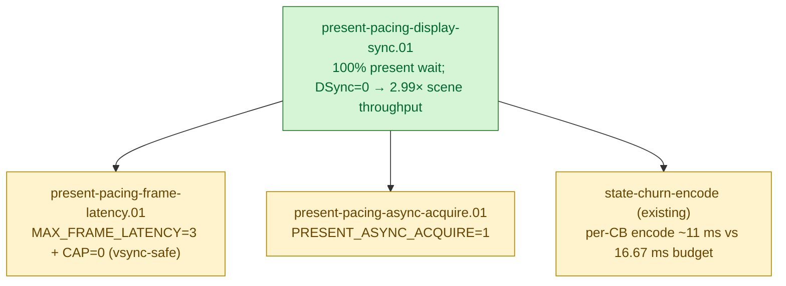

# Present-Pacing — display sync, frame latency, and the wallclock cap

> Part of the 3DMark05 GT1 perf-bottleneck investigation. Root map:
> [[overview-3dmark05-gt1]].

## Scope & question

This domain owns the **CPU/sync side** of GT1 wallclock: why
`completion_wait_ms` (the time the completion handler thread spends in
`MTLCommandBuffer.waitUntilCompleted()`) reached 28-31 s while
`gpu_command_buffer_time_ms` was only ~4 s, where that gap actually lives,
and which production-safe knobs can recover the slack without breaking
visual sync.

Every finding here moves *wallclock fps* directly, not GPU frame time. The
GPU frame-time story is owned by [[hidden-backend-storage]] /
[[index-cache-locality]]; the per-CB encode story by [[state-churn-encode]].

## Hypotheses & verdicts

| # | Hypothesis | Verdict | Evidence |
|---|------------|---------|----------|
| H1 | `completion_wait_ms` is dominated by Present-bearing CBs, not draw/blit/sync/queue waits | accepted | [[present-pacing-display-sync.01]] (100% `completion_present_wait_ms`) |
| H2 | The wait is display-sync pacing (`waitUntilCompleted()` returning at compositor refresh) rather than GPU compute | accepted | [[present-pacing-display-sync.01]] (`DXMT9_LAYER_DISPLAY_SYNC=0` cuts elapsed 251 s → 83 s, per-CB p50 unchanged) |
| H3 | Per-CB encode (`encode_draw_cpu_ms / CB`) sits at ~11 ms, near the 16.67 ms vsync budget | accepted | [[present-pacing-display-sync.01]] (per-CB encode 11.45 ms baseline, 11.23 ms DSync-off) |
| H4 | `DXMT9_MAX_FRAME_LATENCY=3` + `DXMT9_CAP_FRAME_LATENCY_TO_BACKBUFFERS=0` recovers slack with vsync on | rejected | [[present-pacing-frame-latency.01]] (wallclock Δ +0.07%, p95 +31%) |
| H5 | `DXMT9_PRESENT_ASYNC_ACQUIRE=1` reduces the completion-path acquire cost | open | [[present-pacing-async-acquire.01]] |
| H6 | Reducing per-CB encode below the vsync budget (≤ 8 ms / CB) restores 60 fps without changing pacing policy | open | depends on [[state-churn-encode]] |

## Verification methods

- **`countCompletionWait` exclusive sub-buckets** (`dxmt9_perf_counters.cpp:2972`)
  classify every completion-thread `waitUntilCompleted()` into one of
  `present` / `draw` / `blit` / `stretch` / `other`. Already wired; reading
  `result.json` is the attribution.
- **Sibling wait counters**: `present_acquire_wait_ms` (drawable acquire),
  `present_boundary_wait_ms` (present-boundary policy), `sync_wait_ms`
  (synchronous flush), `queue_writer_wait_ms` / `queue_commit_wait_ms` /
  `queue_sequence_wait_ms` (queue ring / submit ordering). Together they
  enumerate every CPU stall the runtime can attribute.
- **Env-knob A/B**: parent shell prefix
  (`DXMT9_LAYER_DISPLAY_SYNC=0 bash scripts/tools/run_3dmark05_perf_probe.sh
  --no-gputrace --suffix <name>`). The wrapper's `env "${env_args[@]}"
  ${cmd[@]}` invocation has no `-i`, so parent env propagates through to
  the Wine app.
- **Decisive scalar**: `process_elapsed_sec` (run wallclock). 3DMark05 GT1
  renders a fixed-scene workload, so faster scene completion = higher
  internal fps. Cross-checked with `completion_waits` (CB count) — same
  workload should produce roughly the same CB count.
- **CB-budget arithmetic**: `encode_draw_cpu_ms / completion_waits`
  yields per-CB encode cost; `gpu_command_buffer_time_ms / completion_waits`
  yields per-CB GPU cost. If per-CB encode + GPU > 16.67 ms (60 Hz slot),
  the frame misses vsync.

## Experiment dependency graph

## Detail map

- [[present-pacing-display-sync.01]] — Display-sync attribution; 100% of
  `completion_wait_ms` is Present-bearing; `DXMT9_LAYER_DISPLAY_SYNC=0`
  cuts scene wallclock 251 s → 83 s (−66.9%, ~3× fps). Diagnostic only,
  not a production fix.
- [[present-pacing-frame-latency.01]] — REJECTED.
  `MAX_FRAME_LATENCY=3 + CAP=0` does not move wallclock under vsync
  (Δ +0.07%); the compositor paces presents at refresh rate regardless
  of queue depth.
- [[present-pacing-async-acquire.01]] — open

## Cross-links

- [[overview-3dmark05-gt1]] — root domain map and priority DAG.
- [[state-churn-encode]] — per-CB encode CPU cost (the new bottleneck once
  display-sync pacing is dethroned).
- [[snapshot-cache]] — D3D9 state rebuild cost on the PE side; affects how
  many ms are spent per CB before the encode thread even runs.

## What is settled vs open

**Accepted**

- The 28-31 s `completion_wait_ms` is 100% `completion_present_wait_ms` —
  CPU completion thread waiting for Present-bearing `waitUntilCompleted()`
  to return after the compositor accepts the drawable.
  [[present-pacing-display-sync.01]]
- The wait is display-sync pacing, not GPU compute: per-CB p50 wait
  unchanged when sync is off, but scene completes 3× faster. Apple
  `CAMetalLayer` honours `displaySyncEnabled=YES` by holding
  `waitUntilCompleted` until the compositor's next vsync slot.
- Per-CB encode CPU (~11 ms) sits at ~69% of the 16.67 ms 60 Hz budget,
  which is why the average frame slips a vsync slot.

**Open**

- Does `DXMT9_PRESENT_ASYNC_ACQUIRE=1` (drawable acquired on encode thread
  asynchronously) reduce per-CB wait by removing acquire latency from the
  completion path?
- Is there a code-level draw-run batching win that drops per-CB encode
  below ~8 ms so the frame consistently fits a single vsync slot? Owned
  by [[state-churn-encode]] but constrained by the budget shown here.

**Rejected**

- `DXMT9_MAX_FRAME_LATENCY=3` plus `DXMT9_CAP_FRAME_LATENCY_TO_BACKBUFFERS=0`:
  wallclock unchanged (Δ +0.07% on 251 s scene), p95 +31%, max +12%.
  The compositor's vsync pacing dominates the per-CB wait regardless of
  how many frames are queued ahead.
  [[present-pacing-frame-latency.01]]

**Rejected / out-of-scope**

- `DXMT9_LAYER_DISPLAY_SYNC=0` as a production fix — causes tearing and
  breaks the compositor pacing contract. Diagnostic value only.
- Tuning `DXMT9_PRESENT_BOUNDARY_*` policies in isolation — present
  boundary wait counter was 0 in the baseline run; the policy axis is not
  currently load-bearing.
