# Present-Pacing — display sync, frame latency, and the wallclock cap - Historical Log

> Full historical detail moved from the former top-level `present-pacing.md` overview.
> Keep [overview](overview.md) current and compact; append long-running chronology,
> rejected paths, and detailed synthesis here only when it is not already captured in
> one-experiment leaf documents.

---

# Present-Pacing — display sync, frame latency, and the wallclock cap

> Part of the 3DMark05 GT1 perf-bottleneck investigation. Root map:
> [overview-3dmark05-gt1](../overview-3dmark05-gt1.md).

## Scope & question

This domain owns the **CPU/sync side** of GT1 wallclock: why
`completion_wait_ms` (the time the completion handler thread spends in
`MTLCommandBuffer.waitUntilCompleted()`) reached 28-31 s while
`gpu_command_buffer_time_ms` was only ~4 s, where that gap actually lives,
and which production-safe knobs can recover the slack without breaking
visual sync.

Every finding here moves *wallclock fps* directly, not GPU frame time. The
GPU frame-time story is owned by [hidden-backend-storage](../hidden-backend-storage/index.md) /
[index-cache-locality](../index-cache-locality/index.md); the per-CB encode story by [state-churn-encode](../state-churn-encode/index.md).

## Hypotheses & verdicts

| # | Hypothesis | Verdict | Evidence |
|---|------------|---------|----------|
| H1 | `completion_wait_ms` is dominated by Present-bearing CBs, not draw/blit/sync/queue waits | accepted | [present-pacing-display-sync.01](present-pacing-display-sync.01.md) (100% `completion_present_wait_ms`) |
| H2 | The wait is display/present-completion pacing (`waitUntilCompleted()` returning after drawable/compositor acceptance) rather than pure GPU compute | accepted historically; current mechanism refined | [present-pacing-display-sync.01](present-pacing-display-sync.01.md) showed the original display-sync attribution. Current [present-pacing-current-immediate.02](present-pacing-current-immediate.02.md) shows GT1 direct now requests Immediate and never uses `presentDrawableAfterMinimumDuration`, yet `completion_present_wait_ms` remains ~39 s. [present-pacing-completion-watcher-status.03](present-pacing-completion-watcher-status.03.md) shows the watcher pops immediately (`p50 0.041ms`, `pending_depth_max=0`) and waits mostly from `Committed` status. |
| H3 | Per-CB encode (`encode_draw_cpu_ms / CB`) sits at ~11 ms, near the 16.67 ms vsync budget | accepted | [present-pacing-display-sync.01](present-pacing-display-sync.01.md) (per-CB encode 11.45 ms baseline, 11.23 ms DSync-off) |
| H4 | `DXMT9_MAX_FRAME_LATENCY=3` + `DXMT9_CAP_FRAME_LATENCY_TO_BACKBUFFERS=0` recovers slack with vsync on | rejected | [present-pacing-frame-latency.01](present-pacing-frame-latency.01.md) (wallclock Δ +0.07%, p95 +31%) |
| H5 | `DXMT9_PRESENT_ASYNC_ACQUIRE=1` reduces the completion-path acquire cost | rejected (axis not load-bearing) | [present-pacing-async-acquire.01](present-pacing-async-acquire.01.md) (acquire wait −37.5% but axis < 0.5% of total; wallclock Δ +0.22%) |
| H6 | Reducing per-CB encode below the vsync budget (<= 16.67 ms / CB) restores fps without changing pacing policy | open, with CPU wins | [present-pacing-encode-budget.01](present-pacing-encode-budget.01.md) sized the gap; [present-pacing-bind-cache-work-a.01](present-pacing-bind-cache-work-a.01.md) rejected broad bind-cache as the main lever; cbuf identity repoint, plan-direct binding-packet cache, component-hash reuse, usage-aware payload hashing, and FFP known-zero usage are accepted CPU wins. Latest [snapshot-cache-snapshot.09](../snapshot-cache/snapshot-cache-snapshot.09.md) sample is still not a vsync-on fps proof: `completion_wait_ms=39978.924`, `encode_draw_cpu_ms=17711.215`, and `d3d9_snapshot_draw_submission_cpu_ms=7196.881` over `1740` presents. [state-churn-encode-encode-phase.09](../state-churn-encode/state-churn-encode-encode-phase.09.md) splits argbuf open: reserve `745.942ms`, `setArgumentBuffer=115.192ms`, table bind `192.913ms`, table-bind skip `0`; [state-churn-encode-encode-phase.10](../state-churn-encode/state-churn-encode-encode-phase.10.md) then cuts reserve by `-51.95%` and `encode_draw_cpu_ms` by `-3.87%` in a same-present A/B. [state-churn-encode-encode-phase.11](../state-churn-encode/state-churn-encode-encode-phase.11.md) rejects dirty-category identity repoint (`0` hits). [state-churn-encode-encode-phase.12](../state-churn-encode/state-churn-encode-encode-phase.12.md) splits `stream_bind` into texture/sampler (`1065ms`), index (`670ms`), shader stream (`497ms`), and raster (`389ms`) phases; [state-churn-encode-encode-phase.13](../state-churn-encode/state-churn-encode-encode-phase.13.md) narrows texture/sampler to fragment resolve (`575ms`) and fragment direct bind (`317ms`); [state-churn-encode-encode-phase.14](../state-churn-encode/state-churn-encode-encode-phase.14.md) accepts sampler pre-handle skip as a CPU win (`texture_sampler` -18.84%, `encode_draw` -117ms); [state-churn-encode-encode-phase.15](../state-churn-encode/state-churn-encode-encode-phase.15.md) then reuses the packet sampler-state hash (`fragment_direct` -68ms, texture/sampler parent -69.6ms); [state-churn-encode-encode-phase.16](../state-churn-encode/state-churn-encode-encode-phase.16.md) rejects texture pre-resolve skip as a default win (`1.206M` skips but texture/sampler parent +48ms), removes the rejected branch, and verifies texture/sampler parent returns to baseline (`822.864 -> 821.007`). The next no-gputrace targets remain named encode buckets plus residual snapshot hash/indexed-fallback work. |
| H7 | A user-opt-in vsync-off env recovers fps without a code-side encode optimisation | accepted historically; not load-bearing for current GT1 direct path | [present-pacing-vsync-off.01](present-pacing-vsync-off.01.md) measured a full-workload wallclock win when the present path was sync-paced. Current [present-pacing-current-immediate.02](present-pacing-current-immediate.02.md) shows both default and `DXMT9_DISABLE_VSYNC=1` already use `present_schedule_immediate=1680`, frame p50/p95 are flat, and `present_schedule_after_minimum_duration=0`. |
| H8 | Completion wait is caused by completion watcher backlog | rejected | [present-pacing-completion-watcher-status.03](present-pacing-completion-watcher-status.03.md): `completion_pending_depth_max=0`, dequeue age p50/p95 `0.041/0.067ms`, and `completion_dequeue_status_completed=0`. The watcher is not late; it waits on just-committed command buffers. |
| H9 | Current average FPS should be attacked through P2/P3 CPU cadence plus P4 present-completion wait, not hot-frame GPU locality first | accepted gate split | [present-pacing-current-fps-owner.04](present-pacing-current-fps-owner.04.md): current low-overhead scout has sampled FPS p50/p95 `18.102/26.630`, frame wall p50/p95 `55.242/84.648ms`, `completion_present_wait_ms=25.091ms/present`, `gpu_command_buffer_time_ms=3.113ms/present`, immediate presents only, `present_boundary_wait_ms=0`, and `completion_pending_depth_max=0`. GPU locality remains a hot-frame/ceiling lane, but average FPS requires P2/P3 wins and P4 pipeline-depth recovery. |
| H10 | Completion wait is overlapped by next-frame enqueue/encode work | rejected; hard under-pipelining accepted | [present-pacing-pipeline-overlap.05](present-pacing-pipeline-overlap.05.md): `1799 / 1799` waits have no later CB enqueue during `waitUntilCompleted()`, `completion_wait_with_enqueue_ms=0`, `completion_wait_without_enqueue_ms=44789.044`, `completion_enqueue_while_waiting=0`, and enqueue-side pending depth max is only `1`. Stage run: wait-end -> publish/encode-dequeue/Metal-commit/enqueue p50 `16.645/20.116/36.470/36.502ms`, so producer and encode work both run after the wait instead of hiding under it. |
| H11 | `DXMT9_DISABLE_PRESENT_BOUNDARY` or deeper `DXMT9_MAX_FRAME_LATENCY` makes the producer run while completion waits | rejected as current owner | [present-pacing-boundary-latency-ab.06](present-pacing-boundary-latency-ab.06.md): fresh baseline, boundary-disabled, and latency6 scouts all keep `present_boundary_waits=0`, `completion_wait_without_enqueue_ms≈44.0-44.5s`, and sampled FPS p50 `17.8-18.0`. `DXMT9_DISABLE_PRESENT_BOUNDARY=1` reaches the runtime (`present_boundary_skipped=1740`) but creates only one noise-level overlap event also seen in baseline. The remaining owner is before `CommitPublish` or outside dxmt9's explicit boundary wait. |
| H12 | The post-wait producer gap is app/Wine/macdrv-side, before unix `commit_chunk` entry | rejected; unix replay/submit owner accepted | [present-pacing-prepublish-stage.07](present-pacing-prepublish-stage.07.md): wait-end -> `commit_chunk` entry p50/p95 is only `1.040/2.668ms`, while wait-end -> `CommitPublish` is `15.894/29.912ms` and wait-end -> Metal commit is `22.276/54.146ms`. `commit_chunk_replay_cpu_ms=18981.064`, nested queue draw submission is `8154.509ms`, and nested snapshot submission is `6636.191ms`, so the average-FPS lane remains commit/replay/snapshot/encode, not app/Wine event pacing. |
| H13 | Same-sample stage deltas can split the exposed no-enqueue gap without subtracting unrelated percentiles | accepted | [present-pacing-stage-delta.08](present-pacing-stage-delta.08.md): current 120s scout keeps `completion_wait_with_enqueue_ms=0`, then splits the exposed path into `commit_chunk entry -> CommitPublish` p50/p95 `6.172/28.101ms`, `CommitPublish -> EncodeDequeue` `2.535/5.086ms`, and `EncodeDequeue -> commandBuffer.commit()` `11.384/22.232ms`. Queue wake is secondary; pre-publish replay/submit/snapshot and backend encode are the two load-bearing CPU stages. |
| H14 | The app thread is blocked inside PE `Present()` for the whole completion wait | rejected | [present-pacing-pe-present-timing.09](present-pacing-pe-present-timing.09.md): with `DXMT9_PE_RECORDER_STATS=1 DXMT_LOG_LEVEL=info`, PE `Present total_ms` p50/p95/max is only `2.580/5.077/22.659ms`, almost entirely `flush_ms`, while `completion_wait_ms` p50/p95/max is `28.419/39.576/52.217ms`. The next unix chunk still crosses quickly after completion (`wait_to_commit_chunk_entry` p50/p95 `0.888/3.025ms`), but that is not a PE API-call timestamp. |
| H15 | The app/Wine loop does not call D3D9 until Metal completion | rejected; PE-local next-frame recording accepted | [present-pacing-pe-call-cadence.10](present-pacing-pe-call-cadence.10.md): after successful PE `Present`, the next PE D3D9 call is almost always `BeginScene` (`1702 / 1703` rows) and arrives with `entry_delta_ms` p50/p95/p99 `0.310/0.436/1.811ms`. `completion_wait_with_enqueue_ms=0` still holds, so the missing overlap is not app API-call cadence; it is PE-recorder/unix submission boundary or later (`commit_chunk` replay/publish/snapshot and backend encode). |
| H16 | PE-local next-frame work crosses into unix immediately after the first PE call | rejected; chunk-fill cadence accepted | [present-pacing-pe-chunk-cadence.11](present-pacing-pe-chunk-cadence.11.md): first PE call p50 is `0.308ms`, but the first non-empty chunk after `Present` is always `capacity_post`, always `64` records, and crosses into unix at steady p50/p95 `19.908/34.810ms` after `Present` return. The first bridge itself is cheap (`bridge_ms` p50/p95 `0.504/0.617ms`). |
| H17 | Lowering PE chunk capacity from `64` to `32` creates producer run-ahead | rejected as a simple knob | [present-pacing-pe-chunk-size-ab.12](present-pacing-pe-chunk-size-ab.12.md): chunk32 reaches the recorder (`recordCount=32`) and slightly lowers first-chunk p50 (`19.908 -> 19.034ms`) and no-enqueue wait-to-commit-entry p50 (`0.917 -> 0.471ms`), but `completion_wait_with_enqueue_ms` remains `0.000` and replay/encode do not materially improve. Earlier publish remains an architecture experiment, not a global capacity knob. |
| H18 | The first chunk is late because filling 64 records takes most of the time | rejected; first-record append delay accepted | [present-pacing-pe-record-milestones.13](present-pacing-pe-record-milestones.13.md): after `Present`, `BeginScene` still arrives at p50 `0.306ms`, but the first appendable record is `apply_state` at p50 `18.061ms`. Records `1 -> 64` then arrive quickly (`18.061 -> 19.683ms` p50), and the first chunk follows at `19.706ms`. Chunk threshold is not the front gate; the first record-producing state/draw boundary is. |
| H19 | The hidden N+1 dependency sits on one of the first D3D9 calls after `Present` | rejected; initial call-sequence attribution superseded | [present-pacing-pe-call-sequence.14](present-pacing-pe-call-sequence.14.md): calls `1..4` after `Present` are `BeginScene`, `GetRenderTarget`, `GetRenderTarget`, and `SetRenderTarget`, all at p50 `<= 0.532ms`. The run initially placed the long gap before `SetVertexShaderConstantF`, but that was incomplete because `Clear` and `EndScene` were not in the call milestone sequence. |
| H20 | The first record-producing front gate is `Clear`, after a post-RT-setup gap | accepted | [present-pacing-pe-clear-gate.15](present-pacing-pe-clear-gate.15.md): with `Clear`/`EndScene` included, call 5 is steady `Clear` at p50 `18.408ms`; `SetRenderTarget` return is p50 `0.581ms` with only `0.015ms` duration, so `SetRenderTarget` is not the sleeper. The p50 gap is `SetRenderTarget` return -> `Clear` entry `17.635ms`; record 1 `apply_state` is appended inside `Clear` at p50 `18.554ms`, and the first `capacity_post` chunk follows at p50 `20.400ms`. |
| H21 | Frame-sampling logs create or amplify the post-RT-setup `Clear` gate | rejected | [present-pacing-pe-clear-nosampling.16](present-pacing-pe-clear-nosampling.16.md): removing `--frame-sampling` drops `dxmt9-perf-frame` lines from `1,726` to `0`, but `SetRenderTarget` return -> `Clear` entry remains p50 `17.651ms -> 17.646ms` and first chunk remains p50 `20.402ms -> 20.386ms`. The perf-frame line is a correlation marker, not the stall owner. |
| H22 | The apparent `SetRenderTarget` -> `Clear` gap is really an uninstrumented child getter stall | rejected; hidden calls found but not sleeper | [present-pacing-pe-wide-call-coverage.17](present-pacing-pe-wide-call-coverage.17.md): wider coverage reveals `Surface::GetDesc` and `Texture::GetSurfaceLevel` before `Clear`, but child return logging shows they return quickly (`Surface::GetDesc` call 7 duration p50 `0.013ms`, `Texture::GetSurfaceLevel` p50 `0.054ms`). The last logged return is p50 `0.674ms`, and `Clear` still enters at p50 `18.421ms`, leaving a `17.656ms` p50 gap. |
| H23 | The remaining front gap is a broad app/Wine runloop or macdrv sleep | rejected as broad owner; exact PC owner open | [present-pacing-xctrace-threadstate.18](present-pacing-xctrace-threadstate.18.md): re-exported `Metal System Trace` CPU tables show the D3D/Wine producer thread `0x3b1b5c` has `15,354ms` Running sample weight across a `15.563s` trace, while `runloop-events` has only two `3DMark05.exe` rows on a different main thread. This does not pinpoint the current `SetRenderTarget` -> `Clear` PC, but it weakens sleep/runloop as the broad explanation. |
| H24 | The `Clear` front gate is a hidden dxmt9 D3D9 API wait | rejected; wrapper-level attribution accepted, higher owner superseded | [present-pacing-pe-caller-pc.19](present-pacing-pe-caller-pc.19.md): PE caller-PC/module logging shows the steady sequence is identical in `1,716 / 1,716` ordinals. `SetRenderTarget` returns from 3DMark05.exe wrapper RVA `0x2AF4F` at p50 `0.730ms`, its nested `Surface::GetDesc` caller resolves to `d3d9.dll!0x13EE9` and takes only p50 `0.020ms`, and `Clear` enters later from 3DMark05.exe wrapper RVA `0x2B061` at p50 `18.373ms`. The p50 `17.484ms` gap is not inside `SetRenderTarget`, `Clear`, or a hidden child getter. Caller-stack follow-up supersedes the claim that these wrapper RVAs are the higher render-loop owner. |
| H25 | The stable owner above the wrapper stubs is still hidden | rejected; 3DMark05 command-dispatch cadence accepted | [present-pacing-pe-caller-stack.20](present-pacing-pe-caller-stack.20.md): PE stack logging shows milestones 2..8 share higher frame `3DMark05.exe+0x88760` in `1,707 / 1,707` matching ordinals. `0x2AF4F` and `0x2B061` are D3D wrapper stubs; `0x88760` is the return site of a command-object dispatcher (`0x4886E0`) whose virtual `call *0x18(%eax)` executes the D3D wrapper command. `SetRenderTarget` return -> `Clear` entry remains p50 `17.429ms`. The front gate is therefore when 3DMark05 dispatches the record-producing `Clear` command object, not a dxmt9 boundary/latency/ring wait. |
| H26 | The `Clear` front gate or next Metal enqueue waits on dxmt9 completed-seq/waterline publication | rejected for dxmt9 completion signal; actual Metal/CA completion remains separate | [present-pacing-completion-signal-delay.21](present-pacing-completion-signal-delay.21.md): `DXMT9_PERF_COMPLETION_SIGNAL_DELAY_MS=8` applies `1696` sleeps / `13568ms` after `waitUntilCompleted()` and before completed-seq publication, but `SetRenderTarget -> Clear` p50 stays `17.631 -> 17.550ms`, first chunk p50 stays `20.802 -> 20.827ms`, and next enqueue p50 stays `21.558 -> 20.274ms`. The front gate is not waiting on dxmt9's completion signal. |
| H27 | Flushing the PE chunk immediately after `Clear` creates producer overlap | rejected as a simple early-publish lever | [present-pacing-pe-clear-flush.22](present-pacing-pe-clear-flush.22.md): `DXMT9_PE_FLUSH_AFTER_CLEAR=1` changes the first chunk from `capacity_post` / `64` records to `clear` / `2` records and moves first-chunk p50 `20.582 -> 18.935ms`, but `completion_wait_with_enqueue_ms` remains `0.000`, `completion_enqueue_while_waiting=0`, and `commitCount` rises `41947 -> 45857`. Keep it diagnostic-only; continue P2/P3 replay/snapshot/encode reductions or a larger producer-overlap design. |
| H28 | The current low-overhead code state makes `DXMT9_PE_FLUSH_AFTER_CLEAR=1` useful after recent encode/copy cleanup | rejected-current | [present-pacing-pe-clear-flush.23](present-pacing-pe-clear-flush.23.md): matching recorder-stats runs still move the first chunk earlier (`20.710 -> 19.089ms`) and shrink it (`64 -> 2` records), but `completion_wait_with_enqueue` moves `2 -> 0`, tail-600 FPS p50 moves `15.788 -> 15.681`, and `commitCount` rises `41,429 -> 45,617`. |
| H29 | Current low-overhead FPS is blocked by serialized post-wait P2/P3 work, not by missing app/D3D9 calls after completion | accepted attribution | [present-pacing-lowoverhead-serial.24](present-pacing-lowoverhead-serial.24.md): the next unix commit entry follows completion quickly (`0.861ms` p50), while same-cycle post-wait stages remain large: `commit_chunk entry -> CommitPublish` `14.068ms` p50, `CommitPublish -> EncodeDequeue` `3.678ms`, and `EncodeDequeue -> commandBuffer.commit()` `11.528ms`. Disabling Stage 2 argbuf cuts encode per present (`9.388 -> 6.143ms`) but raises completion wait (`27.116 -> 31.148ms/present`), so local CPU wins need a P4/overlap proof. |
| H30 | Raising the mid-chunk sub-command-buffer cap recovers average FPS by allowing more early commits | rejected-current | [present-pacing-subcb-cap.25](present-pacing-subcb-cap.25.md): `DXMT9_MID_CHUNK_COMMIT_CAP_PER_RENDER_PASS=8` reaches the runtime (`chunk_subcb_count_max 4 -> 8`), doubles sub-CBs (`5,355 -> 12,173`), and drops cap suppression (`8,658 -> 1,471`), but tail-600 FPS p50 worsens (`16.849 -> 16.665`), completion wait per present rises (`27.116 -> 28.900ms`), and wait-end -> next-enqueue p50 worsens (`15.135 -> 19.980ms`). |
| H31 | Moving publish-time PSO prefetch out of the serialized Present publish path can improve sampled FPS even if encode lookup rises | accepted placement signal; superseded by H32 default | [present-pacing-publish-pso-prefetch.26](present-pacing-publish-pso-prefetch.26.md): `DXMT9_DISABLE_PUBLISH_PSO_PREFETCH=1` cuts Present replay by `-2.488ms/present`, raises encode pipeline lookup by `+2.222ms/present`, reduces `completion_wait_ms` by `-2.420ms/present`, and improves repeated warm FPS p50 by `+0.564`. |
| H32 | Encode-slot PSO prefetch is a better default than publish-time PSO prefetch for current GT1 | accepted default | [present-pacing-publish-pso-prefetch.27](present-pacing-publish-pso-prefetch.27.md): default run keeps `encode_draw_pso_prefetch_handle_missing=0`, moves `prepare_slot_pso_prefetch_cpu_ms` to `0`, records `encode_slot_pso_prefetch_cpu_ms=2.605ms/present`, cuts completion wait by `-1.509ms/present`, and improves warm FPS avg by `+0.717`. |
| H33 | The remaining PSO prefetch work is now an encode-stage key/lookup problem, not a Present pacing problem | accepted attribution | [state-churn-encode-encode-phase.71](../state-churn-encode/state-churn-encode-encode-phase.71.md): split counters show `encode_slot_pso_prefetch_cpu_ms=2.806ms/present`, dominated by draw PSO lookup/key work at `2.506ms/present`; `prepare_slot_pso_prefetch_cpu_ms` remains effectively zero and handle misses remain `0`. |
| H34 | Wine's synchronous `OnMainThread()` marshaling is a plausible transmission path for the `SetRenderTarget` return -> `Clear` entry gate | source-audit hypothesis | [present-pacing-winemac-onmainthread.28](present-pacing-winemac-onmainthread.28.md): Wine `OnMainThread()` can block an app thread until the Cocoa main thread runs the request; event-queue threads use `kevent(..., NULL)` and non-queue threads use `dispatch_semaphore_wait(..., DISPATCH_TIME_FOREVER)`. `ClipCursor`, cursor get/set, and window-frame getters can use it; dxmt9 does not call `macdrv_view_get_metal_layer` per frame and winemac does not issue `presentDrawable`. `GetCursorPos` is lower-priority because of win32u's 100ms cache, but a stale cursor timestamp can still fall through to winemac. The exact winemac call and main-thread holder remain unproven and require threshold logging joined to PE milestones. |
| H35 | The non-invasive P4 fallback should export xctrace CPU thread summaries alongside Metal timing | accepted tooling | [present-pacing-xctrace-cpu-summary-tooling.29](present-pacing-xctrace-cpu-summary-tooling.29.md) adds `summarize_xctrace_cpu_threads.py` and `run_3dmark05_system_trace_sidecar.sh --export-cpu-summary`. Existing `phase43` smoke parses `20,964` `time-profile` rows and `20,989` `time-sample` rows; producer thread `0x3b1b5c` remains `15,354ms` running with zero `OnMainThread` / `kevent` / `dispatch_semaphore_wait` hits, and the generated P4 scout verdict is `producer-running-negative-scout`, while `5` non-producer wait hits stay on callback-like threads. |
| H36 | PE `thread_id=...` rows can be extracted on a current-head sidecar, but they do not directly select xctrace threads | inconclusive; native id mapping required | [present-pacing-xctrace-cpu-summary-current.30](present-pacing-xctrace-cpu-summary-current.30.md): `winemac-onmainthread-xctrace-r2` completed with xctrace/wrapper status `0`, joined `1528/1528` encoder rows, and parsed `13,509` `time-profile` plus `13,540` `time-sample` rows. The PE log had `45,053` `pe_present_*` rows with a single `thread_id=0xd0`, selected from `pe-log-clear-return`, but no xctrace thread label or `thread-info` `tid` matched `0xd0`; verdict `producer-thread-not-found`. This proves the PE id is in the Win32 namespace for this purpose. The next P4 proof needs native Mach/pthread id mapping or Wine/macdrv threshold telemetry before promoting or rejecting `OnMainThread` as the owner. |
| H37 | Same-run native producer-thread selection should come from the unix replay boundary, not PE `GetCurrentThreadId()` | accepted tooling; needs next trace | `dxmt9c_device_commit_chunk` now logs `unix_commit_chunk_entry native_tid=0x...` under the existing `DXMT9_PE_RECORDER_STATS=1` diagnostic gate, and the xctrace CPU summarizer prefers that native id before falling back to PE `thread_id=0x...`. This directly addresses H36's namespace mismatch while preserving the same sidecar flow. The next proof run is `--export-cpu-summary --cpu-producer-from-pe-log`; pass condition is a selected native producer row with decisive `OnMainThread`/wait evidence or a strong negative on the actual producer. |
| H38 | Native-selector xctrace scout does not find producer-thread `OnMainThread`/wait evidence | negative scout; P2/P3 remains primary | [present-pacing-native-selector-xctrace.31](present-pacing-native-selector-xctrace.31.md): `winemac-onmainthread-xctrace-r3` completed with xctrace/wrapper status `0`. The direct log had `40,044` `unix_commit_chunk_entry native_tid=0x5cef8b` rows and `46,031` PE rows with `thread_id=0xd0`; the CPU summary selected native source `native-log-commit-chunk-entry` and matched xctrace `tid=0x5cef8b`. The selected producer was sampled `10427/10427` rows Running, with `0` producer wait keyword hits and only `2` non-producer wait hits. The same run still has `completion_present_wait_ms/present=27.589ms`, `completion_present_wait_with_enqueue_ms=0`, `commit_entry_to_publish` p50/p95 `16.701/38.664ms`, and `encode_chunk_cpu_ms/present=14.597ms`. |
| H39 | Default-on resource-shape path still does not show producer-thread wait evidence | negative scout; P2/P3 remains primary | [present-pacing-native-selector-xctrace.32](present-pacing-native-selector-xctrace.32.md) repeats the native-selector System Trace after [state-churn-encode-encode-phase.81](../state-churn-encode/state-churn-encode-encode-phase.81.md) makes the resource-shape PSO memo default-on. The selected native producer `0x61e72f` is sampled running in `10439 / 10439` rows with `0` producer wait keyword hits; non-producer wait hits are `3`. The run still has `completion_present_wait_with_enqueue_ms=0`, `completion_present_wait_ms/present=25.208ms`, `commit_entry_to_publish` p50/p95 `34.071/64.333ms`, and `encode_dequeue_to_command_buffer_commit` p50/p95 `26.705/37.060ms`. Because all-frame encoder breakdown is enabled, this is not a low-overhead FPS baseline, but it keeps broad winemac `OnMainThread` below replay/snapshot/encode serialization as the next average-FPS target. |
| H40 | Short System Trace sidecar remains useful while `.gputrace` is blocked, but does not find P4 producer wait evidence | negative scout; sidecar fallback accepted | [present-pacing-systemtrace-p4-smoke.34](present-pacing-systemtrace-p4-smoke.34.md) uses a 2-second normal-rendering Metal System Trace while Xcode `.gputrace` attach is blocked by Developer Mode. It joins `306/306` encoder rows over seq `1114..1148`, selects native producer `0x6572ff`, samples it running in `2519 / 2519` rows, and finds `0` producer wait keyword hits. GPU timing remains vertex dominated (`93.07%` vertex share), with top rows all `opaque-depth-indexed` / `needs-programmable-color-route`; pacing counters still show no overlap (`completion_wait_with_enqueue_ms=0`) and large replay/snapshot/encode work after wait. |
| H41 | Current P4 System Trace sidecar still finds no producer wait-stack hit, but one blocked sample keeps the verdict inconclusive | accepted current constraint | [present-pacing-systemtrace-p4-current.35](present-pacing-systemtrace-p4-current.35.md) repeats the 2-second System Trace sidecar on the current code state. It joins `386/386` encoder rows over seq `1052..1087`, selects native producer `0x665ec1`, and records `producer_wait_keyword_hits=0`; however the selected producer has `1` blocked row out of `2,429`, so the CPU verdict is `producer-state-inconclusive`, not a strict negative. Pacing is unchanged for the current owner split: `completion_wait_with_enqueue_ms=0`, `completion_wait_ms=26.319ms/present`, `commit_chunk_replay_cpu_ms=8.510ms/present`, and `encode_chunk_cpu_ms=13.254ms/present`. |
| H42 | Seq-range System Trace sidecar is the preferred blocked-gputrace P4 fallback | accepted fallback; negative scout | [present-pacing-systemtrace-p4-range.36](present-pacing-systemtrace-p4-range.36.md) repeats the current sidecar with `--encoder-breakdown-seq-range 1000:1125`. It joins `395/395` encoder rows over seq `1037..1073`, cuts probe output from `553MiB` to `130MiB`, selects native producer `0x668652`, and returns `producer-running-negative-scout` with `2515/2515` producer samples running, `0` blocked rows, and `0` producer wait keyword hits. Pacing still has no overlap: `completion_wait_with_enqueue_ms=0`, `completion_wait_ms=27.606ms/present`, `commit_chunk_replay_cpu_ms=8.516ms/present`, and `encode_chunk_cpu_ms=10.874ms/present`. |
| H43 | P4 compare gates must distinguish total present wait from recovered overlap | accepted tooling | [present-pacing-compare-gates.37](present-pacing-compare-gates.37.md) extends `compare_3dmark05_perf_counters.py` with derived `completion_present_wait`, `completion_wait_with_enqueue`, and `completion_wait_without_enqueue` per-present/share metrics plus failure gates. Future average-FPS candidates can now require `--require-completion-present-wait-decrease`, `--require-completion-wait-with-enqueue-increase`, or `--require-completion-wait-without-enqueue-decrease` instead of accepting a local CPU win that only shifts wait between buckets. |
| H44 | P2/P3 serial-stage compare gates should be per-present and paired with P4 gates | accepted tooling | [present-pacing-serial-stage-compare-gates.38](present-pacing-serial-stage-compare-gates.38.md) extends the same compare report with per-present replay, queue draw-submission, snapshot, snapshot-cache, encode, and no-enqueue stage metrics. Future CPU-path candidates can require `--require-commit-chunk-replay-cpu-per-present-decrease`, `--require-encode-chunk-cpu-per-present-decrease`, or no-enqueue stage gates, then pair them with H43 P4 gates before claiming average-FPS movement. |
| H45 | Current low-overhead frame sampling still shows almost no completion overlap and large serialized CPU stages | accepted current baseline | [present-pacing-frame-sampling-current.39](present-pacing-frame-sampling-current.39.md) runs a normal no-gputrace scout with `DXMT9_PERF_FRAME_SAMPLING=1` and the current compact-uniform opportunity gate. The run records `1,860` presents, sampled avg FPS `17.019`, wall p50/p95 `53.475/82.502ms`, completion wait p50/p95 `27.485/39.849ms`, GPU CB p50/p95 `1.058/13.878ms`, and encode chunk p50/p95 `9.413/18.048ms`. Only `9` waits overlap later enqueues (`398ms` total) while `completion_wait_without_enqueue_ms=50.645s`, so average-FPS work remains P2/P3 CPU reduction plus a larger overlap design rather than GPU-only locality. |
| H46 | Current-run summaries should classify P4 overlap and exposed CPU stages directly | accepted tooling | [present-pacing-summary-triage.40](present-pacing-summary-triage.40.md) adds a `Pacing / CPU Stage Derived` block to `summarize_3dmark05_perf.py`. The single-run summary now reports completion wait with/without enqueue, overlap/no-enqueue shares, replay/snapshot/encode per-present rows, no-enqueue stage p50/p95 rows, and a current-run verdict such as `under-pipelined-no-enqueue`. This does not replace H43/H44 A/B gates; it makes standalone scouts auditable before selecting the next CPU or overlap candidate. |
| H47 | Fresh summary-triage scout confirms current average-FPS owner | accepted current baseline | [present-pacing-summary-triage-current.41](present-pacing-summary-triage-current.41.md) runs the new summary block on a fresh low-overhead scout. It records `1,842` presents, sampled avg FPS `16.822`, wall p50/p95 `53.842/84.123ms`, `completion_wait_ms_per_present=27.599`, overlap share only `0.180%`, no-enqueue share `99.820%`, `commit_chunk_replay_cpu_ms_per_present=8.207`, and `encode_chunk_cpu_ms_per_present=10.566`. The summary verdict is `under-pipelined-no-enqueue`, with largest p50 no-enqueue row `encode dequeue -> command buffer commit`. |
| H48 | xctrace CPU summary should split producer wait evidence from main-thread/present holder evidence | accepted tooling | [present-pacing-xctrace-holder-summary.42](present-pacing-xctrace-holder-summary.42.md) adds `p4_holder_keyword_hits`, `holder_status`, `main_thread_holder_keyword_hits`, and `nonproducer_holder_keyword_hits` to `summarize_xctrace_cpu_threads.py`. Producer verdicts still use `OnMainThread`/wait/macdrv keywords; holder fields separately expose `CA::Transaction`, `CAMetalLayer`, `presentDrawable`, and `nextDrawable` samples. The sidecar one-line verdict and manual stdout now surface the same holder split for quick triage. This keeps a future winemac-positive sidecar from conflating producer blocking with callback/main-thread holder noise. |
| H49 | Current post-cbuf-observer low-overhead scout keeps the same P4/P2/P3 owner split | accepted current baseline | [present-pacing-current-lowoverhead.43](present-pacing-current-lowoverhead.43.md) runs a no-gputrace, no-encoder-breakdown, frame-sampling scout after the cbuf content observer was made opt-in. It renders a normal fog-heavy GT1 frame, records `1,860` presents, `completion_wait_without_enqueue_ms_per_present=26.839`, `completion_wait_with_enqueue_ms_per_present=0.210`, `gpu_command_buffer_time_ms_per_present=3.111`, `commit_chunk_replay_cpu_ms_per_present=8.074`, and `encode_chunk_cpu_ms_per_present=10.902`. The conclusion stays under-pipelined: average-FPS work is still serial replay/snapshot/encode reduction plus an overlap design, not another cbuf-content attribution pass. |
| H50 | Wine `OnMainThread()` should not be promoted to current-owner/capstone without new runtime proof | accepted review | [present-pacing-winemac-onmainthread.44](present-pacing-winemac-onmainthread.44.md) reviews the source audit against later native-selector System Trace scouts. The Wine mechanism is real and remains a patch point, but current runtime evidence samples the selected producer running with `0` wait-keyword hits while low-overhead P2/P3 work remains large. Keep broad winemac debugging below serialized replay/snapshot/encode and P4-overlap work unless a future native producer wait stack, x86_64 Wine threshold row, or low-overhead P4 movement contradicts it. |
| H51 | Stage 2b direct-cbuf removes argbuf table churn without moving the P4 owner | accepted local CPU win; P4 still open | [present-pacing-direct-cbuf.45](present-pacing-direct-cbuf.45.md) reviews the `DXMT9_ARGBUF_DIRECT_CBUF=1` no-gputrace scout. It removes the local argbuf table path (`argbuf_table_bind_calls=0`, `argbuf_setup=0`, cbuf update calls `0`) and lowers encode to `5.982ms/present`, but the run remains `under-pipelined-no-enqueue`: `completion_wait_without_enqueue=28.565ms/present`, overlap share `1.955%`, and `sampled_avg_fps=16.864`. The largest exposed p50 no-enqueue row is `commit entry -> publish`, so next average-FPS work returns to replay/snapshot/submit, backend encode children only with P4 gates, or an explicit overlap design. |
| H52 | Current default P2/P3 scout keeps the under-pipelined no-enqueue owner after capture-layer recovery | accepted current baseline | [present-pacing-current-p2p3.46](present-pacing-current-p2p3.46.md) runs the current default no-gputrace scout after the capture-layer route was revalidated. It records `1,800` presents, sampled avg FPS `16.766`, `gpu_command_buffer_time_ms_per_present=3.218`, `completion_wait_without_enqueue_ms_per_present=27.475`, overlap share `0.086%`, `commit_chunk_replay_cpu_ms_per_present=8.325`, snapshot lookup `2.850ms/present`, and `encode_chunk_cpu_ms_per_present=11.152`. A same-run compare against direct-cbuf cuts encode by `-24.44%` but leaves FPS flat and no-enqueue wait worse, so average-FPS candidates still need P2/P3 gates paired with P4 overlap proof. |
| H53 | No-enqueue gaps already include many `commit_chunk` entries before the first publish | accepted attribution | [present-pacing-noenqueue-beforepublish.47](present-pacing-noenqueue-beforepublish.47.md) adds before-publish counters to the current scout. The run remains `under-pipelined-no-enqueue` (`completion_wait_without_enqueue_ms_per_present=27.151`, overlap share `2.114%`), but the first `CommitPublish` after a no-enqueue wait is preceded by p50 `12` `commit_chunk` entries/replay starts and p50 `11` replay ends. That rejects the broad "producer absent" framing; the exposed owners are first-publish formation (`commit entry -> publish` p50 `14.866ms`) and backend encode-to-Metal-commit (`17.218ms` p50), still gated by P4/FPS movement. |
| H54 | Before-publish chunks are draw/const heavy, and a draw-count publish limit creates overlap but hurts total cost | accepted attribution; rejected simple knob | [present-pacing-drawchunk-limit.48](present-pacing-drawchunk-limit.48.md) classifies the current before-publish chunks: `93.1%` of scanned chunks have draw records, with `372.366` draw records and `348.008` const records per publish sample. `DXMT9_DRAW_CHUNK_COMMAND_LIMIT=64` proves earlier publish can create overlap (`completion_wait_with_enqueue_ms_per_present` `1.191 -> 21.032`, no-enqueue `26.568 -> 15.289`), but it worsens total completion wait (`27.759 -> 36.321ms/present`), GPU CB time (`3.309 -> 24.519ms/present`), command buffers (`7,199 -> 22,846`), render passes (`21,234 -> 26,280`), and tile preservation bytes (`+75.63%`). The next design must recover overlap without render-pass fragmentation. |
| H55 | Capture-layer repair does not change the current low-overhead P2/P3/P4 owner | accepted current baseline | [present-pacing-current-lowoverhead.49](present-pacing-current-lowoverhead.49.md) reruns the normal no-gputrace low-overhead scout after file `.gputrace` capture and Xcode counter export were repaired. The run is visually normal and clean (`draw_skipped_no_pipeline=0`, `gpu_command_buffer_errors=0`), records `1,812` presents, sampled avg FPS `16.557`, GPU CB time `3.231ms/present`, completion wait `27.916ms/present`, no-enqueue wait `27.717ms/present`, replay `8.519ms/present`, snapshot lookup `2.919ms/present`, and encode chunk `11.348ms/present`. Verdict remains `under-pipelined-no-enqueue`; use this as the current-head low-overhead baseline before choosing another CPU/P4 candidate. |
| H56 | A larger draw-chunk limit still creates overlap by adding too much Metal work | rejected threshold sweep; mechanism accepted | [present-pacing-drawchunk-limit-sweep.50](present-pacing-drawchunk-limit-sweep.50.md) tests `DXMT9_DRAW_CHUNK_COMMAND_LIMIT=256` against the current-head low-overhead baseline. It reaches the runtime (`chunk_publish_reason_draw_limit=1,423`) and creates real overlap (`completion_wait_with_enqueue_ms_per_present` `0.199 -> 14.569`, no-enqueue `27.717 -> 15.828`), but total completion wait worsens (`27.916 -> 30.397ms/present`), GPU CB time worsens (`3.231 -> 4.646ms/present`), command buffers rise `7,247 -> 11,153`, render passes rise `21,367 -> 22,686`, tile preservation rises `+5.52%`, encode rises `11.348 -> 12.488ms/present`, and sampled FPS stays flat (`16.557 -> 16.586`, tail-600 p50 slightly worse). This generalizes H54: the carrier is wrong, not just the `64` threshold. |
| H57 | P4 overlap candidates must preserve command-buffer, render-pass, and tile-preservation shape | accepted tooling | [present-pacing-overlap-locality-gates.51](present-pacing-overlap-locality-gates.51.md) adds compare gates for `command_buffers_per_present`, `passes_per_present`, and `tile_preservation_mib` not increasing. These gates intentionally fail the known-bad `DXMT9_DRAW_CHUNK_COMMAND_LIMIT=256` shape even though it increases `completion_wait_with_enqueue_ms`, so a future overlap candidate cannot pass by trading exposed wait for extra Metal command-buffer/render-pass fragmentation. |
| H58 | Synchronously prefetching PSOs from the unpublished slot moves work but does not create P4 overlap | rejected sync placement | [present-pacing-unpublished-pso-prefetch.53](present-pacing-unpublished-pso-prefetch.53.md) tests `DXMT9_PREFETCH_UNPUBLISHED_SLOT_PSO=1` against [present-pacing-current-lowoverhead.52](present-pacing-current-lowoverhead.52.md). The mechanism fires (`encode_slot_pso_prefetch_cpu_ms_per_present` `1.169 -> 0.002`, new `unpublished_slot_pso_prefetch_cpu_ms_per_present=1.812`) and preserves Metal shape (`command_buffers_per_present=3.999`, `passes_per_present` flat), but it does not recover overlap (`completion_wait_with_enqueue_ms_per_present` `0.115 -> 0.070`, no-enqueue share `99.608% -> 99.761%`) and sampled FPS falls (`16.666 -> 16.264`). Keep the knob default-off; useful overlap still needs asynchronous producer/encode progress, not more synchronous pre-publish work. |
| H59 | Active present-bearing chunk replay is not the missing first-publish residual | rejected active-replay owner | [present-pacing-noenqueue-active-replay.54](present-pacing-noenqueue-active-replay.54.md) adds `completion_no_enqueue_commit_chunk_active_replay_cpu_before_publish_*` and runs a fresh no-gputrace scout. The active counter fires for `1,710` publish samples but contributes only `0.862ms` total (`0.003%` of `commit entry -> publish`), while completed replay explains `24.995%` and the residual remains `11.461ms/present`. This is superseded by H60, which proves the residual is inter-replay producer gap, not active present-chunk replay. |
| H60 | Inter-replay producer gap explains the first-publish residual | accepted attribution | [present-pacing-noenqueue-inter-replay-gap.55](present-pacing-noenqueue-inter-replay-gap.55.md) adds `completion_no_enqueue_commit_chunk_inter_replay_gap_before_publish_*` plus publish-wait/onBefore counters. The diagnostic scout records `commit entry -> publish=29.191ms/present`, completed replay `6.833ms/present`, active replay `0.001ms/present`, inter-replay producer gap `22.399ms/present`, and queue publish wait `0.000ms/present`; completed+active+inter-gap closes the row at `100.143%`. The next FPS design target is PE/unix chunk cadence or run-ahead that preserves H57 locality gates, not queue publish wait. |
| H61 | The inter-replay gap is PE chunk-fill cadence, not synchronous bridge overhead | accepted attribution refinement | [present-pacing-pe-chunk-cadence-all.56](present-pacing-pe-chunk-cadence-all.56.md) adds PE recorder all-chunk `chunkFillGap*` and `chunkBridge*` stats. The clean r3 scout records `completion_wait_without_enqueue=28.998ms/present`, first-publish inter-replay gap `13.813ms/present`, completed replay `4.076ms/present`, and PE all-chunk fill gap `55.324ms/present` with average `2.215ms` between chunk returns and next flush entries. PE chunk bridge/replay duration is separately `9.741ms/present`. This proves there is enough PE-local chunk-fill time to account for the H60 inter-replay gaps; the next design target is record/publish run-ahead or state/copy elision that lowers fill cadence while preserving command-buffer/render-pass locality. |
| H62 | PE chunk-fill cadence splits about evenly between first-record gap and active chunk fill | accepted attribution refinement | [present-pacing-pe-chunk-fill-split.57](present-pacing-pe-chunk-fill-split.57.md) adds `chunkFirstRecordGap*` and `chunkActiveFill*`. The scout records PE all-chunk fill gap `55.331ms/present`, split into first-record gap `25.340ms/present` (`45.8%`) and active fill `29.991ms/present` (`54.2%`), with closure `100.001%`. First-publish inter-replay gap is `14.894ms/present`, completed replay is `4.296ms/present`, and completion remains no-enqueue dominated. A fix that only flushes earlier before the first record or only micro-optimizes record append cannot cover the whole owner; the next design needs both earlier useful publish/run-ahead and active-fill/replay copy reduction. |
| H63 | Active PE chunk fill is mostly inter-append producer wall time, not append CPU | accepted attribution refinement | [present-pacing-pe-active-fill-split.58](present-pacing-pe-active-fill-split.58.md) adds `chunkInterAppendGap*` and `recordAppend*` stats. The scout records active fill `30.127ms/present`; same-chunk inter-append gap is `27.405ms/present` (`90.97%` of active fill), while clean no-flush append CPU is only `2.577ms/present` (`8.56%`). Inter-append plus no-flush append closes `99.52%` of active fill. This lowers raw append-copy microfix priority as the primary FPS lever; the bigger owner is record materialization / D3D9 producer work between appendable records or a run-ahead design that turns those gaps into overlap without H57 locality regressions. |
| H64 | Inter-append producer gap is dominated by draw-to-const/state materialization | accepted attribution refinement | [present-pacing-pe-inter-append-pairs.59](present-pacing-pe-inter-append-pairs.59.md) adds fixed pair accumulators for `previous record type -> next record type` and exposes the top four pairs. The scout records `chunkInterAppendGap=27.001ms/present`; top pairs are `draw_indexed -> set_vs_const_f` at `12.340ms/present` (`45.70%`), `draw_indexed -> apply_state` at `6.704ms/present` (`24.83%`), `draw_indexed -> draw_indexed` at `4.142ms/present` (`15.34%`), and `draw_indexed -> set_ps_const_f` at `2.301ms/present` (`8.52%`). The top four explain `94.39%` of the inter-append gap. Next no-gputrace work should split VS const dirty-span/flush materialization and apply-state packet/barrier materialization before another `.gputrace` spend. |
| H65 | Const/apply-state leaf CPU does not explain most of the top inter-append gaps | accepted attribution refinement | [present-pacing-pe-const-apply-split.60](present-pacing-pe-const-apply-split.60.md) adds setter, const-flush, `chunkBarrierFlush`, and APPLY_STATE build counters to `pe_recorder_stats`. The scout records `draw_indexed -> set_vs_const_f=14.019ms/present`, but `SetVertexShaderConstantF` body is only `1.000ms/present`; VS const flush is a real inclusive CPU bucket at `3.866ms/present`, but it includes append work after the inter-append timer stops. `draw_indexed -> apply_state=6.819ms/present`, while `chunkBarrierFlush` const drain is `0.006ms/present` and APPLY_STATE packet build is `0.009ms/present`. This demotes APPLY_STATE packet-build micro-optimization and shifts the remaining owner toward producer/state cadence, broader state-setter attribution, or a run-ahead design that preserves H57 locality gates. |
| H66 | Hot-state setter family split rejects immediate setter CPU as the apply-state gap owner | accepted attribution refinement | [present-pacing-pe-hotsetter-split.61](present-pacing-pe-hotsetter-split.61.md) adds call/dirty/CPU counters for PE hot-state setter families. The scout records `draw_indexed -> apply_state=6.672ms/present`, but all hot-state setter families combined are only `0.729ms/present`; the largest family is vertex input at `0.332ms/present`, followed by render-target `0.178ms/present`, texture `0.112ms/present`, and shader `0.046ms/present`. This rejects broad setter-body micro-optimization as the next average-FPS lever and leaves broader producer cadence, deferred record materialization, or run-ahead overlap as the current target. |
| H67 | Focused inter-append call-family attribution splits draw const flush and barrier apply-state | accepted attribution refinement + tooling fix | [present-pacing-pe-gap-callfamily.62](present-pacing-pe-gap-callfamily.62.md) adds a short `pe_recorder_gap_call_stats` line and an append-family scope around draw/barrier helpers. The r3 scout resolves the former `unknown` rows: `draw_indexed -> set_vs_const_f=15.245ms/present` is `draw`, `draw_indexed -> apply_state=6.895ms/present` is `barrier`, `draw_indexed -> draw_indexed=4.760ms/present` is `draw`, and `draw_indexed -> set_ps_const_f=2.879ms/present` is mostly `draw` with a small `barrier` tail. This confirms VS/PS const rows are deferred const-shadow flushes before later draws, while APPLY_STATE wall time is barrier-path pending-state materialization. |
| H68 | Focused inter-append phase split moves top gaps to pre-call producer cadence | accepted attribution refinement | [present-pacing-pe-gap-phase-split.63](present-pacing-pe-gap-phase-split.63.md) splits focused gaps at the next PE D3D9 call entry. The dominant rows are mostly pre-call: `draw_indexed -> set_vs_const_f=15.901ms/present` has `12.983ms/present` pre-call and `2.918ms/present` inside-call; `draw_indexed -> apply_state=6.789ms/present` has `6.780ms/present` pre-call and only `0.009ms/present` inside-call; `draw_indexed -> draw_indexed=4.698ms/present` has `3.259ms/present` pre-call; `draw_indexed -> set_ps_const_f=3.047ms/present` has `2.471ms/present` pre-call. This demotes helper-body/barrier micro-optimization and moves the next owner toward producer cadence, next-call source, or locality-preserving run-ahead, with draw const flush as a smaller local bucket. |
| H69 | Focused pre-call tail split proves the gap is between D3D9 calls | accepted attribution refinement | [present-pacing-pe-gap-tail-split.64](present-pacing-pe-gap-tail-split.64.md) splits H68's pre-call phase at previous `DrawIndexedPrimitive` return. Previous draw-call tail is tiny: `draw_indexed -> set_vs_const_f` pre-call `12.949ms/present` is only `0.151ms/present` tail and `12.798ms/present` between-calls; `draw_indexed -> apply_state` is `0.001` tail vs `6.789` between-calls; `draw_indexed -> draw_indexed` is `0.055` tail vs `3.230` between-calls; `draw_indexed -> set_ps_const_f` is `0.018` tail vs `2.397` between-calls. This rejects `DrawIndexedPrimitive` post-append tail as the owner and moves the current target to producer/app/Wine next-call cadence or a locality-preserving run-ahead design. |
| H70 | Between-calls gap is populated by D3D9 producer work, not empty idle wait | accepted attribution refinement | [present-pacing-pe-between-call-family.65](present-pacing-pe-between-call-family.65.md) counts PE D3D9 call-entry families inside H69's between-calls window. `draw_indexed -> set_vs_const_f` has `14.597ms/present` between-calls led by `vs_const` at `3,429.576` entries/present; `draw_indexed -> set_ps_const_f` has `2.818ms/present` led by `ps_const` and `vs_const`; `draw_indexed -> draw_indexed` includes `vertex_input` at `353.960` entries/present. This rejects the broad "producer absent/idle" framing and moves the next target to constant/state traffic compression or locality-preserving run-ahead that overlaps this producer work without violating H57 locality gates. |
| H71 | Exact between-calls names identify VS const setters and IB desc getters | accepted attribution refinement | [present-pacing-pe-between-call-name.66](present-pacing-pe-between-call-name.66.md) adds exact call-name buckets for the same H69 windows. The largest row, `draw_indexed -> set_vs_const_f`, is `15.912ms/present` between-calls with `SetVertexShaderConstantF=3,489.217` entries/present and `IndexBuffer::GetDesc=902.976` entries/present. `draw_indexed -> draw_indexed` is led by `IndexBuffer::GetDesc=374.757` entries/present, while `draw_indexed -> apply_state` splits into `SetRenderTarget` and nested `Surface::GetDesc`. This promotes PE child desc caching / getter fast paths as the next local P2/P3 candidate, alongside const traffic compression. |
| H72 | PE child desc caching is a local cleanup, not the current average-FPS lever | rejected average-FPS lever; cleanup accepted | [present-pacing-pe-desc-cache.67](present-pacing-pe-desc-cache.67.md) caches immutable buffer/surface descs in PE child wrappers and reruns the H71 no-gputrace scout. The local focused rows move slightly (`draw_indexed -> set_vs_const_f` `15.912 -> 15.345ms/present`, `draw_indexed -> draw_indexed` `3.873 -> 3.669`, `draw_indexed -> apply_state` `6.839 -> 6.772`), but aggregate P2/P3/P4 rows stay flat (`completion_wait_without_enqueue` `27.326 -> 27.472ms/present`, replay `7.887 -> 7.871`, encode `10.959 -> 11.020`, overlap `0`). Keep desc caching as a hot-path cleanup, but return average-FPS focus to constant traffic compression or locality-preserving run-ahead. |
| H73 | Run-ahead must decouple logical readiness from Metal command-buffer publication | accepted design gate | [present-pacing-run-ahead-design.68](present-pacing-run-ahead-design.68.md) combines the current low-overhead baseline, direct-cbuf repeat, draw-count publish A/B, locality gates, and queue code inspection. In the current queue shape, `CommitPublish` makes one ready `ChunkSlot`, and `encodeChunk()` turns that slot into one Metal command buffer. Simple early publish therefore recovers overlap by creating more command buffers/render-pass splits/tile preservation, which is the known-bad carrier. The next FPS-facing design must use CPU run-ahead staging, encode-side multi-slot coalescing, or a tightly gated render-pass-boundary publish experiment that preserves command-buffer and tile locality. |
| H74 | Historical run-ahead/coalescing prototype proves overlap but fails locality | accepted mechanism; rejected prototype carrier | [present-pacing-run-ahead-coalesce.69](present-pacing-run-ahead-coalesce.69.md) ran `DXMT9_OFFSCREEN_RUN_AHEAD=1 DXMT9_ENCODE_COALESCE_READY_SLOTS=1 DXMT9_ENCODE_COALESCE_READY_SLOT_LIMIT=4` against a fresh baseline. Present wait collapsed (`completion_present_wait_ms_per_present` `29.839 -> 0.202`), overlap rose (`completion_wait_with_enqueue_ms_per_present` `1.915 -> 20.855`), and no-enqueue wait fell (`27.924 -> 16.135`). But total completion wait worsened (`29.839 -> 36.990`), command buffers per present exploded (`3.999 -> 19.156`), GPU command-buffer time rose (`3.718 -> 35.197ms/present`), and `chunk_publish_reason_draw_limit` became `15852`. The path validated H73's design constraint; it was not an FPS promotion and has since been reverted. See H78 before scheduling any follow-up run. |
| H75 | Historical CPU-ready staging restores much of the CB shape but misses FPS and correctness gates | accepted locality refinement; rejected prototype promotion | [present-pacing-run-ahead-cpu-ready.70](present-pacing-run-ahead-cpu-ready.70.md) reran the same prototype env after R-BACK-2.40 CPU-ready staging and stronger encode grouping. It improved the carrier versus prior coalescing (`command_buffers_per_present` `19.156 -> 5.741`, `sub_command_buffers_per_present` `10.394 -> 1.287`) and kept present wait near zero (`0.116ms/present`). However, versus baseline it still raised CBs (`3.999 -> 5.741`), worsened total completion wait (`29.839 -> 40.347ms/present`), worsened wait-to-next-enqueue (`31.632 -> 52.724ms/present`), and inflated commit replay (`8.363 -> 40.441ms/present`). Its `actual.png` also had a large black vertical scene artifact, so `status=pass` was not a visual smoke pass. CB locality recovery is necessary but not sufficient; the next split must explain replay/staging cost and total cadence, and remove the visual artifact, before FPS promotion. The implementation has since been reverted; see H78. |
| H76 | Current low-overhead baseline after uniform ABI-prefix fix keeps the same P2/P3/P4 owner split | accepted current baseline | [present-pacing-current-lowoverhead.71](present-pacing-current-lowoverhead.71.md) runs the current default no-gputrace scout after restoring compact-uniform ABI-prefix correctness. It is clean (`draw_skipped_no_pipeline=0`, `gpu_command_buffer_errors=0`) and records sampled avg FPS `16.395`, `completion_wait_ms_per_present=28.287`, no-enqueue share `98.721%`, replay `8.195ms/present`, snapshot lookup `2.470ms/present`, encode chunk `11.403ms/present`, and encode draw `8.710ms/present`. Verdict remains `under-pipelined-no-enqueue`; the largest p50 no-enqueue stage is `encode dequeue -> command buffer commit`, while replay/snapshot remains a parallel CPU owner. |
| H77 | Current PE between-call attribution still points at producer cadence, not GPU or publish wait | accepted current attribution | [present-pacing-pe-between-call-current.72](present-pacing-pe-between-call-current.72.md) reruns `DXMT9_PE_RECORDER_STATS=1` after the uniform ABI-prefix fix. The run is fully no-enqueue (`completion_wait_with_enqueue=0`) and exposes `commit entry -> publish=29.079ms/present`; completed replay explains `5.054ms/present`, active replay and publish wait are effectively zero, and inter-replay producer gap explains `24.077ms/present` (`82.798%`). Exact between-call names still match H71: `draw_indexed -> set_vs_const_f` is led by `SetVertexShaderConstantF=3444.356` entries/present and `IndexBuffer::GetDesc=890.576`, while desc caching is already classified as cleanup-only by H72. |
| H78 | Current HEAD has no runnable run-ahead/coalescing knob | accepted current-code audit | [present-pacing-run-ahead-current-code.73](present-pacing-run-ahead-current-code.73.md) verifies that the historical H74/H75 prototype code was reverted. Current source no longer reads `DXMT9_OFFSCREEN_RUN_AHEAD`, `DXMT9_ENCODE_COALESCE_READY_SLOTS`, or `DXMT9_ENCODE_COALESCE_READY_SLOT_LIMIT`; `runEncodeIteration()` still calls the backend once. The queue now has `dequeueReadySlotBatch()` plus a `completionSources` carrier so a future coalesced Metal tail can move several ready slots into `Encoding` and later expand completion into strict-order source seqIds; debug invariants require those source slots to be `Encoding` with matching seqIds before submit. No current backend path fills it from multiple ready slots. Keep H74/H75 as mechanism lessons, but treat any new P4 overlap work as a fresh R-BACK-2.35-R-BACK-2.41 implementation, not as tuning an available env knob. |
| H79 | Current native-producer System Trace still does not support broad winemac `OnMainThread` as the average-FPS owner | negative scout; P2/P3/P4 split retained | [present-pacing-native-selector-current.79](present-pacing-native-selector-current.79.md) repeats the same-run native selector after the compact-uniform ABI-prefix correctness fix and `v0.0.3` visual-anchor correction. The selected native producer `0xafdc90` is sampled Running in `10414 / 10414` rows with `0` producer wait or holder keyword hits; `CAMetalLayer` / `presentDrawable` hits occur only on non-producer threads. The run remains fully no-enqueue (`completion_wait_with_enqueue_ms=0`), with `completion_wait_ms/present=26.668`, GPU CB time `3.037ms/present`, replay `8.244ms/present`, and encode chunk `13.101ms/present`. The first r1 sidecar also proved the old `2048MiB` System Trace guard too low: `xctrace` failed during trim at about `2.4GiB` free, so the guard is now `4096MiB`. |
| H80 | A/B reports and gates should expose the no-enqueue before-publish closure directly | accepted tooling | [present-pacing-noenqueue-compare-closure.80](present-pacing-noenqueue-compare-closure.80.md) extends `compare_3dmark05_perf_counters.py` with completed replay, active replay, inter-replay gap, publish wait, closure, residual, share, and before-publish chunk/record shape metrics, then wires `--require-no-enqueue-before-publish-closure-decrease` and `--require-no-enqueue-before-publish-inter-replay-gap-decrease` through the probe wrapper/finalizer. The `v0.0.3`-anchored current setter-range scout sanity check shows why this matters: replay and encode CPU stay flat, while `no_enqueue_before_publish_closure_ms_per_present` worsens `15.831 -> 17.419`, dominated by inter-replay gap `11.879 -> 13.285`. Future P4 reviews can now reject local CPU wins that leave the before-publish closure flat or worse without manually comparing two summaries. |
| H81 | P4 overlap candidates should prove ready-slot backlog, not only local CPU movement | accepted tooling | [present-pacing-ready-depth-compare.81](present-pacing-ready-depth-compare.81.md) promotes existing `encode_dequeue_ready_depth_*` counters into A/B derived rows (`encode_ready_depth_avg`, `encode_ready_depth_gt1_per_present`, and backlog-share percentages) and adds `--require-encode-ready-depth-gt1-increase` through the compare script, probe wrapper, and finalizer. This is a necessary signal for CPU-ready/run-ahead/multi-slot candidates: overlap should create more than one ready slot before encode pop, while H57 locality gates still keep command-buffer/render-pass/tile shape flat. |
| H82 | The current batch completion carrier is not a standalone FPS lever | rejected standalone lever; design prerequisite retained | [present-pacing-batch-carrier-current.82](present-pacing-batch-carrier-current.82.md) combines a current run gated by the `v0.0.3` visual anchor, the PE between-call scout comparison, and queue code audit. `encode_ready_depth_avg` remains `1.000`, `encode_ready_depth_gt1_per_present=0`, and the production loop still calls `runEncodeIteration()` / one `backend_->onChunkReady()` per ready slot. The `completionSources` carrier is useful for a future coalesced-tail path, but calling the batch helper without CPU-ready/run-ahead staging would almost always hand the backend a single source and would not move `completion_wait_with_enqueue`, `completion_wait_without_enqueue`, or the no-enqueue before-publish closure. |
| H83 | Completion-wait overlap now distinguishes absent producer from replay-without-enqueue | accepted tooling | [present-pacing-completion-wait-overlap-counters.83](present-pacing-completion-wait-overlap-counters.83.md) adds `completion_wait_commit_chunk_entries`, `completion_wait_commit_chunk_replay_starts`, `completion_wait_commit_chunk_replay_ends`, and `completion_wait_commit_chunk_replay_cpu_ms`, plus per-present rows in the summary/compare scripts. This closes the P4 attribution gap left by `completion_wait_with_enqueue=0`: if the new rows are zero, the producer/app cadence did not reach unix `commit_chunk` during the watcher wait; if they are nonzero but enqueue remains zero, the owner moves to publish/ready-slot/encode handoff or CPU-ready staging. |
| H84 | Current GT1 producer overlaps completion wait but publish is effectively present-gated | accepted attribution | [present-pacing-completion-wait-overlap-current.84](present-pacing-completion-wait-overlap-current.84.md) runs the H83 no-gputrace scout. During completion waits, producer activity is not absent: `completion_wait_commit_chunk_entries_per_present=10.574`, `completion_wait_commit_chunk_replay_ends_per_present=10.372`, and `completion_wait_commit_chunk_replay_cpu_ms_per_present=3.695`. Yet `completion_wait_with_enqueue_ms_per_present` is only `0.031`, ready depth remains `1.000` with `encode_ready_depth_gt1_per_present=0`, and publish reasons are all `Present` (`chunk_publish_reason_present=1800`, draw/payload/flush publish reasons `0`). The current P4 owner is therefore present-gated publication of already replayed draw work, not producer absence. |
| H85 | Publish residency counters expose how long work sits in the writing slot before publication | accepted tooling; measured current shape | [present-pacing-publish-residency-counters.85](present-pacing-publish-residency-counters.85.md) adds first-command-to-publish residency counters split into total, present, and non-present reason buckets. The `h85-publish-residency-r1` no-gputrace run confirms the counter is live and reinforces H84: all `1800` samples are present-bucket residency, `chunk_publish_slot_residency_present_ms_per_present=35.647`, non-present residency is `0`, publish reasons are all `Present`, ready depth remains `1.000`, and completion wait remains no-enqueue dominated. The new summary/compare rows turn present-gated publication into a direct gate for future P4 candidates. |
| H86 | Present-published slots are tail-Present opportunities, not bare Present waits | accepted attribution | [present-pacing-pre-present-opportunity.86](present-pacing-pre-present-opportunity.86.md) adds observation-only counters for work before the first `Present` command in Present-published slots. The `h86-pre-present-opportunity-r1` no-gputrace run shows every frame has exactly one opportunity slot and every one is tail-Present: `slots_per_present=1.000`, `tail_slot_share=100%`, `commands_per_slot=328.962`, `draw_runs_per_slot=325.024`, `draw_items_per_slot=738.675`, `payload_mib=340.667`, and `residency_ms_per_present=35.649`. This makes the next P4 target a logical CPU-ready split at the tail Present boundary with encode-side coalescing, while preserving the H74/H75 locality gates. |
| H87 | Existing present split is not the tail-Present CPU-ready carrier | accepted design gate; contract step built | [present-pacing-tail-present-staging-current.87](present-pacing-tail-present-staging-current.87.md) audits `submitPresent()`, the queue batch carrier, and backend ABI after H86. `DXMT9_SPLIT_PRESENT_CHUNK` publishes the pre-Present writing slot and then a separate Present slot, so it remains a diagnostic split/CB-shape probe rather than a promotion candidate. This step adds the neutral API contract (`IRenderBackend::onChunkBatchReady` and `CommandQueue::runEncodeBatchLoop`) while keeping production single-source encode byte-identical. The next runtime implementation needs CPU-ready tail-Present staging that can feed a real multi-source backend encode and still expand completion through `completionSources`, gated by H57/H80/H81/H86 and the `v0.0.3` visual-safe anchor. |
| H88 | Tail-Present batch carrier keeps ready-depth, but same-day r4 rejects it as the FPS/P4 fix | mechanism accepted; FPS rejected | [present-pacing-tail-present-batch-current.88](present-pacing-tail-present-batch-current.88.md) adds `DXMT9_ENCODE_TAIL_PRESENT_BATCH=1`, a ready-slot batch selector that only accepts `non-present head + Present-only tail`, and shared Traditional/FrameGraph backend handling that encodes those two sources as one tail Metal submission with expanded `completionSources`. r2 proved the intended surface but exposed a missing-prefetch bug: `encode_ready_depth_avg` became `2.000`, while `encode_slot_pso_prefetch_commands_per_present` fell to `0` and `encode_draw_pipeline_lookup_cpu_ms_per_present` regressed `0.568 -> 2.986`. r3 restores combined-slot PSO prefetch after appending the Present command, recovering prefetch commands to `328.198/present`, pipeline lookup to `0.540ms/present`, and encode chunk to `11.111ms/present`. The stronger same-day r4 comparison rejects promotion: ready depth still becomes `2.000` and CB/pass locality is flat (`3.999` CB/present, passes `11.781 -> 11.688`), but `completion_wait_without_enqueue` worsens `26.566 -> 26.693ms/present`, overlap disappears `0.374 -> 0.000ms/present`, encode chunk worsens `11.266 -> 11.467ms/present`, no-enqueue closure worsens `15.832 -> 16.921ms/present`, wait-to-next-enqueue worsens `33.043 -> 34.396ms/present`, and both screenshots show HUD `FPS: 11`. Keep the carrier/test contract; return average-FPS work to serial cadence reduction or a larger overlap design that actually reduces no-enqueue closure. |
| H89 | Current frontier after H88 is serial cadence/P4 gate first, Xcode only after no-gputrace movement | accepted current frontier | [present-pacing-current-frontier.89](present-pacing-current-frontier.89.md) consolidates the latest `v0.0.3`-anchored evidence. The r2 Xcode frame60 capture still confirms the GPU hot-frame lane (`36.183ms`, top-three share `98.33%`, VS write `1779.229 MiB`, hidden backend write `1749.865 MiB`), but H88 rejects the nearest average-FPS carrier: ready depth improves `1.000 -> 2.000` with CB/pass locality flat, while no-enqueue closure worsens `15.832 -> 16.921ms/present` and `wait -> next enqueue` worsens `33.043 -> 34.396ms/present`. Next average-FPS work should reduce replay/snapshot uniform hash/append cadence or produce a larger overlap design that lowers no-enqueue closure while preserving H57 locality and the `v0.0.3` visual gate; do not spend another `.gputrace` on CPU attribution alone. |
| H90 | Current PE cadence refresh still names producer gap, not compact uniform or publish wait | accepted current attribution | [present-pacing-current-pe-cadence.90](present-pacing-current-pe-cadence.90.md) reruns `DXMT9_PE_RECORDER_STATS=1` after the compact breakdown timer gate. The run is fully no-enqueue (`completion_wait_with_enqueue=0`) and records `completion_wait=28.047ms/present`, `commit entry -> publish=29.240ms/present`, completed replay `5.053ms/present`, inter-replay producer gap `24.279ms/present` (`83.031%`), and publish wait effectively `0`. PE top pairs remain draw/const heavy: `draw_indexed -> set_vs_const_f=19.790ms/present`, `draw_indexed -> apply_state=7.229`, `draw_indexed -> draw_indexed=5.577`, and `draw_indexed -> set_ps_const_f=3.831`; phase/tail split says most of those gaps are between-call producer cadence, not append body CPU. `Set*Constant` stays PE-shadow-only and setter bodies are too small to explain the gap, so keep the next average-FPS target on draw/const record cadence that moves P4 or a larger locality-preserving overlap design; no CPU-only `.gputrace` spend. |
| H91 | Larger PE chunks reduce bridge count but do not recover P4 overlap | rejected simple chunk-size lever | [present-pacing-pe-chunk-large-current.91](present-pacing-pe-chunk-large-current.91.md) reruns H90 with `DXMT9_PE_CHUNK_MAX_RECORDS=128` and `DXMT9_PE_CHUNK_MAX_BYTES=524288`. The knob reaches the recorder (`recordCountMax=128`, `payloadBytesMax=498,272`) and cuts commits per present `25.924 -> 14.140`; local rows improve (`chunkBridgeMs/present` `10.276 -> 9.566`, `recordAppendCpuMs/present` `14.179 -> 12.840`, `commit entry -> publish` `29.240 -> 25.293`). But `completion_wait_with_enqueue` stays `0`, total completion wait worsens `28.047 -> 29.863ms/present`, sampled avg FPS is only `13.491`, and `actual.png` is HUD-only black near the end of GT1 rather than a `v0.0.3` visual-safe proof. Smaller chunks and larger chunks are now both rejected as simple P4 fixes; the remaining target is structural CPU-ready/encode overlap with locality and visual gates. |
| H92 | Tail-Present staging needs encoder-invisible CPU-ready slots | accepted design gate | [present-pacing-tail-present-staging-code-audit.92](present-pacing-tail-present-staging-code-audit.92.md) audits the current post-H91 queue path. `dxmt9c_device_commit_chunk` replays draw/const chunks into the current writing slot and only prefetches it; normal publication still waits for Present. `DXMT9_SPLIT_PRESENT_CHUNK` plus `DXMT9_ENCODE_TAIL_PRESENT_BATCH` recombines a head and Present-only tail that are already ready together, so it repairs locality but creates no producer run-ahead. `DXMT9_DRAW_CHUNK_COMMAND_LIMIT` creates overlap, but only by making draw work encode-visible immediately, which is the rejected CB/pass/tile-fragmenting carrier. The next P4 implementation needs a queue-private staged-source lane: draw work can become CPU-ready before Present, but must not enter encode-visible `readySlots` until the tail Present releases staged sources plus tail as one batch with `completionSources`, preserving locality and the `v0.0.3` visual gate. |
| H93 | Tail-Present staged carrier is implemented default-off; runtime proof is separate | implemented; followed by H94 | [present-pacing-tail-present-staged-carrier.93](present-pacing-tail-present-staged-carrier.93.md) adds `DXMT9_STAGE_TAIL_PRESENT_CHUNK=1`, active only with `DXMT9_ENCODE_TAIL_PRESENT_BATCH=1`. The pre-Present head is published, immediately removed from encode-visible `readySlots` into `stagedTailPresentSlots`, and released back before the Present-only tail so the existing tail batch encoder can submit one combined Metal command buffer with strict `completionSources`. The primitive keeps the source slot `Pending`, adds a headroom guard to avoid hiding work when no tail slot can be allocated, and is covered by `dxmt9-queue-completion-sources-spec`. Keep the knob default-off; H94 is the runtime verdict. |
| H94 | Tail-Present staged carrier creates ready depth but does not recover P4 overlap | rejected promotion; mechanism retained | [present-pacing-tail-present-staged-runtime.94](present-pacing-tail-present-staged-runtime.94.md) compares same-current default control against `DXMT9_ENCODE_TAIL_PRESENT_BATCH=1 DXMT9_STAGE_TAIL_PRESENT_CHUNK=1`. The carrier reaches the intended batch surface (`encode_ready_depth_avg 1.000 -> 2.000`, `encode_ready_depth_gt1_per_present 0 -> 1`) and screenshots are broad visual-smoke normal with bloom/sparks present. But useful overlap remains absent (`completion_wait_with_enqueue_ms_per_present=0.036`, no-enqueue share `99.865%`), total completion wait worsens `26.234 -> 26.921ms/present`, no-enqueue wait worsens `26.234 -> 26.885ms/present`, passes rise `11.660 -> 11.765/present`, tile preservation rises `118.965 -> 120.411MiB/present`, and GPU CB time rises `3.030 -> 3.197ms/present`. The lesson is structural: staging at `submitPresent()` time creates a two-source tail batch but not earlier CPU-ready run-ahead. The next overlap design must stage pre-Present work before Present at replay/chunk boundaries, keep it encode-invisible, and release it with the tail only after preserving P4/locality/`v0.0.3` gates. |
| H95 | Earlier pre-Present staging is blocked on multi-head tail merge, not just another env knob | accepted design blocker; followed by H96/H97 | [present-pacing-tail-present-multi-head-audit.95](present-pacing-tail-present-multi-head-audit.95.md) audits the H94 follow-up path. The queue completion carrier already supports several strict-order source seqIds, but the tail encoder and selector were still two-source only at the time of the audit: `runEncodeBatchLoop()` used scratch size 2, `canAppendTailPresentBatchSource()` accepted only one head plus a Present-only tail, and `encodeTailPresentBatch()` mutated `sources.front().slot` then appended the tail Present. Earlier replay/chunk-boundary staging can create multiple pre-Present heads, and those cannot be concatenated naively because `ChunkSlot` command payload indices, draw-run records, and draw payload offsets are local to each source slot. H96/H97 implement the merge/remap helper and complete-prefix selector; the remaining gate is an earlier pre-Present staging trigger. |
| H96 | ChunkSlot merge/remap primitive closes the first H95 gate | accepted primitive; followed by H97 | [present-pacing-tail-present-merge-primitive.96](present-pacing-tail-present-merge-primitive.96.md) adds `ChunkSlot::appendCommandsFrom()` and extends `canCoalesceTailPresentBatch()` to accept a complete `[non-present head..., Present-only tail]` span. The helper remaps command payload indices, draw state/PSO/param bases, draw payload arena offsets, and nested uniform handles/byte offsets, then rebuilds uniform lookups. Native coverage verifies draw/clear/draw/present order, payload bytes, clear/present payload records, uniform handle rebasing, and multi-head shape acceptance. H97 follows by adding the complete-pattern selector; the remaining runtime gate is earlier pre-Present staging plus no-gputrace P4/locality/visual proof. |
| H97 | Tail-Present complete-prefix selector closes the second H95 gate | accepted primitive; followed by H98 | [present-pacing-tail-present-prefix-selector.97](present-pacing-tail-present-prefix-selector.97.md) adds a queue prefix-selector dequeue primitive and wires `DXMT9_ENCODE_TAIL_PRESENT_BATCH=1` to `render::selectTailPresentBatchPrefix()` with ring-sized scratch. The selector inspects ready FIFO plus slot state before transitioning anything, accepts only `[non-present head..., Present-only tail]` when the tail fits in scratch, and returns zero otherwise so the queue falls back to one-source dequeue. Native coverage locks both complete-prefix dequeue and rejection-to-single fallback. H98 follows with an earlier pre-Present staging trigger; the remaining gate is no-gputrace P4/locality/`v0.0.3` proof. |
| H98 | Pre-Present command-limit stage trigger creates the first multi-head runtime candidate | implemented candidate; rejected by H99 runtime gate | [present-pacing-pre-present-stage-trigger.98](present-pacing-pre-present-stage-trigger.98.md) adds `DXMT9_STAGE_PRE_PRESENT_COMMAND_LIMIT=N`, active only with `DXMT9_ENCODE_TAIL_PRESENT_BATCH=1`. When a pre-Present writing slot reaches the limit after draw append, the queue commits it, immediately hides it in `stagedTailPresentSlots_`, and opens a new writing slot. Present releases all staged heads before the tail so H97 can select `[head..., Present-only tail]` and H96 can merge them into one Metal tail submission. Guardrails keep ring headroom for the later current head and tail, and selector fallback preserves correctness if the tail is not Present-only. H99 proves this carrier reaches ready depth but does not recover P4 overlap/FPS. |
| H99 | Pre-Present command-limit staging reaches ready backlog but does not recover P4 overlap | rejected runtime promotion; contract proof retained | [present-pacing-pre-present-stage-runtime.99](present-pacing-pre-present-stage-runtime.99.md) runs `DXMT9_ENCODE_TAIL_PRESENT_BATCH=1 DXMT9_STAGE_PRE_PRESENT_COMMAND_LIMIT=128` against H86 with a 120s no-gputrace gate. The carrier works mechanically (`encode_ready_depth_avg 1.000 -> 3.942`, `encode_ready_depth_gt1_per_present 0 -> 0.997`, `chunk_publish_reason_present_split_before=4,704`) and preserves locality (`command_buffers_per_present=3.999`, passes `11.779 -> 11.407`, tile preservation `216,777.633 -> 184,847.508MiB`) with a normal effects-heavy screenshot. But overlap fails (`completion_wait_with_enqueue_ms_per_present 0.108 -> 0.000`), replay/staging cost regresses (`commit_chunk_replay_cpu_ms_per_present 8.017 -> 18.522`), first-publish closure worsens (`15.586 -> 23.025ms/present`), and sampled FPS is only `14.599`. Do not spend `.gputrace` on H98 limit sweeps; the next overlap design needs pre-encoding into an open Metal command buffer/encoder, a strictly render-pass-safe early-commit path, or direct replay/producer cadence reduction. |
| H100 | Publish residency p50/p95 rows are required for P4 candidate review | accepted tooling | [present-pacing-publish-residency-percentiles.100](present-pacing-publish-residency-percentiles.100.md) adds compare-tool derived rows for slot/present/non-present/pre-Present-opportunity residency p50/p95. The h174 -> h179 foreground-controlled repeat shows why: residency p50 improves (`50.898 -> 31.934ms`) and FPS returns to the baseline band (`18.381 -> 18.527` mean), but `completion_wait_without_enqueue` is flat (`27.922 -> 28.032ms/present`) and `encode_ready_depth_avg` stays `1.000`. Treat residency percentile movement as a necessary diagnostic signal, not a sufficient FPS proof; promotion still requires P4 overlap/no-enqueue movement, locality gates, and the `v0.0.3` visual-safe gate. |
| H101 | The first slot published after no-enqueue wait is draw-heavy, so P4 overlap has a real numerator | accepted current attribution | [present-pacing-first-publish-slot-shape.101](present-pacing-first-publish-slot-shape.101.md) adds queue/perf-counter/reporting rows for the first `ChunkSlot` published after a no-enqueue completion wait: commands, draw-run commands, draw items, non-draw commands, payload bytes, present commands, max, and p50/p95 where useful. The h180 120s no-gputrace foreground run records `1,677` samples over `1,740` presents (`0.964/present`), averaging `335.305` commands, `330.346` draw-run commands, `746.432` draw items, `200,632` payload bytes, and one Present command per sampled slot. P4 itself does not improve (`completion_wait_without_enqueue_ms_per_present 28.032 -> 28.442`, ready depth `1.000`), so this is not a win; it says the next architecture can target a substantial draw-heavy publish slot, but must preserve locality and the `v0.0.3` visual gate. |
| H102 | Present is the tail of the missed draw-heavy slot, so the concrete target is the pre-Present prefix | accepted current attribution | [present-pacing-present-tail-prefix-current.102](present-pacing-present-tail-prefix-current.102.md) re-reads h180's existing `chunk_publish_present_pre_present_opportunity_*` counters and extends compare rows for draw-run, non-draw, and payload-per-slot. Every Present-published slot has Present as the tail (`tail_slot_share=100%`, `slots_per_present=1.000`), and the prefix alone is large: `329.652` commands, `325.709` draw runs, `739.172` draw items, `3.943` non-draw commands, and `198,596` payload bytes per slot. The next P4 candidate should therefore target this pre-Present head with open-CB/streaming encode or another render-pass-safe early CPU-ready path, not another draw-limit split that creates pass/CB churn. |
| H103 | Open-CB pre-encode is plausible but needs a new encoded-pending-tail carrier | accepted design gate | [present-pacing-open-cb-feasibility.103](present-pacing-open-cb-feasibility.103.md) audits the current backend contract. `encodeChunk()` is whole-slot and owns a fresh command buffer, active render/blit encoder locals, Present handling, capture/frame sampling, post-commit callbacks, and final `QueueSubmissionRecord`; `QueueLifecycleController::submit()` then immediately transitions all sources to GPU and commits. There is no current state for a CPU-encoded but uncommitted pre-Present head. A valid P4 prototype needs an encoded-pending-tail queue state or equivalent streaming encode carrier, with completion sources retained until the tail CB completes. Closed-head CB chains remain the rejected draw-limit class unless they pass locality gates. |
| H104 | The queue-side encoded-pending-tail completion carrier is now native-tested | accepted implementation primitive | [present-pacing-encoded-pending-tail-carrier.104](present-pacing-encoded-pending-tail-carrier.104.md) reuses the existing `Encoding` state as the first carrier: `retainEncodedSourcesForPendingTail()` records already-dequeued head completion sources without making them ready-visible, and `submitEncodedSubmission()` lets a later tail record transition head+tail sources through the normal `completionSources` path. Native coverage proves pending sources are rejected, retained heads stay non-free/non-GPU until tail submit, the shared completion chain frees head then tail in seq order, and present completion advances at the tail seqId. This is not a runtime P4 win yet; the next work is actual uncommitted Metal CB/encoder ownership, then no-gputrace P4/locality plus `v0.0.3` visual gates. |
| H105 | Tail submission record merge now rejects closed-head CB chains and preserves head-before-tail metadata | accepted implementation primitive | [present-pacing-encoded-tail-record-merge.105](present-pacing-encoded-tail-record-merge.105.md) adds `mergeEncodedPendingTailSubmission()`, a strict record-level primitive for the future open-CB path. It merges retained head completion sources, diagnostics, render samples, and callbacks into a tail `QueueSubmissionRecord` while keeping the tail slot/seq as public identity. Native coverage proves sequence gaps are rejected, completion sources stay head→tail, command-buffer chain length counts one shared final commit, and diagnostics/callback/sample order is preserved. Different command-buffer handles are rejected so this primitive cannot silently reintroduce the failed closed-head CB-chain carrier. |
| H106 | `encodeChunk()` now has explicit open-CB split guards, default-off for current callers | accepted implementation primitive | [present-pacing-open-cb-encode-options.106](present-pacing-open-cb-encode-options.106.md) adds `EncodeChunkOptions` with `disableMidChunkCommits` and `disablePresentAcquireSplit`. Existing callers use default options and keep current behavior, including the default `PerRenderPass` mid-chunk policy. The options exist for the upcoming open-CB path, where a pre-Present head must not internally commit sub-CBs before the Present tail is appended. This still is not a runtime P4 claim; it only prevents the next implementation from accidentally becoming the rejected closed-head CB-chain class. |
| H107 | `encodeChunk()` can now append into an injected open command buffer | accepted implementation primitive | [present-pacing-open-cb-injected-command-buffer.107](present-pacing-open-cb-injected-command-buffer.107.md) extends `EncodeChunkOptions` with an optional owned `WMT::CommandBuffer`. Default callers still allocate a fresh command buffer. An injected command buffer is treated as the open-CB carrier path: internal mid-chunk commits and present-acquire splits are suppressed so the head cannot accidentally become the rejected closed-head CB-chain class. This is not a runtime P4/FPS claim; the remaining work is wiring queue/backend pre-encoding to H104/H105 and then passing locality plus `v0.0.3` visual gates. |
| H108 | Open-CB pre-encode tail-Present carrier is wired as a default-off runtime candidate | implemented; rejected by H109 | [present-pacing-open-cb-preencode-runtime.108](present-pacing-open-cb-preencode-runtime.108.md) adds `DXMT9_OPEN_CB_PREENCODE_TAIL_PRESENT=1` for the H104-H107 carrier: `PresentSplitBefore` heads can be encoded into an uncommitted command buffer, later heads and the Present tail append to that same command buffer, and only the final tail record is submitted with strict `completionSources`. H109 is the runtime verdict for this shape. |
| H109 | Open-CB pre-encode reaches the carrier but fails P4/locality/GPU gates | rejected runtime promotion | [present-pacing-open-cb-preencode-runtime.109](present-pacing-open-cb-preencode-runtime.109.md) compares a 120s no-gputrace control against `DXMT9_OPEN_CB_PREENCODE_TAIL_PRESENT=1 DXMT9_STAGE_PRE_PRESENT_COMMAND_LIMIT=128`. The mechanism reaches `PresentSplitBefore` (`3,433` heads) and collapses command buffers per present (`3.999 -> 1.010`), but ready depth stays flat (`encode_ready_depth_gt1_per_present 0 -> 0`), passes rise (`11.762 -> 13.481`), tile preservation rises (`216,896.805 -> 280,174.887 MiB`), GPU command-buffer time explodes (`5,775.166 -> 59,178.478ms` total), completion wait worsens (`26.894 -> 35.859ms/present`), and no-enqueue wait worsens (`26.766 -> 35.636ms/present`). The screenshots are visually normal against the `v0.0.3` class, but counters reject promotion before any visual-gate promotion. Do not spend `.gputrace` on H108 limit sweeps without a different pass-safe carrier. |
| H110 | H108's immediate failure is chunk-final render-pass closure, not command-buffer count | accepted root-cause attribution | [present-pacing-open-cb-final-pass-sidecar.110](present-pacing-open-cb-final-pass-sidecar.110.md) extends the compare tool to parse `3dmark05-perf-encoders.csv` and report encoder-sidecar end reasons plus color/depth load/store MiB per present. The regenerated H108 report shows `encoder_sidecar_final_end_reason_per_present 0.000 -> 2.065`, while RT-change, clear, and present end reasons are flat/down. The same run raises color load `6.301 -> 19.018MiB/present` and depth load `14.585 -> 27.865MiB/present`. This means H108 keeps one Metal command buffer open but still ends render encoders at every staged chunk boundary; the next variant must carry render-pass state across chunks or split only at proven pass-safe boundaries. |
| H111 | PresentSplitBefore command-limit heads always cut draw-run tails in the measured open-CB path | accepted carrier blocker | [present-pacing-present-split-tail-shape.111](present-pacing-present-split-tail-shape.111.md) adds tail-kind counters for `PresentSplitBefore` sources and runs `DXMT9_OPEN_CB_PREENCODE_TAIL_PRESENT=1 DXMT9_STAGE_PRE_PRESENT_COMMAND_LIMIT=128`. The run records `chunk_publish_reason_present_split_before=3,429`, `chunk_publish_present_split_before_tail_draw_run=3,429`, all other tail kinds `0`, and `render_split_final=3,429`. The command-limit trigger is therefore not discovering pass-safe split boundaries; it publishes immediately after draw appends and maps 1:1 to chunk-final render-pass closure. Do not spend more threshold sweeps on this carrier unless the trigger changes or render-pass state is carried across staged sources. |
| H112 | Normal Present-published prefixes also end at draw-run tails | accepted carrier blocker | [present-pacing-present-prefix-tail-shape.112](present-pacing-present-prefix-tail-shape.112.md) adds tail-kind counters for the command immediately before the first Present in every Present-published slot. The current default `h187` no-gputrace run has one prefix opportunity per present and almost all prefixes end at draw work: `tail_draw_run=1,553 / 1,560` (`99.55%`), `tail_clear=7` (`0.45%`), and `draw_only_pre_present_opportunity_share=0.00%`. The prefix is still large (`323.680` commands, `319.889` draw runs, `728.447` draw items, `291.153MiB` payload), but it is not a pass-safe boundary by itself. A useful P4 carrier must carry active render-pass state across staged sources, stream into one open encoder/CB, or reduce replay/producer cadence directly. |
| H113 | Current PE cadence after the prefix-tail gate still names inter-replay producer gap | accepted current attribution | [present-pacing-current-pe-cadence.113](present-pacing-current-pe-cadence.113.md) reruns `DXMT9_PE_RECORDER_STATS=1` after H111/H112. The current no-gputrace path remains fully no-enqueue (`completion_wait_with_enqueue=0`) and `commit entry -> publish` is dominated by inter-replay producer gap: `23.869ms/present`, `82.917%` of the publish window. Completed replay is secondary (`5.039ms/present`), active replay and publish wait are effectively zero, and top PE inter-append pairs are unchanged: `draw_indexed -> set_vs_const_f=19.098ms/present`, `draw_indexed -> apply_state=6.894`, `draw_indexed -> draw_indexed=5.396`, `draw_indexed -> set_ps_const_f=3.689`. This keeps the next FPS-facing work on draw/const record cadence that moves P4, or a true open render-pass/encoder carrier; it rejects setter-body, queue-publish-wait, and another threshold-search as primary next levers. |
| H114 | Flushing the PE recorder after every draw does not create useful overlap | rejected diagnostic | [present-pacing-pe-draw-flush.114](present-pacing-pe-draw-flush.114.md) adds default-off `DXMT9_PE_FLUSH_AFTER_DRAW=1` and runs a foreground no-gputrace A/B. The knob explodes PE/unix crossings (`completion_wait_commit_chunk_entries_per_present 4.284 -> 73.489`, no-enqueue before-publish entries `19.716 -> 643.422`) but queue publish remains Present-only (`chunk_publish_reason_flush=0`), ready depth stays `1.000`, and `completion_wait_with_enqueue` stays `0`. The candidate has lower progress (`present_encoded 1,140 -> 816`) and worsens replay/snapshot/encode plus no-enqueue closure (`commit_chunk_replay 10.231 -> 17.323ms/present`, `encode_chunk 13.517 -> 16.426`, `commit entry -> publish 46.674 -> 83.348`). Keep the knob diagnostic-only; the next P4 work still needs a render-pass-safe carrier or real producer/replay cadence reduction, gated by the `v0.0.3` visual-safe anchor. |
| H115 | H108/H185 chunk-final closes immediately reopen the same RT/depth key | accepted carrier blocker | [present-pacing-open-cb-final-reopen.115](present-pacing-open-cb-final-reopen.115.md) reanalyzes existing encoder sidecar CSVs. In H108, `3,285 / 3,469` final rows (`94.696%`) are followed immediately by the same `rt`/`depth` key; H185 repeats the shape with `3,252 / 3,449` (`94.288%`). The same-key rows account for about `1.95` forced reopens per present and roughly `13MiB/present` each of color load, depth load, final color store, and final depth store. The new gate `--require-encoder-final-same-key-reopen-not-increase` rejects H108 (`0.000 -> 1.955`). This confirms the current open-CB path cuts through a continuing render pass; future overlap work must carry active render-pass state, prove pass-safe split boundaries, or return to producer/replay cadence reduction before another `.gputrace` spend. |
| H116 | Same-key open-CB reopens are not exact-hazard splits; render-pass carry is a session-level design | accepted design blocker | [present-pacing-open-cb-render-state-carry-audit.116](present-pacing-open-cb-render-state-carry-audit.116.md) audits H108/H185 sidecars and current source. Same-key next rows have `0` active RT alias rows and `0` shader-read-view rows in both runs; runtime counters also show `render_split_hazard=0` and `hazard_exact=0`, while only the open-CB path creates `render_split_final≈3.4k`. Source audit shows H108 carries only the `WMT::CommandBuffer` through `EncodeChunkOptions`; `activeRenderEncoder`, attachment key, dirty state, argbuf/shadow state, sidecars, samples, and callbacks are `encodeChunk()` locals and the final path always calls `flushRender(Final)`. The next overlap carrier needs an `EncodeSession`/render-pass carry contract, a logical merged command tape, or a return to producer/replay cadence reduction. Another boolean or threshold sweep is not the right unit of work. |
| H117 | Wrapper-forwarded PE recorder stats confirm the current cadence owner | accepted current attribution | [present-pacing-current-pe-cadence-wrapper.117](present-pacing-current-pe-cadence-wrapper.117.md) fixes the perf-probe wrapper's PE-recorder env forwarding and reruns a 120s foreground no-gputrace scout with `--pe-recorder-stats`. H204 is rejected as PE-recorder evidence because the env never reached the child. The valid h205 run records `present_encoded=1,483`, `completion_wait=27.124ms/present`, `completion_wait_with_enqueue=0`, `wait -> next enqueue=46.696ms/present`, `commit entry -> publish=28.519ms/present`, completed replay `4.949ms/present`, inter-replay producer gap `23.701ms/present`, and encode-dequeue -> Metal commit `12.868ms/present`. The first post-wait publish slot is still draw-heavy (`324.577` commands/slot, `319.696` draw-run commands/slot, `728.928` draw items/slot), and PE top pairs remain draw/const/state cadence: `draw_indexed -> set_vs_const_f=18.574ms/present`, `draw_indexed -> apply_state=6.783`, `draw_indexed -> draw_indexed=5.223`, `draw_indexed -> set_ps_const_f=3.587`. This refresh keeps the next FPS work on producer/record cadence, replay/snapshot/encode reductions that move P4 rows, or a true render-pass/encoder carry design. |
| H118 | Exact between-call entries now carry body CPU time | accepted instrumentation | [present-pacing-pe-between-call-body-time.118](present-pacing-pe-between-call-body-time.118.md) extends `DXMT9_PE_RECORDER_STATS=1` so focused between-calls exact call-name buckets report body CPU total/max in addition to entry counts. This closes the H117 ambiguity where `IndexBuffer::GetDesc`, `Surface::GetDesc`, or repeated constant setters could be high-frequency cadence markers rather than actual PE body CPU owners. The next PE-recorder scout should read CPU ms/present alongside entries/present before choosing a local PE fix or returning to producer/overlap design. |
| H119 | Current exact body-time scout keeps desc getters demoted | accepted current attribution | [present-pacing-pe-between-call-body-current.119](present-pacing-pe-between-call-body-current.119.md) runs h206 with the H118 counters. The path remains fully no-enqueue (`completion_wait=28.089ms/present`, `completion_wait_with_enqueue=0`) with replay `8.032ms/present` and encode `10.975ms/present`. Exact body-time rows show `IndexBuffer::GetDesc` is frequent but small (`911.775` entries/present, `0.213ms/present` in `draw_indexed -> set_vs_const_f`; `378.399`, `0.085` in `draw_indexed -> draw_indexed`), while `Surface::GetDesc` is negligible (`0.001ms/present`). `SetVertexShaderConstantF` is the largest exact body row (`2.057ms/present`) but remains a local subset, not the whole P4 owner. |
| H120 | PE constant shadow already has the safe no-op dirty guard; sparse flush remains diagnostic | accepted current attribution | [present-pacing-pe-const-flush-source-audit.120](present-pacing-pe-const-flush-source-audit.120.md) audits the h206 follow-up source path. `touchConstShadow()` already compares each element and marks only changed registers dirty, so unchanged setter calls do not emit const records. `flushConstShadow()` emits the historical merged dirty span by default or exact dirty runs under `DXMT9_SPLIT_SPARSE_CONST_RECORDS=1`; H151/H160 already proved that sparse splitting fixes width attribution but does not move FPS/P4. Do not add another default const-setter shortcut now. Constant traffic remains a bounded local candidate only if a future patch moves no-enqueue/P4 or serial replay/encode rows and passes the `v0.0.3` visual-safe gate. |
| H121 | Aggregate PE call bodies explain only a small share of focused between-calls wall time | accepted current attribution | [present-pacing-pe-between-call-body-coverage.121](present-pacing-pe-between-call-body-coverage.121.md) fixes aggregate body emission by splitting `pe_recorder_gap_body_stats` out of the truncated main PE-recorder line, then runs `pe-body-current-r2`. All intermediate PE call bodies cover only `17.73%` of `draw_indexed -> set_vs_const_f`, `0.96%` of `draw_indexed -> apply_state`, `10.86%` of `draw_indexed -> draw_indexed`, and `17.52%` of `draw_indexed -> set_ps_const_f`; residual shares remain `82.27%`, `99.04%`, `89.14%`, and `82.48%`. Direct PE setter/getter body microfixes are not the next average-FPS lever. The next candidate must reduce residual record cadence, create locality-preserving overlap, or move serial replay/encode enough that P4/frame rows also improve. |
| H122 | Current PE-body residual repeats with real encoder sidecars; default has no final same-key reopen | accepted current attribution | [present-pacing-pe-body-sidecar-current.122](present-pacing-pe-body-sidecar-current.122.md) reruns current GT1 with PE recorder stats plus all-frame encoder breakdown. The run emits `16,546` encoder rows and repeats H121's body coverage (`0.97%-17.64%`) while preserving the no-enqueue P4 shape (`completion_wait_with_enqueue=0`, no-enqueue wait `26.462ms/present`). The sidecar shows default pass pressure (`11.990` encoders/present, RT-change `8.031`, clear `2.938`, present `1.020`, color/depth loads `6.316/14.872MiB/present`, same-key re-entry `3,085`), but `encoder_sidecar_final_end_reason_per_present=0` and `encoder_sidecar_final_same_key_reopen_per_present=0`. This distinguishes normal default re-entry pressure from the rejected H108/H185 chunk-final reopen bug. |
| H123 | PE return-to-entry transition timing names one sharp local residual, not a broad PE body owner | accepted current attribution | [present-pacing-pe-between-call-transition-current.123](present-pacing-pe-between-call-transition-current.123.md) adds family-level return-to-next-entry transition timing and reruns current GT1 with PE recorder stats. The run stays fully no-enqueue (`completion_wait_without_enqueue=27.573ms/present`, `completion_wait_with_enqueue=0`) and repeats the body-residual shape: body coverage is only `0.98%-15.96%`. The new signal is narrow: `draw -> viewport_scissor` explains `3.019ms/present` and `43.34%` of `draw_indexed -> apply_state` between-calls, but VS/PS const and draw-to-draw windows have small top transition shares and large distributed/untracked residuals. Treat `draw -> viewport_scissor` as the next exact-name/return-hook probe, keep direct PE body cleanup demoted, and require P4/locality plus the `v0.0.3` visual-safe gate before mutation promotion. |
| H124 | H123's viewport/scissor transition is `DrawIndexedPrimitive -> GetViewport`, an app/producer gap marker | accepted current attribution | [present-pacing-pe-between-call-exact-transition-current.124](present-pacing-pe-between-call-exact-transition-current.124.md) adds exact call-name transition counters, maps `GetViewport`/`GetScissorRect`, and reruns current GT1. The P4 shape is unchanged (`completion_wait_without_enqueue=27.340ms/present`, `completion_wait_with_enqueue=0`). The dominant H123 row resolves to `DrawIndexedPrimitive -> GetViewport`: `2.931ms/present`, `43.07%` of `draw_indexed -> apply_state` between-calls. Because the interval is measured from draw return to the next `GetViewport` entry, it is outside the getter body. Do not optimize `GetViewport` as the average-FPS fix; use the row as an app/producer cadence marker, or add call-site/RVA attribution if needed. |
| H125 | H124's `GetViewport` marker resolves to a stable 3DMark05 app callsite | accepted current attribution | [present-pacing-pe-between-call-callsite-current.125](present-pacing-pe-between-call-callsite-current.125.md) adds caller-PC aggregation for exact return-to-entry transitions and reruns the 120s foreground no-gputrace scout. The P4 shape remains unchanged (`completion_wait_without_enqueue=27.725ms/present`, `completion_wait_with_enqueue=0`). The dominant `draw_indexed -> apply_state` marker is `DrawIndexedPrimitive -> GetViewport` from `3DMark05.exe+0x2afeb`, at `2.904ms/present` and `43.03%` of that between-calls window; rank2 is `DrawIndexedPrimitive -> CubeTexture::GetCubeMapSurface` from `3DMark05.exe+0xd37b3` at `0.624ms/present`. This closes the local attribution as app/producer re-entry cadence, not dxmt9 getter body CPU. Next work stays on record-cadence/P4 overlap or serial replay/encode reduction, gated by `v0.0.3` visual safety. |
| H126 | H125's caller RVAs are app D3D wrapper return sites | accepted current attribution | [present-pacing-pe-callsite-disassembly.126](present-pacing-pe-callsite-disassembly.126.md) disassembles the catalogue `3DMark05.exe`. `3DMark05.exe+0x2afeb` maps to `0x42afeb`, immediately after `call *0xc0(%ecx)` (`IDirect3DDevice9::GetViewport`, vtable index 48); `0x2b061` is the matching `Clear` wrapper return, and `0x155f41` / `0x155c44` are VS/PS constant setter wrapper returns. The older `0x88760` frame is also app command-dispatch sequencing (`call *0x18(%eax)` then another object method), not a hidden dxmt9 wait. Do not optimize dxmt9 getter bodies or spend `.gputrace` from this evidence; the next FPS work remains record-cadence/P4 overlap or serial replay/encode reduction, gated by `v0.0.3` visual safety. |
| H127 | The first no-enqueue publish slot has a large tail-Present pre-Present prefix | accepted current attribution | [present-pacing-first-publish-prefix-shape.127](present-pacing-first-publish-prefix-shape.127.md) extends H101 by splitting the first published slot after a no-enqueue completion wait at the first Present command. The current no-gputrace scout records `1,636 / 1,636` sampled slots as Present-tail with `0` post-Present commands and a large pre-Present prefix (`338.219` commands/slot, `334.227` draw-runs/slot, `752.935` draw items/slot, `202,231` payload bytes/slot). This proves a real P4 overlap numerator, but not a win; the next mutation must be render-pass/encoder-carry safe and still satisfy locality plus `v0.0.3` visual gates before `.gputrace`. |
| H128 | P4 overlap needs a render-pass carry contract, not another open-CB threshold | accepted design gate | [present-pacing-render-pass-carry-contract.128](present-pacing-render-pass-carry-contract.128.md) converts H116/H127 into an implementation contract. `EncodeChunkOptions` carries command-buffer lifetime but not `activeRenderEncoder`, attachment key, pending clear, dirty/shadow state, argbuf table state, sidecars, visibility samples, touched-set publication, callbacks, or transient lifetime. A promotable candidate must first extract a default-identical `EncodeSession` or return to producer/replay cadence reduction, then pass `--require-render-pass-carry-promotion-gates` plus the `v0.0.3` visual gate before `.gputrace`/Xcode spend. |
| H129 | `encodeChunk()` render-session locals are grouped without behavior change | accepted prerequisite | [present-pacing-encode-session-state-scaffold.129](present-pacing-encode-session-state-scaffold.129.md) groups the current chunk-local active encoder state into an explicit session-storage owner and keeps existing code wired through aliases. The instance is still local to one `encodeChunk()` call, so this is only the first H128 implementation prerequisite: it does not carry state across chunks, does not skip `flushRender(Final)`, and has no FPS claim. Native queue completion-source coverage passes. |
| H130 | `encodeChunk()` accepts an opaque session owner without enabling carry | accepted prerequisite | [present-pacing-encode-session-injection-api.130](present-pacing-encode-session-injection-api.130.md) adds the public `EncodeChunkSession` factory/reset/probe surface and `EncodeChunkOptions::session`. The current path remains one-shot: even an injected session is finalized and reset before return, so no render encoder is carried across sources and there is no FPS claim. This creates the queue-side ownership handle needed for a later explicit finalizer and opt-in open-CB render-pass carry candidate. |
| H131 | Encoder-local shadows/caches are now owned by the explicit session storage | accepted prerequisite | [present-pacing-encode-session-shadow-state.131](present-pacing-encode-session-shadow-state.131.md) moves the remaining render-encoder-local caches into `EncodeChunkSessionStorage`: argbuf payload/cbuf reuse state, stream/IB staging cache, texture/sampler bind shadow, active encoder breakdown, visibility scout, and session-local render encoder index. Default behavior remains one-shot and still resets injected sessions before return; this only makes a future finalizer/carry path structurally coherent. |
| H132 | Render-encoder GPU sample state is owned by the explicit session storage | accepted prerequisite | [present-pacing-encode-session-gpu-samples.132](present-pacing-encode-session-gpu-samples.132.md) moves the render-encoder GPU sample buffer, sample rows, cursor, requested capacity, and attachment helper state into `EncodeChunkSessionStorage`. The current path still moves the sample buffer/rows into the returned record and resets the injected session before return, so there is no FPS claim. A later multi-source carry candidate must size or prove the sample capacity for the whole staged session before promotion. |
| H133 | The encode-session return finalizer is an explicit boundary | accepted prerequisite | [present-pacing-encode-session-finalizer-seam.133](present-pacing-encode-session-finalizer-seam.133.md) wraps the default final `flushPendingClear() -> flushRender(Final) -> flushBlit()` sequence in a named `finalizeEncodeChunkSessionForReturn()` seam and asserts no active encoder remains. Default behavior is unchanged and still resets injected sessions before return; this only isolates the future opt-in render-pass carry mutation point. |
| H134 | Open-CB render-session carry fails the no-gputrace visual gate | rejected no-gputrace | [present-pacing-open-cb-render-session-carry.134](present-pacing-open-cb-render-session-carry.134.md) adds `DXMT9_OPEN_CB_CARRY_RENDER_SESSION=1` as a companion to `DXMT9_OPEN_CB_PREENCODE_TAIL_PRESENT=1`. The first runs exposed a real Metal lifecycle bug: stale initializer event waits could close a carried active render encoder. The resource initializer now reports `didFlush`, and `encodeChunk()` only waits/closes for newly committed initializer work; native tests pass and `h134-didflush-r1` drops `encode_session_carry_forced_finalize_initializer_wait_active_render` to `0`. The visual gate still fails with a fully black screenshot and only two frame samples (`frame1=5235.210ms`, `0.191fps`, `command_buffers=2`, `render_pass_begin=11`, `gpu_command_buffer_errors=0`). H134 must not be promoted to `.gputrace`: the remaining problem is cross-chunk publish/finalize ordering for a carried active render session, not the stale initializer wait alone. Next work should either design a stricter logical run-ahead carrier or return to serial replay/encode copy reduction. |
| H135 | Open-CB carry state counters show the pending head never reaches a tail | rejected no-gputrace | [present-pacing-open-cb-carry-state.135](present-pacing-open-cb-carry-state.135.md) adds state-machine counters for `DXMT9_OPEN_CB_PREENCODE_TAIL_PRESENT=1 DXMT9_OPEN_CB_CARRY_RENDER_SESSION=1`: pending start, head append, tail append/submit, and abandon reasons. `h219-open-cb-carry-state-r1` again fails black-screen, but frame-sampled counters survive the timeout: `pending_started=1`, `session_deferred_active_render_chunks=1`, `session_final_chunks=0`, `tail_appended=0`, `tail_submitted=0`, and all abandon reasons `0`. The failure is therefore not "tail finalization failed"; the carrier holds the visible pre-Present head and never observes a coherent tail before termination. Do not gputrace this shape. The next P4 attempt needs a non-blocking logical run-ahead carrier or should return to lower-risk serial replay/encode copy elimination. |
| H136 | Current default path is visual-safe again but still under-pipelined | accepted current baseline | [present-pacing-current-visual-p4.136](present-pacing-current-visual-p4.136.md) runs `h220-current-visual-p4-baseline-r1` with the standard 120s no-gputrace, foreground, frame-sampling gate plus internal captures for frames `880..960`. The run passes (`present_encoded=1,784`, `draw_skipped_no_pipeline=0`, `gpu_command_buffer_errors=0`) and the sampled frames show coherent bloom, ricochet particles, rifle/character geometry, and robot/gun silhouettes. It does not reproduce the reported close-up transparent weapon artifact. The bottleneck model is unchanged: sampled FPS is `16.267`, `completion_wait_without_enqueue_ms_per_present=28.504`, no-enqueue share is `99.553%`, ready depth stays `1.000`, replay is `8.592ms/present`, and encode is `11.082ms/present`. Keep h220 as the current visual-safe no-gputrace baseline; do not spend `.gputrace` on it without a new no-gputrace candidate that moves P4/locality gates. |
| H137 | Fixed-uniform cleanup does not change the PE producer-cadence owner | accepted attribution | [present-pacing-current-pe-cadence-fixed-carry.137](present-pacing-current-pe-cadence-fixed-carry.137.md) reruns current HEAD with `--pe-recorder-stats` after [state-churn-encode-encode-phase.200](../state-churn-encode/state-churn-encode-encode-phase.200.md). This is attribution-only because PE logging perturbs wall-clock, but the shape is decisive: `completion_wait_with_enqueue_ms_per_present=0`, the first-publish slot remains Present-tail with `724.800` pre-Present draw items per sampled slot, and `commit entry -> publish` is dominated by inter-replay producer gap (`34.571ms/present`, `85.916%`). Focused rows are still mostly between-calls residual: `draw_indexed -> set_vs_const_f` has `20.005ms/present` between-calls with only `15.31%` PE body coverage, and `draw_indexed -> apply_state` has `6.753ms/present` with `0.98%` body coverage. The next FPS-facing work remains a locality-preserving CPU-ready/run-ahead path or draw/const/state producer-cadence reduction that moves P4 rows. |
| H138 | Current PE recorder source layout leaves no direct setter/getter leaf as the next average-FPS lever | accepted direction | [present-pacing-pe-producer-cadence-source-audit.138](present-pacing-pe-producer-cadence-source-audit.138.md) audits the current PE paths after H137. `SetVertexShaderConstantF()` / `SetPixelShaderConstantF()` are PE shadow-only, `flushPendingConsts()` is the ordered draw/barrier drain point, `flushConstShadow()` already has the sparse dirty-run diagnostic path rejected by H120/H151, and `appendCommandRecordDirect()` records inter-append gap before append CPU. Together with H121 and H114, this rejects another setter/getter/body microfix or more PE/unix crossings as the next owner. The live branches are low-risk N-1/materialization-width cleanup for exposed serial CPU, or a redesigned logical run-ahead/P4 carrier that passes visual, CB/pass/tile locality, and no-enqueue gates before `.gputrace`. |
| H139 | Open-CB P4 retries need a fail-open contract, not another threshold sweep | accepted design gate | [present-pacing-open-cb-fail-open-contract.139](present-pacing-open-cb-fail-open-contract.139.md) audits the H134/H135 black-screen path against current source. `commitAndStageCurrentPrePresentSlotUnlocked()` leaves open-CB `PresentSplitBefore` heads encode-visible instead of hiding them like tail-Present staging, and `runOpenCbTailPresentEncodeLoop()` can start a pending active-render head before a Present tail exists. If no tail arrives, the visible head is withheld from Metal; the current drain fallback can complete retained sources inline instead of publishing encoded visible work. `encodeChunk()` session reinitialization is not the root cause because `initializeEncodeChunkSessionStorage()` is guarded by `initialized`. The next P4 carrier must either avoid consuming a visible head until the tail is available, or provide a fail-open finalizer/submit path that preserves completion ordering and pass locality before any no-gputrace or Xcode promotion. |
| H140 | Open-CB render-session carry now fails safe by suppressing tail-less pending heads | accepted safety guard; rejected performance candidate | [present-pacing-open-cb-carry-safety-guard.140](present-pacing-open-cb-carry-safety-guard.140.md) adds a guard for the known H135 failure shape. With `DXMT9_OPEN_CB_CARRY_RENDER_SESSION=1`, the old failing knob set now records `open_cb_tail_present_pending_suppressed_no_tail=3,516`, keeps `open_cb_tail_present_pending_started=0`, and renders a normal effects-heavy frame with `draw_skipped_no_pipeline=0` and `gpu_command_buffer_errors=0`. This removes the old black-screen owner, but it deliberately gives up P4 overlap: `sampled_avg_fps=15.732`, total completion wait is `35.279ms/present`, and the candidate must not be promoted beyond safety until a real tail-ready dequeue or external session finalizer exists. |
| H141 | Tail-ready open-CB dequeue does not exist in the current GT1 cadence | rejected P4 carrier; implementation/test gate retained | [present-pacing-open-cb-tail-ready-prefix.141](present-pacing-open-cb-tail-ready-prefix.141.md) adds a strict open-CB prefix selector and lets `runOpenCbTailPresentEncodeLoop()` inspect ring-sized ready-slot scratch under `DXMT9_OPEN_CB_CARRY_RENDER_SESSION=1`. The old failing knob set stays visually normal, but the strict path never activates: `open_cb_tail_present_pending_started=0`, `open_cb_tail_present_tail_submitted=0`, `open_cb_tail_present_pending_suppressed_no_tail=3,517`, and `encode_dequeue_ready_depth_max=1`. | Do not spend `.gputrace` or sweep thresholds on tail-ready dequeue. The head and tail are not ready together, so the next P4 carrier needs an explicit fail-open session finalizer/submit path or earlier encoder-invisible staging that creates a complete head+tail batch while preserving CB/pass/tile/load-store locality and the `v0.0.3` visual gate. |
| H142 | Current wall baseline repeats the P4/no-enqueue shape | accepted current baseline | [present-pacing-current-wall-baseline.142](present-pacing-current-wall-baseline.142.md) reruns a low-overhead 120s foreground scout with frame sampling and no `.gputrace`. The run is visually coherent (`mean_luma=70.035`, bloom/sparks/bullet trails visible), has `draw_skipped_no_pipeline=0` and `gpu_command_buffer_errors=0`, and repeats the same wall: GPU CB time is only `3.192ms/present`, completion wait is `28.297ms/present`, `99.781%` of completion wait is no-enqueue, and ready depth remains `1` (`encode_dequeue_ready_depth_gt1=0`). H220 comparison is flat/noise. This is not a hard GPU floor; keep the next FPS branch on render-pass-safe P4 overlap or a larger replay/encode materialization change that moves no-enqueue stage rows. |
| H143 | Open-CB carry needs a source-independent session finalizer before another retry | accepted design gate | [present-pacing-open-cb-finalizer-extraction.143](present-pacing-open-cb-finalizer-extraction.143.md) audits the current queue/encoder seam after H141/H142. `encodeChunk()` contains the needed `flushPendingClear() -> flushRender(Final) -> flushBlit()` sequence, but it was still a local lambda capturing encoder state, callbacks, GPU samples, sidecars, capture state, and the command buffer. The public `EncodeChunkSession` API could defer finalization but could not later finalize a pending visible head without replaying another source. This made direct submit, inline completion, and tail wait unsafe for visible deferred work. H144 implements the missing finalizer API; H143 remains the design gate that explains why another threshold sweep was wrong. |
| H144 | Open-CB encode session can now finalize into an existing submission record | implementation prerequisite | [present-pacing-open-cb-session-finalizer-api.144](present-pacing-open-cb-session-finalizer-api.144.md) adds `finalizeEncodeChunkSessionIntoSubmission(ctx, session, record)`. It flushes pending clear, ends active render/blit encoders with `Final`, moves deferred GPU samples, post-commit/completion callbacks, and capture request into the existing `QueueSubmissionRecord`, then resets the session. `runOpenCbTailPresentEncodeLoop()` now routes pending direct-submit through that helper; failure falls back to conservative abandon. Native queue completion-source coverage passes. This is not a runtime promotion: the next step is a 120s foreground no-gputrace opt-in run with P4/locality/visual gates before any `.gputrace` spend. |
| H145 | Open-CB limit128 still suppresses every pending head and fails runtime promotion | rejected runtime | [present-pacing-open-cb-finalizer-limit128.145](present-pacing-open-cb-finalizer-limit128.145.md) reruns the H144 opt-in path. The no-trigger run is inert (`chunk_publish_reason_present_split_before=0`). The real `--stage-pre-present-command-limit 128` run reaches split heads (`3,525`) and is not black-screen (`draw_skipped_no_pipeline=0`, `gpu_command_buffer_errors=0`, visible effects in `actual.png`), but it never exercises the finalizer: `open_cb_tail_present_pending_started=0`, `open_cb_tail_present_pending_suppressed_no_tail=3,525`, and `encode_session_carry_deferred_chunks=0`. It moves wait into the with-enqueue bucket (`25.360ms/present`) but worsens total wait (`35.270ms/present`), barely moves ready depth (`gt1=1`), and regresses pass/GPU shape (`render_pass_begin=22,999`, `gpu_command_buffer_time_ms=24,901.631`). The remaining open-CB blocker is a bounded pending-head release policy, not the finalizer API itself. |
| H146 | Direct bounded open-CB release proves the carrier but fails visual correctness | rejected visual gate | [present-pacing-open-cb-bounded-tail-wait.146](present-pacing-open-cb-bounded-tail-wait.146.md) enables a bounded pending-head release so an open `EncodeSession` can be finalized without a Present tail. The branch is no longer inert (`pending_started=1`, `encode_session_carry_deferred_active_render_chunks=1`), but the run times out with pure black output and never reaches a coherent tail submission. Do not promote this pending-head carrier or spend `.gputrace` on it. |
| H147 | EncodeSession pass-streaming can preserve baseline CB shape but is not a runtime promotion | mechanism accepted; runtime promotion rejected | [present-pacing-encode-session-pass-streaming-runtime.147](present-pacing-encode-session-pass-streaming-runtime.147.md) repairs the carrier with session-owner retention, ordered source completion, live-slot views, fail-open prefix submit, final-Present-tail append policy, event-wait release, ordinary-head prefix selection, semantic pass/barrier mid-chunk commits, and a session-wide sub-CB cap. The best runs are visually safe and avoid invalid-call/GPU/queue errors, returning to baseline-style shape (`~4.01 CB/present`, `~3.00 sub-CB/present`, `chunk_subcb_count_max=4`). Promotion is still rejected because tile preservation stays above h220 and useful enqueue-during-wait overlap is absent. |
| H148 | Multi-source store proofs are source-safe but do not move GT1 locality | mechanism accepted; runtime promotion rejected | [present-pacing-encode-session-multisource-storeproof.148](present-pacing-encode-session-multisource-storeproof.148.md) adds call-local selected-suffix lookahead so R-BACK-2.48 load/store proofs can span already dequeued sources without storing borrowed spans. The smoke is visual/error safe and preserves baseline-style CB/sub-CB/pass shape, but GT1 exposes no next-clear proof opportunities (`render_pass_depth_proof_allow_next_clear=0`, `render_pass_color_proof_allow_next_clear=0`), tile preservation remains above h220, and P4 overlap is still absent. |
| H149 | Semantic-boundary release gate is locality-safe but misses the wait window | rejected P4 gate | [present-pacing-encode-session-semantic-release-gate.149](present-pacing-encode-session-semantic-release-gate.149.md) adds semantic-boundary release counters. The run is visually normal and has no invalid-call/GPU/queue errors, but all `1054` semantic release candidates are blocked because no completion wait is active (`semantic_release_submitted=0`, `completion_wait_with_enqueue=0`). The policy is safe, but GT1 prefixes are not CPU-ready inside the useful wait window. |
| H150 | Wait-stage counters show sparse same-window publication and commit | mechanism observed; runtime promotion rejected | [present-pacing-encode-session-wait-stage-counters.150](present-pacing-encode-session-wait-stage-counters.150.md) proves the semantic-release path can occasionally open (`submitted=17`, `completion_wait_enqueues_during_wait=17`) but remains too sparse: `737 / 763` candidates arrive outside completion wait, only `42` publish/dequeue events occur during wait, and only `17 / 42` reach Metal command-buffer commit before the wait ends. Do not loosen the release predicate as a fix; that risks locality fragmentation outside the useful window. |
| H151 | Wait-stage durations rule out slow handoff as the primary wall | mechanism observed; runtime promotion rejected | [present-pacing-encode-session-wait-stage-durations.151](present-pacing-encode-session-wait-stage-durations.151.md) adds duration counters. In the active wait window, publish-to-dequeue is small (`0.071/0.110ms` p50/p95) and dequeue-to-Metal-commit is also small for committed samples (`1.074/1.249ms` p50/p95). The blocker is coverage and commit incidence: most candidates still arrive outside wait (`1252 / 1424`), and only `44 / 188` wait-window publish/dequeue samples commit before wait end. The next carrier must make CPU-ready work arrive earlier or commit already-dequeued session work inside the wait without increasing CB/pass/tile preservation. |
| H152 | Fresh-build EncodeSession smoke stays visual/error safe but does not promote | mechanism observed; runtime promotion rejected | [present-pacing-encode-session-current-smoke.152](present-pacing-encode-session-current-smoke.152.md) rebuilds and reinstalls the native/unix/PE staging outputs, then reruns the current opt-in open-CB `EncodeSession` path. The smoke passes with no invalid-call/GPU/queue errors, non-black output, active render-session carry (`encode_session_carry_deferred_active_render_chunks=1725`), and semantic-release submissions (`57`). It remains a short no-gputrace smoke, not a promotion: most semantic-release candidates still arrive outside completion wait (`1318 / 1528` blocked with no active wait). |
| H153 | Completion-wait wakeup increases same-window commits but fails locality/FPS gates | mechanism observed; runtime promotion rejected | [present-pacing-encode-session-completion-wait-wakeup.153](present-pacing-encode-session-completion-wait-wakeup.153.md) makes the completion watcher notify the encode loop when a `waitUntilCompleted()` window opens/closes and fixes the first spin-prone predicate variant (`597600` candidates, `595667` already-used blocks). The r2 smoke is visual/error safe with no invalid-call/GPU/queue errors and raises semantic-release submissions (`57 -> 126`), completion-wait command-buffer commits (`57 -> 125`), and with-enqueue wait (`1572.978ms -> 3721.949ms`). Promotion is still rejected: `1625 / 1785` candidates miss the active wait, `command_buffers_per_present` worsens (`4.059 -> 4.124`), and `render_pass_begin_per_present` worsens (`10.360 -> 10.843`). |
| H154 | Deterministic semantic release removes coverage blocks but fragments command-buffer shape | negative control; runtime promotion rejected | [present-pacing-encode-session-deterministic-semantic-release.154](present-pacing-encode-session-deterministic-semantic-release.154.md) exposes the semantic-release probe flags in the wrapper and runs `DXMT9_OPEN_CB_SEMANTIC_BOUNDARY_RELEASE_MODE=deterministic`. The smoke is visual/error safe with no invalid-call/GPU/queue rows, and every semantic candidate is released (`1598 / 1598`, no no-wait or already-used blocks). This proves the release path itself is not the blocker, but it is not an FPS candidate: command buffers rise to `6.280/present`, sub-CBs to `3.613/present`, GPU command-buffer time to `8.441ms/present`, and no-enqueue wait still dominates at `26.657ms/present`. Keep deterministic release diagnostic-only; the promotable path still needs earlier CPU-ready or already-dequeued wait-window commits without breaking baseline CB/sub-CB shape. |
| H155 | Ready-source preemptive semantic release raises wait-window commits but not the FPS wall | mechanism observed; runtime promotion rejected | [present-pacing-encode-session-ready-preempt-release.155](present-pacing-encode-session-ready-preempt-release.155.md) lets an active-wait semantic-boundary pending prefix submit before appending the next ready source. The smoke is visual/error safe with no invalid-call/GPU/queue rows and raises H153 same-window activity (`semantic_release_submitted 126 -> 141`, completion-wait CB commits `125 -> 141`, enqueues during wait `124 -> 140`) while preserving H153/H154's desired sub-CB cap (`2.997/present`, `chunk_subcb_count_max=4`). Promotion is still rejected: command buffers edge up to `4.147/present`, total completion wait is `20.365ms/present`, no-enqueue wait is still `15.863ms/present`, and most candidates miss the wait (`1396 / 1602` blocked outside active wait). |
| H156 | Queue-side initializer-wait boundary makes draw-heavy pre-Present split safe but still not promotable | mechanism observed; runtime promotion rejected | [present-pacing-encode-session-prepresent-initboundary.156](present-pacing-encode-session-prepresent-initboundary.156.md) treats pending initializer uploads as a source-append boundary when an open pending session still has an active render encoder. The old `--stage-pre-present-command-limit 128` diagnostic produced only `9` frame rows, a dark early image, missing run counters, and `2` active-render initializer forced finalizations; the new run reaches `960` presents, normal GT1 output, no invalid-call/GPU/queue errors, and `0` initializer forced finalizations. It exercises the carrier (`head_appended=1950`, `tail_submitted=919`, `semantic_release_submitted=161`) and lowers no-enqueue completion wait versus H155 (`11.823ms/present`), but it does so with worse shape: `4.171` CB/present, `10.553` passes/present, `107.286MiB/present` tile preservation, `2.913ms/present` GPU CB time, and `4.063ms/present` present-boundary wait. Keep the command-limit split diagnostic-only; production still needs earlier CPU-ready or already-dequeued wait-window commits that preserve baseline locality. |
| H157 | Strict semantic tailless-start policy removes draw-count heads but still misses the promotion gate | mechanism observed; runtime promotion rejected | [present-pacing-encode-session-strict-semantic-start.157](present-pacing-encode-session-strict-semantic-start.157.md) reruns the current source after tailless carried-session starts were restricted to `SemanticBoundary` sources unless the final Present tail is already selected in the same ready prefix. The smoke is visual/error safe and removes H156's draw-count path (`PresentSplitBefore=0`, `tail_draw_run=0`) while increasing same-window work versus H155 (`semantic_release_submitted 141 -> 163`, completion-wait CB commits `141 -> 162`, with-enqueue wait `4.502 -> 5.123ms/present`) and slightly lowering no-enqueue wait (`15.863 -> 15.634ms/present`). Promotion remains rejected: total completion wait is `20.757ms/present`, command buffers rise to `4.173/present`, and most semantic candidates still miss active wait (`1359 / 1581` no-wait blocks). |
| H158 | Ready-source miss counter shows append-locality misses are real but secondary | diagnostic observed; runtime promotion rejected | [present-pacing-encode-session-ready-source-miss-counter.158](present-pacing-encode-session-ready-source-miss-counter.158.md) adds a counter for the ready-source path where a pending semantic prefix could release but completion wait is not active, so the queue preserves append locality. The smoke is visual/error safe and keeps the strict semantic shape (`PresentSplitBefore=0`, `chunk_subcb_count_max=4`). It records `188` ready-source/no-wait observations, but the older empty-ready/no-wait blocker is still much larger (`1391`), while same-window work falls versus H157 (`semantic_release_submitted 163 -> 139`, completion-wait CB commits `162 -> 138`, with-enqueue wait `5.123 -> 4.302ms/present`). Do not broaden release-before-ready outside active waits; the owner remains earlier CPU-ready arrival or an already-dequeued wait-window commit path that does not add CB/pass/tile cost. |
| H159 | Empty-ready no-wait misses are writer-active, not inactive-drain misses | diagnostic observed; runtime promotion rejected | [present-pacing-encode-session-no-wait-writer-split.159](present-pacing-encode-session-no-wait-writer-split.159.md) classifies the dominant no-active-wait semantic-release blocker. The smoke is visual/error safe and keeps the strict semantic shape (`PresentSplitBefore=0`, `chunk_subcb_count_max=4`). Every legacy no-wait block is observed while the writer is active (`1398 / 1398` writer-active, `0` writer-inactive), with ready-source/no-wait at `196` and no pending timeout/abandon/merge failures. This rejects an inactive-writer drain tweak as the main owner; the remaining path is earlier CPU-ready semantic work or a logical source/tape merge that makes writer-active work commit-ready inside the active wait without adding CB/pass/tile/load-store cost. |
| H160 | Writer-active misses already have non-present work in the writing slot | diagnostic observed; runtime promotion rejected | [present-pacing-encode-session-writer-active-slot-state.160](present-pacing-encode-session-writer-active-slot-state.160.md) splits H159's writer-active no-wait class by writing-slot state. The smoke is visual/error safe and keeps the strict semantic shape (`PresentSplitBefore=0`, `chunk_subcb_count_max=4`). Every writer-active no-wait miss has non-present work in the writing slot (`1365 / 1365`), while empty and present-bearing writer-slot classes are both `0`; writer-inactive remains `0`. This rejects the "waiting for first work" variant. The remaining owner is a locality-safe CPU-ready/session boundary over already-existing non-present writing-slot work, or a logical source/tape merge that lets `EncodeSession` consume it without creating extra CB/pass/tile/load-store cost. |
| H161 | Writer-active non-present slots are small semantic units, not whole-frame backlog | diagnostic observed; runtime promotion rejected | [present-pacing-encode-session-writer-active-slot-shape.161](present-pacing-encode-session-writer-active-slot-shape.161.md) measures the H160 slot contents. The smoke is visual/error safe with no invalid-call/GPU/queue rows. The sampled blocker has `1380` writer-active non-present slot-shape samples, averaging `14.359` commands, `13.359` draw-run commands, `35.059` draw items, `1.000` non-draw commands, and `8109.652` payload bytes per sampled slot; maxima are `67` commands, `159` draw items, and `39480` payload bytes. This supports a CPU-ready/session boundary over the existing writing-slot work, but rejects direct ordinary publication as a promotion because it would likely add one or two source units per present unless `EncodeSession` keeps the source boundary metadata-only and preserves the open render encoder. |
| H162 | Reactive writer-active CpuReady publish is safe but misses the useful window | mechanism observed; runtime promotion rejected | [present-pacing-encode-session-writer-active-cpuready-publish.162](present-pacing-encode-session-writer-active-cpuready-publish.162.md) adds default-off `DXMT9_OPEN_CB_WRITER_ACTIVE_CPU_READY_PUBLISH=1`, which cuts the current writer-active non-present writing slot as a `SemanticBoundary` source when a tail-less semantic pending session has no ready source and no active completion wait. The smoke is visual/error safe with no invalid-call/GPU/queue rows and no pending timeout/abandon/merge failures. The path is active (`semantic_boundary=3408`, `4.057/present`; `head_appended=2567`), but useful overlap regresses: semantic-release submissions `149 -> 83`, completion-wait CB commits `148 -> 83`, enqueues during wait `148 -> 83`, with-enqueue wait `4.604 -> 3.192ms/present`, ready-source/no-wait blocks `187 -> 2065`, and writer-active no-wait blocks `1380 -> 3078`. Keep the knob diagnostic-only; the cut happens after the useful window has already been missed, so production still needs earlier deterministic CPU-ready/source-tape staging or logical source merge before encode. |
| H163 | Producer-side CpuReady command-limit cuts are safe but do not open P4 | mechanism observed; runtime promotion rejected | [present-pacing-encode-session-producer-cpuready-command-limit.163](present-pacing-encode-session-producer-cpuready-command-limit.163.md) adds default-off `DXMT9_OPEN_CB_CPU_READY_COMMAND_LIMIT=N`, active only with semantic-boundary publish, so draw submission publishes the non-present writing slot as a `SemanticBoundary` source when it reaches `N` commands. With `N=48`, the smoke is visual/error safe and the mechanism is active (`semantic_boundary=6576`, `7.307/present`; first-publish command p50/p95 `48/48`; `head_appended=5675`; `tail_submitted=898`). Promotion still fails: `semantic_release_submitted=0`, `completion_wait_encode_dequeue=0`, `completion_wait_command_buffer_commit=1`, `completion_wait_enqueues_during_wait=1`, and the Metal shape remains baseline-like (`4.006` CB/present, `3.000` sub-CB/present, `10.667` passes/present). This rejects more command-limit threshold sweeps as the main path; source boundaries must become metadata-only to an open render encoder, or the encoder must stream across staged sources without creating separate CB/sub-CB scheduling units. |
| H164 | Open-CB Present-tail split makes tail-only sources but still misses P4 | mechanism observed; runtime promotion rejected | [present-pacing-encode-session-open-cb-present-tail-split.164](present-pacing-encode-session-open-cb-present-tail-split.164.md) changes `DXMT9_OPEN_CB_PREENCODE_TAIL_PRESENT=1` so `submitPresent()` publishes any remaining pre-Present writing slot as `PresentSplitBefore` before appending the final Present tail. The smoke is visual/error safe and proves the structure (`PresentSplitBefore 0 -> 829`, Present pre-Present draw-tail opportunity `884 -> 0`, `tail_submitted=839`). Promotion still fails: `semantic_release_submitted=0`, `completion_wait_encode_dequeue=0`, `completion_wait_command_buffer_commit=1`, `completion_wait_enqueues_during_wait=1`, and the shape stays baseline-like (`4.006` CB/present, `3.000` sub-CB/present, `10.577` passes/present). This fixes the tail ownership model but not the P4 wall; the next owner is earlier CPU-ready arrival or an already-dequeued pass-streaming session that can commit inside the active wait window without extra CB/pass/tile/load-store cost. |
| H165 | Active-wait CpuReady append is safe but has almost no active-wait opportunity | mechanism safe; runtime promotion rejected | [present-pacing-encode-session-active-wait-cpuready-append.165](present-pacing-encode-session-active-wait-cpuready-append.165.md) adds default-off `DXMT9_OPEN_CB_ACTIVE_WAIT_CPU_READY_APPEND=1`, so appendable ready sources stay inside the pending `EncodeSession` before active-wait semantic release, and an empty-ready active wait may cut current non-present writer work as semantic CPU-ready. The smoke is visual/error safe and keeps baseline-like shape (`4.006` CB/present, `3.000` sub-CBs/present, `10.880` passes/present), but records `semantic_release_submitted=0`, `completion_wait_encode_dequeue=0`, `completion_wait_command_buffer_commit=1`, and `completion_wait_enqueues_during_wait=1`. This rejects release-before-ready ordering as the main owner under H164; the remaining blocker is active-wait coverage or a stronger source-tape merge before the wait opens. |
| H166 | Combining writer-active, command-limit, and active-wait CpuReady policies is safe but not promotable | mechanism safe; runtime promotion rejected | [present-pacing-encode-session-combined-cpuready-append.166](present-pacing-encode-session-combined-cpuready-append.166.md) reruns the combined opt-in path after discarding a manually closed sample. The valid rerun is visual/error safe (`status=pass`, non-black image, `gpu_command_buffer_errors=0`, no invalid-call/assert rows) and heavily exercises semantic source publication (`semantic_boundary=10541`, `head_appended=10494`) while preserving baseline-like shape (`4.009` CB/present, `3.001` sub-CBs/present). It still misses P4: `semantic_release_submitted=1`, `completion_wait_encode_dequeue=4`, `completion_wait_command_buffer_commit=2`, `completion_wait_enqueues_during_wait=2`, and tail600 FPS is `9.959/9.748/13.539`. Keep the combination diagnostic-only; the next carrier must make staged work already attached to an open render encoder before the active wait. |
| H167 | Pending-wait state counters show the wait almost never has an open session | diagnostic observed; runtime promotion rejected | [present-pacing-encode-session-pending-wait-state.167](present-pacing-encode-session-pending-wait-state.167.md) adds cumulative counters for `pendingRecord` state while `completionWaitActive()` is true and reruns the H166 flag set. The smoke remains visual/error safe (`status=pass`, non-black image, `gpu_command_buffer_errors=0`, no invalid-call/assert rows) and preserves baseline-like shape (`4.009` CB/present, `3.001` sub-CBs/present, `10.882` passes/present), but the active wait observes only `3` pending sessions (`3` releasable, `3` active-render, `3` with ready source) across `840` presents and `9524` semantic-release candidates. Same-window work stays negligible (`completion_wait_command_buffer_commit=2`, `completion_wait_enqueues_during_wait=2`). This closes the "pending exists but is blocked" branch; the next carrier must attach source-tape work to an already-open render encoder before the wait opens. |
| H168 | Wait-start CpuReady publish is safe but has no source to publish | diagnostic safe; runtime promotion rejected | [present-pacing-encode-session-wait-start-cpuready-publish.168](present-pacing-encode-session-wait-start-cpuready-publish.168.md) adds default-off `DXMT9_OPEN_CB_WAIT_START_CPU_READY_PUBLISH=1`, trying to create the first pending `EncodeSession` by publishing current non-present writer work while completion wait is already active and no pending session exists. The smoke remains visual/error safe (`status=pass`, non-black image, `gpu_command_buffer_errors=0`, no invalid-call/assert rows), but the path never publishes: there is only `1` wait-start candidate and it is blocked by an empty writer slot (`published=0`). Same-window work stays negligible (`completion_wait_command_buffer_commit=3`, `completion_wait_enqueues_during_wait=3`), and shape remains baseline-like (`4.012` CB/present, `3.002` sub-CBs/present, `10.740` passes/present). This rejects another reactive wait-window gate; production still needs source-tape work already attached to an open render encoder before the wait opens, or a larger replay/producer cadence change. |
| H169 | Ordinary-source append is safe but too small to move P4 | diagnostic safe; runtime promotion rejected | [present-pacing-encode-session-ordinary-source-append.169](present-pacing-encode-session-ordinary-source-append.169.md) widens the pending carried-session append policy so ordinary non-present ready sources can append once an open `EncodeSession` already exists, with completion-source and encoder-source preflight before mutation. The manually closed r1 sample is discarded; the valid r2 smoke is visual/error safe (`status=pass`, non-black image, `gpu_command_buffer_errors=0`, no invalid-call/assert rows), has no pending abandon/merge failures, and slightly improves shape versus H168 (`4.012 -> 4.008` CB/present, `10.740 -> 10.661` passes/present). Promotion remains rejected: same-window work falls to `completion_wait_command_buffer_commit=1` and `completion_wait_enqueues_during_wait=1`, no-enqueue wait is still `13.414ms/present`, and tail600 FPS is unchanged within noise (`10.051/9.960/13.496`). The remaining carrier must attach source-tape work to an open render encoder earlier, not only relax appendability after a sparse pending session already exists. |
| H170 | Semantic-start source-prefix selection is safe but still not promotable | diagnostic safe; runtime promotion rejected | [present-pacing-encode-session-semantic-prefix.170](present-pacing-encode-session-semantic-prefix.170.md) lets the open-CB selector consume a tailless non-present ready prefix when the first source is a `SemanticBoundary`; ordinary sources may append behind that first semantic source but cannot become the first tailless head. The valid r1 smoke is visual/error safe (`status=pass`, non-black image, `gpu_command_buffer_errors=0`, no invalid-call/assert rows), with no pending abandon/merge failures and more pending wait observations than H169 (`3 -> 7`). Promotion remains rejected: same-window commits only reach `2`, no-enqueue wait is unchanged (`13.417ms/present`), CB/pass shape is not lower (`4.011` CB/present, `10.664` passes/present), and tail600 FPS is noise-level (`10.050/9.907/13.666`). The selector path needs either explicit runtime counters or an earlier producer/queue boundary that makes the selected prefix active before the wait opens. |
| H171 | Selector-prefix counters prove selection but not useful overlap | diagnostic safe; runtime promotion rejected | [present-pacing-encode-session-selector-counters.171](present-pacing-encode-session-selector-counters.171.md) adds explicit cumulative and frame-sampled counters for open-CB selector prefix classes, then reruns the H170 flag set. The valid smoke is visual/error safe (`status=pass`, non-black image, `gpu_command_buffer_errors=0`, no invalid-call/assert rows), and proves the selector path is active: `804` tail-ready prefixes (`1613` sources) and `277` semantic-start prefixes (`562` sources). Promotion remains rejected because selected prefixes still do not land in the useful P4 window: same-window command-buffer commits are only `1`, no-enqueue wait is `13.409ms/present`, CB/pass shape stays baseline-like (`4.008` CB/present, `10.675` passes/present), and tail600 FPS remains noise-level (`10.059/9.871/13.713`). The bottleneck is no longer selector activation; it is earlier source-tape attachment or producer/queue boundary timing. |
| H172 | Selector-prefix timing proves the selected work misses the active wait | diagnostic safe; runtime promotion rejected | [present-pacing-encode-session-selector-wait-phase.172](present-pacing-encode-session-selector-wait-phase.172.md) splits H171's selected-prefix and pending-start counters by `completionWaitActive()`. The valid smoke remains visual/error safe (`status=pass`, non-black image, no invalid-call/assert rows). Almost all selected work occurs after the useful wait is inactive: pending starts are `3` wait-active vs `840` wait-inactive; tail-ready prefixes are `1` wait-active (`2` sources) vs `805` wait-inactive (`1615` sources); semantic-start prefixes are `2` wait-active (`4` sources) vs `274` wait-inactive (`558` sources). Same-window commits remain only `2`, no-enqueue wait is `13.673ms/present`, and shape is baseline-like (`4.011` CB/present, `10.682` passes/present). This shifts the next owner away from selector/session append policy and toward earlier CPU-ready/source attachment or producer/replay cadence. |
| H173 | Producer active-wait CpuReady publish is safe but inert in GT1 | diagnostic safe; runtime promotion rejected | [present-pacing-encode-session-producer-active-wait-publish.173](present-pacing-encode-session-producer-active-wait-publish.173.md) extends the wait-start CpuReady check to producer-side draw append while completion wait is active. The valid rerun is visual/error safe (`status=pass`, non-black image, `gpu_command_buffer_errors=0`) and keeps baseline-like shape (`4.008` CB/present, `3.001` sub-CBs/present, `10.680` passes/present), but the producer-specific path is completely inert: `producer_publish_candidates=0` and `producer_published=0`. Same-window work remains negligible (`completion_wait_command_buffer_commit=1`, `completion_wait_enqueues_during_wait=1`). This rejects producer-append-during-active-wait as the immediate owner; source/session attachment must happen before the wait opens, or pacing must change enough for producer work to exist during that wait. |
| H174 | Ordinary head-start selection is safe but still misses P4 | diagnostic safe; runtime promotion rejected | [present-pacing-encode-session-ordinary-head-start.174](present-pacing-encode-session-ordinary-head-start.174.md) removes the semantic-only first-head restriction so carry mode can start a pending `EncodeSession` from an ordinary non-present source, including a single head or head-only prefix. The r2 no-gputrace smoke is visual/error safe (`status=pass`, non-black `mean_luma=75.829`, `variance=5677.556`, `gpu_command_buffer_errors=0`, no invalid-call rows) and preserves baseline-like shape (`4.008` CB/present, `3.001` sub-CBs/present, `10.665` passes/present). Promotion remains rejected: pending starts are still `2` wait-active vs `840` wait-inactive, `completion_wait_enqueues_during_wait=1`, `completion_wait_command_buffer_commit=1`, and tail600 FPS is noise-level (`10.084/9.991/14.010`). The semantic-only selector limit is not the wall; the remaining owner is earlier source/session attachment to an open render encoder or producer/replay cadence. |
| H175 | Ordinary-prefix counters show GT1 has no ordinary-start numerator | diagnostic safe; runtime promotion rejected | [present-pacing-encode-session-ordinary-prefix-counters.175](present-pacing-encode-session-ordinary-prefix-counters.175.md) adds explicit ordinary-start prefix counters and reruns the H174 knob set. The smoke is visual/error safe (`status=pass`, non-black `mean_luma=71.848`, `variance=5098.550`, `gpu_command_buffer_errors=0`, no invalid-call rows) and preserves baseline-like shape (`4.011` CB/present, `3.002` sub-CBs/present, `10.662` passes/present). The ordinary numerator is exactly zero: `selector_ordinary_prefix=0`, all ordinary wait-split rows `0`. Single-prefix classification instead shows semantic starts dominate (`selector_semantic_prefix=10170`, `10437` sources), but almost all are wait-inactive (`10166` vs `4` wait-active). Same-window work remains negligible (`completion_wait_command_buffer_commit=2`, `completion_wait_enqueues_during_wait=2`). This closes ordinary selector relaxation as a GT1 owner; the remaining source-tape path is semantic-boundary attachment before the wait opens or producer/replay cadence. |
| H176 | Source-class counters show attachment is semantic but wait-inactive | diagnostic safe; runtime promotion rejected | [present-pacing-encode-session-source-class-counters.176](present-pacing-encode-session-source-class-counters.176.md) splits pending starts and head appends by source class. The clean r2 rerun is visual/error safe (`status=pass`, non-black `mean_luma=72.195`, `variance=5145.315`, `gpu_command_buffer_errors=0`, no invalid-call rows) and preserves baseline-like shape (`4.008` CB/present, `3.001` sub-CBs/present, `10.696` passes/present, `chunk_subcb_count_max=4`). Pending starts are `842` total but only `2` wait-active; class split is tail-ready `2`, semantic `840`, ordinary `0`. Head append is active but mostly semantic (`10250` total, `9447` semantic, `803` ordinary). Same-window work remains negligible (`completion_wait_command_buffer_commit=1`, `completion_wait_enqueues_during_wait=1`). This rejects appendability and ordinary-start policy as the wall; the remaining owner is semantic source/session attachment before the wait opens, or producer/replay cadence. |
| H177 | Active-entry loss counters show selected sources close on clear/present before first draw | diagnostic safe; runtime promotion rejected | [present-pacing-encode-session-active-entry-loss.177](present-pacing-encode-session-active-entry-loss.177.md) adds active-entry first-draw and lost-before-first-draw reason counters, then reruns the current open-CB semantic-boundary carrier. The valid r2 scout is visual/error safe (`status=pass`, non-black `mean_luma=70.072`, `variance=5263.079`, `gpu_command_buffer_errors=0`) and keeps baseline-like shape (`4.228` CB/present, `2.998` sub-CBs/present, `11.470` passes/present; tail600 `4.223` / `3.000` / `12.638`). Active render reaches source entry (`4350` cumulative, `2635` tail600), but first-draw continuation is always zero and every active-entry loss is caused by semantic `Clear` or `Present` (`3097` clear, `1253` present). This rejects the current selected-source tape as a useful draw-to-draw pass-streaming sample; the next owner is pass-compatible source selection or deterministic fake-backend coverage, not crossing clear/present with one Metal render encoder. |
| H178 | Draw-continuation source publish proves same-key pass streaming but does not move P4 | diagnostic safe; runtime promotion rejected | [present-pacing-encode-session-draw-continuation-source.178](present-pacing-encode-session-draw-continuation-source.178.md) adds default-off `DXMT9_OPEN_CB_DRAW_CONTINUATION_BOUNDARY_PUBLISH=1`, publishing a non-present draw-tail slot before a same-attachment draw as `chunk_publish_reason_draw_continuation`. The supervised retry is visual/error safe (`status=pass`, visible non-black GT1 frame, `gpu_command_buffer_errors=0`) and proves the R-BACK-2.43 continuation mechanism: `draw_continuation=26,291`, `source_entry_active_render=26,288`, `active_entry_first_draw_continue_active=26,288`, `active_entry_lost_before_first_draw=0`. Promotion is rejected because it creates `26k+` logical sources without useful overlap (`completion_wait_enqueues_during_wait=0`, `completion_wait_command_buffer_commit=0`), keeps baseline-like shape (`4.007` CB/present, `2.999` sub-CBs/present, `11.735` passes/present), and sampled FPS remains non-promotable (`7.983` average). Keep this as diagnostic source-selection coverage; production still needs coarser CpuReady/source-tape staging or replay/producer cadence movement before the wait opens. |
| H179 | Batch-and-run source-boundary coverage repeats the draw-continuation proof but still leaves P4 closed | diagnostic safe; runtime promotion rejected | [present-pacing-encode-session-batch-run-source-boundary.179](present-pacing-encode-session-batch-run-source-boundary.179.md) aligns the leading batch segment inside `submitDrawRunBatchAndRunImpl()` with the same draw-source boundary helper used by other draw paths. The run is visual/error safe and baseline-shaped (`4.007` CB/present, `2.999` sub-CBs/present, `11.725` passes/present), and proves continuation across batch-and-run sources (`draw_continuation=26,291`, active-entry loss `0`). It still has `completion_wait_enqueues_during_wait=0`, `completion_wait_command_buffer_commit=0`, and `completion_wait_with_enqueue_ms=0.000`. |
| H180 | Disabling the present boundary alone lets PE `Present()` return faster but does not create EncodeSession P4 overlap | diagnostic safe; runtime promotion rejected | [present-pacing-encode-session-boundary-disabled.180](present-pacing-encode-session-boundary-disabled.180.md) runs the H179 open-CB draw-continuation path with `DXMT9_DISABLE_PRESENT_BOUNDARY=1`. The run is visible and error-free, sampled FPS rises to `10.079`, and Metal shape remains close (`4.005` CB/present, `2.988` sub-CBs/present, `11.579` passes/present). P4 still stays closed: `completion_wait_with_enqueue_ms=0`, `completion_wait_enqueues_during_wait=0`, `completion_wait_command_buffer_commit=0`. This separates frame-pacing policy from the source-tape carrier. |
| H181 | PE clear-flush plus disabled present boundary does not turn wait-time commit entries into Metal commits | diagnostic safe; runtime promotion rejected | [present-pacing-encode-session-pe-clear-flush-boundary-disabled.181](present-pacing-encode-session-pe-clear-flush-boundary-disabled.181.md) adds `DXMT9_PE_FLUSH_AFTER_CLEAR=1` to H180. The PE `clear` chunks cross (`pe_present_next_chunk reason=clear`, p50 entry `18.731ms`, p50 bridge `14.856ms`), but P4 still has `completion_wait_with_enqueue_ms=0`, `completion_wait_enqueues_during_wait=0`, and `completion_wait_command_buffer_commit=0`. The blocker is not only PE bridge entry; the carried session needs releasable semantic CPU-ready sources. |
| H182 | Combining semantic, attachment, wait-start, active-wait, and draw-continuation sources opens only token P4 and worsens CB shape | diagnostic safe; runtime promotion rejected | [present-pacing-encode-session-semantic-continuation-overlap.182](present-pacing-encode-session-semantic-continuation-overlap.182.md) enables the strongest existing source set, including same-key draw-continuation. It creates only `2` wait-time commits (`completion_wait_with_enqueue_ms=18.233`, overlap share `0.061%`) while worsening command-buffer pressure (`6.162` CB/present) and source churn (`draw_continuation=70,965`, active-entry loss `1,389`). Same-key continuation remains a mechanism proof, not the average-FPS carrier. |
| H183 | Semantic attachment-only sources open a real P4 window, but promotion still needs locality and visual proof | promising diagnostic; runtime unpromoted | [present-pacing-encode-session-semantic-attachment-only.183](present-pacing-encode-session-semantic-attachment-only.183.md) removes same-key draw-continuation and keeps semantic/attachment boundary publication with wait-start and active-wait release. This is the first strong current EncodeSession P4 signal: `completion_wait_overlap_share=85.674%`, `completion_wait_command_buffer_commit=1,642`, `completion_wait_enqueues_during_wait=1,640`, and sampled FPS `11.562`. CB count improves (`2.380` CB/present), but render passes rise (`12.661` passes/present), active-entry loss remains (`4,499`), and the run requires `DXMT9_DISABLE_PRESENT_BOUNDARY=1` plus only run-level visual evidence. Treat it as the next implementation shape, not a default policy. |
| H184 | Semantic attachment-only rerun reproduces the P4 signal after an aborted launch | reproduction; runtime unpromoted | [present-pacing-encode-session-semantic-attachment-only-rerun.184](present-pacing-encode-session-semantic-attachment-only-rerun.184.md) documents the valid `h185-rerun` output after discarding the first retry's early process exit. It reproduces the H183 shape: `completion_wait_overlap_share=85.495%`, `completion_wait_command_buffer_commit=1,607`, `completion_wait_enqueues_during_wait=1,597`, sampled FPS `11.502`, and `gpu_command_buffer_errors=0`. Shape remains in the same unpromoted class (`2.404` CB/present, `0.058` sub-CBs/present, `12.748` passes/present, active-entry loss `4,345`), still requiring `DXMT9_DISABLE_PRESENT_BOUNDARY=1` and only output-frame visual smoke. |
| H185 | Selected open-CB prefix is retained before cross-source lookahead | implementation invariant; runtime smoke | [present-pacing-encode-session-selected-prefix-retain.185](present-pacing-encode-session-selected-prefix-retain.185.md) makes the open-CB loop validate the whole selected source prefix with `retainEncodedSourcesForPendingTail()` before exposing cross-source `sessionLookaheadSources`. The same retained `QueueCompletionSource` metadata now feeds preflight, `sessionSource`, and completion expansion. Focused native coverage plus `dxmt9-verify-tla` pass. The matching no-gputrace smoke preserves the H184 class (`status=pass`, `gpu_command_buffer_errors=0`, overlap `86.312%`, `2.398` CB/present, `12.694` passes/present, sampled FPS `11.622`) but remains unpromoted for the same locality/present-boundary reasons. |
| H186 | Draw-continuation command floor reduces source flooding but does not promote | diagnostic safe; runtime rejected | [present-pacing-encode-session-draw-continuation-command-floor.186](present-pacing-encode-session-draw-continuation-command-floor.186.md) adds default-unset `DXMT9_OPEN_CB_DRAW_CONTINUATION_COMMAND_LIMIT=N` and runs `N=16` with the H185 flag family plus same-key continuation. The smoke is visual/error safe (`status=pass`, `gpu_command_buffer_errors=0`, normal GT1 frame) and proves the floor (`completion_no_enqueue_first_publish_slot_commands_p50/p95=16/16`). It cuts draw-continuation source pressure versus H178 (`26,291 -> 16,610`) and lowers H185 r2 render-pass/tile/GPU-CB shape (`12.640 -> 11.981` passes/present, `128.880 -> 123.236 MiB/present`, `36.105 -> 22.878ms/present`), but it weakens the strong H185 P4 window (`86% -> 45%` overlap), leaves `gpu_command_buffer_time` far above H220 baseline (`3.287 -> 22.878ms/present`), and sampled FPS falls to `10.999`. Keep the floor diagnostic-only; do not sweep thresholds as the main carrier. |
| H187 | Stable EncodeSession rerun collapses CBs but still does not stream render encoders | diagnostic safe; runtime rejected | [present-pacing-encode-session-stable-rerun.187](present-pacing-encode-session-stable-rerun.187.md) reruns the stable open-CB flag set after the producer sequence-wait release fix, without `DXMT9_DISABLE_PRESENT_BOUNDARY=1` and without draw-continuation publication. The smoke is clean (`status=pass`, `returncode=0`, `gpu_command_buffer_errors=0`, visible GT1 frame), and the command-buffer carrier works (`869` CBs for `861` presents, `1.009` CB/present, only `2` sub-CBs). It is still not R-BACK-2.43 pass streaming: `encode_session_carry_source_entry_active_render=10086`, but `first_draw_continue_active=0`, active-entry continuation is `0`, and active-entry loss is semantic (`clear=2495`, `present=854`). P4 remains closed (`completion_wait_with_enqueue_ms=41.303`, `without=28403.505`, overlap `0.145%`, only `2` wait-time commits), while present-boundary wait is `32966.656ms`. Treat this as current-state evidence that CB coalescing and open-render-encoder streaming are separate gates; the next owner is source/pacing work that creates compatible draw-to-draw sources before the wait window. |
| H188 | Deferred present-boundary prototype opens P4 but loses CB/pass locality | diagnostic safe; superseded runtime unpromoted | [present-pacing-encode-session-deferred-boundary.188](present-pacing-encode-session-deferred-boundary.188.md) documents the initial loose `DXMT9_PRESENT_BOUNDARY_DEFERRED=1` prototype, which committed the present tail immediately and deferred the current frame-latency present-completion wait to the next `Present` entry. The rerun is visual/error safe (`status=pass`, timeout-finalized with complete artifacts, non-black frame, `gpu_command_buffer_errors=0`) and proves real run-ahead: `present_boundary_deferred=1199`, immediate boundary waits drop to `0`, `completion_wait_with_enqueue_ms=35475.400`, overlap share rises to `85.591%`, and wait-time commits reach `1612`. Sampled FPS improves versus H187 (`7.855 -> 11.386`). Promotion remains rejected because locality regresses: command buffers rise to `2.432/present`, sub-CBs to `0.096/present`, render passes to `12.740/present`, tile preservation to `130.240 MiB/present`, and GPU command-buffer time to `36.611ms/present`. The implementation was then tightened to gate against the next present tail (`presentSeqId + 1` target); the tightened semantics got its isolated runtime sample in H189. |
| H189 | Isolated deferred boundary is a no-op on the baseline shape | rejected isolated P4/FPS lever | [present-pacing-deferred-boundary-isolated.189](present-pacing-deferred-boundary-isolated.189.md) pairs the tightened tail-gate implementation standalone against a same-day baseline rerun on the plain shape (no open-CB carrier flags). The gate engages (`present_boundary_applied=1860`, `present_boundary_deferred=1857`) but never has to wait (`deferred_waits=0`) because the plain baseline never waits at the present boundary at all (`present_boundary_waits=0`, `present_boundary_wait_ms=0.0`, GPU command-buffer time `3.130ms/present`). P4 stays closed (`completion_wait_without_enqueue_ms/present` `26.546 -> 26.400`), FPS moves only `+3.33%` (inside the `±5%` noise band), and CB/pass/tile stay flat. H188's P4 opening was therefore a carrier phenomenon (H187 waited `32966.656ms` at the boundary because the carrier holds work to the present tail), not a boundary phenomenon. Boundary-timing variants are exhausted as isolated levers; the remaining average-FPS owners are producer/replay serial-time reduction and an overlap carrier that opens the window without slowing the producer. |
| H190 | Commit-replay offload first runtime proof: +10.9% presents | accepted offload FPS win; promotion gated | [present-pacing-commit-replay-offload.190](present-pacing-commit-replay-offload.190.md) pairs `DXMT9_OFFLOAD_COMMIT_REPLAY=1` against a back-to-back baseline after H189 closed pacing knobs: presents `1800 -> 1996` (`+10.9%`), `gpu_command_buffer_errors=0`, CB/sub-CB flat, worker replay `offload_replay_cpu_ms=9.333ms/present` with raw enqueue `0.671ms/present`. Three integration fixes landed en route: wow64 thread_local client-call context carried to the worker (jump-to-0 wedge on the raw pthread), scene-marker (Begin/EndScene) drain-fence exemption (670 fences/478 presents serialized the pipeline to 12fps), and the frame-index-capture time-phase lesson (22fps reaches frame 912 at t=45s, before the burst; frame001040 proves full effects under offload; full-cbuf oracle negative). Residual: `bridge_commit_latency=12.967ms/present` is raw-queue push backpressure (app throttled by worker throughput), so the spec mechanism gate needs restating plus a backpressure counter; longer confirm runs and time-aligned visual anchors gate promotion. |
| H191 | Offload backpressure attribution: no backpressure, lever exhausted | accepted attribution | [present-pacing-offload-backpressure-attribution.191](present-pacing-offload-backpressure-attribution.191.md) adds `offload_commit_app_cpu_ms`, push-backpressure and worker-idle counters plus `DXMT9_OFFLOAD_QUEUE_CHUNKS/_BYTES` knobs, then re-runs the offload scout: app-thread commit wall is `1.083ms/present` (spec mechanism gate PASSES; H190's `12.967` was commit-to-replay pipeline latency, closed at worker-replay end), `offload_push_backpressure_waits=0` (the 64-chunk/8MiB bounds never block), and the worker idles `44.792ms/present` waiting on the producer. Presents `2022` (`+12.3%` vs H190 baseline, noise-equivalent to H190's candidate). dxmt9's unix-side app-thread cost is now `~1.8%` of the `59.4ms` frame; the average-FPS frontier moves to PE-side recording cost (low-overhead measurement first — current PE stats are perturbing) or the game's own CPU. |
| H192 | PE recording cost verified: ~10±3ms/present (15-20% of frame) | accepted PE-cost verification | [present-pacing-pe-cost-verification.192](present-pacing-pe-cost-verification.192.md) pairs offload-on scouts with/without `--pe-recorder-stats`: stats mode itself costs `34%` throughput (`1320` vs `1999` presents, `+30.9ms/present` over `~20,400` timed scopes = `~1.5µs` per scope under wow64/Rosetta QPC), so raw `*CpuMs` values embed nested-timer overhead. Overhead-corrected: `constFlush ~4.3ms` true (from `6.279` measured), append body `~5.1ms`, setter shells `~2.8ms` — PE total `~10±3ms/present`. Exact volumes: `1386` appends, `645` const flushes, `4206` one-register `SetVertexShaderConstantF` calls per present. The const chain (`~5-7ms`) is the largest reducible item; candidates are judged by paired-scout presents deltas, with a decimated stats mode if finer attribution is needed. Ceiling: halving PE cost is `~+8-10%` FPS; the remaining `~45-48ms` is the game's own CPU + Wine thunking. |
| H193 | PE const-chain overhead cuts land clean but move no FPS | accepted null-FPS result; cuts kept | [present-pacing-pe-const-overhead-cut.193](present-pacing-pe-const-overhead-cut.193.md) removes the fixed per-record machinery H192 blamed (handle-free append fast path for the six `SET_*_CONST_*` types, single `recorderMutex_` acquisition across const-flush+draw append, vector-free default flush; byte-identical wire pinned by the PE record specs). Post-change offload scouts: `2005/2015` presents (median `2010`) vs pre-change `1996/1999/2022` (median `~1999`) — `+0.55%`, noise. The removed overhead is real but `~0.3-1ms/present` at most; H192's `±3ms` correction over-attributed to per-append fixed cost, which also weakens the inline-const-delta (Plan B) premise — eliminating the 645 records would save only residual header/arena/push costs. Next: non-perturbing PE re-measurement (decimated stats) before further PE work, or consolidate the two proven opt-ins through their formal promotion gates. |
| H194 | Consolidation long confirm: offload+index-cache +10.0% over the full demo | accepted long confirm | [present-pacing-consolidation-long-confirm.194](present-pacing-consolidation-long-confirm.194.md) runs timeout-150 full-demo pairs: baseline 1800 vs candidate 1980 presents (+10.0%), zero GPU errors, 332,785 reordered-cache hits, and a time-aligned visual gate (equal-wall-time actual.png pairs at demo t=34s show identical scene/effect classes; frame counters match the fps ratio). Two invalid attempts recorded as method lessons: CPU-contention pollution from a co-scheduled build agent, and the recurring startup flake. Remaining before default-flip: the paired offload+opt-in gputrace proof (manual Xcode export; June frame60 baseline joined CSV carries a code-drift caveat) and the flip decision. |
| H195 | The offload+opt-in pair passes the full formal promotion proof | accepted promotion proof | [index-cache-locality-offload-promotion-proof.20](../index-cache-locality/index-cache-locality-offload-promotion-proof.20.md) runs the frame60 `.gputrace` + manual Xcode export through the complete `--require-opaque-depth-index-cache-proof` gate set against the June baseline joined CSV: finalizer verdict "all requested requirement gates were satisfied". Target rows `60/0+60/1`: GPU `-7.39%`, VS buffer write `-16.54%`, VS invocations `-14.12%` (exactly matching the historical accepted proof), candidate miss32 `582,658 -> 450,807`. Evidence for the pair is now complete (runtime FPS + correctness + GPU proof); an unconditional engine default-flip for `DXMT9_OFFLOAD_COMMIT_REPLAY` remains blocked by the non-PE COM present-boundary caveat, so the recommended vehicle is the shared `perf` experiment profile. |
| H196 | Non-perturbing producer sampling finds the buffer-lock bridge storm | accepted attribution; next lever named | [present-pacing-producer-sampling-attribution.196](present-pacing-producer-sampling-attribution.196.md) samples the promoted-pair producer thread with a parallel xctrace window (no encoder breakdown, no PE stats): `70.6%` Rosetta-translated guest code, `21.7%` wow64/win64-PE layer, `2.2%` winemetal unix leaf. Counters name the dxmt9-owned share: `1,478.7` buffer locks/present (`99.2%` READONLY managed-pool, `14.78MB/present` re-shadowed), each crossing the wow64 bridge — `5.0ms/present` unix wall plus `2.7ms/present` map-mutex contention against worker/encode plus a share of the `12.6ms/present` wow64-transition bucket. Estimated reachable `5-9ms/present` (`+9-18%` FPS ceiling) via a bridge-free readonly re-lock fast path. Method lessons recorded: encoder-breakdown windows saturate the encode thread and invalidate CPU shares (`2040 -> 660` presents); startup flake produced its first crash signature (`mutex lock failed: Invalid argument` after factory-only bridge calls). |
| H197 | Readonly managed buffer cache collapses the lock bridge storm | accepted mechanism confirm; not FPS promotion | [present-pacing-readonly-managed-buffer-cache.197](present-pacing-readonly-managed-buffer-cache.197.md) runs the PE readonly managed-buffer cache in the real GT1 no-gputrace probe. The run passes (`returncode=0`, no timeout, no non-perf fatal/assert/crash/ABI rows) and reduces bridge-visible locks from H196's `1,478.7` to `54.0/present`, readonly locks from `1,466.7` to `42.1/present`, shadow traffic from `14.78MB` to `2.03MB/present`, `d3d9_buffer_lock_ms` from `5.005` to `0.744ms/present`, and map mutex wait from `2.716` to `0.017ms/present`. PE-cache hits are intentionally invisible to unix `map_buffer_*` counters, and sampled FPS (`20.456` mean / `20.034` median) does not prove a throughput win, so this is not an FPS promotion. Next attribution should add PE hit counters or re-sample the producer to split the now-exposed Rosetta guest / PE / Wine remainder. |
| H211 | Readonly cache stacks with the promoted pair | accepted FPS promotion (maintainer decision 2026-07-08) | [present-pacing-readonly-cache-stacking.198](present-pacing-readonly-cache-stacking.198.md) first corrects H197's reading: that run was config-confounded (the probe wrapper pins the promoted pair off without caller env), so its `2,002` presents against the `1,800` no-offload baseline is an offload-class `+11.2%` from the cache alone. The stacking run exports the pair env with the same recipe and lands **`2,271` presents** (`+13.0%` vs the pair-on pre-cache population `1,980-2,040`, **`+26.2%` cumulative** vs `1,800`), zero GPU errors, all three mechanisms verified live in one run (`54.4` locks/present, offload commit `1.108ms`/replay `8.961ms`, `169.5` reordered hits/present). Worker idle drops `44.3 -> 39.0ms/present` — still producer-bound. Promoted by maintainer decision on this confirm plus smoke-level visual evidence; the long confirm, strict visual gate, env kill-switch, and PE hit/miss counters remain recommended follow-ups. |
| H212 | Post-cache producer re-sample: the wall is now the guest blob | accepted attribution | [present-pacing-postcache-resample.199](present-pacing-postcache-resample.199.md) repeats the H196 sampling method on promoted HEAD (`2,220` presents, trio live). Producer decomposition: guest blob `73.5%` (`~36ms/present`), wow64 layer `19.8%` (`~9.8ms`), wine.real `4.4%`, winemetal unix `1.4%`. Key finding: the wow64 bucket did not collapse with the `-96%` bridge-crossing reduction (`12.6 -> 9.8ms`) — its remainder is the game's own win32/syscall traffic, not dxmt9 calls. dxmt9-named producer cost is now `~3ms/present` of a `~49ms` wall. The only remaining dxmt9 CPU question in GT1 is the PE `d3d9.dll` share inside the `36ms` guest blob; next owner is guest-side decimated PE stats, branching to Plan B (`~8-10ms` share) or frontier-exhausted pivot (`~2-3ms` share). |
| H213 | Decimated PE stats size the recorder core at ~8.5ms/present | accepted attribution; Plan-B branch selected | [present-pacing-decimated-pe-stats.200](present-pacing-decimated-pe-stats.200.md) verifies the new `DXMT9_PE_STATS_DECIMATION=N` instrument (commit `2fe9f8a6`): perturbation-free (`2,293`/`2,272` presents at `N=64`/`N=16`, inside/above the stacking population vs `-34%` for full stats) and decimation-factor independent (`+/-12%` per site, `4%` on totals). Recorder core: append `4.9-5.5ms` (incl. `~1.1ms` in-scope commit bridge), touchConstShadow `1.4`, flushConstShadow `1.7`, buildDrawPrimitivePacket `0.35` — total `8.5-8.9ms/present` = `16-18%` of the producer wall, resolving H212 to the Plan-B side: the const chain (`~5.1-5.6ms/present`, byte-heavy at `~205KB/present` const upload) gives an inline-const-delta wire change a real `~+10%` FPS ceiling, and explains H193's null (fixed dispatch was `~0.3-1ms`, the bodies are the cost). Also records the startup-flake anatomy: voluntary app self-abort with returncode 0 after one draw, before first Present, correlated with back-to-back relaunches; 60s settle clears it. |
| H214 | Inline const delta proves mechanism but lands inside the noise band | accepted mechanism confirm; FPS below gate; kept opt-in | [present-pacing-inline-const-delta.201](present-pacing-inline-const-delta.201.md) lands R-BACK-2.52 (T1-T4, ABI v2) and judges it with cooled symmetric pairs: mechanism exact (append events 1,377 -> 743/present, flush 4,456 -> 56, recorder core -2.8ms measured; T3 review caught a run-coalescer const-drop bug pre-runtime), off-path tax nil (control back at 2,260), but FPS +1.6% — inside the noise band, below the gate. Second instance of the H193 pattern: Rosetta-measured PE CPU-ms over-credits wall value by ~3x. Kept opt-in default-off. Method lessons: uniform 15-75% system slowdown invalidated an uncooled pair (insert cool-downs; sanity-check control vs population); startup-flake root cause = 125MB shader-archive full prewarm at CreateDevice (voluntary-exit runs save the archive, timeout-killed runs never do) — rotating the archive away cleared it. |
| H215 | Archive prewarm hardening closes the startup-flake class | accepted reliability fix | [present-pacing-archive-prewarm-hardening.202](present-pacing-archive-prewarm-hardening.202.md) implements R-BACK-3.9..3.11 (`30bee79b`): async full prewarm with compile fallback + queued-replay backfill, `DXMT9_ARCHIVE_MAX_PREWARM_MB` size guard (default `512`), bounded milestone save under the newly-implemented write-side `LOCK_EX`, debug-env pollution guard, and an `MTLBinaryArchive` process mutex (pre-existing hazard). Regression fixture: the preserved `125MB` archive that self-aborted 3DMark05 deterministically now runs `status=pass` / `2,220` presents with the load completing in `1.67s` off-thread, and a timeout-killed run still persists the archive (`milestone_save_count=1`). Probe FPS baselines are freed from hidden archive state; classifier probes stop bloating the shared archive. |
| H216 | The promoted trio becomes the engine default | accepted default promotion | [present-pacing-engine-default-trio.203](present-pacing-engine-default-trio.203.md) flips `DXMT9_OFFLOAD_COMMIT_REPLAY` to engine-default ON with the index-cache default following it (`d45af067`), after the three blockers fell: per-present boundary suppression + ordinal latency cap (`72132513`, R-BACK-2.51(g)/(h), TLA green) and the native-spec harness drain gap that masqueraded as heap corruption (`cad446ce`, regression-pinned by offload-forced spec variants). Pure engine-default proof: pair env set nowhere, `2,220` presents, trio counters live, `present_boundary_skipped` exactly `1.0/present`, zero GPU errors. GT1 `+26%` now applies to every run shape by default; probe wrapper keeps its explicit minimal-interference pins. |
| H217 | Rejected open-CB/tail-present/fs-half lanes removed from the tree | accepted cleanup (`6379d5c8`, +114/-6,428 lines) | Removes the H157-H188-era opt-in carriers (12 `DXMT9_OPEN_CB_*` envs + `DXMT9_SPLIT_PRESENT_CHUNK`/`_ACQUIRE`, `DXMT9_ENCODE_TAIL_PRESENT_BATCH`, `DXMT9_STAGE_TAIL_PRESENT_CHUNK`, `DXMT9_STAGE_PRE_PRESENT_COMMAND_LIMIT`), their encode-loop machinery, ~90 exclusive perf counters, exclusive tests, and the probe-wrapper flags, plus the non-functional `DXMT9_FS_HALF_PRECISION` rewrite. Default-path shared machinery kept (`EncodeChunkSessionState`, `ChunkPublishReason` enum values, `dequeueReadySlotBatch`). Requirement IDs preserved with wording adjusted to historical/open. Gates: full suite (known manifest-check failure only), counter table/callsite audits, TLA `42.7s` green, four builds, and an engine-default GT1 smoke at `2,220` presents / zero GPU errors with the promoted trio live (a first `1,080`-present sample was the recurring environmental slowdown; a cooled rerun restored the population — H214 discipline). |
| H218 | H217 orphan sweep + rejected preflush merge/mixed-carrier lanes removed | accepted cleanup (`a083bc8f` +7/-694, `92047c4e` +36/-139) | Second cleanup wave. `a083bc8f` sweeps what H217 left orphaned: dead `prepareBatchCompletionSources`/`assignBatchCompletionSourcesIfNeeded` helpers plus their two exclusive tests, 31 always-zero `encodeSessionCarry` counters, and 6 dead `chunk_publish_reason` table rows (enum values kept for numbering stability). `92047c4e` removes the H187/H188/H192-era `DXMT9_ENABLE_DRAW_RUN_PREFLUSH_MERGE` / `DXMT9_ENABLE_DRAW_RUN_PREFLUSH_MIXED_CARRIER` replay-carrier lanes — their reopen premise (producer serial reduction / P4 overlap) dissolved when the offload landed (H195) and H212 attributed the residual wall to the game's own CPU — together with the four always-on `commit_chunk_replay_draw_run_preflush_*` opportunity counters that existed only to size that dead hypothesis. The `submitDrawRunBatchAndRun*` family is kept: it remains the live carrier for the retained `DXMT9_ENABLE_CHUNK_END_CARRY` resource-marking path, so `useMixedCarrier` reduces to that single condition instead of being deleted. `DXMT9_ENABLE_CHUNK_END_CARRY` itself is explicitly retained (open decision). Gates per commit: counter table/callsite audits, targeted replay/import specs, full suite `607/608` (known manifest-check failure only), both builds, `git diff --check`. |
| H219 | Rejected chunk-end carry lane + orphaned AndRun carriers removed | accepted cleanup (`570a5cde` +39/-1354) | Third cleanup wave, closing H218's open decision. Removes the H201-era `DXMT9_ENABLE_CHUNK_END_CARRY` replay-carrier lane — H202 rejected it at runtime (99.84% adoption, end-flush CPU `0.817 -> 0.045ms/present`, FPS null: the work shifted into larger batch submits instead of disappearing), and its reopen premise died the same way as the preflush lanes: the engine-default offload moved the whole cost class onto a worker idling `~39.4ms/present` and H212 attributed the residual wall to the game's own CPU. `pendingRequiresResourceMarking` was set only by the carry adopt path, so the cascade takes the entire carrier family: both `useMixedCarrier` branches, the `submitDrawRunBatchAndRun*`/`submitCompactDrawRunBatchAndRun*` `CommandQueue`/`Device` family H218 had retained for this lane, the production-dead non-AndRun `WithResourceMarking` batch entries (only callers were the removed carry flush/forced-marking branches), `chunkSawQueueBoundary`, 6 carry counters + 3 H203 forced-resource-marking counters, probe-wrapper plumbing, and exclusive coverage tests. `DXMT9_ENABLE_COMPACT_UNIFORM_SUBMISSIONS` keeps its lane (only carry's use of its scratch goes); `DXMT9_PERF_CHUNK_END_FLUSH_PROBE` — which existed only to size the removed carrier — followed in the immediate sweep `04c9a827` (+8/-194: resolver, store/resolve/block helpers, 13 replay call sites, the `D9CDevice::ChunkEndFlushProbe` stamp, and 15 `commit_chunk_replay_end_flush_probe_*` counters; the summarizer's counter-gated report section stays for historical `result.json`), verified by the same gate set including full suite `607/608`. Gates: counter table/callsite audits, targeted import/replay/coverage/offload specs 4/4, full suite `607/608` (known manifest-check failure only), both builds plus lockstep PE rebuilds, `git diff --check`. Cooled perf-profile GT1 smoke (`carry-removal-smoke-r1-20260711`): `2,280` presents / zero GPU errors with the engine-default trio live (`offload_replay 9.03ms/present`, `reordered_index_cache_hits 169.6/present`, `present_boundary_skipped 1.0/present`) and no carry counters in `result.json`. |
| H220 | Four remaining rejected opt-in lanes removed (compact carrier, canonical fast path, publish PSO prefetch, PE flush pacing) | accepted cleanup (`bb1bec1d` +120/-2161, `c33d250a` +24/-67, `8d16f290` +20/-45, `f1224bdf` +25/-61) | Fourth cleanup wave, closing the full-tree survey of rejected lanes whose reopen premise died with the engine-default offload (H195/`d45af067`, worker idle `~39.4ms/present`) plus H212's game-CPU attribution. `bb1bec1d` removes the H156-rejected `DXMT9_ENABLE_COMPACT_UNIFORM_SUBMISSIONS` producer carrier and its `DXMT9_PERF_UNIFORM_COMPACT_BREAKDOWN` timers: the entire `DrawRunCompactSubmission`/`DrawSubmissionUniformScratch` opt-in lane (traced provably unreachable with the env unset), the compact `submitCompactDraw{Submission,Run}Batch` backend family, the always-on H114 `d3d9_snapshot_uniform_materialized_compact_*` opportunity-sizing counters, and compact-exclusive tests — while the H132 accepted always-on `ChunkSlot` stage-constant byte-arena storage stays untouched with its coverage. `c33d250a` removes the H189-rejected `DXMT9_ENABLE_DRAW_RUN_CANONICAL_FAST_PATH` and the orphaned `drawPrimitiveRunCanonical()` (the stale-shader-layout regression test was adapted to the public run API, keeping its coverage). `8d16f290` removes the legacy `DXMT9_ENABLE/DISABLE_PUBLISH_PSO_PREFETCH` pair (GT1: `~2.5ms/present` `submitPresent` serialization) and the `prepare_slot_pso_prefetch_cpu_*` counters; the promoted encode-slot prefetch default, its opt-out, and the unpublished-slot probe stay. `f1224bdf` removes the `DXMT9_PE_FLUSH_AFTER_CLEAR`/`_DRAW` pacing probes (H27/H28/H181, H114) with `PeRecorderFlushReason::Clear/Draw` enum values kept for stats-index numbering stability (a083bc8f precedent). Gates per commit: counter table/callsite audits, targeted specs, `git diff --check`; after the last commit full suite `607/608` (known manifest-check failure only) and all four builds including PE lockstep. Cooled perf-profile GT1 smoke (`four-lane-removal-smoke-r1-20260711`): `2,280` presents / zero GPU errors, trio live (`offload_replay 8.985ms/present`, `reordered_index_cache_hits 169.6/present`, `present_boundary_skipped 1.0/present`), no removed-lane counters in `result.json`. Every opt-in lane left in the tree is now either a live-default diagnostic A/B switch or an open frontier. |
| H221 | Probe-wrapper defaults aligned with the promoted engine defaults | accepted policy change (`e5129346`) | Closes the last default-shape divergence: the engine has shipped the promoted trio default-on since H216 (`d45af067` — offload, index-cache coupled to it, readonly lock cache ungated), but `run_3dmark05_perf_probe.sh` still pinned `DXMT9_OFFLOAD_COMMIT_REPLAY` / `DXMT9_OPTIMIZE_OPAQUE_DEPTH_INDEX_CACHE` back to `0` by default to preserve historical recipe shape. Both pinned defaults now match the engine (`1`); the env vars are the off switch (export `0`), and `--optimize-opaque-depth-index-cache` remains a force flag. **Interpretation consequence: probe `result.json` baselines produced after 2026-07-12 are trio-on by default — compare them against trio-on baselines, and reproduce historical default-off recipes by passing `0` explicitly.** Verified by wrapper dry-runs (`=1` default, `=0` opt-out), the renamed default-shape test plus a new env opt-out test, and the full probe-scripts unittest (220 tests, only the 6 known pre-existing `test_finalizer_*` bash-3.2 failures). |
| H222 | SFIV (D3D9Ex) frame wall is a periodic scene-pass frame-period GPU stall, not fragmentation/contention/trio | accepted attribution; WAR-hazard leading hypothesis | First D3D9Ex workload profiled on the engine-default runtime. Validation passes (`present_boundary_skipped` exactly 1.0/present — `PresentEx` rides chunk replay + ordinal pacing identically to GT1; zero GPU errors; index-cache predicate never matches: `reordered_index_cache_lookups=0`). Reported black/glyph flicker is not in rendered frames (242 dense backbuffer captures across offload on/off black-frame-free; on/off presents identical 1,560 = 1,560; a concurrent agent session force-frontmosting 3DMark05 every 4-5s over the windowed SFIV is the environmental explanation). [present-pacing-sfiv-scene-pass-stall.204](present-pacing-sfiv-scene-pass-stall.204.md) attributes the ~11-16fps wall via xctrace `metal-gpu-intervals`: fragment channel 80.6% SFIV-owned but only ~2.2s/8.1s encoder-active; the scene pass (rt=`006`+depth=`005`) is bimodal 0.2ms vs 88-96ms (= one frame period) every 3-10 frames with split-and-resumed intervals — a GPU-side wait holding the channel, leading hypothesis cross-frame WAR on the scene RT. SFIV's real GPU work is ~20ms/frame. Next: `DXMT9_MAX_FRAME_LATENCY=1` mechanism probe, then RT versioning/renaming sizing. Frame anatomy (25 passes, 3 dead-clear sets, unmergeable 13-pass post chain) recorded in the render-pass-store SFIV note; workload map: [overview-sfiv](../overview-sfiv.md). |
| H223 | The SFIV 88ms instances are real data-dependent shader work; wait hypotheses refuted; +264% headroom proven | accepted attribution; RT-renaming candidate killed | [present-pacing-sfiv-shader-cost-attribution.205](present-pacing-sfiv-shader-cost-attribution.205.md) runs the H222 gates: quiet-desktop `DXMT9_MAX_FRAME_LATENCY=1` keeps the ~88ms cluster (WAR-with-in-flight-frame refuted; the first latency-1 run's universalized stalls were an IDE-streaming compositor confound — 4.9s of WindowServer 11ms-CB trains — normalized by the quiet rerun), `DXMT9_DISABLE_VSYNC=1` with `present_schedule_immediate=1560` moves nothing (present pacing refuted), and `DXMT_DEBUG_FORCE_FRAGMENT_COLOR=1` erases the cluster entirely (0/444 slow) while presents jump `1,560 -> 5,462` (+264%, CB p50 `110 -> 1.2ms`) — the instances are real fragment work. `DXMT_FORCE_TEXTURE_WHITE=1` does not help (CB p50 227ms — an early-out likely defeated), so the cost is ALU/shader-structure, not texture fetch. The pass is invariant across fast/slow frames (11 fullscreen quads, 22 primitives, 5 PS variants; dumped MSL statically unremarkable) — the 440x swing is data-dependent (denormal/special-value arithmetic on effect-pulse frames is the classic suspect). RT versioning/renaming is dead (targets a refuted mechanism). Next: single-frame `.gputrace` of a slow frame for per-draw/shader-profiler naming, then a translation-side fix behind an SFIV visual anchor. |
| H224 | SFIV scene-pass cost named: per-fragment serialized cbuf loads in translated FS prologue/tail; alpha-test/fog strip halves GPU CB time | accepted attribution; fix design ready | Updated [present-pacing-sfiv-shader-cost-attribution.205](present-pacing-sfiv-shader-cost-attribution.205.md): three slow-frame `.gputrace` captures (505/509/512, wine capture-layer wrapper) all replay the scene pass at 104-110ms; Xcode Top Shaders puts 96.02% on one `dxmt9_fs` and the per-line profiler puts 93.35% on the prologue (Sync Wait Memory 32.7% / Memory Load 19.7% / ALU Integer 26.6% / ALU Float 0.15%) — per-fragment cbuf loads, not math (replay absolute numbers carry an active-desktop caveat: 7x ~11.4ms "External Process" interleaves). Live discriminators: `DXMT9_ARGBUF_DIRECT_CBUF=1` no change (argbuf-table indirection not the cost); `DXMT_DISABLE_ALPHA_TEST=1 DXMT_DISABLE_FOG=1` **halves CB GPU p50 `110 -> 60.5ms`** (presents 1,383 — wall shifts toward app CPU). Mechanism: serialized dependent `PsConsts`/`FfpPsConsts` loads per fragment (~10-100x the shader's math), invocation-count-driven bimodality (effect quads cover ~nothing on idle frames, ~6.5M invocations on effect frames). Fix directions recorded: compile-time alpha-test/fog shader variants (worth ~half), hoisting/vectorizing remaining cbuf loads or verified constant-preload bindings, gated by an SFIV visual anchor plus presents A/B. |

## Verification methods

- **`countCompletionWait` exclusive sub-buckets** (`dxmt9_perf_counters.cpp:2972`)
  classify every completion-thread `waitUntilCompleted()` into one of
  `present` / `draw` / `blit` / `stretch` / `other`. Already wired; reading
  `result.json` is the attribution.
- **Sibling wait counters**: `present_acquire_wait_ms` (drawable acquire),
  `present_boundary_wait_ms` (present-boundary policy), `sync_wait_ms`
  (synchronous flush), `queue_writer_wait_ms` / `queue_commit_wait_ms` /
  `queue_sequence_wait_ms` (queue ring / submit ordering). Together they
  enumerate every CPU stall the runtime can attribute.
- **Present scheduling counters**: `present_schedule_requested_sync`,
  `present_schedule_requested_immediate`,
  `present_schedule_after_minimum_duration`, `present_schedule_immediate`,
  and `present_minimum_duration_ms` prove whether a run actually enters
  the software `presentDrawableAfterMinimumDuration` path. Current GT1 direct
  is already immediate, so `DXMT9_DISABLE_VSYNC=1` is not a valid fps lever
  unless these counters first show sync-paced scheduling.
- **Completion watcher status counters**: `completion_dequeue_age_ms`,
  `completion_pending_depth_max`, `completion_dequeue_status_*`, and
  `completion_wait_status_*` split completion wait between dxmt9's pending
  queue and Metal command-buffer status. A backlog diagnosis requires
  non-trivial dequeue age or pending depth; current GT1 has neither.
- **Completion overlap counters**: `completion_wait_with_enqueue_ms`,
  `completion_wait_without_enqueue_ms`, `completion_enqueue_while_waiting`,
  `completion_enqueue_pending_depth_max`, and
  `completion_no_enqueue_wait_to_next_enqueue_p*_ms` decide whether completion
  wait is hidden behind later command-buffer production. Current GT1 has no
  overlap: every wait is a no-enqueue wait, followed by a non-trivial
  wait-end to next-enqueue gap.
- **P4 A/B compare gates**:
  `scripts/tools/compare_3dmark05_perf_counters.py` reports completion
  present wait, wait-with-enqueue, and wait-without-enqueue as per-present
  metrics and overlap shares. Use
  `--require-completion-present-wait-decrease`,
  `--require-completion-wait-with-enqueue-increase`, and
  `--require-completion-wait-without-enqueue-decrease` when a candidate claims
  average-FPS movement through P4. Use the `completion_present_*` variants when
  the proof must be restricted to Present-bearing command buffers. The
  wrapper/finalizer path accepts the same flags through
  `--compare-baseline-output`, so no-gputrace scouts and post-Xcode finalization
  use the same gate definitions.
- **P4 locality-preservation gates**:
  `--require-command-buffers-per-present-not-increase`,
  `--require-render-passes-per-present-not-increase`, and
  `--require-tile-preservation-not-increase` must accompany overlap candidates
  that claim a pipeline-depth fix. They reject carriers that create
  `completion_wait_with_enqueue_ms` only by splitting Metal command buffers,
  render passes, or tile-preservation traffic. Open-CB/pass-carrier candidates
  must additionally use `--require-encoder-final-end-reason-not-increase`,
  `--require-encoder-final-same-key-reopen-not-increase`,
  `--require-encoder-color-load-not-increase`, and
  `--require-encoder-depth-load-not-increase` so chunk-final render-pass
  closures, immediate same-key reopens, and attachment reload amplification
  fail in no-gputrace comparison. These gates require encoder-sidecar evidence
  on both sides of the comparison; a baseline without sidecar rows is an
  evidence gap, not a zero-reopen baseline.
- **Encode ready-depth gate**:
  `encode_dequeue_ready_depth_*` counters measure how many ready slots existed
  immediately before the encode thread popped one. `compare_3dmark05_perf_counters.py`
  reports `encode_ready_depth_avg`, `encode_ready_depth_gt1_per_present`, and
  the `gt1/gt2/gt4` backlog shares. Use
  `--require-encode-ready-depth-gt1-increase` for run-ahead / CPU-ready /
  multi-slot candidates so the P4 claim proves real queued work, not only a
  local CPU child movement.
- **No-enqueue stage-delta counters**:
  `completion_no_enqueue_stage_commit_entry_to_publish_*`,
  `completion_no_enqueue_stage_publish_to_encode_dequeue_*`, and
  `completion_no_enqueue_stage_encode_dequeue_to_command_buffer_commit_*`
  record same-cycle deltas after a no-enqueue wait. Use these instead of
  subtracting independent wait-end percentile rows.
- **No-enqueue first-publish prefix counters**:
  `completion_no_enqueue_first_publish_slot_pre_present_*`,
  `completion_no_enqueue_first_publish_slot_post_present_commands`, and
  `completion_no_enqueue_first_publish_slot_present_{tail,nontail}_slots`
  split the first slot published after a no-enqueue completion wait at the
  first Present command. Use them before another open-CB/pre-encode mutation:
  a candidate needs a large pre-Present draw prefix, near-zero post-Present
  commands, and high Present-tail share before render-pass carry work is worth
  implementing or promoting to `.gputrace`.
- **No-enqueue before-publish replay attribution counters**:
  `completion_no_enqueue_commit_chunk_completed_replay_cpu_before_publish_*`
  accumulates replay CPU from chunks that fully end before the first
  `CommitPublish` after a no-enqueue wait, while
  `completion_no_enqueue_commit_chunk_active_replay_cpu_before_publish_*`
  samples the current present-bearing chunk immediately before
  `dxmt9c_device_present()`.
  `completion_no_enqueue_commit_chunk_inter_replay_gap_before_publish_*`
  accumulates wall time between completed chunk replay and the next
  `commit_chunk` entry before the first publish. If completed+active replay
  does not cover `completion_no_enqueue_stage_commit_entry_to_publish_ms`,
  read this gap before blaming queue publish or hidden present replay.
  `completion_no_enqueue_commit_publish_wait_before_publish_*` then separates
  any actual queue `writeCv` wait at the final publish boundary.
- **P2/P3 A/B compare gates**:
  `compare_3dmark05_perf_counters.py` reports replay, queue draw-submission,
  snapshot, snapshot-cache lookup, encode, and no-enqueue stage totals as
  per-present metrics. Use these gates when a candidate targets the serialized
  CPU path: `--require-commit-chunk-replay-cpu-per-present-decrease`,
  `--require-queue-draw-submission-cpu-per-present-decrease`,
  `--require-snapshot-cpu-per-present-decrease`,
  `--require-snapshot-cache-lookup-cpu-per-present-decrease`,
  `--require-encode-chunk-cpu-per-present-decrease`, and the
  `--require-no-enqueue-*` stage gates. Pair them with P4 gates before
  promoting a local CPU cleanup as an average-FPS fix. These flags also pass
  through `run_3dmark05_perf_probe.sh` and
  `finalize_3dmark05_perf_probe.sh` under the same
  `--compare-baseline-output` contract.
- **Present publish counters**:
  `submit_present_*_cpu_ms` and
  `prepare_slot_{publish,resource_mark,pso_prefetch}_cpu_ms` decide whether a
  Present record is display/acquire/boundary cost or serialized queue publish
  work. After [present-pacing-publish-pso-prefetch.27](present-pacing-publish-pso-prefetch.27.md), the normal path should
  report `prepare_slot_pso_prefetch_cpu_ms=0` and non-zero
  `encode_slot_pso_prefetch_cpu_ms`; use `DXMT9_ENABLE_PUBLISH_PSO_PREFETCH=1`
  only to restore the legacy serialized placement for A/B or cold-PSO tests.
- **Publish residency percentiles**:
  `compare_3dmark05_perf_counters.py` reports
  `chunk_publish_slot_residency_{p50,p95}_ms`,
  `chunk_publish_slot_residency_{present,nonpresent}_{p50,p95}_ms`, and
  `chunk_publish_present_pre_present_opportunity_residency_{p50,p95}_ms`.
  Use these rows with the aggregate residency totals when a P4 candidate claims
  earlier CPU-ready work. Percentile movement alone is not a promotion gate:
  it must align with `completion_wait_with_enqueue_ms`,
  `completion_wait_without_enqueue_ms`, encode ready-depth, locality, and the
  `v0.0.3` visual-safe anchor.
- **No-enqueue first-publish slot shape**:
  `completion_no_enqueue_first_publish_slot_*` reports the first slot published
  after a no-enqueue completion wait. Use the normalized compare rows
  `no_enqueue_first_publish_slot_*_per_slot` to decide whether the missing
  overlap window contains substantial draw work or only a small frame-boundary
  tail. Treat this as attribution only until the same run also moves P4 wait,
  preserves locality, and passes the `v0.0.3` visual-safe gate.
- **Present pre-Present prefix shape**:
  `chunk_publish_present_pre_present_opportunity_*` reports work before the
  first Present command inside Present-published slots. The compare report
  exposes command, draw-run, draw-item, non-draw, payload, tail-share, and
  residency rows. The
  `chunk_publish_present_pre_present_opportunity_tail_*` family reports the
  command kind immediately before the first Present, and
  `chunk_publish_present_pre_present_opportunity_draw_only` reports pure-draw
  prefixes. Use these rows to distinguish a true pre-Present draw head from a
  mixed or tiny Present tail, and to reject pass-safe staging if the prefix is
  draw-run-tailed.
- **PresentSplitBefore tail shape**:
  `chunk_publish_present_split_before_tail_*` reports the last command kind in
  every `PresentSplitBefore` source, and
  `chunk_publish_present_split_before_draw_only` counts sources containing only
  draw work. The summary renders `PresentSplitBefore Tail Shape`; the compare
  tool reports tail rows per present and share percentages. Use these rows
  before spending `.gputrace` on open-CB threshold sweeps: a draw-run-dominated
  tail shape means the trigger is cutting through active render-pass work, not
  finding pass-safe boundaries.
- **Completion-signal perturbation**:
  `DXMT9_PERF_COMPLETION_SIGNAL_DELAY_MS=N` delays completed-seq/waterline
  publication after `waitUntilCompleted()` returns. Confirm application through
  `completion_signal_delay` and `completion_signal_delay_ms`, then compare PE
  cadence and `completion_no_enqueue_wait_to_next_enqueue_*` against a baseline.
- **PE cadence telemetry**: when launching through
  `scripts/tools/run_3dmark05_perf_probe.sh`, prefer `--pe-recorder-stats`
  so the wrapper forwards `DXMT9_PE_RECORDER_STATS=1` and
  `DXMT_LOG_LEVEL=info` to the child process. Direct env prefixes are now also
  forwarded, but the explicit wrapper option makes dry-run review and future
  logs unambiguous. With these envs, `pe_present_timing` measures PE
  `Present()` itself,
  `pe_present_next_call` measures the first PE D3D9 call after `Present`
  returns, `pe_present_call_milestone` samples the first calls in that
  post-Present sequence, `pe_present_call_return` measures selected call
  durations/return timestamps, and `pe_present_next_chunk` measures the first
  non-empty PE chunk crossing into unix after that return. This distinguishes
  "the app did not call D3D9" from "the app recorded PE-local work but
  chunk/Metal submission did not happen yet." `pe_present_record_milestone`
  names appendable record cadence; its `call` field is last-call context and
  may be stale when append happens through a helper/flush path. Current builds
  also add all-chunk `pe_recorder_stats` fields:
  `chunkFillGapSamples`, `chunkFillGapMs`, `chunkFillGapMaxMs`,
  `chunkFirstRecordGapSamples`, `chunkFirstRecordGapMs`,
  `chunkFirstRecordGapMaxMs`, `chunkActiveFillSamples`,
  `chunkActiveFillMs`, `chunkActiveFillMaxMs`,
  `chunkInterAppendGapSamples`, `chunkInterAppendGapMs`,
  `chunkInterAppendGapMaxMs`, `chunkBridgeSamples`, `chunkBridgeMs`,
  `chunkBridgeMaxMs`, `recordAppendCalls`, `recordAppendCpuMs`,
  `recordAppendCpuMaxMs`, `recordAppendNoFlushCalls`,
  `recordAppendNoFlushCpuMs`, `recordAppendNoFlushCpuMaxMs`, and
  `interAppendTop{1..4}{PrevType,Prev,NextType,Next,Samples,Ms,MaxMs}`.
  `chunkFillGapMs` measures time from the previous PE `commit_chunk` bridge
  return to the next PE flush entry, while `chunkBridgeMs` measures the
  synchronous `dxmt9c_device_commit_chunk` call duration.
  `chunkFirstRecordGapMs` splits the idle/front half between chunk return and
  the first appendable record in the next chunk, `chunkActiveFillMs` splits
  the first-record-to-flush span, `chunkInterAppendGapMs` splits same-chunk
  wall gaps between append returns and the next append entry, and
  `recordAppendNoFlushCpuMs` is the clean append CPU bucket. `recordAppendCpuMs`
  also includes capacity-flush append calls, so it can include synchronous
  bridge/replay time and should not be used as the active-fill closure term.
  The `interAppendTop*` fields rank same-chunk previous-record -> next-record
  pairs by total wall time and are the first cut for choosing which producer
  materialization path to split next. Current builds also emit focused
  `gapDrawIndexed{VsConstF,ApplyState,DrawIndexed,PsConstF}PhaseSamples`,
  `PreCallMs`, `PreCallMaxMs`, `InsideCallMs`, and `InsideCallMaxMs` fields
  in `pe_recorder_gap_call_stats`; these split the same focused pairs at the
  next PE D3D9 call entry so pre-call producer cadence is not mistaken for
  helper-body CPU. `pe_recorder_gap_tail_stats` then adds focused
  `TailSplitSamples`, `PrevCallTailMs`, `PrevCallTailMaxMs`, `BetweenCallsMs`,
  and `BetweenCallsMaxMs` fields; these split H68's pre-call phase into
  previous draw-call tail and draw-return-to-next-call-entry time. The follow-up
  `pe_recorder_gap_between_call_stats` line adds
  `BetweenTop{1,2}CallFamily` and `BetweenTop{1,2}Samples` fields for the same
  focused pairs; the summary renders these as the focused between-calls entry
  family table so an apparently idle gap can be separated from real PE D3D9
  producer traffic. The same line also carries
  `BetweenTop{1,2}CallName` and `BetweenTop{1,2}CallNameSamples` fields; these
  keep exact buckets for hot device/child calls such as
  `SetVertexShaderConstantF`, `IndexBuffer::GetDesc`, and
  `Surface::GetDesc`.
  `compare_3dmark05_perf_counters.py` promotes the same
  `dxmt9_pe_recorder_counters` payload into `pe_recorder_*` derived rows and a
  top inter-append pair section, including aggregate
  `pe_recorder_focused_between_call_gap_residual_ms_per_present` from
  `BetweenCallsMs - BetweenCallBodyCpuMs` across the focused draw/const/state
  pairs. Use
  `--require-pe-focused-between-call-gap-residual-decrease` when a candidate
  claims to fix producer/record cadence; it fails when PE recorder evidence is
  absent or only direct PE call-body CPU moves. Use these with H60 before
  blaming queue publish or Metal completion for inter-replay gaps.
- **winemac OnMainThread threshold telemetry**: not yet implemented in dxmt9.
  The next P4 probe should instrument Wine's `OnMainThread()` and candidate
  wrappers (`ClipCursor`, cursor get/set, window-frame, metal-layer getter) with
  caller tag, queue-to-start ms, body ms, and app-thread id. Join the rows to
  PE `SetRenderTarget` return / `Clear` entry milestones before claiming a
  winemac owner. The active 3DMark05 runtime uses an x86_64 unix-side
  `winemac.so`, while the local Wine build artifacts currently inspected are
  arm64, so runtime proof needs an x86_64 Wine driver build/replacement or a
  non-invasive `xctrace` sample. For the non-invasive route, run
  `run_3dmark05_system_trace_sidecar.sh --export-cpu-summary -- ...` so the
  trace exports required `time-profile` plus optional `time-sample` /
  `thread-info` and writes `xctrace-cpu-thread-summary.{csv,md}` plus
  `xctrace-cpu-thread-verdict.json`; the sidecar also prints
  `system_trace_cpu_summary_verdict:` on completion. PE `pe_present_*`
  milestone rows now carry `thread_id=0x...`; pass
  `--cpu-producer-from-pe-log` to have the sidecar enable PE recorder stats and
  pass the actual `3dmark05-direct.log` path to the CPU summary parser. Current
  builds also log `unix_commit_chunk_entry native_tid=0x...` from the unix replay
  boundary, and the parser prefers that native id before falling back to PE
  `thread_id=0x...`; use `--cpu-producer-thread-regex REGEX` when a selector has
  already been proven.
  The summary matches selectors against both xctrace thread labels and
  `thread-info` `tid` when available. Treat PE-log ids as a same-run selector
  attempt, not as proof that PE and xctrace thread ids are identical; missing
  ids report `producer-thread-selector-missing`, and extracted ids that do not
  match xctrace rows or `tid` report `producer-thread-not-found`. The current
  same-run scout proves that PE `thread_id=0xd0` does not match xctrace native
  thread ids, so PE-log fallback selection remains non-decisive without native
  mapping. Use
  `--require-cpu-p4-positive` only for a
  confirmation run that should fail unless the selected producer-thread verdict
  is `producer-wait-stack-positive`. Full `WINEDEBUG=+macdrv,+timestamp` is too
  noisy for final low-overhead evidence.
- **xctrace holder split**:
  `summarize_xctrace_cpu_threads.py` now reports producer wait keywords and
  CoreAnimation/Metal present holder keywords separately. Read
  `p4_wait_keyword_hits` / `producer_wait_keyword_hits` for the selected
  producer-thread `OnMainThread` question, then read `holder_status` and
  `main_thread_holder_keyword_hits` for `CA::Transaction`, `CAMetalLayer`,
  `presentDrawable`, or `nextDrawable` evidence on the Cocoa main thread. A
  holder-only positive is not a P4 owner by itself; it must align with PE
  milestones and producer wait evidence. [present-pacing-xctrace-holder-summary.42](present-pacing-xctrace-holder-summary.42.md)
- **Env-knob A/B**: parent shell prefix
  (`DXMT9_LAYER_DISPLAY_SYNC=0 bash scripts/tools/run_3dmark05_perf_probe.sh
  --no-gputrace --suffix <name>`). The wrapper's `env "${env_args[@]}"
  ${cmd[@]}` invocation has no `-i`, so parent env propagates through to
  the Wine app.
- **Decisive scalar**: `process_elapsed_sec` (run wallclock). 3DMark05 GT1
  renders a fixed-scene workload, so faster scene completion = higher
  internal fps. Cross-checked with `completion_waits` (CB count) — same
  workload should produce roughly the same CB count.
- **CB-budget arithmetic**: `encode_draw_cpu_ms / completion_waits`
  yields per-CB encode cost; `gpu_command_buffer_time_ms / completion_waits`
  yields per-CB GPU cost. If per-CB encode + GPU > 16.67 ms (60 Hz slot),
  the frame misses vsync.

## Experiment dependency graph

```mermaid
flowchart TD
  classDef accepted fill:#d6f5d6,stroke:#2b7a2b,color:#063
  classDef open fill:#fff3cd,stroke:#a80,color:#640
  classDef rejected fill:#f8d7da,stroke:#a33,color:#600
  classDef proposed fill:#e0e7ff,stroke:#445588,color:#102

  DSync["display-sync.01\n100% present wait;\nDSync=0 → 2.99× scene throughput\n(diagnostic only)"]
  CurrentImmediate["current-immediate.02\nGT1 direct already immediate;\nDISABLE_VSYNC flat"]
  CompletionStatus["completion-watcher-status.03\nno pending backlog;\nwait mostly from Committed CB"]
  CurrentOwner["current-fps-owner.04\nFPS owner split\nP2/P3 CPU cadence + P4 wait"]
  PipelineOverlap["pipeline-overlap.05\n1799/1799 waits have no later enqueue\npublish p50 16.6ms, commit p50 36.5ms after wait"]
  BoundaryLatency["boundary-latency-ab.06\nDISABLE_PRESENT_BOUNDARY / latency6 flat\nexplicit boundary not owner"]
  PrePublish["prepublish-stage.07\ncommit_chunk entry p50 1.0ms\npublish p50 15.9ms\nreplay/submit owner"]
  StageDelta["stage-delta.08\nsame-sample split\nentry→publish p50 6.2ms\nencode→commit p50 11.4ms"]
  PePresent["pe-present-timing.09\nPE Present p50 2.6ms\ncompletion wait p50 28.4ms\nPresent-block rejected"]
  PeCallCadence["pe-call-cadence.10\nnext PE call p50 0.31ms\n1702/1703 BeginScene\napp-call wait rejected"]
  PeChunkCadence["pe-chunk-cadence.11\nfirst chunk p50 19.9ms\ncapacity_post 64 records\nchunk-fill cadence accepted"]
  PeChunkSize["pe-chunk-size-ab.12\n64→32 capacity\nfirst chunk p50 19.9→19.0ms\nno enqueue overlap"]
  PeRecordMilestones["pe-record-milestones.13\nBeginScene p50 0.31ms\nrecord1 p50 18.1ms\nrecord64 p50 19.7ms"]
  PeCallSequence["pe-call-sequence.14\ncalls 1..4 <=0.53ms\nClear omitted\nsuperseded"]
  PeClearGate["pe-clear-gate.15\nSetRT return p50 0.58ms\nClear p50 18.41ms\nrecord1 inside Clear"]
  PeClearNoSampling["pe-clear-nosampling.16\nframe sampling off\nperf-frame lines 1726->0\ngap p50 17.65->17.65ms"]
  PeWideCall["pe-wide-call-coverage.17\nSurface::GetDesc / Texture::GetSurfaceLevel visible\nlast return p50 0.674ms\nClear p50 18.421ms"]
  PeThreadState["xctrace-threadstate.18\nproducer 15.354s Running / 15.563s\nrunloop sleep weakened\nexact PE PC open"]
  PeCallerPc["pe-caller-pc.19\nsteady wrapper PCs 1716/1716\nSetRT wrapper RVA 0x2AF4F\nClear wrapper RVA 0x2B061\ngap p50 17.484ms"]
  PeCallerStack["pe-caller-stack.20\nhigher caller frame 0x88760\ncommand dispatcher 0x4886E0\nSetRT→Clear gap p50 17.429ms"]
  WinemacAudit["winemac-onmainthread.28\nOnMainThread can block app thread\ncandidate macdrv path open"]
  CpuSummaryTool["xctrace-cpu-summary.29\nCPU summary sidecar tooling\nphase43 producer running"]
  CpuSummaryCurrent["xctrace-cpu-summary.30\nPE thread_id=0xd0 present\nno native xctrace tid match"]
  NativeSelector["native-selector-xctrace.31\nnative_tid selects producer\nproducer running; wait hits 0"]
  NativeSelectorDefault["native-selector-xctrace.32\ndefault-on PSO memo\nproducer still running; wait hits 0"]
  CurrentNativeSelector79["native-selector-current.79\ncurrent native producer\nRunning 10414/10414\nwait hits 0"]
  SystemTraceP4Smoke["systemtrace-p4-smoke.34\n2s sidecar joins 306/306 rows\nproducer running; wait hits 0"]
  CurrentP4Sidecar["systemtrace-p4-current.35\n2s sidecar joins 386/386 rows\nwait hits 0; 1 blocked sample"]
  RangeP4Sidecar["systemtrace-p4-range.36\nseq-range sidecar joins 395/395\nproducer running; wait hits 0"]
  CompareGate["compare-gates.37\nP4 A/B gates\npresent wait vs overlap vs no-enqueue"]
  SerialCompareGate["serial-stage-compare-gates.38\nP2/P3 per-present gates\nreplay/snapshot/encode/no-enqueue stages"]
  CurrentLowOverhead43["current-lowoverhead.43\npost cbuf-observer opt-in\nno-enqueue 26.84ms/present\nencode 10.90ms / replay 8.07ms"]
  DirectCbuf45["direct-cbuf.45\nargbuf table path removed\nencode 5.98ms/present\nP4/FPS flat"]
  CurrentP2P3Scout46["current-p2p3.46\ncurrent default scout\nno-enqueue 27.48ms/present\nencode 11.15ms / replay 8.33ms"]
  NoEnqueueBeforePublish47["noenqueue-beforepublish.47\np50 12 commit_chunks before first publish\nproducer absence rejected"]
  DrawChunkLimit48["drawchunk-limit.48\nbefore-publish chunks are draw/const heavy\nlimit64 creates overlap but explodes CB/pass/tile cost"]
  CurrentLowOverhead49["current-lowoverhead.49\npost capture-layer repair scout\nno-enqueue 27.72ms/present\nencode 11.35ms / replay 8.52ms"]
  DrawChunkLimit50["drawchunk-limit-sweep.50\nlimit256 creates overlap\nbut CB/pass/GPU/encode cost rises\nFPS flat"]
  OverlapLocalityGate51["overlap-locality-gates.51\nP4 gates now require\nno CB/pass/tile increase"]
  ActiveReplay54["noenqueue-active-replay.54\nactive present chunk ~0ms\nfirst-publish residual remains"]
  InterReplayGap55["noenqueue-inter-replay-gap.55\ninter-replay producer gap\n~76.7% of first-publish row"]
  PeChunkCadence56["pe-chunk-cadence-all.56\nPE fill gap accounts for\ninter-replay residual"]
  PeChunkFill57["pe-chunk-fill-split.57\nfirst-record + active-fill\nsplit closes fill gap"]
  PeActiveFill58["pe-active-fill-split.58\nactive fill is mostly\ninter-append producer wall time"]
  PePairs59["pe-inter-append-pairs.59\ndraw->const/apply pairs\nexplain top gap"]
  PeConstApply60["pe-const-apply-split.60\nconst/apply leaf bodies\ndo not own pair gaps"]
  PeHotSetter61["pe-hotsetter-split.61\nall hot setters only\n0.729ms/present"]
  PeGapCallFamily62["pe-gap-callfamily.62\nappend source resolved\ndraw/barrier helper"]
  PeGapPhase63["pe-gap-phase-split.63\nfocused gaps mostly\npre-call producer cadence"]
  PeGapTail64["pe-gap-tail-split.64\npre-call is mostly\nbetween D3D9 calls"]
  PeBetweenCalls65["pe-between-call-family.65\nbetween-calls filled by\nD3D9 producer entries"]
  PeBetweenCallNames66["pe-between-call-name.66\nVS const setters +\nIB desc getters named"]
  PeDescCache67["pe-desc-cache.67\nchild desc cache cleanup\nP2/P3/P4 flat"]
  RunAheadDesign68["run-ahead-design.68\nlogical readiness must decouple\nfrom Metal CB publication"]
  RunAheadCoalesce69["run-ahead-coalesce.69\npresent wait removed\noverlap created\nCB locality failed"]
  RunAheadCpuReady70["run-ahead-cpu-ready.70\nCB/sub-CB shape improved\npresent wait near zero\nreplay/total wait regressed\nblack vertical artifact"]
  RunAheadCurrent73["run-ahead-current-code.73\nhistorical prototypes reverted\nno current env knob"]
  CompletionSignalDelay["completion-signal-delay.21\n8ms x1696 completion-signal delay\nSetRT→Clear and first chunk flat"]
  PeClearFlush["pe-clear-flush.22\nClear publishes 2-record chunk\nfirst chunk 20.6→18.9ms\nno enqueue overlap"]
  PeClearFlushRefresh["pe-clear-flush.23\ncurrent low-overhead refresh\nfirst chunk 20.7→19.1ms\nFPS flat/worse"]
  LowOverheadSerial["lowoverhead-serial.24\nnext unix entry ~0.9ms\npublish/encode still serial\nStage1 CPU win no FPS"]
  SubCBCap["subcb-cap.25\ncap 4→8 doubles sub-CBs\nFPS flat/worse\nnext enqueue p50 worse"]
  FrameLatency["frame-latency.01\nMAX_FRAME_LATENCY=3 + CAP=0\n(rejected: Δ +0.07%)"]
  AsyncAcq["async-acquire.01\nPRESENT_ASYNC_ACQUIRE=1\n(rejected: axis < 0.5% of wait)"]
  EncodeBudget["encode-budget.01\nencode_chunk p50 20.45 ms\nvs 16.67 ms vsync slot\n(attribution accepted)"]
  FixProposal["encode-budget-fix-proposal.01\nhistorical proposal\nbind-cache part superseded"]
  WorkA["bind-cache-work-a.01\n5 bind classes tested\n(rejected: 0% wallclock)"]
  Attribution["state-churn encode-phase.01\nargbuf 5.07s;\nbinding packet 2.57s"]
  NextSplit["state-churn encode-phase.02\ncbuf mirror 3.92s;\npacket cache 1.87s"]
  CleanGate["state-churn encode-phase.03\nclean cbuf gate\n272k skips / micro-win"]
  ReopenMask["state-churn encode-phase.04\n0 repoints;\n760k no-dirty hash mismatches"]
  Identity["state-churn encode-phase.05\ncategory identity repoint\nencode_draw -3.42s"]
  IdentitySmoke["state-churn encode-phase.06\ncurrent smoke\nnormal GT1 frame"]
  PacketSplit["state-churn encode-phase.07\npacket cache split\nprobe/key hot"]
  PlanDirect["state-churn encode-phase.08\nplan-direct cache\nencode_draw -1.16s"]
  SnapshotSplit["snapshot-cache snapshot.04\ncache lookup 18.1s\ncopy/override small"]
  SnapshotHash["snapshot-cache snapshot.05\ncomponent-hash reuse\nsnapshot/present -39.2%"]
  StateNoop["snapshot-cache snapshot.06\nstate-set no-op guard\n0 hits (rejected)"]
  PayloadSplit["snapshot-cache snapshot.07\npayload split\nhashDrawUniformPayload 9.75s"]
  UsageHash["snapshot-cache snapshot.08\nusage-aware payload hash\nhash/build 11.32→2.59us"]
  FfpZero["snapshot-cache snapshot.09\nFFP known-zero usage\nPS full 84k→0\nhash/build 2.59→2.08us"]
  ArgbufOpen["state-churn encode-phase.09\nargbuf open split\nreserve 746ms / table skip 0"]
  FastAppend["state-churn encode-phase.10\ntransient fast append\nreserve -51.95% / encode_draw -3.87%"]
  DirtyIdentity["state-churn encode-phase.11\ndirty identity probe\n0 hits / rejected"]
  StreamBindSplit["state-churn encode-phase.12\nstream bind split\ntexture 1065ms / index 670ms\nshader 497ms / raster 389ms"]
  TextureSplit["state-churn encode-phase.13\ntexture sampler split\nfragment resolve 575ms\nfragment direct 317ms"]
  SamplerSkip["state-churn encode-phase.14\nsampler pre-handle skip\n2.11M lookups avoided"]
  SamplerHash["state-churn encode-phase.15\nsampler-state hash reuse\nfragment direct -68ms"]
  TexturePreResolve["state-churn encode-phase.16\ntexture pre-resolve skip\nrejected parent +48ms"]
  Remaining["remaining no-gputrace A/B\nargbuf structure / binding / stream / issue\nplus nonconst / VS indexed fallback"]
  SCE["state-churn-encode\n(implementation owner)"]

  DSync --> FrameLatency
  DSync --> AsyncAcq
  DSync --> CurrentImmediate
  CurrentImmediate --> CompletionStatus
  CompletionStatus --> CurrentOwner
  CurrentOwner --> PipelineOverlap
  PipelineOverlap --> BoundaryLatency
  BoundaryLatency --> PrePublish
  PrePublish --> StageDelta
  StageDelta --> PePresent
  PePresent --> PeCallCadence
  PeCallCadence --> PeChunkCadence
  PeChunkCadence --> PeChunkSize
  PeChunkSize --> PeRecordMilestones
  PeRecordMilestones --> PeCallSequence
  PeCallSequence --> PeClearGate
  PeClearGate --> PeClearNoSampling
  PeClearNoSampling --> PeWideCall
  PeWideCall --> PeThreadState
  PeThreadState --> PeCallerPc
  PeCallerPc --> PeCallerStack
  PeCallerStack --> WinemacAudit
  WinemacAudit --> CpuSummaryTool
  CpuSummaryTool --> CpuSummaryCurrent
  CpuSummaryCurrent --> NativeSelector
  NativeSelector --> NativeSelectorDefault
  NativeSelectorDefault --> SystemTraceP4Smoke
  SystemTraceP4Smoke --> CurrentP4Sidecar
  CurrentP4Sidecar --> RangeP4Sidecar
  RangeP4Sidecar --> CurrentNativeSelector79
  CurrentNativeSelector79 --> CompareGate
  CompareGate --> SerialCompareGate
  SerialCompareGate --> CurrentLowOverhead43
  CurrentLowOverhead43 --> DirectCbuf45
  DirectCbuf45 --> CurrentP2P3Scout46
  CurrentP2P3Scout46 --> NoEnqueueBeforePublish47
  NoEnqueueBeforePublish47 --> DrawChunkLimit48
  DrawChunkLimit48 --> CurrentLowOverhead49
  CurrentLowOverhead49 --> DrawChunkLimit50
  DrawChunkLimit50 --> OverlapLocalityGate51
  OverlapLocalityGate51 --> ActiveReplay54
  ActiveReplay54 --> InterReplayGap55
  InterReplayGap55 --> PeChunkCadence56
  PeChunkCadence56 --> PeChunkFill57
  PeChunkFill57 --> PeActiveFill58
  PeActiveFill58 --> PePairs59
  PePairs59 --> PeConstApply60
  PeConstApply60 --> PeHotSetter61
  PeHotSetter61 --> PeGapCallFamily62
  PeGapCallFamily62 --> PeGapPhase63
  PeGapPhase63 --> PeGapTail64
  PeGapTail64 --> PeBetweenCalls65
  PeBetweenCalls65 --> PeBetweenCallNames66
  PeBetweenCallNames66 --> PeDescCache67
  PeDescCache67 --> RunAheadDesign68
  RunAheadDesign68 --> RunAheadCoalesce69
  RunAheadCoalesce69 --> RunAheadCpuReady70
  RunAheadCpuReady70 --> RunAheadCurrent73
  OverlapLocalityGate51 --> LowOverheadSerial
  PeCallerStack --> CompletionSignalDelay
  CompletionSignalDelay --> PeClearFlush
  PeClearFlush --> PeClearFlushRefresh
  PeClearFlushRefresh --> LowOverheadSerial
  LowOverheadSerial --> SubCBCap
  PrePublish --> EncodeBudget
  StageDelta --> EncodeBudget
  PeChunkCadence --> EncodeBudget
  PeChunkSize --> EncodeBudget
  PeRecordMilestones --> EncodeBudget
  PeCallSequence --> EncodeBudget
  PeClearGate --> EncodeBudget
  PeClearNoSampling --> EncodeBudget
  PeWideCall --> EncodeBudget
  PeClearFlush --> EncodeBudget
  LowOverheadSerial --> EncodeBudget
  SubCBCap --> EncodeBudget
  PipelineOverlap --> EncodeBudget
  FrameLatency --> EncodeBudget
  AsyncAcq --> EncodeBudget
  EncodeBudget --> FixProposal
  FixProposal --> WorkA
  WorkA --> Attribution
  Attribution --> NextSplit
  NextSplit --> CleanGate
  CleanGate --> ReopenMask
  ReopenMask --> Identity
  Identity --> IdentitySmoke
  IdentitySmoke --> PacketSplit
  PacketSplit --> PlanDirect
  PlanDirect --> SnapshotSplit
  SnapshotSplit --> SnapshotHash
  SnapshotHash --> StateNoop
  StateNoop --> PayloadSplit
  PayloadSplit --> UsageHash
  UsageHash --> FfpZero
  FfpZero --> ArgbufOpen
  ArgbufOpen --> FastAppend
  FastAppend --> DirtyIdentity
  DirtyIdentity --> StreamBindSplit
  StreamBindSplit --> TextureSplit
  TextureSplit --> SamplerSkip
  SamplerSkip --> SamplerHash
  SamplerHash --> TexturePreResolve
  TexturePreResolve --> Remaining
  Remaining --> SCE

  class DSync,EncodeBudget,CurrentImmediate,CompletionStatus,CurrentOwner,PipelineOverlap,PrePublish,StageDelta,PeChunkCadence,PeRecordMilestones,PeClearGate,RunAheadCurrent73 accepted
  class FrameLatency,AsyncAcq,WorkA,StateNoop,DirtyIdentity,TexturePreResolve,BoundaryLatency,PePresent,PeCallCadence,PeChunkSize,PeCallSequence,PeClearFlush,PeClearFlushRefresh,SubCBCap,DrawChunkLimit50,PeDescCache67,RunAheadCoalesce69,RunAheadCpuReady70 rejected
  class LowOverheadSerial accepted
  class PeClearNoSampling,PeWideCall,PeThreadState rejected
  class PeCallerPc,PeCallerStack,CompletionSignalDelay accepted
  class FixProposal,Remaining,SCE,WinemacAudit,CpuSummaryCurrent proposed
  class Attribution,NextSplit,CleanGate,ReopenMask,Identity,IdentitySmoke,PacketSplit,PlanDirect,SnapshotSplit,SnapshotHash,PayloadSplit,UsageHash,FfpZero,ArgbufOpen,FastAppend,StreamBindSplit,TextureSplit,SamplerSkip,SamplerHash accepted
  class CpuSummaryTool,CompareGate,SerialCompareGate,CurrentLowOverhead43,DirectCbuf45,CurrentP2P3Scout46,NoEnqueueBeforePublish47,DrawChunkLimit48,OverlapLocalityGate51,PeChunkCadence56,PeChunkFill57,PeActiveFill58,PePairs59,PeConstApply60,PeHotSetter61,RunAheadDesign68,CurrentNativeSelector79 accepted
```

## Detail map

- [present-pacing-display-sync.01](present-pacing-display-sync.01.md) — Display-sync attribution; 100% of
  `completion_wait_ms` is Present-bearing; `DXMT9_LAYER_DISPLAY_SYNC=0`
  cuts scene wallclock 251 s → 83 s (−66.9%, ~3× fps). Diagnostic only,
  not a production fix.
- [present-pacing-frame-latency.01](present-pacing-frame-latency.01.md) — REJECTED.
  `MAX_FRAME_LATENCY=3 + CAP=0` does not move wallclock under vsync
  (Δ +0.07%); the compositor paces presents at refresh rate regardless
  of queue depth.
- [present-pacing-async-acquire.01](present-pacing-async-acquire.01.md) — REJECTED.
  `PRESENT_ASYNC_ACQUIRE=1` reduces `present_acquire_wait_ms` by 37.5%
  but that axis is < 0.5% of the total wait budget; wallclock unchanged
  (Δ +0.22%); encode CPU rose +8.3% (added to encode thread).
- [present-pacing-encode-budget.01](present-pacing-encode-budget.01.md) — HISTORICAL SIZING.
  Per-chunk encode CPU p50 = 20.45 ms vs 16.67 ms vsync budget;
  average draw-run = 1.88 records vs cap of 32. Its broad bind-call
  attribution is superseded by [present-pacing-bind-cache-work-a.01](present-pacing-bind-cache-work-a.01.md) and
  [state-churn-encode-encode-phase.01](../state-churn-encode/state-churn-encode-encode-phase.01.md).
- [present-pacing-encode-budget-fix-proposal.01](present-pacing-encode-budget-fix-proposal.01.md) — PROPOSED.
  Synthesis of Steps 1-4. Two concrete work items:
  (A) extend `_skipped` cache to 7 currently-uncached bind classes;
  (B) reduce `mixed_pair_stream_*` draw-run breaks. Conservative
  expected wallclock impact +44% on 3DMark05 GT1; ceiling +199% if
  matching DSync=0. Acceptance criterion:
  `encode_chunk_cpu_p50_ms ≤ 16.67 ms`. Implementation lives in
  [state-churn-encode](../state-churn-encode/index.md).
- [present-pacing-bind-cache-work-a.01](present-pacing-bind-cache-work-a.01.md) — REJECTED (mechanism not
  the right lever). Work A landed for 5 classes (vertex_buffer,
  pipeline, depth_state, viewport, scissor) — commits e07cbfe +
  5eef5d4. On 3DMark05 GT1: wallclock 251.07 → 251.07 s (no change),
  `bind_*` counts essentially unchanged across all five classes,
  `encode_chunk_cpu_ms` +12.7% (added comparison overhead). Bind
  diversity is genuinely high per-draw, so the shadow cache rarely
  hits. The infrastructure stays in place for future use but the
  proposal's expected gain doesn't materialise on this workload.
- [state-churn-encode-encode-phase.01](../state-churn-encode/state-churn-encode-encode-phase.01.md) — ACCEPTED ATTRIBUTION.
  A watchdog-supervised no-gputrace run keeps the workload shape stable and
  splits the old encode-draw remainder: `encode_draw_argbuf_setup_cpu_ms =
  5.07s` (31%) and `encode_draw_binding_packet_cpu_ms = 2.57s` (15.7%).
  The timers are not fully exclusive, but the next CPU work should split these
  two buckets before another mutating implementation bet.
- [state-churn-encode-encode-phase.02](../state-churn-encode/state-churn-encode-encode-phase.02.md) — ACCEPTED ATTRIBUTION.
  Child counters split the hot buckets further: dirty cbuf mirror
  `3.92s`, binding-packet cache lookup/store `1.87s`, and argbuf
  open/repoint `1.21s`. The run shape stayed stable (`draws +0.03%`,
  GPU CB +0.26%), so these are the next no-gputrace CPU A/B targets.
- [state-churn-encode-encode-phase.03](../state-churn-encode/state-churn-encode-encode-phase.03.md) — ACCEPTED MICRO / REJECTED AS
  MAJOR LEVER. A clean/no-op dirty-mask gate skipped `272,956`
  `updateDirtyArgbufRegions()` calls, but only saved `39.7ms` in the cbuf
  update bucket and `91.4ms` in total `encode_draw_cpu_ms`; the remaining
  `778,587` dirty/write calls are the load-bearing path.
- [state-churn-encode-encode-phase.04](../state-churn-encode/state-churn-encode-encode-phase.04.md) — ACCEPTED ATTRIBUTION / REJECTED
  AS CURRENT OPTIMIZATION. Dirty-bit-only partial repoint produced `0`
  cached repoints. The hot reopen case is `760,157` whole-payload hash
  mismatches with no dirty category bits, which forces conservative
  VS/PS/FFPPS upload. The follow-up category identity implementation is
  recorded in [state-churn-encode-encode-phase.05](../state-churn-encode/state-churn-encode-encode-phase.05.md).
- [state-churn-encode-encode-phase.05](../state-churn-encode/state-churn-encode-encode-phase.05.md) — ACCEPTED CPU WIN. Category identity
  repoint turns the reopen-mask attribution into an implementation win:
  `encode_draw_cpu_ms` -3.42s (`-17.74%`), transient upload bytes `-62.05%`,
  dirty cbuf calls `-41.88%`, with only `91.9ms` of identity probe cost. This
  remains a no-gputrace CPU result, not a GPU/fps claim.
- [state-churn-encode-encode-phase.06](../state-churn-encode/state-churn-encode-encode-phase.06.md) — ACCEPTED SMOKE. A fresh current run
  keeps the identity counter shape (`cached_repoint_calls` +0.02% vs
  identity-r1) and writes a normal visible GT1 `actual.png` frame. This is
  useful visual smoke, not same-input exact image proof.
- [state-churn-encode-encode-phase.07](../state-churn-encode/state-churn-encode-encode-phase.07.md) — ACCEPTED ATTRIBUTION. The
  binding-packet cache split keeps the run shape stable and shows
  `probe/equality=939ms`, `key build=495ms`, hit rate 85.51%, and collision
  share of misses 99.92%. The extra timers raise parent CPU counters, so this
  is an attribution result only. The next CPU A/B should reduce compact packet
  identity/probe cost before trying broad cache-size changes.
- [state-churn-encode-encode-phase.08](../state-churn-encode/state-churn-encode-encode-phase.08.md) — ACCEPTED CPU WIN. Plan-direct
  binding-packet cache lookup removes the separate key object from the hot path:
  `encode_draw_binding_packet_cache_cpu_ms` -57.34% and `encode_draw_cpu_ms`
  -1.16s (`-7.40%`) versus current identity smoke. The visual smoke is normal,
  but this is still a no-gputrace CPU result rather than a vsync-on fps proof.
- [snapshot-cache-snapshot.04](../snapshot-cache/snapshot-cache-snapshot.04.md) — ACCEPTED ATTRIBUTION. The next PE-side
  bucket is not copy/override work: `d3d9_snapshot_cache_lookup_cpu_ms =
  18.085s`, or `94.08%` of `d3d9_snapshot_draw_submission_cpu_ms`. The next
  no-gputrace implementation target should split or redesign
  `cachedBaseDrawState*()` lookup before spending Xcode budget.
- [snapshot-cache-snapshot.05](../snapshot-cache/snapshot-cache-snapshot.05.md) — ACCEPTED CPU WIN. Reusing uniform component
  hashes removes duplicated cache-lookup hashing: normalized snapshot CPU drops
  `13.603ms→8.269ms` per present and lookup CPU drops `12.807ms→7.463ms` per
  present. The watchdog run processed more presents before timeout, but GPU and
  completion-wait time per present stayed flat, so this is not yet a vsync-on
  fps proof.
- [snapshot-cache-snapshot.06](../snapshot-cache/snapshot-cache-snapshot.06.md) — REJECTED. A temporary same-value D3D9
  state-set guard produced `0` no-op hits across all guarded categories, and
  normalized snapshot CPU stayed flat. Do not spend the next encode-budget work
  on broad D3D9 setter skips without first proving non-zero hits.
- [snapshot-cache-snapshot.07](../snapshot-cache/snapshot-cache-snapshot.07.md) — ACCEPTED ATTRIBUTION. Splitting
  `makeDrawUniformPayloadFromState()` shows the remaining payload-build owner is
  the first full `hashDrawUniformPayload()` pass: `9.75s`, `11.322us` per build,
  about `85.75%` of the combined parent payload-build bucket. Constant copies
  and FFP/texture/clip construction are secondary.
- [snapshot-cache-snapshot.08](../snapshot-cache/snapshot-cache-snapshot.08.md) — ACCEPTED CPU WIN. Shader-usage/range-aware
  payload hashing cuts the hot hash pass from `11.322us` to `2.590us` per build
  and combined parent payload build from `13.204us` to `4.372us` per build.
  Full payload equality still guards handle reuse; lookup collision telemetry is
  acceptable for this run. `encode_draw_cpu_ms`, GPU CB time, and
  `completion_wait_ms` remain flat per present, so this is not yet a
  vsync-on fps proof.
- [snapshot-cache-snapshot.09](../snapshot-cache/snapshot-cache-snapshot.09.md) — ACCEPTED CPU WIN. Fallback reason counters
  prove the bytecode scanner is not failing (`*_unknown_bytecode=0`); all PS
  full fallback was non-bytecode/FFP. Treating non-bytecode programmable
  constant usage as known-zero removes PS full fallback (`84,380→0`) and cuts
  the hot hash pass from `2.590us` to `2.082us` per build. `encode_draw_cpu_ms`,
  GPU CB time, and `completion_wait_ms` remain flat/noisy per present, so this
  is still not a vsync-on fps proof. The same run leaves the current pacing CPU
  shape as `completion_wait_ms=39978.924`, `encode_draw_cpu_ms=17711.215`, and
  `d3d9_snapshot_draw_submission_cpu_ms=7196.881` over `1740` presents.
- [state-churn-encode-encode-phase.09](../state-churn-encode/state-churn-encode-encode-phase.09.md) — ACCEPTED ATTRIBUTION. Splits
  `encode_draw_argbuf_open_cpu_ms`: transient table reservation is `745.942ms`,
  `MTLArgumentEncoder.setArgumentBuffer` is only `115.192ms`, slot-30 table bind
  is `192.913ms`, and table-bind skip is `0`. Do not chase slot-30 bind
  shadowing; future argbuf work needs structural table allocation/open reduction
  or narrower cache/repoint decision work.
- [state-churn-encode-encode-phase.10](../state-churn-encode/state-churn-encode-encode-phase.10.md) — ACCEPTED CPU WIN. Transient arena
  fast append skips the live-allocation overlap scan only when the slab deque is
  non-wrapped. In a same-present no-gputrace A/B, `transient_upload_cpu_ms`
  drops `961.534 -> 223.304`, argbuf reserve drops `745.942 -> 358.422`
  (`-51.95%`), and `encode_draw_cpu_ms` drops `17593.130 -> 16911.650`
  (`-3.87%`). GPU time and completion wait remain flat/noisy, so this is still
  a CPU-budget win rather than a vsync-on fps proof.
- [state-churn-encode-encode-phase.11](../state-churn-encode/state-churn-encode-encode-phase.11.md) — REJECTED. A temporary dirty-category
  identity repoint branch found `0` VS/PS/FFPPS hits across `19,769`
  partial-dirty reopen candidates and added `8.609ms` of probe overhead. The
  branch was removed; do not pursue dirty-category identity repoint for GT1.
- [state-churn-encode-encode-phase.12](../state-churn-encode/state-churn-encode-encode-phase.12.md) — ACCEPTED ATTRIBUTION. The next
  `stream_bind` split is attribution-only because the run processed more
  presents and the extra timers perturb the parent path. It still names the
  child owners: texture/sampler `1065.369ms`, index `669.907ms`, shader stream
  `496.708ms`, raster/base-state `389.388ms`, FFP stream only `6.845ms`.
  Future no-gputrace work should split texture/sampler skip opportunities,
  index setup/source resolve, and shader-stream diversity before broad
  bind-cache guesses.
- [state-churn-encode-encode-phase.13](../state-churn-encode/state-churn-encode-encode-phase.13.md) — ACCEPTED ATTRIBUTION. The
  texture/sampler child is fragment-stage only in GT1: fragment resolve
  `575.228ms`, fragment direct bind/shadow/set `316.761ms`, and resource-array,
  vertex texture, and LOD-bias lanes all `0`. Existing bind counters show
  texture skip share ~52.69% and sampler skip share ~92.05%, so the next
  specific bet is avoiding sampler cache lookup/materialization before a
  pre-handle shadow identity can prove the sampler bind will be skipped.
- [state-churn-encode-encode-phase.14](../state-churn-encode/state-churn-encode-encode-phase.14.md) — ACCEPTED CPU WIN. The sampler
  pre-handle skip stores exact sampler identity in the bind shadow and skips
  `samplerStateFor()` before materializing a `MTLSamplerState` when identity
  matches. Same-present A/B: `sampler_lookup_skipped_prehandle=2,108,453`,
  remaining lookup calls `181,844`, `texture_sampler_bind_cpu_ms`
  `1099.703 -> 892.480`, and `encode_draw_cpu_ms` `17842.278 -> 17724.955`.
  GPU and completion wait stay flat/noisy.
- [state-churn-encode-encode-phase.15](../state-churn-encode/state-churn-encode-encode-phase.15.md) — ACCEPTED CPU WIN. The binding packet
  now carries `samplerStateHash`, avoiding per-entry rehashing in the direct
  sampler shadow key. Default-profile same-present A/B:
  `fragment_direct_cpu_ms` `495.039 -> 426.614`, `texture_sampler_bind_cpu_ms`
  `892.480 -> 822.864`, and `encode_draw_cpu_ms` `17724.955 -> 17598.333`.
  Heavy direct-lane split counters are opt-in via
  `DXMT9_PERF_TEXTURE_SAMPLER_DIRECT_SPLIT=1`.
- [state-churn-encode-encode-phase.16](../state-churn-encode/state-churn-encode-encode-phase.16.md) — REJECTED AS DEFAULT CPU WIN.
  Texture pre-resolve matching proves `1,206,015` skipped texture resolves and
  cuts local fragment resolve `186.426 -> 157.524`, but the texture/sampler
  parent regresses `822.864 -> 871.088`. A temporary default-off smoke proved
  the skip counter stayed `0`; the rejected branch/counter/env were then removed
  from the hot path, and the removed-branch default run returns
  `texture_sampler_bind_cpu_ms` to baseline (`822.864 -> 821.007`).
- [present-pacing-vsync-off.01](present-pacing-vsync-off.01.md) — ACCEPTED (production-shippable).
  `DXMT9_DISABLE_VSYNC=1` end-to-end A/B on the full GT1 workload:
  `process_elapsed_sec` 251.07 → 133.44 s (**−46.9%**, ~×1.88 fps),
  `status: pass`, same 1,439 CB count and same 4.3 s of GPU work as
  baseline. The earlier "+199%" diagnostic figure was inflated by a
  partial-workload side effect of the diagnostic env; the +88%
  full-workload figure is what to ship against. Trade-off: tearing,
  no display sync. Opt-in only.
- [present-pacing-current-immediate.02](present-pacing-current-immediate.02.md) — ACCEPTED REFINEMENT.
  Current GT1 direct no-gputrace A/B shows both default and
  `DXMT9_DISABLE_VSYNC=1` already schedule every present as immediate:
  `present_schedule_requested_immediate=1680`,
  `present_schedule_after_minimum_duration=0`, and
  `present_schedule_immediate=1680`. Frame sampling is flat
  (`wall_ms` p50 `56.562 → 56.450`, p95 `90.313 → 91.178`,
  sampled wall sum `103.546s → 103.537s`). For current GT1 direct,
  vsync-off is not load-bearing; the residual wait is immediate-present
  completion/compositor behavior below dxmt9's software duration branch.
- [present-pacing-completion-watcher-status.03](present-pacing-completion-watcher-status.03.md) — ACCEPTED.
  Current GT1 direct completion watcher status split shows no pending
  completion backlog: `completion_pending_depth_max=0`,
  `completion_dequeue_age_p50_ms=0.041`, and
  `completion_dequeue_age_p95_ms=0.067`. The watcher pops almost every
  command buffer while it is still `Committed`
  (`completion_dequeue_status_committed=1672/1679`) and spends
  `39520.923ms` of `39698.863ms` waiting from that state. The wait owner is
  therefore below dxmt9's pending-completion queue.
- [present-pacing-current-fps-owner.04](present-pacing-current-fps-owner.04.md) — ACCEPTED GATE SPLIT.
  Current low-overhead GT1 scout (`1800` presents, no `.gputrace`, no encoder
  breakdown) keeps the normal FPS envelope but shows average wallclock is not
  GPU-execution-time-bound: sampled FPS p50/p95 `18.102/26.630`, frame wall
  p50/p95 `55.242/84.648ms`, `completion_present_wait_ms=25.091ms/present`,
  `gpu_command_buffer_time_ms=3.113ms/present`, immediate presents only,
  `present_boundary_wait_ms=0`, and `completion_pending_depth_max=0`. Work the
  average-FPS lane through P2/P3 CPU cadence plus P4 wait collapse; keep
  `.gputrace` for hot-frame GPU locality/ceiling proof.
- [present-pacing-pipeline-overlap.05](present-pacing-pipeline-overlap.05.md) — ACCEPTED REFINEMENT.
  The current P4 wait is hard under-pipelined rather than hidden behind next
  work: `1799 / 1799` waits have no later command-buffer enqueue during
  `waitUntilCompleted()`, `completion_wait_with_enqueue_ms=0`,
  `completion_wait_without_enqueue_ms=44789.044`, and
  `completion_enqueue_while_waiting=0`. The stage run adds that next
  `CommitPublish`/`EncodeDequeue`/Metal commit/enqueue arrive only after
  completion, with p50 `16.645/20.116/36.470/36.502ms`. P2/P3 wins should now
  be judged by whether they create overlap (`completion_wait_with_enqueue_ms`)
  or shrink the exposed no-enqueue wait and post-wait publish/encode gap.
- [present-pacing-boundary-latency-ab.06](present-pacing-boundary-latency-ab.06.md) — REJECTED AS CURRENT OWNER.
  A fresh same-code baseline plus `DXMT9_DISABLE_PRESENT_BOUNDARY=1` and
  `DXMT9_MAX_FRAME_LATENCY=6 DXMT9_CAP_FRAME_LATENCY_TO_BACKBUFFERS=0` A/Bs
  show the env knobs are not the missing producer-overlap lever. Boundary-off
  reaches the runtime (`present_boundary_skipped=1740`), but all three runs keep
  `present_boundary_waits=0`, `completion_wait_without_enqueue_ms≈44s`, and
  sampled FPS p50 `17.8-18.0`. The next localization target is before
  `CommitPublish` or outside dxmt9's explicit boundary wait.
- [present-pacing-prepublish-stage.07](present-pacing-prepublish-stage.07.md) — ACCEPTED ATTRIBUTION.
  New no-enqueue stage probes show the app/Wine/PE side re-enters unix
  `commit_chunk` quickly after the completion wait ends: entry p50/p95 is
  `1.040/2.668ms`. The queue still publishes much later
  (`CommitPublish` p50/p95 `15.894/29.912ms`), and the run-level owners are
  `commit_chunk_replay_cpu_ms=18981.064`,
  `commit_chunk_queue_draw_submission_cpu_ms=8154.509`, and nested
  `d3d9_snapshot_draw_submission_cpu_ms=6636.191`. The average-FPS target is
  therefore unix replay/submit/snapshot plus backend encode, not app/Wine event
  pacing.
- [present-pacing-stage-delta.08](present-pacing-stage-delta.08.md) — ACCEPTED ATTRIBUTION.
  Same-sample no-enqueue stage counters remove the need to subtract independent
  wait-end percentile rows. Current GT1 still has no overlap
  (`completion_wait_with_enqueue_ms=0`, `1799` no-enqueue waits). The exposed
  path splits into `commit_chunk entry -> CommitPublish` p50/p95
  `6.172/28.101ms`, `CommitPublish -> EncodeDequeue` `2.535/5.086ms`, and
  `EncodeDequeue -> commandBuffer.commit()` `11.384/22.232ms`. Queue wake is
  secondary; the two primary CPU stages are pre-publish replay/submit/snapshot
  and backend encode.
- [present-pacing-pe-present-timing.09](present-pacing-pe-present-timing.09.md) — REJECTED PRESENT-BLOCK OWNER.
  PE `Present()` is not the whole completion wait: `Present total_ms`
  p50/p95/max is `2.580/5.077/22.659ms` while `completion_wait_ms`
  p50/p95/max is `28.419/39.576/52.217ms`. The next unix chunk crossing still
  happens quickly after completion, but that is not an app API-call timestamp.
- [present-pacing-pe-call-cadence.10](present-pacing-pe-call-cadence.10.md) — REJECTED APP-CALL WAIT OWNER /
  ACCEPTED PE-LOCAL RECORDING SHAPE. The first PE call after successful
  `Present` is almost always `BeginScene` (`1702 / 1703` rows) and arrives
  with `entry_delta_ms` p50/p95/p99 `0.310/0.436/1.811ms`. The app starts
  next-frame PE work quickly; the reason `completion_wait_with_enqueue_ms`
  remains zero must be PE-recorder/unix submission boundary or later.
- [present-pacing-pe-chunk-cadence.11](present-pacing-pe-chunk-cadence.11.md) — ACCEPTED ATTRIBUTION. The first
  PE call is fast, but the first non-empty PE chunk after `Present` is always
  a `capacity_post` flush of `64` records and crosses into unix at steady
  p50/p95 `19.908/34.810ms` after `Present` return. The first bridge itself
  is cheap (`bridge_ms` p50/p95 `0.504/0.617ms`), so the gap is PE-local chunk
  fill plus later replay/publish/encode, not app API-call absence.
- [present-pacing-pe-chunk-size-ab.12](present-pacing-pe-chunk-size-ab.12.md) — REJECTED SIMPLE KNOB. Lowering
  `DXMT9_PE_CHUNK_MAX_RECORDS` from `64` to `32` proves the chunk boundary is
  capacity-driven, but it does not create producer run-ahead:
  `completion_wait_with_enqueue_ms` stays `0.000`. First-chunk p50 only moves
  `19.908 -> 19.034ms`; replay and encode stay flat/noisy. Treat earlier
  publish as a targeted architecture experiment, not a global capacity default.
- [present-pacing-pe-record-milestones.13](present-pacing-pe-record-milestones.13.md) — ACCEPTED ATTRIBUTION. The
  missing middle between fast `BeginScene` and late first chunk is the first
  appendable record: `BeginScene` p50 is `0.306ms`, but record 1 is an
  `apply_state` at p50 `18.061ms`; record 64 follows at `19.683ms`, and the
  first chunk follows at `19.706ms`. The front gate is not filling 64 records.
  It is the state/draw boundary that first materializes PE-local state into a
  chunk record.
- [present-pacing-pe-call-sequence.14](present-pacing-pe-call-sequence.14.md) — SUPERSEDED COVERAGE GAP. Calls
  `1..4` after `Present` are early RT setup and all arrive at p50
  `<= 0.532ms`, but the apparent call 5 `SetVertexShaderConstantF` gap was
  incomplete because `Clear` and `EndScene` were not yet in the call milestone
  sequence.
- [present-pacing-pe-clear-gate.15](present-pacing-pe-clear-gate.15.md) — ACCEPTED ATTRIBUTION. With `Clear` and
  `EndScene` included, steady call 5 is `Clear` at p50 `18.408ms`.
  `SetRenderTarget` returns at p50 `0.581ms` and lasts only `0.015ms`, so it is
  not the sleeper. The exposed gap is `SetRenderTarget` return -> `Clear`
  entry p50/p95 `17.635/30.489ms`; record 1 is `apply_state` inside `Clear`
  at p50 `18.554ms`; first chunk is `capacity_post` at p50 `20.400ms`.
- [present-pacing-pe-clear-nosampling.16](present-pacing-pe-clear-nosampling.16.md) — REJECTED SAMPLING ARTIFACT.
  Removing `--frame-sampling` drops `dxmt9-perf-frame` lines from `1,726` to
  `0`, but the exposed `SetRenderTarget` return -> `Clear` entry gap stays
  p50 `17.651 -> 17.646ms`, and the first chunk stays p50
  `20.402 -> 20.386ms`. The frame summary log is not the gap owner.
- [present-pacing-pe-wide-call-coverage.17](present-pacing-pe-wide-call-coverage.17.md) — REJECTED CHILD-GETTER STALL.
  Wider coverage finds previously hidden early calls:
  `Surface::GetDesc`, `Texture::GetSurfaceLevel`, another `GetRenderTarget`,
  `SetRenderTarget`, and another `Surface::GetDesc`. Return logging rejects
  them as sleepers: the last `Surface::GetDesc` returns at p50 `0.674ms`, but
  `Clear` enters at p50 `18.421ms`; the last-return -> `Clear` gap is
  p50/p95 `17.656/30.638ms`.
- [present-pacing-xctrace-threadstate.18](present-pacing-xctrace-threadstate.18.md) — REJECTED BROAD RUNLOOP SLEEP /
  ACCEPTED CPU-RUNNING SHAPE. Re-exported `phase43` `Metal System Trace` CPU
  tables show thread `3DMark05.exe (0x3b1b5c)` with `15,354ms` Running sample
  weight across a `15.563s` trace. CA present request gaps are p50/p95
  `74.398/98.436ms`, request -> presented handler p50/p95 is
  `33.637/42.348ms`, and `runloop-events` has only two `3DMark05.exe` rows on
  a different main thread. This does not identify the exact current
  `SetRenderTarget` -> `Clear` PC, but weakens broad app/Wine runloop sleep as
  the front-gap owner.
- [present-pacing-pe-caller-pc.19](present-pacing-pe-caller-pc.19.md) — REJECTED HIDDEN DXMT9 API WAIT /
  ACCEPTED WRAPPER-LEVEL GAP. Caller-PC/module logging on the existing
  `DXMT9_PE_RECORDER_STATS=1` path shows the steady post-`Present` call
  sequence is identical in `1,716 / 1,716` ordinals. `SetRenderTarget`
  returns from 3DMark05.exe wrapper RVA `0x2AF4F` at p50 `0.730ms`, the nested
  `Surface::GetDesc` resolves to `d3d9.dll!0x13EE9` and takes only p50
  `0.020ms`, and `Clear` enters from 3DMark05.exe wrapper RVA `0x2B061` at
  p50 `18.373ms`. Caller-stack follow-up supersedes the higher-owner claim:
  these PCs are D3D wrapper stubs.
- [present-pacing-pe-caller-stack.20](present-pacing-pe-caller-stack.20.md) — ACCEPTED COMMAND-DISPATCH CADENCE.
  PE stack logging shows milestones 2..8 share higher frame
  `3DMark05.exe+0x88760` in `1,707 / 1,707` matching ordinals. Disassembly
  identifies `0x88760` as the return site of command-object dispatcher
  `0x4886E0`, where virtual `call *0x18(%eax)` executes D3D wrapper commands.
  `SetRenderTarget` return -> `Clear` entry remains p50 `17.429ms`, so the P4
  front gate is when 3DMark05 dispatches the record-producing `Clear` command
  object, not a dxmt9 boundary/latency/ring wait.
- [present-pacing-completion-signal-delay.21](present-pacing-completion-signal-delay.21.md) — REJECTED DXMT9 COMPLETION
  SIGNAL DEPENDENCY. `DXMT9_PERF_COMPLETION_SIGNAL_DELAY_MS=8` applies
  `1696` sleeps / `13568ms` after `waitUntilCompleted()` and before
  completed-seq publication, but PE cadence remains flat:
  `SetRenderTarget -> Clear` p50 `17.631 -> 17.550ms`, record 1 p50
  `19.025 -> 19.011ms`, first chunk p50 `20.802 -> 20.827ms`, and
  next-enqueue p50 `21.558 -> 20.274ms`. This rejects a dxmt9
  completed-seq/waterline dependency; it does not test a lower actual Metal/CA
  completion dependency because the perturbation occurs after Metal completion.
- [present-pacing-pe-clear-flush.22](present-pacing-pe-clear-flush.22.md) — REJECTED SIMPLE EARLY-PUBLISH LEVER.
  `DXMT9_PE_FLUSH_AFTER_CLEAR=1` proves an earlier post-`Clear` publish is
  possible: the first chunk changes from `capacity_post` / `64` records to
  `clear` / `2` records and first-chunk p50 moves `20.582 -> 18.935ms`. It
  still creates no producer overlap (`completion_wait_with_enqueue_ms=0.000`,
  `completion_enqueue_while_waiting=0`) and raises PE commit count
  `41947 -> 45857`, so it stays diagnostic-only.
- [present-pacing-pe-clear-flush.23](present-pacing-pe-clear-flush.23.md) — REJECTED CURRENT REFRESH. Matching
  low-overhead recorder-stats runs after the latest encode/copy work preserve
  the rejection: first chunk p50 still moves earlier (`20.710 -> 19.089ms`) and
  shrinks to `2` records, but `completion_wait_with_enqueue` does not improve
  (`2 -> 0`), tail-600 FPS p50 is flat/worse (`15.788 -> 15.681`), and
  `commitCount` rises (`41,429 -> 45,617`). Do not promote clear flush to
  `perf`; it remains diagnostic-only.
- [present-pacing-lowoverhead-serial.24](present-pacing-lowoverhead-serial.24.md) — ACCEPTED CURRENT ATTRIBUTION.
  The latest low-overhead Stage 2 baseline corrects the "app does not issue
  N+1" framing: completion end -> next unix `commit_chunk` entry is only
  `0.861ms` p50. The exposed time is then spent in serial P2/P3 stages:
  `commit_chunk` entry -> `CommitPublish` `14.068ms` p50, publish ->
  `EncodeDequeue` `3.678ms`, and `EncodeDequeue` -> Metal commit `11.528ms`.
  Disabling Stage 2 argbuf proves a large local encode CPU win is not enough:
  `encode_draw_cpu_ms / present` falls `9.388 -> 6.143ms`, but
  `completion_wait_ms / present` rises `27.116 -> 31.148ms` and sampled FPS is
  flat. Average-FPS promotion now requires P4/overlap movement, not just a
  smaller local CPU bucket.
- [present-pacing-subcb-cap.25](present-pacing-subcb-cap.25.md) — REJECTED CURRENT FPS LEVER. Raising
  `DXMT9_MID_CHUNK_COMMIT_CAP_PER_RENDER_PASS` from `4` to `8` proves the cap
  is active (`sub_command_buffers 5,355 -> 12,173`,
  `subcb_split_suppressed_by_cap 8,658 -> 1,471`) but does not recover
  average FPS. Tail-600 FPS p50 moves `16.849 -> 16.665`, completion wait per
  present moves `27.116 -> 28.900ms`, and wait-end -> next-enqueue p50 moves
  `15.135 -> 19.980ms`. Keep cap tuning diagnostic-only. The no-gputrace GPU
  time counter is not a total GPU-cost proof for mid-chunk chains because frame
  rows still have one GPU-time sample while tail command buffers rise to `8`.
- [present-pacing-run-ahead-design.68](present-pacing-run-ahead-design.68.md) — ACCEPTED DESIGN GATE.
  Simple early publish is coupled to Metal command-buffer publication, so it
  creates overlap by increasing command buffers/render-pass/tile preservation.
  Valid run-ahead must separate CPU readiness from the final Metal CB boundary,
  or coalesce ready work strongly enough to preserve baseline locality.
- [present-pacing-run-ahead-coalesce.69](present-pacing-run-ahead-coalesce.69.md) — ACCEPTED MECHANISM /
  REJECTED PROTOTYPE CARRIER. The historical `DXMT9_OFFSCREEN_RUN_AHEAD=1` +
  ready-slot coalescing run removes present wait and creates overlap, but it
  raises command buffers per present `3.999 -> 19.156`, total completion wait
  `29.839 -> 36.990ms/present`, and GPU CB time
  `3.718 -> 35.197ms/present`. This code path is no longer present in current
  HEAD.
- [present-pacing-run-ahead-cpu-ready.70](present-pacing-run-ahead-cpu-ready.70.md) — ACCEPTED LOCALITY REFINEMENT /
  REJECTED PROTOTYPE PROMOTION. CPU-ready staging cuts the prior coalesced carrier
  to `5.741` command buffers and `1.287` sub-command buffers per present, but
  still worsens total completion wait, wait-to-next-enqueue, and commit replay
  versus baseline. Its `actual.png` also has a large black vertical scene
  artifact, so visual correctness is broken. CB locality recovery is a gate,
  not an FPS proof. This code path is no longer present in current HEAD.
- [present-pacing-run-ahead-current-code.73](present-pacing-run-ahead-current-code.73.md) — ACCEPTED CURRENT-CODE AUDIT.
  The H74/H75 prototypes are reverted in current HEAD. Do not schedule new
  `DXMT9_OFFSCREEN_RUN_AHEAD` or ready-slot coalescing env runs unless the
  implementation is intentionally reintroduced; treat the next overlap attempt
  as a fresh R-BACK-2.35-R-BACK-2.41 design. `dequeueReadySlotBatch()` and the
  `completionSources` carrier only preserve strict-order ownership/completion
  semantics for a future coalesced Metal tail, with debug guards that require
  every source slot to be `Encoding` before submit; they do not create run-ahead
  by themselves.
- [present-pacing-native-selector-current.79](present-pacing-native-selector-current.79.md) — CURRENT NEGATIVE SCOUT.
  A fresh 10s same-run native-selector System Trace picks producer thread
  `0xafdc90`, samples it Running in `10414 / 10414` rows, and finds `0`
  producer wait or holder keyword hits. CA/Metal holder samples exist only on
  non-producer threads. Keep broad winemac `OnMainThread` below the measured
  replay/snapshot/encode and fresh run-ahead work unless a future targeted
  threshold log contradicts it. The same attempt sequence also raises the
  System Trace free-space guard to `4096MiB` after `xctrace` failed at the
  save/trim stage with about `2.4GiB` free.

## Cross-links

- [overview-3dmark05-gt1](../overview-3dmark05-gt1.md) — root domain map and priority DAG.
- [state-churn-encode](../state-churn-encode/index.md) — per-CB encode CPU cost (the new bottleneck once
  display-sync pacing is dethroned).
- [snapshot-cache](../snapshot-cache/index.md) — D3D9 state rebuild cost on the PE side; affects how
  many ms are spent per CB before the encode thread even runs.

## What is settled vs open

**Accepted**

- The 28-31 s `completion_wait_ms` is 100% `completion_present_wait_ms` —
  CPU completion thread waiting for Present-bearing `waitUntilCompleted()`
  to return after the compositor accepts the drawable.
  [present-pacing-display-sync.01](present-pacing-display-sync.01.md)
- The wait is present-completion pacing, not pure GPU compute. Historical
  sync-paced runs attributed it to display sync; current direct GT1 refines
  that mechanism because every present is already immediate and still waits
  in `waitUntilCompleted()`.
- The completion watcher is not backlogged. It pops almost immediately
  after enqueue and waits on command buffers still in `Committed` status, so
  moving the wait to a later watcher policy would not by itself make
  resource or present waterlines advance earlier.
- Per-CB encode CPU (~11 ms) sits at ~69% of the 16.67 ms 60 Hz budget,
  which is why the average frame slips a vsync slot.
- Current low-overhead FPS attribution splits the lanes: P4
  `completion_present_wait_ms` is still the observed wallclock bucket, but the
  current failure mode is hard under-pipelining: no next command buffer is
  enqueued while the watcher waits. Hot-frame GPU locality remains open as a
  ceiling problem, not the first average-FPS lever.
- dxmt9's explicit present-boundary wait and max-frame-latency token are not the
  current under-pipelining owner. They are applied/skipped as requested, but
  `present_boundary_waits=0` and the completion no-enqueue wait remains flat.
- The post-wait producer path reaches unix `commit_chunk` quickly; the exposed
  gap expands inside commit/replay/submit before queue publish, then inside
  backend encode after `EncodeDequeue`.
- A single current-run perf summary now names the P4 overlap shape and exposed
  CPU stages directly. Use `Pacing / CPU Stage Derived` to reject local CPU
  wins that leave the run `under-pipelined-no-enqueue`, then use H43/H44
  compare gates for A/B proof. [present-pacing-summary-triage.40](present-pacing-summary-triage.40.md)
- The fresh summary-triage current run confirms the same owner split with
  lower manual parsing cost: `completion_wait_no_enqueue_share=99.820%`,
  `commit_chunk_replay_cpu_ms_per_present=8.207`, and
  `encode_chunk_cpu_ms_per_present=10.566`.
  [present-pacing-summary-triage-current.41](present-pacing-summary-triage-current.41.md)
- The fast post-wait unix crossing must not be misread as a PE API-call
  timestamp. PE `Present()` itself is not the hidden `completion_wait_ms`
  sleeper: its p50/p95 is `2.580/5.077ms` versus completion wait
  `28.419/39.576ms`.
- The app/Wine loop does call back into PE D3D9 almost immediately after
  `Present` returns. The first next-frame PE call is `BeginScene` in
  `1702 / 1703` rows, with `entry_delta_ms` p50/p95 `0.310/0.436ms`.
  Therefore the no-enqueue completion window is not caused by missing app API
  calls; it is caused by PE-local recording not becoming a Metal enqueue until
  the PE-recorder/unix submission boundary or later.
- The first non-empty PE chunk after `Present` is not immediate. It is a
  `capacity_post` flush of `64` records at steady p50/p95
  `19.908/34.810ms` after `Present` return, while the first bridge call itself
  is only `0.504/0.617ms` p50/p95. This identifies PE chunk-fill cadence as the
  first exposed boundary before unix replay/publish/encode.
- The first-call dependency hypothesis is now too broad, and the first
  record-producing D3D9 call is now identified. Calls `1..4` after `Present`
  are immediate early setup, then the p50 `17.635ms` gap is between
  `SetRenderTarget` return and `Clear` entry. The first appendable
  `APPLY_STATE` record is produced inside `Clear`, not inside the early RT
  setup calls.
- The `SetRenderTarget` return -> `Clear` entry gap is not caused by
  frame-sampling telemetry. A no-frame-sampling run removes all
  `dxmt9-perf-frame` lines while preserving the same p50 gap and first-chunk
  cadence.
- Wider PE call coverage found hidden descriptor/subresource getters before
  `Clear`, but return timestamps reject them as the sleeper. The final
  meaningful logged D3D9 child getter returns at p50 `0.674ms`, leaving the
  same p50 `17.656ms` gap before `Clear`.
- Existing System Trace CPU tables weaken the broad "producer is sleeping in a
  runloop/macdrv wait" explanation. The representative `phase43` sidecar shows
  the D3D/Wine producer thread sampled as Running for `15,354ms` of a
  `15.563s` trace, while CA present still has p50 `74.398ms` request cadence
  and p50 `33.637ms` request -> presented-handler latency. The exact current
  `SetRenderTarget` -> `Clear` program counter remains unmapped because that
  trace predates the PE milestone markers.
- PE caller-PC logging maps the remaining front gate to stable callsites.
  Across `1,725` steady ordinals, `SetRenderTarget` returns from
  3DMark05.exe PC `0x0042AF4F`, then `Clear` enters from 3DMark05.exe PC
  `0x0042B061` after a p50 `17.453ms` gap. `Clear` itself is short
  (p50 `0.231ms`) and produces record 1 immediately after entry. The front
  gate is therefore between two app callsites, not inside dxmt9's
  `SetRenderTarget`, `Clear`, descriptor/getter, lock, or query paths.
- Delaying dxmt9's completion signal after Metal completion does not move the
  front gate. The `DXMT9_PERF_COMPLETION_SIGNAL_DELAY_MS=8` perturbation
  applies `1696` sleeps / `13568ms` before completed-seq publication, but
  `SetRenderTarget -> Clear` p50 remains `17.631 -> 17.550ms`, record 1 p50
  remains `19.025 -> 19.011ms`, and first chunk p50 remains
  `20.802 -> 20.827ms`. Therefore the gate is not a dxmt9 completed
  seq/waterline dependency. [present-pacing-completion-signal-delay.21](present-pacing-completion-signal-delay.21.md)
- Flushing immediately after the record-producing `Clear` is not enough to
  create producer run-ahead. The diagnostic `DXMT9_PE_FLUSH_AFTER_CLEAR=1`
  path changes the first unix-visible chunk from a `capacity_post` 64-record
  chunk to a `clear` 2-record chunk and moves first-chunk p50 by about
  `1.65ms`, but `completion_wait_with_enqueue_ms` remains `0.000` and chunk
  count increases. The current low-overhead refresh keeps the same conclusion:
  first chunk p50 moves `20.710 -> 19.089ms`, but tail-600 FPS p50 moves
  `15.788 -> 15.681` and `commitCount` rises `41,429 -> 45,617`.
  [present-pacing-pe-clear-flush.22](present-pacing-pe-clear-flush.22.md), [present-pacing-pe-clear-flush.23](present-pacing-pe-clear-flush.23.md)
- The latest low-overhead Stage2/Stage1 comparison shows why local CPU wins
  must be gated by P4 movement. Stage1 removes `~3.25ms/present` of
  `encode_draw_cpu_ms`, but `completion_wait_ms / present` rises by
  `~4.03ms` and tail FPS stays flat. The current no-enqueue path reaches unix
  quickly after completion, then spends large serial time in replay/snapshot/
  submit and backend encode. [present-pacing-lowoverhead-serial.24](present-pacing-lowoverhead-serial.24.md)
- The current low-overhead refresh after the latest encode/copy cleanup keeps
  that model intact. `current-lowoverhead-after-cleanup-r1-20260615` renders a
  normal frame and samples `18.878fps` average, but still shows
  `gpu_command_buffer_time_ms=3.072ms/present` versus
  `completion_wait_ms=28.834ms/present`, with only
  `0.208ms/present` in `completion_wait_with_enqueue_ms`. The serial work in
  front of useful overlap is still concrete: replay/snapshot/submit
  `8.457ms/present`, snapshot lookup `3.057ms/present`, backend encode
  `10.695ms/present`, and draw encode `8.730ms/present`.
  [present-pacing-lowoverhead-refresh.33](present-pacing-lowoverhead-refresh.33.md)
- The latest post-cbuf-observer low-overhead scout keeps the same owner split
  after the VS/FFPVS cbuf content-history scan was made opt-in. It renders a
  normal fog-heavy GT1 frame and records `1,860` presents. Completion wait is
  still almost entirely no-enqueue wait:
  `completion_wait_without_enqueue_ms=26.839ms/present` versus
  `completion_wait_with_enqueue_ms=0.210ms/present`; GPU command-buffer time is
  only `3.111ms/present`. The exposed serialized CPU stages remain large:
  `encode_chunk=10.902ms/present`, `encode_draw=8.476ms/present`,
  `commit_chunk_replay=8.074ms/present`, queued snapshot
  `3.416ms/present`, and snapshot lookup `2.792ms/present`.
  [present-pacing-current-lowoverhead.43](present-pacing-current-lowoverhead.43.md)
- The current default P2/P3 scout keeps the same model after the capture-layer
  file route was recovered. It renders normally, records `1,800` presents, and
  reports `completion_wait_without_enqueue_ms=27.475ms/present` versus only
  `0.024ms/present` in overlapped wait. GPU command-buffer time is
  `3.218ms/present`; the exposed CPU side is still large:
  `commit_chunk_replay=8.325ms/present`, snapshot lookup
  `2.850ms/present`, `encode_chunk=11.152ms/present`, and
  `encode_draw=8.580ms/present`. Comparing this run with direct-cbuf removes
  the argbuf setup/open/cbuf-update path and cuts encode by `-24.44%`, but
  sampled FPS stays flat and no-enqueue wait worsens. [present-pacing-current-p2p3.46](present-pacing-current-p2p3.46.md)
- The before-publish record-shape scout refines that model. The first publish
  after a no-enqueue wait is preceded by draw/const-heavy work, not idle or
  state-only traffic: `93.1%` of scanned chunks include draw records, and the
  average publish sample sees `372.366` draw records plus `348.008` const
  records. A diagnostic `DXMT9_DRAW_CHUNK_COMMAND_LIMIT=64` run proves earlier
  publish can create overlap (`completion_wait_with_enqueue_ms_per_present`
  `1.191 -> 21.032`), but it also turns the Metal work into too many smaller
  submissions: command buffers `7,199 -> 22,846`, render passes
  `21,234 -> 26,280`, tile preservation `+75.63%`, and GPU command-buffer time
  `3.309 -> 24.519ms/present`. Do not promote the draw-count limit; the next
  overlap design must preserve render-pass locality. [present-pacing-noenqueue-beforepublish.47](present-pacing-noenqueue-beforepublish.47.md), [present-pacing-drawchunk-limit.48](present-pacing-drawchunk-limit.48.md)
- The latest low-overhead refresh after capture-layer repair keeps the same
  current-head owner split without relying on Xcode or encoder breakdown. It
  renders a normal GT1 frame, records `1,812` presents, and reports
  `completion_wait_without_enqueue_ms=27.717ms/present` versus
  `0.199ms/present` overlapped wait. GPU command-buffer time is only
  `3.231ms/present`; the exposed CPU stages are still large:
  `commit_chunk_replay=8.519ms/present`, snapshot lookup
  `2.919ms/present`, `encode_chunk=11.348ms/present`, and
  `encode_draw=8.759ms/present`. It also repeats the before-publish shape:
  p50 `11` commit chunks before first publish and `93.0%` scanned chunks with
  draw records. [present-pacing-current-lowoverhead.49](present-pacing-current-lowoverhead.49.md)
- A current-tree repeat after the state/copy cleanup keeps that verdict and
  closes the old broad F1/F2 state-copy critique as the next priority. The run
  records `1,823` presents at `16.666` sampled average FPS, with GPU command
  buffer time only `3.020ms/present` and
  `completion_wait_without_enqueue_ms=29.336ms/present` (`99.608%` of wait).
  The P2/P3 serial work is still exposed: `commit_chunk_replay=8.395ms/present`,
  snapshot lookup `2.925ms/present`, and `encode_chunk=11.110ms/present`.
  State materialization is already `46.86%` elided, same-generation/lane covers
  `98.52%` of compatible draw-run pairs, and discarded materialized states are
  only `0.44%` of submissions. Treat residual state-copy/compat scan as fixed
  unless those counters regress; the open FPS levers remain P4 overlap or the
  named replay/snapshot/encode stages. [present-pacing-current-lowoverhead.52](present-pacing-current-lowoverhead.52.md)
- A matching direct-cbuf repeat proves that the largest remaining argbuf bucket
  is not the average-FPS owner. `DXMT9_ARGBUF_DIRECT_CBUF=1` removes argbuf
  setup/open/cbuf-update/table-bind counters and cuts encode
  `11.110 -> 8.500ms/present`, but `wait -> next enqueue` stays flat
  (`30.482 -> 30.703ms/present`) because `commit entry -> publish` grows
  `13.672 -> 16.260ms/present`. The run is also only visual-open, not a
  default-promotion candidate: HUD is present, but the screenshot is much darker
  than baseline and shows a large white band. This reinforces that the next
  FPS lever is replay/snapshot/publish cadence or true P4 overlap, not more
  local argbuf table cleanup. [state-churn-encode-encode-phase.146](../state-churn-encode/state-churn-encode-encode-phase.146.md)
- A larger draw-count split confirms the mechanism but rejects threshold tuning.
  `DXMT9_DRAW_CHUNK_COMMAND_LIMIT=256` creates overlap
  (`completion_wait_with_enqueue_ms=0.199 -> 14.569ms/present`) and reduces
  no-enqueue wait (`27.717 -> 15.828ms/present`), but total completion wait
  rises (`27.916 -> 30.397ms/present`), GPU command-buffer time rises
  (`3.231 -> 4.646ms/present`), command buffers rise `7,247 -> 11,153`,
  render passes rise `21,367 -> 22,686`, tile preservation rises `+5.52%`,
  encode rises `11.348 -> 12.488ms/present`, and sampled FPS stays flat. The
  next P4 design must overlap replay/encode without using extra Metal
  command-buffer/render-pass fragmentation as the carrier.
  [present-pacing-drawchunk-limit-sweep.50](present-pacing-drawchunk-limit-sweep.50.md)
- Overlap candidates now have explicit locality-preservation gates. A future
  P4 candidate can require recovered overlap while also rejecting increased
  command buffers per present, render passes per present, or tile-preservation
  MiB. This encodes the limit64/limit256 lesson into the toolchain instead of
  relying on review prose. [present-pacing-overlap-locality-gates.51](present-pacing-overlap-locality-gates.51.md)
- The historical run-ahead/coalescing prototype validates the mechanism but
  fails the promotion gate. `DXMT9_OFFSCREEN_RUN_AHEAD=1` plus ready-slot
  coalescing drops present wait `29.839 -> 0.202ms/present`, raises overlap
  `1.915 -> 20.855ms/present`, and lowers no-enqueue wait
  `27.924 -> 16.135ms/present`. The same run worsens total completion wait
  `29.839 -> 36.990ms/present`, raises command buffers per present
  `3.999 -> 19.156`, and raises GPU command-buffer time
  `3.718 -> 35.197ms/present`. Treat this as proof that P4 can be moved, not
  as an FPS fix. This prototype has since been reverted.
  [present-pacing-run-ahead-coalesce.69](present-pacing-run-ahead-coalesce.69.md)
- The historical R-BACK-2.40 CPU-ready staging follow-up restores much of the Metal
  carrier shape but still fails the FPS gate. Compared with the prior
  run-ahead/coalescing carrier, `command_buffers_per_present` falls
  `19.156 -> 5.741` and `sub_command_buffers_per_present` falls
  `10.394 -> 1.287`; present wait stays near zero (`0.116ms/present`).
  Against baseline, however, CBs are still above baseline (`3.999 -> 5.741`),
  total completion wait worsens `29.839 -> 40.347ms/present`,
  wait-to-next-enqueue worsens `31.632 -> 52.724ms/present`, and commit replay
  rises `8.363 -> 40.441ms/present`. The run's `actual.png` also contains a
  large black vertical scene artifact, so the clean error counters do not make
  it a visual smoke pass. This confirms that restoring CB locality is a
  necessary gate, not an FPS proof. This prototype has since been reverted.
  [present-pacing-run-ahead-cpu-ready.70](present-pacing-run-ahead-cpu-ready.70.md)
- Current HEAD has since reverted those run-ahead prototypes, so the historical
  env knobs are not runnable. H74/H75 remain useful because they prove the P4
  wait can move and name the failed carriers; they are not available production
  switches. [present-pacing-run-ahead-current-code.73](present-pacing-run-ahead-current-code.73.md)
- The current native-producer System Trace repeat keeps broad winemac
  `OnMainThread` below the measured average-FPS owners. The sidecar selects
  native producer `0xafdc90` from `unix_commit_chunk_entry`, samples it Running
  in `10414 / 10414` rows, and finds `0` producer wait or holder keyword hits.
  CA/Metal holder hits are real but non-producer-only, while the perf counters
  remain fully no-enqueue with `completion_wait_ms=26.668ms/present`,
  `gpu_command_buffer_time_ms=3.037ms/present`, replay
  `8.244ms/present`, and encode chunk `13.101ms/present`.
  [present-pacing-native-selector-current.79](present-pacing-native-selector-current.79.md)
- The Wine `OnMainThread()` source audit is useful but not a current-owner
  proof. It proves a possible synchronous macdrv transmission path, not that
  the selected GT1 producer is blocked there. Later native-selector sidecars
  sample the producer thread running with `0` wait-keyword hits, so the
  stronger "previous present holds the Cocoa main thread and blocks next
  `Clear`" framing stays below the measured replay/snapshot/encode lane unless
  a future threshold log or System Trace contradicts it.
  [present-pacing-winemac-onmainthread.44](present-pacing-winemac-onmainthread.44.md)
- A short 2-second System Trace sidecar remains a valid fallback while
  `.gputrace`/Xcode attach is blocked by Developer Mode. It joins `306/306`
  Metal GPU interval rows to dxmt encoder telemetry and selects the native
  producer thread, but the producer is sampled running in `2519 / 2519` rows
  with `0` wait-keyword hits. The same run still has
  `completion_wait_with_enqueue_ms=0`, `completion_present_wait_ms=25.608ms`
  per present, `commit_chunk_replay_cpu_ms=8.613ms/present`, and
  `encode_chunk_cpu_ms=13.353ms/present`, while the captured GPU window is
  `93.07%` vertex-stage time. [present-pacing-systemtrace-p4-smoke.34](present-pacing-systemtrace-p4-smoke.34.md)
- The current-code repeat keeps the same broad constraint but weakens the
  exact CPU verdict from strict negative to inconclusive: System Trace joins
  `386/386` rows over seq `1052..1087`, selects native producer `0x665ec1`,
  finds `producer_wait_keyword_hits=0`, but sees `1` blocked producer sample
  out of `2,429`. It is not positive `OnMainThread` evidence, and the pacing
  split is still no-overlap P2/P3 work:
  `completion_wait_with_enqueue_ms=0`, `completion_wait_ms=26.319ms/present`,
  `commit_chunk_replay_cpu_ms=8.510ms/present`, and
  `encode_chunk_cpu_ms=13.254ms/present`.
  [present-pacing-systemtrace-p4-current.35](present-pacing-systemtrace-p4-current.35.md)
- The seq-range repeat is the preferred fallback shape. It limits encoder
  breakdown to `seq 1000:1125`, still joins `395/395` xctrace rows over
  `1037..1073`, and reduces probe output from `553MiB` to `130MiB`. The P4
  verdict returns to a strict negative scout: native producer `0x668652` is
  sampled running in `2515 / 2515` rows with `0` blocked rows and `0` wait
  keyword hits. The pacing owner is unchanged:
  `completion_wait_with_enqueue_ms=0`, `completion_wait_ms=27.606ms/present`,
  `commit_chunk_replay_cpu_ms=8.516ms/present`, and
  `encode_chunk_cpu_ms=10.874ms/present`.
  [present-pacing-systemtrace-p4-range.36](present-pacing-systemtrace-p4-range.36.md)
- The P4 comparison gate is now explicit in
  `compare_3dmark05_perf_counters.py`. Reports split total present wait,
  wait-with-enqueue, and wait-without-enqueue into per-present metrics and
  overlap shares; optional gates can fail a candidate that lowers local CPU
  time while leaving `completion_wait_without_enqueue_ms` flat or reducing the
  already rare overlap bucket. [present-pacing-compare-gates.37](present-pacing-compare-gates.37.md)
- The P2/P3 serial-stage comparison gate is also explicit now. The same report
  exposes replay, queue draw-submission, snapshot, snapshot-cache lookup,
  encode, and same-cycle no-enqueue stages as per-present metrics. This lets a
  CPU-path A/B prove the targeted stage moved before reviewers check whether
  H43's P4 gates or frame sampling also moved. [present-pacing-serial-stage-compare-gates.38](present-pacing-serial-stage-compare-gates.38.md)
- Raising the mid-chunk sub-CB cap is not the missing overlap lever in the
  current shape. Cap=8 makes the mechanism move (`sub_command_buffers` roughly
  double and cap suppression largely disappears), but tail FPS is flat/worse and
  wait-end -> next-enqueue p50 gets longer. [present-pacing-subcb-cap.25](present-pacing-subcb-cap.25.md)

**Open target**

- Recovering current GT1 direct fps requires moving the no-enqueue P4 shape, not
  only reducing a local CPU child. The post-`v0.0.3` visual-safe baseline keeps
  `completion_wait_ms_per_present=28.287`, with `98.721%` of that wait in the
  no-enqueue bucket. Same-cycle stages are still exposed: wait -> commit chunk
  entry `4.183ms/present`, commit entry -> publish `15.065ms/present`, publish
  -> encode dequeue `0.249ms/present`, and encode dequeue -> Metal commit
  `12.513ms/present`. Replay/snapshot and encode are both real P2/P3 owners:
  replay `8.195ms/present`, queue draw submission `3.812`, snapshot draw
  submission `3.062`, snapshot lookup `2.470`, encode chunk `11.403`, and
  encode draw `8.710`. [present-pacing-current-lowoverhead.71](present-pacing-current-lowoverhead.71.md)
- The current PE recorder refresh makes the larger no-enqueue row more concrete.
  In `noenqueue-pe-between-call-current-r1`, `commit entry -> publish` is
  `29.079ms/present`; completed replay explains `5.054ms/present`, publish wait
  is `0`, and inter-replay producer gap explains `24.077ms/present` (`82.798%`).
  The producer gap is draw/const-heavy, led again by
  `draw_indexed -> set_vs_const_f` with `SetVertexShaderConstantF=3444.356`
  entries/present. This keeps the next owner on producer/record cadence or a
  locality-preserving overlap carrier, not on GPU execution or queue-publish
  lock contention. [present-pacing-pe-between-call-current.72](present-pacing-pe-between-call-current.72.md)
- The latest current-PE-cadence refresh after the compact timer gate keeps the
  same owner in current HEAD. `completion_wait_with_enqueue=0`,
  `commit entry -> publish` is
  `29.240ms/present`, completed replay is `5.053ms/present`, inter-replay
  producer gap is `24.279ms/present` (`83.031%`), and queue publish wait is
  still effectively zero. Top PE inter-append pairs are unchanged in kind:
  draw-side deferred VS/PS const flush and barrier-family pending-state
  materialization dominate, while APPLY_STATE packet build is only
  `0.010ms/present`. [present-pacing-current-pe-cadence.90](present-pacing-current-pe-cadence.90.md)
- H118 adds the missing body-time discriminator for focused exact call names.
  Future PE-recorder reviews should not promote high `IndexBuffer::GetDesc`,
  `Surface::GetDesc`, or constant-setter entry counts by themselves. Treat them
  as local CPU candidates only when their exact-name CPU ms/present rows are
  also material; otherwise they remain producer-cadence markers and the owner
  stays on record-cadence reduction or a locality-preserving overlap carrier.
  [present-pacing-pe-between-call-body-time.118](present-pacing-pe-between-call-body-time.118.md)
- H119 applies that discriminator to current HEAD. `IndexBuffer::GetDesc` and
  `Surface::GetDesc` stay too small to be FPS levers after the PE desc cache,
  while `SetVertexShaderConstantF` body time is measurable but still only
  `2.057ms/present` under a `28.089ms/present` no-enqueue wait and
  `10.975ms/present` encode row. Desc getter work should stay demoted; const
  traffic cleanup must prove P4/serial-stage movement before promotion.
  [present-pacing-pe-between-call-body-current.119](present-pacing-pe-between-call-body-current.119.md)
- H120 closes the obvious const-setter shortcut branch. PE constant shadows
  already skip dirty marks for unchanged element bytes, and the sparse dirty-run
  flush path is already an opt-in diagnostic that H151/H160 rejected as a
  current FPS lever. Future const work needs a new record-cadence or backend
  storage proof, not another no-op setter guard.
  [present-pacing-pe-const-flush-source-audit.120](present-pacing-pe-const-flush-source-audit.120.md)
- H121 fixes aggregate body emission and adds the missing coverage ratio: all
  intermediate PE call bodies cover only `0.96%-17.73%` of the focused
  between-calls windows in `pe-body-current-r2`. The residual is therefore not
  a direct setter/getter body bucket. Treat the next CPU-facing work as
  residual record cadence, broader producer/app/Wine cadence, or a
  locality-preserving overlap carrier.
  [present-pacing-pe-between-call-body-coverage.121](present-pacing-pe-between-call-body-coverage.121.md)
- H122 repeats the same PE-body residual with real all-frame encoder sidecars.
  The sidecar run is not a low-overhead FPS baseline because encode CPU rises
  under instrumentation, but it gives the default pass locality floor:
  `encoder_sidecar_final_same_key_reopen_per_present=0`,
  `encoder_sidecar_color_load_mib_per_present=6.316`, and
  `encoder_sidecar_depth_load_mib_per_present=14.872`. Future P4 carriers must
  not increase final-reopen, CB/pass, tile-preservation, or load/store rows
  while trying to create completion overlap.
  [present-pacing-pe-body-sidecar-current.122](present-pacing-pe-body-sidecar-current.122.md)
- H123 adds return-to-entry transition timing over the same PE residual. The
  useful local row is `draw -> viewport_scissor` inside
  `draw_indexed -> apply_state` (`3.019ms/present`, `43.34%` of that
  between-calls window). VS/PS const and draw-to-draw windows remain mostly
  distributed or untracked, so direct PE body cleanup stays demoted. The next
  local probe should split exact transition names or add targeted return hooks;
  any mutating candidate is gated by P4/locality movement and the `v0.0.3`
  visual-safe anchor.
  [present-pacing-pe-between-call-transition-current.123](present-pacing-pe-between-call-transition-current.123.md)
- H124 resolves that viewport/scissor family row to exact call names:
  `DrawIndexedPrimitive -> GetViewport` is `2.931ms/present` and `43.07%` of
  the `draw_indexed -> apply_state` between-calls window. This is measured
  between the previous draw return and the next `GetViewport` entry, so it is
  an app/producer-side re-entry marker rather than `GetViewport` body CPU.
  Keep getter-body microfixes demoted; the remaining FPS work is record
  cadence, broader producer attribution, or a locality-preserving overlap path.
  [present-pacing-pe-between-call-exact-transition-current.124](present-pacing-pe-between-call-exact-transition-current.124.md)
- H125 resolves that exact marker to a stable caller PC:
  `DrawIndexedPrimitive -> GetViewport` comes from `3DMark05.exe+0x2afeb`,
  still at `2.904ms/present` and `43.03%` of the apply-state between-calls
  window. Rank2 is `DrawIndexedPrimitive -> CubeTexture::GetCubeMapSurface`
  from `3DMark05.exe+0xd37b3`. This closes the local dxmt9 getter branch; use
  the RVA only for app/disassembly correlation, not as a PE-body optimization
  target. [present-pacing-pe-between-call-callsite-current.125](present-pacing-pe-between-call-callsite-current.125.md)
- H126 performs that app/disassembly correlation. The dominant caller RVA
  `0x2afeb` is the return site immediately after a D3D device vtable call at
  offset `0xc0` (`GetViewport`), and the companion RVAs are the same wrapper
  family (`Clear`, VS constants, PS constants, cube surface getter). This turns
  the sharp H123-H125 row into an app command-cadence marker rather than a
  dxmt9 mutation target. [present-pacing-pe-callsite-disassembly.126](present-pacing-pe-callsite-disassembly.126.md)
- A/B reviews should now use the compare report's
  `no_enqueue_before_publish_*` rows before promoting any local CPU cleanup. A
  candidate that lowers replay, snapshot, or encode but leaves
  `no_enqueue_before_publish_closure_ms_per_present` flat or worse has not moved
  the current P4 owner. [present-pacing-noenqueue-compare-closure.80](present-pacing-noenqueue-compare-closure.80.md)
- Local CPU cleanups remain useful only when they pass the P4/frame gates.
  Direct-cbuf is the strongest cautionary example: it removed the argbuf table
  path and cut encode chunk `11.110 -> 8.500ms/present`, but
  `wait -> next enqueue` stayed flat (`30.482 -> 30.703ms/present`) because
  `commit entry -> publish` expanded (`13.672 -> 16.260ms/present`). The same
  run is also visual-open, so default promotion is blocked even before the P4
  gate. [state-churn-encode-encode-phase.146](../state-churn-encode/state-churn-encode-encode-phase.146.md)
- A larger producer-overlap architecture remains open, but the current HEAD has
  no run-ahead env knob. Historical run-ahead/coalescing and CPU-ready staging
  prototypes proved that P4 wait can move, then failed locality, total-wait, and
  visual-correctness gates and were reverted. The queue-level batch dequeue and
  completion carrier are only prerequisites for strict-order multi-slot
  ownership/completion. Any new overlap attempt must still build the CPU-ready /
  encode-side coalescing path with present-token isolation, resource lifetime
  proof, non-increasing command-buffer/render-pass/tile-preservation shape, and
  counters that prove `completion_wait_with_enqueue` rises or
  `completion_wait_without_enqueue` falls. [present-pacing-run-ahead-current-code.73](present-pacing-run-ahead-current-code.73.md)
- The current batch carrier must not be promoted as the implementation target by
  itself. Current GT1 has no ready-slot backlog (`encode_ready_depth_avg=1.000`,
  `encode_ready_depth_gt1_per_present=0`), so an encode-loop-only batch helper
  swap would almost always consume one source. The next implementation must
  first create CPU-ready/run-ahead backlog, then use the carrier to submit a
  locality-preserving coalesced tail. [present-pacing-batch-carrier-current.82](present-pacing-batch-carrier-current.82.md)
- H86/H87 narrow that overlap carrier to tail-Present staging. The current
  Present-published slot already has large pre-Present work and Present as the
  final command, but the existing `DXMT9_SPLIT_PRESENT_CHUNK` switch publishes
  pre-Present work and Present as separate chunks. Keep that switch diagnostic;
  production work needs CPU-ready visibility plus a multi-source backend encode
  contract that can preserve one coalesced Metal tail.
  [present-pacing-pre-present-opportunity.86](present-pacing-pre-present-opportunity.86.md),
  [present-pacing-tail-present-staging-current.87](present-pacing-tail-present-staging-current.87.md)

**Proposed (not yet built)**

- A fresh producer/encode overlap carrier that decouples CPU-ready work from
  Metal command-buffer publication while preserving the H57 locality gates.
  Reusing the reverted env names is not enough; the implementation has to carry
  multiple CPU-ready chunks or an equivalent staging form without fragmenting
  render passes.
- A record-cadence reduction that targets the current `SetVertexShaderConstantF`
  / draw-heavy producer gap and proves it moves `commit entry -> publish` or
  `wait -> next enqueue`. Narrow byte-only reductions such as sparse const
  record splitting are already rejected unless a new run also moves backend
  cbuf bytes, replay/encode, and P4.
- Continue no-gputrace A/Bs for CPU candidates first. Spend `.gputrace`/Xcode
  only after a candidate preserves visual correctness and moves a P4/locality
  gate, or when the candidate is explicitly a GPU-hot-frame/backend-storage
  question.
- The current EncodeSession/open-render-encoder carrier is a default-off
  mechanism, not a promotion candidate. H147-H153 prove that session ownership,
  ordered multi-source completion, fail-open finalization, semantic-boundary
  publication, same-window stage accounting, and completion-wait wakeups can be
  made visual/error safe, but the useful overlap remains too sparse and the
  wakeup-only path worsens CB/pass locality. H151 shifts the next P4 branch away
  from "slow publish/dequeue handoff"; H153 adds that waking the encoder on
  completion-wait start/end can increase same-window commits. H155 adds that
  ready-source preemption during active wait is a better policy point than
  deterministic release, but it still cannot promote unless more work becomes
  CPU-ready inside the wait without increasing CB/pass/tile preservation. H165
  then tries the inverse active-wait ordering, appending compatible ready work
  before semantic release and cutting current writer work only when the wait is
  already active; it stays visual/error safe but records `0` semantic releases
  because all `5358` candidates still miss the active wait window. H166 combines
  writer-active cuts, command-limit cuts, and active-wait append; the valid
  rerun is still visual/error safe and keeps baseline-like shape, but only
  reaches `2` completion-wait Metal commits and does not improve FPS. H167 then
  instruments the remaining ambiguity and finds only `3` pending open sessions
  during active completion waits across `840` presents and `9524` semantic
  candidates, so the issue is not a frequently blocked pending session; it is
  that source-tape work is not attached to an already-open render encoder before
  the wait opens. H168 tries the next reactive variant, publishing a first
  semantic CpuReady source at wait start when no pending session exists, but the
  valid sample sees only `1` candidate and that candidate has an empty writer
  slot (`published=0`). This rejects another wait-window gate; the production
  branch must move source-tape/session attachment earlier than wait observation
  or reduce replay/producer cadence enough to create real enqueue-during-wait.
  H169-H171 then widen ordinary-source appendability, semantic-start prefix
  selection, and selector observability; all remain visual/error safe, but
  same-window commits stay at `1-2` and FPS remains noise-level. H172 closes the
  remaining timing ambiguity: pending starts are `3` wait-active versus `840`
  wait-inactive, tail-ready prefixes are `1` wait-active versus `805`
  wait-inactive, and semantic-start prefixes are `2` wait-active versus `274`
  wait-inactive. Selector/session append policy is therefore too late by
  itself. H173 rejects the reactive producer-side variant because GT1 records
  `0` producer publish candidates while completion wait is active. H174 then
  removes the semantic-only first-head restriction and proves ordinary
  non-present heads can start carried sessions safely, but the result still has
  only `1` enqueue/commit during wait and pending starts remain `2`
  wait-active versus `840` wait-inactive. H175 then adds ordinary-prefix
  counters and shows the GT1 numerator is not ordinary at all:
  `selector_ordinary_prefix=0`, while single-prefix classification exposes
  `10170` semantic-start prefixes and only `4` wait-active semantic prefixes.
  H176 then splits the actual pending-start and head-append path by source
  class: starts are tail-ready `2`, semantic `840`, ordinary `0`, and
  appended heads are `9447` semantic versus `803` ordinary. This means
  appendability is already exercised, but almost all useful source attachment
  is semantic and wait-inactive. H177 then asks whether those selected sources
  actually expose compatible draw-to-draw pass streaming. They do not in the
  sampled GT1 scout: active render reaches source entry, but first-draw
  continuation stays `0`, and every active-entry loss before first draw is
  caused by semantic `Clear` or final `Present`. H178 creates the missing
  compatible source shape explicitly with a same-attachment draw-continuation
  publish probe. That proves the R-BACK-2.43 continuation mechanism itself
  (`active_entry_first_draw_continue_active=26288`, active-entry loss `0`),
  but it still does not create P4 overlap
  (`completion_wait_enqueues_during_wait=0`) and leaves CB/pass shape
  baseline-like. The next implementation owner is coarser pass-compatible
  source attachment to an open render encoder, producer/replay cadence, or
  CpuReady/source-tape staging before the wait opens, not another selector
  relaxation or crossing clear/present with one Metal render encoder.
  [present-pacing-encode-session-pass-streaming-runtime.147](present-pacing-encode-session-pass-streaming-runtime.147.md)
  [present-pacing-encode-session-wait-stage-durations.151](present-pacing-encode-session-wait-stage-durations.151.md)
  [present-pacing-encode-session-current-smoke.152](present-pacing-encode-session-current-smoke.152.md)
  [present-pacing-encode-session-completion-wait-wakeup.153](present-pacing-encode-session-completion-wait-wakeup.153.md)
  [present-pacing-encode-session-ready-preempt-release.155](present-pacing-encode-session-ready-preempt-release.155.md)
  [present-pacing-encode-session-wait-start-cpuready-publish.168](present-pacing-encode-session-wait-start-cpuready-publish.168.md)
  [present-pacing-encode-session-active-wait-cpuready-append.165](present-pacing-encode-session-active-wait-cpuready-append.165.md)
  [present-pacing-encode-session-combined-cpuready-append.166](present-pacing-encode-session-combined-cpuready-append.166.md)
  [present-pacing-encode-session-pending-wait-state.167](present-pacing-encode-session-pending-wait-state.167.md)
  [present-pacing-encode-session-ordinary-source-append.169](present-pacing-encode-session-ordinary-source-append.169.md)
  [present-pacing-encode-session-semantic-prefix.170](present-pacing-encode-session-semantic-prefix.170.md)
  [present-pacing-encode-session-selector-counters.171](present-pacing-encode-session-selector-counters.171.md)
  [present-pacing-encode-session-selector-wait-phase.172](present-pacing-encode-session-selector-wait-phase.172.md)
  [present-pacing-encode-session-producer-active-wait-publish.173](present-pacing-encode-session-producer-active-wait-publish.173.md)
  [present-pacing-encode-session-ordinary-head-start.174](present-pacing-encode-session-ordinary-head-start.174.md)
  [present-pacing-encode-session-ordinary-prefix-counters.175](present-pacing-encode-session-ordinary-prefix-counters.175.md)
  [present-pacing-encode-session-source-class-counters.176](present-pacing-encode-session-source-class-counters.176.md)
  [present-pacing-encode-session-active-entry-loss.177](present-pacing-encode-session-active-entry-loss.177.md)
  [present-pacing-encode-session-draw-continuation-source.178](present-pacing-encode-session-draw-continuation-source.178.md)

**Rejected**

- `DXMT9_OPEN_CB_PENDING_TAIL_WAIT_US=1000` with open-CB carry: this answers the
  immediate "are we at a wall?" branch for the current pending-head carrier.
  The path is no longer inert (`open_cb_tail_present_pending_started=1`,
  `encode_session_carry_deferred_active_render_chunks=1`), but the run times
  out with a pure black capture (`mean_luma=0.0`) and never reaches a coherent
  tail submission (`open_cb_tail_present_tail_submitted=0`). Treat current
  open-CB/pending-head release as rejected-visual, not a `.gputrace` candidate.
  [present-pacing-open-cb-bounded-tail-wait.146](present-pacing-open-cb-bounded-tail-wait.146.md)
- `DXMT9_MAX_FRAME_LATENCY=3` plus `DXMT9_CAP_FRAME_LATENCY_TO_BACKBUFFERS=0`:
  wallclock unchanged (Δ +0.07% on 251 s scene), p95 +31%, max +12%.
  The compositor's vsync pacing dominates the per-CB wait regardless of
  how many frames are queued ahead.
  [present-pacing-frame-latency.01](present-pacing-frame-latency.01.md)
- Current direct-path boundary/latency A/B as a producer-overlap lever:
  `DXMT9_DISABLE_PRESENT_BOUNDARY=1` and
  `DXMT9_MAX_FRAME_LATENCY=6 DXMT9_CAP_FRAME_LATENCY_TO_BACKBUFFERS=0` leave
  `completion_wait_without_enqueue_ms≈44s` and sampled FPS p50 `17.8-18.0`.
  The disabled-boundary run proves env propagation (`present_boundary_skipped =
  1740`), but the explicit boundary was never sleeping (`present_boundary_waits
  = 0`) in baseline. [present-pacing-boundary-latency-ab.06](present-pacing-boundary-latency-ab.06.md)
- `DXMT9_PRESENT_ASYNC_ACQUIRE=1`: did exactly what its name says
  (`present_acquire_wait_ms` −37.5%) but the axis is < 0.5% of total
  wait budget; wallclock Δ +0.22% (noise); encode CPU +8.3% from
  added acquire work on the encode thread.
  [present-pacing-async-acquire.01](present-pacing-async-acquire.01.md)
- Broad bind-cache extension as the main fps lever: Work A covered five new
  bind classes and produced no wallclock change, while `encode_chunk_cpu_ms`
  rose. Keep the counters/helpers, but do not extend this family without a new
  hit-rate or sampling proof. [present-pacing-bind-cache-work-a.01](present-pacing-bind-cache-work-a.01.md)

**Rejected / out-of-scope**

- `DXMT9_LAYER_DISPLAY_SYNC=0` as a production fix — causes tearing and
  breaks the compositor pacing contract. Diagnostic value only.
- Tuning `DXMT9_PRESENT_BOUNDARY_*` policies in isolation. The old direct
  boundary/latency axis was not load-bearing, and H188's deferred-boundary
  policy is useful only as a diagnostic carrier: it opens P4 overlap but fails
  the CB/pass/tile locality gates.

## Root 3DMark05 Map Detail Migration - 2026-07-08

Detail migrated from the former long-form root [3DMark05 overview](../overview-3dmark05-gt1.md) so that `present-pacing` owns its detailed synthesis while the root overview stays cross-domain only.

### From Central finding (read this first)

The newest CPU-producer closure is the H196/H197 readonly managed-buffer lock
path. H196 found that 3DMark05 issued about `1,467` READONLY managed-pool
buffer locks per present, almost all crossing PE->wow64->unix and re-shadowing
`14.78MB/present`. H197 confirms the PE readonly managed-buffer cache removes
that bridge storm in the real GT1 run: bridge-visible locks drop to
`54.0/present`, readonly locks to `42.1/present`, shadow traffic to
`2.03MB/present`, and map-mutex wait to `0.017ms/present`. This closes unix
`map_buffer` lock/mutex cost as the dominant current dxmt9-owned producer-side
lever, but it is not an FPS promotion: the sampled `20.456` mean FPS /
`20.034` median FPS does not prove a throughput gain. Remaining attribution
needs PE cache-hit counters or another producer sample to split the now-exposed
Rosetta guest / PE / Wine time. See
[present-pacing-producer-sampling-attribution.196](present-pacing-producer-sampling-attribution.196.md) and
[present-pacing-readonly-managed-buffer-cache.197](present-pacing-readonly-managed-buffer-cache.197.md).

### From Current Gate Summary

| Track | Status | Evidence | Decision |
|---|---|---|---|
| Opaque-depth index locality | accepted opt-in; refreshed frame60 proof passed | Fast-measure proof: top GPU `-9.50%`; target `50/0+50/1` GPU `-18.39%`, VS invocations `-14.12%`, VS write `-16.79%`. Current post-stream/IB proof: target `60/0+60/1` GPU `13.800ms→12.331ms` (`-10.64%`), VS invocations `536,583→460,839` (`-14.12%`), VS write `646.173MiB→537.842MiB` (`-16.77%`), top-3 GPU `33.614ms→32.501ms` (`-3.31%`). The new gate-shape scout shows frame60 candidates are all valid (`102/102` pass, `0` fail, LRU32 `-27.41%`), while the CPU tax is valid candidate build/cache lookup (`~0.331ms/present`) plus broader index setup (`0.724ms/present` contextual). | Production-shaped path remains the safe GPU win and current proof demonstrates why the ongoing experiment matters. It is still not a shared `perf` default until valid-candidate construction / lookup setup is cheaper or a broader runtime gate proves net positive. [index-cache-locality-cpucost.18](../index-cache-locality/index-cache-locality-cpucost.18.md), [index-cache-locality-opaque.08](../index-cache-locality/index-cache-locality-opaque.08.md), [index-cache-locality-proofinput.01](../index-cache-locality/index-cache-locality-proofinput.01.md), [index-cache-locality](../index-cache-locality/index.md) |
| Screen-blend index locality | historical explicit-tolerance proof; current target movement pass, aggregate proof fail | Historical combined run GPU `-11.89%`; `lsb1` image gate `739/786,432`, max delta `1`, SSIM `1.000000`. Current rank-1 mini-replay has LRU32 `52,865->38,272` (`-27.60%`) and `lsb1` image gate `33/786,432`, max delta `1`, SSIM `1.000000`. Full proof target `60/2` improves GPU `-3.55%`, VS invocations `-10.76%`, VS write `-10.84%`, but top GPU fails `+0.97%`; row follow-up shows reordered-cache applied only to `60/2` and non-target rows have GPU-time-only drift. | Keep as mechanism ceiling/proof artifact only. Target-row movement is not enough for promotion; do not generalize to broad depth-read. [index-cache-locality-screenblend.09](../index-cache-locality/index-cache-locality-screenblend.09.md), [index-cache-locality-screenblend.08](../index-cache-locality/index-cache-locality-screenblend.08.md), [index-cache-locality-screenblend.07](../index-cache-locality/index-cache-locality-screenblend.07.md), [index-cache-locality-screenblend.06](../index-cache-locality/index-cache-locality-screenblend.06.md), [index-cache-locality-proofinput.01](../index-cache-locality/index-cache-locality-proofinput.01.md), [index-cache-locality-screenblend.04](../index-cache-locality/index-cache-locality-screenblend.04.md) |
| Screen-blend / depth-read locality ceiling | blocked by semantic proof gap; automated as `oracle-required` | Current screen-blend target movement calibrates `-87,076` LRU32 to `-0.682ms` on `60/2`. Rank2-4 color-exact owner-masked windows sum to only `-9,113` LRU32 (estimated `-0.071ms`), and rank1-4 still include a visible fail while only reaching `-23,706` LRU32 (estimated `-0.186ms`). Zero-sample visibility rows are only `-2,016` LRU32; positive-sample rows are large (`-180,840`, estimated `-1.416ms`) but are not final-color proof. The semantic visibility join makes this concrete: rank2 has `39,835` samples but `0` final-color pixels, and rank1/rank3 are both sample-positive but split fail/pass. The current full gate emits `locality-semantic-ceiling=oracle-required`. | No more locality gputrace/Xcode spend without a final-color/final-writer oracle, a runtime selector that keeps at least `~41k` additional safe LRU32 delta, or a non-reorder backend-denominator mechanism. [index-cache-locality-screenblend.10](../index-cache-locality/index-cache-locality-screenblend.10.md), [index-cache-locality-screenblend.09](../index-cache-locality/index-cache-locality-screenblend.09.md), [mini-replay-bisection-texture.10](../mini-replay-bisection/mini-replay-bisection-texture.10.md), [mini-replay-bisection-texture.11](../mini-replay-bisection/mini-replay-bisection-texture.11.md) |
| Broad depth-read reorder | reject | Visible exact gain exists (`-8446` LRU32), but visible-fail hazard remains (`-1407` LRU32) | Requires final-color/final-writer proof; the Metal visibility scout can triage no-sample draws but positive samples are not final-color proof. [mini-replay-bisection-semantic.01](../mini-replay-bisection/mini-replay-bisection-semantic.01.md), [mini-replay-bisection-texture.08](../mini-replay-bisection/mini-replay-bisection-texture.08.md), [mini-replay-bisection-texture.09](../mini-replay-bisection/mini-replay-bisection-texture.09.md), [mini-replay-bisection-texture.11](../mini-replay-bisection/mini-replay-bisection-texture.11.md) |
| Scoped depth-read/no-blend locality | mixed; not production-safe; current replay oracle blocked | Rank 1 keeps replay LRU32 `52,865 -> 38,272` (`-27.6%`) but real-texture replay changes `2 / 786,432` pixels and `7` final-writer pixels; rank 2 keeps final color exact with LRU32 `19,131 -> 13,194` (`-31.0%`) but `809` canonical owner pixels change; rank 3 keeps final color exact with LRU32 `11,398 -> 8,946` (`-21.5%`) but `52` owner pixels change; rank 4 keeps final color exact with LRU32 `4,237 -> 3,513` (`-17.1%`) but `17` owner pixels change; Metal visibility scout shows the old rank-1 `36..37` window is sample-visible, not no-sample; cache join shows zero rows are only `-2,016` of `-182,856` LRU32 delta; semantic visibility join shows all rank1-4 windows are sample-positive, including rank2 with no final color; current automated gate reports `final-color-proof-gap=blocked-proof-gap`, `visibility-positive-oracle=reject-positive-oracle`, and `final-writer-replay-oracle=blocked-final-writer-hazard` with owner-safe LRU32 `0` | Same state class contains both visible failure and color-exact owner-masked windows. The current real-texture replay set is not the oracle; another Xcode locality spend needs a different final-color/final-writer proof that keeps enough sample-visible gain, a stricter runtime-visible selector, or a non-reorder backend mechanism. Metal visibility remains useful for no-sample triage, but current positive rows are not a safe production selector. [mini-replay-bisection-semantic.02](../mini-replay-bisection/mini-replay-bisection-semantic.02.md), [mini-replay-bisection-texture.02](../mini-replay-bisection/mini-replay-bisection-texture.02.md), [mini-replay-bisection-texture.04](../mini-replay-bisection/mini-replay-bisection-texture.04.md), [mini-replay-bisection-texture.05](../mini-replay-bisection/mini-replay-bisection-texture.05.md), [mini-replay-bisection-texture.06](../mini-replay-bisection/mini-replay-bisection-texture.06.md), [mini-replay-bisection-texture.07](../mini-replay-bisection/mini-replay-bisection-texture.07.md), [mini-replay-bisection-texture.08](../mini-replay-bisection/mini-replay-bisection-texture.08.md), [mini-replay-bisection-texture.09](../mini-replay-bisection/mini-replay-bisection-texture.09.md), [mini-replay-bisection-texture.10](../mini-replay-bisection/mini-replay-bisection-texture.10.md), [mini-replay-bisection-texture.11](../mini-replay-bisection/mini-replay-bisection-texture.11.md), [hidden-backend-storage-shape.16](../hidden-backend-storage/hidden-backend-storage-shape.16.md), [hidden-backend-storage-shape.17](../hidden-backend-storage/hidden-backend-storage-shape.17.md), [hidden-backend-storage-shape.20](../hidden-backend-storage/hidden-backend-storage-shape.20.md) |
| Primitive-conflict / occlusion selector | rejected-current | Rank1 fail vs rank2-4 pass scout: owner pixels `7` vs `3..641`, max depth `3.468` vs `0.0149..201.571`, max UV0 `544.169` vs `1.056..26497.059`; only color metrics separate. Existing D3D9 occlusion query resolves primitive count; diagnostic Metal visibility now reports per-draw sample counts but not final color; visibility-positive semantic join proves positive samples do not split final-color-empty, visible-exact, and visible-fail rows | Do not use owner-count/depth/UV/texcoord thresholds, the current D3D9 query path, or positive Metal visibility as a production selector. Use Metal visibility only as no-sample triage unless paired with final-color/final-writer proof. [mini-replay-bisection-texture.07](../mini-replay-bisection/mini-replay-bisection-texture.07.md), [mini-replay-bisection-texture.08](../mini-replay-bisection/mini-replay-bisection-texture.08.md), [mini-replay-bisection-texture.09](../mini-replay-bisection/mini-replay-bisection-texture.09.md), [mini-replay-bisection-texture.11](../mini-replay-bisection/mini-replay-bisection-texture.11.md) |
| Runtime final-color selector | blocked | Pass draws `3,5,6,7` and fail draw `4` share all `43` runtime-visible fields | Do not use full uniform payload identity as a production selector. [mini-replay-bisection-semantic.01](../mini-replay-bisection/mini-replay-bisection-semantic.01.md) |
| Non-reorder backend mechanism | below-AIR gate only; reduced `60/0` fragmentless route rejected by Xcode | Half-VSOut bytes/inv `-1.94%`, but GPU `+3.40%`; scoped `60/0` live-vsout changed expected VSOut `184 B -> 68 B` while Xcode VS buffer stayed flat (`224.947 MiB -> 224.990 MiB`, `1542.722 -> 1543.013 B/VS invocation`); refreshed gate reports backend-shape `reject`, VS-write attribution `backend-rejected`, and `shader-variant-backend-smoke=closed-by-xcode-gate`; strongest remaining state clue is correctness-invalid `large4096+alpha` blend-off (`VS write -52.86%`, B/inv `-43.56%`), but current `60/2` large alpha rows fail static blend-off equivalence (`InvDestColor+One` screen and varying-alpha standard blend); current PSO churn is stream/IB-dominant, the per-draw gate finds `0` PSO-isolated stable-tuple runs, and the full gate emits `pso-backend-isolation=reject-current`; backend escape audit reports `mesh-object=bridge-only-reduced-ab-required`, `position-binning=visible-vsout-probe-only`, and `tile-ffp=rejected-current-coverage`, now carried as `backend-escape-surface=reduced-ab-required`; the reduced A/B plan reports `blocked-before-reduced-ab`; Tile-FFP expansion refines that to `tile-ffp=blocked-hot-row-coverage/needs-programmable-tile-route`; programmable feasibility identifies `60/0` as a depth-only route candidate; fragmentless keep-VSOut passes equality but the Xcode counter gate leaves target VS write unchanged (`224.918 -> 224.944 MiB`), so the fragment-function-presence bit is not the hidden-write owner; the current shader-dump join matches `9/9` top-row VS/PS pairs and shows useful liveness, but top rows still write `8.4..8.7x` the visible `VSOut` bytes | Do not spend more Xcode budget on visible-width retries, blend-off-as-fix, current no-sample locality, positive-visibility locality without final-color proof, unisolated PSO churn, stale shader-output smokes, current Tile-FFP widening, bridge-only backend escape guesses, fragmentless-only `60/0` variants, or generic varying trim. The next backend-route work needs a different below-visible route for `60/1`/`60/2`, an invocation/locality reducer with an oracle, or final-color/final-writer proof for sample-visible locality. [hidden-backend-storage-shape.02](../hidden-backend-storage/hidden-backend-storage-shape.02.md), [hidden-backend-storage-shape.05](../hidden-backend-storage/hidden-backend-storage-shape.05.md), [hidden-backend-storage-shape.06](../hidden-backend-storage/hidden-backend-storage-shape.06.md), [hidden-backend-storage-shape.07](../hidden-backend-storage/hidden-backend-storage-shape.07.md), [hidden-backend-storage-shape.08](../hidden-backend-storage/hidden-backend-storage-shape.08.md), [hidden-backend-storage-shape.09](../hidden-backend-storage/hidden-backend-storage-shape.09.md), [hidden-backend-storage-shape.10](../hidden-backend-storage/hidden-backend-storage-shape.10.md), [hidden-backend-storage-shape.11](../hidden-backend-storage/hidden-backend-storage-shape.11.md), [hidden-backend-storage-shape.13](../hidden-backend-storage/hidden-backend-storage-shape.13.md), [hidden-backend-storage-shape.14](../hidden-backend-storage/hidden-backend-storage-shape.14.md), [hidden-backend-storage-shape.16](../hidden-backend-storage/hidden-backend-storage-shape.16.md), [hidden-backend-storage-shape.18](../hidden-backend-storage/hidden-backend-storage-shape.18.md), [hidden-backend-storage-shape.19](../hidden-backend-storage/hidden-backend-storage-shape.19.md), [hidden-backend-storage-shape.21](../hidden-backend-storage/hidden-backend-storage-shape.21.md), [hidden-backend-storage-shape.22](../hidden-backend-storage/hidden-backend-storage-shape.22.md), [hidden-backend-storage-shape.23](../hidden-backend-storage/hidden-backend-storage-shape.23.md), [hidden-backend-storage-shape.24](../hidden-backend-storage/hidden-backend-storage-shape.24.md), [hidden-backend-storage-shape.25](../hidden-backend-storage/hidden-backend-storage-shape.25.md), [hidden-backend-storage-shape.34](../hidden-backend-storage/hidden-backend-storage-shape.34.md), [hidden-backend-storage-shape.35](../hidden-backend-storage/hidden-backend-storage-shape.35.md), [mini-replay-bisection-texture.09](../mini-replay-bisection/mini-replay-bisection-texture.09.md), [mini-replay-bisection-texture.10](../mini-replay-bisection/mini-replay-bisection-texture.10.md), [mini-replay-bisection-texture.11](../mini-replay-bisection/mini-replay-bisection-texture.11.md) |
| Apple position/binning path | visible-probe-only; real route missing | Existing `DXMT9_PROBE_POSITION_ONLY_VSOUT` only changes the source-visible `VSOut`/fragment diagnostic shape; the backend escape audit finds no separate position/binning route token in dxmt9, and the reduced A/B plan reports `blocked-real-route-missing`. It does not prove that Apple's hidden MSL position-attribute binning output or a tile vertex/fragment split was avoided | Do not cite visible position-only VSOut as closure. A future probe must implement/force a real position-only binning/depth/mesh route and measure bytes/invocation in reduced A/B before GT1. [vsout-layout](../vsout-layout/index.md), [hidden-backend-storage](../hidden-backend-storage/index.md), [hidden-backend-storage-shape.21](../hidden-backend-storage/hidden-backend-storage-shape.21.md), [hidden-backend-storage-shape.23](../hidden-backend-storage/hidden-backend-storage-shape.23.md) |
| Metal 3 mesh/object path | bridge-only; blocked before reduced A/B | Mesh/object command replay and PSO descriptors exist below winemetal, but the audit reports dxmt9 route `missing` and shader emitter `missing`; GT1's D3D9 path is not currently routed through a mesh/object backend, and the reduced A/B plan reports `blocked-missing-dxmt9-route` | Track as an exploratory backend escape hatch. The next evidence is not direct GT1 Xcode; it is a dxmt9 route/emitter or out-of-GT1 synthetic/replay A/B that passes equality and counter gates. [hidden-backend-storage-shape.14](../hidden-backend-storage/hidden-backend-storage-shape.14.md), [hidden-backend-storage-shape.21](../hidden-backend-storage/hidden-backend-storage-shape.21.md), [hidden-backend-storage-shape.23](../hidden-backend-storage/hidden-backend-storage-shape.23.md) |
| Tile-FFP path | rejected-current GT1 hot-row lever; programmable route required | `DXMT9_TILE_FFP=off` is still the default, but the current code has the selector, base-colour render PSO, tile PSO, tile constants, and per-draw tile post-pass. The coverage gate reports frame60 `60/0..2` eligible primitives `0`, and the partial run has only `98,469 / 1,900,371,413` eligible primitives (`0.005%`); the reduced A/B plan reports `blocked-hot-row-coverage`. The expansion split shows `60/2` and `60/1` are `100%` not-FFP fallback and `60/0` is `100%` unsupported-state fallback; full gate evidence is now `tile-ffp=blocked-hot-row-coverage/needs-programmable-tile-route`. | Keep current Tile-FFP as a narrow correctness/architecture lever. Do not spend GT1 Xcode budget on it and do not chase selector widening as the fix. A future Tile-FFP-class experiment must first define a programmable/textured tile or mesh-style route, then pass portable-vs-route equality and reduced counter gates. [hidden-backend-storage-shape.14](../hidden-backend-storage/hidden-backend-storage-shape.14.md), [hidden-backend-storage-shape.15](../hidden-backend-storage/hidden-backend-storage-shape.15.md), [hidden-backend-storage-shape.23](../hidden-backend-storage/hidden-backend-storage-shape.23.md), [hidden-backend-storage-shape.24](../hidden-backend-storage/hidden-backend-storage-shape.24.md) |
| Depth-only programmable route | equality passed; Xcode counter gate rejected performance lever | `60/0` has `97,294` primitives, `100%` depth-only candidate coverage, `color_write=0`, depth write on, no alpha blend/test, and one PS shape. The first fragmentless-depth-only smoke covered all `42` row draws / `97,294` primitives / `291,882` vertices but used position-only VSOut `0x0`; that route reached Metal but failed same-input equality with `D24X8` depth changing `1,252,096 / 3,145,728` bytes (`39.803060%`). The follow-up keep-VSOut sub-mode preserves `0xfff`, covers the same `42` draws / `97,294` primitives / `291,882` vertices, logs `2` accepted / `0` rejected variants, and passes pass-end equality for both `D24X8` depth and `X8R8G8B8` color with `0` changed bytes. The completed Xcode counter gate then rejects the candidate: total GPU `37.709ms -> 37.687ms`, target `60/0` GPU `5.474ms -> 5.496ms`, target VS buffer write `224.918 -> 224.944 MiB`, and target VS invocations unchanged at `152,895` | Do not promote the fragmentless keep-VSOut route and do not spend more Xcode budget on fragmentless-only `60/0` variants. The useful result is negative: fragment-function removal alone does not reduce hidden backend VS writes. Separate equality/counter gates are still required for any future `60/1` color or `60/2` textured route. [hidden-backend-storage-shape.25](../hidden-backend-storage/hidden-backend-storage-shape.25.md), [hidden-backend-storage-shape.26](../hidden-backend-storage/hidden-backend-storage-shape.26.md), [hidden-backend-storage-shape.34](../hidden-backend-storage/hidden-backend-storage-shape.34.md) |
| Post-compact System Trace sidecar | accepted shape evidence; route verdict missing in that artifact | `post-compact-state-r1` joins `2482/2482` System Trace encoder rows and remains `89.83%` vertex-stage dominated (`5701.647ms` vertex / `645.319ms` fragment). The top row is `1155/1`, `20.002ms`, `1,149,930` vertices, and the top 12 rows are all large indexed `rt_change` encoders with sub-ms fragment time. Aggregate attribution puts `68.25%` of stage time in `opaque-depth-indexed` rows and `79.52%` in `rt_change` rows; both are >`92%` vertex-stage dominated. The earlier `phase43` sidecar is also vertex-dominated (`91.32%`) but captures a different seq/scene phase, so the comparison is ownership evidence rather than a strict A/B. Route verdicts are `route-unavailable` for this artifact because its indexed probe draw CSV is header-only. | Keep this as vertex-stage ownership evidence only. Route selection should use the seq-range sidecar below, not the header-only post-compact artifact. Keep CPU submit/snapshot compaction separate in no-gputrace counter lanes. Do not retry 3DMark05 `.gputrace` until capture can avoid startup mutation. [hidden-backend-storage-shape.27](../hidden-backend-storage/hidden-backend-storage-shape.27.md), [baselines-gputrace-capture.01](../baselines/baselines-gputrace-capture.01.md) |
| Seq-range System Trace route sidecar | accepted route-attributed timing evidence | `systemtrace-indexed-r6-range` joins `215/215` System Trace rows, captures seq `1005..1024`, and proves indexed telemetry range gating (`29,549` indexed probe rows, seq `1000..1035`, out-of-range rows `0`). The trace is still vertex dominated (`650.195ms` stage, `577.770ms` vertex, `72.425ms` fragment, `88.86%` vertex share). Route attribution now splits the residual: programmable color `45.65%`, programmable textured `40.49%`, mixed programmable `12.02%`, and depth-only only `1.85%`. The first failed range attempt was not a renderer regression: stale `winemetal.so` meant the new seq-range env filter was absent from the active Wine unix provider, causing logs from `seq=2`; `install_heroic_wine.sh` now builds the unix provider target before copying it. | Use this as the normal-rendering timing fallback when a lower-overhead route split is enough. The next GPU-facing route work must account for programmable color/textured rows, not only depth-only. The evidence is timing/label/route attribution; Xcode replay counters are still required for `VS Buffer Device Memory Bytes Written` proof. [hidden-backend-storage-shape.28](../hidden-backend-storage/hidden-backend-storage-shape.28.md), [baselines-gputrace-capture.01](../baselines/baselines-gputrace-capture.01.md), [baselines-gputrace-capture.02](../baselines/baselines-gputrace-capture.02.md) |
| Encoder-summary route sidecar tooling | accepted instrumentation and verified sidecar path | Encoder breakdown now emits `route_depth_only_*`, `route_programmable_textured_*`, `route_programmable_color_*`, `route_alpha_blend_primitives`, and `route_alpha_test_primitives` directly per encoder. The no-indexed `systemtrace-route-summary-r1` rerun joins `1633/1633` System Trace rows with `route_source=encoder-summary`, `0` indexed probe draw lines, `91.90%` vertex-stage share, and route split dominated by programmable color (`57.04%`) plus programmable textured (`29.22%`). | Use encoder-summary route sidecars as the default low-overhead route-timing fallback. Indexed per-draw telemetry is now optional detail for exact draw/index selectors, not a prerequisite for route verdicts. [hidden-backend-storage-shape.29](../hidden-backend-storage/hidden-backend-storage-shape.29.md), [baselines-frame60.04](../baselines/baselines-frame60.04.md), [baselines-gputrace-capture.02](../baselines/baselines-gputrace-capture.02.md) |
| GPU floor vs wall-clock owner | accepted gate split | `replay.03` proves the hot GPU path is not at a hardware floor: original 113-draw replay and sorted-row control have nearly identical VS invocations (`668,929` vs `667,944`) but VS write density drops `1710.0 -> 442.6 B/inv`. At the same time, the current low-overhead no-gputrace scout shows average wall-clock FPS is not GPU-execution-time-bound: `gpu_command_buffer_time_ms=3.113ms/present` versus `completion_present_wait_ms=25.091ms/present`, with frame wall p50/p95 `55.242/84.648ms`. | Keep two proof lanes separate. Primitive/PB locality work can still reduce hot-frame Xcode GPU cost, but it is not a broad average-FPS claim unless pacing/CPU also moves. Conversely, pacing-bound average FPS does not mean the GPU hot-frame path is efficient. [hidden-backend-storage-shape.30](../hidden-backend-storage/hidden-backend-storage-shape.30.md), [mini-replay-bisection-replay.03](../mini-replay-bisection/mini-replay-bisection-replay.03.md), [present-pacing-current-fps-owner.04](present-pacing-current-fps-owner.04.md), [present-pacing](index.md) |
| Current System Trace refresh | accepted historical sidecar refresh; `.gputrace` was blocked | `gputrace-current-refresh-r1-20260615` renders a normal GT1 screenshot but file capture still fails with `MTLCaptureError error_code=1` / `Capture layer is not inserted`, leaving no `frame120.gputrace`. The matching normal-rendering sidecar `systemtrace-current-refresh-r1-20260615` joins `5263/5263` RenderPass rows over `seq=1213..1591` and records `13556.053ms` stage time with `90.39%` vertex share. Route verdicts remain programmable: color `46.22%`, textured `39.15%`, mixed `14.63%`; the top rows are large `/11` alpha-blend indexed textured encoders and `/1` opaque-depth indexed programmable-color encoders. | Keep this as route-attributed timing evidence from the pre-r18 capture state. It does not expose `VS Buffer Device Memory Bytes Written`, so it is not a TVB/PB byte proof. [hidden-backend-storage-shape.31](../hidden-backend-storage/hidden-backend-storage-shape.31.md), [hidden-backend-storage-shape.29](../hidden-backend-storage/hidden-backend-storage-shape.29.md), [baselines-gputrace-capture.01](../baselines/baselines-gputrace-capture.01.md) |
| Recovered capture-layer file route | accepted Xcode counter refresh | `capture-layer-redebug-r1` writes `frame60.gputrace`, `frame60-performance.gputrace`, and `frame60-counters-xcode.csv` after the fragment-function lifetime fix and same-directory temp-file `mv` Wine-binary replacement. The latest `capture-layer-current-post-compact-r1` refresh proves the integrated `--with-wine-capture-layer` wrapper path with GPU `35.919ms`, top-three encoder share `98.26%`, and top-three VS buffer device write `1779.230 MiB`. The run also exports `frame60-performance.gputrace` and `frame60-counters-xcode.csv` under `traces/app-d3d9-3dmark05-capture-layer-current-post-compact-r1/analysis`. | Use the recovered file route for Xcode replay counters and keep System Trace as the lower-overhead route-timing path. This result changes measurement availability, not the owner: the next GPU gate still needs invocation/locality reduction or a below-visible backend-route A/B; average FPS remains a separate pacing/CPU proof. [baselines-gputrace-capture.02](../baselines/baselines-gputrace-capture.02.md), [hidden-backend-storage-shape.32](../hidden-backend-storage/hidden-backend-storage-shape.32.md) |
| Current Xcode/dxmt joined attribution | accepted next gate | The existing Xcode counter summarizer joins `frame60-counters-xcode.csv` to dxmt encoder and stream sidecars with top-three coverage. Top rows `60/2`, `60/1`, and `60/0` represent different state classes (depth-read textured alpha, opaque depth-write color, opaque depth-write textured) but share the same hidden-density band; the latest joined report estimates hidden backend write at `1749.865 MiB`, `VS buffer / expected VSOut = 8.6x`, `VS buffer / named tiled-buffer counters = 61.2x`, and dxmt CPU writer bytes are negligible. | Do not spend the next Xcode capture on a one-off alpha/texture/depth toggle, visible `VSOut`, stream/IB handle identity, or partial-render/PB overflow. The next GPU capture must be backed by invocation/locality movement with an oracle, a final-color/final-writer oracle for sample-visible `60/2`, or a real backend-route denominator A/B. Average-FPS work remains P2/P3/P4. [hidden-backend-storage-shape.33](../hidden-backend-storage/hidden-backend-storage-shape.33.md), [hidden-backend-storage-shape.32](../hidden-backend-storage/hidden-backend-storage-shape.32.md), [present-pacing](index.md) |
| Current default P2/P3 scout | accepted current average-FPS baseline | `current-p2p3-scout-r1` is a supervised no-gputrace run with a normal GT1 frame, `1,800` presents, sampled avg FPS `16.766`, `gpu_command_buffer_time_ms=3.218ms/present`, `completion_wait_without_enqueue=27.475ms/present`, overlap share `0.086%`, `commit_chunk_replay=8.325ms/present`, snapshot lookup `2.850ms/present`, and `encode_chunk=11.152ms/present`. The same-run compare against direct-cbuf cuts encode by `-24.44%` but leaves FPS flat and no-enqueue wait worse. | Treat capture-layer recovery as measurement availability, not an FPS owner change. Average-FPS candidates must reduce serial P2/P3 stages and prove P4 overlap/wait or frame sampling moves; local encode cleanup alone is not enough. [present-pacing-current-p2p3.46](present-pacing-current-p2p3.46.md), [present-pacing-direct-cbuf.45](present-pacing-direct-cbuf.45.md), [present-pacing](index.md) |
| PE Present timing vs completion wait | rejected as hidden wait owner | `present-pe-timing-info-r1` logs PE `Present total_ms` p50/p95/max `2.580/5.077/22.659ms`, almost all in `flushPendingCommandChunk(Present)`, while `completion_wait_ms` p50/p95/max is `28.419/39.576/52.217ms`. The next unix chunk still crosses shortly after completion (`wait_to_commit_chunk_entry` p50/p95 `0.888/3.025ms`), but that is not a PE API-call timestamp. | Do not describe the no-enqueue gap as "app blocked inside Present". [present-pacing-pe-present-timing.09](present-pacing-pe-present-timing.09.md), [present-pacing-stage-delta.08](present-pacing-stage-delta.08.md) |
| PE next-call cadence after Present | rejected as app/Wine call-wait owner; accepts PE-local next-frame start | `present-pe-cadence-r1` logs `1703` first-call rows after PE `Present`; `1702` are `BeginScene`, with `entry_delta_ms` p50/p95/p99 `0.310/0.436/1.811ms`. `completion_wait_with_enqueue_ms=0` still holds, and post-wait stage counters remain large (`commit_entry_to_publish` p50 `18.475ms`, `encode_dequeue_to_command_buffer_commit` p50 `16.564ms`). | The app starts next-frame D3D9 work immediately in PE. The missing overlap is therefore PE-recorder/unix submission boundary or later: earlier chunk flush/publish architecture, pre-publish replay/snapshot reduction, and backend encode reduction are the relevant lanes. [present-pacing-pe-call-cadence.10](present-pacing-pe-call-cadence.10.md), [present-pacing](index.md) |
| PE chunk cadence after Present | accepted attribution; rejects immediate unix crossing after first PE call | `present-pe-chunk-cadence-r1` keeps first PE call fast (`0.308ms` p50), but first non-empty PE chunk after `Present` is always `capacity_post`, always `64` records, and crosses into unix at steady p50/p95 `19.908/34.810ms`; first bridge cost itself is only `0.504/0.617ms` p50/p95. | The first boundary is PE-local chunk fill, not app API absence or bridge latency. Earlier useful publish is now a real architecture candidate, but must beat extra bridge/replay/render-pass costs and preserve D3D9 ordering/resource lifetime. [present-pacing-pe-chunk-cadence.11](present-pacing-pe-chunk-cadence.11.md), [present-pacing](index.md) |
| PE chunk-size A/B | rejected as a simple run-ahead knob | `DXMT9_PE_CHUNK_MAX_RECORDS=32` reaches the recorder (`recordCount=32`) and slightly lowers first-chunk p50 (`19.908 -> 19.034ms`) plus no-enqueue wait-to-commit-entry p50 (`0.917 -> 0.471ms`), but `completion_wait_with_enqueue_ms` stays `0.000`; the run timed out, so aggregate wallclock is not a fps proof. | The first unix-visible N+1 boundary is capacity-driven, but simply halving capacity does not recover overlap. Do not blame steady-state first-call `GetBackBuffer`, `Query::GetData`, or lock dependency: first calls remain almost entirely `BeginScene`. [present-pacing-pe-chunk-size-ab.12](present-pacing-pe-chunk-size-ab.12.md), [present-pacing](index.md) |
| PE record milestones after Present | accepted attribution; refines chunk-cadence owner | `present-pe-record-milestones-r1` shows `BeginScene` p50 `0.306ms`, but record 1 is delayed to p50 `18.061ms` and is always `apply_state`; record 4 is already `draw_indexed` in every steady sample; record 64 reaches p50 `19.683ms` and the first chunk follows at `19.706ms`. | First-chunk delay is not mainly 64-record fill time. The front gate is the first record-producing state/draw boundary; once that boundary is hit, the recorder fills and flushes quickly. Early publish before the first draw is only useful if it can safely move dirty-state replay, not because empty `BeginScene` itself has Metal work. [present-pacing-pe-record-milestones.13](present-pacing-pe-record-milestones.13.md), [present-pacing](index.md) |
| PE call sequence after Present | superseded coverage gap | `present-pe-call-sequence-r1` showed calls `1..4` after `Present` are immediate early RT setup, but it omitted `Clear` and `EndScene` from call milestones and therefore misidentified call 5 as `SetVertexShaderConstantF`. | Keep as the historical reason H20 added return/milestone coverage for `Clear` and `EndScene`. [present-pacing-pe-call-sequence.14](present-pacing-pe-call-sequence.14.md), [present-pacing](index.md) |
| PE Clear gate after Present | accepted attribution; current front-gap owner | `present-pe-call-return-r2` shows `SetRenderTarget` return p50 `0.581ms` with only `0.015ms` duration, then `Clear` entry p50 `18.408ms`; the p50 gap from `SetRenderTarget` return to `Clear` entry is `17.635ms`. Record 1 is `apply_state` inside `Clear` at p50 `18.554ms`, and the first `capacity_post` chunk follows at p50 `20.400ms`. | Do not blame early RT setup, `GetBackBuffer`, `Query::GetData`, lock, or `SetRenderTarget` internals. The next pacing probe should explain the app/Wine cadence between `SetRenderTarget` return and `Clear` entry. [present-pacing-pe-clear-gate.15](present-pacing-pe-clear-gate.15.md), [present-pacing](index.md) |
| PE Clear gate without frame sampling | rejected sampling artifact; accepted gate stability | `present-pe-clear-no-frame-sampling-r1` removes all `dxmt9-perf-frame` lines (`1,726 -> 0`) while preserving `SetRenderTarget` return -> `Clear` entry p50 (`17.651 -> 17.646ms`) and first-chunk p50 (`20.402 -> 20.386ms`). | Treat frame summary logs as correlation only. Continue investigating the owner before `Clear` entry: app timer/message cadence, Wine/macdrv processing, or an uncovered D3D9-adjacent path. [present-pacing-pe-clear-nosampling.16](present-pacing-pe-clear-nosampling.16.md), [present-pacing](index.md) |
| PE wide call coverage before Clear | rejected child getter stall; accepted wider attribution | `present-pe-child-return-r1` reveals the narrow sequence skipped immediate child calls: `Surface::GetDesc`, `Texture::GetSurfaceLevel`, another `GetRenderTarget`, `SetRenderTarget`, and another `Surface::GetDesc`. The last `Surface::GetDesc` returns at p50 `0.674ms`, but `Clear` still enters at p50 `18.421ms`; last-return -> `Clear` p50 is `17.656ms`. | Do not spend another run on descriptor/subresource getter coverage. The remaining owner is below or outside meaningful PE D3D9 entry points: app timer/message cadence, Wine/macdrv event processing, or COM housekeeping that does not produce records. [present-pacing-pe-wide-call-coverage.17](present-pacing-pe-wide-call-coverage.17.md), [present-pacing](index.md) |
| Xcode System Trace CPU thread state | rejects broad runloop sleep; exact PE PC still open | Re-exported `phase43` `Metal System Trace` CPU tables show `time-profile`, `time-sample`, `runloop-events`, CoreAnimation present, and Metal submission/completion rows are available. The D3D/Wine producer thread `3DMark05.exe (0x3b1b5c)` has `15,354ms` Running sample weight across a `15.563s` trace, while `runloop-events` has only two `3DMark05.exe` rows on a different main thread. CA present request cadence remains p50 `74.398ms`, request -> presented handler p50 `33.637ms`, and submit -> completion p50 `14.397ms`. | Do not frame the remaining `SetRenderTarget` -> `Clear` gap as a broad app/Wine sleep without stronger evidence. Next proof should map raw PE/app frames on the producer thread or align a new System Trace with PE milestone logs. [present-pacing-xctrace-threadstate.18](present-pacing-xctrace-threadstate.18.md), [present-pacing](index.md) |
| PE caller PC/module for Clear gate | rejects hidden dxmt9 API wait; accepts wrapper-level gap | `present-pe-caller-module-r1` resolves caller PCs to PE modules. The steady sequence is identical in `1,716 / 1,716` ordinals: `SetRenderTarget` returns from 3DMark05.exe wrapper RVA `0x2AF4F` at p50 `0.730ms`, the nested getter resolves to `d3d9.dll!0x13EE9` with duration p50 `0.020ms`, then `Clear` enters from 3DMark05.exe wrapper RVA `0x2B061` at p50 `18.373ms`. `SetRenderTarget` return -> `Clear` remains p50 `17.484ms`, while `Clear` duration is only p50 `0.252ms`. | The remaining P4 front gate is above the wrapper stubs, not inside `SetRenderTarget`, `Clear`, descriptor/getter, lock, or query. The caller-stack follow-up supersedes using `0x2AF4F`/`0x2B061` as higher render-loop owners. [present-pacing-pe-caller-pc.19](present-pacing-pe-caller-pc.19.md), [present-pacing](index.md) |
| PE caller stack for Clear gate | accepts 3DMark05 command-dispatch cadence | `present-pe-caller-stack-r1` shows milestones 2..8 share higher frame `3DMark05.exe+0x88760` in `1,707 / 1,707` matching ordinals. Disassembly identifies `0x88760` as the return site of command-object dispatcher `0x4886E0`; the virtual `call *0x18(%eax)` executes D3D wrapper commands such as `SetRenderTarget` and `Clear`. `SetRenderTarget` return -> `Clear` remains p50 `17.429ms`, with `completion_wait_with_enqueue_ms=0.0`. | P4's front gate is when 3DMark05 dispatches the record-producing `Clear` command object. This is external app command cadence unless a stronger raw-stack/static proof finds a dxmt9-controlled sleeper inside the dispatcher path. Continue average-FPS work on P2/P3 copy/replay/encode reductions, and treat earlier PE publish before `Clear` as speculative/order-sensitive. [present-pacing-pe-caller-stack.20](present-pacing-pe-caller-stack.20.md), [present-pacing](index.md) |
| winemac OnMainThread transmission audit | source-audit hypothesis; runtime owner demoted | Wine `OnMainThread()` can block an app thread until the Cocoa main thread services the request: event-queue threads wait in `kevent(..., NULL)`, and non-queue threads wait in `dispatch_semaphore_wait(..., DISPATCH_TIME_FOREVER)`. Candidate winemac calls include `ClipCursor`, cursor get/set, and window-frame reads. `GetCursorPos` is lower-priority because win32u caches recent cursor updates for `100ms`, but a stale cursor timestamp can still fall through to winemac. dxmt9 rejects the per-frame metal-layer getter branch because the presenter retains the layer and winemac does not issue `presentDrawable`. Current local Wine `winemac.so` builds are arm64, while the active 3DMark05 runtime driver is x86_64. | Keep as a possible transmission mechanism and targeted reopen path, not the current average-FPS owner. Later native-selector System Trace scouts sample the selected producer running with `0` wait-keyword hits, so broad winemac debugging stays below replay/snapshot/encode and P4-overlap work unless x86_64 Wine threshold rows or a future producer wait stack contradict the negative scouts. [present-pacing-winemac-onmainthread.28](present-pacing-winemac-onmainthread.28.md), [present-pacing-winemac-onmainthread.44](present-pacing-winemac-onmainthread.44.md), [present-pacing-pe-caller-stack.20](present-pacing-pe-caller-stack.20.md), [present-pacing](index.md) |
| xctrace CPU thread summary tooling | accepted tooling; old trace still rejects broad producer wait | `summarize_xctrace_cpu_threads.py` and `run_3dmark05_system_trace_sidecar.sh --export-cpu-summary` export/summarize `time-profile`, `time-sample`, and `thread-info` rows for P4 scouts. Existing `phase43` smoke parses `20,964` target `time-profile` rows and keeps producer thread `0x3b1b5c` at `15,354ms` running with zero `OnMainThread` / `kevent` / `dispatch_semaphore_wait` hits; the generated P4 scout verdict is `producer-running-negative-scout`, and `5` non-producer wait hits appear only on callback-like threads. Current builds also log `unix_commit_chunk_entry native_tid=0x...` under `DXMT9_PE_RECORDER_STATS=1`; `--cpu-producer-from-pe-log` now prefers that native selector before falling back to PE `pe_present_* thread_id=0x...` rows. Missing ids report `producer-thread-selector-missing`; extracted ids that do not match xctrace rows report `producer-thread-not-found`. | Use this as the non-invasive fallback before patching x86_64 Wine. It can reject/triage the winemac transmission hypothesis on a current-head sidecar, but final promotion still needs PE milestone alignment or Wine threshold telemetry. [present-pacing-xctrace-cpu-summary-tooling.29](present-pacing-xctrace-cpu-summary-tooling.29.md), [present-pacing-winemac-onmainthread.28](present-pacing-winemac-onmainthread.28.md), [present-pacing](index.md) |
| Current PE-log xctrace CPU scout | inconclusive; native id mapping required | `winemac-onmainthread-xctrace-r2` completed with xctrace and wrapper status `0`, joined `1528/1528` encoder rows, and parsed `13,509` target `time-profile` rows plus `13,540` `time-sample` rows. The PE log now contains `45,053` `pe_present_*` rows with a single `thread_id=0xd0`, and the selector source is `pe-log-clear-return`; however, no xctrace thread label or `thread-info` `tid` matches `0xd0`, so the verdict is `producer-thread-not-found`. | The non-invasive route is not disproven, but PE `GetCurrentThreadId()` is in the Win32 namespace and cannot directly select xctrace's native thread id. The next proof should use the new unix replay-boundary `native_tid` selector or Wine/macdrv threshold logging on the active x86_64 driver. [present-pacing-xctrace-cpu-summary-current.30](present-pacing-xctrace-cpu-summary-current.30.md), [present-pacing-xctrace-cpu-summary-tooling.29](present-pacing-xctrace-cpu-summary-tooling.29.md), [present-pacing](index.md) |
| Native-selector xctrace CPU scout | negative scout; P2/P3 remains primary | `winemac-onmainthread-xctrace-r3` completed with xctrace/wrapper status `0`; direct log selector source is now `native-log-commit-chunk-entry` from `40,044` `unix_commit_chunk_entry native_tid=0x5cef8b` rows, while PE still reports `thread_id=0xd0`. The selected producer matches xctrace `tid=0x5cef8b`, is sampled `10427/10427` rows Running, has `0` producer wait keyword hits, and only `2` non-producer wait hits appear elsewhere. The run still has `completion_present_wait_ms/present=27.589ms`, `completion_present_wait_with_enqueue_ms=0`, `commit_entry_to_publish` p50/p95 `16.701/38.664ms`, and `encode_chunk_cpu_ms/present=14.597ms`. | Do not treat broad winemac `OnMainThread` as the current primary owner unless a targeted threshold log contradicts this native-selector scout. Continue average-FPS work on replay/snapshot/encode serialization and use native-selector P4 summaries as the validation gate. [present-pacing-native-selector-xctrace.31](present-pacing-native-selector-xctrace.31.md), [present-pacing-xctrace-cpu-summary-current.30](present-pacing-xctrace-cpu-summary-current.30.md), [present-pacing](index.md) |
| Default-on native-selector xctrace CPU scout | negative scout; P2/P3 remains primary | After resource-shape PSO memo default promotion, `default-on-native-selector-xctrace-r1` selects native producer `0x61e72f` from `unix_commit_chunk_entry`, matches it in xctrace, and samples it running in `10439 / 10439` rows with `0` producer wait keyword hits. The same sidecar still has no completion overlap (`completion_present_wait_with_enqueue_ms=0`) and shows inflated but structurally identical post-wait work under all-frame encoder breakdown: `commit_entry_to_publish` p50/p95 `34.071/64.333ms`, `encode_dequeue_to_command_buffer_commit` `26.705/37.060ms`. Metal intervals join `1535/1535` rows and remain vertex-heavy (`91.71%` vertex stage). | This is not a low-overhead FPS baseline, but it strengthens the validation gate: broad winemac `OnMainThread` should stay below replay/snapshot/encode serialization unless targeted threshold logs contradict both native-selector scouts. [present-pacing-native-selector-xctrace.32](present-pacing-native-selector-xctrace.32.md), [state-churn-encode-encode-phase.81](../state-churn-encode/state-churn-encode-encode-phase.81.md), [present-pacing](index.md) |
| Completion-signal delay perturbation | rejects dxmt9 completed-seq/waterline dependency | `DXMT9_PERF_COMPLETION_SIGNAL_DELAY_MS=8` applies `1696` sleeps / `13568ms` after `waitUntilCompleted()` and before completed-seq publication. PE cadence and next enqueue remain flat: `SetRenderTarget -> Clear` p50 `17.631 -> 17.550ms`, record 1 p50 `19.025 -> 19.011ms`, first chunk p50 `20.802 -> 20.827ms`, and `completion_no_enqueue_wait_to_next_enqueue_p50_ms` `21.558 -> 20.274`. | Do not treat the `Clear` front gate or next Metal enqueue as waiting on dxmt9's completion signal. A lower actual Metal/CA completion dependency is still a separate experiment because this perturbation happens after Metal completion. [present-pacing-completion-signal-delay.21](present-pacing-completion-signal-delay.21.md), [present-pacing](index.md) |
| PE Clear flush early-publish A/B | rejected as simple overlap lever; current low-overhead refresh also rejects | `DXMT9_PE_FLUSH_AFTER_CLEAR=1` changes the first chunk after `Present` from `capacity_post` / `64` records to `clear` / `2` records and moves first-chunk p50 `20.582 -> 18.935ms`; bridge p50 also drops `0.502 -> 0.067ms`. The current matching recorder-stats refresh preserves the result: first chunk p50 `20.710 -> 19.089ms`, `completion_wait_with_enqueue` `2 -> 0`, tail-600 FPS p50 `15.788 -> 15.681`, and `commitCount` `41,429 -> 45,617`. | Do not promote Clear-after-flush to `perf` or default. Earlier publish remains a larger architecture problem; near-term average-FPS work should continue on P2/P3 replay/snapshot/encode reductions. [present-pacing-pe-clear-flush.22](present-pacing-pe-clear-flush.22.md), [present-pacing-pe-clear-flush.23](present-pacing-pe-clear-flush.23.md), [present-pacing](index.md) |
| Low-overhead serial cadence | accepted current average-FPS attribution | The latest Stage2 low-overhead run shows the next unix `commit_chunk` entry arrives quickly after completion (`0.861ms` p50), so the old "app never issues N+1" framing is too broad. The exposed path is serial P2/P3 work: `commit_chunk` entry -> `CommitPublish` `14.068ms` p50, publish -> `EncodeDequeue` `3.678ms`, and encode dequeue -> Metal commit `11.528ms`. Stage1/Stage2 argbuf policy proves local CPU shrink is insufficient by itself: `encode_draw_cpu_ms / present` falls `9.388 -> 6.143ms`, but `completion_wait_ms / present` rises `27.116 -> 31.148ms`. | Average-FPS promotion now requires a proof that also moves P4 wait, producer overlap, or same-cycle serial stage deltas. Treat single-bucket CPU wins as cleanup until frame sampling and completion wait move together. [present-pacing-lowoverhead-serial.24](present-pacing-lowoverhead-serial.24.md), [state-churn-encode-encode-phase.68](../state-churn-encode/state-churn-encode-encode-phase.68.md), [present-pacing](index.md) |
| Current low-overhead refresh | accepted current attribution; next gate remains P2/P3 -> P4 movement | `current-lowoverhead-after-cleanup-r1-20260615` is visually normal and samples `18.878fps` average (`p50/p95/max 18.657/26.833/29.865`). It still records `gpu_command_buffer_time_ms=3.072ms/present` versus `completion_wait_ms=28.834ms/present`, and almost no useful overlap during wait (`completion_wait_with_enqueue_ms=0.208ms/present`). The current serial CPU owners are replay/snapshot/submit `8.457ms/present`, snapshot lookup `3.057ms/present`, backend encode `10.695ms/present`, draw encode `8.730ms/present`, with children `argbuf_setup=1.879`, `cbuf_update=0.971`, `binding_packet=1.023`, `stream_bind=1.388`, and `encode_slot_pso_prefetch=1.228ms/present`. | Do not spend `.gputrace` on this CPU refresh alone. The next promotion must reduce a named CPU child and prove completion wait / frame sampling moves in the same direction with normal visual smoke and clean skipped/error/hazard/wait counters. [present-pacing-lowoverhead-refresh.33](present-pacing-lowoverhead-refresh.33.md), [present-pacing](index.md), [state-churn-encode](../state-churn-encode/index.md), [snapshot-cache](../snapshot-cache/index.md) |
| Stream-bind phase split default-off cleanup | accepted hot-path cleanup; not FPS proof | `DXMT9_PERF_STREAM_BIND_PHASE_SPLIT=1` now gates the coarse raster/FFP-stream/shader-stream/texture/index child timers under `encode_draw_stream_bind_cpu_ms`. The default-off 120s smoke keeps normal bloom/particles/scene/HUD output, keeps aggregate `stream_bind` and phase call counters live, and reports all five phase child timers at `0.000ms`; the opt-in run restores the expected child shape (`texture=0.441ms/present`, `shader_stream=0.272`, `index=0.256`, `raster=0.213`, `FFP=0.004`). Both runs keep skipped/error/hazard/map-wait/sequence-wait counters clean, while sampled FPS stays flat/noisy (`18.931` vs `18.960`). | Keep the split disabled in normal perf profiles and enable it only for short stream-bind attribution probes. This lowers default profiling perturbation but does not solve the structural `stream_bind` cost or the P4 completion-wait owner. [state-churn-encode-encode-phase.89](../state-churn-encode/state-churn-encode-encode-phase.89.md), [state-churn-encode](../state-churn-encode/index.md), [present-pacing-lowoverhead-refresh.33](present-pacing-lowoverhead-refresh.33.md) |
| Commit-chunk pending submission scratch | accepted hot-path cleanup; not FPS proof | Thread-local replay scratch now reuses `pendingDrawSubmissions` vector capacity across `dxmt9c_device_commit_chunk` calls. Two low-overhead smokes remain visually normal and repeat the local direction against [present-pacing-lowoverhead-refresh.33](present-pacing-lowoverhead-refresh.33.md): r1/r2 average `commit_chunk_replay_cpu_ms/present` `8.457 -> 8.313ms`, queue draw submission `4.314 -> 4.190ms`, and snapshot/cache lookup `3.057 -> 2.957ms`. The average FPS movement is still sub-percent (`18.878 -> 18.930`), and r1's completion-overlap bump does not repeat (`completion_wait_with_enqueue_ms` r1/r2 `1.063/0.148ms`). | Keep the scratch reuse as copy/allocation cleanup. Do not promote it as a P4/fps fix or spend `.gputrace` on it alone; the next average-FPS proof still needs completion wait, producer overlap, or same-cycle serial-stage movement. [state-churn-encode-encode-phase.90](../state-churn-encode/state-churn-encode-encode-phase.90.md), [state-churn-encode](../state-churn-encode/index.md), [present-pacing-lowoverhead-refresh.33](present-pacing-lowoverhead-refresh.33.md) |
| Current next-owner scout | accepted current attribution | `current-next-owner-r1-20260615` refreshes the current-head low-overhead owner after phase90. The run is visually normal, frame CSV avg/p50/p95/tail600 is `18.914 / 18.731 / 26.912 / 17.278fps`, and GPU execution remains small (`3.119ms/present`) relative to completion wait (`27.579ms/present`). Completion overlap is still near zero (`0.120ms/present`, `5` enqueues during wait). The serial CPU owners are unchanged in class: `encode_chunk=10.440ms/present`, `commit_chunk_replay=8.244`, queue draw submission `4.159`, snapshot `3.465`, and snapshot lookup `2.932`. Backend encode remains distributed across argbuf setup `1.880`, PSO prefetch `1.220`, stream bind `1.161`, binding packet `1.024`, and cbuf update `0.965ms/present`. | Treat this as the current no-gputrace baseline for the next CPU/P4 proof. Do not spend Xcode on CPU-only cleanup while Developer Mode is disabled and no no-gputrace run moves completion wait or producer overlap. Next work should either reduce a larger snapshot/storage/encode child and show P4 movement, or pursue a larger producer-overlap/earlier-publish design. [state-churn-encode-encode-phase.91](../state-churn-encode/state-churn-encode-encode-phase.91.md), [state-churn-encode](../state-churn-encode/index.md), [present-pacing](index.md), [snapshot-cache](../snapshot-cache/index.md) |
| Current copy-elision validation | accepted current validation | `current-copyelision-r1-20260615` confirms the promoted same-generation/lane state-copy elision is live in the low-overhead path: `413,344` state snapshots / `4.23GiB` are elided, state copy falls to `0.077ms/present`, and same-generation/lane compat has `0` incompatibilities. The residual queue/snapshot owner is now uniform/hash/storage: `885,613` uniform payloads still materialize (`9.07GiB`), uniform elision has `0` rows, uniform hash is `1.028ms/present`, and batch uniform append is `0.627ms/present`. Visual output is normal; sampled average FPS remains in the same band at `18.898fps`. | Keep state-copy elision as a validated cleanup, but stop treating N-1 canonical-state copies as the current owner. The next CPU/P4 proof should target uniform payload/hash/append, remaining hot-build/cache width, or producer overlap. [state-churn-encode-encode-phase.92](../state-churn-encode/state-churn-encode-encode-phase.92.md), [state-churn-encode-encode-phase.91](../state-churn-encode/state-churn-encode-encode-phase.91.md), [state-churn-encode](../state-churn-encode/index.md), [present-pacing](index.md) |
| Uniform fixed-payload handle carry | accepted local cleanup; not FPS proof | The stage-level split showed fixed-payload find as the largest measured uniform append component (`0.229ms/present`). Carrying the previous slot-local fixed handle when `uniformFixedPayloadGeneration` is unchanged lowers fixed find to `0.150ms/present` and component find `0.323 -> 0.257ms/present`, with skipped pipeline and command-buffer error counters clean. | Keep the carry path as a local CPU cleanup. It does not move the uniform append parent (`0.882 -> 0.880ms/present`) or the P4 class; average-FPS work still needs P4/no-enqueue overlap or larger replay/encode materialization elision. [state-churn-encode-encode-phase.199](../state-churn-encode/state-churn-encode-encode-phase.199.md), [state-churn-encode-encode-phase.200](../state-churn-encode/state-churn-encode-encode-phase.200.md), [present-pacing](index.md) |
| Uniform payload hash opportunity | rejected current broad lever | `uniform-payload-hash-opportunity-r1/r2-20260615` adds observation-only adjacent payload-hash counters. r1 is a numeric scout only because its screenshot is HUD-only black; r2 captures a normal GT1 scene with glow/sparks/fog. Both runs agree that same-payload-hash adjacent rows are only about `0.7%` (`5,512 / 784,666`, `5,531 / 783,821`), while uniform materialization still copies about `9.04GiB` and uniform hash costs about `1.15ms/present`. | Do not implement broad adjacent-uniform copy elision from this signal. The residual uniform lane should target hash/build cost, payload storage/append shape, or P4 overlap instead. [state-churn-encode-encode-phase.93](../state-churn-encode/state-churn-encode-encode-phase.93.md), [state-churn-encode-encode-phase.92](../state-churn-encode/state-churn-encode-encode-phase.92.md), [state-churn-encode](../state-churn-encode/index.md), [snapshot-cache](../snapshot-cache/index.md) |
| Uniform component hash opportunity | accepted attribution; design open | `uniform-component-hash-opportunity-r1-20260615` splits the adjacent probe into VS and PS constant component hashes. The run captures a normal GT1 scene and records `801,819` adjacent pairs. Full-payload equality stays rare (`5,037`, `0.628%`), but PS constant hash equality is common (`514,938`, `64.221%`, with `412,182` same-state-lane rows). VS constant equality is only `141,295` (`17.622%`). The cost shape still points at VS first: VS constant hash is `0.610ms/present`, while PS copy+hash is about `0.155ms/present` combined. | Keep VS/PS component generation as a possible local cleanup, but only if it can skip copy/hash before the hash is computed. Current code has one `drawUniformGeneration_` through `mutableShaderConstantsState()`, so post-build hash equality is evidence, not a ready optimization. Rank this below P4/serial-stage work unless a cheap patch moves `d3d9_snapshot_uniform_build_hash_cpu_ms` and repeated low-overhead frame sampling. [state-churn-encode-encode-phase.94](../state-churn-encode/state-churn-encode-encode-phase.94.md), [state-churn-encode-encode-phase.93](../state-churn-encode/state-churn-encode-encode-phase.93.md), [state-churn-encode](../state-churn-encode/index.md), [snapshot-cache](../snapshot-cache/index.md) |
| Uniform component generation reuse | accepted local cleanup; not FPS proof | `uniform-component-generation-r1-20260615` implements VS/PS shader-constant component generations and reuses unchanged cache-owned halves during uniform refresh. The 120s run timeout-finalizes with complete artifacts and a normal GT1 screenshot. It lowers the smaller PS half: PS constant copy `0.084 -> 0.048ms/present`, PS constant hash `0.071 -> 0.048ms/present`, and total uniform hash `1.027 -> 0.989ms/present` versus phase94. VS constant hash stays flat at `0.610ms/present`, and encode chunk is noise-flat (`10.477 -> 10.525ms/present`). | Keep the patch as a low-risk CPU cleanup, but it confirms the current uniform owner is not PS reuse. The next CPU/P4 proof should target VS constant hash/full indexed fallback, payload/append storage shape, larger encode children, or producer/encode overlap. [state-churn-encode-encode-phase.95](../state-churn-encode/state-churn-encode-encode-phase.95.md), [state-churn-encode-encode-phase.94](../state-churn-encode/state-churn-encode-encode-phase.94.md), [state-churn-encode](../state-churn-encode/index.md), [present-pacing](index.md) |
| Cache-miss shader-constant hash reuse | accepted local cleanup; rejected FPS lever | `uniform-shader-const-miss-reuse-r1-20260615` lets cache misses reuse VS/PS component hashes when stage constant generation and scanned usage bounds are unchanged. The normal 120s run lowers total uniform hash `0.989 -> 0.955ms/present`, VS hash `0.610 -> 0.592ms/present`, and batch-miss VS hash `0.300 -> 0.284ms/present`, but residual full indexed VS hashes remain `165,734`, uniform materialization remains `9.09GiB`, and completion wait is still `27.655ms/present`. | Keep the bounded cleanup, but stop treating smaller component-hash reuse as the next VS/FPS owner. The next average-FPS proof should target full indexed VS hash/storage frequency, payload/append bytes, larger encode children, or P4 overlap. [state-churn-encode-encode-phase.96](../state-churn-encode/state-churn-encode-encode-phase.96.md), [state-churn-encode-encode-phase.95](../state-churn-encode/state-churn-encode-encode-phase.95.md), [state-churn-encode](../state-churn-encode/index.md), [present-pacing](index.md) |
| Indexed-float constant hash tail trim | accepted local cleanup; rejected FPS lever | `indexed-float-hash-tail-trim-r1-20260615` keeps the full float-array hash for indexed-float shaders but trims unused int/bool tails when int/bool access is not indexed. The normal 120s no-gputrace run lowers VS hash bytes `791.56MB -> 747.09MB`, VS hash CPU `0.592 -> 0.561ms/present`, and total uniform hash `0.955 -> 0.920ms/present` versus phase96. | Keep the hash-width cleanup, but it closes only the safe tail of the indexed-float path. Full indexed VS hashes still occur `165,873` times, uniform materialization is still `8.46GiB`, append-uniform is `0.628ms/present`, and completion wait remains `27.538ms/present`. The next average-FPS proof still needs fewer full indexed VS hash calls, a payload storage/copy change, a larger encode child, or P4 overlap. [state-churn-encode-encode-phase.97](../state-churn-encode/state-churn-encode-encode-phase.97.md), [state-churn-encode-encode-phase.96](../state-churn-encode/state-churn-encode-encode-phase.96.md), [state-churn-encode](../state-churn-encode/index.md), [present-pacing](index.md) |
| Current P4 System Trace sidecar | accepted current constraint; no positive producer wait-stack proof | `current-p4-sidecar-r1-20260615` repeats the short normal-rendering System Trace path from the period when `.gputrace` attach was blocked. It joins `386/386` encoder rows over seq `1052..1087`, selects native producer `0x665ec1` from `unix_commit_chunk_entry`, and records `producer_wait_keyword_hits=0`. The CPU verdict is weaker than the prior strict negative scout because the selected producer has `1` blocked row out of `2,429` samples (`producer-state-inconclusive`). The run is visually normal with bloom/particles, but all-frame encoder breakdown makes FPS non-representative; pacing still has `completion_wait_with_enqueue_ms=0`, `completion_wait_ms=26.319ms/present`, `commit_chunk_replay=8.510ms/present`, and `encode_chunk=13.254ms/present`. | Keep broad winemac `OnMainThread` below the current P2/P3 CPU lane unless a future trace gets a targeted positive wait-stack sample or a low-overhead run moves completion overlap. Use System Trace as the timing/route fallback only; it still cannot prove `VS Buffer Device Memory Bytes Written`. [present-pacing-systemtrace-p4-current.35](present-pacing-systemtrace-p4-current.35.md), [present-pacing-systemtrace-p4-smoke.34](present-pacing-systemtrace-p4-smoke.34.md), [present-pacing](index.md), [state-churn-encode-encode-phase.91](../state-churn-encode/state-churn-encode-encode-phase.91.md) |
| Seq-range P4 System Trace sidecar | accepted preferred fallback; negative P4 scout | `current-p4-sidecar-range-r1-20260615` repeats the current sidecar with `--encoder-breakdown-seq-range 1000:1125`. It joins `395/395` encoder rows over seq `1037..1073`, reduces probe output from `553MiB` to `130MiB`, and keeps a normal bloom/particle screenshot. The native producer `0x668652` is sampled running in `2515 / 2515` rows with `0` blocked rows and `0` producer wait keyword hits (`producer-running-negative-scout`). Pacing remains no-overlap: `completion_wait_with_enqueue_ms=0`, `completion_wait_ms=27.606ms/present`, `commit_chunk_replay=8.516ms/present`, and `encode_chunk=10.874ms/present`; System Trace remains vertex dominated (`93.67%` vertex share). | Use seq-range System Trace sidecars as the default bounded timing/P4 fallback. It is good timing/route/P4 evidence with bounded artifact size, but not a `VS Buffer Device Memory Bytes Written` proof. The average-FPS fix still needs P2/P3 CPU reduction plus completion-overlap or frame-sampling movement. [present-pacing-systemtrace-p4-range.36](present-pacing-systemtrace-p4-range.36.md), [present-pacing-systemtrace-p4-current.35](present-pacing-systemtrace-p4-current.35.md), [present-pacing](index.md), [state-churn-encode-encode-phase.91](../state-churn-encode/state-churn-encode-encode-phase.91.md) |
| Sub-command-buffer cap A/B | rejected as current FPS lever | `DXMT9_MID_CHUNK_COMMIT_CAP_PER_RENDER_PASS=8` reaches the runtime (`chunk_subcb_count_max 4 -> 8`), doubles sub-CBs (`5,355 -> 12,173`), and drops cap suppression (`8,658 -> 1,471`), but it does not recover overlap or FPS: completion wait per present rises `27.116 -> 28.900ms`, wait-end -> next-enqueue p50 worsens `15.135 -> 19.980ms`, and tail-600 FPS p50 worsens `16.849 -> 16.665`. | Keep the default cap at `4` for GT1 and do not spend Xcode on cap retuning without a no-gputrace overlap/FPS win first. The no-gputrace GPU-time counter is not total GPU-time proof for mid-chunk chains. [present-pacing-subcb-cap.25](present-pacing-subcb-cap.25.md), [present-pacing](index.md) |
| Encode-slot PSO prefetch placement | accepted default | Publish-time PSO prefetch was the Present replay owner (`2.497ms/present`). The new default resolves PSO/depth handles on the encode worker's slot copy: `prepare_slot_pso_prefetch_cpu_ms=0`, `encode_slot_pso_prefetch_cpu_ms=2.605ms/present`, `encode_draw_pso_prefetch_handle_missing=0`, `submit_present_cpu_ms 2.753 -> 0.270ms/present`, `completion_wait_ms 30.153 -> 28.644ms/present`, and warm FPS avg `17.628 -> 18.345`. | Keep encode-slot prefetch as the default. Use `DXMT9_ENABLE_PUBLISH_PSO_PREFETCH=1` only for legacy-placement/cold-PSO A/B; future work should reduce or overlap `encode_slot_pso_prefetch_cpu_ms` rather than reserializing `submitPresent()`. [state-churn-encode-encode-phase.70](../state-churn-encode/state-churn-encode-encode-phase.70.md), [present-pacing-publish-pso-prefetch.27](present-pacing-publish-pso-prefetch.27.md), [state-churn-encode-encode-phase.69](../state-churn-encode/state-churn-encode-encode-phase.69.md), [present-pacing-publish-pso-prefetch.26](present-pacing-publish-pso-prefetch.26.md) |
| Encode-slot PSO prefetch split | accepted attribution | The split run records `encode_slot_pso_prefetch_cpu_ms=2.806ms/present`; `draw_lookup` alone is `2.506ms/present`, while depth lookup is `0.127ms/present` and state copy/tile select/argbuf select are each about `0.017ms/present` or less. There are `591,477` eligible prefetch candidates but only `503` draw PSO slots and `encode_draw_pso_prefetch_handle_missing=0`. | The residual owner is repeated draw PSO lookup/key work on cache hits, not PSO build, selector work, or depth-state lookup. Do not use `DrawPsoSubview` alone as a memo key; it omits sampler/texture/sample/VSOut/debug-env bits from the authoritative `ShaderVariantKey`. Next proof should measure exact-key or final-handle reuse opportunity before adding a slot-local cache. [state-churn-encode-encode-phase.71](../state-churn-encode/state-churn-encode-encode-phase.71.md), [state-churn-encode](../state-churn-encode/index.md) |
| Encode-slot PSO handle reuse opportunity | accepted opportunity | The non-mutating handle-reuse scout observes `584,441` final draw PSO handles after the authoritative lookup. `484,107` are slot-local repeats (`82.832%`), `100,334` are unique (`17.168%`), adjacent hits are `207,131 / 582,641` (`35.550%`), and overflow is `0`. Current draw lookup time is `2.489ms/present`, so the repeated-handle share is roughly `2.061ms/present`. | The next CPU encode target is a slot-local exact-key/final-handle memo, not a reduced `DrawPsoSubview` key. Require lower `encode_slot_pso_prefetch_draw_lookup_cpu_ms`, no prefetched-handle misses, stable PSO slot/build counts, and normal visual output before treating it as a real win. [state-churn-encode-encode-phase.72](../state-churn-encode/state-churn-encode-encode-phase.72.md), [state-churn-encode-encode-phase.71](../state-churn-encode/state-churn-encode-encode-phase.71.md), [state-churn-encode](../state-churn-encode/index.md) |
| Encode-slot PSO probe-key memo | accepted CPU cleanup | A slot-local memo keyed by the canonical probe key validates the phase 72 opportunity: memo hits `485,197`, misses `100,818`, overflow `0`, and `encode_draw_pso_prefetch_handle_missing=0`. The global draw-cache lookup child falls from `2.489 -> 0.225ms/present` (`-90.97%`) and visual smoke remains normal. | This is not the end of the PSO-prefetch bottleneck. The parent only moves `2.803 -> 2.660ms/present` because resolved-key/source-context construction is now explicit at `2.015ms/present`. Next work should split and reduce that construction or carry a safe pre-source prefetch key from slot build time. [state-churn-encode-encode-phase.73](../state-churn-encode/state-churn-encode-encode-phase.73.md), [state-churn-encode-encode-phase.72](../state-churn-encode/state-churn-encode-encode-phase.72.md), [state-churn-encode](../state-churn-encode/index.md) |
| Encode-slot PSO semantic memo | accepted CPU cleanup | Pointer identity was rejected (`0 / 586,299` state-pointer hits). A default slot-local semantic memo then hits `310,499 / 587,325` (`52.867%`) before resolved-key construction, with overflow `0`, prefetched-handle misses `0`, and normal visual smoke. `encode_slot_pso_prefetch_draw_key_resolve_cpu_ms` drops `2.237 -> 1.060ms/present`, and the parent drops `2.942 -> 1.766ms/present`; `draw_lookup` stays flat because phase 73 already removed that owner. | Keep `DXMT9_DISABLE_ENCODE_SLOT_PSO_SEMANTIC_MEMO=1` as the A/B opt-out. Remaining misses are conservative identity misses, likely texture/attachment handle exactness or stream/layout shape; do not relax them without same-run visual/X8-alpha/format proof. This is CPU cleanup, not average-FPS completion proof (`sampled_avg_fps 16.836 -> 16.912`, noisy). [state-churn-encode-encode-phase.74](../state-churn-encode/state-churn-encode-encode-phase.74.md), [state-churn-encode-encode-phase.73](../state-churn-encode/state-churn-encode-encode-phase.73.md), [state-churn-encode](../state-churn-encode/index.md) |
| Encode-slot PSO semantic memo split | rejects semantic overhead as primary | The split run keeps the same semantic hit shape (`310,304 / 587,658 = 52.805%`, overflow `0`, prefetched-handle misses `0`) and measures semantic key/probe/store at `0.058 + 0.036 + 0.008 = 0.102ms/present`. `draw_key_resolve` remains `1.062ms/present`, led by `ShaderVariantKey` construction at `0.669ms/present`; the visual smoke frame is normal. | Do not micro-optimize semantic key/probe/store as the next PSO-prefetch target. Classify conservative semantic misses instead, then only relax fields with same-run visual and X8-alpha/format proof. Treat these child timers as attribution probes because they add hot-path clock calls. [state-churn-encode-encode-phase.75](../state-churn-encode/state-churn-encode-encode-phase.75.md), [state-churn-encode-encode-phase.74](../state-churn-encode/state-churn-encode-encode-phase.74.md), [state-churn-encode](../state-churn-encode/index.md) |
| Encode-slot PSO semantic miss classifier | accepted attribution | The opt-in miss split records `179,072` semantic misses that later hit the slot-local probe-key memo. `diff_texture_handles=176,291` (`98.447%`) and `diff_texture_handles_only=169,729` (`94.783%`); `diff_hash_only=0` and `diff_unknown=0`. The run keeps overflow, skipped-pipeline, and Metal command-buffer error counters at `0`, and visual smoke is normal. | The next PSO-prefetch CPU candidate should be a resource-shape / texture-handle-blind semantic memo, not another cache lookup micro-optimization. It must keep active texture mask/type, X8-alpha mask, attachment format, sampler/TSS, and visual smoke gates before becoming default. This remains CPU cleanup until completion/pacing counters move. [state-churn-encode-encode-phase.76](../state-churn-encode/state-churn-encode-encode-phase.76.md), [state-churn-encode-encode-phase.75](../state-churn-encode/state-churn-encode-encode-phase.75.md), [state-churn-encode](../state-churn-encode/index.md) |
| Encode-slot PSO resource-shape opportunity | accepted opportunity | The opt-in non-mutating resource-shape scout probes all `276,842` semantic non-overflow misses with a key that ignores exact texture handles, then validates after the normal resolve. It hits `167,983` candidates (`60.678%`), all hits match the final canonical probe key, every mismatch bucket is `0`, overflow is `0`, skipped-pipeline and Metal command-buffer errors stay `0`, and visual smoke is normal. | This is enough evidence for a default-off behavior A/B that reuses the memoized `PsoHandle` on resource-shape hits. The expected win is lower `encode_slot_pso_prefetch_draw_key_resolve_cpu_ms`; do not claim FPS ownership unless completion wait / producer overlap counters also move. [state-churn-encode-encode-phase.77](../state-churn-encode/state-churn-encode-encode-phase.77.md), [state-churn-encode-encode-phase.76](../state-churn-encode/state-churn-encode-encode-phase.76.md), [state-churn-encode](../state-churn-encode/index.md) |
| Encode-slot PSO resource-shape memo behavior | accepted default-off smoke; superseded by default promotion | With `DXMT9_ENABLE_ENCODE_SLOT_PSO_RESOURCE_SHAPE_MEMO=1` (smoke-era opt-in spelling; current HEAD ships the memo default-on behind opt-out `DXMT9_DISABLE_ENCODE_SLOT_PSO_RESOURCE_SHAPE_MEMO`), shape hits are `167,974 / 276,912`, overflow is `0`, and the shortcut consumes the repeated rows before canonical probe-key lookup (`probe_key_memo_hits 175,836 -> 7,870`). The local CPU target moves: `encode_slot_pso_prefetch_draw_key_resolve_cpu_ms` `1.098 -> 0.442ms/present`, parent prefetch `2.019 -> 1.335ms/present`, while handle-missing, skipped-pipeline, and Metal error counters stay `0`; visual smoke is normal. | Historical default-off smoke. [state-churn-encode-encode-phase.81](../state-churn-encode/state-churn-encode-encode-phase.81.md) promotes the path after repeated A/B; validation counters are expected to stay `0` in behavior/default mode because hits skip final-key construction, so use the opportunity knob when changing the resource-shape key. [state-churn-encode-encode-phase.78](../state-churn-encode/state-churn-encode-encode-phase.78.md), [state-churn-encode-encode-phase.77](../state-churn-encode/state-churn-encode-encode-phase.77.md), [state-churn-encode](../state-churn-encode/index.md) |
| Encode-slot PSO resource-shape memo paired A/B | accepted CPU win; not FPS proof | The current-code default vs enabled pair repeats the CPU movement without validation overhead: parent prefetch `1.865 -> 1.335ms/present`, `draw_key_resolve` `1.060 -> 0.442ms/present`, `draw_resolve_variant_key` `0.667 -> 0.276ms/present`, shape hits `167,974`, probe-key hits `175,758 -> 7,870`, overflow/handle-missing/skipped-pipeline/Metal-error counters stay `0`, and visual smoke is normal. | This is a local CPU cleanup, not an average-FPS proof: sampled FPS is `16.924 -> 16.929`, and P4/completion still owns the broader frame cadence. [state-churn-encode-encode-phase.79](../state-churn-encode/state-churn-encode-encode-phase.79.md), [state-churn-encode-encode-phase.78](../state-churn-encode/state-churn-encode-encode-phase.78.md), [state-churn-encode](../state-churn-encode/index.md) |
| Encode-slot PSO resource-shape memo repeat A/B | accepted repeated CPU win; not FPS proof | A second low-overhead pair repeats the local direction: parent prefetch `1.853 -> 1.332ms/present`, `draw_key_resolve` `1.053 -> 0.441ms/present`, `draw_resolve_variant_key` `0.664 -> 0.275ms/present`, shape hits `167,252`, overflow/handle-missing/skipped-pipeline/Metal-error counters stay `0`, and visual smoke remains normal. Across r1/r2 the win is consistently about `0.52-0.53ms/present`; sampled FPS moves `+0.005` then `-0.073`, so global frame cadence is unchanged/noisy. | Resource-shape memo can be promoted only as CPU cleanup with an opt-out/validation guard; it should not consume Xcode budget as a GPU bottleneck candidate. The next FPS proof should return to serial P2/P3/P4 cadence and require completion-wait or producer-overlap movement. [state-churn-encode-encode-phase.80](../state-churn-encode/state-churn-encode-encode-phase.80.md), [state-churn-encode-encode-phase.79](../state-churn-encode/state-churn-encode-encode-phase.79.md), [state-churn-encode](../state-churn-encode/index.md), [present-pacing](index.md) |
| Encode-slot PSO resource-shape memo default promotion | accepted default CPU cleanup; not FPS proof | The no-env default smoke after promotion records shape candidates/hits `277,156 / 168,200`, overflow `0`, probe-key hits `7,863`, handle-missing/skipped-pipeline/Metal-error counters `0`, and normal visual smoke. Local timing remains in the expected enabled band: prefetch `1.336ms/present`, `draw_key_resolve=0.436ms/present`, `draw_resolve_variant_key=0.271ms/present`. | Keep `DXMT9_DISABLE_ENCODE_SLOT_PSO_RESOURCE_SHAPE_MEMO=1` as the opt-out. This closes the local PSO-prefetch CPU cleanup but not average FPS: sampled FPS is `16.911` and completion wait is still `26.377ms/present`. The next FPS proof should move serial P2/P3/P4 cadence, not this PSO memo. [state-churn-encode-encode-phase.81](../state-churn-encode/state-churn-encode-encode-phase.81.md), [state-churn-encode-encode-phase.80](../state-churn-encode/state-churn-encode-encode-phase.80.md), [state-churn-encode](../state-churn-encode/index.md), [present-pacing](index.md) |
| Encode-slot PSO resource-shape memo scratch reuse | accepted hot-path cleanup; not FPS proof | The default-on resource-shape memo table no longer allocates and value-initializes a `671,744B` table per slot; it reuses thread-local scratch with an epoch. The 120s smoke keeps the same mechanism band: shape candidates/hits `276,393 / 167,727`, overflow `0`, probe-key hits `7,868`, handle-missing/skipped-pipeline/Metal-error counters `0`, and normal machine-gun muzzle-bloom visual output. Local timing is still enabled-band (`prefetch=1.289ms/present`, `draw_key_resolve=0.433ms/present`). | Treat this as hot-path allocation hygiene for the accepted PSO-prefetch cleanup. It does not change the average-FPS conclusion: sampled FPS is `16.880` and completion wait is `27.002ms/present`. Next FPS-facing work remains serial P2/P3/P4 cadence or a larger producer-overlap design. [state-churn-encode-encode-phase.82](../state-churn-encode/state-churn-encode-encode-phase.82.md), [state-churn-encode-encode-phase.81](../state-churn-encode/state-churn-encode-encode-phase.81.md), [state-churn-encode](../state-churn-encode/index.md), [present-pacing](index.md) |
| Encode-slot PSO memo scratch epochs | accepted hot-path cleanup; not FPS proof | The remaining slot-local final-handle, semantic, and probe-key memo tables now reuse thread-local epoch scratch instead of per-call stack zero-init. The 120s smoke keeps the mechanism band: semantic hits/misses `306,884 / 277,109`, resource-shape hits/misses `167,036 / 110,073`, probe-key hits/misses `7,875 / 102,198`, all memo overflows `0`, handle-missing/skipped-pipeline/Metal-error counters `0`, and normal visual output. Local timing remains enabled-band (`prefetch=1.290ms/present`, `draw_key_resolve=0.439ms/present`). | This closes the PSO memo scratch cleanup. It is not an FPS owner: sampled FPS is `16.861` and completion wait is `28.443ms/present`. Return to P2/P3/P4 serial cadence or the argbuf/constant-storage model for frame-rate work. [state-churn-encode-encode-phase.83](../state-churn-encode/state-churn-encode-encode-phase.83.md), [state-churn-encode-encode-phase.82](../state-churn-encode/state-churn-encode-encode-phase.82.md), [state-churn-encode](../state-churn-encode/index.md), [present-pacing](index.md) |
| Argbuf table shadow direct slot check | accepted cleanup; rejected FPS lever | The Stage 2 slot-30 table shadow no longer keeps a separate `argbufTableHash` / `argbufTableValid` side channel; it uses the existing exact vertex-buffer bind shadow for slot 30. The 120s smoke is visually normal and keeps skipped/error/hazard counters at `0`, but `encode_draw_argbuf_table_bind_skipped` is still `0` over `987,526` table binds. Local argbuf cost stays structural: setup `2.522ms/present`, open `1.397ms/present`, cbuf update `0.979ms/present`. | Do not chase more slot-30 bind shadowing in the current fresh-table design. The next argbuf work needs to change table storage/reopen frequency, dirty VS cbuf update frequency/width, or the broader constant-storage model, and any FPS claim still needs P4 completion-wait/stage-delta movement. [state-churn-encode-encode-phase.84](../state-churn-encode/state-churn-encode-encode-phase.84.md), [state-churn-encode-encode-phase.83](../state-churn-encode/state-churn-encode-encode-phase.83.md), [state-churn-encode](../state-churn-encode/index.md), [present-pacing](index.md) |
| Argbuf reopen split default-off cleanup | accepted hot-path cleanup; not FPS proof | `DXMT9_PERF_ARGBUF_REOPEN_SPLIT=1` now gates the old phase57 post-open child timers. The default 120s smoke is visually normal, all split child counters are `0.000ms`, and aggregate argbuf counters remain live: reopen post `0.514ms/present`, table bind `0.100ms/present`, cbuf update `0.979ms/present`, with skipped/error/hazard counters still clean. | Keep the default profile low-overhead and use the split only for short attribution probes. This does not move the Stage 2 argbuf structure: table skips are still `0`, and the next work must change table storage/reopen frequency, dirty VS cbuf update frequency/width, or constant-storage shape. [state-churn-encode-encode-phase.85](../state-churn-encode/state-churn-encode-encode-phase.85.md), [state-churn-encode-encode-phase.84](../state-churn-encode/state-churn-encode-encode-phase.84.md), [state-churn-encode](../state-churn-encode/index.md), [present-pacing](index.md) |
| Encode-slot PSO semantic split default-off cleanup | accepted hot-path cleanup; not FPS proof | `DXMT9_PERF_ENCODE_SLOT_PSO_SEMANTIC_SPLIT=1` now gates the phase75 semantic key/probe/store child timers. The default 120s smoke is visually normal, all three child timers are `0.000ms`, and mechanism counters remain live: semantic hits/misses `316,115 / 281,818`, resource-shape hits `171,046`, overflow/handle-missing/skipped-pipeline/Metal-error counters `0`. | This removes an attribution-only timer layer from the default PSO-prefetch path. It does not change the remaining structural PSO owners: draw-key resolve is still `0.430ms/present` and lookup is `0.219ms/present`, while completion wait remains `27.163ms/present`. [state-churn-encode-encode-phase.87](../state-churn-encode/state-churn-encode-encode-phase.87.md), [state-churn-encode-encode-phase.75](../state-churn-encode/state-churn-encode-encode-phase.75.md), [state-churn-encode](../state-churn-encode/index.md), [present-pacing](index.md) |
| Uniform-payload split default-off candidate | rejected; visual timing-sensitive | A temporary candidate made `draw_uniform_payload_lookup`, bucket, reserve, copy, and link timers default-off while preserving mechanism counters. Two default-off runs keep summary status `pass` and explicit error counters clean, but both screenshots are HUD-only black scene. Restoring the timers in the same code state produces a normal scene with bloom and particles. | Candidate reverted. Do not remove this timer layer blindly; treat it as a new timing-coupling clue around queue append, slot publication, and encode/present ordering. Existing correctness counters do not explain a black 3D scene with HUD still visible. [state-churn-encode-encode-phase.88](../state-churn-encode/state-churn-encode-encode-phase.88.md), [state-churn-encode-encode-phase.52](../state-churn-encode/state-churn-encode-encode-phase.52.md), [state-churn-encode](../state-churn-encode/index.md) |
| Programmable textured route | required for largest residual row; hard | `60/2` has `389,376` primitives, `100%` programmable textured coverage, `14` unique PS, texture masks `0x7f`, `0x3f`, `0x1f`; this is the largest row but requires texture sampling or preserving the existing fragment path | Keep as the long path after depth-only/color reduced A/B. It is not a near-term selector tweak. [hidden-backend-storage-shape.25](../hidden-backend-storage/hidden-backend-storage-shape.25.md) |
| PSO/state churn backend spill | rejected-current Xcode candidate; isolated A/B still open | Current frame60 preflight shows hot rows are stream/IB-dominant: `60/2` has `47` PSO changes, but `271` stream-handle and `160` IB-handle changes; the per-draw join then shows `60/2` has `160` handle-tuple changes, max stable tuple run `6`, and `0` PSO-isolated stable-tuple runs; the automated full gate emits `pso-backend-isolation=reject-current`; `60/1` and `60/0` show the same no-isolated-run pattern | Keep CPU and GPU claims separate. Do not spend Xcode on PSO churn from the current rows; add a PSO-stable/PSO-churn A/B only if geometry, stream/IB bindings, visible state, and invocation count can be isolated. [state-churn-encode](../state-churn-encode/index.md), [hidden-backend-storage-shape.11](../hidden-backend-storage/hidden-backend-storage-shape.11.md), [hidden-backend-storage-shape.18](../hidden-backend-storage/hidden-backend-storage-shape.18.md), [hidden-backend-storage-shape.19](../hidden-backend-storage/hidden-backend-storage-shape.19.md) |
| Stream/IB backend handle-stable A/B | rejected as first-order GPU owner | Baseline `60/2` is handle-churn-dominant (`stream_handle_changes=271`, `ib_handle_changes=160`, tuple changes `160/187`). Staged `60/2` keeps `187` draws, PSO `48 -> 48`, argbuf table `5056 -> 5056`, cbuf `96424 -> 96424`, and drops stream/IB handle changes to `0`, but adds `7.38 MiB` staged copy and turns the diversity into offset churn. Xcode then shows target GPU `19.184 -> 19.278 ms`, VS write `981.159 -> 981.166 MiB`, and unchanged VS invocations. | Do not spend more Xcode budget on stream/IB handle identity as a GPU-denominator hypothesis. Keep stream/IB work in the CPU/draw-run lane unless a new mechanism also changes VS invocations, primitive/binning shape, or a below-visible-VSOut backend path. [state-churn-encode-stream.08](../state-churn-encode/state-churn-encode-stream.08.md), [state-churn-encode-stream.09](../state-churn-encode/state-churn-encode-stream.09.md), [hidden-backend-storage-shape.12](../hidden-backend-storage/hidden-backend-storage-shape.12.md) |
| Index-cache CPU reduction | reject current attempts | Fixed cap cuts slots but not CPU; heap lazy frontier cuts scored work `-80.97%` but select CPU regresses `+21.40%`; bucketed select cuts scored work `-72.61%` but select CPU regresses `+32.46%`; unique upper-bound gate rejects `76` candidates but candidate CPU regresses `+8.50%`; persistent rejected verdicts are already implemented (`401,681` rejected hits / `143` cold misses); non-scope draw-shape prefiltering already happens before lookup; strict LRU builder normalization worsens candidate miss32 by `+46` and total encode CPU by `+36.930ms` | Do not spend more Xcode budget on these CPU-only variants. Next CPU work needs cheaper cold-miss candidate construction, a telemetry-proven eligible-subclass exclusion, or broader semantic-safe GPU payoff before no-gputrace promotion. [index-cache-locality-cpucost.11](../index-cache-locality/index-cache-locality-cpucost.11.md), [index-cache-locality-cpucost.12](../index-cache-locality/index-cache-locality-cpucost.12.md), [index-cache-locality-cpucost.13](../index-cache-locality/index-cache-locality-cpucost.13.md), [index-cache-locality-cpucost.14](../index-cache-locality/index-cache-locality-cpucost.14.md), [index-cache-locality-cpucost.15](../index-cache-locality/index-cache-locality-cpucost.15.md), [index-cache-locality-cpucost.16](../index-cache-locality/index-cache-locality-cpucost.16.md), [index-cache-locality-cpucost.17](../index-cache-locality/index-cache-locality-cpucost.17.md) |
| Current no-gputrace baseline | accepted as counter sample | Capture-delay-aware 120s scout: `present_encoded=1680`, standard `result.json` preserved, `draw_calls` `-0.02%`, GPU CB `+0.50%`, completion wait `+2.38%`, encode CPU flat, snapshot CPU `-0.11%` vs [snapshot-cache-snapshot.10](../snapshot-cache/snapshot-cache-snapshot.10.md). A pre-fix 120s attempt produced only `partial-log` because the wrapper watchdog omitted the 70s capture delay. | Use as the current supervised timeout shape; it does not justify new Xcode budget by itself. [baselines-frame50.05](../baselines/baselines-frame50.05.md) |
| Current visual-coupling frame60 scout | accepted as counter sample; not Xcode proof | Frame60 seq breakdown no-gputrace: `present_encoded=1680`, `draw_skipped_no_pipeline=0`, `gpu_command_buffer_errors=0`, tracked frame60 overflows `0`, `map_buffer_wait_ms=0`, `queue_sequence_wait_ms=0`; hazard bloom is entirely false-positive (`104,004 / 104,004`) but `render_split_hazard=0`; split reasons are RT/depth `13,169`, clear `4,906`, present `1,673`; render-pass preservation remains `120.10MiB/present`. A post-`01:05` oracle refresh (`current-residual-perf-after-oracle-r1`) stayed flat: `draw_calls -0.02%`, `render_pass_begin -0.09%`, `render_split_rt_change=13,163`, clear `4,895`, present `1,673`, `tile_preservation +0.03%`, `gpu_command_buffer_time_ms -0.26%`, `completion_wait_ms -2.44%`, sampled average `15.753fps`, late steady frames `~23fps`. Same-run wide-scene after-draw color history confirms two `0x80` sidecars; the second (`seq=1094/enc=3/draw=0/cmd=320`) writes the round candidate ROI (`bright=706`, `white=196`, `warm=909`) | Use for visual-fix before/after wrong-path gates. It narrows skipped/error/overflow/hazard-split, depth-alone rejection, and blank/unsent effect draws as the obvious explanations. The `0x80` sidecar proves the wide-scene rifle bloom writer, but remains diagnostic split evidence rather than a production perf sample. The current refresh confirms the residual performance owner did not move toward skipped/error handling after the muzzle writer was identified; continue with TVB/PB, RT/depth re-entry, and completion/present pacing. [baselines-frame60.03](../baselines/baselines-frame60.03.md), [backend-shape-classifiers-alpha.04](../backend-shape-classifiers/backend-shape-classifiers-alpha.04.md) |
| Low-overhead FPS recovery scout | accepted counter sample; rejects current FPS-zero interpretation and names the average-FPS lane | `current-lowoverhead-20260613` ran `--no-gputrace --no-encoder-breakdown --frame-sampling --timeout 120` and produced `1,807` frame samples with p50/p95/max FPS `18.102`/`26.630`/`30.351`, last sample `24.798fps`, `completion_present_wait_ms=25.091ms/present`, `gpu_command_buffer_time_ms=3.113ms/present`, `encode_chunk_cpu_ms=11.112ms/present`, `commit_chunk_replay_cpu_ms=10.746ms/present`, `present_boundary_wait_ms=0.000`, and no encoder/indexed probe rows. The same code state was visually normal by observation. Compared with the seq-range sidecar, the normal FPS envelope is similar but the sidecar's second-scale p99 encode/stream-bind/present-boundary tails disappear. | Treat the observed FPS-zero / one-draw-per-several-seconds state as a heavy instrumentation or transient-stall artifact unless a low-overhead scout reproduces it. Continue using System Trace sidecars for route attribution, not baseline FPS. Average-FPS work should now target P2/P3 CPU cadence and require P4/sample-FPS movement as the proof gate. [baselines-frame60.04](../baselines/baselines-frame60.04.md), [hidden-backend-storage-shape.28](../hidden-backend-storage/hidden-backend-storage-shape.28.md), [present-pacing-current-fps-owner.04](present-pacing-current-fps-owner.04.md) |
| No-enqueue before-publish scout | accepted attribution | Current no-gputrace run records `1,800` presents, `completion_wait_without_enqueue_ms_per_present=27.151`, overlap share `2.114%`, and `gpu_command_buffer_time_ms_per_present=3.220`. New before-publish counters show the first `CommitPublish` after a no-enqueue wait is preceded by p50 `12` `commit_chunk` entries/replay starts and p50 `11` replay ends. | This rejects the broad producer-absent framing. Average-FPS work should now target first-publish formation (`commit entry -> publish` p50 `14.866ms`) and backend encode-to-Metal-commit (`17.218ms` p50), still gated by P4/FPS movement. [present-pacing-noenqueue-beforepublish.47](present-pacing-noenqueue-beforepublish.47.md), [present-pacing-current-p2p3.46](present-pacing-current-p2p3.46.md), [present-pacing](index.md) |
| PE all-chunk cadence attribution | accepted producer-gap refinement | The r3 no-gputrace scout records `1,680` presents, `completion_wait_without_enqueue=28.998ms/present`, first-publish inter-replay gap `13.813ms/present`, completed replay `4.076ms/present`, and PE all-chunk `chunkFillGapMs=92,944.963` (`55.324ms/present`, `2.215ms/chunk`). Synchronous bridge/replay duration is separately `9.741ms/present`. | The H60 residual has enough PE-local chunk-fill time to explain it; do not frame it as queue publish wait or hidden bridge overhead. Next average-FPS work should target PE record/publish run-ahead or replay/state-copy reduction, and must preserve H57 command-buffer/render-pass/tile locality gates. [present-pacing-pe-chunk-cadence-all.56](present-pacing-pe-chunk-cadence-all.56.md), [present-pacing-noenqueue-inter-replay-gap.55](present-pacing-noenqueue-inter-replay-gap.55.md), [present-pacing](index.md) |
| PE chunk-fill split | accepted attribution refinement | The split scout records `1,680` presents, `completion_wait_without_enqueue=27.693ms/present`, first-publish inter-replay gap `14.894ms/present`, and PE all-chunk fill gap `55.331ms/present`. That fill gap closes as first-record gap `25.340ms/present` (`45.8%`) plus active fill `29.991ms/present` (`54.2%`). | The producer gap is not one bucket. Earlier useful publish/run-ahead must address the first-record half, while state/copy/materialization work targets only the active-fill half unless it also changes P4 overlap. [present-pacing-pe-chunk-fill-split.57](present-pacing-pe-chunk-fill-split.57.md), [present-pacing-pe-chunk-cadence-all.56](present-pacing-pe-chunk-cadence-all.56.md), [present-pacing](index.md) |
| PE active-fill split | accepted attribution refinement | The active-fill split scout records `1,680` presents, active fill `30.127ms/present`, same-chunk inter-append producer gap `27.405ms/present` (`90.97%` of active fill), and clean no-flush append CPU `2.577ms/present` (`8.56%`). Inter-append plus no-flush append closes `99.52%` of active fill. | Raw append-copy work is not the dominant active-fill owner. The next CPU/P4 candidate should target record materialization, D3D9 producer work between appendable records, or async/run-ahead publish formation; append-copy cleanup alone is too small unless it also changes cadence. [present-pacing-pe-active-fill-split.58](present-pacing-pe-active-fill-split.58.md), [present-pacing-pe-chunk-fill-split.57](present-pacing-pe-chunk-fill-split.57.md), [present-pacing](index.md) |
| PE inter-append pair attribution | accepted attribution refinement | The pair scout records `1,718` presents and `chunkInterAppendGap=27.001ms/present`. Top pairs are `draw_indexed -> set_vs_const_f` (`12.340ms/present`, `45.70%`), `draw_indexed -> apply_state` (`6.704ms/present`, `24.83%`), `draw_indexed -> draw_indexed` (`4.142ms/present`, `15.34%`), and `draw_indexed -> set_ps_const_f` (`2.301ms/present`, `8.52%`). | The primary active-fill owner is draw-to-const/state materialization, not record append copy. Next no-gputrace work should split VS constant dirty-span/flush materialization and apply-state packet/barrier materialization, while keeping P4/no-enqueue and H57 locality gates as promotion requirements. [present-pacing-pe-inter-append-pairs.59](present-pacing-pe-inter-append-pairs.59.md), [present-pacing-pe-active-fill-split.58](present-pacing-pe-active-fill-split.58.md), [present-pacing](index.md) |
| PE const/apply-state leaf split | accepted attribution refinement | The leaf split scout records `1,620` presents, `chunkInterAppendGap=29.457ms/present`, `draw_indexed -> set_vs_const_f=14.019ms/present`, and `draw_indexed -> apply_state=6.819ms/present`. `SetVertexShaderConstantF` itself is only `1.000ms/present`, `SetPixelShaderConstantF` is `0.263ms/present`, APPLY_STATE build is `0.009ms/present`, and `chunkBarrierFlush` const drain is `0.006ms/present`. Const flush remains a real inclusive local CPU bucket at `5.307ms/present`, led by VS float flush `3.866ms/present`. | Demote APPLY_STATE packet-build and raw setter-body micro-optimizations as primary FPS levers. The remaining active-fill wall time sits in broader producer/state cadence or needs a run-ahead/early-publish design that converts it into overlap without increasing command buffers, render passes, or tile preservation. Const flush can be cleaned locally, but it is not by itself the whole inter-append wall gap. [present-pacing-pe-const-apply-split.60](present-pacing-pe-const-apply-split.60.md), [present-pacing-pe-inter-append-pairs.59](present-pacing-pe-inter-append-pairs.59.md), [present-pacing](index.md) |
| PE hot-state setter family split | accepted attribution refinement | The family split scout records `1,620` presents, `chunkInterAppendGap=30.000ms/present`, and `draw_indexed -> apply_state=6.672ms/present`. All PE hot-state setter families together are only `0.729ms/present`; the largest families are vertex input `0.332ms/present`, render target `0.178ms/present`, texture `0.112ms/present`, and shader `0.046ms/present`. | Reject broad hot-state setter body optimization as the current average-FPS lever. The apply-state gap remains broader producer cadence / deferred record materialization / run-ahead overlap work, with const flush still only a local bucket unless P4 movement follows. [present-pacing-pe-hotsetter-split.61](present-pacing-pe-hotsetter-split.61.md), [present-pacing-pe-const-apply-split.60](present-pacing-pe-const-apply-split.60.md), [present-pacing](index.md) |
| PE inter-append call-family attribution | accepted attribution refinement + tooling fix | The focused call-family r3 scout records `1,560` presents and resolves the former `unknown` rows: `draw_indexed -> set_vs_const_f=15.245ms/present` is `draw`, `draw_indexed -> apply_state=6.895ms/present` is `barrier`, `draw_indexed -> draw_indexed=4.760ms/present` is `draw`, and `draw_indexed -> set_ps_const_f=2.879ms/present` is mostly `draw` with a small `barrier` tail. | Treat VS/PS const rows as draw-side deferred const-shadow flush/materialization before later draws, and APPLY_STATE wall time as barrier-path pending-state materialization. Do not chase setter bodies or APPLY_STATE packet build as primary FPS levers; the next CPU-side candidate must move P2/P3/P4 gates or become part of a locality-preserving run-ahead design. [present-pacing-pe-gap-callfamily.62](present-pacing-pe-gap-callfamily.62.md), [present-pacing-pe-hotsetter-split.61](present-pacing-pe-hotsetter-split.61.md), [present-pacing](index.md) |
| PE inter-append phase split | accepted attribution refinement | The focused phase-split scout records `1,560` presents and divides each focused pair at the next PE D3D9 call entry. `draw_indexed -> set_vs_const_f=15.901ms/present` is `12.983ms/present` pre-call and `2.918ms/present` inside-call; `draw_indexed -> apply_state=6.789ms/present` is `6.780ms/present` pre-call and only `0.009ms/present` inside-call; `draw_indexed -> draw_indexed=4.698ms/present` is `3.259ms/present` pre-call; `draw_indexed -> set_ps_const_f=3.047ms/present` is `2.471ms/present` pre-call. | The call-family source remains useful, but most focused wall time has already elapsed before the helper-triggering PE call begins. Shift the next owner toward producer cadence, next-call source, or locality-preserving run-ahead; keep draw const flush as secondary local cleanup and demote barrier/helper-body micro-optimization. [present-pacing-pe-gap-phase-split.63](present-pacing-pe-gap-phase-split.63.md), [present-pacing-pe-gap-callfamily.62](present-pacing-pe-gap-callfamily.62.md), [present-pacing](index.md) |
| PE pre-call tail split | accepted attribution refinement | The tail-split scout records `1,559` presents and divides H68's pre-call phase at previous `DrawIndexedPrimitive` return. `draw_indexed -> set_vs_const_f` pre-call `12.949ms/present` is only `0.151ms/present` previous-call tail and `12.798ms/present` between-calls; `draw_indexed -> apply_state` is `0.001` tail vs `6.789` between-calls; `draw_indexed -> draw_indexed` is `0.055` tail vs `3.230`; `draw_indexed -> set_ps_const_f` is `0.018` tail vs `2.397`. | Reject previous draw-call tail as the current owner. The focused wall gap is now draw-return-to-next-D3D9-call-entry cadence, so the next probe should name the app/Wine producer path or prove locality-preserving run-ahead overlap. [present-pacing-pe-gap-tail-split.64](present-pacing-pe-gap-tail-split.64.md), [present-pacing-pe-gap-phase-split.63](present-pacing-pe-gap-phase-split.63.md), [present-pacing](index.md) |
| PE between-calls family split | accepted attribution refinement | The between-calls family scout records `1,500` presents and counts PE D3D9 call-entry families inside H69's draw-return-to-next-call-entry windows. `draw_indexed -> set_vs_const_f` has `14.597ms/present` between-calls led by `vs_const` at `3,429.576` entries/present; `draw_indexed -> set_ps_const_f` has `2.818ms/present` led by `ps_const` and `vs_const`; `draw_indexed -> draw_indexed` includes `vertex_input` at `353.960` entries/present. | Reject the broad "producer absent/idle" framing. The focused gap is real D3D9 producer/materialization traffic, so the next candidates are constant/state traffic compression and locality-preserving run-ahead that overlaps this work without increasing command buffers, render passes, or tile preservation. [present-pacing-pe-between-call-family.65](present-pacing-pe-between-call-family.65.md), [present-pacing-pe-gap-tail-split.64](present-pacing-pe-gap-tail-split.64.md), [present-pacing](index.md) |
| PE between-calls exact-name split | accepted attribution refinement | The child-name scout records `1,440` presents and names the dominant between-calls entries. `draw_indexed -> set_vs_const_f` has `15.912ms/present` between-calls, led by `SetVertexShaderConstantF=3,489.217` entries/present and `IndexBuffer::GetDesc=902.976`. `draw_indexed -> draw_indexed` is led by `IndexBuffer::GetDesc=374.757`, and `draw_indexed -> apply_state` splits into `SetRenderTarget` plus nested `Surface::GetDesc`. | Keep constant traffic compression on the table, but promote PE child desc caching / getter fast paths as the next local P2/P3 candidate. Buffer/surface descriptions are immutable enough to audit for PE-side caching before another GPU trace spend. [present-pacing-pe-between-call-name.66](present-pacing-pe-between-call-name.66.md), [present-pacing-pe-between-call-family.65](present-pacing-pe-between-call-family.65.md), [present-pacing](index.md) |
| PE child desc cache | cleanup accepted; rejected average-FPS lever | The desc-cache scout records `1,472` presents after caching immutable buffer/surface descs in the PE child wrappers. Focused rows move only slightly (`draw_indexed -> set_vs_const_f` `15.912 -> 15.345ms/present`, `draw_indexed -> draw_indexed` `3.873 -> 3.669`, `draw_indexed -> apply_state` `6.839 -> 6.772`), while aggregate rows stay flat: `completion_wait_without_enqueue` `27.326 -> 27.472ms/present`, replay `7.887 -> 7.871`, encode `10.959 -> 11.020`, and completion overlap remains `0`. | Keep the cache because repeated backend desc queries are unnecessary, but do not treat child getter bodies as the current average-FPS owner. The next CPU/P4 target remains constant traffic compression or locality-preserving run-ahead. [present-pacing-pe-desc-cache.67](present-pacing-pe-desc-cache.67.md), [present-pacing-pe-between-call-name.66](present-pacing-pe-between-call-name.66.md), [present-pacing](index.md) |
| Run-ahead coalescing prototype | historical mechanism accepted; prototype reverted | With `DXMT9_OFFSCREEN_RUN_AHEAD=1`, ready-slot coalescing, and slot limit `4`, present wait collapsed (`29.839 -> 0.202ms/present`), overlap rose (`1.915 -> 20.855ms/present`), and no-enqueue wait fell (`27.924 -> 16.135ms/present`). The same run worsened total completion wait (`29.839 -> 36.990ms/present`), raised command buffers per present (`3.999 -> 19.156`), raised GPU command-buffer time (`3.718 -> 35.197ms/present`), and created `15852` draw-limit publications. | This validates that P4 can be moved, but the carrier failed and the code has since been reverted. Do not schedule new runs with this env in current HEAD; the next overlap attempt is a fresh R-BACK-2.35-R-BACK-2.41 design. [present-pacing-run-ahead-coalesce.69](present-pacing-run-ahead-coalesce.69.md), [present-pacing-run-ahead-current-code.73](present-pacing-run-ahead-current-code.73.md), [present-pacing](index.md) |
| CPU-ready run-ahead staging prototype | locality refinement accepted; prototype reverted | R-BACK-2.40 CPU-ready staging improved the historical run-ahead carrier versus prior coalescing: `command_buffers_per_present` `19.156 -> 5.741`, `sub_command_buffers_per_present` `10.394 -> 1.287`, and present wait stayed near zero (`0.116ms/present`). The FPS gate still failed versus baseline: CBs remained above baseline (`3.999 -> 5.741`), total completion wait worsened (`29.839 -> 40.347ms/present`), wait-to-next-enqueue worsened (`31.632 -> 52.724ms/present`), and commit replay rose (`8.363 -> 40.441ms/present`). The correctness gate also failed: `actual.png` had a large black vertical scene artifact, so `status=pass` was not a visual smoke pass. | CB locality recovery is necessary but not sufficient, and the implementation is no longer present in HEAD. The next run-ahead work must reintroduce a carrier that splits replay/staging cost, preserves visual correctness, and moves total wait or fixed-workload wallclock. [present-pacing-run-ahead-cpu-ready.70](present-pacing-run-ahead-cpu-ready.70.md), [present-pacing-run-ahead-current-code.73](present-pacing-run-ahead-current-code.73.md), [present-pacing](index.md) |
| Draw-chunk limit overlap A/B | accepted mechanism; rejected simple knob | The record-shape scout shows before-publish chunks are already draw/const-heavy (`93.1%` chunks with draw, `372.366` draw records and `348.008` const records per publish sample). `DXMT9_DRAW_CHUNK_COMMAND_LIMIT=64` proves earlier publish can create overlap (`completion_wait_with_enqueue_ms_per_present` `1.191 -> 21.032`, no-enqueue wait `26.568 -> 15.289`), but it worsens the actual run shape: total completion wait `27.759 -> 36.321ms/present`, GPU CB time `3.309 -> 24.519ms/present`, command buffers `7,199 -> 22,846`, render passes `21,234 -> 26,280`, and tile preservation `+75.63%`. | Earlier-publish/overlap is reachable, but a global draw-count split is the wrong architecture because it fragments Metal pass locality. The next P4 design must overlap replay/encode without forcing extra render-pass store/load churn. [present-pacing-drawchunk-limit.48](present-pacing-drawchunk-limit.48.md), [present-pacing-noenqueue-beforepublish.47](present-pacing-noenqueue-beforepublish.47.md), [present-pacing](index.md) |
| Current low-overhead post-capture scout | accepted current average-FPS baseline | `current-lowoverhead-post-capture-r2` reruns the supervised no-gputrace low-overhead path after file `.gputrace` capture and Xcode counter export were repaired. It renders a normal GT1 frame, records `1,812` presents, sampled avg FPS `16.557`, GPU CB time `3.231ms/present`, completion wait `27.916ms/present`, no-enqueue wait `27.717ms/present`, replay `8.519ms/present`, snapshot lookup `2.919ms/present`, and encode chunk `11.348ms/present`. | Treat capture-layer repair as measurement availability, not a performance fix. The current average-FPS owner is still `under-pipelined-no-enqueue`: P2/P3 replay/snapshot/encode plus P4 overlap. Do not spend Xcode on CPU-only cleanup until a no-gputrace candidate moves these rows. [present-pacing-current-lowoverhead.49](present-pacing-current-lowoverhead.49.md), [present-pacing-drawchunk-limit.48](present-pacing-drawchunk-limit.48.md), [present-pacing](index.md) |
| Current low-overhead after uniform ABI-prefix fix | accepted current average-FPS baseline | `current-lowoverhead-after-uniform-prefix-r1-20260618` reruns the default no-gputrace path after restoring compact-uniform ABI-prefix correctness. The run is clean (`draw_skipped_no_pipeline=0`, `gpu_command_buffer_errors=0`) and records sampled avg FPS `16.395`, completion wait `28.287ms/present`, no-enqueue share `98.721%`, replay `8.195ms/present`, snapshot lookup `2.470ms/present`, encode chunk `11.403ms/present`, and encode draw `8.710ms/present`. | The correctness fix does not change the average-FPS owner. The current baseline is still `under-pipelined-no-enqueue`; next candidates must move replay/snapshot/encode and P4 gates together, or prove locality-preserving overlap. [present-pacing-current-lowoverhead.71](present-pacing-current-lowoverhead.71.md), [snapshot-cache-visual.01](../snapshot-cache/snapshot-cache-visual.01.md), [present-pacing](index.md) |
| Current PE between-call refresh | accepted current attribution | `noenqueue-pe-between-call-current-r1-20260618` reruns PE recorder stats on the current post-uniform-prefix renderer. It is fully no-enqueue (`completion_wait_with_enqueue=0`) and exposes `commit entry -> publish=29.079ms/present`; inter-replay producer gap explains `24.077ms/present` (`82.798%`), completed replay explains `5.054ms/present`, and publish wait is zero. The focused exact-name rows still point at `SetVertexShaderConstantF` (`3444.356` entries/present in `draw_indexed -> set_vs_const_f`) plus visible but already-demoted child desc getters. | This confirms the current average-FPS bottleneck is still PE producer/record cadence plus replay/snapshot/encode serialization. No `.gputrace` spend from this CPU-only refresh; next work needs constant/record cadence reduction or locality-preserving run-ahead that moves `wait -> next enqueue` / completion overlap without increasing CB/pass/tile traffic. [present-pacing-pe-between-call-current.72](present-pacing-pe-between-call-current.72.md), [present-pacing-run-ahead-design.68](present-pacing-run-ahead-design.68.md), [present-pacing](index.md) |
| Current PE cadence after compact timer gate | accepted current attribution | `h171-current-pe-cadence-r1` reruns `DXMT9_PE_RECORDER_STATS=1` after the compact breakdown timer gate. It is still fully no-enqueue (`completion_wait_with_enqueue=0`) and records `commit entry -> publish=29.240ms/present`; completed replay explains `5.053ms/present`, inter-replay producer gap explains `24.279ms/present` (`83.031%`), and publish wait is effectively zero. Top PE pairs remain draw/const heavy: `draw_indexed -> set_vs_const_f=19.790ms/present`, `draw_indexed -> apply_state=7.229`, `draw_indexed -> draw_indexed=5.577`, and `draw_indexed -> set_ps_const_f=3.831`; phase/tail split attributes most of those gaps to between-call producer cadence, not setter body CPU. | Compact-uniform cleanup did not move the average-FPS owner. Do not spend CPU-only Xcode budget here; the next code-facing work is draw/const record cadence that reduces `commit entry -> publish` / `wait -> next enqueue`, or a larger overlap carrier that moves the same P4 rows while preserving CB/pass/tile locality and the `v0.0.3` visual gate. [present-pacing-current-pe-cadence.90](present-pacing-current-pe-cadence.90.md), [state-churn-encode-encode-phase.160](../state-churn-encode/state-churn-encode-encode-phase.160.md), [present-pacing](index.md) |
| Current compact uniform repeat | rejected current FPS lever | `h173-current-baseline-r1` and `h173-compact-uniform-current-r1` rerun same-HEAD no-gputrace/frame-sampling after the H98/H99 queue work. `DXMT9_ENABLE_COMPACT_UNIFORM_SUBMISSIONS=1` passes broad effects-heavy visual smoke and reduces `uniform_materialized_bytes_per_present` `5.046MB -> 1.430MB` (`-71.65%`), but producer CPU regresses: snapshot draw submission `3.053 -> 3.171ms/present`, queue draw submission `3.801 -> 3.917`, and replay `8.147 -> 8.223`. P4 also moves the wrong way: wait-with-enqueue `1.562 -> 0.139`, no-enqueue wait `26.860 -> 27.554`, sampled FPS `16.621 -> 16.588`. | Compact submissions remain default-off. The current compact path still starts from full `cached.uniforms`, adds scratch append/fixed compare work, and leaves the large `DrawRunSubmission` carrier shape in place. The next compact attempt must avoid full uniform materialization or shrink the carrier; otherwise keep priority on P4/replay-publish overlap. [state-churn-encode-encode-phase.161](../state-churn-encode/state-churn-encode-encode-phase.161.md), [state-churn-encode-encode-phase.160](../state-churn-encode/state-churn-encode-encode-phase.160.md), [present-pacing-pre-present-stage-runtime.99](present-pacing-pre-present-stage-runtime.99.md) |
| Compact submission carrier direct path | accepted cleanup; rejected current FPS lever | H175/H176 remove the measured full-uniform carrier waste under `DXMT9_ENABLE_COMPACT_UNIFORM_SUBMISSIONS=1`: h182 -> h184 cuts `submission_carrier_bytes_per_record` `21,176 -> 10,904` (`-48.51%`) and full-uniform storage `10,272 -> 0B/record`, while materialized uniform bytes fall `5.052MB -> 1.422MB/present` (`-71.86%`). H176 then removes the temporary full-submission bridge and fills `DrawRunCompactSubmission` directly; the compact-vs-compact queue row improves `4.025 -> 3.927ms/present`, and broad effects-heavy smoke is normal. | This closes the carrier-shell thread but not the average-FPS owner: h184 still has worse normalized snapshot CPU than default (`3.096 -> 3.301ms/present`), encode ready depth remains `1.000`, and sampled FPS is not promoted. Keep compact submissions default-off until the cached uniform source itself becomes compact; otherwise return to P4/replay-publish cadence and locality-preserving overlap. [state-churn-encode-encode-phase.166](../state-churn-encode/state-churn-encode-encode-phase.166.md), [state-churn-encode-encode-phase.165](../state-churn-encode/state-churn-encode-encode-phase.165.md), [present-pacing-current-pe-cadence.90](present-pacing-current-pe-cadence.90.md) |
| Resource-shape memo ProbeKey validation | rejected as visual owner; rejected default validation | H177 temporarily validated every resource-shape PSO memo hit after the `v0.0.3` visual anchor correction. The h189 run records `161,025 / 161,025` validated hits, `validated_misses=0`, all mismatch buckets `0`, skipped-pipeline and Metal-error counters `0`, and gross-normal visual smoke. This lowers the stale-PSO-memo branch for the current black/translucent lighting reports. | Do not keep the validation path by default: it raises `draw_key_resolve` to `1.104ms/present` and the prefetch parent to `1.872ms/present`, above the recent default band. The experiment was reverted; if the artifact reproduces, first do a targeted `DXMT9_DISABLE_ENCODE_SLOT_PSO_RESOURCE_SHAPE_MEMO=1` or `DXMT9_PERF_ENCODE_SLOT_PSO_RESOURCE_SHAPE_OPPORTUNITY=1` A/B before blaming this memo. [state-churn-encode-encode-phase.167](../state-churn-encode/state-churn-encode-encode-phase.167.md), [state-churn-encode-encode-phase.81](../state-churn-encode/state-churn-encode-encode-phase.81.md), [state-churn-encode](../state-churn-encode/index.md) |
| Resource-shape memo opt-out visual A/B | rejected visual fix; rejected FPS lever | H178 performs that targeted opt-out with `DXMT9_DISABLE_ENCODE_SLOT_PSO_RESOURCE_SHAPE_MEMO=1`. The run proves the memo is disabled (`resource_shape_memo_* = 0`) and shifts repeats to `probe_key_memo_hits=169,745`, but `actual.png` still shows the sampled dark foreground/silhouette class. Cadence remains unchanged in kind: command buffers per present `3.999`, ready depth `1.000`, completion wait `26.723ms/present`, and no-enqueue wait `26.693ms/present`. | Treat stale resource-shape PSO reuse as closed unless a same-frame A/B reopens it. H182 later lowers this sampled window to normal-scene/post-process because it also appears in `v0.0.3`; a separate weapon-attached or lighting artifact still needs final-writer/pass or binding-source proof. [state-churn-encode-encode-phase.168](../state-churn-encode/state-churn-encode-encode-phase.168.md), [state-churn-encode-encode-phase.172](../state-churn-encode/state-churn-encode-encode-phase.172.md), [state-churn-encode](../state-churn-encode/index.md) |
| Full-cbuf oracle for current black-geometry window | rejected cbuf visual owner; rejected default workaround | H179 captures the current wide firefight window `1060..1100:5` and repeats it with `DXMT9_FORCE_FULL_CBUF_UPLOADS=1`. The oracle is active and costly: `argbuf_hybrid_bytes_per_encoder` rises `0.94GB -> 4.96GB`, cbuf update rises `1.010 -> 1.332ms/present`, and encode chunk rises `12.841 -> 13.478ms/present`. The offset-paired h191/h192 contact sheet still shows the same dark foreground silhouette class; skipped-pipeline and Metal-error counters remain `0`. | Do not reopen the compact uniform ABI-prefix/cbuf-width fix based on this time-based window. The next visual gate needs same-frame final-writer/pass inspection or binding-source isolation; average-FPS work remains P4/replay-publish and not full-cbuf fallback. [state-churn-encode-encode-phase.169](../state-churn-encode/state-churn-encode-encode-phase.169.md), [snapshot-cache-visual.01](../snapshot-cache/snapshot-cache-visual.01.md), [state-churn-encode](../state-churn-encode/index.md) |
| `v0.0.3` black-foreground window oracle | accepted normal-scene class | H182 compares h199 current against h196 `v0.0.3` release at the same HUD time class (`0:59.36` vs `0:59.30`). Both captures show the same firefight family: strong spark/bloom passes, crates, dark foreground silhouettes, and limb/prop shapes. The image diff remains large because the scene is not frame-locked, but the black-foreground class itself is present in the safe tag. | Lower this specific window from "visual regression" to "normal-scene/post-process unless a same-frame object-specific artifact is reproduced." A weapon-attached lighting or transparency bug should still be debugged, but needs final-writer/pass or binding-source isolation against `v0.0.3`, not a time-based screenshot alone. [state-churn-encode-encode-phase.172](../state-churn-encode/state-churn-encode-encode-phase.172.md), [state-churn-encode-encode-phase.169](../state-churn-encode/state-churn-encode-encode-phase.169.md), [baselines-visual-capture.02](../baselines/baselines-visual-capture.02.md) |
| Current f880-960 object-window visual smoke | accepted nonrepro window | `visual-object-current-f880-960-r1` rebuilds/stages current HEAD and captures internal backbuffers `880..960:10` with no gputrace. The window is visually coherent: rifle/character geometry, ricochet particles, sparks, bloom, and wide-scene muzzle flashes are present. Runtime gates stay clean (`draw_skipped_no_pipeline=0`, `gpu_command_buffer_errors=0`) and the run records `sampled_avg_fps=16.232`, `completion_wait_without_enqueue=28.383ms/present`. | This sampled window is not a reason to pause performance work. Keep the `v0.0.3` visual gate, but continue P4/replay/encode candidates unless the exact close-up weapon/lighting artifact is reproduced in its own capture range and proven current-only. [snapshot-cache-visual.03](../snapshot-cache/snapshot-cache-visual.03.md), [snapshot-cache-visual.02](../snapshot-cache/snapshot-cache-visual.02.md), [present-pacing](index.md) |
| Current wide-window visual scout | accepted nonrepro window | `visual-current-wide-window-r1` rebuilds/stages current HEAD and captures internal backbuffers `100..1000:100` with no gputrace. The window covers the red corridor, wide firefight, `f900` object class, and `f1000` close-up. It stays clean (`draw_skipped_no_pipeline=0`, `gpu_command_buffer_errors=0`, `timed_out=false`) and records `sampled_avg_fps=16.457`, `completion_wait_without_enqueue=28.053ms/present`, `completion_wait_with_enqueue=0.050ms/present`, ready-depth max `1`. | This is a second current non-reproduction, not a GPU/FPS wall. Continue P4/replay/encode work under the `v0.0.3` visual gate. A future weapon/lighting artifact report still needs same-window capture or draw/pass ownership before `.gputrace` or FPS deltas are promoted. [snapshot-cache-visual.04](../snapshot-cache/snapshot-cache-visual.04.md), [snapshot-cache-visual.03](../snapshot-cache/snapshot-cache-visual.03.md), [present-pacing](index.md) |
| Current dense red-corridor visual scout | target-window miss | `visual-redcorridor-regression-r1` rebuilds/stages current HEAD and captures internal backbuffers `1..291:10` with no gputrace after the close-up transparent-weapon / black-vertex report. The red-corridor frames are dark but coherent, the later wide firefight `actual.png` has normal muzzle/bloom, and runtime gates stay clean (`draw_skipped_no_pipeline=0`, `gpu_command_buffer_errors=0`, `timed_out=false`). The run records `sampled_avg_fps=16.100`, `completion_wait_without_enqueue=28.076ms/present`, `completion_wait_with_enqueue=0.000ms/present`, ready-depth max `1`. | This does not close the visual report because the exact close-up camera window was not captured. Keep the `v0.0.3` visual gate and continue P4/replay/encode work, but require same-window current capture and then same-window `v0.0.3` comparison before promoting any candidate that reproduces the artifact or spending `.gputrace` on visual ownership. [snapshot-cache-visual.05](../snapshot-cache/snapshot-cache-visual.05.md), [snapshot-cache-visual.04](../snapshot-cache/snapshot-cache-visual.04.md), [present-pacing](index.md) |
| Draw-submission state-elision visual A/B | rejected state-elision as direct owner for sampled window | `visual-state-elision-off-r1` adds `DXMT9_DISABLE_DRAW_SUBMISSION_STATE_ELISION=1` and proves the opt-out path (`d3d9_snapshot_state_elided=0`, `879,885` states materialized). `visual-state-elision-on-r1` rechecks the default path (`411,532` elisions, `4.211GiB` saved). Both no-gputrace screenshots are nearby effects-heavy frames with coherent bloom, sparks, geometry, and lighting; the default run timed out only after complete artifacts were written. | Keep the new knob as an exact-window diagnostic, but do not treat state-copy elision alone as the current visual owner or performance wall. The exact close-up transparent-weapon report still needs same-window capture/current-vs-`v0.0.3` proof. P4/replay/encode remains the average-FPS direction because ready depth stays `1` and no useful enqueue-during-wait overlap appears. [snapshot-cache-visual.06](../snapshot-cache/snapshot-cache-visual.06.md), [snapshot-cache-visual.05](../snapshot-cache/snapshot-cache-visual.05.md), [present-pacing](index.md) |
| Batch-miss shader-hash memo opportunity probe | rejected opportunity; instrumentation accepted | H183 adds default-off `DXMT9_PERF_BATCH_MISS_SHADER_HASH_MEMO_PROBE=1` after H171 showed most selected batch-miss VS/PS constant hashes are rebuilt. The h203 no-gputrace run is clean (`present_encoded=1,800`, skipped-pipeline and Metal errors `0`) but the memo does not hit: VS probes/hits are `278,940 / 0` (`0.000%`) and PS probes/hits are `300,577 / 253` (`0.084%`). | Do not implement a real per-stage shader-hash memo for GT1. Keep the probe as opt-in attribution only; the bounded hash bucket is about `0.316ms/present`, while h203 remains no-enqueue dominated (`27.493ms/present`) and needs P4/replay-publish or larger serial-cadence work for FPS movement. [state-churn-encode-encode-phase.173](../state-churn-encode/state-churn-encode-encode-phase.173.md), [state-churn-encode-encode-phase.171](../state-churn-encode/state-churn-encode-encode-phase.171.md), [state-churn-encode](../state-churn-encode/index.md) |
| Pending draw submission flush reason split (h204) | superseded instrumentation label error | H184's first split used the right broad counter but mislabeled direct/indexed draw-run preflushes as fallback. The broad pending-flush owner (`1.660ms/present`) remains useful, but the large h204 `draw_fallback=47.71%` value is not an optimization target. | Do not use h204's reason split for priority. Use the corrected h205/H185 attribution below. [state-churn-encode-encode-phase.174](../state-churn-encode/state-churn-encode-encode-phase.174.md), [state-churn-encode-encode-phase.175](../state-churn-encode/state-churn-encode-encode-phase.175.md), [state-churn-encode-encode-phase.173](../state-churn-encode/state-churn-encode-encode-phase.173.md) |
| Corrected pending draw submission flush reason split | accepted runtime attribution | H185 reruns h205 after correcting the draw-run/fallback labels. The path is still `under-pipelined-no-enqueue` (`completion_wait_with_enqueue=0`, no-enqueue wait `27.163ms/present`) and the pending-flush bucket is `1.677ms/present` (`20.64%` of replay). The corrected split is `draw_run=47.42%`, chunk `end=47.30%`, `before_record=5.03%`, real `draw_fallback=0.25%`, failure `0`. | Do not chase fallback-draw classification or a broad non-draw-boundary fix. Next replay/snapshot work should target pending-submission to draw-run boundary churn, `submitDrawRunBatch()` / `appendDrawRunBatch()` cost, or larger replay/snapshot/P4 movement, with a `v0.0.3` visual-safe gate before promotion. [state-churn-encode-encode-phase.175](../state-churn-encode/state-churn-encode-encode-phase.175.md), [state-churn-encode-encode-phase.174](../state-churn-encode/state-churn-encode-encode-phase.174.md), [present-pacing](index.md) |
| Pending flush reason volume | accepted runtime attribution | H186 adds reason-specific flush count and record count. h206 keeps the same CPU split (`draw_run=47.36%`, `end=47.29%`, fallback `0.25%`) and shows the real shape: `draw_run` is `57,367` flushes / `416,211` records (`7.255` records/flush, `32.970` flushes/present), while `end` is `32,330` flushes / `408,196` records (`12.626` records/flush, `18.580` flushes/present). Combined `draw_run+end` is `51.55` small drains/present. | The pending-flush owner is high-frequency small-batch carrier churn, not fallback classification or a few large chunk-end drains. Next code work should either merge pending submissions with explicit draw-run replay, safely delay/merge compatible chunk-end drains, or reduce `submitDrawRunBatch()` / `appendDrawRunBatch()` per-group/per-record width. [state-churn-encode-encode-phase.176](../state-churn-encode/state-churn-encode-encode-phase.176.md), [state-churn-encode-encode-phase.175](../state-churn-encode/state-churn-encode-encode-phase.175.md), [present-pacing](index.md) |
| Draw-run preflush carrier opportunity | accepted runtime attribution | H187 pairs every non-empty draw-run preflush with the following explicit imported draw-run: `57,128` opportunities, `414,472` pending records, `219,283` following run records, and `633,755` combined records (`11.094` per boundary, `364.227` per present). | This promotes pending-submission plus explicit draw-run replay merge from a plausible H186 branch to a measured CPU candidate. It still leaves chunk-end flushes open and needs no-gputrace P4/cadence movement plus the `v0.0.3` visual gate before any mutating promotion or Xcode spend. [state-churn-encode-encode-phase.177](../state-churn-encode/state-churn-encode-encode-phase.177.md), [state-churn-encode-encode-phase.176](../state-churn-encode/state-churn-encode-encode-phase.176.md), [present-pacing](index.md) |
| Draw-run preflush merge runtime A/B | mechanism accepted; runtime promotion rejected | H188 tests default-off `DXMT9_ENABLE_DRAW_RUN_PREFLUSH_MERGE=1` against a same-code control. It removes `draw_run` pending flushes (`59,109 -> 0`) and collapses explicit draw-run build/submit CPU (`268.074/2,091.400ms -> 68.348/506.944ms`), but it materializes the imported run as queued submissions: queue submission rises `3.805 -> 4.218ms/present`, snapshot rises `3.123 -> 3.301ms/present`, batch records rise `882,567 -> 1,217,493`, and chunk-end pending flush CPU absorbs the work (`1,406.691 -> 2,816.407ms`). | Keep the knob default-off as a diagnostic prototype. The next carrier should combine pending submissions with the following imported draw-run while preserving explicit-run shared-state behavior, or separately attack cross-chunk/end drains. This candidate does not justify `.gputrace`; promotion still needs no-gputrace P4/replay movement plus the `v0.0.3` visual gate. [state-churn-encode-encode-phase.178](../state-churn-encode/state-churn-encode-encode-phase.178.md), [state-churn-encode-encode-phase.177](../state-churn-encode/state-churn-encode-encode-phase.177.md), [state-churn-encode](../state-churn-encode/index.md) |
| Canonical imported draw-run submit fast path | rejected-current | H189 tests default-off `DXMT9_ENABLE_DRAW_RUN_CANONICAL_FAST_PATH=1`, which sends scanner-accepted imported runs through `drawPrimitiveRunCanonical()` and bypasses the public `TriangleFan` normalization/copy path. Native coverage proves the narrow API contract. Runtime h210/h211 shows no promotable movement: the targeted submit row is effectively flat after normalization (`1.169 -> 1.161ms/present`), FPS does not improve (`16.546 -> 16.412`), replay/queue/snapshot rows do not improve, and completion wait remains fully no-enqueue. | Keep the knob default-off as a diagnostic. Public fan-normalization is not the first-order state-churn owner; return to carrier merging that preserves explicit-run shared-state behavior, N-1 state/uniform materialization elision, or P4 overlap work. No `.gputrace` spend without no-gputrace movement and the `v0.0.3` visual gate. [state-churn-encode-encode-phase.179](../state-churn-encode/state-churn-encode-encode-phase.179.md), [state-churn-encode-encode-phase.178](../state-churn-encode/state-churn-encode-encode-phase.178.md), [state-churn-encode](../state-churn-encode/index.md) |
| Current compact-uniform carrier repeat | mechanism accepted; runtime promotion rejected | H190 reruns the current opt-in compact-uniform path after H189. The storage target is real: carrier width drops `21,176 -> 10,904B/record`, full-uniform carrier storage drops to `0`, and logical uniform materialization drops `5.027 -> 1.431MB/present`. The runtime gate still rejects promotion: snapshot CPU worsens (`3.125 -> 3.212ms/present`), `d3d9_snapshot_uniform_copy` worsens (`0.143 -> 0.236ms/present`), ready depth remains `1.000`, and completion wait worsens (`27.195 -> 27.740ms/present`). | Keep `DXMT9_ENABLE_COMPACT_UNIFORM_SUBMISSIONS=1` default-off. The compact path needs direct compact construction that avoids first building/copying full `cached.uniforms`, or the next FPS work should return to serial-cadence/P4 overlap. No `.gputrace` spend from this result. [state-churn-encode-encode-phase.180](../state-churn-encode/state-churn-encode-encode-phase.180.md), [state-churn-encode-encode-phase.166](../state-churn-encode/state-churn-encode-encode-phase.166.md), [state-churn-encode](../state-churn-encode/index.md) |
| Direct compact uniform construction audit | accepted design gate | H191 audits that proposed follow-up. A snapshot-only compact constructor would not remove the larger source work because the binding-agnostic draw cache still owns a full `CachedBaseDrawState::uniforms` payload. The h212 source rows are larger than the compact scratch copy: uniform build hash `1,701.597ms`, VS const hash `1,025.998ms`, non-constant hash `293.326ms`, and copy scope `425.185ms`. | Treat direct compact construction as a uniform-cache representation change, not another queued-carrier variant. Full materialization must become lazy or lane-specific before compact can be a serious FPS candidate. Until then, use no-gputrace P4/replay movement to justify the next mutation; no `.gputrace` spend from compact-only copy-loop changes. [state-churn-encode-encode-phase.181](../state-churn-encode/state-churn-encode-encode-phase.181.md), [state-churn-encode-encode-phase.180](../state-churn-encode/state-churn-encode-encode-phase.180.md), [present-pacing](index.md) |
| Mixed pending plus explicit draw-run carrier audit | accepted design gate | H192 separates H188's failed shape from the still-valid opportunity. The failed prototype expanded the following explicit draw-run into per-record submissions, so it removed `draw_run` flushes but raised queue/snapshot CPU and batch records. The desired shape is a mixed carrier that keeps pending draws as submissions while keeping the following run as one canonical shared-state `DrawParam` span. | Keep `DXMT9_ENABLE_DRAW_RUN_PREFLUSH_MERGE=1` default-off. A future implementation needs a new mixed API/SoA contract and must prove no-gputrace P4 movement plus flat command-buffer/pass/tile/load-store shape and `v0.0.3` visual safety before `.gputrace`. [state-churn-encode-encode-phase.182](../state-churn-encode/state-churn-encode-encode-phase.182.md), [state-churn-encode-encode-phase.178](../state-churn-encode/state-churn-encode-encode-phase.178.md), [present-pacing](index.md) |
| Mixed pending plus explicit draw-run carrier runtime | mechanism accepted; runtime promotion rejected | H193 implements default-off `DXMT9_ENABLE_DRAW_RUN_PREFLUSH_MIXED_CARRIER=1` and uses h215 as the timer-fixed runtime verdict against h213. The corrected shape removes the `draw_run` pending flush (`1435.098ms -> 0`) while preserving the following imported run as a canonical shared-state span. The top-level batch-submit row rises, but the main child rows are flat (`submit_draw_run_batch_append_cpu_ms 2295.245 -> 2290.760`, uniform append `1182.069 -> 1180.647`, resource mark `25.945 -> 26.083`), so the parent movement is mostly timer reclassification from the old draw-run-submit parent. It does not move the frame owner: replay improves only `8.153 -> 8.092ms/present`, completion overlap stays `0`, ready depth stays `1.000`, GPU CB time worsens `+0.61%`, passes rise `+37`, and tile preservation rises `+641.121MiB`. | Keep the mixed carrier default-off and skip `.gputrace` for this candidate. The boundary-elision mechanism is real, but not a bottleneck fix; return to direct uniform-cache representation or a separate locality-preserving P4 overlap design, all gated by `v0.0.3` visual safety. [state-churn-encode-encode-phase.183](../state-churn-encode/state-churn-encode-encode-phase.183.md), [state-churn-encode-encode-phase.184](../state-churn-encode/state-churn-encode-encode-phase.184.md), [present-pacing](index.md) |
| Post mixed-carrier next-owner review | accepted next-owner review | H194 closes more draw-run preflush carrier variants unless they also remove underlying state/uniform materialization. The next split is direct compact uniform cache representation as bounded P2/P3 cleanup versus locality-preserving P4 overlap/render-pass carry as the average-FPS lane. | Do not use `specs/perfomance.plan.md`; it is retired. Use 120s no-gputrace runs first, require P4/locality movement before Xcode/gputrace, and use `v0.0.3` as the current visual-safe anchor. [state-churn-encode-encode-phase.184](../state-churn-encode/state-churn-encode-encode-phase.184.md), [state-churn-encode-encode-phase.181](../state-churn-encode/state-churn-encode-encode-phase.181.md), [present-pacing](index.md) |
| Hot state hash-only uniform input refactor | accepted prerequisite; no runtime claim | H195 adds a hashes-only hot-build input path in `core_draw.cpp`: `FlatDrawStateRecord` key/hot construction can now consume `DrawUniformPayloadHashes` without requiring a full `DrawUniformPayload` argument. Focused native tests pass. | This only removes the first source-level blocker for direct compact uniform cache work. It does not yet avoid full `CachedBaseDrawState::uniforms` materialization and does not justify `.gputrace`; the next step must split the cache source and pass the 120s no-gputrace plus `v0.0.3` visual gate. [state-churn-encode-encode-phase.185](../state-churn-encode/state-churn-encode-encode-phase.185.md), [state-churn-encode-encode-phase.184](../state-churn-encode/state-churn-encode-encode-phase.184.md), [state-churn-encode](../state-churn-encode/index.md) |
| Direct compact uniform runtime gate | mechanism accepted; runtime promotion rejected | H196/H187 pairs h216 control with h217 compact-direct after the cache-source split. The compact lane now removes the full uniform carrier (`10,272 -> 0B/record`) and cuts logical uniform materialization (`5.070 -> 1.428MB/present`), with local CPU wins in snapshot uniform build (`0.467 -> 0.405ms/present`), queue draw submission (`3.919 -> 3.629`), and replay (`8.247 -> 7.902`). Broad effects-heavy visual smoke is normal. | This closes the compact-uniform source thread but not the GT1 FPS owner: ready depth stays `1.000`, completion wait remains no-enqueue dominated (`25.801ms/present`), encode chunk slightly worsens, and FPS movement is noise (`16.429 -> 16.545`). Do not spend `.gputrace` on compact direct; return to P4/serial-cadence work with CB/pass/tile locality and the `v0.0.3` visual gate. [state-churn-encode-encode-phase.187](../state-churn-encode/state-churn-encode-encode-phase.187.md), [state-churn-encode-encode-phase.186](../state-churn-encode/state-churn-encode-encode-phase.186.md), [present-pacing](index.md) |
| Owned chunk-end carry runtime gate | mechanism accepted; runtime promotion rejected | H202 pairs h222 control with h223 `DXMT9_ENABLE_CHUNK_END_CARRY=1`. The carry mechanism works: `649,242` stored records, `648,183` adopted (`99.84%`), and chunk-end pending flush CPU falls `0.817 -> 0.045ms/present`. But replay stays flat (`8.497 -> 8.492ms/present`), encode stays flat (`13.060 -> 13.001`), ready depth remains `1.000`, and `completion_wait_with_enqueue` falls to `0.000`. The saved end-flush work shifts into larger submit batches (`draw_batch_submit` `1.714 -> 1.983ms/present`, records per submit `9.053 -> 12.497`). | Keep `DXMT9_ENABLE_CHUNK_END_CARRY=1` default-off and skip `.gputrace` for this candidate. This proves the H197-H201 carrier mechanism, not an average-FPS fix. The next useful branch is submit-cost attribution plus real N-1 materialization elision, or a locality-preserving P4 overlap design that creates enqueue-during-wait without regressing CB/pass/tile locality or the `v0.0.3` visual gate. [state-churn-encode-encode-phase.193](../state-churn-encode/state-churn-encode-encode-phase.193.md), [state-churn-encode-encode-phase.192](../state-churn-encode/state-churn-encode-encode-phase.192.md), [present-pacing](index.md) |
| Forced resource-marking pending-flush attribution | instrumentation accepted; runtime partially attributed; visual gate failed | H203 adds `commit_chunk_replay_pending_flush_forced_resource_marking_*` counters and h224 reruns `DXMT9_ENABLE_CHUNK_END_CARRY=1`. Carry still works (`557,652` stored records, `557,140` adopted), and the new counter reports `0.144ms/present`, `1.089` flushes/present, and `30.401` records/present through forced resource marking. This is a real local cost (`20.09%` of pending flush CPU), but it does not explain the whole submit shift: `draw_batch_submit` remains `2.007ms/present` and batch resource marking remains `0.114ms/present`. H224's output screenshot is HUD plus black scene (`mean_luma=6.289`), so the run is counter evidence only, not visual-safe promotion evidence. | Keep chunk-end carry default-off. Do not spend `.gputrace` or mutate carry again from H224 alone. Next work should either narrow the remaining resource-marking residual, inspect queue lock / outer submit / batch-width cost, or return to P4 overlap. Any timing claim still needs repeated no-gputrace counters and the `v0.0.3` visual gate. [state-churn-encode-encode-phase.194](../state-churn-encode/state-churn-encode-encode-phase.194.md), [state-churn-encode-encode-phase.193](../state-churn-encode/state-churn-encode-encode-phase.193.md), [state-churn-encode](../state-churn-encode/index.md) |
| Current wall review and next-owner split | accepted current direction | H204/H195 reviews the current visual-safe evidence after the wide-window scout. Same-generation state-copy elision is already live (`410,814` states, `4.203GiB` saved) and same-generation compat has no incompatibilities, so more N-1 canonical-state copying is not the wall. Adjacent uniform elision remains unavailable (`d3d9_snapshot_uniform_elided=0`, same uniform generation `0`), while compact-uniform and chunk-end carry mechanisms already failed average-FPS/P4 promotion. The current shape remains `completion_wait_without_enqueue=28.053ms/present`, `completion_wait_with_enqueue=0.050`, ready-depth max `1`, with replay and encode exposed at about `8.655` and `12.882ms/present`. | Treat the project as narrowed, not stuck. Next no-gputrace work should either inspect queue lock / outer submit / batch-width residuals under `draw_batch_submit`, now split by `submit_draw_run_batch_queue_lock_cpu_ms`, or build a render-pass-safe overlap carrier that moves no-enqueue/P4 rows. Spend `.gputrace` only for GPU-hot-frame questions or after a candidate moves P4/locality and passes the `v0.0.3` visual gate. [state-churn-encode-encode-phase.195](../state-churn-encode/state-churn-encode-encode-phase.195.md), [snapshot-cache-visual.04](../snapshot-cache/snapshot-cache-visual.04.md), [present-pacing-current-visual-p4.136](present-pacing-current-visual-p4.136.md) |
| Open-CB fail-open source audit | accepted design gate | H139 reviews the rejected H134/H135 open-CB render-session carry against current source. The black-screen path is not a session-storage reset: `initializeEncodeChunkSessionStorage()` is guarded. The narrower bug is that open-CB `PresentSplitBefore` heads are left encode-visible, so the encode loop can consume and defer visible draw work before a Present tail exists; without a tail, that work is withheld from Metal and the current drain fallback can inline-complete retained sources instead of publishing the frame. | Do not run another open-CB threshold sweep. A future P4 carrier must avoid consuming visible heads until a tail is ready, or provide a fail-open finalizer/submit path with strict completion ordering, no final same-key reopen/load-store regression, and the `v0.0.3` visual gate before Xcode or `.gputrace`. [present-pacing-open-cb-fail-open-contract.139](present-pacing-open-cb-fail-open-contract.139.md), [present-pacing-open-cb-carry-state.135](present-pacing-open-cb-carry-state.135.md), [present-pacing-render-pass-carry-contract.128](present-pacing-render-pass-carry-contract.128.md), [present-pacing](index.md) |
| Open-CB carry safety guard | accepted safety guard; rejected performance candidate | H140 implements the first safety part of H139. With `DXMT9_OPEN_CB_CARRY_RENDER_SESSION=1`, a tail-less `PresentSplitBefore` head no longer starts a deferred active-render pending record. The old failing knob set now records `open_cb_tail_present_pending_suppressed_no_tail=3,516`, `open_cb_tail_present_pending_started=0`, `draw_skipped_no_pipeline=0`, and `gpu_command_buffer_errors=0`, with a normal effects-heavy `actual.png`. | This removes the H134/H135 black-screen owner but is not an FPS win: `sampled_avg_fps=15.732`, completion wait is `35.279ms/present`, and wait shifts into the with-enqueue bucket. Keep the guard default-off as safety only; the next P4 carrier still needs tail-ready dequeue or external session finalization while preserving render-pass locality and the `v0.0.3` visual gate. [present-pacing-open-cb-carry-safety-guard.140](present-pacing-open-cb-carry-safety-guard.140.md), [present-pacing-open-cb-fail-open-contract.139](present-pacing-open-cb-fail-open-contract.139.md), [present-pacing](index.md) |
| Open-CB tail-ready prefix probe | rejected P4 carrier; implementation/test gate retained | H141 adds a strict ready-queue selector for `[PresentSplitBefore head..., Present-only tail]` and lets the open-CB loop inspect ring-sized scratch before starting render-session carry. The old failing knob set stays visually normal (`draw_skipped_no_pipeline=0`, `gpu_command_buffer_errors=0`), but the tail-ready path never activates: `open_cb_tail_present_pending_started=0`, tail append/submit `0`, `open_cb_tail_present_pending_suppressed_no_tail=3,517`, and `encode_dequeue_ready_depth_max=1`. | Tail-ready dequeue is not enough because GT1 does not make the head and tail ready together. The next P4 carrier needs external fail-open session finalization or earlier encoder-invisible staging that creates a complete head+tail batch without regressing CB/pass/tile/load-store locality or the `v0.0.3` visual gate. [present-pacing-open-cb-tail-ready-prefix.141](present-pacing-open-cb-tail-ready-prefix.141.md), [present-pacing-open-cb-carry-safety-guard.140](present-pacing-open-cb-carry-safety-guard.140.md), [present-pacing](index.md) |
| Current wall baseline refresh | accepted current baseline | H142 reruns a low-overhead foreground no-gputrace/frame-sampling scout on current head. The run is visually coherent (`mean_luma=70.035`, bloom/sparks/bullet trails visible), with `present_encoded=1,803`, `draw_skipped_no_pipeline=0`, `gpu_command_buffer_errors=0`, and sampled average `18.443fps`. The wall shape is unchanged: GPU CB time is `3.192ms/present`, completion wait is `28.297ms/present`, no-enqueue completion wait is `28.235ms/present` (`99.781%`), and ready depth remains `1`. | Treat this as narrowed, not blocked. Average FPS is still not GPU floor; do not spend `.gputrace` from this baseline alone. The next implementation must either create render-pass-safe P4 overlap or reduce replay/encode materialization enough to move no-enqueue stage rows under the `v0.0.3` visual gate. [present-pacing-current-wall-baseline.142](present-pacing-current-wall-baseline.142.md), [present-pacing-current-visual-p4.136](present-pacing-current-visual-p4.136.md), [state-churn-encode-encode-phase.201](../state-churn-encode/state-churn-encode-encode-phase.201.md), [present-pacing](index.md) |
| Open-CB finalizer extraction gate | accepted design gate | H143 audits the queue/encoder seam after H141/H142. `encodeChunk()` has the necessary finalizer sequence, but it was a local lambda tied to active encoder state, pending clear, callbacks, GPU sample rows, capture state, sidecars, shadows, and the command buffer. The public `EncodeChunkSession` API could defer finalization, but could not finalize a pending visible head into the existing `QueueSubmissionRecord` when no tail was available. | Do not retry open-CB carry with another threshold or queue-only fallback. H144 implements the missing finalizer API, but runtime promotion still needs a no-gputrace P4/locality/visual gate. [present-pacing-open-cb-finalizer-extraction.143](present-pacing-open-cb-finalizer-extraction.143.md), [present-pacing-open-cb-session-finalizer-api.144](present-pacing-open-cb-session-finalizer-api.144.md), [present-pacing-open-cb-fail-open-contract.139](present-pacing-open-cb-fail-open-contract.139.md), [present-pacing](index.md) |
| Open-CB encode-session finalizer API | implementation prerequisite | H144 adds `finalizeEncodeChunkSessionIntoSubmission(ctx, session, record)`, which closes pending clear/render/blit work into the existing command buffer, moves deferred GPU samples, callbacks, and capture request into the record, and resets the session. The queue now routes pending direct-submit through this helper before falling back to abandon. | This removes the H143 API blocker but does not prove an FPS win. The next evidence must be a 120s foreground no-gputrace opt-in run with `DXMT9_OPEN_CB_PREENCODE_TAIL_PRESENT=1` and `DXMT9_OPEN_CB_CARRY_RENDER_SESSION=1`, passing visual, command-buffer/render-pass/tile locality, and P4 overlap/no-enqueue gates before `.gputrace`. [present-pacing-open-cb-session-finalizer-api.144](present-pacing-open-cb-session-finalizer-api.144.md), [present-pacing-open-cb-finalizer-extraction.143](present-pacing-open-cb-finalizer-extraction.143.md), [present-pacing-open-cb-tail-ready-prefix.141](present-pacing-open-cb-tail-ready-prefix.141.md), [present-pacing](index.md) |
| Open-CB finalizer limit128 runtime scout | rejected runtime | H145 reruns the finalizer-era open-CB candidate. The no-trigger run proves `DXMT9_OPEN_CB_PREENCODE_TAIL_PRESENT=1` alone is inert (`PresentSplitBefore=0`). The `limit128` run reaches `3,525` split heads and renders visible effects without skipped pipelines or Metal errors, but every head is suppressed by the H140 no-tail guard: `pending_started=0`, `pending_suppressed_no_tail=3,525`, and `encode_session_carry_deferred_chunks=0`. | Do not spend `.gputrace`. H145 moves wait into the with-enqueue bucket but worsens total wait/FPS and pass/GPU shape. The remaining open-CB work is a bounded pending-head release policy; otherwise return to serial replay/encode materialization cleanup. [present-pacing-open-cb-finalizer-limit128.145](present-pacing-open-cb-finalizer-limit128.145.md), [present-pacing-open-cb-session-finalizer-api.144](present-pacing-open-cb-session-finalizer-api.144.md), [present-pacing-open-cb-carry-safety-guard.140](present-pacing-open-cb-carry-safety-guard.140.md), [present-pacing](index.md) |
| EncodeSession pass-streaming runtime retest | mechanism accepted; runtime promotion rejected | H147 retests after session-owner retention, ordered session source metadata, live-slot views, and fail-open prefix submit. The tail-ready/pass-streaming scout is visual-safe and collapses command buffers (`4.010 -> 1.011/present`) while slightly lowering render passes (`11.766 -> 11.359/present`), with `gpu_command_buffer_errors=0`, `completion_dequeue_status_error=0`, and no `invalidcall` strings. Bounded waits prove the carrier can work but are diagnostic: 2ms fragments locality (`timeout_submitted=2,364`, passes `13.052/present`, tile `166.666MiB/present`), while 16ms recovers command buffers (`1.012/present`) and tile (`124.774MiB/present`) but still depends on wallclock release. PE-stats invalid-call captures pass with no `0x8876086c` / `D3DERR` rows. Queue-state event-wait removes `DXMT9_OPEN_CB_PENDING_TAIL_WAIT_US`, and ordinary session-head prefix selection accepts draw-limit heads before the final Present tail. The later semantic-split retest restores baseline-style pass-boundary sub-CBs; the first attempt over-splits (`5.706 CB/present`) because the cap resets per source, then the session-wide cap fix returns the logical coalesced chain to baseline shape: command buffers `4.013/present`, sub-CBs `3.004/present`, passes `11.614/present`, `chunk_subcb_count_max=4`, no timeout-submitted prefixes, no nonappendable/merge failures, no invalid-call/D3DERR strings, and normal non-black output. | Keep the implementation primitives default-off. Event-wait plus ordinary-head prefix selection plus session-wide sub-CB cap is the strongest R-BACK-2.39/R-BACK-2.43/R-BACK-2.41 mechanism so far, but it is still not promotion: the latest smoke is timeout-finalized, tile preservation remains above h220 (`125.638MiB/present` vs `120.222MiB/present` baseline), and no useful enqueue-during-wait overlap appears (`completion_wait_with_enqueue=0`). The next candidate must reduce tile/load-store overhead or move fixed-workload wallclock/P4 while preserving this CB/pass shape. [present-pacing-encode-session-pass-streaming-runtime.147](present-pacing-encode-session-pass-streaming-runtime.147.md), [present-pacing-open-cb-bounded-tail-wait.146](present-pacing-open-cb-bounded-tail-wait.146.md), [present-pacing-open-cb-finalizer-limit128.145](present-pacing-open-cb-finalizer-limit128.145.md), [present-pacing](index.md) |
| EncodeSession multi-source store-proof | mechanism accepted; runtime promotion rejected | H148 adds a call-local selected-suffix lookahead span so R-BACK-2.48 store proofs can cross already dequeued session sources without storing borrowed spans or guessing future writer output. The GT1 smoke is visual-safe and error-free (`status=pass`, `gpu_command_buffer_errors=0`, no `commit_chunk_fail`, `0x8876086c`, `D3DERR_INVALIDCALL`, or `INVALIDCALL` strings), with baseline-style command-buffer shape preserved (`4.004 CB/present`, `2.999` sub-CBs/present, `11.628` passes/present). | Do not promote as a performance fix. The proof path does not find GT1 next-clear opportunities (`render_pass_depth_proof_allow_next_clear=0`, `render_pass_color_proof_allow_next_clear=0`), tile preservation stays above baseline (`125.859MiB/present` vs h220 `120.222`), and P4 overlap remains absent (`completion_wait_with_enqueue=0`). The next candidate must move overlap or reduce serial replay/encode/materialization cost while keeping this CB/pass/tile shape. [present-pacing-encode-session-multisource-storeproof.148](present-pacing-encode-session-multisource-storeproof.148.md), [present-pacing-encode-session-pass-streaming-runtime.147](present-pacing-encode-session-pass-streaming-runtime.147.md), [present-pacing](index.md) |
| EncodeSession wait-stage counters | mechanism observed; runtime promotion rejected | H150 adds wait-window stage counters after H149. A short current-head smoke is visual-safe and error-free, and shows the semantic-release gate can occasionally open (`submitted=17`) rather than being impossible. The useful path is still too sparse: semantic candidates `763`, blocked outside completion wait `737`, wait-window publish/dequeue `42`, command-buffer commit `17`, and enqueue-during-wait `17`. | Keep the mechanism default-off. The next P4 carrier must make prefix work CPU-ready earlier or shorten publish/dequeue-to-commit enough to land before the wait ends, while preserving the baseline-style CB/sub-CB shape. Loosening the release predicate alone would submit outside the useful window and risks known locality fragmentation. [present-pacing-encode-session-wait-stage-counters.150](present-pacing-encode-session-wait-stage-counters.150.md), [present-pacing-encode-session-semantic-release-gate.149](present-pacing-encode-session-semantic-release-gate.149.md), [present-pacing](index.md) |
| EncodeSession wait-stage durations | mechanism observed; runtime promotion rejected | H151 adds duration counters for active completion-wait overlap events. The GT1 smoke is visual-safe and error-free. It records more wait-window work than H150 (`completion_wait_commit_publish=188`, `completion_wait_encode_dequeue=188`, `completion_wait_command_buffer_commit=44`, `completion_wait_enqueues_during_wait=44`) while retaining baseline-style shape (`4.049 CB/present`, `2.997` sub-CBs/present, `10.313` passes/present). The measured handoff durations are not the wall: publish-to-dequeue p50/p95 is `0.071/0.110ms`, and dequeue-to-Metal-commit p50/p95 is `1.074/1.249ms`. | Keep the mechanism default-off. H151 shifts the next-owner diagnosis from slow same-window handoff to sparse same-window coverage: most semantic candidates still arrive outside completion wait (`1252 / 1424` blocked), and only `44 / 188` wait-window publish/dequeue samples become a Metal commit before the wait ends. The next P4 carrier must make CPU-ready work arrive earlier or preserve an open session unit that can commit already-dequeued work inside the wait without increasing CB/pass/tile preservation. [present-pacing-encode-session-wait-stage-durations.151](present-pacing-encode-session-wait-stage-durations.151.md), [present-pacing-encode-session-wait-stage-counters.150](present-pacing-encode-session-wait-stage-counters.150.md), [present-pacing](index.md) |
| EncodeSession fresh-build smoke | mechanism observed; runtime promotion rejected | H152 rebuilds and reinstalls the native/unix/PE staging outputs, then reruns the current opt-in open-CB `EncodeSession` path. The smoke passes with no invalid-call/GPU/queue errors, non-black output (`mean_luma=63.028`, `variance=5268.824`), active render-session carry (`encode_session_carry_deferred_active_render_chunks=1725`), and semantic-release submissions (`57`). | This is a fresh current-state safety sample, not a promotion result. Most semantic-release candidates still miss the completion-wait window (`1318 / 1528` blocked with no active wait), so the next carrier still needs earlier CPU-ready arrival or an already-dequeued session commit inside the active wait without increasing CB/pass/tile preservation. [present-pacing-encode-session-current-smoke.152](present-pacing-encode-session-current-smoke.152.md), [present-pacing-encode-session-wait-stage-durations.151](present-pacing-encode-session-wait-stage-durations.151.md), [present-pacing](index.md) |
| EncodeSession completion-wait wakeup | mechanism observed; runtime promotion rejected | H153 makes the completion watcher notify the encode loop when a Metal completion wait opens/closes, then fixes the first spin-prone predicate variant. The r2 smoke is visual-safe and error-free with no invalid-call/GPU/queue rows. It increases same-window activity over H152: semantic-release submissions `57 -> 126`, completion-wait command-buffer commits `57 -> 125`, enqueue-during-wait `56 -> 124`, and with-enqueue wait `1572.978ms -> 3721.949ms`. | This is a scheduler improvement, not an FPS promotion. Most candidates still miss the active wait (`1625 / 1785` blocked with no completion wait), while locality shape regresses (`4.059 -> 4.124 CB/present`, `10.360 -> 10.843` passes/present). The next carrier must create earlier CPU-ready work or merge already-ready work without increasing CB/pass/tile shape. [present-pacing-encode-session-completion-wait-wakeup.153](present-pacing-encode-session-completion-wait-wakeup.153.md), [present-pacing-encode-session-current-smoke.152](present-pacing-encode-session-current-smoke.152.md), [present-pacing](index.md) |
| EncodeSession deterministic semantic release | negative control; runtime promotion rejected | H154 exposes the semantic-release knobs in the 3DMark wrapper and runs deterministic semantic-boundary release. The smoke is visual-safe and error-free, with every semantic-release candidate submitted (`1598 / 1598`) and no no-wait/already-used blocks. Same-window activity rises (`completion_wait_command_buffer_commit=232`, `completion_wait_enqueues_during_wait=229`, `completion_wait_with_enqueue=5947.460ms`). | This proves the missed-window gate was a real policy limiter, but dropping it is not a fix. Command buffers rise to `6.280/present`, sub-CBs to `3.613/present`, GPU CB time to `8.441ms/present`, and no-enqueue wait remains `26.657ms/present`. Keep deterministic release diagnostic-only; a promotable carrier still needs earlier CPU-ready or already-dequeued wait-window commits without breaking baseline CB/sub-CB shape. [present-pacing-encode-session-deterministic-semantic-release.154](present-pacing-encode-session-deterministic-semantic-release.154.md), [present-pacing-encode-session-completion-wait-wakeup.153](present-pacing-encode-session-completion-wait-wakeup.153.md), [present-pacing](index.md) |
| EncodeSession ready-source preemptive semantic release | mechanism observed; runtime promotion rejected | H155 submits an active-wait semantic-boundary pending prefix before appending the next ready source. The smoke is visual-safe and error-free, and same-window activity rises over H153: semantic-release submissions `126 -> 141`, completion-wait command-buffer commits `125 -> 141`, enqueue-during-wait events `124 -> 140`, and with-enqueue wait `3.649 -> 4.502ms/present`. | This is a better policy point than H154, not an FPS promotion. It preserves baseline-like sub-CB shape (`2.997/present`, `chunk_subcb_count_max=4`) and lowers passes/tile/GPU-CB time versus H153, but command buffers edge up to `4.147/present`, total completion wait stays `20.365ms/present`, and most candidates still miss the active wait (`1396 / 1602`). The next carrier still needs earlier CPU-ready arrival or already-dequeued wait-window commits without increasing CB/pass/tile shape. [present-pacing-encode-session-ready-preempt-release.155](present-pacing-encode-session-ready-preempt-release.155.md), [present-pacing-encode-session-completion-wait-wakeup.153](present-pacing-encode-session-completion-wait-wakeup.153.md), [present-pacing-encode-session-deterministic-semantic-release.154](present-pacing-encode-session-deterministic-semantic-release.154.md), [present-pacing](index.md) |
| EncodeSession ready-source miss counter | diagnostic observed; runtime promotion rejected | H158 adds `open_cb_tail_present_semantic_release_blocked_ready_source_no_completion_wait` to distinguish ready-source append-locality misses from the older no-active-wait blocker. The smoke is visual-safe and error-free, with `PresentSplitBefore=0` and `chunk_subcb_count_max=4`. It records `188` ready-source/no-wait observations, while legacy no-active-wait blocks remain much larger (`1391`) and same-window activity is lower than H157 (`semantic_release_submitted 163 -> 139`, completion-wait CB commits `162 -> 138`). | Ready-source append misses are real but secondary. Do not broaden release-before-ready outside active waits; H154 already shows that removing the wait predicate fragments locality. The remaining owner is earlier CPU-ready arrival or an already-dequeued wait-window commit path that preserves command-buffer, render-pass, and tile shape. [present-pacing-encode-session-ready-source-miss-counter.158](present-pacing-encode-session-ready-source-miss-counter.158.md), [present-pacing-encode-session-strict-semantic-start.157](present-pacing-encode-session-strict-semantic-start.157.md), [present-pacing-encode-session-deterministic-semantic-release.154](present-pacing-encode-session-deterministic-semantic-release.154.md), [present-pacing](index.md) |
| EncodeSession no-wait writer split | diagnostic observed; runtime promotion rejected | H159 adds writer-active/writer-inactive classification to the dominant no-active-wait semantic-release blocker. The smoke is visual-safe and error-free, with `PresentSplitBefore=0`, `chunk_subcb_count_max=4`, no pending timeout/abandon/merge failures, and every legacy no-wait miss classified as writer-active (`1398 / 1398`, writer-inactive `0`). Ready-source/no-wait remains secondary at `196`. | This rejects an inactive-writer drain tweak as the main owner. The remaining owner is earlier CPU-ready semantic work or a logical source/tape merge that can make writer-active work commit-ready inside the active wait while preserving command-buffer, render-pass, tile, and load/store shape. [present-pacing-encode-session-no-wait-writer-split.159](present-pacing-encode-session-no-wait-writer-split.159.md), [present-pacing-encode-session-ready-source-miss-counter.158](present-pacing-encode-session-ready-source-miss-counter.158.md), [present-pacing-encode-session-deterministic-semantic-release.154](present-pacing-encode-session-deterministic-semantic-release.154.md), [present-pacing](index.md) |
| EncodeSession writer-active slot state | diagnostic observed; runtime promotion rejected | H160 splits H159's writer-active no-wait class by writing-slot state. The smoke is visual-safe and error-free, with `PresentSplitBefore=0`, `chunk_subcb_count_max=4`, no pending timeout/abandon/merge failures, and every writer-active no-wait miss already carrying non-present writing-slot work (`1365 / 1365`; empty `0`, present-bearing `0`, writer-inactive `0`). | This rejects the empty-writing-slot / first-work-arrival variant. The remaining owner is a locality-safe CPU-ready/session boundary over already-existing non-present writing-slot work, or a logical source/tape merge that lets `EncodeSession` consume it without increasing command-buffer, render-pass, tile, or load/store shape. [present-pacing-encode-session-writer-active-slot-state.160](present-pacing-encode-session-writer-active-slot-state.160.md), [present-pacing-encode-session-no-wait-writer-split.159](present-pacing-encode-session-no-wait-writer-split.159.md), [present-pacing](index.md) |
| EncodeSession writer-active slot shape | diagnostic observed; runtime promotion rejected | H161 measures the H160 writer-active non-present writing-slot contents. The smoke is visual-safe and error-free with no invalid-call/GPU/queue rows. The sampled blocker has `1380` slot-shape samples averaging `14.359` commands, `13.359` draw-run commands, `35.059` draw items, `1.000` non-draw commands, and `8109.652` payload bytes; maxima are `67` commands, `159` draw items, and `39480` payload bytes. | This shows the remaining work is usually a small semantic source, not a whole-frame backlog. The next candidate can cut that writer-active slot as CPU-ready only if the source boundary is metadata-only to `EncodeSession` and does not create extra Metal CB/pass/load-store boundaries. Direct ordinary publish or broad deterministic release remains rejected. [present-pacing-encode-session-writer-active-slot-shape.161](present-pacing-encode-session-writer-active-slot-shape.161.md), [present-pacing-encode-session-writer-active-slot-state.160](present-pacing-encode-session-writer-active-slot-state.160.md), [present-pacing](index.md) |
| EncodeSession writer-active CpuReady publish | mechanism observed; runtime promotion rejected | H162 adds default-off `DXMT9_OPEN_CB_WRITER_ACTIVE_CPU_READY_PUBLISH=1`, cutting the current writer-active non-present writing slot as a semantic source while a tail-less pending `EncodeSession` waits with no ready source. The smoke is visual-safe and error-free, and the mechanism is clearly active (`semantic_boundary=3408`, `4.057/present`; `head_appended=2567`; `chunk_subcb_count_max=4`; no pending abandon/merge failures). | Do not promote. The reactive cut moves source count but not the FPS wall: semantic-release submissions drop `149 -> 83`, completion-wait CB commits drop `148 -> 83`, enqueues during wait drop `148 -> 83`, with-enqueue wait drops `4.604 -> 3.192ms/present`, ready-source/no-wait blocks rise `187 -> 2065`, and writer-active no-wait blocks rise `1380 -> 3078`. The remaining direction is earlier deterministic CPU-ready/source-tape staging or logical source merge before encode, not encode-thread reactive publication after the wait window was already missed. [present-pacing-encode-session-writer-active-cpuready-publish.162](present-pacing-encode-session-writer-active-cpuready-publish.162.md), [present-pacing-encode-session-writer-active-slot-shape.161](present-pacing-encode-session-writer-active-slot-shape.161.md), [present-pacing](index.md) |
| EncodeSession producer CpuReady command-limit publish | mechanism observed; runtime promotion rejected | H163 adds default-off `DXMT9_OPEN_CB_CPU_READY_COMMAND_LIMIT=N`, active only with semantic-boundary publish, so producer-side draw submission publishes non-present writing slots deterministically once they reach the command threshold. The valid `N=48` r2 smoke is visual-safe and error-free (`status=pass`, `gpu_command_buffer_errors=0`, no invalid-call rows) and proves the carrier is active: `semantic_boundary=6576` (`7.307/present`), first-publish command p50/p95 `48/48`, `head_appended=5675`, `tail_submitted=898`, and no pending abandon/merge failures. | Do not promote or sweep thresholds as the main path. The source cuts do not become useful same-window Metal work: `semantic_release_submitted=0`, `completion_wait_encode_dequeue=0`, `completion_wait_command_buffer_commit=1`, and `completion_wait_enqueues_during_wait=1`. The Metal shape remains baseline-like rather than better (`4.006` CB/present, `3.000` sub-CB/present, `10.667` passes/present). The remaining owner is below source publication: source boundaries must be metadata-only to an open render encoder, or the encoder must stream across staged sources without creating separate CB/sub-CB scheduling units. [present-pacing-encode-session-producer-cpuready-command-limit.163](present-pacing-encode-session-producer-cpuready-command-limit.163.md), [present-pacing-encode-session-writer-active-cpuready-publish.162](present-pacing-encode-session-writer-active-cpuready-publish.162.md), [present-pacing](index.md) |
| EncodeSession open-CB Present-tail split | mechanism observed; runtime promotion rejected | H164 makes `DXMT9_OPEN_CB_PREENCODE_TAIL_PRESENT=1` split the remaining pre-Present writing slot at `submitPresent()` so the final Present publish is drawable/present-only. The smoke is visual-safe and error-free, and proves the structure: `chunk_publish_reason_present_split_before=829` (`0.987/present`), H163's Present pre-Present draw-tail opportunity falls `884 -> 0`, `head_appended=6052`, and `tail_submitted=839`. | Keep the primitive default-off. This fixes the tail ownership model but not the FPS wall: `semantic_release_submitted=0`, `completion_wait_encode_dequeue=0`, `completion_wait_command_buffer_commit=1`, and `completion_wait_enqueues_during_wait=1`. Shape stays baseline-like (`4.006` CB/present, `3.000` sub-CB/present, `10.577` passes/present), so the next owner is earlier CPU-ready arrival or an already-dequeued open `EncodeSession` commit inside the active wait window without extra CB/pass/tile/load-store cost. [present-pacing-encode-session-open-cb-present-tail-split.164](present-pacing-encode-session-open-cb-present-tail-split.164.md), [present-pacing-encode-session-producer-cpuready-command-limit.163](present-pacing-encode-session-producer-cpuready-command-limit.163.md), [present-pacing](index.md) |
| EncodeSession active-wait CpuReady append | mechanism safe; runtime promotion rejected | H165 adds default-off `DXMT9_OPEN_CB_ACTIVE_WAIT_CPU_READY_APPEND=1`: during an active completion wait, appendable ready sources stay inside the pending `EncodeSession` before semantic release, and an empty-ready active wait may cut current non-present writer work as a semantic CPU-ready source. The smoke is visual-safe and error-free (`status=pass`, `gpu_command_buffer_errors=0`, no invalid-call/assert rows), with baseline-like shape (`4.006` CB/present, `3.000` sub-CBs/present, `10.880` sampled passes/present). | Do not promote. The policy is safe but gets no useful opportunities: `semantic_release_submitted=0`, all `5358` semantic-release candidates are still blocked with no active completion wait, `completion_wait_encode_dequeue=0`, `completion_wait_command_buffer_commit=1`, and `completion_wait_enqueues_during_wait=1`. This rejects release-before-ready ordering as the main owner under H164; the remaining blocker is active-wait coverage or a stronger source-tape merge before the wait opens. [present-pacing-encode-session-active-wait-cpuready-append.165](present-pacing-encode-session-active-wait-cpuready-append.165.md), [present-pacing-encode-session-open-cb-present-tail-split.164](present-pacing-encode-session-open-cb-present-tail-split.164.md), [present-pacing](index.md) |
| EncodeSession combined CpuReady append | mechanism safe; runtime promotion rejected | H166 combines H162 writer-active cuts, H163 command-limit cuts, and H165 active-wait append after discarding a manually closed sample. The valid rerun is visual-safe and error-free (`status=pass`, non-black image, `gpu_command_buffer_errors=0`, no invalid-call/assert rows), exercises many semantic sources (`semantic_boundary=10541`, `head_appended=10494`), and preserves baseline-like shape (`4.009` CB/present, `3.001` sub-CBs/present, `10.905` sampled passes/present). | Do not promote or sweep thresholds. The combination still misses P4: `semantic_release_submitted=1`, `completion_wait_encode_dequeue=4`, `completion_wait_command_buffer_commit=2`, `completion_wait_enqueues_during_wait=2`, and tail600 FPS is `9.959/9.748/13.539`. The next carrier must make staged work already attached to an open render encoder before the active wait, not create more encode-visible source cuts. [present-pacing-encode-session-combined-cpuready-append.166](present-pacing-encode-session-combined-cpuready-append.166.md), [present-pacing-encode-session-active-wait-cpuready-append.165](present-pacing-encode-session-active-wait-cpuready-append.165.md), [present-pacing](index.md) |
| EncodeSession pending wait state | diagnostic observed; runtime promotion rejected | H167 adds counters for a pending `EncodeSession` observed while `completionWaitActive()` is true, then reruns the H166 flag set. The smoke is visual-safe and error-free (`status=pass`, non-black image, `gpu_command_buffer_errors=0`, no invalid-call/assert rows), and keeps baseline-like shape (`4.009` CB/present, `3.001` sub-CBs/present, `10.882` sampled passes/present). | The active wait almost never has a pending open session to use: only `3` pending observations across `840` presents and `9524` semantic-release candidates. All `3` are releasable, carry an active render encoder, and have a ready source, but same-window work remains negligible (`completion_wait_command_buffer_commit=2`, `completion_wait_enqueues_during_wait=2`). This closes the "pending exists but is blocked" branch; the next carrier must attach source-tape work to an already-open render encoder before the wait opens. [present-pacing-encode-session-pending-wait-state.167](present-pacing-encode-session-pending-wait-state.167.md), [present-pacing-encode-session-combined-cpuready-append.166](present-pacing-encode-session-combined-cpuready-append.166.md), [present-pacing](index.md) |
| EncodeSession wait-start CpuReady publish | diagnostic safe; runtime promotion rejected | H168 adds default-off `DXMT9_OPEN_CB_WAIT_START_CPU_READY_PUBLISH=1`, attempting to create the first pending `EncodeSession` at completion-wait start by cutting current non-present writer work as a semantic CpuReady source. The smoke is visual-safe and error-free (`status=pass`, non-black image, `gpu_command_buffer_errors=0`, no invalid-call/assert rows), but the new gate has only `1` candidate and that candidate is blocked by an empty writer slot; `open_cb_tail_present_wait_start_published=0`. | Do not promote or add more reactive wait-window gates. Same-window work remains negligible (`completion_wait_command_buffer_commit=3`, `completion_wait_enqueues_during_wait=3`), and shape stays baseline-like (`4.012` CB/present, `3.002` sub-CBs/present, `10.740` sampled passes/present). This extends H167: the issue is not only a missing pending session during wait, but also that wait observation rarely coincides with publishable writer-owned non-present work. The next carrier must move source-tape/session attachment before the wait opens, or reduce replay/producer cadence enough to create real enqueue-during-wait. [present-pacing-encode-session-wait-start-cpuready-publish.168](present-pacing-encode-session-wait-start-cpuready-publish.168.md), [present-pacing-encode-session-pending-wait-state.167](present-pacing-encode-session-pending-wait-state.167.md), [present-pacing](index.md) |
| EncodeSession ordinary-source append | diagnostic safe; runtime promotion rejected | H169 widens pending carried-session appendability to ordinary non-present ready sources once a session already exists, while keeping first-session start on the prior safe semantic/tail-ready prefix policy and preflighting completion-source/encoder-source compatibility. The valid r2 smoke is visual-safe and error-free (`status=pass`, non-black image, `gpu_command_buffer_errors=0`, no invalid-call/assert rows) with no pending abandon/merge failures. | Do not promote. The policy is safe and trims shape only slightly versus H168 (`4.012 -> 4.008` CB/present, `10.740 -> 10.661` passes/present), but same-window work remains negligible (`completion_wait_command_buffer_commit=1`, `completion_wait_enqueues_during_wait=1`), no-enqueue wait stays `13.414ms/present`, and tail600 FPS is unchanged within noise (`10.051/9.960/13.496`). The remaining owner is still earlier source-tape attachment or open-render-encoder pass-streaming before the wait opens. [present-pacing-encode-session-ordinary-source-append.169](present-pacing-encode-session-ordinary-source-append.169.md), [present-pacing-encode-session-wait-start-cpuready-publish.168](present-pacing-encode-session-wait-start-cpuready-publish.168.md), [present-pacing](index.md) |
| EncodeSession semantic prefix selection | diagnostic safe; runtime promotion rejected | H170 lets the open-CB selector consume a tailless non-present ready prefix when the first source is a `SemanticBoundary`; ordinary sources can append behind that semantic source but cannot start the tailless session. The valid r1 smoke is visual-safe and error-free (`status=pass`, non-black image, `gpu_command_buffer_errors=0`, no invalid-call/assert rows), with no pending abandon/merge failures. | Do not promote. Pending wait observations rise versus H169 (`3 -> 7`) and same-window commits rise only `1 -> 2`, but no-enqueue wait remains `13.417ms/present`, CB/pass shape is not lower (`4.011` CB/present, `10.664` passes/present), and tail600 FPS is noise-level (`10.050/9.907/13.666`). This is safe selected-prefix plumbing, not the final source-tape carrier. [present-pacing-encode-session-semantic-prefix.170](present-pacing-encode-session-semantic-prefix.170.md), [present-pacing-encode-session-ordinary-source-append.169](present-pacing-encode-session-ordinary-source-append.169.md), [present-pacing](index.md) |
| EncodeSession selector-prefix counters | diagnostic safe; runtime promotion rejected | Present-pacing H171 adds direct runtime counters for the open-CB selector prefix classes and reruns the H170 flag set. The valid smoke is visual-safe and error-free (`status=pass`, non-black image, `gpu_command_buffer_errors=0`, no invalid-call/assert rows), with no pending abandon/merge failures. It proves the selector is active: `804` tail-ready prefixes (`1613` sources) and `277` semantic-start prefixes (`562` sources). | Do not promote. The new counters close the H170 observability gap, but same-window command-buffer commits remain only `1`, no-enqueue wait is `13.409ms/present`, CB/pass shape is baseline-like rather than improved (`4.008` CB/present, `10.675` passes/present), and tail600 FPS stays noise-level (`10.059/9.871/13.713`). The remaining owner is earlier source-tape attachment or producer/queue boundary timing, not another selector-shape relaxation. [present-pacing-encode-session-selector-counters.171](present-pacing-encode-session-selector-counters.171.md), [present-pacing-encode-session-semantic-prefix.170](present-pacing-encode-session-semantic-prefix.170.md), [present-pacing](index.md) |
| EncodeSession selector wait-phase counters | diagnostic safe; runtime promotion rejected | Present-pacing H172 splits H171's selector and pending-start counters by `completionWaitActive()`. The valid smoke remains visual-safe and error-free (`status=pass`, non-black image, no invalid-call/assert rows). It proves almost all selected work misses the active wait: pending starts are `3` wait-active vs `840` wait-inactive; tail-ready prefixes are `1` wait-active (`2` sources) vs `805` wait-inactive (`1615` sources); semantic-start prefixes are `2` wait-active (`4` sources) vs `274` wait-inactive (`558` sources). | Do not promote. Same-window command-buffer commits remain only `2`, no-enqueue wait is `13.673ms/present`, and shape is baseline-like (`4.011` CB/present, `10.682` passes/present). This narrows the remaining owner to earlier CPU-ready/source attachment or producer/replay cadence; selector-shape and post-dequeue append policy are too late for the P4 window. [present-pacing-encode-session-selector-wait-phase.172](present-pacing-encode-session-selector-wait-phase.172.md), [present-pacing-encode-session-selector-counters.171](present-pacing-encode-session-selector-counters.171.md), [present-pacing](index.md) |
| EncodeSession producer active-wait CpuReady publish | diagnostic safe; runtime promotion rejected | Present-pacing H173 extends `DXMT9_OPEN_CB_WAIT_START_CPU_READY_PUBLISH` to producer-side draw append, so a draw appended after completion-wait start can publish the current non-present writing slot as a semantic CpuReady source. The valid rerun is visual-safe and error-free (`status=pass`, non-black `mean_luma=68.378`, `variance=5117.047`, `gpu_command_buffer_errors=0`) and keeps baseline-like shape (`4.008` CB/present, `3.001` sub-CBs/present, `10.680` passes/present, `chunk_subcb_count_max=4`). | Do not promote. The mechanism is inert in GT1: `open_cb_tail_present_wait_start_producer_publish_candidates=0`, `open_cb_tail_present_wait_start_producer_published=0`, and the existing wait-start path is also zero. Same-window work remains negligible (`completion_wait_command_buffer_commit=1`, `completion_wait_enqueues_during_wait=1`, `completion_wait_with_enqueue_ms_per_present=0.018`). This rejects producer-append-during-active-wait as the immediate owner; source/session attachment must happen before the wait opens, or present/completion pacing must change enough for producer work to exist during the wait. [present-pacing-encode-session-producer-active-wait-publish.173](present-pacing-encode-session-producer-active-wait-publish.173.md), [present-pacing-encode-session-selector-wait-phase.172](present-pacing-encode-session-selector-wait-phase.172.md), [present-pacing](index.md) |
| EncodeSession ordinary head-start selection | diagnostic safe; runtime promotion rejected | Present-pacing H174 removes the semantic-only first-head restriction so carry mode can start a pending `EncodeSession` from an ordinary non-present source, including a single head or head-only prefix. The r2 no-gputrace smoke is visual-safe and error-free (`status=pass`, non-black `mean_luma=75.829`, `variance=5677.556`, `gpu_command_buffer_errors=0`, no invalid-call rows) and preserves baseline-like shape (`4.008` CB/present, `3.001` sub-CBs/present, `10.665` passes/present, `chunk_subcb_count_max=4`). | Do not promote. The selector relaxation is safe but does not move P4: pending starts are still `2` wait-active vs `840` wait-inactive, `completion_wait_enqueues_during_wait=1`, `completion_wait_command_buffer_commit=1`, and tail600 FPS remains noise-level (`10.084/9.991/14.010`). This rejects the semantic-only first-head policy as the immediate wall; the next owner is earlier source/session attachment to an open render encoder or producer/replay cadence. [present-pacing-encode-session-ordinary-head-start.174](present-pacing-encode-session-ordinary-head-start.174.md), [present-pacing-encode-session-producer-active-wait-publish.173](present-pacing-encode-session-producer-active-wait-publish.173.md), [present-pacing](index.md) |
| EncodeSession ordinary-prefix counter rerun | diagnostic safe; runtime promotion rejected | Present-pacing H175 adds explicit ordinary-start prefix counters and reruns the H174 flag set. The run is visual-safe and error-free (`status=pass`, non-black `mean_luma=71.848`, `variance=5098.550`, `gpu_command_buffer_errors=0`, no invalid-call rows) and remains baseline-like (`4.011` CB/present, `3.002` sub-CBs/present, `10.662` passes/present, `chunk_subcb_count_max=4`). | Do not promote. The ordinary-start numerator is zero (`selector_ordinary_prefix=0`, all ordinary wait-split rows `0`). Single-prefix classification shows semantic starts dominate (`selector_semantic_prefix=10170`, `10437` sources), but almost all still miss the useful window (`10166` wait-inactive vs `4` wait-active). Same-window work remains negligible (`completion_wait_command_buffer_commit=2`, `completion_wait_enqueues_during_wait=2`). This closes ordinary selector relaxation as a GT1 owner; the remaining source-tape branch is semantic-boundary attachment before the wait opens or producer/replay cadence. [present-pacing-encode-session-ordinary-prefix-counters.175](present-pacing-encode-session-ordinary-prefix-counters.175.md), [present-pacing-encode-session-ordinary-head-start.174](present-pacing-encode-session-ordinary-head-start.174.md), [present-pacing](index.md) |
| EncodeSession source-class counter rerun | diagnostic safe; runtime promotion rejected | Present-pacing H176 splits pending starts and head appends by source class. The clean r2 no-gputrace rerun is visual-safe and error-free (`status=pass`, non-black `mean_luma=72.195`, `variance=5145.315`, `gpu_command_buffer_errors=0`, no invalid-call rows) and remains baseline-like (`4.008` CB/present, `3.001` sub-CBs/present, `10.696` passes/present, `chunk_subcb_count_max=4`). | Do not promote. Pending starts are `842` total but only `2` wait-active, split as tail-ready `2`, semantic `840`, ordinary `0`. Head append is active (`10250`) but mostly semantic (`9447`) with a smaller ordinary append tail (`803`). Same-window work remains negligible (`completion_wait_command_buffer_commit=1`, `completion_wait_enqueues_during_wait=1`). This rejects appendability and ordinary-start policy as the wall; the remaining owner is semantic source/session attachment before the wait opens, or producer/replay cadence. [present-pacing-encode-session-source-class-counters.176](present-pacing-encode-session-source-class-counters.176.md), [present-pacing-encode-session-ordinary-prefix-counters.175](present-pacing-encode-session-ordinary-prefix-counters.175.md), [present-pacing](index.md) |
| EncodeSession active-entry loss rerun | diagnostic safe; runtime promotion rejected | Present-pacing H177 adds active-entry first-draw and lost-before-first-draw reason counters. The r2 no-gputrace scout is visual-safe and error-free (`status=pass`, non-black `mean_luma=70.072`, `variance=5263.079`, `gpu_command_buffer_errors=0`) with baseline-like shape (`4.228` CB/present, `2.998` sub-CBs/present, `11.470` passes/present; tail600 `4.223` / `3.000` / `12.638`). | Do not promote. Active render reaches source entry (`4350` cumulative), but first-draw continuation is `0`, and every active-entry loss before first draw is semantic `Clear` or final `Present` (`3097` clear, `1253` present; no final/RT/hazard/copy/readback/colorfill reasons). This scout does not expose compatible draw-to-draw source-boundary pass streaming; the next owner is pass-compatible source selection or deterministic fake-backend coverage, not crossing clear/present with one Metal render encoder. [present-pacing-encode-session-active-entry-loss.177](present-pacing-encode-session-active-entry-loss.177.md), [present-pacing-encode-session-source-class-counters.176](present-pacing-encode-session-source-class-counters.176.md), [present-pacing](index.md) |
| EncodeSession draw-continuation source publish | diagnostic safe; runtime promotion rejected | Present-pacing H178 adds default-off `DXMT9_OPEN_CB_DRAW_CONTINUATION_BOUNDARY_PUBLISH=1`, publishing non-present same-attachment draw tails as metadata-only draw-continuation sources. The supervised retry is visual/error safe (`status=pass`, visible non-black GT1 frame, `gpu_command_buffer_errors=0`) and proves the R-BACK-2.43 continuation mechanism: `draw_continuation=26291`, `source_entry_active_render=26288`, `active_entry_first_draw_continue_active=26288`, active-entry loss `0`. | This closes the "is continuation itself broken?" branch, but not the FPS wall. The probe creates `26k+` logical sources with no useful active-wait overlap (`completion_wait_enqueues_during_wait=0`, `completion_wait_command_buffer_commit=0`), keeps baseline-like shape (`4.007` CB/present, `2.999` sub-CBs/present, `11.735` passes/present), and sampled FPS remains non-promotable (`7.983` avg). Keep it diagnostic-only; production needs coarser CpuReady/source-tape staging or replay/producer cadence movement before the wait opens. [present-pacing-encode-session-draw-continuation-source.178](present-pacing-encode-session-draw-continuation-source.178.md), [present-pacing-encode-session-active-entry-loss.177](present-pacing-encode-session-active-entry-loss.177.md), [present-pacing](index.md) |
| EncodeSession batch-and-run source boundary | consistency fix; runtime promotion rejected | Present-pacing H179 makes the leading batch segment in `submitDrawRunBatchAndRunImpl()` use the same draw-source boundary helper as standalone draw submission and `submitDrawRunBatchImpl()`, so same-key draw-continuation publication is not skipped on that producer path. The no-gputrace scout is valid and visual/error safe (`status=pass`, `gpu_command_buffer_errors=0`, visible dark GT1 frame). | Do not promote. The run repeats H178's mechanism and rejection almost exactly: `draw_continuation=26291`, `source_entry_active_render=26288`, active-entry continuation `26288`, active-entry loss `0`, baseline-like shape (`4.007` CB/present, `2.999` sub-CBs/present, `11.725` passes/present), and no P4 movement (`completion_wait_enqueues_during_wait=0`, `completion_wait_command_buffer_commit=0`, `completion_wait_with_enqueue_ms=0`). This is coverage/consistency, not an FPS carrier. [present-pacing-encode-session-batch-run-source-boundary.179](present-pacing-encode-session-batch-run-source-boundary.179.md), [present-pacing-encode-session-draw-continuation-source.178](present-pacing-encode-session-draw-continuation-source.178.md), [present-pacing](index.md) |
| Larger PE chunk current A/B | rejected simple chunk-size lever | `h172-pe-chunk128-512k-r1` raises PE chunk capacity to `128` records and `512KiB`. It reaches the recorder and cuts commits per present `25.924 -> 14.140`; local rows improve (`chunkBridgeMs/present` `10.276 -> 9.566`, `recordAppendCpuMs/present` `14.179 -> 12.840`, `commit entry -> publish` `29.240 -> 25.293`). But `completion_wait_with_enqueue` remains `0`, total completion wait worsens `28.047 -> 29.863ms/present`, sampled avg FPS is `13.491`, and the time-based screenshot is HUD-only black near the end of GT1 rather than a visual-safe proof. | H12 and H91 reject both smaller and larger PE chunks as simple fixes. Keep the P4 target on structural CPU-ready/encode overlap or a record-cadence change that moves no-enqueue wait and passes locality plus `v0.0.3` visual gates. [present-pacing-pe-chunk-large-current.91](present-pacing-pe-chunk-large-current.91.md), [present-pacing-pe-chunk-size-ab.12](present-pacing-pe-chunk-size-ab.12.md), [present-pacing-current-pe-cadence.90](present-pacing-current-pe-cadence.90.md) |
| Tail-Present staging code audit | accepted design gate | Post-H91 source audit separates the reusable pieces from the missing carrier. `DXMT9_SPLIT_PRESENT_CHUNK` + `DXMT9_ENCODE_TAIL_PRESENT_BATCH` can recombine a head and Present-only tail once both are ready, and `completionSources` is the right strict-order completion carrier. But default replay only prefetches the writing slot, Present is still the normal publish point, and draw-limit publishes make chunks encode-visible immediately, reproducing the known CB/pass/tile-fragmenting failure class. | The next overlap implementation needs encoder-invisible CPU-ready staged sources: replayed draw work may leave the writing-slot path before Present, but it must not be consumed as separate Metal command buffers. Tail Present should release staged sources plus tail as one coalesced batch, then prove P4 movement, locality, and `v0.0.3` visual safety before any Xcode spend. [present-pacing-tail-present-staging-code-audit.92](present-pacing-tail-present-staging-code-audit.92.md), [present-pacing-tail-present-batch-current.88](present-pacing-tail-present-batch-current.88.md), [present-pacing-run-ahead-design.68](present-pacing-run-ahead-design.68.md) |
| Tail-Present staged carrier | implemented; runtime promotion rejected | `DXMT9_STAGE_TAIL_PRESENT_CHUNK=1` provides the H92 carrier when paired with `DXMT9_ENCODE_TAIL_PRESENT_BATCH=1`: the pre-Present head is committed, hidden from encode-visible `readySlots` while it remains Pending/in-flight, and released before the Present-only tail so the existing tail batch encoder can submit a single combined Metal command buffer with expanded `completionSources`. Unit coverage locks the visibility primitive and mismatched-tail rejection. The same-current H94 runtime A/B confirms the mechanism (`encode_ready_depth_avg 1.000 -> 2.000`, `encode_ready_depth_gt1_per_present 0 -> 1`) and broad visual smoke passes, but it does not create useful overlap (`completion_wait_with_enqueue=0.036ms/present`, no-enqueue share `99.865%`) and fails locality/total-wait gates: completion wait `26.234 -> 26.921ms/present`, passes `11.660 -> 11.765/present`, tile preservation `118.965 -> 120.411MiB/present`, GPU CB `3.030 -> 3.197ms/present`. | Keep H93 default-off and do not spend `.gputrace` on this candidate. The structural lesson is that staging at `submitPresent()` time creates a two-source tail batch but not earlier CPU-ready run-ahead. The next P4 design must stage pre-Present work before Present at replay/chunk boundaries, keep it encode-invisible, and release it with the tail while preserving CB/pass/tile locality and the `v0.0.3` visual gate. [present-pacing-tail-present-staged-runtime.94](present-pacing-tail-present-staged-runtime.94.md), [present-pacing-tail-present-staged-carrier.93](present-pacing-tail-present-staged-carrier.93.md), [present-pacing-tail-present-staging-code-audit.92](present-pacing-tail-present-staging-code-audit.92.md) |
| Tail-Present multi-head staging audit | accepted design blocker; followed by H96/H97/H98 | H95 audits the obvious H94 follow-up: stage replay/chunk-boundary work earlier and release several pre-Present heads before a Present-only tail. The completion carrier is ready for several source seqIds, but the backend selector was not: scratch and predicate selected exactly two sources, and `encodeTailPresentBatch()` only appended a tail Present to `sources.front().slot`. Multiple heads required remapping `ChunkSlot` payload indices and draw payload offsets before one Metal tail command buffer could encode them. | This blocked an earlier `DXMT9_STAGE_PRE_PRESENT_*` runtime knob at the time. H96 adds the native-tested `ChunkSlot` merge/remap helper, H97 adds the complete-pattern dequeue selector, and H98 is the first default-off runtime candidate. Promotion still requires no-gputrace P4/locality evidence plus the `v0.0.3` visual gate. [present-pacing-tail-present-multi-head-audit.95](present-pacing-tail-present-multi-head-audit.95.md), [present-pacing-tail-present-merge-primitive.96](present-pacing-tail-present-merge-primitive.96.md), [present-pacing-tail-present-prefix-selector.97](present-pacing-tail-present-prefix-selector.97.md), [present-pacing-pre-present-stage-trigger.98](present-pacing-pre-present-stage-trigger.98.md) |
| Tail-Present ChunkSlot merge primitive | accepted implementation primitive | H96 implements the first H95 gate. `ChunkSlot::appendCommandsFrom()` merges another slot's command stream while rebasing command payload indices, draw-run state/param/payload offsets, and nested uniform handles/constant byte offsets. `canCoalesceTailPresentBatch()` now accepts a complete multi-head span. Focused native tests pass for draw/clear/draw/present order, payload bytes, clear/present records, uniform handle rebasing, and multi-head shape acceptance. | H96 is followed by H97's complete-pattern selector. This is still not a runtime P4 promotion: no `.gputrace` spend until an earlier pre-Present staging trigger exists and a no-gputrace run proves P4/locality/`v0.0.3` gates. [present-pacing-tail-present-merge-primitive.96](present-pacing-tail-present-merge-primitive.96.md), [present-pacing-tail-present-prefix-selector.97](present-pacing-tail-present-prefix-selector.97.md), [present-pacing-tail-present-multi-head-audit.95](present-pacing-tail-present-multi-head-audit.95.md) |
| Tail-Present complete-prefix selector | accepted implementation primitive | H97 adds a queue prefix-selector dequeue primitive and wires `DXMT9_ENCODE_TAIL_PRESENT_BATCH=1` to `render::selectTailPresentBatchPrefix()` with ring-sized scratch. The selector inspects ready FIFO plus slot state before any state transition, accepts only `[non-present head..., Present-only tail]` when the tail fits in scratch, and returns zero otherwise so the queue falls back to single-source dequeue. Native tests cover complete-prefix dequeue, rejection-to-single fallback, tail outside scratch, head-only rejection, and pre-tail-present rejection. | This closes the second H95 gate but still does not create earlier CPU-ready work. Current `DXMT9_STAGE_TAIL_PRESENT_CHUNK=1` only creates the historical one-head shape. The next useful implementation is an earlier pre-Present staging trigger, then a no-gputrace P4/locality/`v0.0.3` gate before Xcode/gputrace. [present-pacing-tail-present-prefix-selector.97](present-pacing-tail-present-prefix-selector.97.md), [present-pacing-tail-present-merge-primitive.96](present-pacing-tail-present-merge-primitive.96.md), [present-pacing-tail-present-staged-runtime.94](present-pacing-tail-present-staged-runtime.94.md) |
| Pre-Present command-limit stage trigger | implemented runtime candidate; rejected by H99 | H98 adds `DXMT9_STAGE_PRE_PRESENT_COMMAND_LIMIT=N`, active only with `DXMT9_ENCODE_TAIL_PRESENT_BATCH=1`. After draw append reaches the command limit, the queue commits that pre-Present source, immediately hides it in the staged lane, and continues replay into a new writing slot. Present commits the remaining current head if any, commits the Present tail, and releases staged heads before the tail so H97/H96 can encode one multi-head tail submission. | H99 proves the carrier reaches the multi-head runtime surface but is not a bottleneck fix by itself. Keep the contract primitive default-off; do not spend `.gputrace` on limit sweeps without a stronger overlap design. [present-pacing-pre-present-stage-trigger.98](present-pacing-pre-present-stage-trigger.98.md), [present-pacing-pre-present-stage-runtime.99](present-pacing-pre-present-stage-runtime.99.md), [present-pacing-tail-present-prefix-selector.97](present-pacing-tail-present-prefix-selector.97.md), [present-pacing-tail-present-merge-primitive.96](present-pacing-tail-present-merge-primitive.96.md) |
| Pre-Present command-limit runtime gate | rejected runtime promotion; contract proof retained | `h98-pre-present-limit128-r1` runs `DXMT9_ENCODE_TAIL_PRESENT_BATCH=1 DXMT9_STAGE_PRE_PRESENT_COMMAND_LIMIT=128` with a 120s no-gputrace gate. It creates staged heads and ready backlog (`encode_ready_depth_avg 1.000 -> 3.942`, `encode_ready_depth_gt1_per_present 0 -> 0.997`, `chunk_publish_reason_present_split_before=4,704`) and preserves locality (`command_buffers_per_present=3.999`, passes `11.779 -> 11.407`, tile preservation `216,777.633 -> 184,847.508MiB`) with a normal effects-heavy screenshot. But overlap and FPS fail: `completion_wait_with_enqueue_ms_per_present 0.108 -> 0.000`, `commit_chunk_replay_cpu_ms_per_present 8.017 -> 18.522`, first-publish closure `15.586 -> 23.025ms/present`, sampled FPS `14.599`. | The preserved-tail design hides heads until the Present tail exists, so the encoder sees backlog only after the producer is entering the present/frame boundary. The next P4 architecture must either pre-encode into an open Metal command buffer/encoder, find a render-pass-safe early commit route, or reduce replay/producer cadence directly. [present-pacing-pre-present-stage-runtime.99](present-pacing-pre-present-stage-runtime.99.md), [present-pacing-pre-present-stage-trigger.98](present-pacing-pre-present-stage-trigger.98.md), [present-pacing-pre-present-opportunity.86](present-pacing-pre-present-opportunity.86.md) |
| No-enqueue first-publish slot shape | accepted current attribution | H101 adds counters and report rows for the first `ChunkSlot` published after a no-enqueue completion wait, then runs h180 with a 120s no-gputrace foreground gate. The first-publish samples appear in `1,677 / 1,740` presents and are draw-heavy: `335.305` commands, `330.346` draw-run commands, `746.432` draw items, and `200,632` payload bytes per sampled slot, with p50 `474` commands / `991` draw items / `260,956` bytes. | The missed P4 window is not empty or only Present-like; it contains a substantial draw/payload slot. H180 is still not a performance win (`completion_wait_without_enqueue_ms_per_present 28.032 -> 28.442`, ready depth `1.000`, sampled FPS `16.418`), so the next design should target pre-encoding/open-CB or another render-pass-safe early CPU-ready path without repeating draw-limit command-buffer/pass fragmentation, and must keep the `v0.0.3` visual gate. [present-pacing-first-publish-slot-shape.101](present-pacing-first-publish-slot-shape.101.md), [present-pacing-publish-residency-percentiles.100](present-pacing-publish-residency-percentiles.100.md), [present-pacing-pre-present-stage-runtime.99](present-pacing-pre-present-stage-runtime.99.md) |
| Present-tail prefix attribution | accepted current attribution | H102 shows the draw-heavy first-publish work is specifically the pre-Present prefix, not an opaque mixed slot. In h180, `tail_slot_share=100%` and the prefix costs `329.652` commands, `325.709` draw runs, `739.172` draw items, and `198,596` payload bytes per Present slot. | The implementation target is now sharper: make that pre-Present head encode-ready earlier while preserving one tail-local Metal submission, or reduce producer/replay cadence. Another command-limit split is already rejected because it buys overlap by fragmenting command buffers/passes. [present-pacing-present-tail-prefix-current.102](present-pacing-present-tail-prefix-current.102.md), [present-pacing-first-publish-slot-shape.101](present-pacing-first-publish-slot-shape.101.md), [present-pacing-pre-present-stage-runtime.99](present-pacing-pre-present-stage-runtime.99.md) |
| Open-CB feasibility audit | accepted design gate | H103 audits the current encode/queue contract. `encodeChunk()` creates and owns a complete command buffer transaction and returns a `QueueSubmissionRecord`; `submit()` immediately commits and assigns GPU completion. There is no existing encoded-but-uncommitted head state. | The plausible P4 fix is not a small knob. It needs an encoded-pending-tail or streaming encode carrier that lets the encode thread consume the pre-Present head during completion wait, then append/present/commit when the tail arrives while retaining all source slots until tail completion. [present-pacing-open-cb-feasibility.103](present-pacing-open-cb-feasibility.103.md), [present-pacing-present-tail-prefix-current.102](present-pacing-present-tail-prefix-current.102.md) |
| Encoded-pending-tail carrier primitive | accepted implementation primitive | H104 adds the queue-side lifetime primitive before any Metal encoder split. `retainEncodedSourcesForPendingTail()` only accepts already-dequeued `Encoding` heads and records their completion identity, while `submitEncodedSubmission()` lets a tail record transition head+tail sources through the normal `completionSources` path. Native tests prove pending-source rejection, hidden retained heads, shared completion-chain order, and present completion at the tail seqId. | This closes the queue carrier gate from H103 but is not a P4/FPS win. The remaining work is actual uncommitted Metal command-buffer/encoder ownership, followed by no-gputrace P4/locality and `v0.0.3` visual gates. [present-pacing-encoded-pending-tail-carrier.104](present-pacing-encoded-pending-tail-carrier.104.md), [present-pacing-open-cb-feasibility.103](present-pacing-open-cb-feasibility.103.md) |
| Encoded tail record merge primitive | accepted implementation primitive | H105 adds a native-tested `QueueSubmissionRecord` merge primitive for the future open-CB path. It prepends encoded-head completion sources, diagnostics, render samples, and callbacks into the Present tail record, keeps tail slot/seq as the public identity, folds command-buffer chain length as one shared final commit, and rejects sequence gaps. | The primitive deliberately rejects different command-buffer handles, so it does not legitimize the rejected closed-head CB-chain class. The next remaining gate is splitting `encodeChunk()` so the head is actually encoded early into an uncommitted CB and the tail appends to the same CB before P4/locality/`v0.0.3` runtime gates. [present-pacing-encoded-tail-record-merge.105](present-pacing-encoded-tail-record-merge.105.md), [present-pacing-encoded-pending-tail-carrier.104](present-pacing-encoded-pending-tail-carrier.104.md) |
| Open-CB encode split guards | accepted implementation primitive | H106 adds `EncodeChunkOptions` with default-off guards for `disableMidChunkCommits` and `disablePresentAcquireSplit`. This matters because the current default `PerRenderPass` mid-chunk policy can commit sub-CBs inside a pre-encoded head, and `DXMT9_SPLIT_PRESENT_ACQUIRE` can commit before Present. | Default rendering is unchanged. The options are the encode-side guardrails for the next open-CB prototype; the runtime path still needs an existing-command-buffer append API and then no-gputrace P4/locality/`v0.0.3` gates. [present-pacing-open-cb-encode-options.106](present-pacing-open-cb-encode-options.106.md), [present-pacing-encoded-tail-record-merge.105](present-pacing-encoded-tail-record-merge.105.md) |
| Open-CB injected command buffer | accepted implementation primitive | H107 extends `EncodeChunkOptions` with an optional owned `WMT::CommandBuffer`. Default encoding still creates a fresh command buffer, while an injected command buffer is adopted and returned through the same `QueueSubmissionRecord`. The injected path also suppresses internal mid-chunk commits and present-acquire splits. | This closes the narrow encoder API gate needed by the open-CB carrier, but it is not wired into runtime pre-encoding yet. Promotion still needs queue/backend pre-Present head encoding, H104/H105 source/record merge, no-gputrace P4/locality movement, and the `v0.0.3` visual gate. [present-pacing-open-cb-injected-command-buffer.107](present-pacing-open-cb-injected-command-buffer.107.md), [present-pacing-open-cb-encode-options.106](present-pacing-open-cb-encode-options.106.md), [present-pacing-encoded-tail-record-merge.105](present-pacing-encoded-tail-record-merge.105.md) |
| Open-CB pre-encode tail-Present runtime | implemented; runtime promotion rejected | H108 wires the H104-H107 primitives into `DXMT9_OPEN_CB_PREENCODE_TAIL_PRESENT=1`: a `PresentSplitBefore` head can be encoded into an uncommitted Metal command buffer, later heads and the Present tail append through the injected-CB path, and only the final tail record is submitted with strict `completionSources`. H109 then runs the 120s no-gputrace gate against a current control. The mechanism reaches the split path (`chunk_publish_reason_present_split_before=3,433`) and collapses command buffers per present (`3.999 -> 1.010`), but ready depth does not move (`0 -> 0` gt1), passes increase (`11.762 -> 13.481`), tile preservation increases (`216,896.805 -> 280,174.887 MiB`), GPU CB time regresses (`5,775.166 -> 59,178.478ms` total), and completion wait worsens (`26.894 -> 35.859ms/present`). | Keep H108 default-off as a prototype only. It proves encoded-source retention and one-tail completion can be wired, but the current open-CB shape removes mid-chunk relief, fails P4 overlap, and regresses pass/tile/GPU cost. Do not spend `.gputrace` on H108 limit sweeps until a new pass-safe carrier first passes no-gputrace P4/locality plus the `v0.0.3` visual gate. [present-pacing-open-cb-preencode-runtime.109](present-pacing-open-cb-preencode-runtime.109.md), [present-pacing-open-cb-preencode-runtime.108](present-pacing-open-cb-preencode-runtime.108.md), [present-pacing-open-cb-injected-command-buffer.107](present-pacing-open-cb-injected-command-buffer.107.md), [present-pacing-encoded-tail-record-merge.105](present-pacing-encoded-tail-record-merge.105.md), [present-pacing-encoded-pending-tail-carrier.104](present-pacing-encoded-pending-tail-carrier.104.md) |
| Open-CB final-pass sidecar attribution | accepted root cause | H110 adds compare-tool parsing for `3dmark05-perf-encoders.csv` and regenerates the H108 report. The new sidecar rows show the pass regression is chunk-final: `encoder_sidecar_final_end_reason_per_present 0.000 -> 2.065`, while RT-change, clear, and present end reasons are flat or lower. The load/store traffic follows: color load `6.301 -> 19.018MiB/present`, depth load `14.585 -> 27.865MiB/present`, color store `43.727 -> 56.592MiB/present`, depth store `56.287 -> 65.363MiB/present`. | A shared `WMT::CommandBuffer` does not preserve Metal render-pass locality if `encodeChunk()` still ends render encoders at each staged source. The next P4 carrier must carry render-pass state across chunks, split only at pass-safe boundaries, or return to producer/replay cadence reduction. Use the encoder final/color-load/depth-load no-increase gates with the existing P4/locality/`v0.0.3` visual gates before Xcode spend. [present-pacing-open-cb-final-pass-sidecar.110](present-pacing-open-cb-final-pass-sidecar.110.md), [present-pacing-open-cb-preencode-runtime.109](present-pacing-open-cb-preencode-runtime.109.md) |
| PresentSplitBefore tail-shape attribution | accepted carrier blocker | H111 adds queue counters and summary/compare rows for the last command kind in every `PresentSplitBefore` source. The h185 open-CB limit128 run records `3,429 / 3,429` split heads ending in draw-run commands, all other tail kinds at `0`, and `render_split_final=3,429`. | The current command-limit trigger has no measured pass-safe numerator. It publishes immediately after draw appends and maps exactly to chunk-final render-pass closure, so H108/H185 threshold sweeps should stop unless the trigger changes or active render-pass state is carried across staged sources. [present-pacing-present-split-tail-shape.111](present-pacing-present-split-tail-shape.111.md), [present-pacing-open-cb-final-pass-sidecar.110](present-pacing-open-cb-final-pass-sidecar.110.md) |
| Present-published prefix tail-shape attribution | accepted carrier blocker | H112 adds the same tail-kind lens to the normal Present-published prefix. The current default h187 run records one pre-Present opportunity per present, with `tail_draw_run=1,553 / 1,560` (`99.55%`), `tail_clear=7` (`0.45%`), and `draw_only_pre_present_opportunity_share=0.00%`. The prefix remains a large numerator (`323.680` commands, `319.889` draw runs, `728.447` draw items, `291.153MiB` payload, `41.183ms/present` residency), but it is draw-run-tailed. | The natural prefix is not a pass-safe staging boundary either. The next P4 carrier must preserve active render-pass state across staged sources, stream prefix+tail into one open encoder/CB, or reduce producer/replay cadence directly; do not spend Xcode/gputrace budget on another threshold search until no-gputrace counters first show a real non-draw/clear/present tail population. [present-pacing-present-prefix-tail-shape.112](present-pacing-present-prefix-tail-shape.112.md), [present-pacing-present-split-tail-shape.111](present-pacing-present-split-tail-shape.111.md), [present-pacing-present-tail-prefix-current.102](present-pacing-present-tail-prefix-current.102.md) |
| Current PE cadence after prefix-tail gate | accepted current attribution | H113 reruns `DXMT9_PE_RECORDER_STATS=1` after H111/H112 close cheap staging-boundary searches. The path is still fully no-enqueue: `completion_wait=27.853ms/present`, `completion_wait_with_enqueue=0`, and `wait -> next enqueue=47.274ms/present`. `commit entry -> publish=28.786ms/present` is explained by completed replay `5.039ms/present` plus inter-replay producer gap `23.869ms/present` (`82.917%`); active replay and publish wait are effectively zero. PE top pairs remain draw/const/state cadence: `draw_indexed -> set_vs_const_f=19.098ms/present`, `draw_indexed -> apply_state=6.894`, `draw_indexed -> draw_indexed=5.396`, and `draw_indexed -> set_ps_const_f=3.689`. | The next FPS-facing work remains producer cadence or a true locality-preserving overlap carrier, not setter-body microfixes, queue publish wait, or another pass-safe threshold search. Xcode/gputrace should wait for a no-gputrace candidate that moves P4/locality, or be used for separate GPU-hot-frame/backend-storage questions. [present-pacing-current-pe-cadence.113](present-pacing-current-pe-cadence.113.md), [present-pacing-present-prefix-tail-shape.112](present-pacing-present-prefix-tail-shape.112.md), [present-pacing-current-pe-cadence.90](present-pacing-current-pe-cadence.90.md) |
| PE flush after draw diagnostic | rejected diagnostic | H114 adds `DXMT9_PE_FLUSH_AFTER_DRAW=1` and tests whether flushing the PE recorder after each draw can overlap the H113 producer gap. It does not. The knob raises `commit_chunk` crossings (`completion_wait_commit_chunk_entries_per_present 4.284 -> 73.489`, no-enqueue before-publish entries `19.716 -> 643.422`) but queue publish remains Present-only (`chunk_publish_reason_flush=0`), ready depth remains `1.000`, and `completion_wait_with_enqueue=0`. The candidate lowers apparent completion wait per present but loses progress (`present_encoded 1,140 -> 816`) and regresses replay/snapshot/encode plus no-enqueue closure (`commit_chunk_replay 10.231 -> 17.323ms/present`, `encode_chunk 13.517 -> 16.426`, `commit entry -> publish 46.674 -> 83.348`). | Treat PE draw-flush as a negative diagnostic only. More PE/unix crossings are not a P4 fix unless queue/backend publication or replay cadence changes. Future P4 candidates still need no-gputrace overlap/locality movement and the `v0.0.3` visual-safe gate before Xcode/gputrace spend. [present-pacing-pe-draw-flush.114](present-pacing-pe-draw-flush.114.md), [present-pacing-current-pe-cadence.113](present-pacing-current-pe-cadence.113.md), [present-pacing-pe-clear-flush.22](present-pacing-pe-clear-flush.22.md) |
| Open-CB final same-key reopen attribution | accepted carrier blocker | H115 extends the encoder-sidecar compare path and reanalyzes existing H108/H185 CSVs. The chunk-final rows are not harmless final markers: H108 has `3,285 / 3,469` (`94.696%`) final rows immediately followed by the same `rt`/`depth` key, and H185 repeats with `3,252 / 3,449` (`94.288%`). Those same-key reopens add about `1.95` forced reopens per present and roughly `13MiB/present` each of reload/store traffic in the measured sidecar. | The current open-CB command-limit carrier is conclusively cutting continuing render passes. Future P4 overlap candidates must pass `--require-encoder-final-same-key-reopen-not-increase` plus the existing final/color-load/depth-load, locality, P4, and `v0.0.3` visual gates before another Xcode/gputrace spend is treated as promotable. [present-pacing-open-cb-final-reopen.115](present-pacing-open-cb-final-reopen.115.md), [present-pacing-open-cb-final-pass-sidecar.110](present-pacing-open-cb-final-pass-sidecar.110.md), [present-pacing-present-split-tail-shape.111](present-pacing-present-split-tail-shape.111.md) |
| Open-CB render-state carry audit | accepted design blocker | H116 checks the H108/H185 same-key reopens against exact hazard evidence and source ownership. Same-key next rows have `0` active RT alias rows and `0` shader-read-view rows; `render_split_hazard=0` and `hazard_exact=0` also hold, while open-CB uniquely creates `render_split_final≈3.4k`. Source audit shows `EncodeChunkOptions` carries only command-buffer lifetime; active render encoder state, attachment key, dirty/cbuf state, argbuf table/shadows, sidecars, visibility samples, and callbacks are still `encodeChunk()` locals and are finalized by unconditional `flushRender(Final)`. | The next P4 carrier is not another threshold or boolean. It needs an `EncodeSession`/render-pass carry contract, a logical command-tape merge before Metal encode, or a return to producer/replay cadence reduction. Do not spend `.gputrace` on H108/H185 sweeps until a no-gputrace candidate preserves render-pass locality and passes the `v0.0.3` visual gate. [present-pacing-open-cb-render-state-carry-audit.116](present-pacing-open-cb-render-state-carry-audit.116.md), [present-pacing-open-cb-final-reopen.115](present-pacing-open-cb-final-reopen.115.md), [present-pacing-open-cb-final-pass-sidecar.110](present-pacing-open-cb-final-pass-sidecar.110.md) |
| Wrapper-forwarded current PE cadence | accepted current attribution | H117 fixes the perf-probe wrapper's PE-recorder env forwarding and reruns h205 with `--pe-recorder-stats`; h204 is rejected as PE evidence because it produced no `pe_recorder_*` rows. The valid h205 run is fully no-enqueue (`completion_wait=27.124ms/present`, `completion_wait_with_enqueue=0`, `wait -> next enqueue=46.696ms/present`). `commit entry -> publish=28.519ms/present` is still mostly inter-replay producer gap (`23.701ms/present`) with completed replay secondary (`4.949ms/present`), and backend encode remains exposed (`encode dequeue -> Metal commit=12.868ms/present`). The first post-wait publish slot is draw-heavy (`324.577` commands/slot, `319.696` draw-run commands/slot, `728.928` draw items/slot), and PE top pairs remain draw/const/state cadence. | Use `--pe-recorder-stats` for wrapper-launched PE cadence runs. The current average-FPS owner remains P4 under-pipelining plus PE/replay/encode serial work; do not spend `.gputrace` on this CPU-only refresh unless a no-gputrace candidate first moves P4/locality and passes the `v0.0.3` visual gate. [present-pacing-current-pe-cadence-wrapper.117](present-pacing-current-pe-cadence-wrapper.117.md), [present-pacing-current-pe-cadence.113](present-pacing-current-pe-cadence.113.md), [present-pacing-open-cb-render-state-carry-audit.116](present-pacing-open-cb-render-state-carry-audit.116.md) |
| PE between-call exact body-time attribution | accepted instrumentation | H118 extends `DXMT9_PE_RECORDER_STATS=1` so focused between-calls exact call-name buckets now report body CPU total/max in addition to entry counts. This closes the H117 ambiguity where `IndexBuffer::GetDesc`, `Surface::GetDesc`, or repeated constant setters may be high-frequency cadence markers rather than actual PE body CPU owners. | The next PE-recorder scout should interpret exact call-name entries together with CPU ms/present. Promote a local PE body fix only if the body-time row is material and a follow-up candidate moves P4 or serial PE/replay/encode rows; otherwise keep priority on record-cadence reduction or a locality-preserving overlap carrier. [present-pacing-pe-between-call-body-time.118](present-pacing-pe-between-call-body-time.118.md), [present-pacing-current-pe-cadence-wrapper.117](present-pacing-current-pe-cadence-wrapper.117.md), [present-pacing-pe-between-call-name.66](present-pacing-pe-between-call-name.66.md) |
| Current PE between-call body-time scout | accepted current attribution | H119 runs h206 with the H118 body-time counters. The run is valid (`status=pass`, `present_encoded=1,380`, skipped pipelines and GPU errors `0`) and keeps the current P4 shape: `completion_wait=28.089ms/present`, `completion_wait_with_enqueue=0`, replay `8.032ms/present`, and encode `10.975ms/present`. Exact body-time rows demote child desc getters: `IndexBuffer::GetDesc` is frequent but small (`911.775` entries/present, `0.213ms/present`; another window `378.399`, `0.085`), and `Surface::GetDesc` is negligible (`0.001`). `SetVertexShaderConstantF` is the largest exact body row at `2.057ms/present`. | Keep PE desc getter fast paths out of the average-FPS target set. Constant setter/record traffic remains a bounded local cleanup candidate, but it must move no-enqueue/P4 or serial PE/replay/encode rows before promotion; otherwise the larger lever remains record-cadence reduction or a locality-preserving overlap carrier. [present-pacing-pe-between-call-body-current.119](present-pacing-pe-between-call-body-current.119.md), [present-pacing-pe-between-call-body-time.118](present-pacing-pe-between-call-body-time.118.md), [present-pacing-pe-desc-cache.67](present-pacing-pe-desc-cache.67.md) |
| PE const setter/flush source audit | accepted current attribution | H120 audits the current constant path after h206. `touchConstShadow()` already compares per element and marks only changed registers dirty, so unchanged setters do not generate const records. `flushConstShadow()` keeps one merged dirty span by default or exact dirty runs under `DXMT9_SPLIT_SPARSE_CONST_RECORDS=1`; H151/H160 already proved sparse splitting fixes width attribution but not FPS/P4. | Do not add another default constant no-op shortcut now. Constant traffic is a bounded local target only if a future candidate moves no-enqueue/P4 or serial replay/encode rows and passes the `v0.0.3` visual-safe gate; otherwise prioritize record-cadence reduction or a locality-preserving overlap carrier. [present-pacing-pe-const-flush-source-audit.120](present-pacing-pe-const-flush-source-audit.120.md), [present-pacing-pe-between-call-body-current.119](present-pacing-pe-between-call-body-current.119.md), [state-churn-encode-encode-phase.150](../state-churn-encode/state-churn-encode-encode-phase.150.md) |
| PE between-call body coverage residual | accepted current attribution | H121 fixes aggregate body emission by splitting `pe_recorder_gap_body_stats` out of the truncated main PE-recorder line, then runs `pe-body-current-r2`. All intermediate PE call bodies cover only `17.73%` of `draw_indexed -> set_vs_const_f`, `0.96%` of `draw_indexed -> apply_state`, `10.86%` of `draw_indexed -> draw_indexed`, and `17.52%` of `draw_indexed -> set_ps_const_f`; residual shares remain `82.27%`, `99.04%`, `89.14%`, and `82.48%`. | Direct PE setter/getter body microfixes are not the next average-FPS lever. The next candidate must reduce residual record cadence, create locality-preserving overlap, or move serial replay/encode enough that P4/frame rows also improve, with the `v0.0.3` visual-safe gate before promotion. [present-pacing-pe-between-call-body-coverage.121](present-pacing-pe-between-call-body-coverage.121.md), [present-pacing-pe-between-call-body-current.119](present-pacing-pe-between-call-body-current.119.md), [present-pacing-pe-const-flush-source-audit.120](present-pacing-pe-const-flush-source-audit.120.md) |
| PE body coverage with encoder sidecar | accepted current attribution | H122 runs `pe-body-sidecar-current-r1` with PE recorder stats and all-frame encoder breakdown. It emits `16,546` encoder rows, repeats H121's body-coverage range (`0.97%-17.64%`), and stays fully no-enqueue (`completion_wait_with_enqueue=0`, no-enqueue wait `26.462ms/present`). The default sidecar has real pass pressure (`11.990` encoders/present, RT-change `8.031`, clear `2.938`, present `1.020`, same-key re-entry `3,085`, load rows `6.316/14.872MiB color/depth per present`), but no H108-style final reopen (`encoder_sidecar_final_end_reason=0`, `final_same_key_reopen=0`). | Keep direct PE body cleanup demoted. Use H122 as the current no-gputrace pass-locality floor for future P4 candidates: they must create overlap or reduce no-enqueue rows without increasing command buffers, render passes, tile preservation, final same-key reopens, or load/store traffic, and still pass the `v0.0.3` visual gate before Xcode/gputrace promotion. [present-pacing-pe-body-sidecar-current.122](present-pacing-pe-body-sidecar-current.122.md), [present-pacing-pe-between-call-body-coverage.121](present-pacing-pe-between-call-body-coverage.121.md), [present-pacing-open-cb-final-reopen.115](present-pacing-open-cb-final-reopen.115.md) |
| PE return-to-entry transition residual | accepted current attribution | H123 runs `pe-transition-current-r1` after adding focused family-level return-to-next-entry transition timing. The run remains fully no-enqueue (`completion_wait_without_enqueue=27.573ms/present`, `completion_wait_with_enqueue=0`) and repeats H121/H122 body residuals (`0.98%-15.96%` coverage). The only sharp local row is `draw -> viewport_scissor` inside `draw_indexed -> apply_state`: `3.019ms/present`, `43.34%` of that between-calls window. Top rows for `draw_indexed -> set_vs_const_f`, `draw_indexed -> draw_indexed`, and `draw_indexed -> set_ps_const_f` explain much less, leaving distributed or untracked residual. | Keep direct PE body cleanup demoted. The next local probe is exact transition-name or targeted return-hook coverage for `draw -> viewport_scissor`; otherwise stay on record-cadence reduction or locality-preserving overlap. Do not spend `.gputrace` from this CPU-only evidence alone. Any mutating candidate still needs P4/locality movement and the `v0.0.3` visual-safe gate. [present-pacing-pe-between-call-transition-current.123](present-pacing-pe-between-call-transition-current.123.md), [present-pacing-pe-body-sidecar-current.122](present-pacing-pe-body-sidecar-current.122.md), [present-pacing-pe-between-call-body-coverage.121](present-pacing-pe-between-call-body-coverage.121.md) |
| PE exact return-to-entry transition residual | accepted current attribution | H124 adds exact call-name transition counters and maps `GetViewport`/`GetScissorRect` before rerunning `pe-name-transition-current-r2`. The current P4 shape remains fully no-enqueue (`completion_wait_without_enqueue=27.340ms/present`, `completion_wait_with_enqueue=0`). H123's `draw -> viewport_scissor` row resolves to `DrawIndexedPrimitive -> GetViewport`: `2.931ms/present`, `43.07%` of the `draw_indexed -> apply_state` between-calls window. Other exact rows are smaller markers: `DrawIndexedPrimitive -> CubeTexture::GetCubeMapSurface=0.620ms/present`, `DrawIndexedPrimitive -> SetVertexShaderConstantF=1.650ms/present` inside the VS const window. | This rejects `GetViewport` body CPU as the owner: the measured interval is draw return to next getter entry, outside dxmt9. Treat it as an app/producer cadence marker. The next work is either call-site/RVA attribution for the marker, record-cadence reduction that moves P4 rows, or locality-preserving overlap; no `.gputrace` spend from this CPU-only evidence alone, and any mutation still needs the `v0.0.3` visual gate. [present-pacing-pe-between-call-exact-transition-current.124](present-pacing-pe-between-call-exact-transition-current.124.md), [present-pacing-pe-between-call-transition-current.123](present-pacing-pe-between-call-transition-current.123.md), [present-pacing-pe-between-call-body-coverage.121](present-pacing-pe-between-call-body-coverage.121.md) |
| PE return-to-entry callsite attribution | accepted current attribution | H125 adds caller-PC aggregation for exact return-to-entry transitions and reruns `pe-callsite-transition-current-r1`. The path remains fully no-enqueue (`completion_wait_without_enqueue=27.725ms/present`, `completion_wait_with_enqueue=0`). The H124 marker is now tied to a stable app callsite: `DrawIndexedPrimitive -> GetViewport` from `3DMark05.exe+0x2afeb` accounts for `2.904ms/present` and `43.03%` of `draw_indexed -> apply_state` between-calls. Rank2 is `DrawIndexedPrimitive -> CubeTexture::GetCubeMapSurface` from `3DMark05.exe+0xd37b3` at `0.624ms/present`. | This closes the local PE body branch: the sharp viewport row is an app/producer re-entry marker, not a dxmt9 getter implementation target. Use the RVA if disassembly/source-oracle correlation is needed, but keep FPS-facing work on record-cadence reduction, replay/snapshot/encode reductions that move P4, or locality-preserving overlap. No `.gputrace` spend from H125 alone; any mutation still needs the `v0.0.3` visual gate. [present-pacing-pe-between-call-callsite-current.125](present-pacing-pe-between-call-callsite-current.125.md), [present-pacing-pe-between-call-exact-transition-current.124](present-pacing-pe-between-call-exact-transition-current.124.md), [present-pacing-pe-between-call-body-coverage.121](present-pacing-pe-between-call-body-coverage.121.md) |
| PE callsite RVA disassembly correlation | accepted current attribution | H126 disassembles the catalogue `3DMark05.exe` around H125's app RVAs. The dominant `3DMark05.exe+0x2afeb` maps to `0x42afeb`, immediately after `call *0xc0(%ecx)`, which is the `IDirect3DDevice9::GetViewport` wrapper return (`0xc0 / 4 = 48`). `0x2b061` is the companion `Clear` wrapper return, while `0x155f41` and `0x155c44` are VS/PS constant setter wrapper returns. The historical higher frame `0x88760` also matches app command dispatch, not a hidden dxmt9 wait. | This removes the last local getter-body ambiguity from H123-H125. Do not spend `.gputrace` or implement dxmt9 getter fast paths from this row; keep FPS-facing work on record-cadence/P4 movement, serial replay/encode reduction, or a true render-pass/encoder carry overlap path. Any mutation still needs the `v0.0.3` visual gate. [present-pacing-pe-callsite-disassembly.126](present-pacing-pe-callsite-disassembly.126.md), [present-pacing-pe-between-call-callsite-current.125](present-pacing-pe-between-call-callsite-current.125.md), [present-pacing](index.md) |
| Current run-ahead code audit | accepted current-code audit | Current HEAD no longer honors `DXMT9_OFFSCREEN_RUN_AHEAD`, `DXMT9_ENCODE_COALESCE_READY_SLOTS`, or `DXMT9_ENCODE_COALESCE_READY_SLOT_LIMIT`; `dequeueReadySlot()` consumes one ready slot on the legacy path. The one-slot/one-seqId shape in this audit is superseded at current HEAD: `dequeueReadySlotBatch()` / `runEncodeBatchIteration()` and the `QueueSubmissionRecord` / `PendingCompletion` completion-source lists now carry multi-source batches for the env-gated EncodeSession carrier work, while the retired-env conclusion remains current. | H74/H75 remain mechanism lessons, not available knobs. The current bottleneck review should not assume a default-off run-ahead path exists; any new P4 overlap work must reintroduce and verify the carrier from scratch. [present-pacing-run-ahead-current-code.73](present-pacing-run-ahead-current-code.73.md), [present-pacing-encode-session-multisource-storeproof.148](present-pacing-encode-session-multisource-storeproof.148.md), [present-pacing-encode-session-pass-streaming-runtime.147](present-pacing-encode-session-pass-streaming-runtime.147.md), [present-pacing](index.md) |
| Draw-chunk limit 256 sweep | rejected threshold sweep; mechanism accepted | `DXMT9_DRAW_CHUNK_COMMAND_LIMIT=256` reaches the runtime (`chunk_publish_reason_draw_limit=1,423`) and creates overlap (`completion_wait_with_enqueue_ms_per_present` `0.199 -> 14.569`, no-enqueue `27.717 -> 15.828`), but still worsens total completion wait (`27.916 -> 30.397ms/present`), GPU CB time (`3.231 -> 4.646ms/present`), command buffers (`7,247 -> 11,153`), render passes (`21,367 -> 22,686`), tile preservation (`+5.52%`), and encode chunk (`11.348 -> 12.488ms/present`), while sampled FPS stays flat (`16.557 -> 16.586`, tail-600 p50 slightly worse). | The problem is not only the `64` threshold. Draw-count splitting is the wrong carrier for P4 overlap because it buys overlap by adding Metal command-buffer/render-pass work. The next design must decouple replay/encode progress from present completion while preserving normal pass locality. [present-pacing-drawchunk-limit-sweep.50](present-pacing-drawchunk-limit-sweep.50.md), [present-pacing-current-lowoverhead.49](present-pacing-current-lowoverhead.49.md), [present-pacing](index.md) |
| P4 overlap locality gates | accepted tooling | The compare tooling now exposes `command_buffers_per_present` and `sub_command_buffers_per_present`, and adds not-increase gates for command buffers per present, render passes per present, and tile-preservation MiB. These gates deliberately reject the known-bad limit256 shape even though it creates overlap. | Future overlap candidates must pass both recovered-overlap and locality-preservation gates before being treated as an average-FPS architecture win. [present-pacing-overlap-locality-gates.51](present-pacing-overlap-locality-gates.51.md), [present-pacing-drawchunk-limit-sweep.50](present-pacing-drawchunk-limit-sweep.50.md), [present-pacing](index.md) |
| Unpublished-slot PSO prefetch | rejected sync placement | `DXMT9_PREFETCH_UNPUBLISHED_SLOT_PSO=1` moves PSO prefetch work out of the final encode-slot scan (`encode_slot_pso_prefetch_cpu_ms_per_present 1.169 -> 0.002`) and into a new pre-publish bucket (`unpublished_slot_pso_prefetch_cpu_ms_per_present=1.812`) while preserving Metal shape (`command_buffers_per_present=3.999`, passes per present flat). It does not recover P4 overlap (`completion_wait_with_enqueue_ms_per_present 0.115 -> 0.070`, no-enqueue share `99.608% -> 99.761%`) and sampled FPS falls (`16.666 -> 16.264`). | Keep the knob default-off and do not spend `.gputrace` on this CPU-only placement. The useful lesson is that overlap must be asynchronous or otherwise hidden; synchronous pre-publish work just moves the cost earlier in the same serialized path. [present-pacing-unpublished-pso-prefetch.53](present-pacing-unpublished-pso-prefetch.53.md), [present-pacing-current-lowoverhead.52](present-pacing-current-lowoverhead.52.md), [present-pacing](index.md) |
| Encode CPU attribution | CPU wins accepted, fps proof still open | No-gputrace attribution has narrowed broad encode guesses into named CPU-only children: cbuf identity, packet-cache, snapshot, argbuf-open, sampler, and transient fast-append work all moved CPU but not GPU. Cbuf residual split named binding content hash as a dominant child (`570.070ms`, VS `489.627ms`), then the default path removed that byte scan (`binding_hash=0`) and cut cbuf update `1.216 -> 0.875ms/present`; prefix-preserving cbuf builders then cut cbuf build `0.333815 -> 0.175342ms/present`; binding-packet sampler key-hash reuse cut packet plan `0.666122 -> 0.599724ms/present`; uniform-refresh component reuse cuts refresh `2014.263ms→814.507ms` and snapshot submission `7622.807ms→6495.069ms` with FPS flat. A full-cbuf visual bisection knob rejects full upload as a default workaround (`argbuf_hybrid_bytes_per_encoder` +519.59%, no obvious visual normalization); the later visual fix is per-draw payload component hashes for argbuf cbuf identity, not full cbuf upload. The commit_chunk stage split rejects raw bridge/ABI overhead as the owner (`bridge_commit_latency=22.473s`, replay `21.839s`), and the child split names queued draw submission/snapshot as the first replay owner (`replay=22.224s`, queue submission `9.927s`, nested snapshot `7.697s`, draw-batch submit `3.229s`, draw-run submit `2.094s`). Queue append attribution rejects raw payload copy (`payload=65ms` despite `232.5MB`) and names state/uniform append; removing extra `CanonicalDrawState` value hops cuts batch append `2708→2116ms` and state append `958→720ms` with GPU flat. The remaining state child is now split far enough to reject PSO subview/invariant construction as the owner: SoA `appendDrawState()` storage is `707ms` (`80.47%` of state), while PSO is `50ms` and invariant is `22ms`; the split run itself adds timer overhead and should be read as attribution only. The latest resource-retention cleanup marks batch-front draw resources once and keeps per-draw binding override/snapshot marking, cutting `submit_draw_run_batch_resource_mark_cpu_ms` `27.146→24.739` with GPU flat. The F1 N-1 state-copy elision first proved the mechanism behind `DXMT9_DRAWRUN_GROUP_BY_GEN_LANE=1` (`400,838` elisions, `4.10GB` state bytes elided, state-copy CPU `258.969→139.672ms`) but stayed FPS-flat. The safe subset is now default: same-stamp continuations elide state while normal compatibility grouping remains, removing the measured default waste (`submit_draw_run_batch_discarded_state_records 411,362→0`, `d3d9_snapshot_state_elided=412,180`, state-copy CPU `261.001→138.856ms`, queue submission `7,463.771→7,023.458ms`) with a normal output frame; GPU/completion remain flat/noisy, so it is a copy-policy cleanup, not the average-FPS owner. The queued-submission carrier split accepted a bounded target (`emplace=1,123.253ms`, `13.99%` of queued-submission CPU); optional carrier storage then cut that target to `573.056ms` (`-48.98%`) and queue submission to `7,867.581ms` (`-2.04%`) with a normal output frame. Snapshot residual now points at queued batch miss: `batch_hit+miss=5,692.001ms` vs lookup `5,892.464ms`, then batch miss splits into uniform build `2,083.529ms`, hot build `1,774.774ms`, and shader layout `607.942ms`; the batch-uniform split then names hash as the local owner (`1,413.471ms`, `64.97%` of batch uniform build), led by non-constant hash `677.447ms` and VS constant hash `490.107ms` with indexed-float full fallback. Generation-gated non-constant hash reuse then accepts that local CPU target: reuse hits `376,949 / 418,143` (`90.15%`), non-constant hash drops `677.447→73.490ms`, batch uniform build drops `2,175.433→1,591.208ms`, and the output frame remains normal, but sampled FPS/GPU/completion wait stay flat/noisy. The follow-up hot-build split names repeated render-state `FlatStateSet` materialization as the local owner (`1,202.861ms`), ahead of key build (`485.840ms`), sampler (`213.765ms`), and TSS (`204.392ms`); generation-gated flat-state reuse then accepts that target with render/TSS/sampler hit rates `90.12%` / `99.36%` / `79.93%`, cutting hot-build `1.444→0.684ms/present` and snapshot submission `4.255→3.469ms/present`, with FPS/GPU/completion still flat/noisy. Adjacent uniform-payload elision is rejected for GT1: state elision fires but `d3d9_snapshot_uniform_elided=0`, so the same-state groups still change `uniformGeneration`. The VS indexed-float opportunity probe then rejects that fallback as a next large target: the safe int/bool tail reduction is only `20.720MB`, `272B` per call, and `5.47%` of batch VS-constant hash bytes. The binding-packet 2-way cache probe then rejects simple associativity: misses/collisions fall `189k→133k`, but cache CPU regresses `706.875→816.355ms`, parent packet CPU regresses `1,835.316→1,939.451ms`, and the code was reverted. The indexed default fast path gates diagnostic/reorder index-byte preparation when no diagnostic or staging path is active, cutting `encode_draw_index_setup_cpu_ms` `636.514→342.602` and index phase `775.311→480.350`, but total encode moves only `-0.73%` and FPS/GPU/completion stay flat/noisy. The argbuf reopen split rejects the idea that `argbuf_open` is mostly actual Metal open work (`open_call=573.804ms`, `reopen_post=891.359ms`), the follow-up pre-open identity skip rejects whole-table reuse for GT1 (`961,473` candidates, `0` skips, VS misses `812,520`, identity-check CPU `956.102ms`), and the post-open residual split shows the old `~319ms` residual is distributed bookkeeping rather than one hidden child. The argbuf cbuf probe split then rejects cached-repoint/content-probe as a one-stage primary lever: FFPPS repoint is `899,453` calls / `345.390MB` but only `137.306ms`, VS probe is `83.048ms` with `143,728 / 931,743` hits, and dirty VS update remains larger at `936.123ms`. Exact shader bytecode sparsity rejects generic non-indexed packed constants as the next cbuf width lever: frame60 has `0` safe non-indexed packed bytes, while the whole theoretical gap is indexed VS (`59` draws / `59` full uploads), and the BLENDINDICES follow-up rejects a broad indexed window because a sampled hot draw reaches `a0.x=255`. The Stage2-off scout then shows the current argument-buffer table model is CPU-negative for GT1 (`encode_draw_cpu_ms 17,399.519 -> 12,847.687`, transient bytes `909.169MB -> 62.660MB`), and the low-overhead FPS gate rejects it as the current default-policy lever: warm encode-draw p50 drops `8.621 -> 5.545ms`, but warm completion-wait p50 rises `27.409 -> 30.010ms` and tail-600 FPS p50 stays flat (`16.855 -> 16.817`). | No Xcode spend from these CPU results alone. Continue no-gputrace work on argbuf table reopen frequency/storage shape, dirty VS cbuf update frequency, binding-packet stronger identity/plan reuse that reduces packet/probe width, shader-stream diversity, direct-construct/interned-state work, compact/interned draw-state storage, and commit_chunk submit-path internals; revisit index setup/source resolve only if a new counter names a non-diagnostic owner. Do not chase broad D3D9 setter no-op guards, slot-30 bind shadowing, dirty-category identity repoint, FFP stream binding, resource-array binding, vertex texture binding, LOD-bias upload, sampler lookup/rehash skip, texture pre-resolve source matching, raw cbuf `setBuffer`, cbuf upload-plan, observer callbacks, default cbuf content hashing, live-range-only cbuf prefix zeroing, full VS/PS cbuf fallback, another sampler `FlatStateSet` rehash removal, binding-packet cache associativity, default diagnostic index-byte preparation, bridge ABI tuning, raw payload-arena byte copy, PSO subview micro-optimization, run-invariant micro-optimization, repeated per-submission draw resource marking, draw-run scan heuristics, shader-layout micro-optimization, uniform copy/FFP build micro-optimization, batch non-constant uniform hashing, adjacent uniform snapshot elision, standalone VS indexed-float partial hashing, whole-table argbuf reuse, cached-repoint/content-probe micro-splits, generic non-indexed packed cbuf layouts, broad indexed cbuf windows, or further queued-submission carrier refactors unless cheap instrumentation first proves a new non-zero opportunity. Require same-input visual proof plus repeated no-gputrace counters before promoting stamp-only grouping or any binding/cbuf semantic shortcut to default. [state-churn-encode-encode-phase.02](../state-churn-encode/state-churn-encode-encode-phase.02.md), [state-churn-encode-encode-phase.03](../state-churn-encode/state-churn-encode-encode-phase.03.md), [state-churn-encode-encode-phase.04](../state-churn-encode/state-churn-encode-encode-phase.04.md), [state-churn-encode-encode-phase.05](../state-churn-encode/state-churn-encode-encode-phase.05.md), [state-churn-encode-encode-phase.06](../state-churn-encode/state-churn-encode-encode-phase.06.md), [state-churn-encode-encode-phase.07](../state-churn-encode/state-churn-encode-encode-phase.07.md), [state-churn-encode-encode-phase.08](../state-churn-encode/state-churn-encode-encode-phase.08.md), [state-churn-encode-encode-phase.09](../state-churn-encode/state-churn-encode-encode-phase.09.md), [state-churn-encode-encode-phase.10](../state-churn-encode/state-churn-encode-encode-phase.10.md), [state-churn-encode-encode-phase.11](../state-churn-encode/state-churn-encode-encode-phase.11.md), [state-churn-encode-encode-phase.12](../state-churn-encode/state-churn-encode-encode-phase.12.md), [state-churn-encode-encode-phase.13](../state-churn-encode/state-churn-encode-encode-phase.13.md), [state-churn-encode-encode-phase.14](../state-churn-encode/state-churn-encode-encode-phase.14.md), [state-churn-encode-encode-phase.15](../state-churn-encode/state-churn-encode-encode-phase.15.md), [state-churn-encode-encode-phase.16](../state-churn-encode/state-churn-encode-encode-phase.16.md), [state-churn-encode-encode-phase.17](../state-churn-encode/state-churn-encode-encode-phase.17.md), [state-churn-encode-encode-phase.18](../state-churn-encode/state-churn-encode-encode-phase.18.md), [state-churn-encode-encode-phase.19](../state-churn-encode/state-churn-encode-encode-phase.19.md), [state-churn-encode-encode-phase.20](../state-churn-encode/state-churn-encode-encode-phase.20.md), [state-churn-encode-encode-phase.21](../state-churn-encode/state-churn-encode-encode-phase.21.md), [state-churn-encode-encode-phase.22](../state-churn-encode/state-churn-encode-encode-phase.22.md), [state-churn-encode-encode-phase.23](../state-churn-encode/state-churn-encode-encode-phase.23.md), [state-churn-encode-encode-phase.24](../state-churn-encode/state-churn-encode-encode-phase.24.md), [state-churn-encode-encode-phase.25](../state-churn-encode/state-churn-encode-encode-phase.25.md), [state-churn-encode-encode-phase.29](../state-churn-encode/state-churn-encode-encode-phase.29.md), [state-churn-encode-encode-phase.30](../state-churn-encode/state-churn-encode-encode-phase.30.md), [state-churn-encode-encode-phase.31](../state-churn-encode/state-churn-encode-encode-phase.31.md), [state-churn-encode-encode-phase.43](../state-churn-encode/state-churn-encode-encode-phase.43.md), [state-churn-encode-encode-phase.44](../state-churn-encode/state-churn-encode-encode-phase.44.md), [state-churn-encode-encode-phase.45](../state-churn-encode/state-churn-encode-encode-phase.45.md), [state-churn-encode-encode-phase.46](../state-churn-encode/state-churn-encode-encode-phase.46.md), [state-churn-encode-encode-phase.47](../state-churn-encode/state-churn-encode-encode-phase.47.md), [state-churn-encode-encode-phase.48](../state-churn-encode/state-churn-encode-encode-phase.48.md), [state-churn-encode-encode-phase.49](../state-churn-encode/state-churn-encode-encode-phase.49.md), [state-churn-encode-encode-phase.50](../state-churn-encode/state-churn-encode-encode-phase.50.md), [state-churn-encode-encode-phase.55](../state-churn-encode/state-churn-encode-encode-phase.55.md), [state-churn-encode-encode-phase.56](../state-churn-encode/state-churn-encode-encode-phase.56.md), [state-churn-encode-encode-phase.57](../state-churn-encode/state-churn-encode-encode-phase.57.md), [state-churn-encode-encode-phase.61](../state-churn-encode/state-churn-encode-encode-phase.61.md), [state-churn-encode-encode-phase.65](../state-churn-encode/state-churn-encode-encode-phase.65.md), [state-churn-encode-encode-phase.66](../state-churn-encode/state-churn-encode-encode-phase.66.md), [state-churn-encode-encode-phase.67](../state-churn-encode/state-churn-encode-encode-phase.67.md), [snapshot-cache-snapshot.04](../snapshot-cache/snapshot-cache-snapshot.04.md), [snapshot-cache-snapshot.05](../snapshot-cache/snapshot-cache-snapshot.05.md), [snapshot-cache-snapshot.06](../snapshot-cache/snapshot-cache-snapshot.06.md), [snapshot-cache-snapshot.07](../snapshot-cache/snapshot-cache-snapshot.07.md), [snapshot-cache-snapshot.08](../snapshot-cache/snapshot-cache-snapshot.08.md), [snapshot-cache-snapshot.09](../snapshot-cache/snapshot-cache-snapshot.09.md), [snapshot-cache-snapshot.10](../snapshot-cache/snapshot-cache-snapshot.10.md), [snapshot-cache-snapshot.11](../snapshot-cache/snapshot-cache-snapshot.11.md), [snapshot-cache-snapshot.12](../snapshot-cache/snapshot-cache-snapshot.12.md), [snapshot-cache-snapshot.13](../snapshot-cache/snapshot-cache-snapshot.13.md), [snapshot-cache-snapshot.14](../snapshot-cache/snapshot-cache-snapshot.14.md), [snapshot-cache-snapshot.15](../snapshot-cache/snapshot-cache-snapshot.15.md), [snapshot-cache-snapshot.16](../snapshot-cache/snapshot-cache-snapshot.16.md), [snapshot-cache-snapshot.17](../snapshot-cache/snapshot-cache-snapshot.17.md), [snapshot-cache-snapshot.18](../snapshot-cache/snapshot-cache-snapshot.18.md) |

### From Domain index

Latest present-pacing update:
[present-pacing-current-visual-p4.136](present-pacing-current-visual-p4.136.md) restores a current default
visual-safe no-gputrace baseline after the H134/H135 open-CB black-screen
carrier rejection. `h220-current-visual-p4-baseline-r1` passes the 120s
foreground/frame-sampling gate (`present_encoded=1,784`,
`draw_skipped_no_pipeline=0`, `gpu_command_buffer_errors=0`) and internal
captures for frames `880..960` show coherent bloom, ricochet particles,
rifle/character geometry, and robot/gun silhouettes. The reported close-up
transparent weapon artifact is not reproduced in that window, so h220 is usable
as the next no-gputrace baseline. The bottleneck model remains unchanged:
sampled FPS is `16.267`, `completion_wait_without_enqueue_ms_per_present` is
`28.504`, no-enqueue share is `99.553%`, ready depth is still `1.000`, replay
is `8.592ms/present`, and encode is `11.082ms/present`. Do not promote the
baseline itself to Xcode/gputrace. A future `.gputrace` spend still needs a
candidate that first moves P4/locality gates, or a separate GPU-hot-frame
question.

[present-pacing-current-pe-cadence-fixed-carry.137](present-pacing-current-pe-cadence-fixed-carry.137.md) refreshes the PE
producer-cadence attribution after the fixed-uniform carry cleanup. This run is
attribution-only because `DXMT9_PE_RECORDER_STATS=1` perturbs wall-clock, but
it confirms the same owner: no useful completion overlap
(`completion_wait_with_enqueue_ms_per_present=0`), a Present-tail first-publish
slot with `724.800` pre-Present draw items per sampled slot, and
`commit entry -> publish` dominated by inter-replay producer gap
(`34.571ms/present`, `85.916%`). Focused rows are mostly between-calls
residual rather than PE call-body CPU: `draw_indexed -> set_vs_const_f`
keeps `20.005ms/present` between-calls with `15.31%` body coverage, and
`draw_indexed -> apply_state` keeps `6.753ms/present` with `0.98%` body
coverage. This reinforces the current answer to the wall question: fixed/uniform
cleanup is not the average-FPS owner; the next promotable branch must move
P4/no-enqueue via producer cadence reduction or a locality-preserving run-ahead
carrier.

[present-pacing-pe-producer-cadence-source-audit.138](present-pacing-pe-producer-cadence-source-audit.138.md) ties that current run
back to the PE recorder source. `SetVertexShaderConstantF()` and
`SetPixelShaderConstantF()` are still shadow-only, `flushPendingConsts()` is
the ordered const-drain point before draw/barrier records, the sparse const
dirty-run path is already a rejected default FPS lever, and
`appendCommandRecordDirect()` measures inter-append gap before append CPU. That
rules out another direct setter/getter/body microfix or more PE/unix crossings
as the next average-FPS owner. The plan is not at a hardware wall: the open
branches are now explicit. Either take a low-risk serial cleanup such as N-1
state/materialization-width elision and require exposed replay/queue/encode
movement, or redesign logical run-ahead so CPU-ready work can overlap without
breaking visual correctness, command-buffer/pass locality, or tile traffic.
[present-pacing-open-cb-bounded-tail-wait.146](present-pacing-open-cb-bounded-tail-wait.146.md) tests the direct open-CB
bounded-release variant for that run-ahead branch and rejects it visually:
`pending_started=1` and `encode_session_carry_deferred_active_render_chunks=1`
prove the branch is no longer inert, but the run times out with pure black
output and never reaches a coherent tail submission. Do not promote this
pending-head carrier or spend `.gputrace` on it. The default path should return
to low-risk CPU materialization/copy-width work, or to a smaller P4 diagnostic
that does not keep an uncommitted render command buffer as the main correctness
mechanism.
[present-pacing-encode-session-pass-streaming-runtime.147](present-pacing-encode-session-pass-streaming-runtime.147.md) then repairs the
carrier into the current strongest default-off mechanism: session-owner
retention, ordered source completion, live-slot views, fail-open submit,
ordinary-head prefix selection, event-wait release, and a session-wide sub-CB
cap recover baseline-style command-buffer shape without the earlier black
screen or invalid-call reproduction. It remains a runtime rejection because
tile preservation stays above the h220 baseline and
`completion_wait_with_enqueue=0`.
[present-pacing-encode-session-multisource-storeproof.148](present-pacing-encode-session-multisource-storeproof.148.md) closes the
R-BACK-2.48 selected-suffix store-proof gap and confirms the same result:
visual/error safety holds, but GT1 exposes no depth/color allow-next-clear
proofs across selected sources, so tile preservation and P4 overlap do not
move. The next run-ahead branch must change producer/encode overlap or reduce
serial replay/encode/materialization cost while preserving this CB/pass/tile
shape.
[present-pacing-encode-session-semantic-release-gate.149](present-pacing-encode-session-semantic-release-gate.149.md) then adds the
missing observability around the semantic-boundary release predicate. The run
is visually normal and has no invalid-call/GPU/queue error, but all
`1054` semantic release candidates are blocked because no completion wait is
active; `semantic_release_submitted=0` and `completion_wait_with_enqueue=0`.
This confirms the current policy is locality-safe but not a P4 recovery path:
GT1's semantic prefixes are not becoming ready inside the previous Present
completion-wait window.
[present-pacing-encode-session-wait-stage-counters.150](present-pacing-encode-session-wait-stage-counters.150.md) shows that the gate
can open but remains too sparse: the short smoke submits `17` semantic releases
and records `17` enqueue-during-wait events, while `737 / 763` candidates still
arrive outside completion wait and only `17 / 42` wait-window publish/dequeue
events reach Metal command-buffer commit before the wait ends.
[present-pacing-encode-session-wait-stage-durations.151](present-pacing-encode-session-wait-stage-durations.151.md) then rules out slow
same-window handoff as the primary wall. Publish-to-dequeue is `0.071/0.110ms`
p50/p95 when both events occur during wait, and dequeue-to-Metal-commit is
`1.074/1.249ms` p50/p95 for committed samples. The remaining wall is window
coverage and final commit incidence: most candidates still arrive outside
completion wait (`1252 / 1424`), and only `44 / 188` same-window
publish/dequeue samples commit before wait end.
[present-pacing-encode-session-current-smoke.152](present-pacing-encode-session-current-smoke.152.md) refreshes the current
fresh-build safety sample: no invalid-call/GPU/queue errors, coherent output,
active render-session carry, and `57` semantic-release submissions, but most
release candidates still miss the wait (`1318 / 1528`).
[present-pacing-encode-session-completion-wait-wakeup.153](present-pacing-encode-session-completion-wait-wakeup.153.md) then confirms that
waking the encode loop on completion-wait start/end increases same-window
commit incidence (`57 -> 125` command-buffer commits during wait and
`56 -> 124` enqueue-during-wait events), but still rejects promotion because
`1625 / 1785` candidates miss the active wait and locality worsens
(`4.059 -> 4.124` CB/present, `10.360 -> 10.843` passes/present).
[present-pacing-encode-session-ready-preempt-release.155](present-pacing-encode-session-ready-preempt-release.155.md) then closes the
ready-source append variant: when a wait opens while another source is ready,
the pending semantic prefix can submit first. This raises same-window commits
again (`125 -> 141`) and avoids deterministic fragmentation
(`2.997` sub-CBs/present), but still rejects promotion because command buffers
edge up to `4.147/present`, total completion wait stays `20.365ms/present`, and
`1396 / 1602` candidates still miss the active wait.
[present-pacing-encode-session-prepresent-initboundary.156](present-pacing-encode-session-prepresent-initboundary.156.md) then retries the
draw-heavy `DXMT9_STAGE_PRE_PRESENT_COMMAND_LIMIT=128` diagnostic with a
queue-side initializer-wait boundary. The pre-change run never becomes a valid
sample (`9` frame rows, dark early image, no run counters, `2` active-render
initializer forced finalizations). The new boundary makes the diagnostic
visual/error safe over `960` presents and removes initializer forced
finalization (`0`), with substantial carrier activity (`head_appended=1950`,
`tail_submitted=919`, `semantic_release_submitted=161`). It still rejects
promotion because the added source splits raise locality and boundary costs:
`4.171` CB/present, `10.553` passes/present, `107.286MiB/present` tile
preservation, `2.913ms/present` GPU CB time, and `4.063ms/present`
present-boundary wait. This keeps command-limit pre-Present splitting as a
diagnostic, not the production R-BACK-2.50 carrier.
[present-pacing-encode-session-strict-semantic-start.157](present-pacing-encode-session-strict-semantic-start.157.md) then reruns the
latest source after tailless carried-session starts are restricted to
`SemanticBoundary` sources unless the final Present tail is already selected.
The smoke stays visual/error safe, removes the draw-count path
(`PresentSplitBefore=0`), and increases same-window work over H155
(`semantic_release_submitted 141 -> 163`, completion-wait CB commits
`141 -> 162`, with-enqueue wait `4.502 -> 5.123ms/present`). It still misses
promotion: command buffers rise to `4.173/present`, total completion wait is
`20.757ms/present`, and `1359 / 1581` semantic candidates still arrive outside
active wait. The remaining gap is earlier CPU-ready semantic sources or
already-dequeued wait-window commits without increasing CB count.
[present-pacing-encode-session-ready-source-miss-counter.158](present-pacing-encode-session-ready-source-miss-counter.158.md) then splits out
ready-source/no-wait append-locality misses. They exist (`188`) but are
secondary to the older no-active-wait blocker (`1391`), and broad release
outside active waits remains rejected by H154's locality fragmentation.
[present-pacing-encode-session-no-wait-writer-split.159](present-pacing-encode-session-no-wait-writer-split.159.md) classifies that
dominant no-active-wait blocker: every legacy no-wait miss is writer-active
(`1398 / 1398`) and writer-inactive is `0`. The next overlap owner is therefore
not an inactive-writer drain tweak, but earlier CPU-ready semantic work or a
logical source/tape merge that can make writer-active work commit-ready inside
the active wait without increasing CB/pass/tile/load-store shape.
[present-pacing-encode-session-writer-active-slot-state.160](present-pacing-encode-session-writer-active-slot-state.160.md) then proves the
writer-active state is not empty waiting for first work: every writer-active
no-wait miss has non-present work already in the writing slot (`1365 / 1365`),
while empty and present-bearing writer-slot classes are `0`. The next carrier
therefore needs a locality-safe CPU-ready/session boundary over already-existing
non-present writing-slot work, or a logical source/tape merge that lets
`EncodeSession` consume that work without turning the source boundary into a
new Metal CB/pass/load-store boundary.
[present-pacing-encode-session-wait-start-cpuready-publish.168](present-pacing-encode-session-wait-start-cpuready-publish.168.md) then tests
the most direct reactive follow-up to H167: when the completion wait is already
active, ready slots are empty, and no pending `EncodeSession` exists, publish
the current non-present writer slot as a semantic CpuReady source. The gate is
safe but effectively inert in GT1: only `1` wait-start candidate appears in the
valid sample, it is blocked by an empty writer slot, and `published=0`.
Same-window Metal commits remain negligible (`3`), while shape stays
baseline-like (`4.012` CB/present, `3.002` sub-CBs/present,
`10.740` passes/present). This rejects another wait-window gate and strengthens
the current bottleneck call: source-tape work must already be attached to an
open render encoder before the wait opens, or replay/producer cadence must move
enough to create real enqueue-during-wait.
[present-pacing-encode-session-ordinary-source-append.169](present-pacing-encode-session-ordinary-source-append.169.md) then validates a
small append-policy relaxation: once a pending carried `EncodeSession` exists,
ordinary non-present ready sources may append after completion-source and
encoder-source preflight. The r2 sample is visual/error safe and slightly trims
shape versus H168 (`4.012 -> 4.008` CB/present, `10.740 -> 10.661`
passes/present), but same-window commits fall to `1`, no-enqueue wait remains
`13.414ms/present`, and tail600 FPS stays noise-level
(`10.051/9.960/13.496`). This keeps the same conclusion: appendability tweaks
after a sparse pending session exists are too late; the production carrier must
attach source-tape work to an open render encoder earlier.
[present-pacing-encode-session-semantic-prefix.170](present-pacing-encode-session-semantic-prefix.170.md) then lets the selector
consume a tailless non-present prefix when the first source is a semantic
boundary, and passes that selected suffix into `EncodeSession` lookahead. This
is safe in GT1 and raises pending observations during completion wait
(`3 -> 7` versus H169), but same-window commits only reach `2`,
no-enqueue wait stays `13.417ms/present`, CB/pass shape is not lower
(`4.011` CB/present, `10.664` passes/present), and tail600 FPS is still
noise-level (`10.050/9.907/13.666`). The missing piece is still earlier
source-tape attachment or explicit selector-path evidence plus a producer/queue
boundary that makes that selected prefix active before the wait opens.
[present-pacing-encode-session-selector-counters.171](present-pacing-encode-session-selector-counters.171.md) (present-pacing H171)
closes that explicit selector-path evidence gap. The same flag set now proves
the selector is active in runtime, with `804` tail-ready prefixes (`1613`
sources) and `277` semantic-start prefixes (`562` sources), while preserving
visual/error safety and zero pending abandon/merge failures. It still rejects
promotion:
same-window command-buffer commits are only `1`, no-enqueue wait remains
`13.409ms/present`, CB/pass shape is only baseline-like (`4.008` CB/present,
`10.675` passes/present), and tail600 FPS is noise-level
(`10.059/9.871/13.713`). The bottleneck is therefore no longer selector
activation; the source-tape work must attach to an open render encoder earlier,
or producer/queue boundary timing must move enough to create real
enqueue-during-wait.
[present-pacing-encode-session-selector-wait-phase.172](present-pacing-encode-session-selector-wait-phase.172.md) (present-pacing H172)
then splits those selector and pending-start counters by `completionWaitActive()`.
The valid smoke stays visual/error safe, but the timing split is decisive:
pending starts are `3` wait-active vs `840` wait-inactive, tail-ready prefixes
are `1` wait-active (`2` sources) vs `805` wait-inactive (`1615` sources), and
semantic-start prefixes are `2` wait-active (`4` sources) vs `274`
wait-inactive (`558` sources). Same-window command-buffer commits remain only
`2`, with no-enqueue wait at `13.673ms/present`. This narrows the next owner
away from selector-shape or post-dequeue append policy: the source must become
CPU-ready or attach to an open `EncodeSession` before the wait opens, or the
producer/replay cadence must move enough to create ready work inside that
window.
[present-pacing-encode-session-producer-active-wait-publish.173](present-pacing-encode-session-producer-active-wait-publish.173.md)
(present-pacing H173) then moves the same wait-start CpuReady check onto
producer draw append while completion wait is active. The rerun remains
visual/error safe and baseline-shaped (`4.008` CB/present, `3.001`
sub-CBs/present, `10.680` passes/present), but the new producer-specific
counters are both zero: `producer_publish_candidates=0` and
`producer_published=0`. This rejects the "producer append arrives after
wait-start but before wait-end" variant. GT1 producer work is not appearing
during the completion wait, so the next owner remains source/session attachment
before the wait opens, or a pacing change that lets producer work run during
that wait.
[present-pacing-encode-session-ordinary-head-start.174](present-pacing-encode-session-ordinary-head-start.174.md) (present-pacing H174)
then removes the semantic-only first-head restriction and lets ordinary
non-present ready sources start a carried `EncodeSession`, including a single
head or head-only prefix. The rerun is visual/error safe (`mean_luma=75.829`,
`variance=5677.556`, `gpu_command_buffer_errors=0`, no invalid-call rows) and
keeps the same baseline-like shape (`4.008` CB/present, `3.001` sub-CBs/present,
`10.665` passes/present), but P4 still does not move:
`completion_wait_enqueues_during_wait=1`,
`completion_wait_command_buffer_commit=1`, and pending starts remain `2`
wait-active versus `840` wait-inactive. This rejects the semantic-only
selector-start policy as the wall. The remaining owner is earlier
source/session attachment to an open render encoder, or producer/replay cadence
that makes ready work exist during the active wait.
[present-pacing-encode-session-ordinary-prefix-counters.175](present-pacing-encode-session-ordinary-prefix-counters.175.md)
(present-pacing H175) then adds the missing ordinary-start selector counters and
reruns the same knob set. The ordinary-start numerator is `0`; all ordinary
wait-split rows are also `0`. With single-prefix classification enabled, the
selected tailless source stream is instead semantic-boundary dominated:
`selector_semantic_prefix=10170` (`10437` sources), but only `4` semantic
prefixes (`6` sources) occur while completion wait is active. Runtime remains
visual/error safe and baseline-shaped (`4.011` CB/present, `3.002`
sub-CBs/present, `10.662` passes/present), while same-window work stays tiny
(`completion_wait_command_buffer_commit=2`,
`completion_wait_enqueues_during_wait=2`). This closes ordinary selector
relaxation as a GT1 owner and leaves the source-tape target on semantic
attachment before the wait opens or producer/replay cadence.
[present-pacing-encode-session-source-class-counters.176](present-pacing-encode-session-source-class-counters.176.md) (present-pacing
H176) splits starts/appends by source class and confirms the selected source
stream is not blocked by appendability: pending starts are mostly semantic and
wait-inactive, while head appends are active but do not become same-window
Metal work. [present-pacing-encode-session-active-entry-loss.177](present-pacing-encode-session-active-entry-loss.177.md) then shows
the semantic stream is not a compatible draw-to-draw sample: active render state
reaches source entry, but the first draw is lost to `Clear` or final `Present`.
[present-pacing-encode-session-draw-continuation-source.178](present-pacing-encode-session-draw-continuation-source.178.md) creates explicit
same-attachment draw-continuation sources and proves the R-BACK-2.43 mechanism
itself (`source_entry_active_render=26288`, first-draw continuation `26288`,
active-entry loss `0`). [present-pacing-encode-session-batch-run-source-boundary.179](present-pacing-encode-session-batch-run-source-boundary.179.md)
then aligns the batch-and-run producer path with the same draw-source boundary
policy. Both runs are visual/error safe and baseline-shaped, but both leave P4
closed (`completion_wait_enqueues_during_wait=0`,
`completion_wait_command_buffer_commit=0`, `completion_wait_with_enqueue_ms=0`).
[present-pacing-encode-session-boundary-disabled.180](present-pacing-encode-session-boundary-disabled.180.md) then shows that
disabling the explicit present boundary is not sufficient by itself: PE
`Present()` returns faster and sampled FPS rises, but wait-time enqueue/commit
rows stay zero. [present-pacing-encode-session-pe-clear-flush-boundary-disabled.181](present-pacing-encode-session-pe-clear-flush-boundary-disabled.181.md)
adds the existing PE clear-flush diagnostic and again leaves P4 closed, so the
blocker is not merely PE bridge entry. [present-pacing-encode-session-semantic-continuation-overlap.182](present-pacing-encode-session-semantic-continuation-overlap.182.md)
turns on semantic, attachment, wait-start, active-wait, and same-key
draw-continuation sources; it creates only a token overlap window
(`completion_wait_command_buffer_commit=2`) while worsening CB/source shape.
[present-pacing-encode-session-semantic-attachment-only.183](present-pacing-encode-session-semantic-attachment-only.183.md) is the first
strong positive current signal: removing same-key continuation and keeping
semantic attachment-only sources gives `85.674%` overlap share,
`1,642` wait-time command-buffer commits, and sampled FPS `11.562`.
[present-pacing-encode-session-semantic-attachment-only-rerun.184](present-pacing-encode-session-semantic-attachment-only-rerun.184.md) then
repeats the same flag set after discarding an early aborted launch and
reproduces the signal (`85.495%` overlap share, `1,607` wait-time
command-buffer commits, sampled FPS `11.502`).
[present-pacing-encode-session-selected-prefix-retain.185](present-pacing-encode-session-selected-prefix-retain.185.md) then tightens the
implementation so the selected open-CB source prefix is retained as compact
completion-source metadata before cross-source lookahead is exposed; focused
native tests, TLA verification, and a same-flag no-gputrace smoke pass
(`86.312%` overlap share, `2.398` CB/present, `12.694` passes/present).
[present-pacing-encode-session-draw-continuation-command-floor.186](present-pacing-encode-session-draw-continuation-command-floor.186.md) then
tests whether same-key continuation can be made coarse with a 16-command floor.
The floor works as a diagnostic (`p50/p95=16/16` first-publish commands) and
reduces H178's source flood, but it does not promote: overlap falls to
`44.920%`, sampled FPS is `10.999`, and GPU command-buffer time remains far
above H220 baseline (`22.878ms/present` vs `3.287`). The shape is still not
promoted because the runs require `DXMT9_DISABLE_PRESENT_BOUNDARY=1`, either
raise render passes per present (`11.579 -> 12.66 to 12.75` versus H180) or
leave GPU-CB time far above baseline, retain active-entry loss, and only have
output-frame visual evidence. [present-pacing-encode-session-stable-rerun.187](present-pacing-encode-session-stable-rerun.187.md)
then reruns the stable flag set after the producer sequence-wait release fix,
without disabling the present boundary and without draw-continuation
publication. It is a clean safety sample and collapses the command-buffer
carrier (`869` CBs for `861` presents, `1.009` CB/present, `2` sub-CBs), but
it is not R-BACK-2.43 open-render-encoder streaming:
`source_entry_active_render=10086`, while first-draw continuation and
active-entry first-draw continuation are both `0`. The active-entry losses are
semantic (`clear=2495`, `present=854`), and P4 remains closed
(`completion_wait_with_enqueue_ms=41.303`,
`completion_wait_without_enqueue_ms=28403.505`, only `2` wait-time commits)
under `32966.656ms` of present-boundary wait. [present-pacing-encode-session-deferred-boundary.188](present-pacing-encode-session-deferred-boundary.188.md)
then documents the initial loose deferred-boundary prototype. It opens the
expected run-ahead window (`completion_wait_with_enqueue_ms=35475.400`, overlap
`85.591%`, `1612` wait-time commits, sampled FPS `7.855 -> 11.386`) and keeps
the output visually valid, but it loses the H187 carrier shape (`2.432`
CB/present, `12.740` passes/present, `36.611ms/present` GPU command-buffer
time). That prototype was superseded before promotion by a stricter tail-gate
target (`presentSeqId + 1`) so the next present tail, not just the next Present
entry, enforces configured frame latency. This reframes the next implementation shape:
command-buffer coalescing and present-boundary deferral are solved separately
from open-render-encoder pass streaming. The remaining owner is to keep the
run-ahead window while restoring H187-like CB/pass locality, not same-key
continuation source flooding or command-floor threshold sweeps.
[present-pacing-deferred-boundary-isolated.189](present-pacing-deferred-boundary-isolated.189.md) then closes the pending
tightened-semantics sample by isolating the deferred boundary on the plain
baseline shape: the gate engages (`present_boundary_applied=1860`,
`present_boundary_deferred=1857`) but `deferred_waits=0` because the plain
baseline never waits at the present boundary at all
(`present_boundary_waits=0`, `present_boundary_wait_ms=0.0`), so P4 stays
closed (`completion_wait_without_enqueue_ms/present` `26.546 -> 26.400`), FPS
moves only `+3.33%` (inside the noise band), and CB/pass/tile stay flat. The
H188 run-ahead window was a carrier phenomenon (H187's `32966.656ms` boundary
wait), not a boundary one. Boundary-timing knobs are exhausted as isolated
levers; the average-FPS owners are producer/replay serial-time reduction and a
carrier that opens overlap without slowing the producer.
[present-pacing-commit-replay-offload.190](present-pacing-commit-replay-offload.190.md) then lands the first such
producer-side win: `DXMT9_OFFLOAD_COMMIT_REPLAY=1` (raw-chunk queue + replay
worker + present-ordinal pacing, `specs/backend/spec.md` §Commit-Replay
Offload) moves the `~8.5ms/present` commit replay off the app thread and gains
`+10.9%` presents (`1800 -> 1996`) with errors at zero and CB/sub-CB flat.
Three integration lessons rode along: the worker must carry the committing
thread's wow64 client-call thread_local (else `wireValuePtr` reinterprets
unregistered 32-bit wire values and jumps to 0, wedging Wine signal handling
on a non-Wine thread); per-frame direct calls (`Begin/EndScene`) must not
drain-fence (670 fences/478 presents serialized the pipeline to 12fps before
the exemption); and frame-index captures are not same-scene across
different-fps runs (the 22fps candidate reaches frame 912 at `t≈45s`, before
the firefight burst — `frame001040` shows full effects, full-cbuf oracle
negative). Remaining residual before promotion: `bridge_commit_latency`
`12.967ms/present` is raw-queue push backpressure — the app is now throttled
by worker replay throughput (`9.333ms/present`), so worker replay cost and
queue-bound tuning are the next levers, judged with a dedicated backpressure
counter and time-aligned visual anchors.
[present-pacing-offload-backpressure-attribution.191](present-pacing-offload-backpressure-attribution.191.md) then kills that
residual hypothesis with dedicated counters: the app-thread commit wall is
`offload_commit_app_cpu_ms=1.083ms/present` (the spec mechanism gate passes;
`bridge_commit_latency` measures commit-to-replay pipeline latency under
offload), `offload_push_backpressure_waits=0`, and the worker idles
`44.792ms/present` starved by the producer. dxmt9's unix-side app-thread
cost is now `~1.8%` of the frame; the offload lever is exhausted and the
average-FPS frontier moves to PE-side recording cost (needs a
non-perturbing measurement first) or the game's own CPU.
[present-pacing-pe-cost-verification.192](present-pacing-pe-cost-verification.192.md) then verifies the PE cost with an
overhead-corrected stats pair: the stats mode itself perturbs `34%`
(`~1.5µs` per timed scope × `~20,400` scopes/present under wow64/Rosetta),
and the corrected PE recording cost is `~10±3ms/present` (15-20% of the
frame) — real and attackable. The const chain is the top reducible item
(`constFlush ~4.3ms` true, `4206` one-register `SetVertexShaderConstantF`
calls collapsing into `645` flush records per present); half of the PE cost
is worth `~+8-10%` FPS, and the remaining `~45-48ms/frame` is the game's
own Rosetta-translated CPU plus Wine thunking.
The offload also unblocks the accepted GPU win:
[index-cache-locality-offload-synergy.19](../index-cache-locality/index-cache-locality-offload-synergy.19.md) shows the opaque-depth
index-cache opt-in at FPS parity under offload (`1999 -> 1980` presents,
noise) while applying `333,283` reordered-buffer hits — the CPU tax that
kept it off the `perf` default is absorbed by worker/encode idle headroom,
leaving a paired offload+opt-in `.gputrace` proof as the last formal
promotion gate.
[present-pacing-pe-const-overhead-cut.193](present-pacing-pe-const-overhead-cut.193.md) then tests H192's fixed-cost
attribution directly: stripping the per-record machinery (handle-free
append fast path, single-lock draw+flush batching, vector-free flush;
byte-identical wire) moves nothing (`~+0.55%`, noise). The PE budget's
low end is now suspect; before more PE work the cost needs a
non-perturbing re-measurement, and the better-supported next move is
consolidating the two proven opt-ins through their formal promotion gates.
