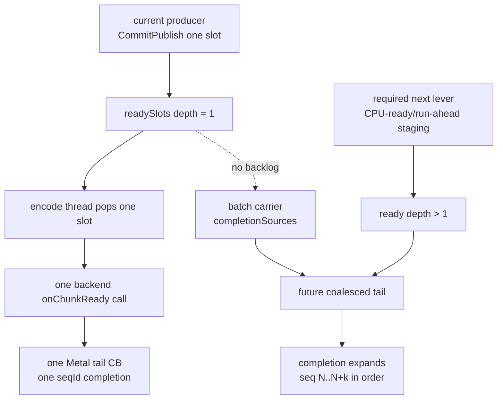

# Present-Pacing 82 - Batch carrier is not a standalone current lever

## Question

Now that the queue has `dequeueReadySlotBatch()`, `runEncodeBatchIteration()`,
and `QueueSubmissionRecord::completionSources`, can wiring the encode loop to
consume several ready slots by itself recover the current GT1 average-FPS
bottleneck?

## Verdict

No. The batch carrier is still required for a future coalesced-tail design, but
it does not create overlap by itself. Current GT1 does not build ready-slot
backlog for the encoder to consume:

| Metric | `v0.0.3` visual-anchor run | PE between-call scout |
|---|---:|---:|
| `encode_ready_depth_avg` | `1.000` | `1.000` |
| `encode_ready_depth_gt1_per_present` | `0.000` | `0.000` |
| `completion_wait_with_enqueue_ms_per_present` | `0.051` | `0.000` |
| `completion_wait_without_enqueue_ms_per_present` | `26.839` | `28.311` |
| `no_enqueue_before_publish_inter_replay_gap_ms_per_present` | `11.879` | `24.077` |
| `command_buffers_per_present` | `3.999` | `3.999` |

The current source also still calls the backend once per ready slot:
`CommandQueue::runEncodeLoop()` uses `runEncodeIteration()`, and each
`backend_->onChunkReady()` call forwards one `ChunkSlot` to
`encoders::encodeChunk()`. `runEncodeBatchIteration()` is a strict-order
completion carrier for a future backend selector; no production backend path
currently feeds it more than one ready source or encodes several source slots
into one Metal tail command buffer.

## Interpretation

Wiring `runEncodeBatchIteration()` without changing producer readiness would be
a structural no-op for GT1: the scratch span would almost always contain one
source. A valid average-FPS candidate still needs a CPU-ready/run-ahead stage
that creates backlog while the completion watcher waits, followed by encode-side
coalescing that preserves the H57 locality gates.

## Gate

Do not promote a batch/coalescing patch from code shape alone. It must show all
of the following before an Xcode `.gputrace` spend:

| Gate | Expected direction |
|---|---|
| `encode_ready_depth_gt1_per_present` | increases from zero |
| `completion_wait_with_enqueue_ms_per_present` | increases |
| `completion_wait_without_enqueue_ms_per_present` | decreases |
| `no_enqueue_before_publish_closure_ms_per_present` | decreases, or the dominant inter-replay gap decreases |
| `command_buffers_per_present` / `passes_per_present` / `tile_preservation_mib` | non-increasing |
| Visual gate | matches the `v0.0.3` visual-safe anchor |

## Next Work

The next implementation target is not "call the batch helper" but a fresh
R-BACK-2.35..2.41 CPU-ready path:

1. Stage replayed, retained, CPU-owned work without forcing a Metal command
   buffer boundary.
2. Let the encoder select consecutive ready sources only when the tail can
   preserve command-buffer, render-pass, tile-preservation, present-token, and
   resource-lifetime invariants.
3. Use the H80/H81 compare gates before scheduling GPU counter replay. If the
   no-gputrace run fails to build ready backlog or reduce no-enqueue closure,
   the candidate has not touched the current P4 owner.

**Related.** present-pacing-run-ahead-current-code.73 ·
[present-pacing-noenqueue-compare-closure.80](present-pacing-noenqueue-compare-closure.80.md) ·
[present-pacing-ready-depth-compare.81](present-pacing-ready-depth-compare.81.md).
