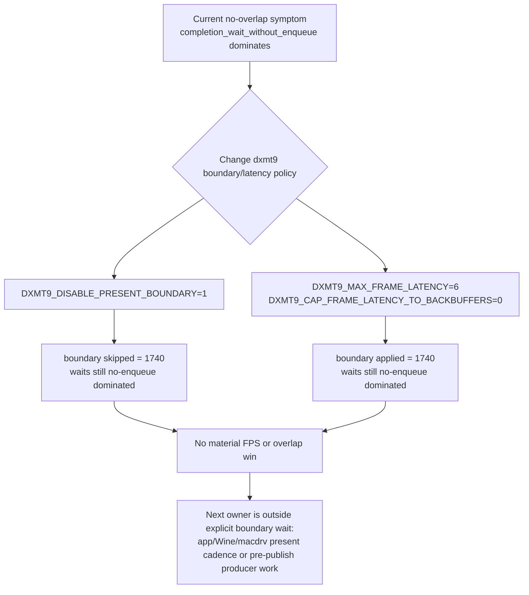

# Present-Pacing 06 — Boundary/Latency A/B

## Question

Does dxmt9's explicit present-boundary policy or max-frame-latency cap prevent
the producer from building the next command buffer while the completion watcher
is blocked in `MTLCommandBuffer.waitUntilCompleted()`?

This tests the open branch left by [present-pacing-pipeline-overlap.05](present-pacing-pipeline-overlap.05.md):
`present_boundary_wait_ms=0` already proved `CommandQueue::presentBoundary()`
was not sleeping, but `BoundaryPolicy::PresentCompletion` is still the default
selected policy and therefore needed a direct A/B.

## Verdict

Rejected as the current owner. The env knobs reached the runtime, but neither
one creates meaningful producer/completion overlap or moves the average FPS
envelope.

## Sources

| Run | Command shape | Artifact |
|---|---|---|
| Fresh baseline | `bash scripts/tools/run_3dmark05_perf_probe.sh --suffix overlap-baseline-r2-20260613 --frame 60 --no-gputrace --no-encoder-breakdown --frame-sampling --timeout 120` | `experiments/output/app-d3d9-3dmark05-overlap-baseline-r2-20260613/result.json` |
| Boundary disabled | `DXMT9_DISABLE_PRESENT_BOUNDARY=1 ... --suffix boundary-disabled-overlap-r1-20260613 ...` | `experiments/output/app-d3d9-3dmark05-boundary-disabled-overlap-r1-20260613/result.json` |
| Deep frame latency | `DXMT9_MAX_FRAME_LATENCY=6 DXMT9_CAP_FRAME_LATENCY_TO_BACKBUFFERS=0 ... --suffix frame-latency6-overlap-r1-20260613 ...` | `experiments/output/app-d3d9-3dmark05-frame-latency6-overlap-r1-20260613/result.json` |

All three runs were watchdog-supervised no-gputrace scouts with frame sampling.
They are valid for pacing/CPU counters, not Xcode encoder-level GPU proof.

## Counter Result

| Metric | Baseline r2 | Boundary disabled | Latency 6 |
|---|---:|---:|---:|
| `present_encoded` | `1740` | `1740` | `1740` |
| `present_boundary_applied` | `1740` | `0` | `1740` |
| `present_boundary_skipped` | `0` | `1740` | `0` |
| `present_boundary_waits` | `0` | `0` | `0` |
| `present_boundary_wait_ms` | `0.000` | `0.000` | `0.000` |
| `completion_present_wait_ms` | `44269.309` | `44519.782` | `44028.487` |
| `completion_present_wait_p50_ms` | `27.682` | `27.546` | `27.410` |
| `completion_present_wait_p95_ms` | `35.728` | `36.836` | `35.803` |
| `completion_wait_with_enqueue` | `1` | `1` | `0` |
| `completion_wait_with_enqueue_ms` | `54.015` | `44.514` | `0.000` |
| `completion_wait_without_enqueue_ms` | `44215.294` | `44475.268` | `44028.487` |
| wait-end -> `CommitPublish` p50 / p95 | `15.255 / 29.773ms` | `9.206 / 30.042ms` | `15.357 / 29.914ms` |
| wait-end -> `EncodeDequeue` p50 / p95 | `11.948 / 34.376ms` | `10.876 / 34.489ms` | `12.148 / 34.341ms` |
| wait-end -> Metal commit p50 / p95 | `22.705 / 54.687ms` | `21.652 / 55.424ms` | `22.739 / 54.761ms` |
| wait-end -> next enqueue p50 / p95 | `22.723 / 54.714ms` | `21.669 / 55.456ms` | `22.760 / 54.794ms` |
| sampled frame wall p50 / p95 | `55.505 / 85.933ms` | `56.106 / 85.590ms` | `55.753 / 85.493ms` |
| sampled FPS p50 / p95 | `18.010 / 25.972` | `17.813 / 26.113` | `17.934 / 26.329` |

The single `completion_wait_with_enqueue` event in baseline and boundary-off is
not a production-overlap signal: it accounts for only `0.10-0.12%` of total
completion wait, appears without the env intervention, and does not improve the
frame-sampling envelope.

## Interpretation

`DXMT9_DISABLE_PRESENT_BOUNDARY=1` is proven to reach the runtime because
`present_boundary_skipped=1740`. It still leaves completion wait fully exposed:
`completion_wait_without_enqueue_ms=44475.268`, frame p50 is slightly worse, and
the post-wait publish/encode/commit gaps remain in the same range.

`DXMT9_MAX_FRAME_LATENCY=6` with the backbuffer cap disabled is also flat. Since
`present_boundary_waits=0` in both baseline and latency6, the max-latency token
has no sleeping wait to relax in this current GT1 direct path.

Therefore the current "why does the producer not run during the wait?" question
is not answered by dxmt9's explicit boundary wait. The next localization should
instrument before `CommitPublish`: app-side `Present()` return, PE chunk close,
unix `commit_chunk` entry, replay start, and Wine/macdrv event handoff if needed.
If those timestamps show the app does not call into the next chunk until after
completion, the owner is app/Wine present cadence. If the app enters but publish
is delayed, the owner is PE/unix commit/replay CPU work.
