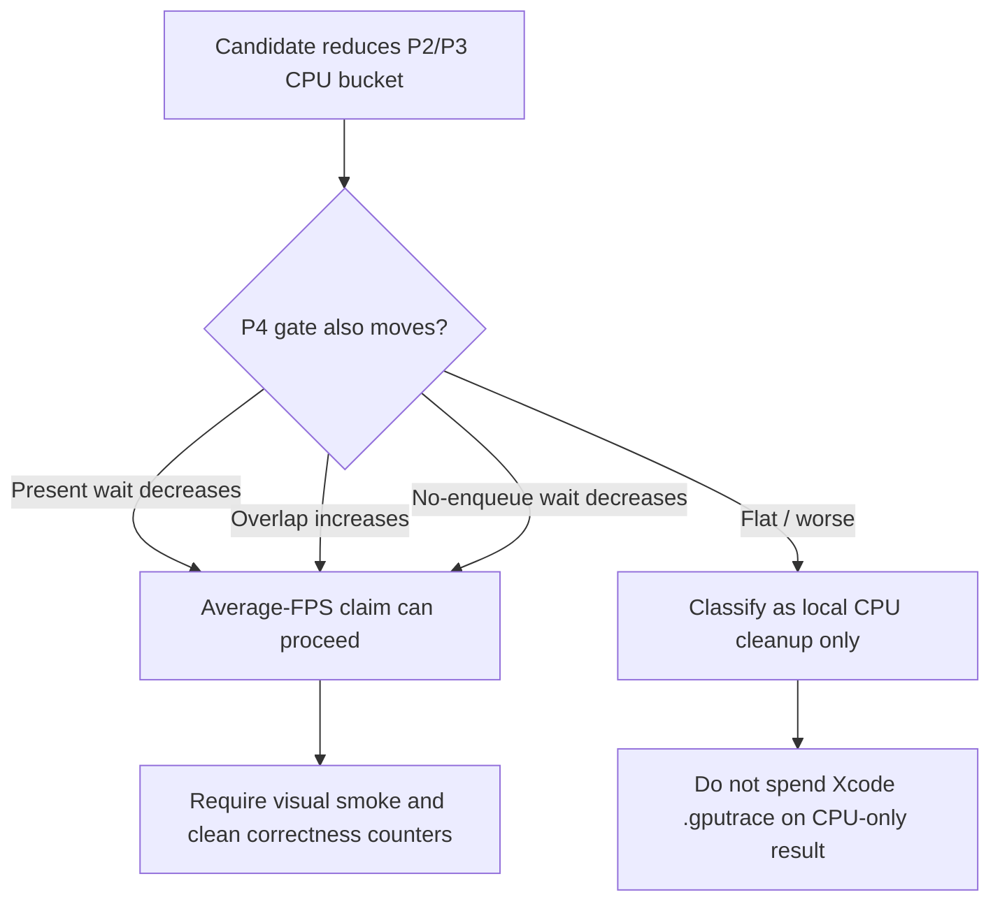

# Present-Pacing 37 - P4 Completion-Overlap Compare Gates

## Question

The current average-FPS model says local P2/P3 CPU wins are not enough by
themselves: a candidate must either shorten exposed completion wait or create
useful overlap while the completion thread waits. Make that proof a reusable
A/B gate instead of a prose-only review rule.

## Tooling

`scripts/tools/compare_3dmark05_perf_counters.py` now reports these derived
metrics for both sides of an A/B:

| Metric | Purpose |
|---|---|
| `completion_present_wait_ms_per_present` | present-bearing completion wait budget |
| `completion_wait_with_enqueue_ms_per_present` | time hidden by later command-buffer enqueue work |
| `completion_wait_without_enqueue_ms_per_present` | exposed no-overlap wait |
| `completion_wait_overlap_share_pct` | total completion wait share with enqueue overlap |
| `completion_wait_no_enqueue_share_pct` | total completion wait share without enqueue overlap |
| `completion_present_wait_overlap_share_pct` | Present-only overlap share |
| `completion_present_wait_no_enqueue_share_pct` | Present-only no-overlap share |

It also adds explicit requirement gates:

```sh
python3 scripts/tools/compare_3dmark05_perf_counters.py \
  <baseline-output> <candidate-output> \
  --require-completion-present-wait-decrease \
  --require-completion-wait-with-enqueue-increase \
  --require-completion-wait-without-enqueue-decrease
```

Use the `completion_present_*` with/without-enqueue gate variants when the
candidate specifically claims a Present-bearing command-buffer improvement:

```sh
  --require-completion-present-wait-with-enqueue-increase \
  --require-completion-present-wait-without-enqueue-decrease
```

The same flags pass through `run_3dmark05_perf_probe.sh` via
`--compare-baseline-output`: no-gputrace runs execute the counter comparison
directly, while `.gputrace` runs print a `finalize_cmd_after_xcode_export`
that forwards the gates to `finalize_3dmark05_perf_probe.sh`.



## Interpretation

This is tooling, not a new performance result. It turns the accepted
present-pacing-pipeline-overlap.05 and present-pacing-systemtrace-p4-range.36
model into an executable A/B check:

- A CPU cleanup that lowers `encode_draw_cpu_ms` but leaves
  `completion_wait_without_enqueue_ms` flat is not yet an average-FPS fix.
- A producer-overlap design should make `completion_wait_with_enqueue_ms`
  nonzero at a meaningful per-present scale, or reduce the no-enqueue bucket.
- A Present-path change should move `completion_present_wait_ms` or its
  Present-only overlap/no-overlap split, not only a non-Present wait bucket.

The report verdict now surfaces the P4 deltas beside GPU command-buffer time,
so reviewers can catch a misleading local win before opening Xcode or spending
another `.gputrace`.

## Verification

- `python3 -m pytest tests/scripts/test_compare_3dmark05_perf_counters.py -q`
- `python3 -m pytest tests/scripts/test_3dmark05_probe_scripts.py -q -k 'pacing_compare_gates'`
- `python3 -m pytest tests/scripts/test_summarize_3dmark05_perf.py -q`
- `meson test -C build-arm64-nowine dxmt9-perf-docs-source-audit`
- `git diff --check -- scripts/tools/compare_3dmark05_perf_counters.py scripts/tools/run_3dmark05_perf_probe.sh scripts/tools/finalize_3dmark05_perf_probe.sh tests/scripts/test_compare_3dmark05_perf_counters.py tests/scripts/test_3dmark05_probe_scripts.py docs/perfomance/present-pacing/index.md docs/perfomance/present-pacing/present-pacing-compare-gates.37.md`

**Related.** present-pacing-systemtrace-p4-range.36 ·
present-pacing-pipeline-overlap.05 ·
present-pacing-lowoverhead-refresh.33.
