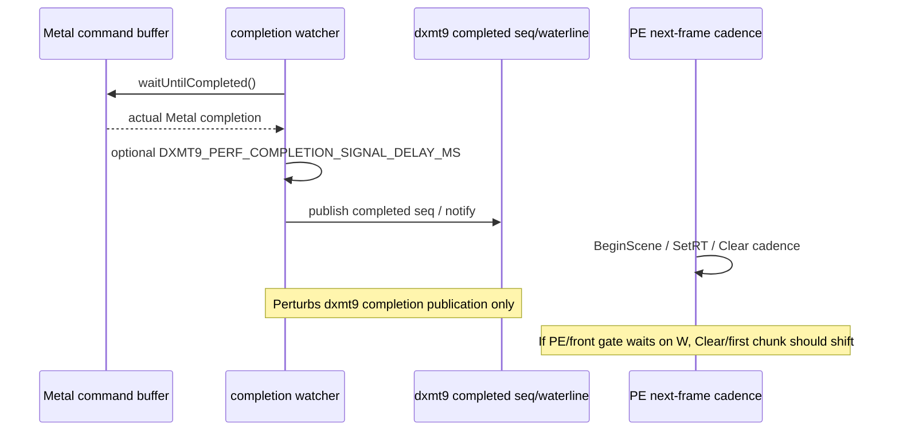
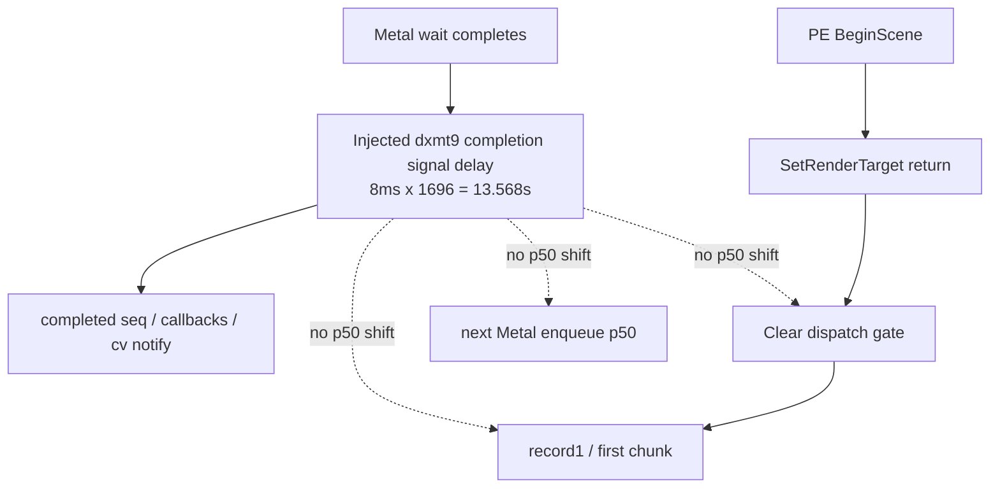

# Present-Pacing 21 - Completion Signal Delay Perturbation

> **Outdated — every artifact this leaf cites in `source:` is gone from disk.** The numbers below cannot be re-derived or re-checked. Kept as history; do not cite it as current evidence.

## Question

[present-pacing-pe-caller-stack.20](present-pacing-pe-caller-stack.20.md) shows that PE `BeginScene` is immediate,
but the record-producing `Clear` command object arrives later. The remaining
ambiguity was whether this front gate, or the later no-enqueue Metal gap, is
waiting on dxmt9's completed-seq/waterline publication after Metal completion.

This run does not test all possible compositor/CA dependencies. It specifically
tests whether delaying dxmt9's completion signal after `waitUntilCompleted()`
returns makes the next-frame PE cadence or next Metal enqueue move.

## Implementation

Added `DXMT9_PERF_COMPLETION_SIGNAL_DELAY_MS`, a perf-only perturbation knob.
When set, the completion watcher sleeps after `waitUntilCompleted()` returns
and before it publishes the completed seq/waterline, runs completion callbacks,
or notifies waiters. The value is clamped to `250ms`.

The applied delay is recorded in:

- `completion_signal_delay`
- `completion_signal_delay_ms`



## Runs

Baseline:

```sh
DXMT9_PE_RECORDER_STATS=1 DXMT_LOG_LEVEL=info \
  scripts/tools/run_3dmark05_perf_probe.sh \
    --suffix present-completion-signal-baseline-r1-20260614 \
    --frame 60 \
    --no-gputrace \
    --no-encoder-breakdown \
    --timeout 120
```

Delay:

```sh
DXMT9_PE_RECORDER_STATS=1 DXMT_LOG_LEVEL=info \
DXMT9_PERF_COMPLETION_SIGNAL_DELAY_MS=8 \
  scripts/tools/run_3dmark05_perf_probe.sh \
    --suffix present-completion-signal-delay8-r2-20260614 \
    --frame 60 \
    --no-gputrace \
    --no-encoder-breakdown \
    --timeout 120
```

Both runs passed. The baseline was timeout-finalized at the wrapper tail, so use
cadence counters rather than wallclock as the proof.

## Result

The delay run proves the perturbation was active:

| Metric | Baseline | Delay 8ms |
|---|---:|---:|
| `present_encoded` | `1680` | `1696` |
| `completion_signal_delay` | n/a | `1696` |
| `completion_signal_delay_ms` | n/a | `13568.000` |
| `completion_wait_with_enqueue` | `5` | `4` |
| `completion_no_enqueue_wait_to_next_enqueue_p50_ms` | `21.558` | `20.274` |
| `completion_no_enqueue_wait_to_commit_chunk_entry_p50_ms` | `0.773` | `0.807` |
| `completion_no_enqueue_stage_commit_entry_to_publish_p50_ms` | `5.804` | `5.119` |
| `completion_no_enqueue_stage_encode_dequeue_to_command_buffer_commit_p50_ms` | `11.944` | `11.567` |
| `queue_writer_wait_ms` / `queue_commit_wait_ms` / `queue_sequence_wait_ms` | `0 / 0 / 0` | `0 / 0 / 0` |

PE cadence is unchanged within noise:

| Metric | Baseline p50 / p95 | Delay 8ms p50 / p95 |
|---|---:|---:|
| first next PE call | `0.433 / 0.543ms` | `0.431 / 0.533ms` |
| `SetRenderTarget` return | `1.040 / 1.413ms` | `1.034 / 1.338ms` |
| `Clear` entry | `18.799 / 31.871ms` | `18.738 / 31.551ms` |
| `SetRenderTarget` return -> `Clear` entry | `17.631 / 30.376ms` | `17.550 / 30.392ms` |
| record 1 | `19.025 / 32.158ms` | `19.011 / 32.029ms` |
| first chunk entry | `20.802 / 35.637ms` | `20.827 / 35.096ms` |

## Interpretation

The front gate is not waiting on dxmt9's completed-seq/waterline publication:



So the earlier phrasing needs to stay precise:

- If "N+1" means PE API calls or the first record-producing `Clear`, it is not
  tied to dxmt9 completion publication. PE starts quickly and the `Clear` gate
  remains app command-dispatch cadence.
- If "N+1" means the next Metal command-buffer enqueue, it still usually occurs
  after the previous completion wait, but this A/B says that is not because the
  encode path is blocked on dxmt9's completed-seq/waterline signal.

The remaining owners are therefore still:

- app/3DMark05 command-dispatch cadence before `Clear`, independent of dxmt9's
  completion signal;
- PE chunk fill and unix replay/submit/snapshot once records exist;
- backend encode after `EncodeDequeue`.

An actual Metal/CA-completion dependency is not proven or disproven by this
test because the perturbation happens after `waitUntilCompleted()` has already
returned. Testing that would require a separate pre-commit or GPU/compositor
completion perturbation, and should be treated as a different experiment.
