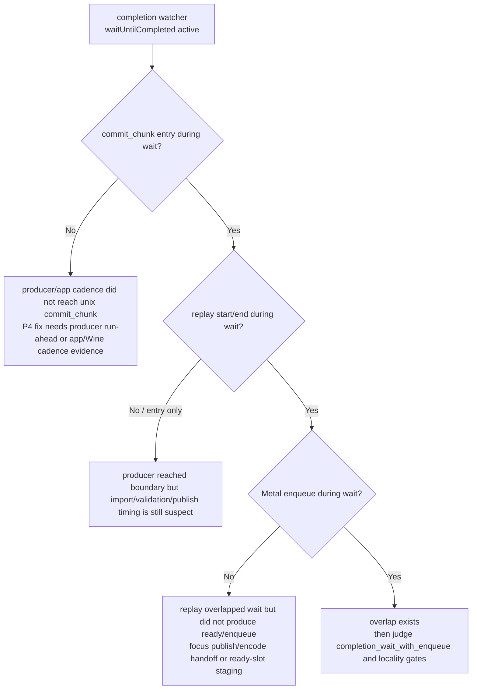

# Present-Pacing 83 - Completion wait commit_chunk overlap counters

## Question

When `completion_wait_with_enqueue` stays near zero, is the producer completely
absent during the completion-thread `waitUntilCompleted()`, or is it running
`dxmt9c_device_commit_chunk()` but failing to publish/enqueue the next Metal
command buffer before the wait finishes?

## Instrumentation

The queue now records commit_chunk milestones observed while
`QueueLifecycleController::completionWaitActive_` is true:

| Counter | Meaning |
|---|---|
| `completion_wait_commit_chunk_entries` | `dxmt9c_device_commit_chunk()` entry observed during a completion wait |
| `completion_wait_commit_chunk_replay_starts` | validated chunk replay began during a completion wait |
| `completion_wait_commit_chunk_replay_ends` | chunk replay ended during a completion wait |
| `completion_wait_commit_chunk_replay_cpu_ms` | replay CPU time for chunks whose replay end was observed during a completion wait |

`summarize_3dmark05_perf.py` and `compare_3dmark05_perf_counters.py` expose the
matching per-present rows:

| Derived row | Use |
|---|---|
| `completion_wait_commit_chunk_entries_per_present` | proves whether the PE/unix producer reached commit_chunk while the watcher waited |
| `completion_wait_commit_chunk_replay_starts_per_present` | separates importer-only overlap from actual replay overlap |
| `completion_wait_commit_chunk_replay_ends_per_present` | shows replay completion before the wait boundary |
| `completion_wait_commit_chunk_replay_cpu_ms_per_present` | sizes replay CPU work that overlapped the wait |

## Interpretation

This complements H80/H81. The old no-enqueue counters measure the gap after a
completion wait ends. These counters measure producer activity while the wait is
still active.

## Gate

The next no-gputrace P4 run should include these rows before another Xcode
counter spend:

| Observation | Next owner |
|---|---|
| all `completion_wait_commit_chunk_*_per_present` rows stay zero | producer/app/Wine cadence; queue-side coalescing alone cannot create overlap |
| entries/replay starts are nonzero but replay ends and enqueue stay zero | import/replay duration or pre-publish handoff |
| replay ends are nonzero but `completion_wait_with_enqueue` stays zero | publish/ready-slot/encode handoff |
| replay ends and enqueue are nonzero | candidate has created overlap; then apply H57 locality and `v0.0.3` visual gates |

## Verification

- `python3 -m pytest tests/scripts/test_compare_3dmark05_perf_counters.py`
- `python3 -m py_compile scripts/tools/summarize_3dmark05_perf.py scripts/tools/compare_3dmark05_perf_counters.py`
- `meson compile -C build-arm64-nowine`
- `meson test -C build-arm64-nowine dxmt9-queue-completion-sources-spec dxmt9-verify-tla`
- `git diff --check`

**Related.** [[present-pacing-noenqueue-compare-closure.80]] ·
[[present-pacing-ready-depth-compare.81]] ·
[[present-pacing-batch-carrier-current.82]].
