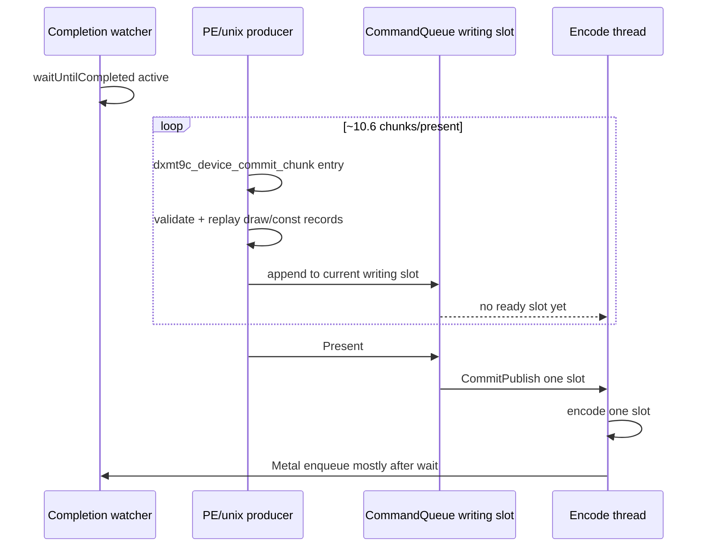

# Present-Pacing 84 - Current completion wait overlap shows present-gated publish

## Question

After adding H83 counters, does current GT1 fail P4 overlap because the
producer is absent during completion waits, or because producer replay happens
but does not publish/enqueue until a later boundary?

## Evidence

Run:
`experiments/output/app-d3d9-3dmark05-h83-completion-wait-overlap-r1`.

| Metric | Value |
|---|---:|
| `present_encoded` | `1800` |
| `draw_skipped_no_pipeline` | `0` |
| `gpu_command_buffer_errors` | `0` |
| `completion_wait_ms_per_present` | `27.025` |
| `completion_wait_with_enqueue_ms_per_present` | `0.031` |
| `completion_wait_without_enqueue_ms_per_present` | `26.994` |
| `completion_wait_commit_chunk_entries_per_present` | `10.574` |
| `completion_wait_commit_chunk_replay_starts_per_present` | `10.564` |
| `completion_wait_commit_chunk_replay_ends_per_present` | `10.372` |
| `completion_wait_commit_chunk_replay_cpu_ms_per_present` | `3.695` |
| `encode_ready_depth_avg` | `1.000` |
| `encode_ready_depth_gt1_per_present` | `0.000` |
| `commit_chunk_replay_cpu_ms_per_present` | `7.994` |
| `encode_chunk_cpu_ms_per_present` | `11.275` |
| `gpu_command_buffer_time_ms_per_present` | `3.190` |

Publish reasons are decisive:

| Counter | Value |
|---|---:|
| `chunk_publish_reason_present` | `1800` |
| `chunk_publish_reason_draw_limit` | `0` |
| `chunk_publish_reason_payload_limit` | `0` |
| `chunk_publish_reason_flush` | `0` |
| `chunk_publish_commands_present` | `593829` |

The no-enqueue before-publish shape also shows that the producer is doing real
draw work before the first publish after a no-enqueue wait:

| Metric | Value |
|---|---:|
| chunks before publish / sample | `14.481` |
| chunks with draw / sample | `13.481` |
| records before publish / sample | `721.737` |
| draw records before publish / sample | `369.917` |
| const records before publish / sample | `347.842` |
| completed replay CPU before publish / present | `3.891ms` |
| inter-replay producer gap before publish / present | `11.691ms` |

## Verdict

Current GT1 is not producer-absent during completion waits. The producer reaches
unix `commit_chunk`, validates/replays draw-bearing chunks, and spends about
`3.7ms/present` of replay CPU while the completion watcher is waiting.

The missing overlap is the publication boundary: current default publication is
effectively present-gated for this workload, so draw-bearing work remains in the
writing slot until `Present` and cannot become ready-slot backlog or a Metal
enqueue during the wait.

## Implication

This restores the H73/H82 design framing with stronger evidence:

1. Queue-side batch completion alone is still insufficient because ready depth
   remains exactly `1`.
2. A naive early offscreen publish can create overlap, but H74/H75 already
   showed that it can explode command buffers, replay cost, and visual risk.
3. The next P4 implementation should create CPU-ready/run-ahead visibility for
   replayed draw work without forcing every early boundary into a separate Metal
   command buffer or render-pass split.

## Next Gate

Before another `.gputrace`, the next no-gputrace candidate should show:

| Gate | Required direction |
|---|---|
| `completion_wait_commit_chunk_entries_per_present` | stays nonzero; producer overlap must not disappear |
| `encode_ready_depth_gt1_per_present` | increases from `0` |
| `completion_wait_with_enqueue_ms_per_present` | increases materially |
| `completion_wait_without_enqueue_ms_per_present` | decreases |
| `chunk_publish_reason_draw_limit` / payload/flush | only increases if command-buffer and render-pass locality stay flat |
| `command_buffers_per_present`, `passes_per_present`, `tile_preservation_mib` | non-increasing or explicitly explained |
| visual gate | matches `v0.0.3` |

**Related.** [present-pacing-completion-wait-overlap-counters.83](present-pacing-completion-wait-overlap-counters.83.md) ·
[present-pacing-batch-carrier-current.82](present-pacing-batch-carrier-current.82.md) ·
[present-pacing-run-ahead-coalesce.69](present-pacing-run-ahead-coalesce.69.md) ·
[present-pacing-run-ahead-cpu-ready.70](present-pacing-run-ahead-cpu-ready.70.md).
