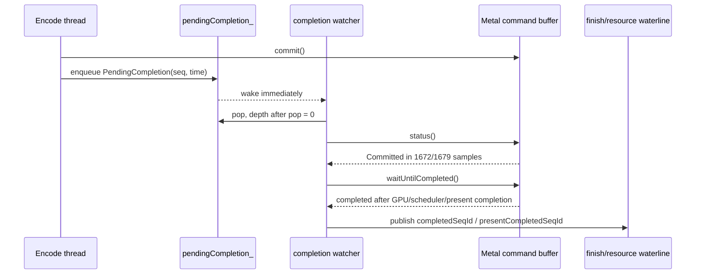
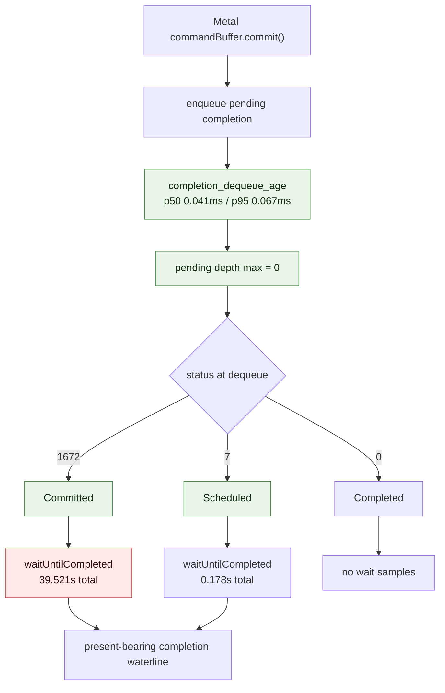

# Completion watcher pops immediately and waits on Committed command buffers

**Question / hypothesis.** After [present-pacing-current-immediate.02](present-pacing-current-immediate.02.md)
proved that current GT1 direct already uses immediate presents, the next
question was whether `completion_wait_ms` is an artifact of completion
thread backlog, or whether the completion thread is waiting almost
immediately after each Metal command buffer commit.

**Method.** Add non-mutating completion-watcher counters at the unix-side
`QueueLifecycleController::processOnePendingCompletion()` pop point:

- `completion_dequeue_age_ms` and percentiles: time from pending record
  enqueue to completion-thread dequeue.
- `completion_pending_depth_max`: queue backlog after the pop.
- `completion_dequeue_status_*`: `MTLCommandBuffer.status` at dequeue.
- `completion_wait_status_*`: `waitUntilCompleted()` time bucketed by that
  pre-wait status.

Run:

```sh
bash scripts/tools/run_3dmark05_perf_probe.sh \
  --suffix completion-status-20260612-211546 \
  --frame 50 --no-gputrace --no-encoder-breakdown \
  --frame-sampling --timeout 180
```

The run hit the known final-frame timeout and produced `status:
partial-log`, but it emitted 1,731 frame sampling lines and the final
`[dxmt9-perf]` counter line. Treat it as valid for completion-watcher
attribution, not as a clean score sample.

**Result.**

| Metric | Value | Read |
|---|---:|---|
| `present_encoded` | 1,680 | normal GT1 present count |
| `present_schedule_immediate` | 1,680 | still immediate presents |
| `completion_dequeue_samples` | 1,679 | one short because timeout killed the final tail |
| `completion_pending_depth_max` | 0 | no completion queue backlog |
| `completion_dequeue_age_ms` | 78.111 total | enqueue to pop is tiny |
| `completion_dequeue_age_p50_ms` | 0.041 | watcher wakes almost immediately |
| `completion_dequeue_age_p95_ms` | 0.067 | no delayed pop tail |
| `completion_dequeue_status_committed` | 1,672 | almost every CB is popped before scheduling |
| `completion_dequeue_status_scheduled` | 7 | rare |
| `completion_dequeue_status_completed` | 0 | watcher is not merely polling completed CBs |
| `completion_wait_status_committed_ms` | 39,520.923 | wait is mostly from Committed state |
| `completion_wait_status_scheduled_ms` | 177.940 | scheduled-state tail is small |
| `completion_wait_ms` | 39,698.863 | all attributed to present-bearing CBs |
| `gpu_command_buffer_time_ms` | 5,211.294 | much smaller than completion wait |

Steady frame sampling after dropping the startup frame and >1s outlier:

| Metric | Value |
|---|---:|
| rows | 1,729 |
| `wall_ms` p50 / p95 / p99 | 56.830 / 90.307 / 112.959 |
| `fps` p50 | 17.596 |
| `completion_wait_ms` p50 / p95 / p99 | 23.874 / 36.458 / 42.510 |
| `gpu_command_buffer_time_ms` p50 / p95 / p99 | 1.052 / 14.134 / 17.378 |
| `encode_chunk_cpu_ms` p50 / p95 / p99 | 11.512 / 21.994 / 27.196 |
| `encode_draw_cpu_ms` p50 / p95 / p99 | 8.940 / 17.274 / 21.640 |





**Verdict.** Accepted. `completion_wait_ms` is not caused by a dxmt9
completion-queue backlog. The watcher dequeues almost immediately, then
blocks on command buffers that are still `Committed`. Therefore the large
gap between `completion_wait_ms` and `gpu_command_buffer_time_ms` is below
the pending-completion queue: Metal scheduling, driver queueing, GPU
execution, drawable presentation acceptance, or their ordering effects.

This changes the optimization question. A delayed/polling completion
watcher would hide CPU time in the watcher thread but would not by itself
advance resource waterlines or present-completion tokens earlier. A real
fps win still needs one of:

1. Reduce per-present encode/GPU work so the committed CB reaches completed
   earlier.
2. Split resource lifetime from present-token lifetime so non-present
   resources can retire independently without serial present waits.
3. Use Metal completion handlers or shared-event style progress tracking
   only if they preserve the sequence-ID waterline proof and measurably
   reduce producer-side stalls.
