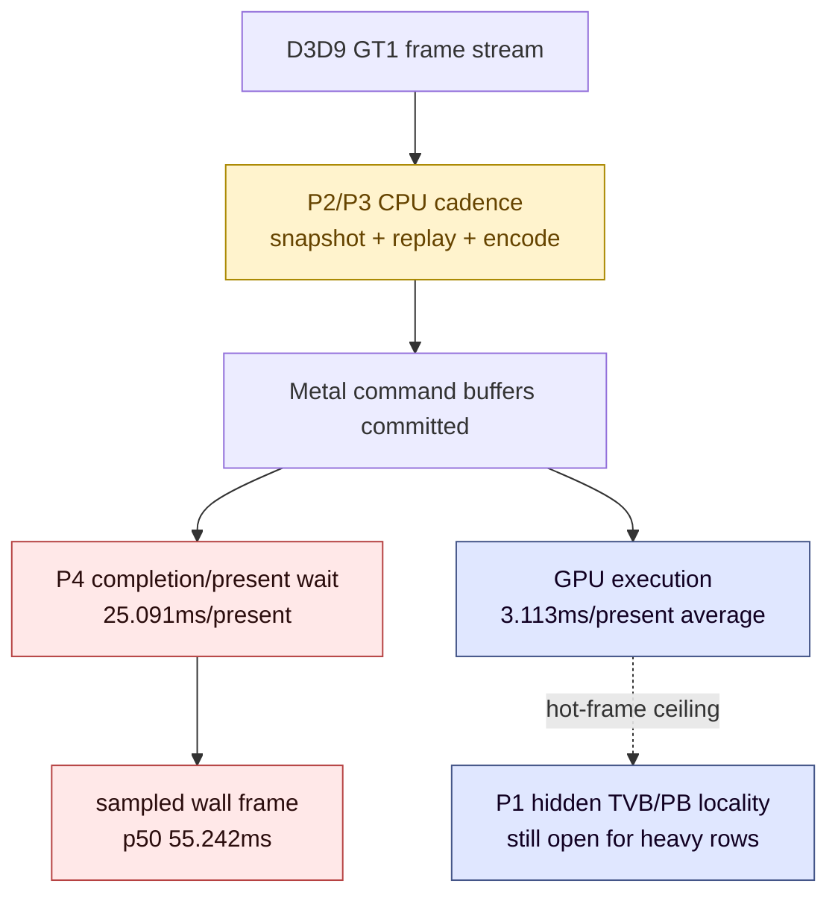
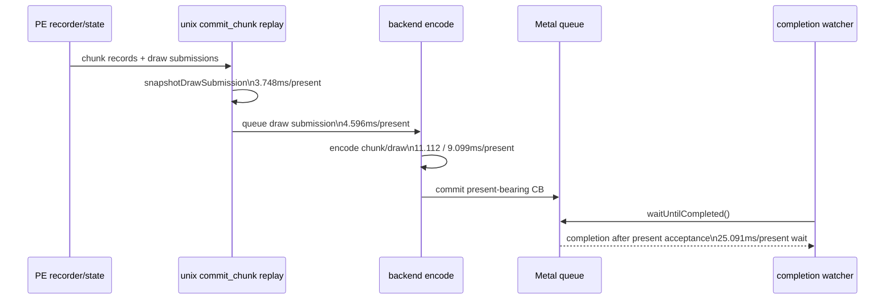

# Current wallclock FPS owner is CPU cadence plus present-completion wait

> **Outdated — every artifact this leaf cites in `source:` is gone from disk.** The numbers below cannot be re-derived or re-checked. Kept as history; do not cite it as current evidence.

**Question / hypothesis.** After [hidden-backend-storage-shape.30](../hidden-backend-storage/hidden-backend-storage-shape.30.md) split the
GPU-efficiency question from the average wallclock-FPS question, the next gate
was whether current GT1 should return to the P2/P3 CPU encode/submit lane plus
the P4 completion/present pacing lane, or whether hot-frame GPU locality should
be treated as the immediate average-FPS owner.

**Method.** Use a low-overhead current-head scout without `.gputrace` or encoder
breakdown so instrumentation does not create the FPS-zero / one-draw-per-several
seconds artifact:

```sh
bash scripts/tools/run_3dmark05_perf_probe.sh \
  --suffix current-lowoverhead-20260613 \
  --frame 60 \
  --no-gputrace \
  --no-encoder-breakdown \
  --frame-sampling \
  --timeout 120
```

The run is clean (`status=pass`, `timed_out=false`) and produces `1800`
presents plus `1807` frame-sampling rows. Treat `process_elapsed_sec` as whole
launcher lifetime; use frame sampling and per-present-normalized counters for
the pacing decision.

**Result.**

| Metric | Value | Read |
|---|---:|---|
| `process_elapsed_sec` | `129.267` | whole app/run lifetime |
| `present_encoded` | `1800` | normal fixed workload sample |
| frame-sampled FPS p50 / p95 / last | `18.102 / 26.630 / 24.798` | current low-overhead FPS envelope |
| frame `wall_ms` p50 / p95 / p99 | `55.242 / 84.648 / 102.956` | most frames are well above 16.67ms |
| `present_schedule_requested_immediate` | `1800` | current direct path already requests immediate |
| `present_schedule_after_minimum_duration` | `0` | no software min-duration present path |
| `present_boundary_wait_ms` | `0.000` | boundary policy is not the wait owner |
| `completion_pending_depth_max` | `0` | no completion queue backlog |
| `completion_dequeue_age_ms` / present | `0.043958` | watcher pops almost immediately |
| `completion_present_wait_ms` / present | `25.091` | P4 wallclock bucket |
| `gpu_command_buffer_time_ms` / present | `3.113` | average GPU execution is much smaller |

CPU-side per-present owners:

| Counter | Total ms | ms / present | Read |
|---|---:|---:|---|
| `encode_chunk_cpu_ms` | `20001.528` | `11.112` | backend encode cadence |
| `encode_draw_cpu_ms` | `16378.182` | `9.099` | per-draw encode remains hot |
| `commit_chunk_replay_cpu_ms` | `19342.975` | `10.746` | unix replay/importer cadence |
| `commit_chunk_queue_draw_submission_cpu_ms` | `8273.339` | `4.596` | queued submission/snapshot lane |
| `d3d9_snapshot_draw_submission_cpu_ms` | `6745.816` | `3.748` | frontend snapshot construction |
| `d3d9_snapshot_cache_lookup_cpu_ms` | `5802.060` | `3.223` | snapshot cache lookup is still large |
| `commit_chunk_draw_batch_submit_cpu_ms` | `2561.454` | `1.423` | draw-batch submit residual |
| `commit_chunk_draw_run_submit_cpu_ms` | `1882.324` | `1.046` | draw-run submit residual |
| `submit_draw_run_batch_append_cpu_ms` | `1922.710` | `1.068` | queue append is still copy/width bound |
| `submit_draw_run_batch_compat_scan_cpu_ms` | `48.669` | `0.027` | generation/lane fast path closed this bucket |

Frame sampling after dropping the startup outlier (`wall_ms < 1000`) gives
`1805` rows, `104.449s` sampled wall time, and `17.28 fps` by summed frame
time. The same trimmed set has `completion_wait_ms` p50/p95/p99
`25.012 / 38.195 / 41.611`, while `gpu_command_buffer_time_ms` p50/p95/p99 is
only `1.089 / 13.314 / 15.934`.





**Verdict.** Accepted. The current average-FPS limit should be worked as
**P2/P3 CPU cadence plus P4 present-completion pacing**. P4 is the observed wait
bucket, but the present-side knobs tested so far are not load-bearing:
all presents are already immediate, `present_boundary_wait_ms=0`, drawable
acquire is tiny, and the completion watcher is not backlogged. The practical
next lever is therefore reducing the CPU work that feeds present-bearing
command buffers and checking whether the P4 wait collapses with it.

This does **not** downgrade the GPU-locality work. [mini-replay-bisection-replay.03](../mini-replay-bisection/mini-replay-bisection-replay.03.md)
and [hidden-backend-storage-shape.30](../hidden-backend-storage/hidden-backend-storage-shape.30.md) still prove the hot GPU path is not at a
hardware floor: primitive order alone changes hidden VS/PB write density by
`3.86x` at nearly identical invocation count. That lane is a hot-frame GPU
efficiency and ceiling problem, not the immediate average-FPS owner unless a
future A/B also moves wallclock/pacing counters.

**Next gate.**

- No-gputrace A/Bs should target named P2/P3 buckets first:
  `encode_draw_cpu_ms`, `commit_chunk_replay_cpu_ms`,
  `commit_chunk_queue_draw_submission_cpu_ms`,
  `d3d9_snapshot_cache_lookup_cpu_ms`, and residual queue append width.
- Each CPU win must report both the moved bucket and
  `completion_present_wait_ms` / sampled FPS. A CPU-local win that leaves P4 and
  frame sampling flat is still useful, but it is not yet an average-FPS proof.
- Use `.gputrace` / Xcode replay counters for P1 hot-frame backend locality,
  not as the first tool for current average FPS unless the low-overhead scout
  shows GPU command-buffer time approaching the frame wall time.

**Related.** [present-pacing](index.md) · [state-churn-encode](../state-churn-encode/index.md) ·
[hidden-backend-storage-shape.30](../hidden-backend-storage/hidden-backend-storage-shape.30.md).
