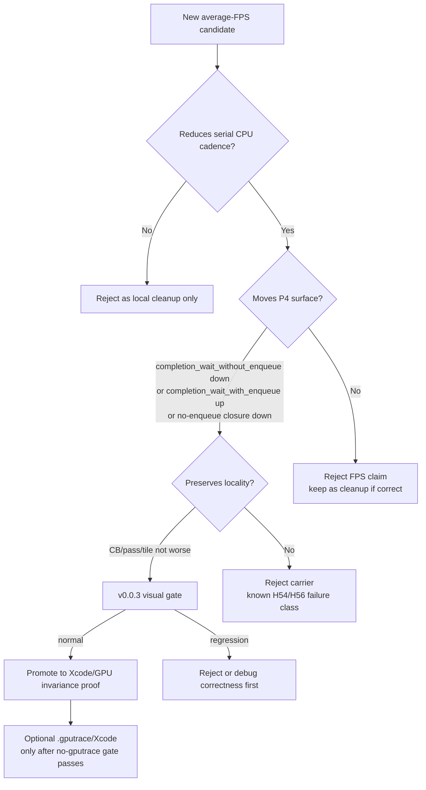

# Present-Pacing 89 - Current Average-FPS Frontier After Tail-Present Rejection

## Question

After correcting the GT1 visual anchor to `v0.0.3`, restoring file
`.gputrace` export, refreshing Xcode frame60 counters, and rejecting the
tail-Present batch carrier as an FPS fix, what is the next bottleneck frontier?

## Verdict

The investigation now has two separate lanes:

1. **GPU hot-frame ceiling:** the latest Xcode frame60 capture still names
   hidden vertex/tiler/backend storage as the dominant hot-frame GPU cost.
   Top-three render encoders consume `98.33%` of GPU time and write
   `1779.229 MiB` of VS-buffer traffic with an estimated `1749.865 MiB`
   unexplained backend write. This remains real, but it is not the current
   average-FPS owner.
2. **Average-FPS owner:** the current average-FPS lane is still serialized
   producer/replay/snapshot/encode cadence exposed as no-enqueue completion
   wait. H88 proves we can create ready-depth without exploding command-buffer
   or render-pass locality, but the r4 same-day comparison worsens the
   no-enqueue closure and `wait -> next enqueue`. The next FPS work should
   therefore reduce the serial cadence itself or introduce a larger overlap
   design that actually reduces the no-enqueue closure.

Do not spend the next `.gputrace` on CPU attribution alone. Use no-gputrace
P4/P2/P3 gates first, then use Xcode only when a candidate has moved the
wall-clock surface and needs GPU invariance or hot-frame proof.

## Evidence

| Evidence | Result | Meaning |
|---|---:|---|
| Latest Xcode frame60 capture | `36.183ms` GPU, top-three share `98.33%`, VS write `1779.229 MiB` | GPU hot-frame lane remains hidden vertex/backend storage. |
| H84 completion-wait overlap scout | `10.574` commit entries/present during completion wait, but ready depth `1.000` | Producer is not absent; work is replayed without creating useful enqueue overlap. |
| H86 pre-Present opportunity | one tail slot per present, `328.962` commands/slot, `738.675` draw items/present, `340.667 MiB` payload | The present-published slot is a real CPU-ready split opportunity. |
| H88 tail-Present r4 | ready depth `1.000 -> 2.000`, CBs flat `3.999`, passes `11.781 -> 11.688` | The carrier preserves locality and proves the mechanism. |
| H88 tail-Present r4 | no-enqueue closure `15.832 -> 16.921ms/present`, `wait -> next enqueue` `33.043 -> 34.396ms/present`, overlap `0.374 -> 0.000ms/present` | The mechanism is not the FPS/P4 fix. |
| Current snapshot/state review | state N-1 elision closed; uniform materialization `9.092 GiB`, uniform hash `1702.902ms`, append uniform `1176.066ms` | Remaining submit-side CPU is uniform/hash/append, not discarded state copies. |
| Current setter-range review | sparse dirty-run splitting makes records exact but keeps P4/FPS flat or worse | Wide VS-const flush width is attribution, not the next primary FPS lever. |

## Current Gate

## Next Candidates

| Candidate | Why it is still live | Required proof |
|---|---|---|
| Reduce replay/snapshot uniform hash and append cadence | H159 leaves `d3d9_snapshot_uniform_materialized=885,840`, hash `1702.902ms`, and append `1176.066ms`; this is still in the exposed pre-publish CPU lane | Lower replay/snapshot or append per present, plus lower `no_enqueue_before_publish_closure` or `wait_to_next_enqueue`; no v0.0.3 visual regression |
| Larger overlap design beyond tail-Present recombine | H88 proved ready-depth can be created with locality mostly flat, but the current split+recombine adds enough serial cadence to lose the P4 gate | Increase useful ready backlog and reduce no-enqueue closure while keeping CB/pass/tile flat |
| Encode residual only when it moves stage timing | Encode is still ~`11ms/present`, but direct-cbuf and H88 show local encode wins can shift cost to replay/publish or leave FPS flat | Reduce `encode dequeue -> command buffer commit` and total completion wait, not only a child timer |
| GPU locality / backend-storage route | Latest Xcode capture keeps hidden backend storage dominant on hot frame | Needs an invocation/locality or backend-route A/B oracle before another Xcode spend |

## Rejected For Current Priority

- More N-1 `CanonicalDrawState` materialization work: current state elision is
  closed enough that residual discarded state is only about `40.16 MiB`.
- Sparse VS-const dirty-run splitting: exact flush ranges did not move backend
  cbuf pressure or P4/FPS.
- Child `GetDesc` body caching as the primary owner: useful cleanup, already
  rejected as an aggregate FPS lever.
- Tail-Present batch tuning without a new cadence reduction: H88 r4 already
  passes ready-depth/locality but fails no-enqueue closure.
- Another CPU-only `.gputrace`: Xcode is for GPU-hot-frame proof after a
  no-gputrace gate moves, not for re-proving the current P4 attribution.

**Related.** [present-pacing-tail-present-batch-current.88](present-pacing-tail-present-batch-current.88.md) ·
[present-pacing-pre-present-opportunity.86](present-pacing-pre-present-opportunity.86.md) ·
[present-pacing-completion-wait-overlap-current.84](present-pacing-completion-wait-overlap-current.84.md) ·
[state-churn-encode-encode-phase.149](../state-churn-encode/state-churn-encode-encode-phase.149.md) ·
[state-churn-encode-encode-phase.150](../state-churn-encode/state-churn-encode-encode-phase.150.md).
