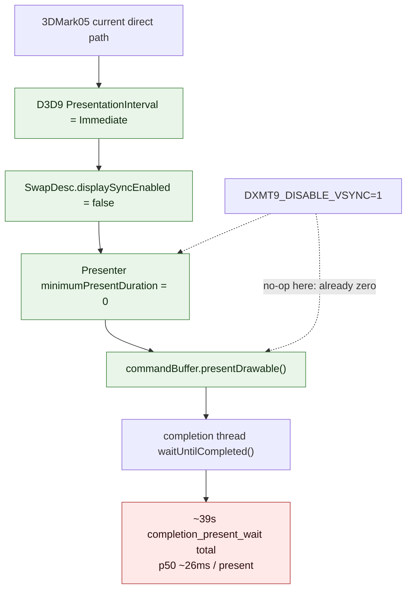

# Current GT1 direct path already uses immediate presents

**Question / hypothesis.** Re-check whether `DXMT9_DISABLE_VSYNC=1`
is still a load-bearing GT1 perf knob after the visual-coupling and
present-path changes. The historical [[present-pacing-vsync-off.01]]
result accepted `DXMT9_DISABLE_VSYNC=1` as a full-workload wallclock
win, but current no-gputrace A/B was flat by frame sampling.

**Method.** Add present scheduling counters at the exact
`presentDrawable*` branch:

- `present_schedule_requested_sync`
- `present_schedule_requested_immediate`
- `present_schedule_after_minimum_duration`
- `present_schedule_immediate`
- `present_minimum_duration_ms`

Then run default and `DXMT9_DISABLE_VSYNC=1` with the same perf wrapper
shape:

```sh
bash scripts/tools/run_3dmark05_perf_probe.sh \
  --suffix present-schedule-default-20260612-205557b \
  --frame 50 --no-gputrace --no-encoder-breakdown \
  --frame-sampling --timeout 180

DXMT9_DISABLE_VSYNC=1 \
bash scripts/tools/run_3dmark05_perf_probe.sh \
  --suffix present-schedule-vsync-off-20260612-205557b \
  --frame 50 --no-gputrace --no-encoder-breakdown \
  --frame-sampling --timeout 180
```

**Result.**

| Metric | Default | `DXMT9_DISABLE_VSYNC=1` | Read |
|---|---:|---:|---|
| `status` | pass | pass | same workload class |
| `present_encoded` | 1,680 | 1,680 | same |
| `present_schedule_requested_sync` | 0 | 0 | app/runtime input is not vsync |
| `present_schedule_requested_immediate` | 1,680 | 1,680 | already immediate |
| `present_schedule_after_minimum_duration` | 0 | 0 | no software present duration |
| `present_schedule_immediate` | 1,680 | 1,680 | same branch |
| `present_minimum_duration_ms` | 0.0 | 0.0 | no `presentDrawableAfterMinimumDuration` |
| `completion_present_wait_ms` | 39,123.814 | 39,147.016 | flat |
| `completion_present_wait_p50_ms` | 25.662 | 26.173 | flat/noisy |
| `gpu_command_buffer_time_ms` | 5,244.598 | 5,221.856 | flat |
| `encode_chunk_cpu_ms` | 21,423.869 | 21,451.570 | flat |
| frame CSV `wall_ms` p50 | 56.562 | 56.450 | flat |
| frame CSV `wall_ms` p95 | 90.313 | 91.178 | flat |
| frame CSV sum of sampled `wall_ms` | 103.546 s | 103.537 s | identical |
| `process_elapsed_sec` | 141.224 | 124.882 | startup/teardown noise; not supported by frame stream |

The decisive signal is the present scheduling counter: both runs use
`presentDrawable`, not `presentDrawableAfterMinimumDuration`, for every
encoded present. `DXMT9_DISABLE_VSYNC=1` has no remaining scheduling
duration to remove on this current direct GT1 path.



**Verdict.** Accepted refinement. The historical vsync-off result stays
valid for workloads that request a synchronized present interval or
otherwise enter the software/layer pacing path. It is **not a current
GT1 direct-path lever**: GT1 is already immediate, and the residual
completion wait is below the dxmt9 software minimum-duration branch.

The next present-pacing question is therefore narrower:

1. Is `waitUntilCompleted()` waiting for drawable presentation /
   WindowServer rotation even for immediate presents?
2. Can the completion thread avoid serially waiting each present-bearing
   command buffer without violating resource lifetime waterlines?
3. Does reducing encode/GPU work per present still reduce the immediate
   completion wait tail, or is this now a compositor/driver floor?

Follow-up [[present-pacing-completion-watcher-status.03]] answers the
first local runtime split: the completion watcher has no queue backlog
(`completion_pending_depth_max=0`) and usually pops the command buffer
while it is still `Committed`, then spends almost all wait time inside
`waitUntilCompleted()`.

Use the `present_schedule_*` counters as the gate before claiming any
future `DXMT9_DISABLE_VSYNC` movement.
