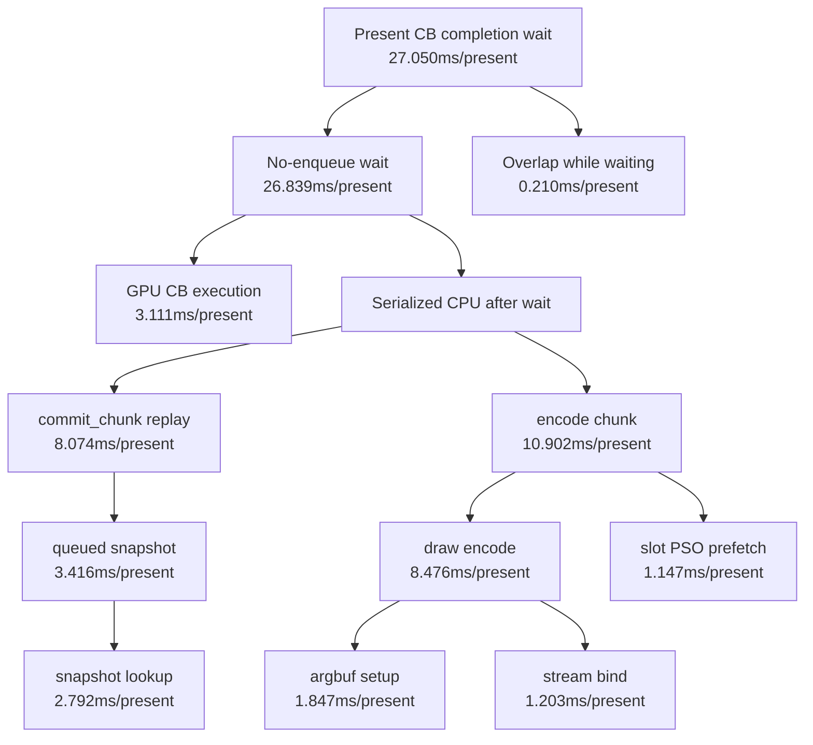

# Present Pacing 43 - Post Cbuf Observer Low-Overhead Baseline

**Question.** After making VS/FFPVS cbuf content-history scans opt-in, what is
the current low-overhead owner split for 3DMark05 GT1?

**Run.**

```sh
bash scripts/tools/run_3dmark05_perf_probe.sh \
  --suffix current-lowoverhead-20260615-r1 \
  --no-gputrace \
  --no-encoder-breakdown \
  --frame-sampling \
  --timeout 120 \
  --capture-delay-sec 85 \
  --wait-unlocked-sec 1 \
  --wait-unlocked-interval-sec 1
```

The run completed with `status=pass`. `actual.png` is a normal GT1 scene with
heavy fog and visible scene geometry. Health counters are clean:
`draw_skipped_no_pipeline=0`, `gpu_command_buffer_errors=0`, and
`render_split_hazard=0`.

## Result

| Metric | Value |
|---|---:|
| `present_encoded` | `1,860` |
| `completion_wait_ms_per_present` | `27.050` |
| `completion_wait_without_enqueue_ms_per_present` | `26.839` |
| `completion_wait_with_enqueue_ms_per_present` | `0.210` |
| `gpu_command_buffer_time_ms_per_present` | `3.111` |
| `commit_chunk_replay_cpu_ms_per_present` | `8.074` |
| `commit_chunk_queue_draw_submission_cpu_ms_per_present` | `4.052` |
| `commit_chunk_queue_draw_submission_snapshot_cpu_ms_per_present` | `3.416` |
| `d3d9_snapshot_draw_submission_cpu_ms_per_present` | `3.357` |
| `d3d9_snapshot_cache_lookup_cpu_ms_per_present` | `2.792` |
| `encode_chunk_cpu_ms_per_present` | `10.902` |
| `encode_draw_cpu_ms_per_present` | `8.476` |
| `encode_draw_argbuf_setup_cpu_ms_per_present` | `1.847` |
| `encode_draw_stream_bind_cpu_ms_per_present` | `1.203` |
| `encode_slot_pso_prefetch_cpu_ms_per_present` | `1.147` |
| `draw_uniform_payload_materialize_cpu_ms_per_present` | `0.229` |
| `draw_uniform_payload_materialized_queue_observation` | `0` |



## Interpretation

This confirms the current baseline after [state-churn-encode-encode-phase.129](../state-churn-encode/state-churn-encode-encode-phase.129.md):
the default encoder breakdown no longer charges the cbuf content observer, but
the average-FPS owner split is unchanged.

The GPU command-buffer work is still much smaller than the exposed present
completion wait, and almost none of that wait is overlapped by later command
buffer enqueue. The next useful work should therefore stay on:

- reducing serial P2/P3 CPU (`commit_chunk` replay/snapshot and backend encode);
- proving a larger overlap/run-ahead design with the P4 compare gates;
- using `.gputrace` or System Trace only when the candidate needs GPU/holder
  evidence, not for another default-profile cbuf-content attribution.

**Related.** [state-churn-encode-encode-phase.129](../state-churn-encode/state-churn-encode-encode-phase.129.md) -
[present-pacing](index.md).
