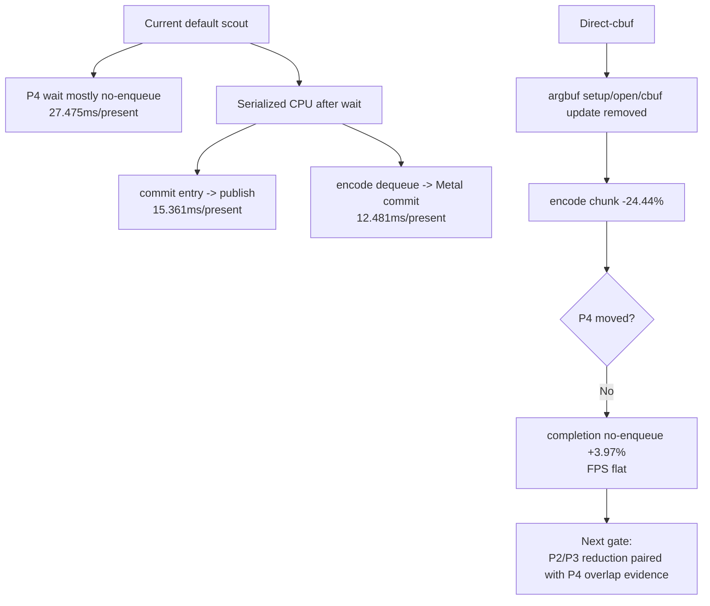

# Present Pacing 46 - Current P2/P3 Scout After Capture-Layer Recovery

**Question.** After the capture-layer file route was recovered, does the
normal no-gputrace scout still point at P2/P3 serialization plus missing P4
overlap as the average-FPS owner?

**Verdict.** Yes. The current default run remains
`under-pipelined-no-enqueue`: GPU command-buffer work is about
`3.218ms/present`, while present completion wait is `27.499ms/present` and
`99.914%` of that wait has no later command-buffer enqueue overlapping it.

## Run

```sh
bash scripts/tools/run_3dmark05_perf_probe.sh \
  --suffix current-p2p3-scout-r1 \
  --no-gputrace \
  --no-encoder-breakdown \
  --frame-sampling \
  --timeout 120 \
  --capture-delay-sec 45 \
  --wait-unlocked-sec 1 \
  --wait-unlocked-interval-sec 1 \
  --min-free-mb 256
```

The wrapper completed with `status=pass`, `timed_out=true`, and
`returncode=143`, so the timeout finalized the run instead of relying on a
manual kill. `actual.png` shows a normal GT1 frame. Health counters are clean:
`draw_skipped_no_pipeline=0` and `gpu_command_buffer_errors=0`.

The run also wrote `3dmark05-trace-artifacts.json`. Because this was a
no-gputrace scout, the manifest is a path audit rather than an Xcode capture
source.

## Current Shape

| Metric | Value |
|---|---:|
| `present_encoded` | `1,800` |
| `sampled_avg_fps` | `16.766` |
| `completion_wait_ms_per_present` | `27.499` |
| `completion_wait_with_enqueue_ms_per_present` | `0.024` |
| `completion_wait_without_enqueue_ms_per_present` | `27.475` |
| `completion_wait_overlap_share` | `0.086%` |
| `gpu_command_buffer_time_ms_per_present` | `3.218` |
| `commit_chunk_replay_cpu_ms_per_present` | `8.325` |
| `commit_chunk_queue_draw_submission_cpu_ms_per_present` | `4.141` |
| `d3d9_snapshot_draw_submission_cpu_ms_per_present` | `3.425` |
| `d3d9_snapshot_cache_lookup_cpu_ms_per_present` | `2.850` |
| `encode_chunk_cpu_ms_per_present` | `11.152` |
| `encode_draw_cpu_ms_per_present` | `8.580` |

The same-cycle no-enqueue split is:

| Stage | total ms/present | p50 ms | p95 ms |
|---|---:|---:|---:|
| wait -> commit chunk entry | `3.920` | `0.959` | `2.737` |
| commit entry -> publish | `15.361` | `14.360` | `27.442` |
| publish -> encode dequeue | `0.248` | `0.344` | `0.472` |
| encode dequeue -> command buffer commit | `12.481` | `17.639` | `24.081` |
| wait -> next enqueue | `32.450` | `15.154` | `49.991` |

The current encode ranking still names local targets, but they must be
reviewed under the P4 gates:

| Rank | Counter | ms/present |
|---:|---|---:|
| 1 | `encode_draw_argbuf_setup_cpu_ms` | `1.875` |
| 2 | `encode_draw_stream_bind_cpu_ms` | `1.250` |
| 3 | `encode_slot_pso_prefetch_cpu_ms` | `1.173` |
| 4 | `encode_draw_binding_packet_cpu_ms` | `1.044` |
| 5 | `encode_draw_argbuf_cbuf_update_cpu_ms` | `0.981` |
| 6 | `encode_draw_argbuf_open_cpu_ms` | `0.750` |

## Direct-Cbuf Cross-Check

`current-default-vs-direct-cbuf.md` compares this run against
[present-pacing-direct-cbuf.45](present-pacing-direct-cbuf.45.md). The comparison keeps the important split:
direct-cbuf removes the local argbuf table/cbuf path, but it does not solve
the average-FPS owner.

| Metric | Current default | Direct cbuf | Delta |
|---|---:|---:|---:|
| `sampled_avg_fps` | `16.766` | `16.864` | flat |
| `encode_chunk_cpu_ms_per_present` | `11.152` | `8.426` | `-24.44%` |
| `encode_draw_cpu_ms_per_present` | `8.580` | `5.982` | `-30.28%` |
| `argbuf_setup_cpu_ms_per_present` | `1.875` | `0.000` | `-100.00%` |
| `argbuf_open_cpu_ms_per_present` | `0.750` | `0.000` | `-100.00%` |
| `argbuf_cbuf_update_cpu_ms_per_present` | `0.981` | `0.000` | `-100.00%` |
| `completion_wait_ms_per_present` | `27.499` | `29.135` | `+5.95%` |
| `completion_wait_without_enqueue_ms_per_present` | `27.475` | `28.565` | `+3.97%` |
| `commit entry -> publish` | `15.361` | `16.247` | `+5.77%` |
| `encode dequeue -> command buffer commit` | `12.481` | `9.706` | `-22.24%` |



## Decision

Use this run as the current default no-gputrace baseline for average-FPS work
after capture-layer recovery. Xcode `.gputrace` is available again, but the
average-FPS owner is still not a capture-layer problem and not a GPU-only
locality problem.

Next candidates should either:

- reduce `commit entry -> publish`, snapshot/cache, or backend encode and pass
  the P2/P3 compare gates;
- or implement a larger overlap/run-ahead design and pass the P4 gates by
  increasing `completion_wait_with_enqueue_ms` or decreasing
  `completion_wait_without_enqueue_ms`;
- or do both before claiming an average-FPS fix.

Direct-cbuf remains a real local CPU win, but it should not be promoted as the
default FPS fix by itself.

**Related.** [present-pacing-direct-cbuf.45](present-pacing-direct-cbuf.45.md) -
[present-pacing-current-lowoverhead.43](present-pacing-current-lowoverhead.43.md) - [present-pacing](../present-pacing.md).
