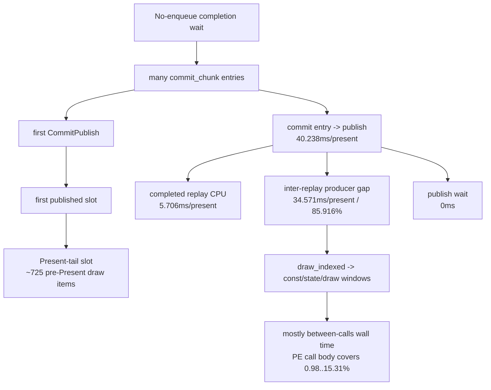

# Present Pacing / Current PE cadence after fixed uniform carry 137

## Question

After [state-churn-encode-encode-phase.200](../state-churn-encode/state-churn-encode-encode-phase.200.md) reduces the local fixed-uniform
find row, does the average-FPS wall move, or does the current P4 owner still
look like PE producer cadence and draw-heavy Present-tail publication?

## Runtime

```sh
bash scripts/tools/run_3dmark05_perf_probe.sh \
  --suffix current-pe-cadence-fixed-carry-r1 \
  --frame 60 \
  --no-gputrace \
  --no-encoder-breakdown \
  --pe-recorder-stats \
  --frame-sampling \
  --keep-frontmost \
  --timeout 120
```

This is an attribution run, not a low-overhead FPS baseline.
`DXMT9_PE_RECORDER_STATS=1` raises log volume and perturbs wall-clock timing, so
use this run for shape and ownership, not for a performance claim.

## Result

The run passes the basic correctness guard:

| Metric | Value |
|---|---:|
| status | `pass` |
| `draw_skipped_no_pipeline` | `0` |
| `gpu_command_buffer_errors` | `0` |
| `sampled_avg_fps` | `11.425` |
| `completion_wait_with_enqueue_ms_per_present` | `0.000` |
| `completion_wait_without_enqueue_ms_per_present` | `28.280` |
| `completion_wait_no_enqueue_share` | `100.000%` |
| `commit_chunk_replay_cpu_ms_per_present` | `8.292` |
| `encode_chunk_cpu_ms_per_present` | `10.822` |

The first published slot after each no-enqueue wait is still a draw-heavy
Present-tail slot:

| Slot metric | per sampled slot |
|---|---:|
| commands | `320.222` |
| draw items | `724.800` |
| pre-Present draw items | `724.800` |
| payload bytes | `194641.663` |
| Present-tail slots | `1.000` |
| Present-nontail slots | `0.000` |

The first-publish window is still almost entirely producer gap, not queue
publish wait:

| Metric | total ms/present | p50 ms | p95 ms |
|---|---:|---:|---:|
| commit entry -> publish | `40.238` | `47.861` | `70.653` |
| completed replay CPU before publish | `5.706` | `6.283` | `10.202` |
| inter-replay producer gap before publish | `34.571` | `41.206` | `62.082` |
| commit publish wait before publish | `0.000` | `0.000` | `0.000` |
| inter-replay producer gap share | `85.916%` | `n/a` | `n/a` |

The focused PE rows preserve the previous owner class:

| Pair | between-calls ms/present | call-body coverage | call-gap residual ms/present |
|---|---:|---:|---:|
| `draw_indexed -> set_vs_const_f` | `20.005` | `15.31%` | `16.942` |
| `draw_indexed -> apply_state` | `6.753` | `0.98%` | `6.687` |
| `draw_indexed -> draw_indexed` | `4.685` | `9.33%` | `4.248` |
| `draw_indexed -> set_ps_const_f` | `3.806` | `15.29%` | `3.224` |

The largest exact callsite rows remain app-side cadence markers:

| Pair | transition | caller | ms/present |
|---|---|---|---:|
| `draw_indexed -> set_vs_const_f` | `SetVertexShaderConstantF -> SetVertexShaderConstantF` | `3DMark05.exe+0x155f41` | `2.716` |
| `draw_indexed -> set_vs_const_f` | `DrawIndexedPrimitive -> SetVertexShaderConstantF` | `3DMark05.exe+0x155f41` | `1.631` |
| `draw_indexed -> apply_state` | `DrawIndexedPrimitive -> GetViewport` | `3DMark05.exe+0x2afeb` | `2.909` |
| `draw_indexed -> apply_state` | `DrawIndexedPrimitive -> CubeTexture::GetCubeMapSurface` | `3DMark05.exe+0xd37b3` | `0.633` |



## Interpretation

The fixed-uniform carry is a real local cleanup, but it does not change the P4
owner. Current average-FPS work is still blocked by the same shape:

- the queue does not enqueue a next command buffer during the completion wait;
- the first useful post-wait publication is a draw-heavy Present-tail slot;
- queue publish wait is not the owner;
- the exposed first-publish delay is dominated by PE producer inter-replay gap;
- focused PE rows are mostly between D3D9 calls, not inside the measured PE
  call bodies.

This keeps broad uniform cleanup below the current wall. The next P4-facing
candidate must either create a locality-preserving CPU-ready/run-ahead path for
that Present-tail prefix, or reduce draw/const/state producer cadence enough to
move `inter-replay producer gap`, `commit entry -> publish`, or
`wait -> next enqueue`.

## Decision

Do not spend `.gputrace` on the fixed-uniform carry or this PE-stats refresh.
They are CPU/P4 attribution evidence. A useful next mutation should be judged
by the existing P4 gates:

- lower `completion_no_enqueue_commit_chunk_inter_replay_gap_before_publish_ms`
  or `no_enqueue_stage_commit_entry_to_publish`;
- increase `completion_wait_with_enqueue_ms_per_present` without increasing
  command buffers, render passes, same-key reopens, or tile preservation;
- keep the visual-safe gate anchored to `v0.0.3` / current visual-safe samples.

## Verification

- 3DMark05 GT1 no-gputrace PE-stats probe:
  `app-d3d9-3dmark05-current-pe-cadence-fixed-carry-r1`

**Related.** [present-pacing-current-visual-p4.136](present-pacing-current-visual-p4.136.md) ·
[present-pacing-current-pe-cadence.113](present-pacing-current-pe-cadence.113.md) ·
present-pacing-current-pe-cadence-wrapper.117 ·
[state-churn-encode-encode-phase.200](../state-churn-encode/state-churn-encode-encode-phase.200.md).
