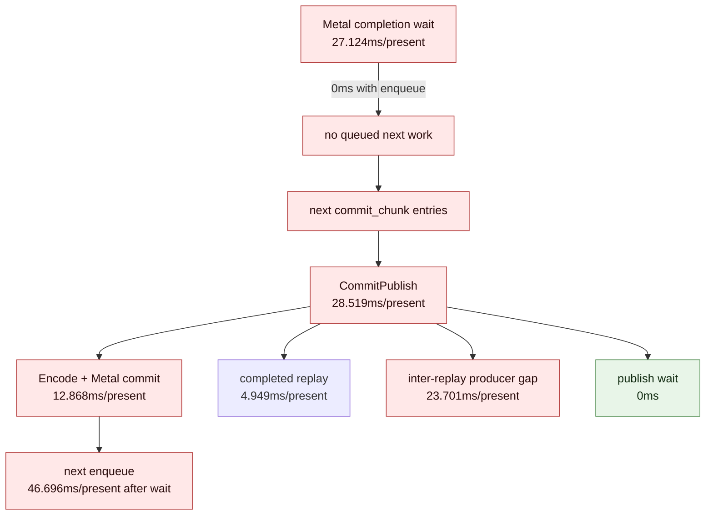

# Present Pacing / Wrapper-Forwarded Current PE Cadence Refresh 117

> **Outdated — the knob or code path this experiment measured no longer exists in `src/`.** It cannot be re-run. Kept as history; do not cite it as current evidence.

**Question.** After the H203 shader-hash memo opportunity was rejected and H116
closed another cheap open-CB threshold path, does a fresh PE-recorder run still
put the current average-FPS owner in PE producer/record cadence plus serial
replay/encode? Also, is the perf-probe wrapper actually forwarding PE recorder
env to the child process?

**Answer.** Yes. The wrapper previously rebuilt the child environment from an
allow-list, so prefixing the wrapper with `DXMT9_PE_RECORDER_STATS=1` could
print a convincing command line while not enabling PE recorder rows in the
child. The wrapper now has explicit PE-recorder options, and h205 confirms the
stats reach `dxmt9.log`.

The current runtime shape remains the same as H113: completion wait is fully
no-enqueue, the first publish after the wait is a large draw-heavy Present slot,
and `commit entry -> publish` is dominated by inter-replay producer gap rather
than queue publish wait. This keeps the next FPS-facing work on producer/record
cadence reduction, replay/snapshot/encode reduction that moves P4 rows, or a
true render-pass/encoder carry design. It does not justify another `.gputrace`
spend by itself.

## Tooling Correction

The wrapper now accepts and forwards:

| Wrapper option | Child env |
|---|---|
| `--pe-recorder-stats` | `DXMT9_PE_RECORDER_STATS=1`, and defaults `DXMT_LOG_LEVEL=info` |
| `--pe-recorder-chunk-log` | `DXMT9_PE_RECORDER_CHUNK_LOG=1` |
| `--pe-flush-after-clear` | `DXMT9_PE_FLUSH_AFTER_CLEAR=1` |
| `--pe-flush-after-draw` | `DXMT9_PE_FLUSH_AFTER_DRAW=1` |
| `--pe-draw-full-snapshot` | `DXMT9_PE_DRAW_FULL_SNAPSHOT=1` |
| `--pe-chunk-max-records N` | `DXMT9_PE_CHUNK_MAX_RECORDS=N` |
| `--pe-chunk-max-bytes N` | `DXMT9_PE_CHUNK_MAX_BYTES=N` |
| `--dxmt-log-level LEVEL` | `DXMT_LOG_LEVEL=LEVEL` |

The failed h204 attempt is not PE-recorder evidence: it completed as a normal
no-gputrace run but produced no `pe_recorder_*` rows because the env was not
forwarded. Use `--pe-recorder-stats` for future wrapper-launched PE cadence
runs.

`compare_3dmark05_perf_counters.py` now also promotes
`dxmt9_pe_recorder_counters` into `pe_recorder_*` comparison rows and renders a
dedicated top inter-append section. This keeps the PE cadence owner visible in
ordinary A/B reports instead of requiring manual extraction from
`3dmark05-perf-summary.md`.

## Run

```sh
bash scripts/tools/run_3dmark05_perf_probe.sh \
  --suffix h205-pe-cadence-refresh-r1 \
  --no-gputrace \
  --no-encoder-breakdown \
  --frame-sampling \
  --timeout 120 \
  --keep-frontmost \
  --wait-unlocked-sec 1 \
  --wait-unlocked-interval-sec 1 \
  --pe-recorder-stats
```

The wrapper printed the effective child env:

```text
DXMT9_PERF_FRAME_SAMPLING=1 DXMT9_PE_RECORDER_STATS=1 DXMT_LOG_LEVEL=info
```

The run completed with `status=pass`, `timed_out=false`, and
`present_encoded=1,483`. The broad output frame is effects-heavy and visually
normal against the current `v0.0.3` smoke class; this is still an attribution
smoke, not a pixel oracle. Frame CSV average FPS is `15.311`, but PE recorder
logging is enabled, so do not use this as an FPS baseline.

Health counters:

| Counter | Value |
|---|---:|
| `draw_skipped_no_pipeline` | `0` |
| `gpu_command_buffer_errors` | `0` |

## Current P4 Shape

| Metric | ms/present | Interpretation |
|---|---:|---|
| `completion_wait` | `27.124` | all no-enqueue |
| `completion_wait_with_enqueue` | `0.000` | no useful overlap |
| `completion_wait_without_enqueue` | `27.124` | full wait is unhidden |
| `wait -> next enqueue` | `46.696` | broad post-wait serial surface |
| `commit entry -> publish` | `28.519` | exposed pre-encode publish window |
| completed replay before publish | `4.949` | real but secondary |
| active replay before publish | `0.001` | not the owner |
| inter-replay producer gap before publish | `23.701` | dominant publish-window term |
| publish -> encode dequeue | `0.257` | queue wake is not the owner |
| encode dequeue -> Metal commit | `12.868` | backend encode remains exposed |
| `commit_chunk_replay_cpu` | `7.881` | P2/P3 CPU owner |
| `encode_chunk_cpu` | `10.823` | P2/P3 CPU owner |
| `gpu_command_buffer_time` | `3.007` | average GPU execution is not the wall owner |



The first publish after no-enqueue wait is still a large draw-heavy slot:

| First publish slot metric | Value |
|---|---:|
| samples | `1,482` |
| commands / slot | `324.577` |
| draw-run commands / slot | `319.696` |
| draw items / slot | `728.928` |
| non-draw commands / slot | `4.881` |
| payload bytes / slot | `195,806.537` |
| Present commands / slot | `1.000` |

## PE Recorder Shape

| PE metric | Value / present |
|---|---:|
| PE commits | `24.378` |
| records | `1,362.328` |
| payload bytes | `3,787,506.201` |
| `chunkFillGapMs` | `64.620` |
| `chunkFirstRecordGapMs` | `25.563` |
| `chunkActiveFillMs` | `39.057` |
| `chunkInterAppendGapMs` | `35.879` |
| `chunkBridgeMs` | `9.238` |
| `recordAppendCpuMs` | `12.856` |
| `recordAppendNoFlushCpuMs` | `3.032` |
| `constFlushCpuMs` | `5.575` |
| `vsConstFSetterCpuMs` | `0.985` |
| `psConstFSetterCpuMs` | `0.250` |

Top inter-append pairs:

| Pair | ms/present | Samples/present |
|---|---:|---:|
| `draw_indexed -> set_vs_const_f` | `18.574` | `442.025` |
| `draw_indexed -> apply_state` | `6.783` | `2.841` |
| `draw_indexed -> draw_indexed` | `5.223` | `183.713` |
| `draw_indexed -> set_ps_const_f` | `3.587` | `80.243` |

Focused between-call names remain producer/materialization traffic, not pure
idle:

| Focused window | Top exact call | Samples/present | Second exact call | Samples/present |
|---|---|---:|---|---:|
| `draw_indexed -> set_vs_const_f` | `SetVertexShaderConstantF` | `3,419.858` | `IndexBuffer::GetDesc` | `884.050` |
| `draw_indexed -> draw_indexed` | `IndexBuffer::GetDesc` | `367.427` | `SetVertexShaderConstantF` | `282.177` |
| `draw_indexed -> apply_state` | `SetRenderTarget` | `2.841` | `Surface::GetDesc` | `2.841` |

The regenerated h203-vs-h205 comparison now carries the same evidence as
first-class rows. Because h203 was not a PE-recorder run, its side is `n/a`; the
h205 side reports `pe_recorder_chunk_inter_append_gap_ms_per_present=35.879`,
`pe_recorder_record_append_cpu_ms_per_present=12.856`, and the top pair section
with `draw_indexed -> set_vs_const_f=18.574ms/present`.

## Decision

Accept h205 as the current PE-cadence refresh and reject h204 as invalid
PE-recorder evidence. The current bottleneck is still:

1. P4 under-pipelining: `completion_wait_with_enqueue=0` and the next useful
   slot appears only after completion.
2. PE producer/record cadence before publish: inter-replay gap is
   `23.701ms/present`.
3. Exposed serial CPU after that: replay/snapshot and backend encode remain
   `7.881ms/present` and `10.823ms/present`.

Do not interpret this as a GPU hot-frame floor or as evidence for Xcode capture
spend. The next promotable candidate must either reduce the PE/replay/encode
serial path and move no-enqueue/P4 rows, or introduce a render-pass-safe overlap
carrier that preserves command-buffer/render-pass/tile locality and passes the
`v0.0.3` visual gate.
