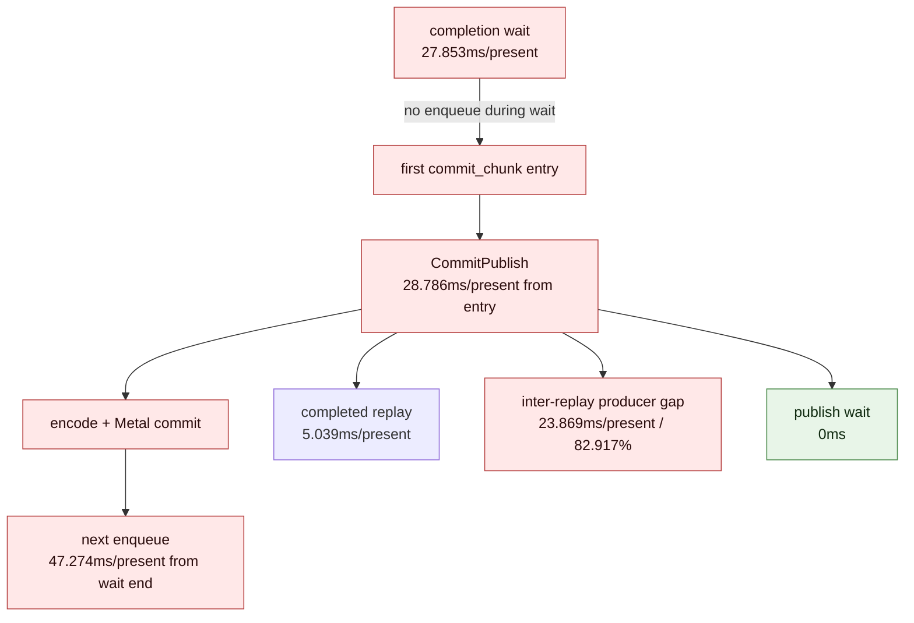
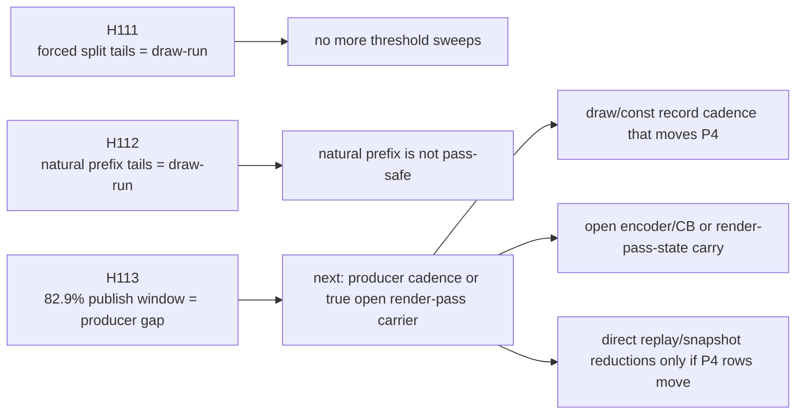

# Present Pacing / Current PE Cadence Refresh After Prefix Tail Gate 113

**Question.** After H111/H112 reject both command-limit and natural-prefix
pass-safe staging, is the current P4 owner still PE producer cadence between
`commit_chunk` replays, or did the frontier move to replay CPU, queue publish
wait, or encode?

**Answer.** The current PE-cadence shape is unchanged. The latest
foreground-controlled PE recorder run is fully no-enqueue, and
`commit entry -> publish` is still dominated by inter-replay producer gap:
`23.869ms/present`, or `82.917%` of the publish window. Completed replay CPU is
real but secondary at `5.039ms/present`; queue publish wait is `0`.

This means the next FPS-facing work should not be another pass-safe threshold
search, queue publish lock tweak, or setter-body microfix. The target is still
draw/const record cadence that changes `commit entry -> publish` /
`wait -> next enqueue`, or a locality-preserving overlap carrier that can hide
the same cadence without cutting render-pass state.

## Run

```sh
DXMT9_PE_RECORDER_STATS=1 DXMT_LOG_LEVEL=info \
bash scripts/tools/run_3dmark05_perf_probe.sh \
  --suffix h188-current-pe-cadence-r1 \
  --no-gputrace \
  --no-encoder-breakdown \
  --frame-sampling \
  --timeout 120 \
  --keep-frontmost \
  --wait-unlocked-sec 1 \
  --wait-unlocked-interval-sec 1 \
  --min-free-mb 256
```

The run completed with `status=pass` and `present_encoded=1,440`.

Health counters:

| Counter | Value |
|---|---:|
| `draw_skipped_no_pipeline` | `0` |
| `gpu_command_buffer_errors` | `0` |

## Current P4 Shape

| Metric | ms/present | Interpretation |
|---|---:|---|
| `completion_wait` | `27.853` | all no-enqueue |
| `completion_wait_with_enqueue` | `0.000` | no useful overlap |
| `completion_wait_without_enqueue` | `27.853` | full wait is unhidden |
| `commit entry -> publish` | `28.786` | exposed pre-encode publish window |
| completed replay before publish | `5.039` | real but secondary |
| active replay before publish | `0.001` | not the owner |
| inter-replay producer gap before publish | `23.869` | `82.917%` of publish window |
| commit publish wait before publish | `0.000` | not queue writer wait |
| wait -> next enqueue | `47.274` | broad no-overlap surface |
| `commit_chunk_replay_cpu` | `8.069` | P2/P3 CPU owner |
| `encode_chunk_cpu` | `10.979` | P2/P3 CPU owner |



The no-enqueue before-publish chunk shape is draw-heavy:

| Chunk metric | Value |
|---|---:|
| scanned chunks per publish sample | `16.864` |
| chunks with draw per scanned chunk | `0.941` |
| chunks with present per scanned chunk | `0.059` |
| state/const-only chunks | `0` |
| no-draw/no-present chunks | `0` |

## PE Recorder Shape

The PE recorder totals remain an attribution lens for the same producer
cadence:

| PE metric | ms/present |
|---|---:|
| `chunkFillGapMs` | `66.522` |
| `chunkFirstRecordGapMs` | `26.421` |
| `chunkActiveFillMs` | `40.101` |
| `chunkInterAppendGapMs` | `36.824` |
| `chunkBridgeMs` | `9.644` |
| `recordAppendCpuMs` | `13.374` |
| `recordAppendNoFlushCpuMs` | `3.119` |
| `constFlushCpuMs` | `5.788` |
| `applyStateBuildCpuMs` | `0.011` |
| `chunkBarrierConstCpuMs` | `0.008` |
| `vsConstFSetterCpuMs` | `1.020` |
| `psConstFSetterCpuMs` | `0.256` |

Top inter-append pairs remain the same draw/const/state family as H90:

| Pair | ms/present | Main call family |
|---|---:|---|
| `draw_indexed -> set_vs_const_f` | `19.098` | draw / VS const |
| `draw_indexed -> apply_state` | `6.894` | barrier / render target |
| `draw_indexed -> draw_indexed` | `5.396` | draw / vertex input |
| `draw_indexed -> set_ps_const_f` | `3.689` | draw / PS const |

The phase and tail splits keep the same meaning:

| Pair | pre-call ms/present | inside-call ms/present | between-calls share |
|---|---:|---:|---:|
| `draw_indexed -> set_vs_const_f` | `15.904` | `3.194` | `99.06%` |
| `draw_indexed -> apply_state` | `6.881` | `0.012` | `99.99%` |
| `draw_indexed -> draw_indexed` | `3.851` | `1.546` | `98.53%` |
| `draw_indexed -> set_ps_const_f` | `3.064` | `0.625` | `99.34%` |

## Decision

H111/H112 close the cheap staging-boundary theory, and H113 refreshes the
remaining pacing owner:



Do not use this run as GPU evidence. It is a no-gputrace CPU/P4 attribution
refresh. Xcode/gputrace remains reserved for a candidate that first moves the
no-gputrace P4/locality gates, or for GPU-hot-frame/backend-storage questions
outside this CPU cadence lane.
