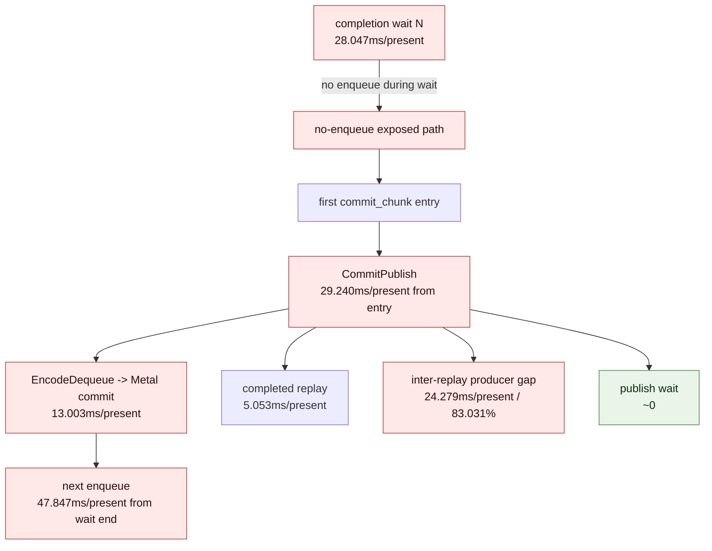

# Present Pacing 90 - Current PE cadence refresh after compact timer gate

## Question

After the compact-uniform breakdown timers were gated off again in
[[state-churn-encode-encode-phase.160]], does the current no-gputrace path still
attribute the average-FPS P4 owner to PE producer/replay cadence, or did the
frontier move back to compact uniform, GPU hot-frame work, or queue publish
wait?

## Verdict

Accepted as a current attribution refresh. The current run is still a fully
no-enqueue P4 shape: `completion_wait_with_enqueue_ms=0`, while the exposed
same-cycle path is dominated by `commit entry -> publish` and the inter-replay
producer gap inside that window.

This keeps the average-FPS target on producer/record cadence, replay/snapshot,
or a locality-preserving overlap carrier. It does not justify another
CPU-only `.gputrace`; Xcode remains reserved for GPU-hot-frame/backend-storage
questions or for invariance proof after a no-gputrace candidate moves the P4
surface.

## Run

```sh
DXMT9_PE_RECORDER_STATS=1 DXMT_LOG_LEVEL=info \
bash scripts/tools/run_3dmark05_perf_probe.sh \
  --suffix h171-current-pe-cadence-r1 \
  --no-gputrace \
  --no-encoder-breakdown \
  --frame-sampling \
  --timeout 120 \
  --wait-unlocked-sec 1 \
  --wait-unlocked-interval-sec 1 \
  --min-free-mb 256
```

The run timeout-finalized with complete artifacts:
`status=pass`, `timed_out=True`, `returncode=143`, `capture_error=None`, and
`present_encoded=1,380`.

Health counters are clean:

| Counter | Value |
|---|---:|
| `draw_skipped_no_pipeline` | `0` |
| `gpu_command_buffer_errors` | `0` |

The time-based `actual.png` is a broad visual smoke only. It shows a normal
effect-heavy GT1 scene with bloom, sparks, lighting, soldiers, and HUD, but it
is not a same-frame proof against the `v0.0.3` visual-safe anchor.

## Current P4 Shape

| Metric | ms/present | Note |
|---|---:|---|
| `completion_wait` | `28.047` | all no-enqueue |
| `completion_wait_with_enqueue` | `0.000` | no useful overlap |
| `commit entry -> publish` | `29.240` | largest pre-encode exposed row |
| completed replay before publish | `5.053` | real but secondary |
| inter-replay producer gap before publish | `24.279` | `83.031%` of commit-entry-to-publish |
| commit publish wait before publish | `0.000` | not the queue lock |
| encode dequeue -> command buffer commit | `13.003` | second serialized stage |
| wait -> next enqueue | `47.847` | broad no-overlap surface |
| `commit_chunk_replay_cpu` | `8.054` | P2/P3 CPU owner |
| `encode_chunk_cpu` | `11.303` | P2/P3 CPU owner |



The before-publish chunk shape is still draw/const heavy: scanned chunks have
p50/p95 `64 / 64` records, with `637,570` draw records and `581,683` const
records before first publish.

## PE Recorder Shape

The PE recorder counters remain useful as attribution, but the all-chunk
totals include startup and windows outside the no-enqueue before-publish slice.
Use them to choose the producer-cadence target, not as a direct wall-clock sum.

| PE metric | ms/present |
|---|---:|
| `chunkFillGapMs` | `69.099` |
| `chunkFirstRecordGapMs` | `27.429` |
| `chunkActiveFillMs` | `41.670` |
| `chunkInterAppendGapMs` | `38.238` |
| `chunkBridgeMs` | `10.276` |
| `recordAppendCpuMs` | `14.179` |
| `recordAppendNoFlushCpuMs` | `3.265` |
| `constFlushCpuMs` | `6.069` |
| `applyStateBuildCpuMs` | `0.010` |
| `chunkBarrierConstCpuMs` | `0.007` |

Top inter-append pairs remain the same family as H62/H77:

| Pair | ms/present | Attribution |
|---|---:|---|
| `draw_indexed -> set_vs_const_f` | `19.790` | draw-family deferred VS const flush |
| `draw_indexed -> apply_state` | `7.229` | barrier-family pending state materialization |
| `draw_indexed -> draw_indexed` | `5.577` | draw-family cadence |
| `draw_indexed -> set_ps_const_f` | `3.831` | mostly draw-family deferred PS const flush |

The focused phase split shows most of those pair gaps occur before entering the
next append-producing call, not inside the narrow append body:

| Pair | pre-call ms/present | inside-call ms/present | pre-call share |
|---|---:|---:|---:|
| `draw_indexed -> set_vs_const_f` | `16.481` | `3.309` | `83.28%` |
| `draw_indexed -> apply_state` | `7.217` | `0.012` | `99.83%` |
| `draw_indexed -> draw_indexed` | `3.972` | `1.604` | `71.23%` |
| `draw_indexed -> set_ps_const_f` | `3.185` | `0.645` | `83.15%` |

The tail split then shows that the pre-call part is mostly between-call
producer cadence:

| Pair | previous-call tail ms/present | between-calls ms/present | between-calls share |
|---|---:|---:|---:|
| `draw_indexed -> set_vs_const_f` | `0.151` | `16.330` | `99.08%` |
| `draw_indexed -> apply_state` | `0.001` | `7.216` | `99.99%` |
| `draw_indexed -> draw_indexed` | `0.058` | `3.915` | `98.55%` |
| `draw_indexed -> set_ps_const_f` | `0.020` | `3.166` | `99.39%` |

## Code Surface Check

The current PE constant path is already shadow-first:
`SetVertexShaderConstantF` / `SetPixelShaderConstantF` validate the range and
update `PeConstShadowBlock` via `touchConstShadow()`. They do not cross the
PE/unix boundary. `flushPendingConsts()` emits at most the pending merged const
records immediately before draw append or barrier flush, preserving API order.

This makes the H90 gap a producer-cadence problem, not a narrow setter-body
problem. The measured setter bodies are small compared with the gap
(`vsConstFSetterCpuMs=1.073ms/present`, `psConstFSetterCpuMs=0.267ms/present`),
and APPLY_STATE packet build is only `0.010ms/present`. A useful candidate must
therefore reduce draw/const record cadence enough to move `commit entry ->
publish` or `wait -> next enqueue`, or create locality-preserving overlap. A
byte-only const-record change that leaves P4 flat is not a promotion target.

## Decision

| Candidate | Current priority |
|---|---|
| GPU hot-frame `.gputrace` for this CPU attribution | low; P4 has not moved |
| Queue publish wait/lock tuning | low; publish wait is effectively zero |
| Broad hot-state setter body micro-optimization | low; H61/H90 keep setter bodies too small |
| APPLY_STATE packet build micro-optimization | low; `0.010ms/present` |
| Draw-side const/record cadence that moves P4 | high target; top pair, but not setter-body-only |
| Barrier-path pending-state cadence that moves P4 | medium target; top apply-state pair, but packet build is tiny |
| Larger CPU-ready/run-ahead overlap design | high FPS target, but must preserve CB/pass/tile locality and `v0.0.3` visual gate |

The next implementation should either reduce draw-side const/materialization
cadence enough to move `commit entry -> publish` / `wait -> next enqueue`, or
build a larger overlap carrier that turns no-enqueue wait into useful ready
backlog without the known draw-count split locality regression.
