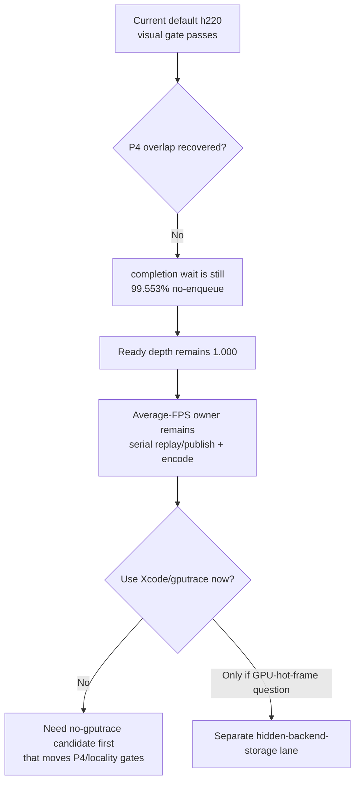

# Present Pacing / Current Visual-Safe P4 Baseline 136

## Question

After the H134/H135 open-CB carrier failed the visual gate, is the current
default worktree usable again as a visual-safe no-gputrace baseline, and does
it change the P4 owner?

## Runtime

```sh
bash scripts/tools/run_3dmark05_perf_probe.sh \
  --suffix h220-current-visual-p4-baseline-r1 \
  --no-gputrace \
  --no-encoder-breakdown \
  --frame-sampling \
  --timeout 120 \
  --keep-frontmost \
  --capture-range 880:960:10 \
  --capture-delay-sec 45
```

The run completed normally (`status=pass`, `timed_out=false`) with internal
backbuffer captures for frames `880..960`.

## Result

| Metric | Value |
|---|---:|
| `present_encoded` | `1,784` |
| `sampled_frames` | `1,783` |
| `sampled_avg_fps` | `16.267` |
| `draw_skipped_no_pipeline` | `0` |
| `gpu_command_buffer_errors` | `0` |
| `completion_wait_ms_per_present` | `28.632` |
| `completion_wait_with_enqueue_ms_per_present` | `0.128` |
| `completion_wait_without_enqueue_ms_per_present` | `28.504` |
| `completion_wait_no_enqueue_share` | `99.553%` |
| `encode_ready_depth_avg` | `1.000` |
| `encode_ready_depth_gt1_per_present` | `0.000` |
| `commit_chunk_replay_cpu_ms_per_present` | `8.592` |
| `encode_chunk_cpu_ms_per_present` | `11.082` |
| `no_enqueue_stage_commit_entry_to_publish_ms_per_present` | `15.331` |
| `no_enqueue_stage_encode_dequeue_to_command_buffer_commit_ms_per_present` | `12.379` |

Qualitative visual read:

- `actual.png` is a normal wide GT1 firefight frame with HUD, bloom discs, and
  tracer/lighting effects.
- `frame000880` shows heavy bloom and ricochet particles.
- `frame000910` keeps the rifle/character/crate geometry coherent with sparks.
- `frame000960` keeps the large robot/gun silhouette coherent.

This capture window does not reproduce the reported close-up transparent weapon
or weapon-attached black-vertex artifact. That artifact can still be real, but
it needs a same-window reproduction before it should demote this baseline.

## Comparison

Compared with the previous h216 default control, h220 stays in the same class:

| Metric | h216 | h220 | Reading |
|---|---:|---:|---|
| `encode_ready_depth_avg` | `1.000` | `1.000` | no useful backlog |
| `completion_wait_without_enqueue_ms_per_present` | `26.201` | `28.504` | still no-enqueue dominated |
| `completion_wait_with_enqueue_ms_per_present` | `0.000` | `0.128` | noise-level overlap only |
| `no_enqueue_stage_commit_entry_to_publish_ms_per_present` | `15.976` | `15.331` | same exposed replay/publish stage |
| `no_enqueue_stage_encode_dequeue_to_command_buffer_commit_ms_per_present` | `14.693` | `12.379` | encode stage somewhat lower, but P4 remains |
| `command_buffers_per_present` | `3.999` | `4.010` | effectively flat |
| `tile_preservation_mib_per_present` | `120.525` | `120.222` | flat |

## Interpretation

The current default path is not blocked by the H134/H135 black-screen carrier.
It is a valid no-gputrace visual/perf baseline for the next CPU/P4 experiment,
but it does not change the bottleneck model:



## Decision

Keep h220 as the current visual-safe no-gputrace baseline. Do not spend Xcode or
`.gputrace` on this baseline alone. The next mutation should either:

- reduce the exposed serial stages (`commit entry -> publish` or
  `encode dequeue -> command buffer commit`) and also move no-enqueue/P4 rows;
- implement a non-blocking, render-pass-safe overlap carrier that creates useful
  ready backlog without holding the only visible frame work; or
- remain a local cleanup with no average-FPS claim.

Any future run showing the close-up weapon/lighting artifact must be treated as
visual-open until reproduced in a same-window capture and compared against the
`v0.0.3` anchor.
