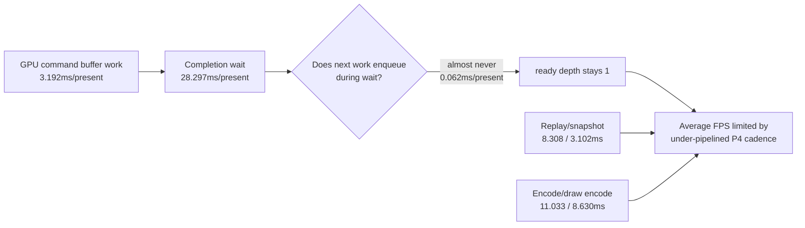

# Present-Pacing H142 - Current Wall Baseline Refresh

## Question

Is current head still blocked by the same P4/no-enqueue wall, or did the recent
visual and open-CB safety work change the limiting shape enough to pick a
different next branch?

## Method

Run a low-overhead foreground 3DMark05 GT1 scout with frame sampling and no
`.gputrace`:

```sh
bash scripts/tools/run_3dmark05_perf_probe.sh \
  --suffix current-wall-baseline-r1 \
  --frame 60 \
  --no-gputrace \
  --no-encoder-breakdown \
  --frame-sampling \
  --timeout 120 \
  --keep-frontmost
```

Source:
`experiments/output/app-d3d9-3dmark05-current-wall-baseline-r1`.

The run completed with status `pass` and no manual kill.

## Evidence

The screenshot is an effects-heavy GT1 frame with bloom, bullet trails, sparks,
geometry, and HUD visible. It is not a same-frame `v0.0.3` pixel proof, but it
is a valid broad visual smoke sample and rejects the recent HUD-only black-scene
failure class.

Key counters:

| Counter | Value |
|---|---:|
| `present_encoded` | `1,803` |
| `draw_skipped_no_pipeline` | `0` |
| `gpu_command_buffer_errors` | `0` |
| `image_metrics.mean_luma` | `70.035` |
| `sampled_avg_fps` | `18.443` |
| `tail600_fps_p50` | `17.008` |
| `tail300_fps_p50` | `20.341` |
| `gpu_command_buffer_time_ms_per_present` | `3.192` |
| `completion_wait_ms_per_present` | `28.297` |
| `completion_wait_with_enqueue_ms_per_present` | `0.062` |
| `completion_wait_without_enqueue_ms_per_present` | `28.235` |
| `completion_wait_no_enqueue_share_pct` | `99.781%` |
| `encode_dequeue_ready_depth_max` | `1` |
| `encode_dequeue_ready_depth_gt1` | `0` |
| `commit_chunk_replay_cpu_ms_per_present` | `8.308` |
| `d3d9_snapshot_draw_submission_cpu_ms_per_present` | `3.102` |
| `commit_chunk_queue_draw_submission_cpu_ms_per_present` | `3.843` |
| `encode_chunk_cpu_ms_per_present` | `11.033` |
| `encode_draw_cpu_ms_per_present` | `8.630` |
| `render_passes_per_present` | `11.765` |
| `tile_preservation_mib_per_present` | `120.365` |

Comparison against `h220-current-visual-p4-baseline-r1` shows the same class:

| Metric | H220 | H142 | Reading |
|---|---:|---:|---|
| `completion_wait_ms_per_present` | `28.632` | `28.297` | flat/noise |
| `completion_wait_without_enqueue_ms_per_present` | `28.504` | `28.235` | flat/noise |
| `completion_wait_with_enqueue_ms_per_present` | `0.128` | `0.062` | still absent |
| `encode_ready_depth_gt1_per_present` | `0.000` | `0.000` | no backlog |
| `gpu_command_buffer_time_ms_per_present` | `3.287` | `3.192` | not the average-FPS wall |
| `commit_chunk_replay_cpu_ms_per_present` | `8.592` | `8.308` | local movement only |
| `encode_chunk_cpu_ms_per_present` | `11.082` | `11.033` | local movement only |

## Verdict

This is not a hard hardware wall. It is the same under-pipelined P4 wall:

```text
GPU work per present       ~= 3.2ms
completion wait per present = 28.3ms
useful enqueue overlap      = 0.06ms/present
ready depth                 = 1
```

The current renderer can produce a visually coherent effects-heavy frame, but
the producer/encode path still fails to create work while completion is waiting.
Local replay and encode rows remain real CPU costs, yet the frame-rate limit is
still dominated by no-enqueue completion wait.



## Next Gate

Do not spend `.gputrace` from this baseline alone. It is a CPU/P4 cadence
sample, not a GPU-hot-frame/backend-storage question.

The next useful implementation branch must either:

- create a render-pass-safe producer/encode overlap carrier that raises
  `completion_wait_with_enqueue_ms_per_present` or ready depth without
  increasing command buffers, render passes, tile preservation, final same-key
  reopens, or load/store traffic; or
- reduce replay/encode materialization enough that the no-enqueue stage rows
  move in the same low-overhead visual-safe run.

Further sub-millisecond local append cleanups should stay below the FPS branch
unless they move those P4 gates.

**Related.** [present-pacing-current-visual-p4.136](present-pacing-current-visual-p4.136.md) ·
present-pacing-open-cb-tail-ready-prefix.141 ·
[state-churn-encode-encode-phase.201](../state-churn-encode/state-churn-encode-encode-phase.201.md).
