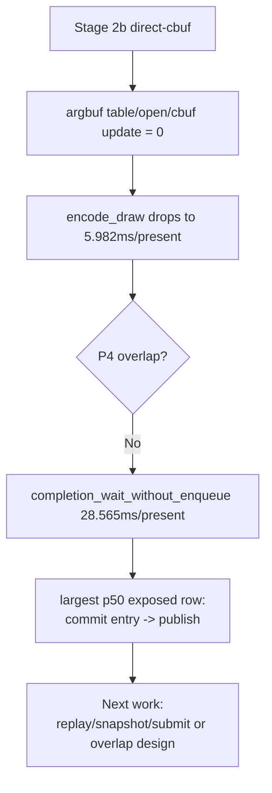

# Present Pacing 45 - Stage 2b Direct-Cbuf P4 Gate

**Question.** If Stage 2b direct-cbuf removes the constants-only argbuf table
path, does the average-FPS owner move with it?

**Verdict.** No. The direct-cbuf scout is a valid local CPU cleanup, but it
does not recover P4 overlap or average FPS. The run remains classified as
`under-pipelined-no-enqueue`.

## Result

| Metric | Value |
|---|---:|
| `present_encoded` | `1,800` |
| `sampled_avg_fps` | `16.864` |
| `completion_wait_ms_per_present` | `29.135` |
| `completion_wait_with_enqueue_ms_per_present` | `0.569` |
| `completion_wait_without_enqueue_ms_per_present` | `28.565` |
| `completion_wait_overlap_share` | `1.955%` |
| `gpu_command_buffer_time_ms_per_present` | `3.001` |
| `commit_chunk_replay_cpu_ms_per_present` | `8.286` |
| `d3d9_snapshot_draw_submission_cpu_ms_per_present` | `3.436` |
| `encode_chunk_cpu_ms_per_present` | `8.426` |
| `encode_draw_cpu_ms_per_present` | `5.982` |
| `encode_draw_argbuf_table_bind_calls` | `0` |
| `encode_draw_argbuf_setup_cpu_ms` | `0.000` |
| `encode_draw_argbuf_cbuf_update_calls` | `0` |

The exposed no-enqueue stage split is:

| Stage | total ms/present | p50 ms | p95 ms |
|---|---:|---:|---:|
| wait -> commit chunk entry | `4.016` | `1.049` | `3.117` |
| commit entry -> publish | `16.247` | `17.820` | `29.616` |
| publish -> encode dequeue | `0.239` | `0.347` | `0.460` |
| encode dequeue -> command buffer commit | `9.706` | `14.103` | `18.332` |
| wait -> next enqueue | `30.581` | `17.338` | `46.313` |

The paired compare against `current-lowoverhead-post-capture-r1` shows why this
is a P4 gate failure rather than an encode-mechanism failure:

| Metric | Current low-overhead | Direct cbuf | Delta |
|---|---:|---:|---:|
| `sampled_avg_fps` | `16.824` | `16.864` | flat |
| `encode_chunk_cpu_ms_per_present` | `11.070` | `8.426` | `-23.88%` |
| `encode_draw_cpu_ms_per_present` | `8.538` | `5.982` | `-29.94%` |
| `argbuf_setup_cpu_ms_per_present` | `1.886` | `0.000` | `-100.00%` |
| `argbuf_open_cpu_ms_per_present` | `0.757` | `0.000` | `-100.00%` |
| `argbuf_cbuf_update_cpu_ms_per_present` | `0.982` | `0.000` | `-100.00%` |
| `completion_wait_ms_per_present` | `27.511` | `29.135` | `+5.90%` |
| `completion_wait_without_enqueue_ms_per_present` | `27.441` | `28.565` | `+4.10%` |
| `commit entry -> publish` | `15.060` | `16.247` | `+7.88%` |
| `encode dequeue -> command buffer commit` | `12.214` | `9.706` | `-20.54%` |

## Interpretation

This is the same lesson as the older Stage1/Stage2 argbuf policy A/B, now with
the precise Stage 2b ABI instead of a broad argbuf-off switch: a large local
encode cleanup can be real while average FPS stays capped by serialized
post-wait work and missing overlap.

The direct-cbuf run changes the encode ranking after argbuf removal. The top
remaining encode children are `stream_bind` (`1.223ms/present`),
`encode_slot_pso_prefetch` (`1.169ms/present`), and
`binding_packet` (`1.027ms/present`). These are plausible CPU cleanup targets,
but they should not be promoted as FPS fixes unless a paired run moves
`completion_wait_without_enqueue`, `completion_wait_with_enqueue`, or
frame-sampling metrics in the same direction.

**Decision.** Keep `DXMT9_ARGBUF_DIRECT_CBUF` default-off until a repeated
visual/P4 gate justifies promotion. The next average-FPS candidate should be
validated with the compare gates from [[present-pacing-compare-gates.37]] and
[[present-pacing-serial-stage-compare-gates.38]], not with argbuf-local
counters alone.

**Related.** [[state-churn-encode-encode-phase.144]] ·
[[present-pacing-current-lowoverhead.43]] · [[present-pacing]].
