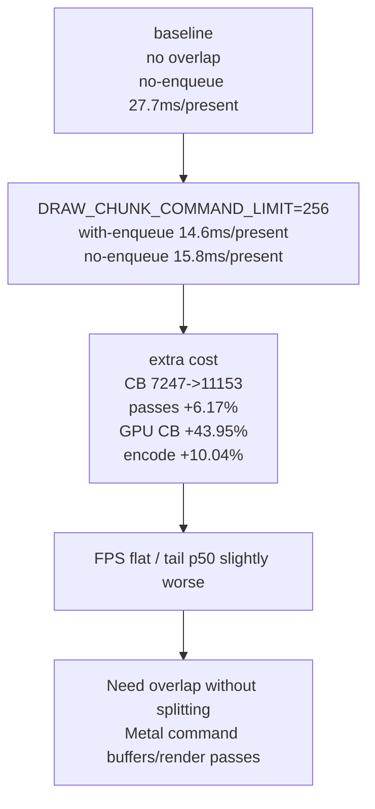

# Present Pacing 50 - Draw-Chunk Limit 256 Sweep

**Question.** [present-pacing-drawchunk-limit.48](present-pacing-drawchunk-limit.48.md) proved that
`DXMT9_DRAW_CHUNK_COMMAND_LIMIT=64` can create completion overlap, but it
fragments command buffers and render passes badly. Is a larger limit such as
`256` a useful middle point: enough overlap with much lower tile/CB cost?

**Verdict.** No. Limit `256` is much less destructive than `64`, but still not a
viable default. It creates real completion overlap
(`0.199 -> 14.569ms/present`) and cuts no-enqueue wait
(`27.717 -> 15.828ms/present`), but total completion wait rises
(`27.916 -> 30.397ms/present`), GPU command-buffer time rises
(`3.231 -> 4.646ms/present`), encode CPU rises
(`11.348 -> 12.488ms/present`), and sampled FPS stays flat
(`16.557 -> 16.586`).

## Run

Baseline:

```sh
bash scripts/tools/run_3dmark05_perf_probe.sh \
  --suffix current-lowoverhead-post-capture-r2 \
  --frame 60 \
  --no-gputrace \
  --no-encoder-breakdown \
  --frame-sampling \
  --timeout 120 \
  --wait-unlocked-sec 5
```

Candidate:

```sh
DXMT9_DRAW_CHUNK_COMMAND_LIMIT=256 \
bash scripts/tools/run_3dmark05_perf_probe.sh \
  --suffix drawchunk-limit256-lowoverhead-r1 \
  --frame 60 \
  --no-gputrace \
  --no-encoder-breakdown \
  --frame-sampling \
  --timeout 120 \
  --wait-unlocked-sec 5 \
  --min-free-mb 256
```

The candidate completed with `status=pass`, `timed_out=false`,
`returncode=0`, `draw_skipped_no_pipeline=0`, and
`gpu_command_buffer_errors=0`. The screenshot is visually normal, with the
machine-gun bloom visible.

The limit reached the runtime:

| Counter | Value |
|---|---:|
| `chunk_publish_reason_draw_limit` | `1,423` |
| `chunk_publish_reason_present` | `1,814` |
| `chunk_publish_commands_draw_limit` | `364,297` |

## Comparison

| Metric | Baseline | Limit 256 | Delta |
|---|---:|---:|---:|
| `sampled_avg_fps` | `16.557` | `16.586` | `+0.03` |
| frame CSV average FPS | `18.488` | `18.595` | `+0.107` |
| tail-600 p50 FPS | `17.256` | `17.183` | `-0.073` |
| `completion_wait_ms_per_present` | `27.916` | `30.397` | `+2.481` |
| `completion_wait_with_enqueue_ms_per_present` | `0.199` | `14.569` | `+14.370` |
| `completion_wait_without_enqueue_ms_per_present` | `27.717` | `15.828` | `-11.889` |
| `completion_wait_overlap_share` | `0.712%` | `47.930%` | `+47.217pp` |
| `gpu_command_buffer_time_ms_per_present` | `3.231` | `4.646` | `+1.415` |
| `command_buffers` | `7,247` | `11,153` | `+3,906` |
| `sub_command_buffers` | `5,433` | `7,914` | `+2,481` |
| `render_pass_begin` | `21,367` | `22,686` | `+1,319` |
| `render_pass_tile_preservation_bytes` | `229.818GB` | `242.500GB` | `+5.52%` |
| `encode_chunk_cpu_ms_per_present` | `11.348` | `12.488` | `+1.139` |
| `encode_draw_cpu_ms_per_present` | `8.759` | `9.708` | `+0.949` |
| `argbuf_cbuf_update_cpu_ms_per_present` | `0.990` | `1.568` | `+0.577` |

The same-cycle no-enqueue stages improve locally:

| Stage | Baseline | Limit 256 | Delta |
|---|---:|---:|---:|
| commit entry -> publish, p50 | `13.971ms` | `6.318ms` | `-7.653ms` |
| encode dequeue -> command buffer commit, p50 | `17.397ms` | `10.528ms` | `-6.869ms` |
| wait -> next enqueue, p50 | `12.955ms` | `11.062ms` | `-1.893ms` |

But this is not enough to recover FPS because the extra command-buffer chain
and render-pass work increases GPU/encode cost and moves wait into overlapped
non-present command-buffer waits instead of removing the work.



## Decision

This rejects a simple threshold sweep. The useful part is the mechanism proof:
earlier publication can make producer/encode work overlap completion wait. The
bad part is the carrier: draw-count chunk splitting creates extra command
buffers, extra render passes, more tile preservation traffic, and more argbuf
cbuf update work.

The next P4 design should preserve render-pass locality while decoupling
producer/replay/encode progress from present completion. Examples to evaluate
before implementation:

- a producer-side pipeline that can stage next-frame replay/snapshot work
  without committing extra Metal command buffers;
- an encode-side queue that can prepare slot-local CPU state while the previous
  present-bearing command buffer is waiting, then commit at normal pass
  boundaries;
- or a framegraph/pass-locality design that publishes earlier logical work but
  coalesces it back into normal render-pass chains before Metal submission.

Do not promote `DXMT9_DRAW_CHUNK_COMMAND_LIMIT` to `perf`; keep it diagnostic.
