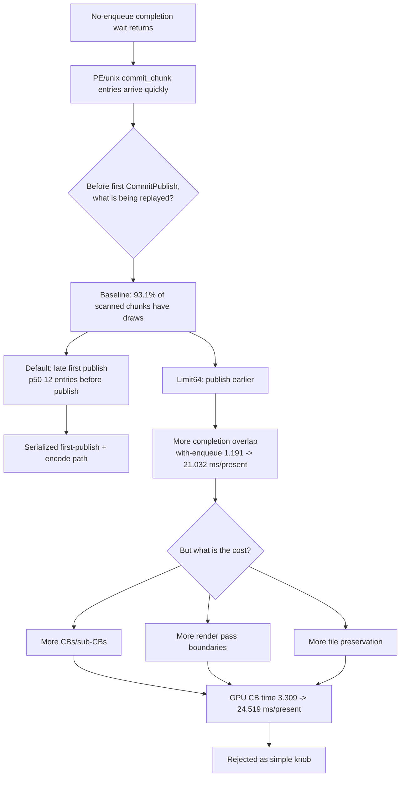
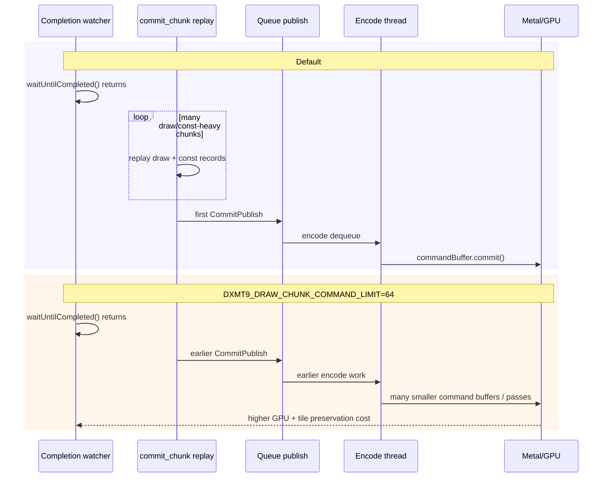

# Present Pacing 48 - Before-Publish Chunk Shape and Draw-Chunk Limit A/B

**Question.** Are the many before-publish `commit_chunk`s after a no-enqueue
completion wait mostly idle/state traffic, or are they already building draw
work? If they are draw-heavy, can `DXMT9_DRAW_CHUNK_COMMAND_LIMIT=64` create
useful overlap by forcing earlier publish?

**Verdict.** The before-publish work is draw/constant heavy, not idle. A draw
chunk limit proves that earlier publish can create overlap, but the simple knob
is rejected because it fragments command buffers/render passes, raises tile
preservation traffic, and worsens total completion/GPU time.

## Runs

```sh
bash scripts/tools/run_3dmark05_perf_probe.sh \
  --suffix noenqueue-chunkshape-r1 \
  --no-gputrace \
  --no-encoder-breakdown \
  --frame-sampling \
  --timeout 120 \
  --capture-delay-sec 45 \
  --wait-unlocked-sec 1 \
  --wait-unlocked-interval-sec 1 \
  --min-free-mb 256
```

```sh
DXMT9_DRAW_CHUNK_COMMAND_LIMIT=64 \
bash scripts/tools/run_3dmark05_perf_probe.sh \
  --suffix drawchunk-limit64-r1 \
  --no-gputrace \
  --no-encoder-breakdown \
  --frame-sampling \
  --timeout 120 \
  --capture-delay-sec 45 \
  --wait-unlocked-sec 1 \
  --wait-unlocked-interval-sec 1 \
  --min-free-mb 256 \
  --compare-baseline-output experiments/output/app-d3d9-3dmark05-noenqueue-chunkshape-r1
```

Both runs completed with `status=pass`, `timed_out=false`, `returncode=0`, and
`capture_error=None`. Visual smoke stayed normal in both runs:
`draw_skipped_no_pipeline=0` and `gpu_command_buffer_errors=0`.

## Baseline Before-Publish Shape

The baseline keeps the current under-pipelined shape:

| Metric | Value |
|---|---:|
| `present_encoded` | `1,800` |
| `completion_wait_ms_per_present` | `27.759` |
| `completion_wait_with_enqueue_ms_per_present` | `1.191` |
| `completion_wait_without_enqueue_ms_per_present` | `26.568` |
| `completion_wait_overlap_share` | `4.292%` |
| `commit_chunk_replay_cpu_ms_per_present` | `8.313` |
| `encode_chunk_cpu_ms_per_present` | `11.453` |
| `gpu_command_buffer_time_ms_per_present` | `3.309` |

The new record-shape counters show the first publish is not blocked on
state-only traffic:

| Chunk metric | total | per publish sample | per scanned chunk |
|---|---:|---:|---:|
| scanned chunks | `24,250` | `14.565` | `1.000` |
| chunks with draw | `22,584` | `13.564` | `0.931` |
| chunks with present | `1,665` | `1.000` | `0.069` |
| state/const-only chunks | `1` | `0.001` | `0.000` |
| no-draw/no-present chunks | `1` | `0.001` | `0.000` |

| Record metric | total | per publish sample | per scanned chunk |
|---|---:|---:|---:|
| all records | `1,206,349` | `724.534` | `49.746` |
| draw records | `619,989` | `372.366` | `25.567` |
| const records | `579,433` | `348.008` | `23.894` |
| apply-state records | `3,039` | `1.825` | `0.125` |
| clear records | `2,223` | `1.335` | `0.092` |
| present records | `1,665` | `1.000` | `0.069` |

**Decision.** The no-enqueue path is actively replaying draw and constant
records before the first publish. The next architecture target is not "make the
producer appear"; it is "publish or overlap useful draw work without destroying
render-pass locality."

## Draw-Chunk Limit A/B

`DXMT9_DRAW_CHUNK_COMMAND_LIMIT=64` proves the overlap mechanism:

| Metric | Baseline | Limit 64 | Delta |
|---|---:|---:|---:|
| `completion_wait_ms_per_present` | `27.759` | `36.321` | `+30.84%` |
| `completion_present_wait_ms_per_present` | `27.759` | `2.942` | `-89.40%` |
| `completion_wait_with_enqueue_ms_per_present` | `1.191` | `21.032` | `+1665.29%` |
| `completion_wait_without_enqueue_ms_per_present` | `26.568` | `15.289` | `-42.45%` |
| `completion_wait_overlap_share` | `4.292%` | `57.905%` | `+53.613pp` |
| `no_enqueue_stage_commit_entry_to_publish_ms_per_present` | `15.508` | `8.639` | `-44.30%` |
| `no_enqueue_stage_encode_dequeue_to_command_buffer_commit_ms_per_present` | `12.203` | `4.642` | `-61.96%` |

But the global cost moves the wrong way:

| Metric | Baseline | Limit 64 | Delta |
|---|---:|---:|---:|
| `present_encoded` | `1,800` | `1,632` | `-9.33%` |
| `gpu_command_buffer_time_ms_per_present` | `3.309` | `24.519` | `+571.85%` |
| `commit_chunk_replay_cpu_ms_per_present` | `8.313` | `14.711` | `+76.96%` |
| `encode_chunk_cpu_ms_per_present` | `11.453` | `13.196` | `+15.22%` |
| `command_buffers` | `7,199` | `22,846` | `+217.35%` |
| `sub_command_buffers` | `5,397` | `13,688` | `+153.63%` |
| `render_pass_begin` | `21,234` | `26,280` | `+23.76%` |
| `passes_per_present` | `11.797` | `16.103` | `+36.50%` |
| `render_pass_tile_preservation_bytes` | `227,722,444,800` | `399,950,008,320` | `+75.63%` |

The limit64 before-publish shape also changes as expected: scanned chunks fall
to `4.180` per publish sample and record count becomes mostly full chunks
(`p50=64`, `p95=64`). That creates earlier publications, but the publications
are too fine-grained for the current Metal render-pass model.

## Interaction Model





## Interpretation

The A/B is useful because it separates two facts:

| Fact | Meaning |
|---|---|
| Earlier publish can create overlap | The current no-enqueue wallclock is not an immutable app pacing floor. dxmt9 can expose more work to the encode/GPU side earlier. |
| Naive draw-count publish hurts | The current backend pays heavily when command-buffer/publish granularity breaks render-pass locality and increases tile preservation. |

The next design should therefore avoid a global draw-count split. Safer
directions are render-pass-aware overlap, publishing only at already-legal pass
boundaries, or decoupling queue visibility from render-pass fragmentation so
the encode thread can start useful work without forcing extra stores/loads.

**Decision.** Keep the new before-publish shape counters. Do not promote
`DXMT9_DRAW_CHUNK_COMMAND_LIMIT=64` to `perf`. Use it only as a diagnostic proof
that overlap is reachable and that the real design must preserve render-pass
coalescing/tile locality.
