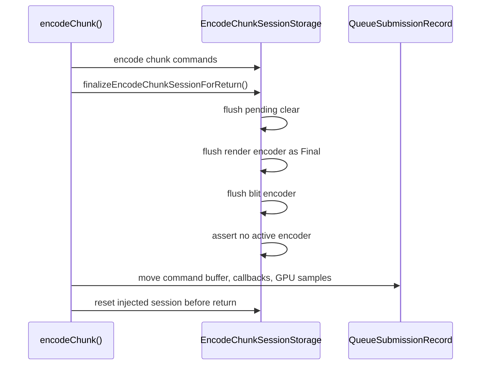

# Present Pacing / Encode Session Finalizer Seam 133

**Question.** After H129-H132 moved active render state, encoder-local caches,
sidecars, callbacks, and GPU sample state into `EncodeChunkSessionStorage`,
what final boundary still needed to become explicit before an opt-in
render-pass carry candidate?

**Answer.** `encodeChunk()` now has a named
`finalizeEncodeChunkSessionForReturn()` boundary. It preserves the previous
default behavior exactly: flush any pending clear, end the live render encoder
with `EncoderSplitReason::Final`, end any blit encoder, assert no active encoder
remains, then let the existing record construction move callbacks and GPU sample
rows into the returned `QueueSubmissionRecord`.

## Finalization Boundary



## Non-Claims

- This does not enable render-pass carry.
- This does not skip `flushRender(Final)`.
- This does not improve FPS.
- This does not justify `.gputrace`; a runtime candidate still needs the H128
  no-gputrace promotion gates plus the `v0.0.3` visual gate.

## Why It Matters

H108 failed because the open command-buffer path carried Metal command-buffer
lifetime but not active render-pass lifetime. H129-H132 made the session state
owned by one structure; H133 makes the teardown point explicit. A later opt-in
candidate can now change this single boundary to defer finalization across
staged sources, instead of scattering carry behavior across the command replay
loop.

## Verification

Focused native coverage should compile the Objective-C++ encoder path and the
public session factory/reset probe:

```sh
meson test -C build-arm64-nowine dxmt9-queue-completion-sources-spec
```

The perf-doc source audit should also pass after linking this leaf from the
present-pacing overview:

```sh
meson test -C build-arm64-nowine dxmt9-perf-docs-source-audit
```

## Next Gate

The next FPS-facing mutation is an opt-in render-pass carry path that defers
this finalizer across staged sources only when the H128 carry contract is
satisfied. It must first pass the no-gputrace promotion gates and the
`v0.0.3` visual-safe gate before Xcode or `.gputrace` is worth spending.
