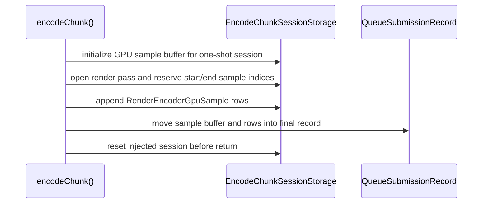

# Present Pacing / Encode Session GPU Sample State 132

**Question.** What session-owned state was still missing after H131 for a
future render-pass carry candidate that also preserves encoder GPU timing
diagnostics?

**Answer.** The render-encoder GPU sample buffer, sample rows, cursor, and
requested sample capacity now live in `EncodeChunkSessionStorage`. The current
path remains one-shot: the session is still reset before `encodeChunk()`
returns, and the final `QueueSubmissionRecord` still receives the moved sample
buffer and rows exactly as before.

## Moved State

| State | Why it belongs to the session |
|---|---|
| `renderEncoderGpuSampleBuffer` | a carried render encoder must keep writing into the same sample buffer |
| `renderEncoderGpuSamples` | the final tail record must publish rows for the logical encoder chain |
| `renderEncoderGpuSampleCursor` | later pass opens must not reuse earlier sample indices |
| `requestedRenderEncoderGpuSamples` | capacity is a property of the session's sample buffer |
| `RenderEncoderGpuAttachment` helper | attachment construction now consumes session-owned sample state |



## Boundary

This is still a prerequisite, not a runtime candidate. The sample capacity is
still initialized from the current `slot.commandCount() * 2 + 16` one-shot
estimate, capped at `8192`, to avoid changing default behavior. A future
multi-source carry candidate must either size the sample buffer for the full
session or prove that the existing cap covers the staged head/tail window.

## Non-Claims

- This does not enable render-pass carry.
- This does not improve FPS.
- This does not change default sample rows or command-buffer submission.
- This does not justify `.gputrace` until an opt-in candidate passes H128's
  no-gputrace and visual gates.

## Verification

Focused native coverage compiled the Objective-C++ encoder path after moving
GPU sample state into the session:

```sh
meson test -C build-arm64-nowine dxmt9-queue-completion-sources-spec
```

## Next Gate

The explicit session finalizer can now assume that active render state,
encoder-local shadows, sidecars, callbacks, and GPU sample state all have a
single session owner. The remaining extraction is the finalizer itself: close
any live render encoder, flush sidecars/callbacks/samples into the pending
record, and reset the session on submit or abort.
