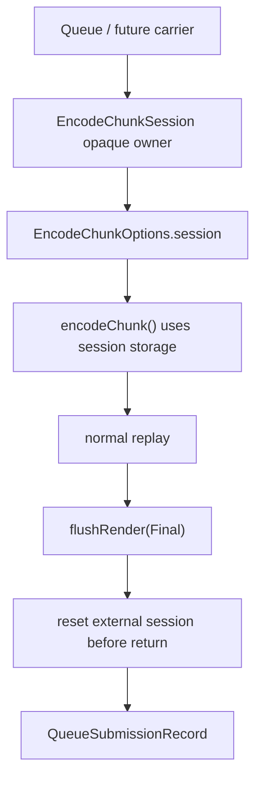

# Present Pacing / Encode Session Injection API 130

> **Outdated — the knob or code path this experiment measured no longer exists in `src/`.** It cannot be re-run. Kept as history; do not cite it as current evidence.

**Question.** After H129 grouped `encodeChunk()`'s render-session locals, what
is the next behavior-preserving step toward an opt-in render-pass carry path?

**Answer.** `EncodeChunkOptions` now accepts an optional opaque
`EncodeChunkSessionState*`. The public header exposes a move-only
`EncodeChunkSession` factory plus reset / active-render probes, while the
actual encoder state remains private to `dxmt9_draw_encoder.mm`.

This is still default-identical. Passing a session only routes the current
one-shot state through the explicit owner; `encodeChunk()` still executes the
normal final flushes and resets the external session before returning. It does
not keep a Metal render encoder open across sources and does not claim FPS or
locality movement.

## Current Shape



The public API deliberately hides the storage layout:

| Surface | Role |
|---|---|
| `EncodeChunkSession` | move-only owner for future queue-side pending state |
| `makeEncodeChunkSession()` | creates an empty session without opening Metal resources |
| `EncodeChunkOptions::session` | optional state injection point for `encodeChunk()` |
| `encodeChunkSessionHasActiveRender()` | narrow invariant probe for tests / future abort paths |
| `resetEncodeChunkSession()` | clears a finalized session; asserts no active encoder is live |

## Why This Matters

H108 proved that carrying only `WMT::CommandBuffer` is not enough: every
source still closed its render encoder at `encodeChunk()` return, creating the
final-pass split/load-store failure class. H129 made the state explicit inside
the encoder. H130 gives the queue a future ownership handle without enabling
that risky behavior yet.

The remaining carry step is not just "skip `flushRender(Final)`." It also needs
a safe finalizer for these cases:

| Case | Required owner before runtime promotion |
|---|---|
| Present tail arrives | close any live render encoder, encode Present, submit final record |
| encode failure | close/abort the session without submitting an unterminated encoder |
| queue drains before tail | finalize pending record before commit or complete inline safely |
| GPU sample buffers / sidecars | keep samples and callbacks attached to the final tail record |

## Non-Claims

- This does not improve FPS.
- This does not change default rendering.
- This does not make `DXMT9_OPEN_CB_PREENCODE_TAIL_PRESENT=1` promotable.
- This does not justify `.gputrace` by itself.

## Verification

Focused native coverage compiles the Objective-C++ encoder path and links the
opaque session factory/reset/probe API:

```sh
meson test -C build-arm64-nowine dxmt9-queue-completion-sources-spec
```

## Next Gate

The next implementation step should introduce an explicit session finalizer
that can close a carried render encoder onto the pending command buffer before
the queue submits or aborts the pending record. Only after that finalizer exists
should an opt-in open-CB path attempt to defer the final render flush across a
pre-Present head and Present tail.
