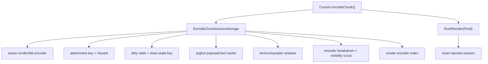

# Present Pacing / Encode Session Shadow State 131

**Question.** After H130 added an opaque session injection API, which remaining
`encodeChunk()` locals still had to move into the session owner before a real
render-pass carry candidate could be safe?

**Answer.** The encoder-local shadow/cache state now lives in
`EncodeChunkSessionStorage` alongside the active Metal encoders and attachment
state. Default behavior is still one-shot: `encodeChunk()` closes the render
encoder, emits diagnostics, and resets an injected session before returning.

## Moved State

| State | Why it belongs to the session |
|---|---|
| `lastArgbufPayload*` | argbuf reopen decisions depend on the previous draw in the same Metal render encoder |
| `ArgbufCbufCache` | cbuf table reuse is encoder-local and must not reset at staged-source boundaries |
| `StreamIbStagingCache` | staged stream/IB reuse is scoped to the active encoder breakdown row |
| `TextureSamplerBindShadow` | direct texture/sampler bind elision is valid only until an encoder boundary |
| `ActiveEncoderBreakdown` | sidecar rows must describe the logical render encoder, not source fragments |
| `VisibilityScoutPass` | visibility result callbacks are tied to the active render encoder |
| `renderEncoderIndex` | pass labels, sidecars, and samples need monotonic session-local encoder IDs |



## Non-Claims

- This does not enable render-pass carry.
- This does not improve FPS.
- This does not change default command-buffer or render-pass counts.
- This does not justify `.gputrace` until a later opt-in candidate passes the
  H128 no-gputrace and visual gates.

## Verification

Focused native coverage compiled the Objective-C++ encoder path after moving
the extra session fields:

```sh
meson test -C build-arm64-nowine dxmt9-queue-completion-sources-spec
```

## Next Gate

The next implementation step is still an explicit session finalizer. It must
close a carried render encoder, emit the sidecars/callbacks/samples attached to
that logical encoder, and clear the session before the queue submits, aborts,
or completes a pending open-CB record.
