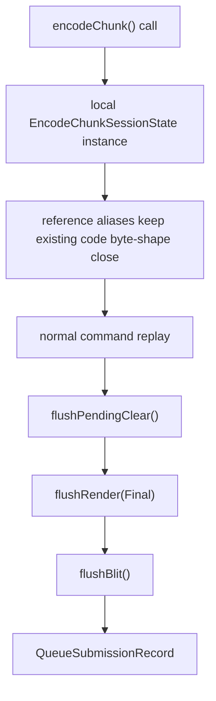

# Present Pacing / Encode Session State Scaffold 129

**Question.** What is the smallest implementation step toward H128's
render-pass carry contract that does not change runtime behavior?

**Answer.** `encodeChunk()` now groups the chunk-local active encoder state
into an explicit session-storage owner and keeps the existing code paths wired
through reference aliases. This is intentionally default-identical: it does not
carry state across `encodeChunk()` calls, does not skip the final
`flushRender(Final)`, and does not claim any FPS movement.

## What Moved

The scaffold groups the state H128 identified as the first carry target:

| Group | Current behavior |
|---|---|
| `activeRenderEncoder` / `activeBlitEncoder` | still local to one `encodeChunk()` call |
| `activeKey` / `activeWriteHazard` | still reset for every call |
| pending clear state | still local to the chunk |
| dirty state and active draw key | still copied from `ctx.dirty` and reset on encoder open |
| argbuf pass flags / storage identity | still per-render-encoder and per-call |
| active color handles and dump sidecars | still emitted at local pass close |
| Metal capture and queue callbacks | still moved into the returned `QueueSubmissionRecord` |



## Why This Matters

Before this change, the state H128 needs to externalize existed only as many
independent locals. That made the next step ambiguous: carrying a render pass
would have required identifying and moving each local independently while also
changing behavior.

This scaffold creates a reusable internal owner without taking the behavior risk
yet. H130 adds the public opaque injection surface; a future candidate can then
promote a session instance into an optional `EncodeSession` boundary and remove
the unconditional final render flush only for a proven head/tail staging path.

## Non-Claims

- This does not improve FPS.
- This does not make open-CB staging safe by itself.
- This does not justify `.gputrace` or Xcode counter spend.
- It remains subject to `--require-render-pass-carry-promotion-gates` and the
  `v0.0.3` visual gate before promotion.

## Verification

Focused native verification compiled the Objective-C++ encoder path and passed:

```sh
meson test -C build-arm64-nowine dxmt9-queue-completion-sources-spec
```

## Next Gate

The next implementation step should add the public injection surface for the
internal session owner without enabling carry. After that, a separate opt-in
path can keep a session instance alive across an open-CB pre-Present head and
its Present tail. That path must preserve the default one-shot behavior and
pass the H128 no-gputrace gate before Xcode/gputrace promotion.
