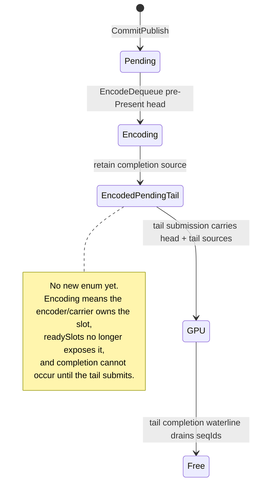
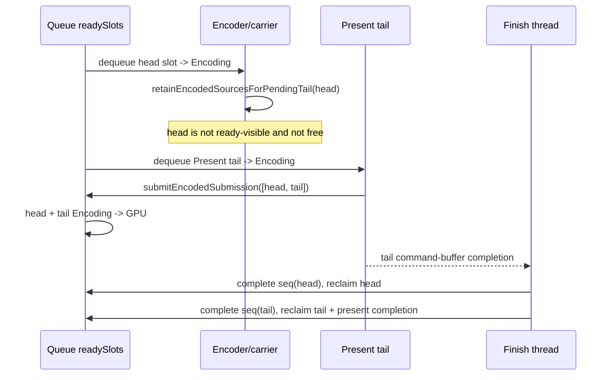

# Present Pacing / Encoded Pending Tail Carrier Primitive 104

**Question.** What is the smallest queue-side primitive needed before splitting
the encoder into pre-Present head encode and Present-tail finish paths?

**Answer.** Reuse the existing `Encoding` slot state as the first
encoded-pending-tail carrier, and prove the completion-source chain before
touching Metal encoder lifetime.

This is intentionally not a runtime P4 win. It adds the lifecycle hook that an
open-CB prototype needs:

- `retainEncodedSourcesForPendingTail()` accepts only already-dequeued
  `Encoding` sources, records their `QueueCompletionSource` identity into caller
  storage, and leaves them non-ready-visible;
- `submitEncodedSubmission()` lets an externally prepared tail submission
  transition the retained heads plus tail to `GPU` through the normal
  `completionSources` path;
- native coverage proves a retained head is freed only after the tail-carrier
  completion chain drains.

## Carrier State

## Completion Flow

## Verified Invariants

| Invariant | Status |
|---|---|
| Pending sources cannot be retained as encoded heads | native-tested rejection |
| Retained heads are removed from `readySlots` before retention | native-tested via dequeue |
| Retention does not transition the head to `GPU` or `Free` | native-tested |
| One tail submission can carry head + tail completion sources | native-tested |
| Head frees before tail only after the shared completion chain drains | native-tested |
| Present completion advances at the tail seqId | native-tested |

## Remaining Work

The primitive does not yet pre-encode Metal commands. The next split must add
an owner for the actual uncommitted command buffer / encoder state, then rerun
the no-gputrace P4 gates, locality gates, and the `v0.0.3` visual-safe gate
before any `.gputrace` spend.
