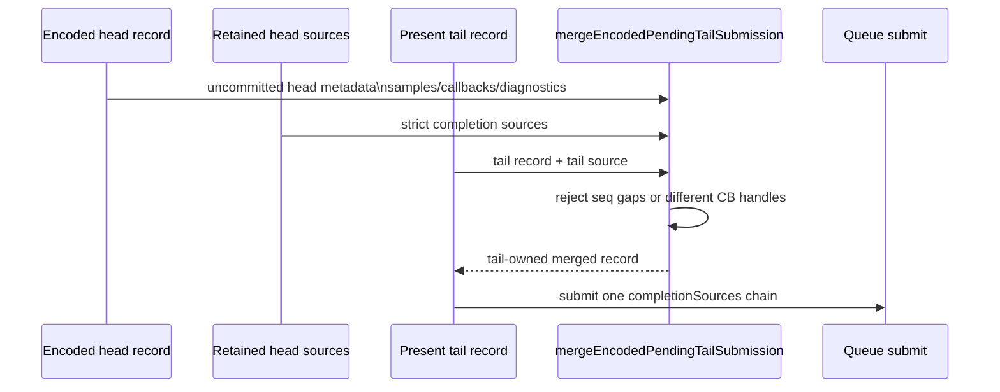
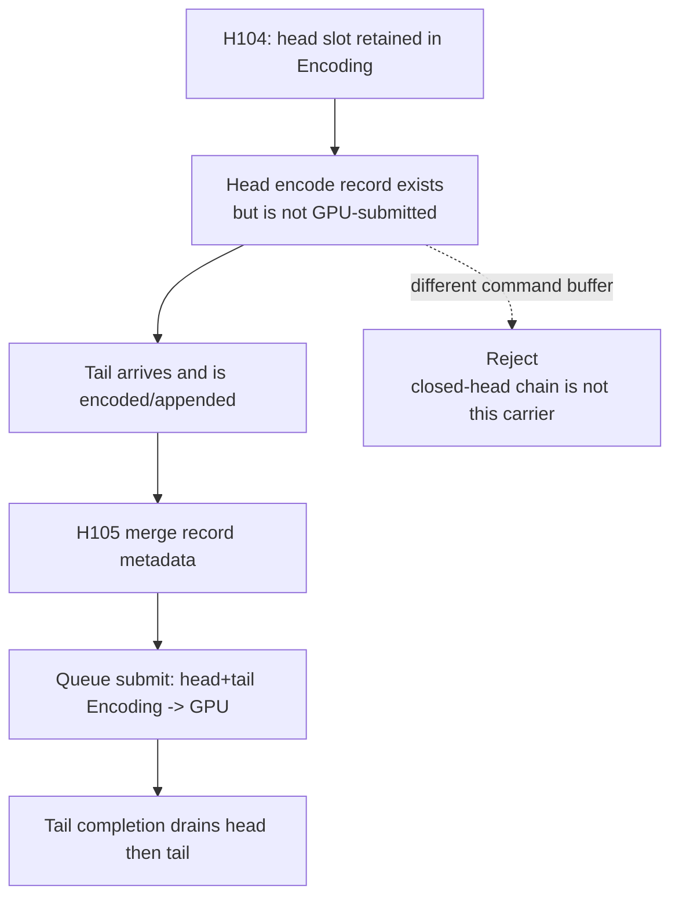

# Present Pacing / Encoded Tail Submission Record Merge 105

**Question.** After H104 retains encoded head source identities, how should an
eventual Present tail submission inherit the pre-encoded head record without
reintroducing the rejected closed-head command-buffer chain?

**Answer.** Add a native-tested record merge primitive, but keep it strict:
`mergeEncodedPendingTailSubmission()` can prepend a previously encoded head
record into a tail `QueueSubmissionRecord` only when source seqIds are
contiguous and any existing command-buffer/counter-sample-buffer handles are
the same. Different command buffers are rejected rather than modeled as a valid
P4 carrier.

This keeps the design aligned with the open-CB target:

- the final tail record keeps the tail `slotIndex` / `seqId`;
- `completionSources` become `[head..., tail...]` in strict seq order;
- head render samples, post-commit callbacks, and completion callbacks execute
  before tail ones;
- diagnostics aggregate head draw work plus tail present work while preserving
  tail identity;
- command-buffer chain length is folded as
  `head_chain + tail_chain - 1`, because the shared tail commit is counted once.

## Record Flow

## State Relationship

## Verified Invariants

| Invariant | Status |
|---|---|
| Head and tail source seqIds must be contiguous | native-tested rejection |
| Tail identity remains the public submission identity | native-tested |
| Completion sources are ordered head before tail | native-tested |
| Chain length counts one final shared commit | native-tested |
| Diagnostics aggregate head draw plus tail present/blit | native-tested |
| Samples and callbacks preserve head-before-tail order | native-tested |

## Remaining Work

H105 still does not encode Metal commands early. The remaining implementation
gate is to split `encodeChunk()` so a pre-Present head can encode into an
uncommitted command buffer and a later Present tail can append to that same
command buffer. Only after that runtime path exists should no-gputrace P4 gates,
locality gates, and the `v0.0.3` visual gate be run.
