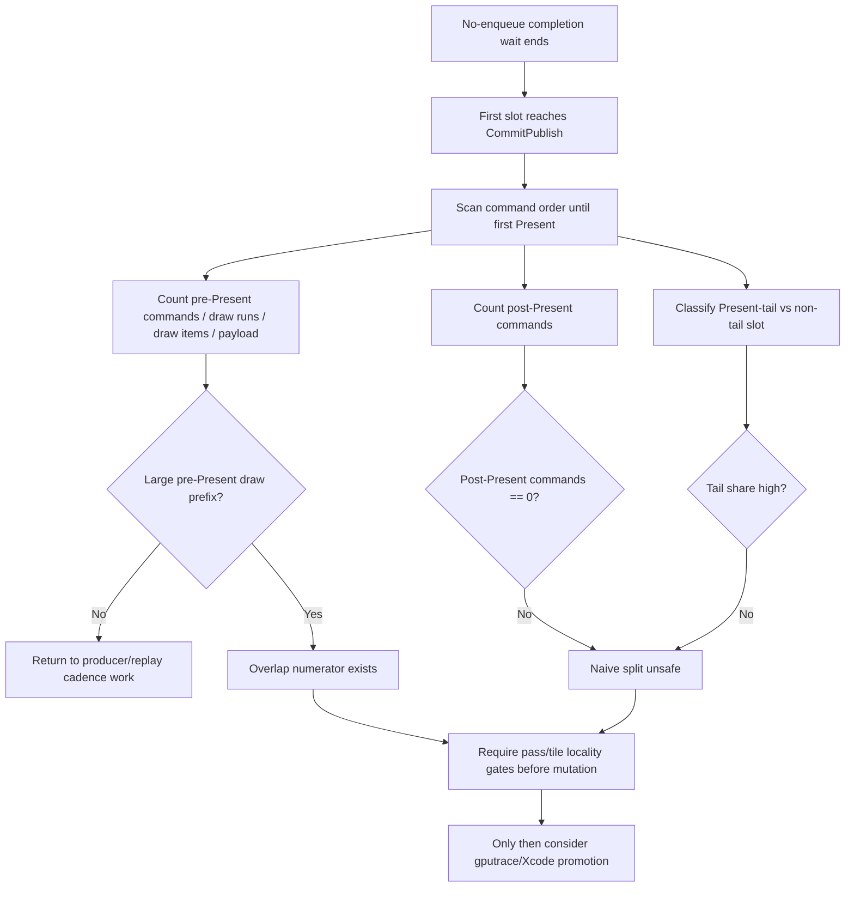

# Present Pacing / No-Enqueue First-Publish Pre-Present Prefix Shape 127

**Question.** The first slot published after a no-enqueue completion wait is
draw-heavy, but is the useful work actually before the Present command, and is
Present the tail? This is the first decision point before another
pre-encode/open-CB experiment.

**Answer.** The new counters are live, and the current no-gputrace scout says
the first-publish slot is already tail-Present shaped. In
`app-d3d9-3dmark05-first-publish-prefix`, every sampled no-enqueue first-publish
slot has a Present tail (`1,636 / 1,636`), no commands after Present, and a
large pre-Present draw prefix: `338.219` commands/slot, `334.227` draw-run
commands/slot, `752.935` draw items/slot, and `202,231` payload bytes/slot.
This gives a real P4 overlap numerator, but it does not remove the need for a
render-pass-carry design because H115/H116 already showed naive open-CB staging
cuts through active render passes.

## Tooling Change

`summarizeNoEnqueueFirstPublishSlotShape()` now scans the `ChunkSlot` command
order before publish and records:

- `completion_no_enqueue_first_publish_slot_pre_present_commands`
- `completion_no_enqueue_first_publish_slot_pre_present_commands_{max,p50,p95}`
- `completion_no_enqueue_first_publish_slot_pre_present_draw_run_commands`
- `completion_no_enqueue_first_publish_slot_pre_present_draw_items`
- `completion_no_enqueue_first_publish_slot_pre_present_draw_items_{max,p50,p95}`
- `completion_no_enqueue_first_publish_slot_pre_present_non_draw_commands`
- `completion_no_enqueue_first_publish_slot_pre_present_payload_bytes`
- `completion_no_enqueue_first_publish_slot_pre_present_payload_bytes_{max,p50,p95}`
- `completion_no_enqueue_first_publish_slot_post_present_commands`
- `completion_no_enqueue_first_publish_slot_present_tail_slots`
- `completion_no_enqueue_first_publish_slot_present_nontail_slots`

The summary and compare tools expose normalized rows, including
`no_enqueue_first_publish_slot_pre_present_draw_items_per_slot`,
`no_enqueue_first_publish_slot_pre_present_payload_bytes_per_slot`, and
`no_enqueue_first_publish_slot_present_tail_share_pct`.

`dxmt9-queue-completion-sources-spec` now covers the pure
`summarizeNoEnqueueFirstPublishSlotShape()` transform for three shapes:
Present-tail, post-Present work, and no-Present slots. This locks the
tail-share interpretation independently from the runtime GT1 sample.

## Runtime Reading

H127 is a 120s foreground no-gputrace scout:
`app-d3d9-3dmark05-first-publish-prefix`.

| Metric | Value | Reading |
|---|---:|---|
| `present_encoded` | `1,779` | normal progress band |
| `completion_wait_with_enqueue_ms_per_present` | `0.209` | still negligible useful overlap |
| `completion_wait_without_enqueue_ms_per_present` | `27.035` | P4 remains no-enqueue dominated |
| `encode_ready_depth_avg` | `1.000` | no queued backlog |
| `no_enqueue_first_publish_slot_samples_per_present` | `0.920` | first-publish classifier live |
| `no_enqueue_first_publish_slot_pre_present_commands_per_slot` | `338.219` | large prefix |
| `no_enqueue_first_publish_slot_pre_present_draw_run_commands_per_slot` | `334.227` | draw-heavy prefix |
| `no_enqueue_first_publish_slot_pre_present_draw_items_per_slot` | `752.935` | substantial overlap numerator |
| `no_enqueue_first_publish_slot_pre_present_payload_bytes_per_slot` | `202,231.032` | substantial payload |
| `no_enqueue_first_publish_slot_post_present_commands_per_slot` | `0.000` | first Present is the tail |
| `no_enqueue_first_publish_slot_present_tail_share_pct` | `100.000` | tail-Present shape accepted |

Against the default h216 control, carrier width is unchanged
(`21,176B/record` both sides), command-buffer/pass/tile shape stays in the same
class, and the P4 owner remains unchanged (`encode_ready_depth_avg=1.000`,
`completion_wait_without_enqueue` still dominant). The screenshot is an
effects-heavy frame with bloom/sparks visible and no black-screen or solid-color
failure; it is a broad `v0.0.3` visual smoke, not same-frame pixel equality.

## Interpretation

This is still a classifier, not a performance win. It tells us whether the next
P4 candidate should be a render-pass-safe overlap design or should return to
producer/replay cadence work.

| Counter shape | Reading | Next action |
|---|---|---|
| Large pre-Present draw prefix, high tail share, near-zero post-Present commands | Real overlap numerator exists before Present | Design a render-pass-safe carrier; require locality gates before gputrace |
| Large first slot but small pre-Present prefix | Present or post-Present work is the boundary | Re-check present split/tail carrier before open-CB |
| High post-Present commands or low tail share | Command order is not tail-Present safe | Do not pre-encode by a naive first-Present split |
| Prefix draw-heavy but H115 final same-key reopen rises in a candidate | Carrier cuts through active render pass | Reject without Xcode promotion |

## Flow



## Gate

Run the next no-gputrace scout with the normal 120s foreground wrapper and read
these rows with the existing P4 gates:

```sh
bash scripts/tools/run_3dmark05_perf_probe.sh \
  --suffix first-publish-prefix --frame 60 \
  --no-gputrace --timeout 120 --keep-frontmost
```

Promotion requires movement in `completion_wait_with_enqueue_ms` or
`completion_wait_without_enqueue_ms`, preserved ready-depth/locality gates, and
the `v0.0.3` visual-safe check. A large prefix alone only proves that the next
overlap design has a numerator.
