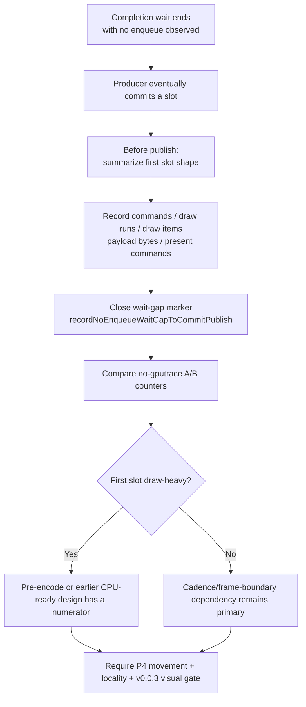

# Present Pacing / No-Enqueue First Publish Slot Shape 101

**Question.** After a completion wait that sees no enqueue, what is the first
slot the producer finally publishes? Is it a large draw-heavy head that could
justify pre-encoding into an open command buffer, or is it a tiny/present-like
slot that points back to producer cadence and frame-boundary dependencies?

**Answer.** The first runtime sample says the slot is draw-heavy, not a tiny
tail. H180 records `1,677` no-enqueue first-publish samples over `1,740`
presents (`0.964/present`). The sampled slot averages `335.305` commands,
`330.346` draw-run commands, `746.432` draw items, `4.959` non-draw commands,
`200,632` payload bytes, and one Present command. The p50 slot is already large
(`474` commands, `991` draw items, `260,956` payload bytes), so the P4 overlap
miss has a real draw-work numerator.

## Tooling Change

The queue now samples the first `ChunkSlot` about to be published after a
no-enqueue completion wait. The sample is taken before the existing
`recordNoEnqueueWaitGapToCommitPublish()` marker closes that wait gap, so each
no-enqueue wait contributes at most one first-publish slot shape.

New raw counters:

- `completion_no_enqueue_first_publish_slot_samples`
- `completion_no_enqueue_first_publish_slot_commands`
- `completion_no_enqueue_first_publish_slot_commands_max`
- `completion_no_enqueue_first_publish_slot_commands_p50`
- `completion_no_enqueue_first_publish_slot_commands_p95`
- `completion_no_enqueue_first_publish_slot_draw_run_commands`
- `completion_no_enqueue_first_publish_slot_draw_items`
- `completion_no_enqueue_first_publish_slot_draw_items_max`
- `completion_no_enqueue_first_publish_slot_draw_items_p50`
- `completion_no_enqueue_first_publish_slot_draw_items_p95`
- `completion_no_enqueue_first_publish_slot_non_draw_commands`
- `completion_no_enqueue_first_publish_slot_payload_bytes`
- `completion_no_enqueue_first_publish_slot_payload_bytes_max`
- `completion_no_enqueue_first_publish_slot_payload_bytes_p50`
- `completion_no_enqueue_first_publish_slot_payload_bytes_p95`
- `completion_no_enqueue_first_publish_slot_present_commands`

The compare tooling also exposes normalized rows:

- `no_enqueue_first_publish_slot_samples_per_present`
- `no_enqueue_first_publish_slot_commands_per_present`
- `no_enqueue_first_publish_slot_commands_per_slot`
- `no_enqueue_first_publish_slot_draw_run_commands_per_slot`
- `no_enqueue_first_publish_slot_draw_items_per_slot`
- `no_enqueue_first_publish_slot_non_draw_commands_per_slot`
- `no_enqueue_first_publish_slot_payload_bytes_per_slot`
- `no_enqueue_first_publish_slot_present_commands_per_slot`

`summarize_3dmark05_perf.py` adds the same rows to the P4 summary and emits a
dedicated `No-Enqueue First-Publish Slot Shape` section when samples exist.

## Interpretation

This is a classification counter, not a win by itself:

| Shape | Meaning | Likely next action |
|---|---|---|
| Large draw-heavy first slot | The producer creates useful work only after completion wait | Investigate pre-encoding/open-CB or earlier CPU-ready carrier that preserves pass locality |
| Present-heavy or tiny first slot | The wait is closer to frame-boundary/app cadence than hidden draw work | Focus on PE/Wine/app dependency and producer cadence, not more queue staging |
| Wide p95 tail with small p50 | Occasional long producer bursts | Gate any candidate by percentile movement, not only average totals |
| Payload bytes high but draw count low | Uniform/draw payload materialization may dominate first work | Re-check snapshot/uniform carrier and direct compact consumers |

## Flow

## Gate

Future P4 runs should report these rows together with H100 residency
percentiles:

1. `completion_wait_with_enqueue_ms_per_present`
2. `completion_wait_without_enqueue_ms_per_present`
3. `encode_ready_depth_avg`
4. `chunk_publish_slot_residency_{p50,p95}_ms`
5. `no_enqueue_first_publish_slot_*_per_slot`

Do not promote a candidate only because it changes the first-publish slot shape.
Promotion still requires reduced no-enqueue wait or increased useful enqueue
overlap, preserved command-buffer/pass/tile locality, and a visual check against
the `v0.0.3` GT1 anchor.

## Runtime Reading

H180 is a 120s no-gputrace foreground run:
`app-d3d9-3dmark05-h180-first-publish-slot-r1`. It is an attribution run, not a
performance win.

| Metric | h179 foreground baseline | h180 first-publish sample | Reading |
|---|---:|---:|---|
| sampled FPS mean | `18.527` | `16.418` | not a win claim |
| `present_encoded` | `1,800` | `1,740` | same broad progress band, slower sample |
| `completion_wait_with_enqueue_ms_per_present` | `0.026` | `0.024` | overlap still absent |
| `completion_wait_without_enqueue_ms_per_present` | `28.032` | `28.442` | P4 owner flat/worse |
| `encode_ready_depth_avg` | `1.000` | `1.000` | no backlog |
| `no_enqueue_first_publish_slot_samples_per_present` | `0.000` | `0.964` | counter live |
| `no_enqueue_first_publish_slot_commands_per_slot` | `n/a` | `335.305` | draw-heavy |
| `no_enqueue_first_publish_slot_draw_items_per_slot` | `n/a` | `746.432` | draw-heavy |
| `no_enqueue_first_publish_slot_payload_bytes_per_slot` | `n/a` | `200,632.227` | substantial payload |

The visual smoke frame is effects-heavy and coherent: muzzle/bloom/sparks are
visible and there is no black-screen or solid-color failure. Treat it as broad
`v0.0.3`-anchored smoke only, not same-frame pixel equality.

The result shifts the next design question. The missed overlap window is not
empty; it contains a substantial draw/payload slot that is still published only
after the no-enqueue completion wait. Pre-encoding into an open command buffer
or another render-pass-safe early CPU-ready path now has a measured numerator,
but it must be designed without reproducing the rejected command-buffer/pass
fragmentation from draw-limit staging.
