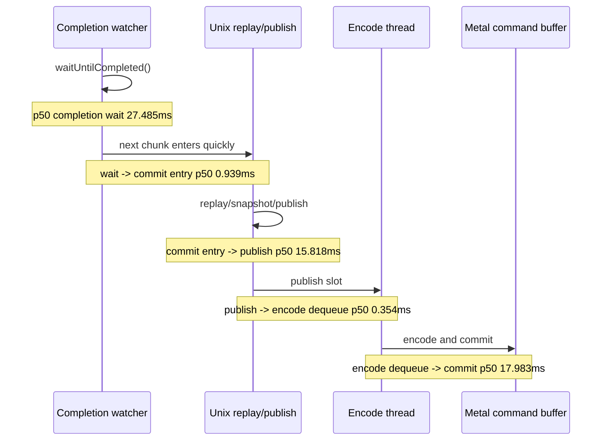

# Present-Pacing 39 - Current Low-Overhead Frame Sampling

## Question

After adding current-run compact-uniform opportunity gating, what does a
normal no-gputrace frame-sampling scout say about the current average-FPS
owner? In particular, is completion wait hidden behind later enqueue/encode
work, or is the frame still under-pipelined?

## Run

```sh
bash scripts/tools/run_3dmark05_perf_probe.sh \
  --suffix p4-frame-sampling-current \
  --frame 60 \
  --no-gputrace \
  --no-encoder-breakdown \
  --frame-sampling \
  --timeout 120 \
  --wait-unlocked-sec 1 \
  --wait-unlocked-interval-sec 1 \
  --require-current-uniform-compact-saved-bytes-present
```

The run completed cleanly and wrote:

| Artifact | Path |
|---|---|
| Summary | `experiments/output/app-d3d9-3dmark05-p4-frame-sampling-current/3dmark05-perf-summary.md` |
| Frame CSV | `experiments/output/app-d3d9-3dmark05-p4-frame-sampling-current/3dmark05-perf-frames.csv` |
| Result JSON | `experiments/output/app-d3d9-3dmark05-p4-frame-sampling-current/result.json` |

## Frame Shape

| Metric | Value |
|---|---:|
| `present_encoded` | `1,860` |
| Frame rows | `1,860` |
| Summary sampled frames | `1,859` |
| Summary sampled avg FPS | `17.019` |
| `wall_ms` avg / p50 / p95 / max | `58.728 / 53.475 / 82.502 / 4887.185` |
| `completion_wait_ms` avg / p50 / p95 / max | `27.443 / 27.485 / 39.849 / 89.676` |
| `gpu_command_buffer_time_ms` avg / p50 / p95 / max | `3.144 / 1.058 / 13.878 / 22.223` |
| `encode_chunk_cpu_ms` avg / p50 / p95 / max | `10.480 / 9.413 / 18.048 / 24.943` |
| `submit_draw_cpu_ms` avg / p50 / p95 / max | `1.893 / 1.538 / 3.967 / 9.606` |
| `present_acquire_wait_ms` avg / p50 / p95 | `0.100 / 0.099 / 0.122` |
| `present_boundary_wait_ms` p95 | `0.000` |
| `present_token_wait_ms` p95 | `0.000` |

Frame 1 is startup/capture-delay noise (`4887.185ms`) and should not be used as
steady-state FPS. The steady rows still show the familiar shape: completion
wait is larger than GPU time and sits beside a large encode chunk.

Top slow steady frames cluster around frames `1426..1442`, with `18/18` render
passes, `~1.48k` draws, GPU CB time `12..16ms`, encode chunk time `13..22ms`,
and completion wait `21..24ms`.

## P4 Overlap

| Counter | Value |
|---|---:|
| `completion_wait_ms` | `51,043.315` |
| `completion_wait_with_enqueue_ms` | `398.121` |
| `completion_wait_without_enqueue_ms` | `50,645.194` |
| `completion_enqueue_while_waiting_present` | `9` |
| `completion_wait_status_committed_ms` | `50,685.137` |
| `completion_wait_status_scheduled_ms` | `358.178` |

Only `9` Present waits overlap later enqueue work. The wait-without-enqueue
bucket still owns essentially all completion wait, so the current frame stream
is still under-pipelined.

Same-cycle no-enqueue stage p50/p95:

| Stage | p50 | p95 |
|---|---:|---:|
| `wait -> commit_chunk entry` | `0.939ms` | `2.934ms` |
| `commit_entry -> publish` | `15.818ms` | `26.539ms` |
| `publish -> encode_dequeue` | `0.354ms` | `0.481ms` |
| `encode_dequeue -> command_buffer_commit` | `17.983ms` | `23.931ms` |
| `wait -> next_enqueue` | `13.032ms` | `48.874ms` |

The front handoff from wait-end to unix commit entry is fast. The exposed time
then sits in replay/snapshot/publish and backend encode-to-commit.



## Uniform Gate Context

The current-run compact-uniform opportunity gate passed:

| Metric | Value |
|---|---:|
| `d3d9_snapshot_uniform_materialized_compact_saved_bytes` | `6,637,668,832` |
| `uniform_compact_saved_bytes_per_present` | `3,568,639.157` |
| `uniform_compact_saved_share_of_materialized_bytes` | `71.28%` |

This keeps the compact/interned uniform payload carrier on the CPU-copy
roadmap, but the frame-sampling data says it is not the whole average-FPS
owner: `encode_chunk_cpu_ms` and exposed no-enqueue stage time are still much
larger than the measured uniform copy sub-buckets.

## Decision

Accepted as the current low-overhead P4 baseline.

- The renderer is still visually and operationally normal for a no-gputrace
  scout (`status=pass`, no capture error).
- Completion wait remains mostly no-enqueue wait, not useful overlap.
- Present acquire/boundary/token waits are not the owner.
- GPU command-buffer time is not the average frame floor; the wall-clock path is
  completion wait plus serialized replay/snapshot/publish and encode.
- Next average-FPS candidates should pair P2/P3 stage gates with P4 gates:
  shrinking `commit_entry -> publish` or `encode_dequeue -> commit` is necessary
  but insufficient unless `completion_wait_without_enqueue_ms` or frame sampling
  moves.

**Related.** [present-pacing-serial-stage-compare-gates.38](present-pacing-serial-stage-compare-gates.38.md) ·
[present-pacing-systemtrace-p4-range.36](present-pacing-systemtrace-p4-range.36.md) ·
[state-churn-encode-encode-phase.102](../state-churn-encode/state-churn-encode-encode-phase.102.md) · [present-pacing](../present-pacing.md).
