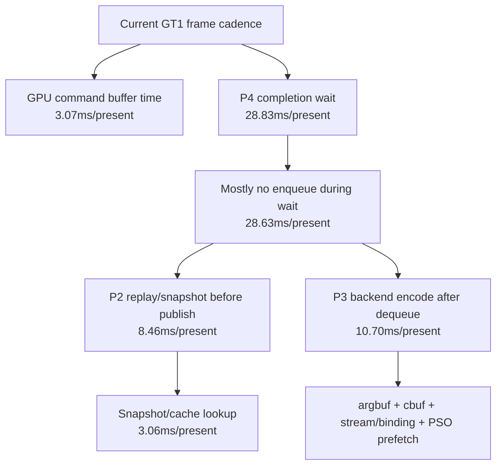

# Present Pacing 33 - Current Low-Overhead Refresh

**Question.** After the recent encode/copy cleanup and the rejected
uniform-payload timer removal, what does a current low-overhead GT1 run say
about the remaining average-FPS owner?

**Run.**

```sh
bash scripts/tools/run_3dmark05_perf_probe.sh \
  --suffix current-lowoverhead-after-cleanup-r1-20260615 \
  --no-gputrace --no-encoder-breakdown --frame-sampling --timeout 120
```

The run finalized as `status=pass`. Visual smoke is accepted: scene geometry,
bright bloom/effects, and HUD are visible; this is not the HUD-only black-screen
failure from [state-churn-encode-encode-phase.88](../state-churn-encode/state-churn-encode-encode-phase.88.md).

| Metric | Value | Per present |
|---|---:|---:|
| `present_encoded` | `1,800` | n/a |
| `draw_calls` | `1,328,821` | `738.234` |
| `sampled_avg_fps` | `18.878` | n/a |
| frame-sample p50 / p95 / max FPS | `18.657 / 26.833 / 29.865` | n/a |
| `gpu_command_buffer_time_ms` | `5,529.843ms` | `3.072ms` |
| `completion_wait_ms` | `51,901.137ms` | `28.834ms` |
| `completion_wait_with_enqueue_ms` | `374.009ms` | `0.208ms` |
| `completion_wait_without_enqueue_ms` | `51,527.128ms` | `28.626ms` |
| `commit_chunk_replay_cpu_ms` | `15,222.791ms` | `8.457ms` |
| `commit_chunk_queue_draw_submission_cpu_ms` | `7,766.030ms` | `4.314ms` |
| `d3d9_snapshot_draw_submission_cpu_ms` | `6,466.912ms` | `3.593ms` |
| `d3d9_snapshot_cache_lookup_cpu_ms` | `5,501.832ms` | `3.057ms` |
| `encode_chunk_cpu_ms` | `19,250.996ms` | `10.695ms` |
| `encode_draw_cpu_ms` | `15,714.023ms` | `8.730ms` |

Current encode children:

| Child | Value | Per present |
|---|---:|---:|
| `encode_draw_argbuf_setup_cpu_ms` | `3,382.726ms` | `1.879ms` |
| `encode_draw_argbuf_cbuf_update_cpu_ms` | `1,748.164ms` | `0.971ms` |
| `encode_draw_binding_packet_cpu_ms` | `1,840.566ms` | `1.023ms` |
| `encode_draw_stream_bind_cpu_ms` | `2,498.683ms` | `1.388ms` |
| `encode_slot_pso_prefetch_cpu_ms` | `2,211.005ms` | `1.228ms` |

Clean-run gates:

| Counter | Value |
|---|---:|
| `present_schedule_immediate` | `1,800` |
| `present_schedule_after_minimum_duration` | `0` |
| `present_boundary_wait_ms` | `0.000` |
| `queue_sequence_wait_ms` | `0.000` |
| `map_buffer_wait_ms` | `0.000` |
| `draw_skipped_no_pipeline` | `0` |
| `gpu_command_buffer_errors` | `0` |
| `render_split_hazard` | `0` |



**Decision.** This refresh keeps the current average-FPS model unchanged.
The run is not GPU-execution-time-bound on average (`3.072ms/present` GPU CB
time), but the exposed CPU work is still large enough that the completion wait
window does not overlap useful next-frame work in practice. `with_enqueue` is
only `0.208ms/present`; the broad winemac `OnMainThread` hypothesis should stay
below replay/snapshot/encode serialization unless a targeted threshold log
contradicts the native-selector xctrace scouts.

**Next gate.** The next no-gputrace A/B should reduce one of the named children
above and must prove more than a local CPU win:

- `completion_wait_ms` or `completion_wait_without_enqueue_ms` moves down;
- frame-sample FPS p50/tail moves in the same direction;
- visual smoke remains normal;
- skipped-pipeline, Metal-error, render-split-hazard, map-wait, and
  queue-sequence-wait counters stay clean.

Do not spend a `.gputrace` on this CPU-refresh result alone. Use Xcode/gputrace
for GPU-side TVB/PB or render-pass candidates after a no-gputrace gate identifies
a GPU-facing change.

**Verification.**

- `meson compile -C build-arm64-nowine`
- `meson compile -C build-x86_64-builtin`
- `meson test -C build-arm64-nowine dxmt9:dxmt9-perf-counter-table-audit dxmt9:dxmt9-perf-counter-callsite-audit --timeout-multiplier 3`
- `bash scripts/tools/run_3dmark05_perf_probe.sh --suffix current-lowoverhead-after-cleanup-r1-20260615 --no-gputrace --no-encoder-breakdown --frame-sampling --timeout 120`

**Related.** [present-pacing-lowoverhead-serial.24](present-pacing-lowoverhead-serial.24.md) ·
[present-pacing-native-selector-xctrace.32](present-pacing-native-selector-xctrace.32.md) ·
[state-churn-encode-encode-phase.87](../state-churn-encode/state-churn-encode-encode-phase.87.md) ·
[state-churn-encode-encode-phase.88](../state-churn-encode/state-churn-encode-encode-phase.88.md) · [state-churn-encode](../state-churn-encode/index.md).
