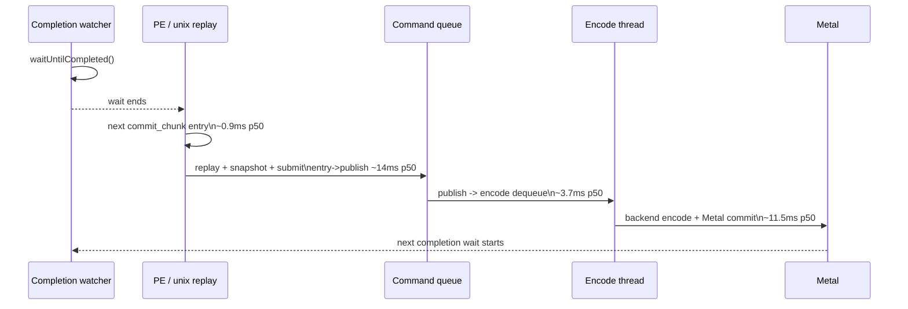
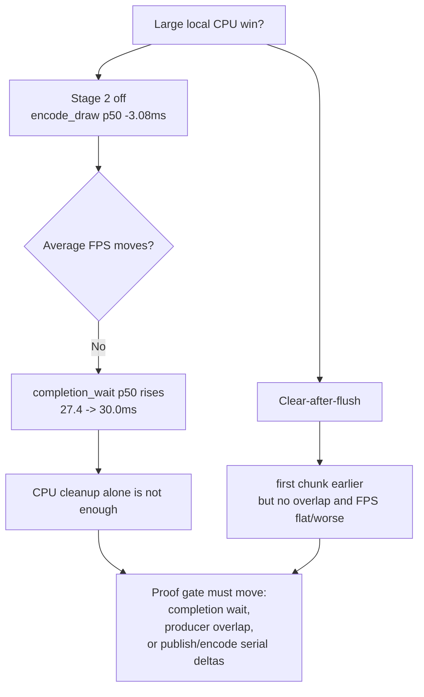

# Present Pacing 24 - Low-Overhead Serial Cadence

> **Outdated — the knob or code path this experiment measured no longer exists in `src/`.** It cannot be re-run. Kept as history; do not cite it as current evidence.

**Question.** After the latest copy-policy and argbuf experiments, is current
GT1 average FPS still best explained as a hidden app/Wine wait, or as serialized
P2/P3 work that runs after each completion wait?

**Method.** Reuse the current low-overhead no-gputrace runs with frame sampling
and no encoder breakdown:

```sh
bash scripts/tools/run_3dmark05_perf_probe.sh \
  --suffix argbuf-stage2-lowoverhead-r1-20260614 \
  --frame 60 --no-gputrace --no-encoder-breakdown \
  --frame-sampling --timeout 120 --top 5

DXMT9_DISABLE_ARGBUF_HYBRID=1 \
bash scripts/tools/run_3dmark05_perf_probe.sh \
  --suffix argbuf-stage1-lowoverhead-r1-20260614 \
  --frame 60 --no-gputrace --no-encoder-breakdown \
  --frame-sampling --timeout 120 --top 5
```

Also compare the matching recorder-stats clear-flush refresh to keep the PE
front-gate result in scope.

| Counter | Stage 2 low-overhead | Stage 1 low-overhead |
|---|---:|---:|
| `present_encoded` | `1,786` | `1,740` |
| `completion_wait_ms / present` | `27.116ms` | `31.148ms` |
| `completion_wait_with_enqueue` | `1` | `11` |
| `completion_wait_without_enqueue` | `1,785` | `1,728` |
| `commit_chunk_replay_cpu_ms / present` | `10.458ms` | `10.676ms` |
| `d3d9_snapshot_draw_submission_cpu_ms / present` | `3.440ms` | `3.571ms` |
| `commit_chunk_draw_batch_submit_cpu_ms / present` | `1.607ms` | `1.605ms` |
| `encode_draw_cpu_ms / present` | `9.388ms` | `6.143ms` |
| `gpu_command_buffer_time_ms / present` | `3.080ms` | `2.855ms` |

The Stage 1 policy removes a large encode bucket, but it does not improve the
wallclock lane because completion wait grows.

| Same-cycle stage delta | Stage 2 p50 | Stage 1 p50 | Recorder-stats baseline p50 |
|---|---:|---:|---:|
| wait end -> `commit_chunk` entry | `0.861ms` | `0.974ms` | `1.053ms` |
| `commit_chunk` entry -> `CommitPublish` | `14.068ms` | `15.947ms` | `5.577ms` |
| `CommitPublish` -> `EncodeDequeue` | `3.678ms` | `3.880ms` | `2.443ms` |
| `EncodeDequeue` -> `commandBuffer.commit()` | `11.528ms` | `11.879ms` | `11.971ms` |

The first row is the important correction to the app-wait theory: the next
unix commit entry follows completion quickly. The long exposed path is then
spent in replay/snapshot/submit before publish and backend encode after dequeue.
The p50 rows are stage distributions, not additive frame arithmetic, but they
name the only large post-wait stages visible in current low-overhead telemetry.





**Decision.** Accepted as current attribution. Current GT1 is not blocked
because the app fails to call D3D9 after completion; the next unix-visible work
arrives quickly. It is also not a pure GPU floor: GPU command-buffer time remains
around `3ms/present`. The active wallclock lane is serialized producer/replay
plus backend encode with almost no overlap under completion wait.

This explains why disabling the Stage 2 argbuf hybrid can remove `~3.25ms` of
encode CPU per present yet leave tail FPS flat: the run still does not create
useful producer run-ahead, and the remaining post-wait stages are large enough
to refill the exposed wait window.

**Next gates.**

- Treat single-bucket CPU wins as necessary cleanup, not sufficient average-FPS
  proof. Promotion requires lower `completion_wait_ms`, more
  `completion_wait_with_enqueue`, or smaller same-cycle serial stage deltas.
- Keep `DXMT9_PE_FLUSH_AFTER_CLEAR=1` diagnostic-only. It proves earlier publish
  is possible but not useful enough in the current shape.
- Focus the next no-gputrace work on current large P2/P3 owners:
  `commit_chunk_replay_cpu_ms`, queued draw submission/snapshot cache miss,
  draw-batch submit append/uniform storage, and backend encode storage shape.

**Related.** [present-pacing](index.md) · [present-pacing-pe-clear-flush.23](present-pacing-pe-clear-flush.23.md) ·
[state-churn-encode-encode-phase.68](../state-churn-encode/state-churn-encode-encode-phase.68.md) · [snapshot-cache](../snapshot-cache/index.md).
