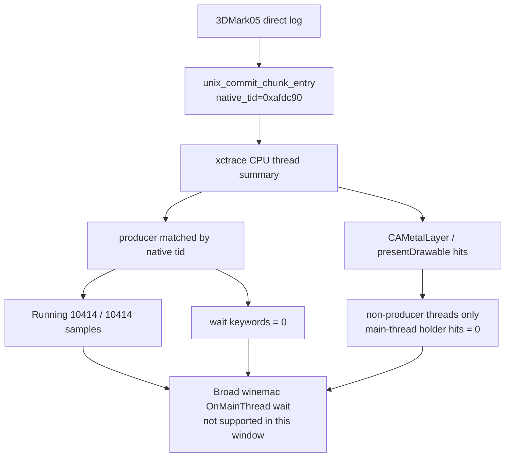

# Present-Pacing 79 - Current native-producer System Trace scout

## Question

After the compact-uniform ABI-prefix correctness fix and the current
`v0.0.3` visual-safe anchor correction, does a same-run native producer
selector find evidence that the 3DMark05 producer thread is blocked in
winemac / Cocoa present-side work?

## Run

```sh
bash scripts/tools/run_3dmark05_system_trace_sidecar.sh \
  --export-cpu-summary \
  --cpu-producer-from-pe-log \
  --record-delay-sec 75 \
  --time-limit-sec 10 \
  --min-free-mb 4096 \
  --wait-unlocked-sec 1 \
  --wait-unlocked-interval-sec 1 \
  -- \
  --suffix p4-native-producer-current-r2-20260618 \
  --no-gputrace \
  --timeout 120 \
  --frame-sampling \
  --capture-delay-sec 45 \
  --wait-unlocked-sec 1 \
  --wait-unlocked-interval-sec 1 \
  --min-free-mb 256
```

The first attempt, `p4-native-producer-current-r1-20260618`, failed in
`xctrace` save/trim with:

```text
Could not trim file: No space left on device
```

That failure happened with roughly `2.4GiB` free. Old Xcode
`com.apple.gpuarchiver` cache entries consumed about `166GiB`; removing stale
cache directories restored enough space for the successful r2 run. The sidecar
default launch guard should therefore be `4096MiB`, not `2048MiB`.

## CPU Selector Result

The r2 CPU summary selected the native unix replay-boundary thread id from
`unix_commit_chunk_entry native_tid=0x...`, not the PE Win32 thread-id
fallback.

| Field | Value |
|---|---:|
| Producer selector | `0xafdc90` |
| Selector source | `native-log-commit-chunk-entry` |
| Producer thread | `3DMark05.exe (0xafdc90)` |
| Producer profile weight | `10406.000ms` |
| Producer sample rows | `10,414` |
| Producer running rows | `10,414` |
| Producer blocked rows | `0` |
| Producer wait keyword hits | `0` |
| Producer holder keyword hits | `0` |
| Non-producer wait keyword hits | `2` |
| Holder status | `holder-positive-non-main-thread` |
| Main-thread holder keyword hits | `0` |
| Non-producer holder keyword hits | `73` |

Keyword hits are present, but not on the selected producer:
`CAMetalLayer=37`, `presentDrawable=26`, `nextDrawable=10`, and `kevent=2`.
The selected producer itself is sampled as Running for the full window with no
P4 wait keywords.



## Pacing Context

This is a System Trace sidecar with frame sampling and encoder telemetry, not a
low-overhead FPS baseline. It is still useful for checking whether the current
P4 theory has a producer-thread wait stack.

| Metric | Value |
|---|---:|
| `present_encoded` | `1,380` |
| `completion_wait_ms / present` | `26.668ms` |
| `completion_present_wait_ms / present` | `26.668ms` |
| `completion_present_wait_with_enqueue_ms` | `0.000ms` |
| `completion_wait_with_enqueue_ms` | `0.000ms` |
| `completion_wait_without_enqueue_ms / present` | `26.668ms` |
| `gpu_command_buffer_time_ms / present` | `3.037ms` |
| `commit_chunk_replay_cpu_ms / present` | `8.244ms` |
| `commit_chunk_queue_draw_submission_snapshot_cpu_ms / present` | `3.141ms` |
| `encode_chunk_cpu_ms / present` | `13.101ms` |
| `encode_draw_cpu_ms / present` | `9.930ms` |
| `encode_slot_pso_prefetch_cpu_ms / present` | `1.235ms` |
| `wait -> commit_entry` p50 / p95 | `1.209 / 3.688ms` |
| `commit_entry -> publish` p50 / p95 | `40.744 / 93.782ms` |
| `publish -> encode_dequeue` p50 / p95 | `0.378 / 0.596ms` |
| `encode_dequeue -> command_buffer_commit` p50 / p95 | `21.818 / 32.862ms` |
| `wait -> next_enqueue` p50 / p95 | `64.281 / 127.709ms` |
| `draw_skipped_no_pipeline` | `0` |
| `gpu_command_buffer_errors` | `0` |

The same structural split remains: GPU command-buffer time is small compared
with completion wait, no later enqueue overlaps the wait, and the exposed
post-wait path is replay/snapshot plus backend encode.

## Metal Timing Context

The sidecar joined `1353/1353` encoder rows over seq `916..1060`. Stage time is
still vertex dominated:

| Group | Stage share | Vertex share |
|---|---:|---:|
| All joined rows | `100.00%` | `92.70%` |
| `opaque-depth-indexed` | `69.90%` | `94.34%` |
| `alpha-blend-indexed` | `26.14%` | `92.12%` |
| `rt_change` end reason | `83.84%` | `94.44%` |
| `clear` end reason | `15.69%` | `85.94%` |

This does not expose Xcode `.gputrace` replay counters such as
`VS Buffer Device Memory Bytes Written`. It only confirms that the captured
normal-rendering window remains vertex-stage dominated while the CPU P4 scout
selects a running producer thread.

## Decision

Accepted as a current native-selector negative scout. Broad winemac
`OnMainThread` should not be promoted to the current average-FPS owner from
this evidence: the selected producer thread is not blocked and has no wait
keywords. CoreAnimation / Metal holder samples exist, but they are on
non-producer threads and do not prove that the producer is serialized by
winemac.

The next FPS-facing work should stay on the measured P2/P3/P4 split:
replay/snapshot/encode reduction and a fresh locality-preserving run-ahead
design. Use another native-selector System Trace only as a validation gate if a
future change claims the producer is actually blocked by macdrv / Cocoa present
work.

## Tooling Note

`run_3dmark05_system_trace_sidecar.sh` should default to at least `4096MiB` of
free space before launching `xctrace`. The previous `2048MiB` guard was too low
for this workload because the failure happened after recording, during
Instruments trim/save, where the partial bundle had already grown beyond the
guard.

**Related.** [present-pacing](index.md) ·
present-pacing-native-selector-xctrace.31 ·
present-pacing-native-selector-xctrace.32 ·
[present-pacing-current-lowoverhead.71](present-pacing-current-lowoverhead.71.md) ·
present-pacing-run-ahead-current-code.73.
