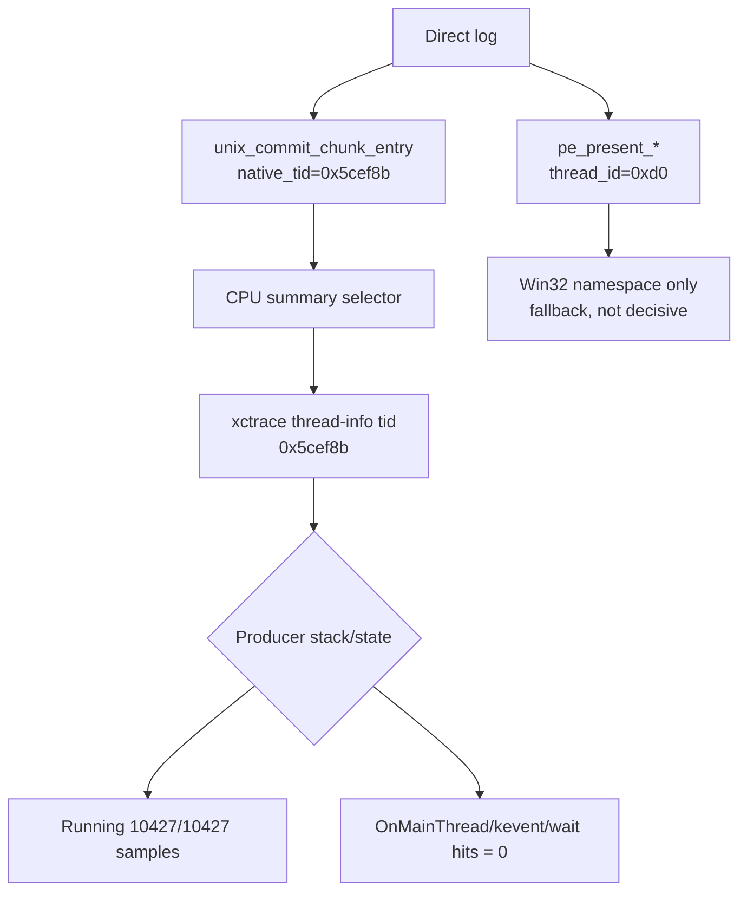

# Present-Pacing 31 - Native-Selector xctrace CPU Scout

> **Outdated — every artifact this leaf cites in `source:` is gone from disk.** The numbers below cannot be re-derived or re-checked. Kept as history; do not cite it as current evidence.

## Question

After [present-pacing-xctrace-cpu-summary-current.30](present-pacing-xctrace-cpu-summary-current.30.md) proved PE
`GetCurrentThreadId()` is not an xctrace-native thread id, can unix replay
boundary telemetry select the real producer thread and validate the winemac
`OnMainThread` transmission hypothesis?

## Run

```sh
bash scripts/tools/run_3dmark05_system_trace_sidecar.sh \
  --export-cpu-summary \
  --cpu-producer-from-pe-log \
  --record-delay-sec 75 \
  --time-limit-sec 10 \
  --min-free-mb 1800 \
  -- \
  --suffix winemac-onmainthread-xctrace-r3 \
  --no-gputrace \
  --timeout 120 \
  --frame-sampling
```

The run was timeout-finalized by the supervised 3DMark05 policy
(`returncode=143`, `timed_out=true`) but produced complete artifacts and
`status=pass`.

## Selector Result

The new unix replay-boundary telemetry produced a stable native selector:

| Metric | Value |
|---|---:|
| `unix_commit_chunk_entry native_tid=...` rows | `40,044` |
| Unique native thread ids | `1` |
| Native selector | `0x5cef8b` |
| PE `pe_present_* thread_id=...` rows | `46,031` |
| Unique PE thread ids | `1` |
| PE thread id | `0xd0` |

The CPU summary selected the native id and matched xctrace `thread-info tid`:

```json
{
  "status": "producer-running-negative-scout",
  "producer_selection": "0x5cef8b",
  "producer_selection_source": "native-log-commit-chunk-entry",
  "producer_tid": "0x5cef8b",
  "producer_sample_rows": "10427",
  "producer_sample_running_rows": "10427",
  "producer_sample_blocked_rows": "0",
  "producer_wait_keyword_hits": "0",
  "nonproducer_wait_keyword_hits": "2"
}
```

This closes the H36 namespace problem: PE ids are still Win32 ids, but the
direct log now also carries a native id that can select the same thread in
xctrace.

## Interpretation



The selected producer thread does not support the `OnMainThread` wait hypothesis
for this trace window. Any `kevent`/CAMetalLayer hits remain on callback-like or
encode-adjacent threads, not on the producer. Because `time-profile` samples
running stacks and the stacks were mostly raw PCs, this is still a scout result,
not an absolute proof that no short blocking call exists between samples.

## Pacing Context

The run still shows the average-FPS shape from the current low-overhead path:

| Metric | Value |
|---|---:|
| Frame samples | `1,645` |
| FPS p50 / p95 / max | `17.044 / 25.297 / 34.158` |
| Tail-600 FPS p50 | `14.633` |
| `completion_present_wait_ms / present` | `27.589ms` |
| `gpu_command_buffer_time_ms / present` | `2.978ms` |
| `completion_present_wait_with_enqueue_ms` | `0.000ms` |
| `completion_no_enqueue_wait_to_commit_chunk_entry` p50 / p95 | `1.004 / 3.300ms` |
| `commit_entry_to_publish` p50 / p95 | `16.701 / 38.664ms` |
| `completion_no_enqueue_wait_to_next_enqueue` p50 / p95 | `39.032 / 67.878ms` |
| `commit_chunk_replay_cpu_ms / present` | `8.916ms` |
| `commit_chunk_queue_draw_submission_snapshot_cpu_ms / present` | `3.743ms` |
| `encode_chunk_cpu_ms / present` | `14.597ms` |

The native producer selector makes the negative P4 scout stronger, but it does
not make the frame pipeline healthy. The same run still has no enqueue during
completion wait and spends substantial time in replay/snapshot and encode after
the wait.

## Metal Timing Context

The System Trace joined `1544/1544` encoder rows over seq `1066..1233`.
Stage sum was `5374.066ms`, with `93.92%` in vertex and `6.08%` in fragment.
`rt_change` still accounts for `77.58%` of stage time and `clear` for `21.96%`.
The top-30 rows remain opaque indexed, programmable-color-route heavy.

## Decision

Accepted as a native-selector negative scout:

- H36's id-mapping gap is solved for future sidecars by
  `unix_commit_chunk_entry native_tid=0x...`.
- This run does not find producer-thread `OnMainThread` / `kevent` /
  `dispatch_semaphore_wait` evidence.
- The active average-FPS lane should continue to focus on P2/P3 replay,
  snapshot, and encode serialization, while keeping P4 as a validation gate for
  future CPU wins.

Do not spend the next step on broad winemac `OnMainThread` unless a more
targeted threshold log or symbolicated producer stack contradicts this native
selector scout.
