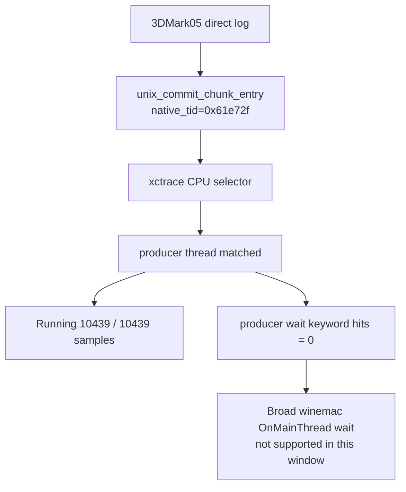

# Present-Pacing 32 - Default-On Resource-Shape Native-Selector xctrace Scout

## Question

After [state-churn-encode-encode-phase.81](../state-churn-encode/state-churn-encode-encode-phase.81.md) promotes the encode-slot
resource-shape PSO memo to default-on, does the same native-selector System
Trace path find producer-thread `OnMainThread` / wait evidence, or does the
average-FPS lane still point back at serialized replay/snapshot/encode work?

## Run

```sh
bash scripts/tools/run_3dmark05_system_trace_sidecar.sh \
  --export-cpu-summary \
  --cpu-producer-from-pe-log \
  --record-delay-sec 75 \
  --time-limit-sec 10 \
  --min-free-mb 1800 \
  -- \
  --suffix default-on-native-selector-xctrace-r1-20260615 \
  --no-gputrace \
  --timeout 120 \
  --frame-sampling
```

The sidecar enables all-frame encoder breakdown and PE recorder stats, so this
is not a low-overhead FPS baseline. It is a P4/native-selector scout plus
Metal-timing attribution sample. The wrapper completed with xctrace status `0`,
probe wrapper status `0`, and `status=pass` from the supervised 3DMark05 run.
The output frame is visually normal: machine-gun muzzle bloom, robot, scene
lighting, textures, and HUD render.

## CPU Selector Result

The CPU summary again selected the unix replay-boundary native thread id:

| Field | Value |
|---|---:|
| Producer selector | `0x61e72f` |
| Selector source | `native-log-commit-chunk-entry` |
| Producer thread | `3DMark05.exe (0x61e72f)` |
| Producer profile weight | `10434.000ms` |
| Producer sample rows | `10,439` |
| Producer running rows | `10,439` |
| Producer blocked rows | `0` |
| Producer wait keyword hits | `0` |
| Non-producer wait keyword hits | `3` |

```json
{
  "status": "producer-running-negative-scout",
  "producer_selection": "0x61e72f",
  "producer_selection_source": "native-log-commit-chunk-entry",
  "producer_tid": "0x61e72f",
  "producer_sample_rows": "10439",
  "producer_sample_running_rows": "10439",
  "producer_sample_blocked_rows": "0",
  "producer_wait_keyword_hits": "0",
  "nonproducer_wait_keyword_hits": "3"
}
```

Keyword hits are still on non-producer or encode-adjacent threads:
`CAMetalLayer=52`, `presentDrawable=37`, `nextDrawable=18`, `kevent=3`.
The selected producer itself has none of those wait keywords.



## Pacing Context

Because this sidecar logs all-frame encoder breakdown, the stage timings are
inflated relative to low-overhead scouts. They still show the same structural
shape: no enqueue during completion wait, then large work after the wait.

| Metric | Value |
|---|---:|
| `present_encoded` | `1,500` |
| `sampled_avg_fps` | `15.026` |
| `completion_present_wait_ms / present` | `25.208ms` |
| `gpu_command_buffer_time_ms / present` | `2.847ms` |
| `completion_present_wait_with_enqueue_ms` | `0.000ms` |
| `completion_wait_without_enqueue_ms` | `37811.365ms` |
| `completion_enqueue_while_waiting` | `0` |
| `wait -> commit_chunk_entry` p50 / p95 | `1.184 / 5.392ms` |
| `commit_entry -> publish` p50 / p95 | `34.071 / 64.333ms` |
| `publish -> encode_dequeue` p50 / p95 | `0.417 / 0.650ms` |
| `encode_dequeue -> command_buffer_commit` p50 / p95 | `26.705 / 37.060ms` |
| `wait -> next_enqueue` p50 / p95 | `62.566 / 103.845ms` |
| `commit_chunk_replay_cpu_ms / present` | `8.838ms` |
| `commit_chunk_queue_draw_submission_snapshot_cpu_ms / present` | `3.707ms` |
| `encode_chunk_cpu_ms / present` | `14.477ms` |
| `encode_draw_cpu_ms / present` | `11.786ms` |
| `encode_slot_pso_prefetch_cpu_ms / present` | `1.389ms` |

The default-on resource-shape memo is active in this run:
`resource_shape_memo_hits=136,785`, overflow `0`,
`encode_draw_pso_prefetch_handle_missing=0`,
`draw_skipped_no_pipeline=0`, and `gpu_command_buffer_errors=0`.

## Metal Timing Context

The sidecar joined `1535/1535` encoder rows over seq `1088..1256`.
Stage sum is `4672.696ms`, with `91.71%` in vertex and `8.29%` in fragment.
The end-reason split remains dominated by `rt_change`:

| Group | Stage share | Vertex share |
|---|---:|---:|
| `rt_change` | `85.09%` | `93.58%` |
| `clear` | `14.39%` | `83.73%` |
| `present` | `0.53%` | `6.58%` |

Route verdicts remain programmable:

| Group | Stage share | Vertex share |
|---|---:|---:|
| `needs-programmable-color-route` | `57.88%` | `96.54%` |
| `needs-programmable-textured-route` | `28.40%` | `85.72%` |
| `mixed-programmable-route` | `13.01%` | `83.25%` |

This is a System Trace timing view, not an Xcode `.gputrace` counter export, so
it does not expose `VS Buffer Device Memory Bytes Written`. It is still useful
for confirming that the captured window remains vertex-stage dominated and that
the top rows are opaque indexed programmable-color routes.

## Decision

Accepted as another native-selector negative scout. The current default-on
resource-shape path does not make broad winemac `OnMainThread` a better
explanation for the average-FPS cap: the selected producer thread is sampled
running for the full window and has zero wait-keyword hits. The remaining
wallclock problem is still serialized no-enqueue cadence: replay/snapshot work
before publish and backend encode before Metal commit run after completion wait
instead of being hidden under it.

Do not use the sidecar's `15.026` sampled FPS as a baseline regression verdict;
all-frame encoder breakdown is intentionally heavy. Use low-overhead
no-gputrace scouts for FPS promotion, and use native-selector sidecars as the
P4 validation gate when a CPU change claims to recover overlap.

## Next Gate

- Average-FPS work should target replay/snapshot/encode serialization, not
  broad winemac `OnMainThread`, unless a targeted threshold log contradicts the
  native-selector negative scouts.
- A CPU optimization is not an FPS claim unless it lowers completion wait or
  creates nonzero `completion_wait_with_enqueue_ms` in a low-overhead run.
- Future System Trace sidecars should keep the native selector path and use
  lower-overhead seq-range encoder breakdown when route attribution is not the
  primary question.

**Related.** [present-pacing-native-selector-xctrace.31](present-pacing-native-selector-xctrace.31.md) ·
[state-churn-encode-encode-phase.81](../state-churn-encode/state-churn-encode-encode-phase.81.md) · [present-pacing](../present-pacing.md).
