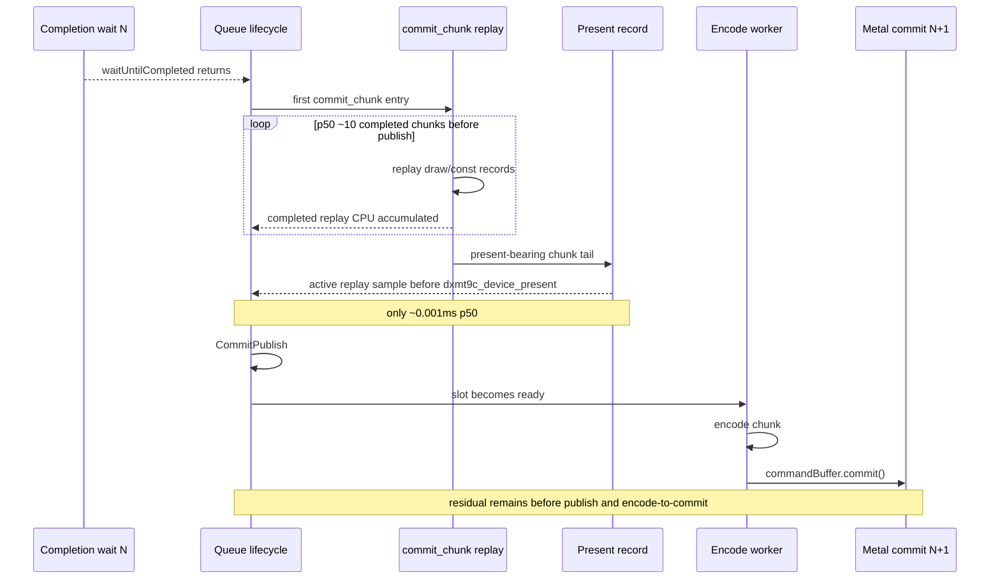

# Present Pacing 54 - Active Present-Chunk Replay Does Not Explain First-Publish Residual

## Question

The previous no-enqueue counters showed that the first `CommitPublish` after a
completion wait is preceded by many `commit_chunk` entries and completed
replays. The open attribution was whether the large
`commit entry -> publish` residual is actually replay work from the current
present-bearing chunk, which was invisible to the completed-replay counter
because `Present` publishes before the surrounding chunk replay ends.

This run adds an active replay counter sampled immediately before
`dxmt9c_device_present()` calls into the queue publish path:

```text
completion_no_enqueue_commit_chunk_active_replay_cpu_before_publish_*
```

## Verdict

No. The counter fires for every before-publish present-bearing chunk, but the
measured active replay time is effectively zero. The present-bearing chunks are
mostly a tiny `Present` tail after many earlier draw/const chunks have already
replayed. The remaining first-publish residual is therefore not hidden
present-chunk replay CPU.

The next attribution target is the queue publish boundary itself: the gap from
first `commit_chunk` entry to `CommitPublish` after subtracting completed
replay still needs to be split into queue slot/wait, publish formation, and
any uncounted pre-`recordNoEnqueueWaitGapToCommitPublish()` time.

## Run

```sh
bash scripts/tools/run_3dmark05_perf_probe.sh \
  --suffix noenqueue-active-replay-r1-20260616 \
  --no-gputrace \
  --no-encoder-breakdown \
  --frame-sampling \
  --timeout 120 \
  --capture-delay-sec 45 \
  --wait-unlocked-sec 1 \
  --wait-unlocked-interval-sec 1 \
  --min-free-mb 256
```

The run is valid as a no-gputrace scout: `status=pass`, `timed_out=true`,
`returncode=143`, `capture_error=None`, `draw_skipped_no_pipeline=0`, and
`gpu_command_buffer_errors=0`. The timeout is the expected final-frame cleanup
path, not a manual kill.

## P4 Shape

| Metric | Value |
|---|---:|
| `present_encoded` | `1,800` |
| sampled avg FPS | `16.726` |
| `gpu_command_buffer_time_ms_per_present` | `3.237` |
| `completion_wait_ms_per_present` | `27.490` |
| `completion_wait_with_enqueue_ms_per_present` | `0.325` |
| `completion_wait_without_enqueue_ms_per_present` | `27.165` |
| `commit_chunk_replay_cpu_ms_per_present` | `8.048` |
| `encode_chunk_cpu_ms_per_present` | `11.286` |

The run remains `under-pipelined-no-enqueue`. Only `1.184%` of completion wait
overlaps later enqueue work.

## First-Publish Attribution

| Metric | total ms/present | p50 ms | p95 ms |
|---|---:|---:|---:|
| commit entry -> publish | `15.280` | `13.077` | `26.992` |
| completed replay CPU before publish | `3.819` | `3.163` | `6.247` |
| active replay CPU before publish | `0.000` | `0.001` | `0.001` |
| residual after completed replay only | `11.461` | `n/a` | `n/a` |
| residual after completed + active replay | `11.461` | `n/a` | `n/a` |
| completed replay share of commit entry -> publish | `24.995%` | `n/a` | `n/a` |
| active replay share of commit entry -> publish | `0.003%` | `n/a` | `n/a` |
| completed + active replay share of commit entry -> publish | `24.998%` | `n/a` | `n/a` |

The active counter records `1,710` samples, but only `0.862ms` total. This
rejects the idea that the present-bearing chunk contains the missing
`~11.46ms/present`.

## Chunk Shape

| Metric | Value |
|---|---:|
| before-publish entries per sample | `14.102` |
| replay starts per sample | `14.111` |
| replay ends per sample | `13.309` |
| scanned chunks with draw | `92.899%` |
| scanned chunks with present | `7.091%` |
| draw records per publish sample | `358.406` |
| const records per publish sample | `336.867` |

This confirms the previous H53/H54 shape: producer work exists after the
completion wait, and it is draw/constant heavy, but the first actual publish is
still delayed.



## Decision

Keep the active replay counter; it is a useful guard against misattributing
future `Present` paths. Do not pursue present-bearing chunk replay as the next
average-FPS lever.

The next narrow instrumentation should split `commitCurrentChunk()` before
`recordNoEnqueueWaitGapToCommitPublish()`:

| Candidate split | Reason |
|---|---|
| commit slot wait / `writeCv->wait` after no-enqueue completion | Separates queue-capacity wait from publish formation. |
| pre-publish callback / `onBeforePublish` timing in the same sampled window | Existing global `prepare_slot_publish_cpu_ms` is only `0.233ms/present`, but same-cycle attribution would prove it is not hidden in the residual. |
| first-entry to publish idle/gap after completed replay | Distinguishes replay CPU from uncounted scheduling or lock handoff time. |

Any fix still needs the H57 locality gates: it must increase useful overlap
without increasing command buffers, render passes, or tile-preservation traffic.
