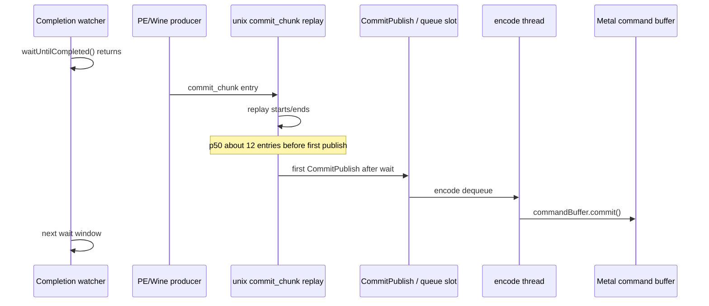
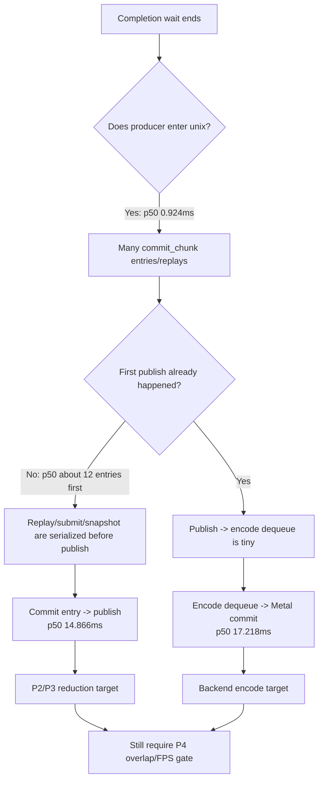

# Present Pacing 47 - No-Enqueue Commit Chunks Before Publish Scout

> **Outdated — every artifact this leaf cites in `source:` is gone from disk.** The numbers below cannot be re-derived or re-checked. Kept as history; do not cite it as current evidence.

**Question.** During a no-enqueue completion wait, is the producer truly idle
until the next command-buffer publish, or do `commit_chunk` entries/replays
already run before the first publish?

**Verdict.** `commit_chunk` work is already running before the first publish.
The older "producer absent" framing is too broad. The remaining exposed owner
is the serialized path from replay/submit/snapshot to `CommitPublish`, plus the
backend encode-to-Metal-commit stage.

## Run

```sh
bash scripts/tools/run_3dmark05_perf_probe.sh \
  --suffix noenqueue-beforepublish-r1 \
  --no-gputrace \
  --no-encoder-breakdown \
  --frame-sampling \
  --timeout 120 \
  --capture-delay-sec 45 \
  --wait-unlocked-sec 1 \
  --wait-unlocked-interval-sec 1 \
  --min-free-mb 256
```

The wrapper completed with `status=pass`, `timed_out=true`, and
`returncode=143`, which is the expected supervised final-frame timeout shape
for a no-gputrace scout. Health counters are clean:
`present_encoded=1800`, `draw_skipped_no_pipeline=0`,
`gpu_command_buffer_errors=0`, and `capture_error=None`. `actual.png` shows a
normal GT1 frame.

## Result

| Metric | Value |
|---|---:|
| `sampled_avg_fps` | `16.710` |
| `sampled_fps_p50` | `18.375` |
| `sampled_wall_ms_p50` | `54.422` |
| `completion_wait_ms_per_present` | `27.737` |
| `completion_wait_with_enqueue_ms_per_present` | `0.586` |
| `completion_wait_without_enqueue_ms_per_present` | `27.151` |
| `completion_wait_overlap_share` | `2.114%` |
| `gpu_command_buffer_time_ms_per_present` | `3.220` |
| `commit_chunk_replay_cpu_ms_per_present` | `8.611` |
| `commit_chunk_queue_draw_submission_cpu_ms_per_present` | `4.322` |
| `d3d9_snapshot_draw_submission_cpu_ms_per_present` | `3.582` |
| `d3d9_snapshot_cache_lookup_cpu_ms_per_present` | `2.981` |
| `encode_chunk_cpu_ms_per_present` | `11.227` |
| `encode_draw_cpu_ms_per_present` | `8.672` |

The new before-publish counters are the key attribution:

| Event | total | per publish sample | max | p50 | p95 |
|---|---:|---:|---:|---:|---:|
| `commit_chunk` entries before publish | `23,873` | `14.151` | `54` | `12` | `20` |
| replay starts before publish | `23,883` | `14.157` | `54` | `12` | `20` |
| replay ends before publish | `22,578` | `13.384` | `53` | `11` | `19` |

Values above `1` mean the next no-enqueue publish is not waiting for the first
unix-side command to appear. On a typical sample, about `12` `commit_chunk`
entries and starts have already happened before the first `CommitPublish` that
ends the no-enqueue gap.

## Stage Shape

| Stage | total ms/present | p50 ms | p95 ms |
|---|---:|---:|---:|
| wait -> commit chunk entry | `3.893` | `0.924` | `2.836` |
| commit entry -> publish | `15.325` | `14.866` | `28.036` |
| publish -> encode dequeue | `0.246` | `0.335` | `0.483` |
| encode dequeue -> command buffer commit | `12.518` | `17.218` | `24.620` |
| wait -> next enqueue | `32.345` | `15.635` | `50.578` |

The ordering is:





## Interpretation

This run rejects a simplistic "nothing enters unix before publish" explanation.
The app/PE/Wine side and unix replay are alive; they just do not produce a
command-buffer publish early enough to overlap the completion wait in a useful
way.

The next average-FPS candidates should therefore target:

| Area | Reason |
|---|---|
| `commit_chunk` replay/submit/snapshot | It owns the `commit entry -> publish` row and already includes `8.611ms/present` replay plus `4.322ms/present` queued draw submission. |
| Backend encode children | `encode dequeue -> command buffer commit` is still large, with `11.227ms/present` encode chunk CPU. |
| Explicit overlap design | Local CPU reductions must still prove movement in `completion_wait_with_enqueue`, `completion_wait_without_enqueue`, and frame sampling. |

**Decision.** Keep P4 as the proof gate, but stop treating the no-enqueue gap
as producer absence. The direct targets are first-publish formation and encode
commit latency.
