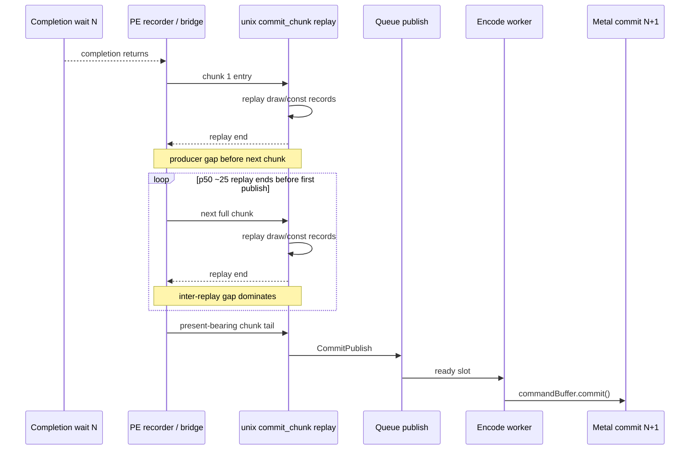

# Present Pacing 55 - Inter-Replay Producer Gap Explains First-Publish Residual

## Question

After [[present-pacing-noenqueue-active-replay.54]], the remaining
`commit entry -> publish` residual was not active present-chunk replay and not
queue publish wait. The next candidate was the wall time between completed unix
`commit_chunk` replays and the next `commit_chunk` entry from the PE producer.

This run adds:

```text
completion_no_enqueue_commit_chunk_inter_replay_gap_before_publish_*
completion_no_enqueue_commit_publish_wait_before_publish_*
completion_no_enqueue_commit_publish_on_before_publish_cpu_*
```

## Verdict

Accepted. The first-publish residual is almost exactly explained by
inter-replay producer gaps plus completed replay CPU. Queue publish wait is
zero, active present replay is effectively zero, and `onBeforePublish` is a
small post-publish callback that belongs to the next stage.

This changes the next optimization question. The largest P4 owner is not
Metal completion, queue capacity, or hidden `Present` replay. It is the
producer/bridge cadence that delivers many draw/const-heavy chunks only after
the previous completion wait has already ended.

## Run

```sh
bash scripts/tools/run_3dmark05_perf_probe.sh \
  --suffix noenqueue-inter-replay-gap-r1-20260616 \
  --no-gputrace \
  --no-encoder-breakdown \
  --frame-sampling \
  --timeout 120 \
  --capture-delay-sec 45 \
  --wait-unlocked-sec 1 \
  --wait-unlocked-interval-sec 1 \
  --min-free-mb 256
```

The run is a valid attribution scout: `status=pass`, `timed_out=true`,
`returncode=143`, `capture_error=None`, `draw_skipped_no_pipeline=0`, and
`gpu_command_buffer_errors=0`. It encoded `1,380` presents before timeout, so
do not use its FPS as a clean current baseline. Use the attribution rows.

## P4 Shape

| Metric | Value |
|---|---:|
| `present_encoded` | `1,380` |
| sampled avg FPS | diagnostic-only |
| `gpu_command_buffer_time_ms_per_present` | `2.849` |
| `completion_wait_ms_per_present` | `25.331` |
| `completion_wait_with_enqueue_ms_per_present` | `0.144` |
| `completion_wait_without_enqueue_ms_per_present` | `25.188` |
| `completion_wait_overlap_share` | `0.568%` |
| `commit_chunk_replay_cpu_ms_per_present` | `10.082` |
| `encode_chunk_cpu_ms_per_present` | `13.765` |

The run remains `under-pipelined-no-enqueue`: almost all completion wait is
still followed by producer/encode work instead of overlapping it.

## First-Publish Attribution

| Metric | total ms/present | p50 ms | p95 ms |
|---|---:|---:|---:|
| commit entry -> publish | `29.191` | `53.139` | `81.586` |
| completed replay CPU before publish | `6.833` | `11.494` | `18.816` |
| active replay CPU before publish | `0.001` | `0.001` | `0.001` |
| inter-replay producer gap before publish | `22.399` | `41.173` | `62.479` |
| commit publish wait before publish | `0.000` | `0.000` | `0.000` |
| post-publish onBeforePublish CPU | `0.271` | `0.462` | `0.693` |
| residual after completed replay only | `22.357` | `n/a` | `n/a` |
| residual after completed + active replay + inter-replay gap | `-0.042` | `n/a` | `n/a` |

Attribution shares:

| Owner | Share of `commit entry -> publish` |
|---|---:|
| completed replay CPU | `23.409%` |
| active present replay | `0.002%` |
| inter-replay producer gap | `76.732%` |
| queue publish wait | `0.000%` |
| completed + active + inter-replay gap | `100.143%` |

The slight over-closure is expected clocking noise from summing adjacent
instrumentation windows. It is small enough to treat the residual as explained.

## Chunk Shape

| Metric | Value |
|---|---:|
| before-publish entries per sample | `17.846` |
| replay starts per sample | `17.863` |
| replay ends per sample | `17.044` |
| chunks with draw | `94.4%` |
| chunks with present | `5.6%` |
| draw records per publish sample | `492.678` |
| const records per publish sample | `443.636` |
| p50 records per scanned chunk | `64` |

This is a producer cadence problem: the next publish is waiting for a sequence
of full draw/const chunks to arrive and replay after completion, not waiting
inside queue publish.



## Decision

The next FPS-facing design should target producer/bridge cadence, not queue
publish wait:

| Candidate direction | Why it matches the evidence |
|---|---|
| PE chunk run-ahead across completion wait | The missing time is between chunks, after completion, before first publish. |
| earlier logical publish without extra Metal CB/pass fragmentation | Draw-count chunk limits proved overlap but failed locality gates; the carrier must preserve pass shape. |
| compact PE chunk cadence or coarser batching before the completion boundary | The p50 scanned chunk is full (`64` records), so the producer is not dribbling tiny chunks. |
| N-1 state elision / replay CPU reduction | Still useful for the `23%` completed-replay owner, but insufficient alone for P4 overlap. |

Do not spend `.gputrace` on this path yet. The next proof should be another
no-gputrace P4 A/B with H57 locality gates, because the problem is CPU/producer
cadence rather than a frame-local GPU encoder issue.
