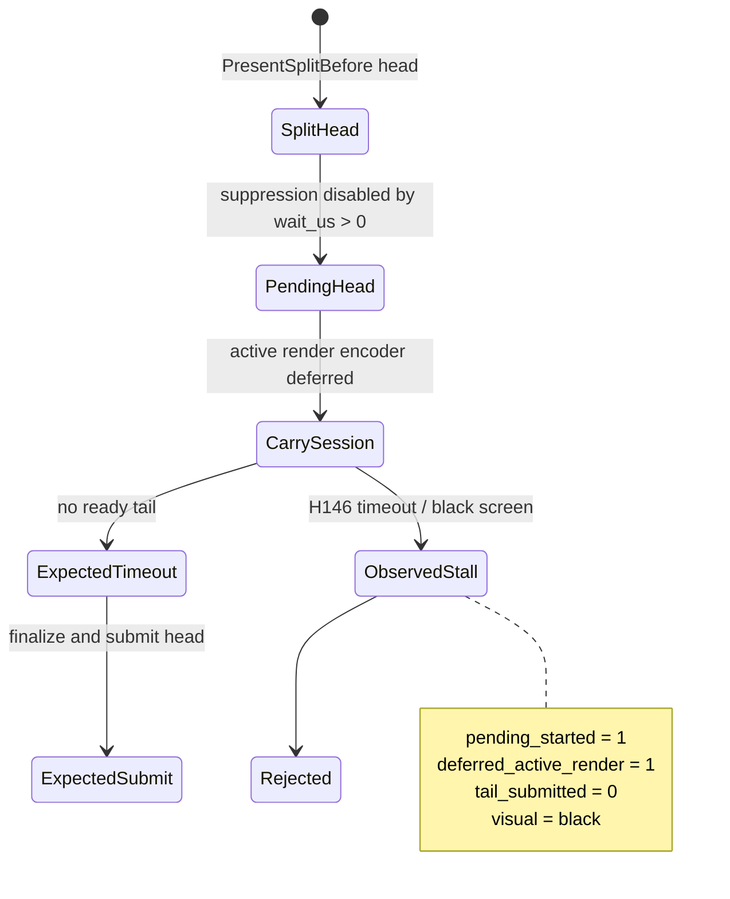

# Present-Pacing H146 - Open-CB Bounded Pending-Tail Wait

> **Outdated — the knob or code path this experiment measured no longer exists in `src/`.** It cannot be re-run. Kept as history; do not cite it as current evidence.

## Question

If H140 suppression is relaxed only behind a bounded release policy, can the
open-CB carrier start a pre-Present pending head, wait briefly for a Present
tail, then finalize/submit the head without reintroducing the old black-screen
failure?

## Run

```text
bash scripts/tools/run_3dmark05_perf_probe.sh \
  --suffix h146-open-cb-bounded-tailwait1ms-r1 \
  --frame 60 --no-gputrace --timeout 120 --wait-unlocked-sec 10 \
  --keep-frontmost --frame-sampling \
  --open-cb-preencode-tail-present \
  --open-cb-carry-render-session \
  --open-cb-pending-tail-wait-us 1000 \
  --stage-pre-present-command-limit 128
```

This added the opt-in env `DXMT9_OPEN_CB_PENDING_TAIL_WAIT_US=1000`.
Default `0` keeps the H140 suppression behavior.

## Verdict

Rejected. The run times out and the captured window is a pure black frame
(`mean_luma=0.0`, `variance=0.0`). That fails the no-gputrace visual gate before
any FPS or locality claim.

The important part is that the branch is no longer inert:

| Metric | Value | Meaning |
|---|---:|---|
| `open_cb_tail_present_pending_started` | `1` | H140 suppression was bypassed and one pending head started |
| `open_cb_tail_present_pending_suppressed_no_tail` | `0` | the new opt-in gate did what it was meant to do |
| `encode_session_carry_deferred_chunks` | `1` | a carried render session was created |
| `encode_session_carry_deferred_active_render_chunks` | `1` | the carried session contained an active render encoder |
| `open_cb_tail_present_tail_appended` | `0` | no coherent Present tail was appended |
| `open_cb_tail_present_tail_submitted` | `0` | no successful tail submission happened |
| `open_cb_tail_present_pending_tail_wait_timeout` | `0` in frame log | no observed release completion before the app stalled |
| `open_cb_tail_present_pending_timeout_submitted` | `0` in frame log | no observed timeout-submitted head before the app stalled |
| `present_encoded` | `2` across the two frame samples | the app does not progress past startup/early GT1 |
| `sampled_avg_fps` | `0.193` | timeout/stall signature, not a perf sample |

The final run counters are missing because the launcher timed out and was
terminated (`returncode=143`). The frame-sampling log is therefore the
authoritative source for this failure mode.

## State



## Implication

This is not a hardware wall. It is a runtime-shape rejection for the current
open-CB/pending-head carrier. The experiment proves the branch can enter the
deferred-head state, but also that simply relaxing suppression behind a short
wait is not a safe promotion path.

Do not spend `.gputrace` on H146. The branch fails the no-gputrace visual gate.
Next work should move to one of two safer tracks:

- low-risk CPU materialization/copy-width reduction, especially N-1 state
  elision and append materialization width, with replay/queue/encode counters as
  proof;
- a smaller P4 diagnostic that can explain why the pending head does not reach
  timeout-submit before the app stalls, without keeping an uncommitted render
  command buffer as the main correctness mechanism.

Update: [present-pacing-encode-session-pass-streaming-runtime.147](present-pacing-encode-session-pass-streaming-runtime.147.md) fixes the
session-lifetime/fail-open failure class and retests bounded wait. The updated
2ms run no longer black-screens and records `timeout_submitted=2,364`, proving
the fail-open path. Longer waits reduce timeout fragmentation (`163` at 8ms,
`3` at 16ms) and the 16ms PE-stats capture shows no reproduced `0x8876086c` /
`D3DERR_INVALIDCALL` failure, but the candidate still fails promotion because
the short 16ms scout remains above baseline tile preservation and worse on
no-enqueue completion wait.
