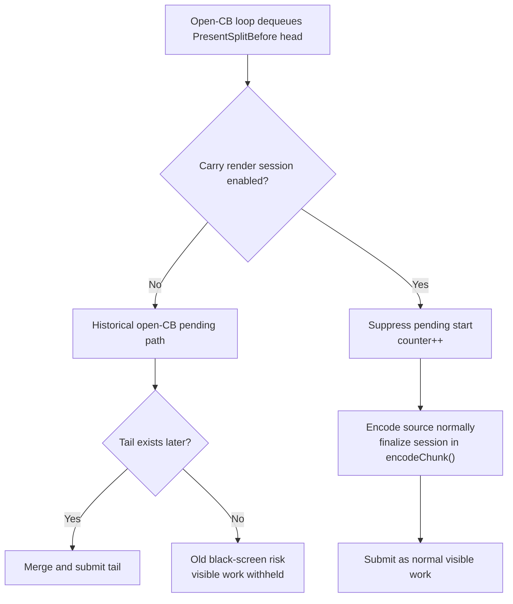

# Present Pacing / Open-CB Carry Safety Guard 140

**Question.** Can the known black-screen open-CB render-session carry path be
made fail-safe before a real external session finalizer exists?

**Implementation.** Yes, but only as a safety guard, not a P4 win. When
`DXMT9_OPEN_CB_CARRY_RENDER_SESSION=1` is active, the open-CB encode loop no
longer starts a pending active-render head just because the current source is a
`PresentSplitBefore` open head. Without a ready tail or a public fail-open
finalizer, that shape was H135's black-screen owner: visible draw work was
encoded into a deferred session and withheld from Metal.

The guard records:

```text
open_cb_tail_present_pending_suppressed_no_tail
```

so a no-gputrace run can prove that the carry path degraded to normal
submission rather than silently exercising the old pending-head path.



## Non-Claims

- This does not recover P4 overlap.
- This does not make H108/H134 a promotable runtime candidate.
- This does not replace the H139 fail-open contract. A real P4 carrier still
  needs either a tail-ready dequeue shape or an external session finalizer that
  can safely flush and submit the visible head when the tail is absent.

## Runtime Gate

The no-gputrace guard check used the old failing knob set:

```sh
DXMT9_OPEN_CB_PREENCODE_TAIL_PRESENT=1 \
DXMT9_OPEN_CB_CARRY_RENDER_SESSION=1 \
DXMT9_STAGE_PRE_PRESENT_COMMAND_LIMIT=128 \
bash scripts/tools/run_3dmark05_perf_probe.sh \
  --suffix h140-open-cb-carry-guard-r1 \
  --no-gputrace --timeout 120 --keep-frontmost --frame-sampling
```

## Runtime Result

The run timeout-finalized after complete artifacts were written, which is valid
for this 3DMark05 wrapper class. It did not reproduce the H134/H135 black-screen
failure.

| Signal | Value |
|---|---:|
| `status` | `pass` |
| `timed_out` | `true` |
| `capture_error` | `None` |
| `present_encoded` | `1,680` |
| `draw_skipped_no_pipeline` | `0` |
| `gpu_command_buffer_errors` | `0` |
| `open_cb_tail_present_pending_started` | `0` |
| `open_cb_tail_present_pending_suppressed_no_tail` | `3,516` |
| `open_cb_tail_present_head_appended` | `0` |
| `open_cb_tail_present_tail_appended` | `0` |
| `open_cb_tail_present_tail_submitted` | `0` |
| `encode_session_carry_deferred_active_render_chunks` | `0` |
| `encode_session_carry_forced_finalize_initializer_wait_active_render` | `0` |
| `sampled_avg_fps` | `15.732` |
| `completion_wait_ms_per_present` | `35.279` |
| `completion_wait_with_enqueue_ms_per_present` | `25.144` |
| `completion_wait_without_enqueue_ms_per_present` | `10.135` |
| `encode_dequeue_ready_depth_max` | `3` |

Interpretation:

- `open_cb_tail_present_pending_suppressed_no_tail=3,516` proves the guard ran.
- `open_cb_tail_present_pending_started=0` proves the old deferred-head
  black-screen path was not entered.
- `actual.png` is a normal effects-heavy GT1 frame, not the H134/H135 black
  screen.
- The run is not a performance candidate: it shifts wait into the
  with-enqueue bucket and raises total completion wait to `35.279ms/present`.

## Decision

Accept H140 as a default-off safety guard for the broken open-CB carry path.
Do not promote it as P4 overlap or schedule `.gputrace` from this result. The
next promotable carrier still needs a tail-ready dequeue or external session
finalizer that preserves render-pass locality and passes the `v0.0.3` visual
gate.
