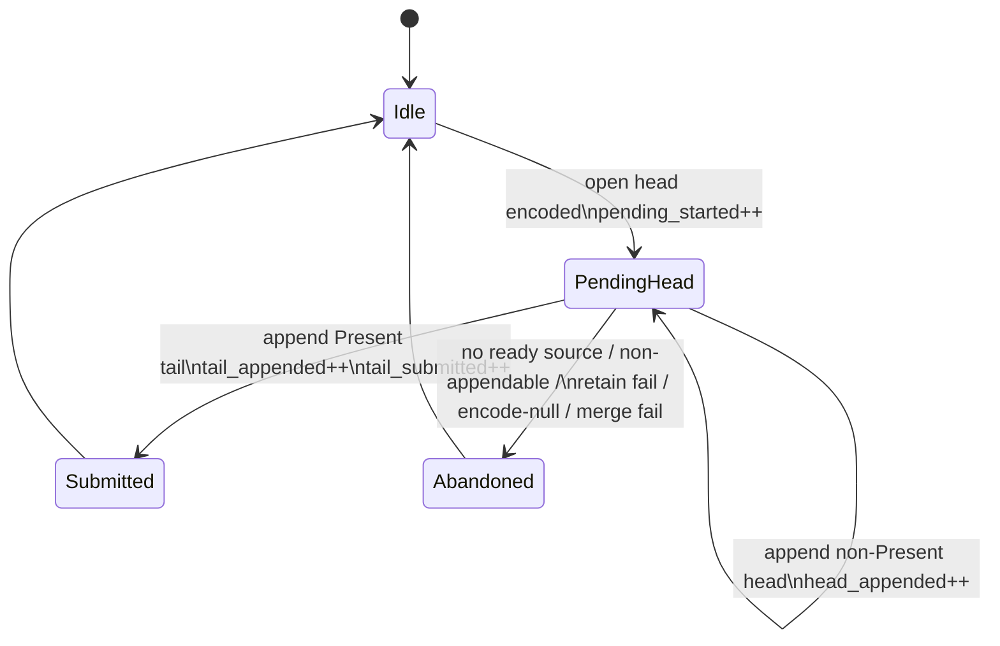

# Present Pacing / Open-CB Carry State Counters 135

> **Outdated — the knob or code path this experiment measured no longer exists in `src/`.** It cannot be re-run. Kept as history; do not cite it as current evidence.

**Question.** Does H134 fail because the open-CB render-session carrier reaches
a Present tail and then fails finalization, or because the pending head never
reaches a coherent tail submission?

**Instrumentation.** H135 adds default-on perf counters on the default-off
open-CB path:

- pending head creation;
- non-Present head append;
- Present-tail append and final submit;
- abandon reasons: no ready source, non-appendable source, retain failure,
  encode-null, and merge failure.

The summary script also reports these counters from `[dxmt9-perf-frame ...]`
deltas. This matters for black-screen/timeout runs, where the process can exit
before the cumulative `[dxmt9-perf]` line is emitted.



## Runtime

```sh
DXMT9_OPEN_CB_PREENCODE_TAIL_PRESENT=1 \
DXMT9_OPEN_CB_CARRY_RENDER_SESSION=1 \
DXMT9_STAGE_PRE_PRESENT_COMMAND_LIMIT=128 \
bash scripts/tools/run_3dmark05_perf_probe.sh \
  --suffix h219-open-cb-carry-state-r1 \
  --no-gputrace --timeout 120 --keep-frontmost --frame-sampling
```

## Result

The run failed the visual gate with a fully black screenshot, but produced the
needed frame-sampled counters:

| Metric | Value |
|---|---:|
| status | `fail` / black screen |
| sampled non-empty frames | `1` |
| frame 1 wall time | `5205.805ms` (`0.192fps`) |
| frame 1 draw calls | `329` |
| frame 1 render passes | `11/11` |
| frame 1 command buffers | `2` |
| frame 1 GPU CB time | `0.785ms` |
| frame 1 GPU errors | `0` |

Open-CB carry deltas for the sampled non-empty frame:

| Event | Sampled Total |
|---|---:|
| session deferred chunks | `1` |
| session deferred active-render chunks | `1` |
| session final chunks | `0` |
| pending started | `1` |
| head appended | `0` |
| tail appended | `0` |
| tail submitted | `0` |
| abandoned: no ready source | `0` |
| abandoned: non-appendable source | `0` |
| abandoned: retain failed | `0` |
| abandoned: encode returned null | `0` |
| abandoned: merge failed | `0` |

## Interpretation

The failed shape is narrower than the H134 wording. The carrier is not reaching
a Present tail and then losing finalization. It starts one pending active-render
head and then never appends or submits a tail before the process is terminated.
Because that pending head owns the only substantial frame work, the visible
frame stays black.

```mermaid
sequenceDiagram
  participant App as D3D9 app
  participant Q as dxmt9 encode queue
  participant H as pending head
  participant T as expected Present tail
  participant GPU as Metal GPU

  App->>Q: publish pre-Present draw-heavy slot
  Q->>H: encode into open command buffer
  Q->>H: retain source; do not submit yet
  Note over H: active render session deferred
  Q-->>T: waits for appendable next source
  T--xQ: no tail is observed before timeout
  H--xGPU: frame work never submitted
  App-->>App: visual gate sees black frame
```

This is a carrier-design wall, not a GPU hardware floor. The present/pacing
opportunity from H127 is still real, but the current open-CB implementation
withholds visible work while waiting for the tail. A promotable overlap design
must either:

- avoid holding the only visible head while waiting for a tail;
- add a correct idle/fail-open publish path that preserves completion ordering
  and does not regress pass/tile locality; or
- abandon this carrier and return to serial replay/encode cost reduction
  (`RunBatch` state elision, uniform/state carrier compaction, and copy policy).

## Verdict

Do not spend Xcode/gputrace time on the H134/H135 open-CB render-session carry
shape. It fails before GPU counters are meaningful. The next P4 attempt needs a
different logical run-ahead carrier with an explicit publish/finalize ordering
contract, or the work should move back to lower-risk CPU copy elimination.

## Verification

```sh
python3 -m pytest tests/scripts/test_summarize_3dmark05_perf.py -q
meson compile -C build-arm64-nowine
meson compile -C build-x86_64-builtin
meson test -C build-arm64-nowine dxmt9-queue-completion-sources-spec
meson test -C build-arm64-nowine dxmt9-perf-docs-source-audit
git diff --check
```
