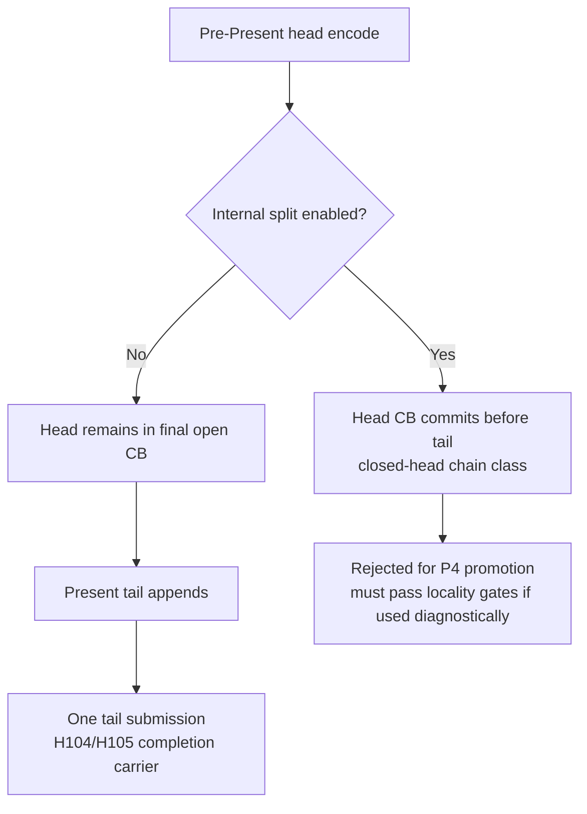

# Present Pacing / Open-CB Encode Split Guard Options 106

**Question.** What must be prevented before a pre-Present head can be encoded
early and still remain an open command buffer for the Present tail?

**Answer.** The encoder must be able to suppress internal sub-command-buffer
commits for that path. Current default `MidChunkCommitPolicy` is
`PerRenderPass`, so a pre-encoded head can commit sub-CBs before the tail if it
crosses render-pass boundaries. `DXMT9_SPLIT_PRESENT_ACQUIRE` can also commit
the pre-Present work immediately before encoding Present. Both are valid for
the current default path, but invalid for an open-CB carrier.

H106 adds `EncodeChunkOptions` with two default-off guards:

- `disableMidChunkCommits`
- `disablePresentAcquireSplit`

Existing callers use the default options, so runtime behavior is unchanged.
The options only make the next open-CB split explicit and reviewable.

## Risk Shape

## Current Meaning

| Area | Meaning |
|---|---|
| Default renderer | unchanged; options default to false |
| H104/H105 carrier | now has the encode-side split guards it will need |
| Runtime P4 claim | not yet present |
| Next implementation | pass an existing command buffer / record into a tail append encoder |

The remaining runtime work is still the hard part: `encodeChunk()` creates a
fresh command buffer today. The next split must let a head record own the
uncommitted command buffer, then let a later Present-tail encode append to that
same command buffer and finalize the H105 merged record. Only then should the
no-gputrace P4/locality and `v0.0.3` visual gates be run.
