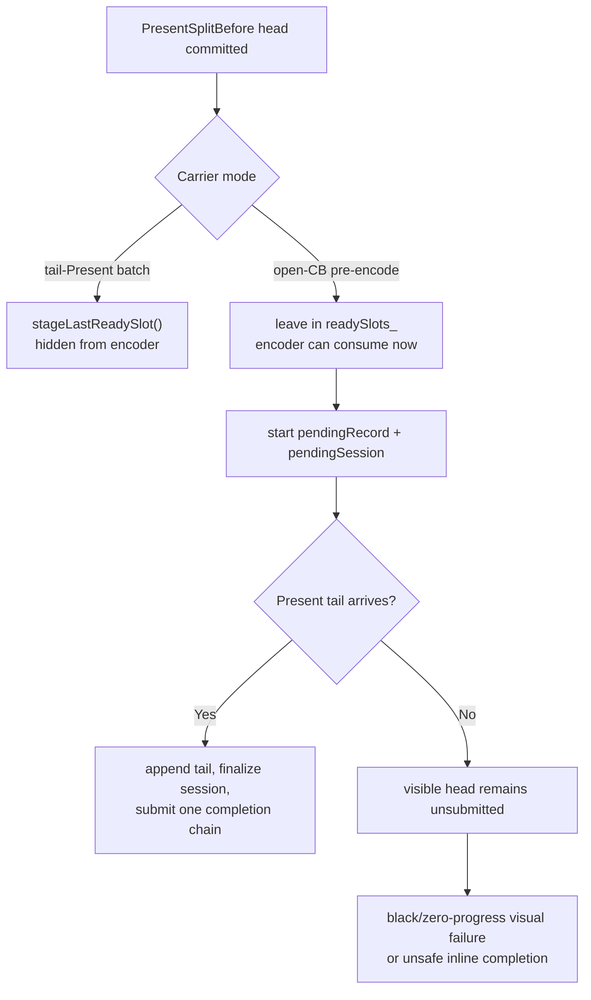
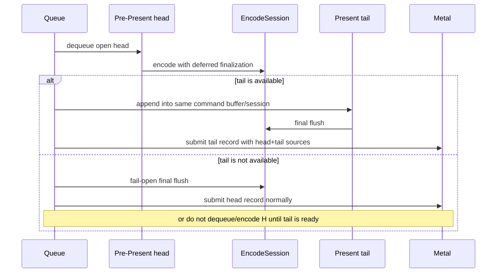

# Present Pacing / Open-CB Fail-Open Contract 139

**Question.** Is the H134/H135 black-screen result evidence that the P4
overlap lane is a dead end, or does it identify a narrower contract that the
next carrier must satisfy?

**Verdict.** It is a narrower carrier-contract failure, not a hardware or P4
wall. The current open-CB path can start encoding a visible pre-Present head
before a Present tail exists, then withhold that work from Metal while it waits
for an appendable tail. A promotable carrier must be fail-open: if the tail is
not available, the already encoded visible head must either be submitted through
the normal finalizer path or the design must avoid starting an unsubmitted
visible head in the first place.

## Source Audit

`commitAndStageCurrentPrePresentSlotUnlocked()` has two different publication
contracts:

- tail-Present batching stages the committed pre-Present head into
  `stagedTailPresentSlots_`, hiding it from the encode loop until the Present
  tail can release the complete prefix;
- open-CB pre-encode returns after committing the pre-Present slot, leaving the
  head encode-visible in `readySlots_`.

That second path is what lets `runOpenCbTailPresentEncodeLoop()` dequeue a
draw-heavy pre-Present head before a tail is known to exist.

The encode loop confirms the failure shape:

- `sourceIsOpenHead` starts a pending record and retains the source;
- the record is not submitted when `pendingSession` is active and no Present
  tail has been appended;
- if the loop later drains with no ready source and a pending session, the
  current fallback calls the abandon path, completing retained sources inline
  rather than submitting the encoded visible work;
- H135's frame-sampled counters caught the earlier state: one pending active
  render head, zero tail appends, zero tail submits, and no final session.

This is why H134/H135 must not be promoted to `.gputrace`: the GPU never sees
a coherent frame transaction.

## Non-Issue: Session Reinitialization

One suspected cause was that `encodeChunk()` might reinitialize an injected
`EncodeChunkSession` on every append. Current source lowers that concern:
`initializeEncodeChunkSessionStorage()` has an `initialized` guard, so the
second call with the same session does not reset active render state, dirty
state, or encoder-local shadows.

This does not make the carrier safe. It only narrows the bug: the observed
black-screen path is the queue-side pending/publish contract, not a simple
session-storage reset.

## Required Contract Before Another Runtime Candidate

A future P4 carrier must satisfy these gates before any Xcode or `.gputrace`
run is useful:

1. **No hidden visible head without tail.** The carrier must not hold the only
   visible pre-Present frame work indefinitely while waiting for the tail.
2. **Fail-open publish.** If the tail is unavailable, submit the head through a
   normal finalizer/completion path or prove the head was never consumed from
   the visible ready lane.
3. **No inline completion of unsubmitted visible work.** Completion-source
   ordering must remain strict; retained draw work cannot be marked complete
   without Metal submission.
4. **Render-pass locality preserved.** The candidate must not recreate H108's
   final same-key reopen, command-buffer, render-pass, load/store, or tile
   preservation regressions.
5. **Visual-safe first.** The candidate must pass the `v0.0.3` visual gate with
   no skipped pipelines and no GPU command-buffer errors before `.gputrace`.

## Implication

The project is narrowed, not stuck. The P4 numerator from the pre-Present
prefix remains real, but another threshold sweep or open-CB boolean is
misaligned. The next useful work is either:

- a fail-open/render-pass-safe carrier that proves P4 movement without locality
  regression; or
- lower-risk serial CPU cleanup that reduces replay/snapshot/encode wall time
  while preserving the current visual-safe baseline.
