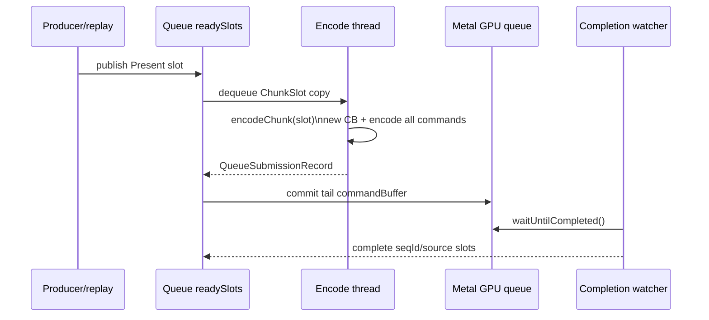
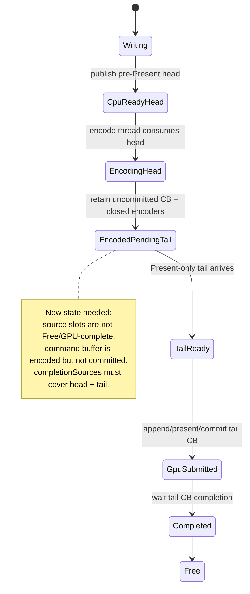

# Present Pacing / Open Command Buffer Pre-Encode Feasibility 103

**Question.** After H102, can dxmt9 recover P4 by simply opening a Metal command
buffer earlier, encoding the pre-Present head, and committing it when the
Present tail arrives?

**Answer.** Not with the current backend contract. The idea is plausible, but it
needs a new queue/backend carrier. Today `encodeChunk()` owns a whole-slot
transaction:

1. It creates a fresh `WMT::CommandBuffer` at chunk encode begin.
2. It owns all active render/blit encoder state as local variables.
3. It walks the entire `ChunkSlot::commandHeaders` stream.
4. It handles Present, frame sampling, capture stop, post-commit callbacks, and
   render-encoder GPU sample buffers inside the same call.
5. It returns one `QueueSubmissionRecord`.
6. `QueueLifecycleController::submit()` transitions sources to GPU and commits
   that record immediately.

H98's staged-tail path can delay visibility of pre-Present heads and later merge
them with a Present-only tail, but it still calls `encodeChunk()` only after the
tail exists. That preserves locality but cannot hide encode CPU inside the
completion wait. An open-CB design must add a third state: encoded/prepared
head work that is CPU-encoded but not Metal-committed until the Present tail.

## Current Contract

This contract has no place to store an uncommitted, partially encoded command
buffer or an active encoder state after `encodeChunk()` returns.

## Required New Carrier

The carrier must preserve these invariants:

| Area | Requirement |
|---|---|
| Source lifetime | Head slots cannot be freed or reused after pre-encode; they complete only when the final tail CB completes |
| Resource lifetime | `markSlotResourcesUnlocked()` must still retain every source until the tail completion waterline |
| Metal encoder lifecycle | No active render/blit encoder may cross an unsafe boundary unless the retained state formally owns it |
| Present semantics | `encodePresent()` and `presentDrawable` stay on the tail command buffer |
| Capture/frame sampling | capture stop, frame sampling, and post-commit callbacks fire once at the Present tail |
| Locality | final Metal submission must not increase command buffers, render passes, or tile preservation traffic |
| Visual gate | the candidate is not promotable without the `v0.0.3` GT1 visual gate |

## Practical Design Options

| Option | Shape | Pros | Risks |
|---|---|---|---|
| Encoded-head cache | encode pre-Present head into an uncommitted CB, store it until tail, append Present and commit | Directly hides head encode CPU; preserves one GPU submission if no split | Requires new queue state and retained encoder/CB ownership |
| Closed-head CB chain | encode and commit head CB before Present, commit tail later | Easier queue carrier; current mid-chunk chain model is similar | Reintroduces command-buffer/pass fragmentation and GPU overlap semantics change; resembles rejected draw-limit path |
| Producer cadence reduction | no new Metal carrier; reduce replay/snapshot cost so default slot publishes earlier | Lower correctness risk | May not hide the full `~13ms` encode chunk bucket |
| Framegraph retained plan | build a retained render plan before Present, encode at tail | Keeps Metal ownership simple | Hides less CPU unless plan build replaces expensive encode work |

The only option aligned with H99/H102 is the encoded-head cache or an equivalent
streaming encode carrier. Closed-head CB chains should remain diagnostic unless
they pass the existing locality gates.

## Next Implementation Gate

Before prototyping, add a deterministic native carrier test for:

1. head source enters an encoded-pending-tail state and is not visible as a
   normal ready slot;
2. tail release produces one `QueueSubmissionRecord` with completion sources for
   every head plus the tail;
3. head slots are freed only after the tail completion;
4. fallback to normal single-slot encode is preserved when no tail arrives.

Only after those queue invariants are covered should the encoder be split into
`beginPrePresentHeadEncode` / `finishPresentTailEncode` style primitives.
