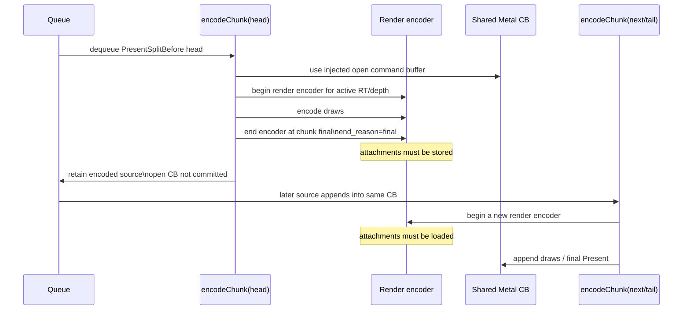
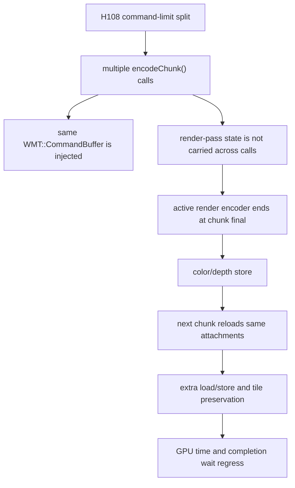

# Present Pacing / Open-CB Final-Pass Sidecar Attribution 110

**Question.** Why does H108 regress GPU/pass/tile cost even though it collapses
Metal command-buffer count?

**Answer.** The open command buffer is not enough. `encodeChunk()` still owns
render-encoder/pass state as per-call local state. When H108 splits the
pre-Present prefix by command limit, each split head finishes any active render
encoder at chunk end with `end_reason=final`. The next chunk then opens a new
render encoder and reloads the attachments. The result is extra render-pass
rows and load/store traffic inside one final Metal command buffer.

H110 extends `compare_3dmark05_perf_counters.py` to parse
`3dmark05-perf-encoders.csv` from output directories and report sidecar-derived
per-present rows for encoder end reasons and attachment load/store bytes.

## Evidence

The regenerated H108 comparison now includes:

| Metric | Control | H108 open-CB limit128 | Direction |
|---|---:|---:|---|
| `encoder_sidecar_rows_per_present` | `11.798` | `13.620` | pass count rises |
| `encoder_sidecar_rt_change_end_reason_per_present` | `7.870` | `7.787` | normal RT splits flat |
| `encoder_sidecar_clear_end_reason_per_present` | `2.929` | `2.764` | clear splits flat/down |
| `encoder_sidecar_present_end_reason_per_present` | `0.999` | `1.004` | present splits flat |
| `encoder_sidecar_final_end_reason_per_present` | `0.000` | `2.065` | new chunk-final splits |
| `encoder_sidecar_color_load_mib_per_present` | `6.301` | `19.018` | `+201.84%` |
| `encoder_sidecar_depth_load_mib_per_present` | `14.585` | `27.865` | `+91.05%` |
| `encoder_sidecar_color_store_mib_per_present` | `43.727` | `56.592` | `+29.42%` |
| `encoder_sidecar_depth_store_mib_per_present` | `56.287` | `65.363` | `+16.13%` |

This narrows the H109 failure. The extra pass rows are not primarily new
RT-change, clear, or present splits. They are chunk-final render encoder
closures created by the open-CB carrier itself.

## Mechanism

## Implication

The next pass-safe carrier cannot merely keep the Metal command buffer open.
It must do one of these:

1. carry active render encoder/pass state across staged chunks, which is a much
   larger backend contract than H108;
2. split pre-Present work only at proven render-pass-safe boundaries where no
   active color/depth preservation will be forced;
3. abandon open-CB pre-encode and return to direct replay/producer cadence
   reduction.

Do not spend `.gputrace` on H108 threshold sweeps. A future open-CB variant
must first show `encoder_sidecar_final_end_reason_per_present` stays flat and
color/depth load MiB per present do not rise, in addition to the existing
ready-depth, P4, locality, and `v0.0.3` visual gates. Use
`--require-encoder-final-end-reason-not-increase`,
`--require-encoder-color-load-not-increase`, and
`--require-encoder-depth-load-not-increase` on the no-gputrace comparison so
the probe/finalizer path enforces this before another Xcode capture.
